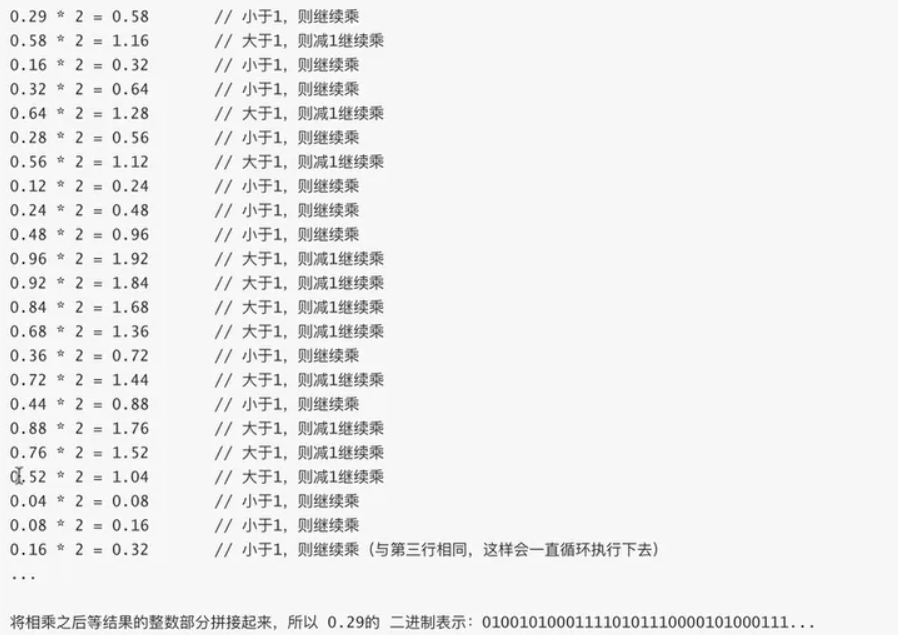
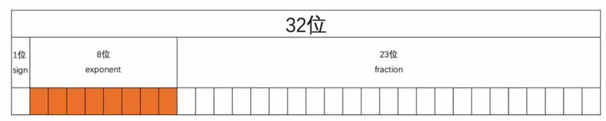

# Go数据类型

## 1 go语言中的数据类型

### （1）float32类型底层原理

浮点数：小数点可以浮动的数，称为浮点数。与浮点数对应的还有定点数，也就是小数点不能浮动的数。

> 举例：以100.23为例，如果存储成定点小数，此时如果小数点位置放错了，成了这样：1.0023，则最后的结果肯定错了。如果是浮点数，则小数点可以随意移动，可以表示成科学计数法的形式：1.0023*10^2，在计算中，数字都是2的正数幂表示，所以计算机中的表示方法一般都是某个小数乘以2^k。

float32如何如何将一个小数转成二进制数：

- 整数部分：就和普通十进制数转成二进制数一样
- 小数部分：让小数部分乘以2，如果得到的结果小于1，则继续乘以2，如果结果大于1，则将结果减去1再继续乘以2，直到结果刚好等于1为止，然后去每次乘积结果的整数部分的值为最终的二进制表示

小数转成二进制数示例：



float32的底层存储将一个小数分成符号部分+指数部分+尾数部分存储：



其中

- sign表示符号位，1表示负数，0表示正数
- exponent表示指数位，指定了⼩数点在数据中的位置，指数可以是负数，也可以是正数，指数位的⻓度越⻓则数值 的表达范围就越⼤；
- fraction表示尾数位，⼩数点右侧的数字，也就是⼩数部分，⽐如⼆进制 1.0011 x 2^(-2)，尾数部分就是 0011， ⽽且尾数的⻓度决定了这个数的精度，因此如果要表示精度更⾼的⼩数，则就要提⾼尾数位的⻓度；

float64的底层存储如下：

- 符号位：1位
- 指数位：11位
- 尾数位：52位

### **字符串和各种int类型之间的相互转换方式**

- string转成int

  ```go
  int, err := strconv.Atoi(string)
  ```

- string转成int64

  ```go
  int64, err := strconv.ParseInt(string, 10, 64)
  ```

- string转成uint64

  ```go
  uint64, err := strconv.ParseUint(string, 10, 64)
  ```

- int转成string

  ```go
  string := strconv.Itoa(int)
  ```

- int64转成string

  ```go
  string := strconv.FormatInt(int64, 10)
  ```

- uint64转成string(10进制)

  ```go
  string := strconv.FormatUint(uint64, 10)
  ```

- uint64转成string(16进制)

  ```go
  string := strconv.FormatUint(uint64, 16)
  ```

### FAQ

```go
var a = 100
```

上面代码中，变量`a`属于什么数据类型？是`int`、`int8`、`int16`、`int32`还是`int64`？

答：变量`a`默认是`int`数据类型。

如何查看变量作占用的字节数？

答：

```go
import "unsafe"

func main () {
    bytesOfVariable := unsafe.Sizeof(variable)
}
```


## Reference

1. https://blog.51cto.com/u_15076234/4119416