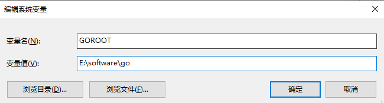

## 1 Go语言的诞生

### 1.1 GO语言的核心开发团队

1. Ken Thompson，1983年获得图灵奖，1998年获得美国国家技术奖，他与Dennis Ritchie是Unix系统的原创者。Thompson页发明了后来衍生出C语言的B语言，同时也是C语言的主要发明人。
2. Rob Pike，曾是贝尔实验室的Unix团队和Plan 9操作系统技术的成员，他与Thompson共事多年，并共创出广泛使用的UTF-8编码
3. Robert Griesemer，曾协助制作Java的Hotspot编译器和chrome浏览器中的JavaScript**V8引擎**。

### 1.2 Google创造GO语言的原因

1. 计算机硬件技术更新频繁，性能提升很快，Google认为目前主流的编程语言发展落后于硬件，**不能合理利用多核多CPU的优势**提升软件的系统性能
2. 软件系统复杂度越来越高，维护成本页越来越高，目前缺乏一个足够**简介高效**的编程语言，Google认为目前现有的编程语言有以下缺点：
   1. 代码风格不统一
   2. 计算能力不够
   3. 处理**大并发**不够好
3. C/C++项目程序运行速度虽然很快，但是编译速度很慢，同时还存在内存泄漏的一系列问题

### 1.3 GO语言的发展史

1. 2007年，谷歌工程师Rob Pike，Ken Thompson和Robert Griesemer开发设计了一门全新的语言，这时GO语言的最初原型
2. 2009年11月10日，google将GO语言以开放源代码的方式向全球发布
3. 2012 年 03 月 28 日，Go 语言的第一个正式版本 Go 1 发布。
4. 2015年8月19日，GO 1.5版本发布，本次更新中移除了“最后残余的C语言”
5. 2016 年 02 月 17 日，Go 语言 Go 1.6 版发布。
6. 2016 年 08 月 15 日，Go 语言 Go 1.7 版发布。
7. 2017 年 02 月 17 日，Go 语言 Go 1.9 版发布。
8. 2018 年 02 月 16 日，Go 语言 Go 1.10 版发布。
9. 2018 年 08 月 25 日，Go 语言 Go 1.11 版发布。
10. 2019 年 03 月 01 日，Go 语言 Go 1.12 版发布。
11. 2019 年 09 月 03 日，Go 语言 Go 1.13 版发布。
12. 2020 年 02 月 25 日，Go 语言 Go 1.14 版发布。
13. 2020 年 08 月 12 日，Go 语言 Go 1.15 版本发布。
14. 2021 年 02 月 17 日，Go 语言 Go 1.16 版本发布。
15. 2021 年 08 月 17 日，Go 语言 Go 1.17 版本发布。
16. 2022 年 03 月 15 日，Go 语言 Go 1.18 版本发布。

### 1.4 Go语言的特点

GO语言即具备静态编译开发语言的优点点（安全和高性能），又具备动态开发语言的优点（开发和维护效率高），GO=C+Python

1. GO语言从C语言中继承了很多理念，包括表达式语法、控制结构、基础数据类型、调用参数传值、指针等，也保留了和C语言一样的编译执行方式和弱化的指针
2. 引入包的概念，用于组织程序结构，GO语言的任何一个文件都要归属于一个包，而不能单独存在
3. 垃圾回收机制，内存自动回收，不需要开发人员管理内存
4. GO语言**天然支持高并发**
   1. 从语言层面支持并发，实现简单
   2. goroutine，轻量级线程，可实现大并发处理，高效利用多核
   3. 基于CPS并发模型（Communicating Sequential Processes）实现
5. 吸收了管道通信机制，形成GO语言特有的管道channel，可以实现在不同的goroutine之间相互通信
6. 函数可以返回多个值
7. 新的创新，比如切片slice、延时执行defer

## 2 GO快速开发入门

2.1 GO语言SDK下载

1. Windows：[go1.19.1.windows-amd64.msi](https://go.dev/dl/go1.19.1.windows-amd64.msi)（图形化界面安装） | [go1.19.1.windows-amd64.zip](https://go.dev/dl/go1.19.1.windows-amd64.zip)（解压缩即可使用）

2. mac：[go1.19.1.darwin-amd64.tar.gz](https://go.dev/dl/go1.19.1.darwin-amd64.tar.gz) | [go1.19.1.src.tar.gz](https://go.dev/dl/go1.19.1.src.tar.gz) | [go1.19.1.darwin-arm64.pkg](https://go.dev/dl/go1.19.1.darwin-arm64.pkg（图形化界面安装）

### 2.2 环境变量配置

如果下载`zip`文件，即解压缩之后就可以使用，如果不配置环境变量，则只能在`go.exe`所在目录才能执行GO程序，且会出现以下错误：

> 'go' 不是内部或外部命令，也不是可运行的程序
> 或批处理文件。

GO语言需要配置哪些环境变量：

1. GOROOT: 指定GO语言SDK的安装根路径 （需要手动创建）

   

2. PATH: GO语言SDK的bin目录（PATH目录不需要创建，系统本身就有）

   

3. GOPATH: GO项目的工作路径（需要手动创建，就是GO项目的工作目录）

   

> Windows下的环境变量中的用户变量和系统变量的区别？
>
> - 用户变量：只针对该用户才生效的环境变量
> - 系统变量：针对该系统所有的用户都生效的环境变量

测试是否配置成功，重启CMD：


### 2.3 helloworld.go

GO语言的项目结构：以下只是规范，不是必须。


```go
package main

import "fmt"

func main() {
	fmt.Println("hello world")
}
```

> 1、方式1
>
> 使用该命令`go build helloworld.go`编译GO文件，得到可执行文件
>
> 执行可执行文件`helloworld.exe`即可
>
> 执行流程：【.go源文件】--build-->【可执行文件（exe等）】--执行-->【结果】
>
> 2、方式2
>
> 直接使用`go run helloworld.go`编译+执行（生产环境一般不用，生产环境都是先编译后执行）
>
> 执行流程：【.go源文件】--build、执行-->【结果】
>
> 3、二者的区别？
>
> 1. 方式1中编译后得到的可执行文件，如果拿到一个没有GO语言SDK环境的电脑上依然可以运行，方式2不行，因为方式2每次执行之前都需要编译（编译需要SDK的支持）
> 2. 方式1在编译时，会将源代码中运行时所需要的库依赖打包到可执行文件，所以通常编译后的文件要比源文件大

GO语言编译说明：

1. 如果想要指定编译后的可执行文件的名称，可使用如下命令：

   ```bash
   go build -o my_name.exe source_code.go  # 如果不加-o参数，则编译后的可执行文件的名称就是源代码的文件名，只是后缀不一样
   ```

2. 如果编译过程没有报错，则不会有提示，如果有错误，则会提示代码报错

   > F:\codeFolder\goproject\src\project1>go build -o myhello.exe helloworld.go
   >
   > command-line-arguments
   >
   > .\helloworld.go:5:11: syntax error: unexpected {, expecting (
   > .\helloworld.go:6:13: syntax error: unexpected ( in parameter list; possibly missing comma or )
   > .\helloworld.go:7:1: syntax error: non-declaration statement outside function body

### 2.4 GO语言开发注意事项

1. GO源文件以`.go`为扩展名
2. GO应用程序的执行入口时`main()`函数
3. GO语言严格区分大小写
4. GO语言的每个语句最后不需要添加分号(`;`),GO编译器会帮我们自动加上，这也是GO语言简洁的一个体现
5. GO编译器是一行一行编译代码的，因此GO程序尽量一行致谢一条语句，如果需要把多条语句放在一行，需要手动加分号（`;`），如果不加分号，会报错
6. GO代码中**定义的变量**或者**import的包**如果没有使用到，那么代码编译不通过（代码简介，风格统一）

### 2.5 GO语言开发常见问题和解决方法

#### （1）找不到文件

错误提示：`CreateFile helloworld11.go: The system cannot find the file specified.`

1. 有可能是文件名、路径写错
2. 或者文件不存在

### 2.6 GO语言代码风格规范

1. 正确的注释和注释风格：GO推荐使用**行注释**，

2. 正确的缩进和空白

   1. 运算符两边习惯性各加一个空格：2 + 5 * 6

3. 使用gofmt格式化代码

   ```bash
   gofmt -w source_code.go //加上-w参数，将格式化后的代码写入文件
   ```

4. 代码风格统一（一个问题，尽量只有一种解决方案）

   - 正例：

     ```go
     package main
     
     import "fmt"
     
     func main() {
     	fmt.Println("hello world")
     }
     ```

   - 反例：

     ```go
     package main
     
     import "fmt"
     
     func main() 
     {
     	fmt.Println("hello world")
     }
     ```

5. 一行最长不要超过80个字符，超过部分可以换行显示

