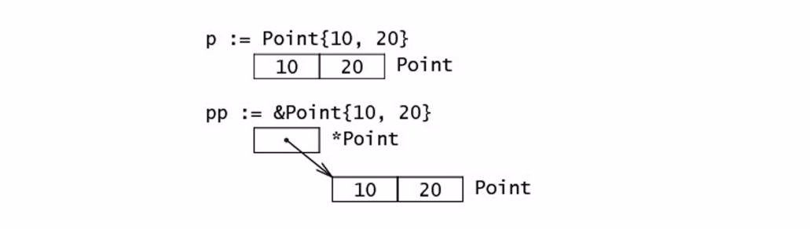

# Golang

## 一、go语言相关

### 1 字符串相关

#### （1）字符串基础

##### 1）基本使用

参考：[http://c.biancheng.net/view/17.html](http://c.biancheng.net/view/17.html)

##### 2）计算字符串长度

go语言中，字符串都是基于UTF-8编码的，所以在go语言中不存在乱码的情况，但是，在统计字符串长度时，需要注意，如果字符串中含有中文，且我们的预期也是一个中文算一个字符的话，那么不能好用`len()`计算长度，应该用`utf8.RuneCountInString()`计算。

```go
package main

import "fmt"

func main() {
    //---计算字符串的长度---
	//ASCII 字符串长度使用 len() 函数。
	//Unicode 字符串长度使用 utf8.RuneCountInString() 函数。
	str1 := "I am a man;"
	str2 := "很好aa"
	//len() 函数的返回值的类型为 int，表示字符串的 ASCII 字符个数或字节长度
	//如果字符串中有中文，返回的结果可能会不是我们想要的结果
	//因为在go中，字符串都是用utf8编码，一个中文字占3个字符
	fmt.Println(len(str1), len(str2)) //11 6
	//utf8.RuneCountInString会将字符串中的中文当成一个"字符"来统计
	fmt.Println(utf8.RuneCountInString(str1), utf8.RuneCountInString(str2)) //11 2
}
```

#### （2）字符串底层原理

##### 1）为什么字符串不允许修改？

在`go`实现中，`string`不包含内存空间，只有一个内存的地址，这样做的好处是`string`变得非常轻量，可以很方便的进行传递而不用担心内存拷贝。

`string`通常指向字符串字面量，而字符串字面量存储存储位置是只读段，而不是堆或栈上，所以`string`不可修改。

> 如果非要修改`string`类型的变量，可以先将其转换成`[]byte`切片进行修改
>
> ```go
> var str string = "hello"
> strBytes := []byte(str)
> strBytes[0] = 'H'
> str = string(strBytes)
> fmt.Println(str)
> ```

##### 2）如何高效的拼接字符串

Go 语言中，字符串是只读的，也就意味着每次修改操作都会创建一个新的字符串。如果需要拼接多次，应使用 `strings.Builder`，最小化内存拷贝次数。

```go
var str strings.Builder
for i := 0; i < 1000; i++ {
    str.WriteString("a")
}
fmt.Println(str.String())
```


### 2 数组相关

#### （1）数组的特点：

1. **数组在内存中的空间时连续的（无论是在栈上，还是在静态区）。**
2. 数组的大小不可改变，存储元素类型相同、但是大小不同的数组类型在 Go 语言看来也是完全不同的，只有两个条件（元素类型和大小）都相同才是同一类型

#### （2）在`Go`和`C`中，数组的工作方式有很大的不同，在`Go`中：

- 数组就是值。将一个数组赋值给另一个数组会复制所有的元素。
- 特别是，如果你把一个数组传递给一个函数，它将收到一个数组的副本，而不是一个指向它的指针。（如果希望传入函数中的数组是一个指针，可以使用切片）
- 数组的大小是其类型的一部分。类型 `[10]int` 和 `[20]int` 是不同的。

#### （3）`[n]T{1,2,3}`和`[...]T{1,2,3}`的区别

```go
var arr1 = [3]int{1, 2, 3}
var arr2 = [...]int{1, 2, 3}
```

go语言中，`[n]T{1,2,3}`和`[...]T{1,2,3}`在运行期二者等价，`[...]T{1,2,3}`会在编译器通过**遍历**的方式计算出数组中的元素个数，然后替换掉`...`。

#### （4）数组初始化（对于由字面量组成的数组）

- 当元素数量**小于或者等于 4 个**时，会直接将数组中的元素放置在**栈上**；
- 当元素数量**大于 4 个**时，会将数组中的元素放置到**静态区**并在运行时取出；

#### （5）数组访问

```go
var arr [3]int = [3]int{1, 2, 3}
i := 4
arr[4]//编译期检查出数组越界
arr[i]//运行期才能检查出数组越界
```

1. 直接使用整数或者常量访问数组，可以在编译期间检查出是否越界
2. 如果使用表达式访问数组，go语言无法在编译期间检查出是否越界，只能在运行期间才能检查出

### 3 切片相关

#### （1）定义切片

```go
slice1 := make([]int, 5) //表示创建一个len=5的切片
slice2 := make([]int, 0, 5) //表示创建一个容量cap=5的切片，len=0，即没有元素
slice3 := make([]int, 0, 5) // len(b)=0, cap(b)=5

//初始化
arr[0:3] or slice[0:3] //通过下标的方式获得数组或者切片的一部分；原切片数据被修改后，新切片数据也会被修改
slice := []int{1, 2, 3} //使用字面量初始化新的切片；
slice := make([]int, 10) //使用关键字 make 创建切片
```

切片的特点：

1. 大小不固定，相当于一个长度可变的数组
2. 切片会自动扩容，
3. 切片中存储数组数据的数据结构在内存中是连续的
4. 切片和数组不同，**数组的内存固定且连续，多数操作都会直接读写内存的特定位置**，切片是运行时才会确定内容的结构，所有操作还需要依赖 Go 语言的运行时状态

#### （2）切片初始化

切片有一下3种方式可以初始化：

1. 通过下标的方式获得数组或者切片的一部分；
2. 使用字面量初始化新的切片；
3. 使用关键字 `make` 创建切片；

##### 1）通过下标初始化

使用下标创建切片是最原始也最接近汇编语言的方式，它是所有方法中最为底层的一种，编译器会将 `arr[0:3]` 或者 `slice[0:3]` 等语句转换成 `OpSliceMake` 操作。

##### 2）通过字面量初始化

使用字面量 `[]int{1, 2, 3}` 创建新的切片时，[`cmd/compile/internal/gc.slicelit`](https://draveness.me/golang/tree/cmd/compile/internal/gc.slicelit) 函数会在编译期间将它展开成如下所示的代码片段：

```
var vstat [3]int
vstat[0] = 1
vstat[1] = 2
vstat[2] = 3
var vauto *[3]int = new([3]int)
*vauto = vstat
slice := vauto[:]
```

1. 根据切片中的元素数量对底层数组的大小进行推断并创建一个数组；
2. 将这些字面量元素存储到初始化的数组中；
3. 创建一个同样指向 `[3]int` 类型的数组指针；
4. 将静态存储区的数组 `vstat` 赋值给 `vauto` 指针所在的地址；
5. 通过 `[:]` 操作获取一个底层使用 `vauto` 的切片；

第 5 步中的 `[:]` 就是使用下标创建切片的方法，从这一点我们也能看出 `[:]` 操作是创建切片最底层的一种方法。

##### 3）通过关键字`make`初始化

```go
slice := make([]int, 0, 5)//创建了一个长度为0，容量为5的切片
```

如果使用字面量的方式创建切片，大部分的工作都会在编译期间完成。但是当我们使用 `make` 关键字创建切片时，很多工作都需要运行时的参与；调用方必须向 `make` 函数传入切片的大小以及可选的容量，类型检查期间的 [`cmd/compile/internal/gc.typecheck1`](https://draveness.me/golang/tree/cmd/compile/internal/gc.typecheck1) 函数会校验入参：

```go
func typecheck1(n *Node, top int) (res *Node) {
	switch n.Op {
	...
	case OMAKE:
		args := n.List.Slice()

		i := 1
		switch t.Etype {
		case TSLICE:
			if i >= len(args) {
				yyerror("missing len argument to make(%v)", t)
				return n
			}

			l = args[i]
			i++
			var r *Node
			if i < len(args) {
				r = args[i]
			}
			...
			if Isconst(l, CTINT) && r != nil && Isconst(r, CTINT) && l.Val().U.(*Mpint).Cmp(r.Val().U.(*Mpint)) > 0 {
				yyerror("len larger than cap in make(%v)", t)
				return n
			}

			n.Left = l
			n.Right = r
			n.Op = OMAKESLICE
		}
	...
	}
}
```

`make`会检查是否传入了切片的长度`len`，如果没有传入容量，则默认容量等于长度，即`len=cap`，如果传入了`cap`，则还会检查`len`是否大于`cap`。

当切片发生逃逸或者非常大时，运行时需要 [`runtime.makeslice`](https://draveness.me/golang/tree/runtime.makeslice) 在堆上初始化切片，如果当前的切片不会发生逃逸并且切片非常小的时候，`make([]int, 3, 4)` 会被直接转换成如下所示的代码：

```go
var arr [4]int
n := arr[:3]
```

上述代码会初始化数组并通过下标 `[:3]` 得到数组对应的切片，这两部分操作都会在编译阶段完成，编译器会在栈上或者静态存储区创建数组并将 `[:3]` 转换成上一节提到的 `OpSliceMake` 操作。

编译期检查完参数之后，Go会在运行期创建切片，创建切片的运行时函数 [`runtime.makeslice`](https://draveness.me/golang/tree/runtime.makeslice)：

```go
func makeslice(et *_type, len, cap int) unsafe.Pointer {
	mem, overflow := math.MulUintptr(et.size, uintptr(cap))
	if overflow || mem > maxAlloc || len < 0 || len > cap {
		mem, overflow := math.MulUintptr(et.size, uintptr(len))
		if overflow || mem > maxAlloc || len < 0 {
			panicmakeslicelen()
		}
		panicmakeslicecap()
	}

	return mallocgc(mem, et, true)
}
```

上述函数的主要工作是计算切片占用的内存空间并在堆上申请一片连续的内存，它使用如下的方式计算占用的内存：

> 内存空间=切片中元素大小×切片容量

虽然编译期间可以检查出很多错误，但是在创建切片的过程中如果发生了以下错误会直接触发运行时错误并崩溃：

1. 内存空间的大小发生了溢出；
2. 申请的内存大于最大可分配的内存；
3. 传入的长度小于 0 或者长度大于容量；

#### （3）切片扩容

1. 如果期望容量大于当前容量的两倍就会使用期望容量；
2. 如果当前切片的长度小于 1024 就会将容量翻倍；
3. 如果当前切片的长度大于 1024 就会每次增加 25% 的容量，直到新容量大于期望容量；

#### （4）如果判断2个切片是否相等


### 4 map相关

> map简单易用，既能自动处理哈希碰撞，又能自动扩容或重新内存整理，避免读写性能的下降。
>
> Go 语言使用**拉链法**来解决哈希碰撞的问题实现了哈希表，它的访问、写入和删除等操作都在编译期间转换成了运行时的函数或者方法。哈希在每一个桶中存储键对应哈希的前 8 位，当对哈希进行操作时，这些 `tophash` 就成为可以帮助哈希快速遍历桶中元素的缓存。
>
> 实现拉链法一般会使用数组加上链表，不过一些编程语言会在拉链法的哈希中引入红黑树以优化性能，拉链法会使用链表数组作为哈希底层的数据结构，我们可以将它看成可以扩展的二维数组。

#### （1）初始化

##### 1）通过字面量初始化

```go
//通过字面量初始化
strMap := map[string]string{
    "name": "zs",
    "age": "18",  // 注意最后一行的结尾也必须有逗号
}
```

1. 当哈希表中的元素数量少于或者等于 25 个时，编译器会将字面量初始化的结构体转换成以下的代码，将所有的键值对一次加入到哈希表中：

   ```go
   strMap := make(map[string]string, 2)
   strMap["name"] = "zs"
   strMap["age"] = 18
   ```

2. 当哈希表中的元素数量超过25个，编译器会创建两个数组分别存储键和值，这些键值对会通过如下所示的 for 循环加入哈希：

   ```go
   hash := make(map[string]int, 26)
   vstatk := []string{"1", "2", "3", ... ， "26"}
   vstatv := []int{1, 2, 3, ... , 26}
   for i := 0; i < len(vstak); i++ {
       hash[vstatk[i]] = vstatv[i]
   }
   ```
   
   为什么不是`key`和`value`放在一起，而是`key`放一起，`value`放一起，这样方便内存对齐，节省空间。

##### 2）通过make初始化

`map`如果不是通过字面量初始化，则必须使用`make`初始化之后才能对其进行赋值，值为`nil`（未初始化的`map`的值为`nil`）的`map`是空的，且不能对其进行赋值。

```go
m := make(map[string]string) // 语法是 "map[key的类型]value的类型"
m["key1"] = "value1"
fmt.Println(m["key1"])
```

#### （2）map的扩容

在桶里存储k/v的方式不是一个k/v一组, 而是k放一块，v放一块。

这样的相对k/v相邻的好处是，**方便内存对齐**。比如`map[int64]int8`, v是`int8`,放一块就避免需要额外内存对齐。

##### 1）map不能对其中的值取地址

```go
m0 := map[int]int{}
_ = &m0[0]//这是不合法的
```

> 为什么map不能对其中的值取地址呢？
>
> 这是因为`map`内部有渐进式扩容，所以`map`的值地址不固定，取地址没有意义。也因此，对于值类型为`slice`和`struct`, 只有把他们各自当做整体去赋值操作才是安全的。

### 5 函数相关

go语言中，参数传递都是值传递，包括基本数据类型、数组、结构体、指针等。在给函数传参时需要注意，如果该参数是比较大的数组或结构体，建议传指针，因为值拷贝会影响性能。

#### （1）方法

在Go语言中，将函数绑定到具体的类型中，则称该函数是该类型的方法，其定义的方式是在func与函数名称之间加上具体类型变量，这个类型变量称为`方法接收器`，如：

```go
func setName(m Member,name string) {
    //普通函数
    m.Name = name
}

func (m Member)setName(name string) {
    //绑定到Member结构体的方法
    m.Name = name
}

func main() {
    m := Member{}
	m.setName("小明")
	fmt.Println(m.Name)//输出为空 因为结构体是值传递
}
```

```go
func (m *Member)setName(name string){
    //将Member改为*Member
    m.Name = name
}

func main() {
    m := Member{}
	m.setName("小明")
	fmt.Println(m.Name)//小明
}
```

#### （2）为什么go的函数可以返回多个值

因为Go使用栈传递入参和接收返回值，对于返回多个参数，Go只需要多分配一点栈空间即可。

- C 语言的方式能够极大地减少函数调用的额外开销，但是也增加了实现的复杂度；
  - CPU 访问栈的开销比访问寄存器高几十倍；
  - 需要单独处理函数参数过多的情况；
- Go 语言的方式能够降低实现的复杂度并支持多返回值，但是牺牲了函数调用的性能；
  - 不需要考虑超过寄存器数量的参数应该如何传递；
  - 不需要考虑不同架构上的寄存器差异；
  - 函数入参和出参的内存空间需要在栈上进行分配；

### 6 defer相关

- 多个 defer 语句，遵从后进先出(Last In First Out，LIFO)的原则，最后声明的 defer 语句，最先得到执行。
- defer 在 return 语句之后执行，但在函数退出之前，defer 可以修改返回值。

### 7 结构体相关

结构体是**复合类型**，并非**引用类型**，结构体和数组一样，都是**值传递**。在函数间传递结构体参数时，如果希望函数内对形参的改动同步到实参，则需要使用引用传递。

#### （1）初始化

##### 1）通过字面量初始化

```go
type Person struct {
    name string
    age int
    address string
}

func main() {
    var p1 Person
    p1 = Person{"lisi", 30, "shanghai"}   //方式A
    p2 := Person{address:"beijing", age:25, name:"wangwu"} //方式B
    p3 := Person{address:"NewYork"} //方式C
}
```

##### 2）通过var初始化

在 Go 语言中当一个变量被声明的时候，系统会自动初始化它的默认值，比如 `int` 被初始化为 `0`，指针为 `nil`。
`var` 声明同样也会为结构体类型的数据分配内存，所以才能像代码中那样，在声明了 `var s T` 之后就能直接给他的字段进行赋值。

```go
type T struct {
	a, b int
}

func main() {
    var s T
	s.a = 5
	s.b = 8
    
    //通过指针创建结构体，必须先对结构体变量进行初始化才能对其赋值
    //指针类型为引用类型，声明结构体指针时，如果未初始化，则初始值为nil,只有初始化后，才能访问字段或为字段赋值。
    //因为指针的零值是nil
    var s *T
    //s.a = 5 //panic: runtime error: invalid memory address or nil pointer dereference
    s = &T{} //初始化
    s.a = 5//正确
	s.b = 8//正确
}
```

##### 3）通过new初始化

使用 `new` 函数给一个新的结构体变量分配内存，它返回指向已分配内存的指针：`var t *T = new(T)`。

```go
type struct1 struct {
    i1 int
    f1 float32
    str string
}

func main() {
    ms := new(struct1)
    ms.i1 = 10
    ms.f1 = 15.5
    ms.str= "Chris"

    fmt.Printf("The int is: %d\n", ms.i1)
    fmt.Printf("The float is: %f\n", ms.f1)
    fmt.Printf("The string is: %s\n", ms.str)
    fmt.Println(ms)
}
```

与面向对象语言相同，使用点操作符可以给字段赋值：`structname.fieldname = value`。
同样的，使用点操作符可以获取结构体字段的值：`structname.fieldname`。

##### 4）几种初始化方式之间的区别

```go
//第一种，在Go语言中，可以直接以 var 的方式声明结构体即可完成实例化
var t T
t.a = 1
t.b = 2

//第二种，使用 new() 实例化
t := new(T)

//第三种，使用字面量初始化
t := T{a, b}
t := &T{} //等效于 new(T)
```

使用 `var t T` 会给 t 分配内存，并零值化内存，但是这个时候的 t 的类型是 T，使用 new 关键字时 `t := new(T)`，变量 t 则是一个指向 T 的指针

从内存布局上来看，我们就能看出这三种初始化方式的区别：

1. 使用 var 声明：

   

2. 使用 new 初始化：

   

3. 使用结构体字面量初始化：

   

#### （2）结构体的内存布局

Go 语言中，结构体和它所包含的数据在内存中是以连续块的形式存在的，即使结构体中嵌套有其他的结构体，这在性能上带来了很大的优势。不像 Java 中的引用类型，一个对象和它里面包含的对象可能会在不同的内存空间中，这点和 Go 语言中的指针很像。

可以通过`unsafe.OffSetof`获取结构体中的某个属性在内存中的偏移。

#### （3）空 struct{} 的用途

使用空结构体 struct{} 可以节省内存，一般作为占位符使用，表明这里并不需要一个值。

```go
fmt.Println(unsafe.Sizeof(struct{}{})) // 0
```

比如使用 map 表示集合时，只关注 key，value 可以使用 struct{} 作为占位符。如果使用其他类型作为占位符，例如 int，bool，不仅浪费了内存，而且容易引起歧义。

```go
type Set map[string]struct{}

func main() {
	set := make(Set)

	for _, item := range []string{"A", "A", "B", "C"} {
		set[item] = struct{}{}
	}
	fmt.Println(len(set)) // 3
	if _, ok := set["A"]; ok {
		fmt.Println("A exists") // A exists
	}
}
```

再比如，使用信道(channel)控制并发时，我们只是需要一个信号，但并不需要传递值，这个时候，也可以使用 struct{} 代替。

```go
func main() {
	ch := make(chan struct{}, 1)
	go func() {
		<-ch
		// do something
	}()
	ch <- struct{}{}
	// ...
}
```

再比如，声明只包含方法的结构体。

```go
type Lamp struct{}

func (l Lamp) On() {
        println("On")

}
func (l Lamp) Off() {
        println("Off")
}
```

一个结构体，并没有包含自身，比如`Stu`中的字段不能是`Stu`类型，但却可能是`*Stu`。

```go
type Stu struct {
	Name string `json:"stu_name"`
	ID   string `json:"stu_id"`
	Age  int    `json:"-"`
	Next *Stu   `json:"-"`
}
```

#### （4）组合

在Go语言中没有继承的概念，Go语言的编程哲学里，推荐使用`组合`的方式来达到代码复用效果。

```

type Person struct {
	Name string
	Age  int8
}

func (p *Person) setName(name string) {
	p.Name = name
}

func (p *Person) setAge(age int8) {
	p.Age = age
}

type Stu1 struct {
	p Person
}

type Stu2 struct {
	Person //匿名字段
}

func main() {
	stu1 := Stu1{
		Person{
			Name: "tony",
			Age:  19,
		},
	}
	fmt.Println(stu1.p.Name)

	stu2 := Stu2{
		Person{
			Name: "tony",
			Age:  19,
		},
	}
	//匿名字段可以省去中间的字段
	fmt.Println(stu2.Name)
}
```

### 8 接口相关

Go 语言只会在传递参数、返回参数以及变量赋值时才会对某个类型是否实现接口进行检查

#### （1）2 个 interface 可以比较吗？

Go 语言中，interface 的内部实现包含了 2 个字段，类型 `T` 和 值 `V`，interface 可以使用 `==` 或 `!=` 比较。2 个 interface 相等有以下 2 种情况

1. 两个 interface 均等于 nil（此时 V 和 T 都处于 unset 状态）
2. 类型 T 相同，且对应的值 V 相等。

看下面的例子：

```go
type Stu struct {
	Name string
}

type StuInt interface{}

func main() {
	var stu1, stu2 StuInt = &Stu{"Tom"}, &Stu{"Tom"}
	var stu3, stu4 StuInt = Stu{"Tom"}, Stu{"Tom"}
	fmt.Println(stu1 == stu2) // false
	fmt.Println(stu3 == stu4) // true
}
```

`stu1` 和 `stu2` 对应的类型是 `*Stu`，值是 Stu 结构体的地址，两个地址不同，因此结果为 false。
`stu3` 和 `stu4` 对应的类型是 `Stu`，值是 Stu 结构体，且各字段相等，因此结果为 true。

### 8 sync包

### 9 sync.map原理

### 10 sync.Pool原理

### 11 sync.Atomic原子操作及CAS操作

### 12 context

### 13 单元测试、性能测试

### 14 golang官方包相关使用

#### （1）unsafe

go语言是一门静态的编程语言，也就是不同类型的变量不能进行相互转换，比如把一个`int32`指针变量转换成`float32`类型的指针变量这个操作在go语言中是不合法的。因为指针中存放的是实际变量的地址，如果我们想要进行不同类型的指针变量互转怎么办，使用`unsafe.Pointer`。

简单来讲就是，`unsafe`包就是不怎么推荐你使用。因为它是 unsafe（不安全的），但是在特殊的场景下，使用了它。可以打破 Go 的类型和内存安全机制

##### 1）Pointer

- 任何类型的指针值都可以转换为 Pointer
- Pointer 可以转换为任何类型的指针值
- uintptr 可以转换为 Pointer
- Pointer 可以转换为 uintptr

错误示例：

```go
func main(){
    num := 5
    numPointer := &num

    flnum := (*float32)(numPointer)//这里不能互转
    fmt.Println(flnum)
}
```

正确示例：

```go
func main(){
    num := 5
    numPointer := &num

    flnum := (*float32)(unsafe.Pointer(numPointer))
    fmt.Println(flnum)
}
```

##### 2）Offsetof

```go
type Num struct{
    i string
    j int64
}

func main(){
    n := Num{i: "EDDYCJY", j: 1}
    nPointer := unsafe.Pointer(&n)

    niPointer := (*string)(unsafe.Pointer(nPointer))
    *niPointer = "煎鱼"

    njPointer := (*int64)(unsafe.Pointer(uintptr(nPointer) + unsafe.Offsetof(n.j)))
    *njPointer = 2

    fmt.Printf("n.i: %s, n.j: %d", n.i, n.j)
}
```

输出：

```
n.i: 煎鱼, n.j: 2
```

结构体的一些基本概念：

- 结构体的成员变量在内存存储上是一段连续的内存
- 结构体的初始地址就是第一个成员变量的内存地址
- 基于结构体的成员地址去计算偏移量。就能够得出其他成员变量的内存地址

再回来看看上述代码，得出执行流程：

- 修改 `n.i` 值：`i` 为第一个成员变量。因此不需要进行偏移量计算，直接取出指针后转换为 `Pointer`，再强制转换为字符串类型的指针值即可
- 修改 `n.j` 值：`j` 为第二个成员变量。需要进行偏移量计算，才可以对其内存地址进行修改。在进行了偏移运算后，当前地址已经指向第二个成员变量。接着重复转换赋值即可

需要注意的是，这里使用了如下方法（来完成偏移计算的目标）：

1、uintptr：`uintptr` 是 Go 的内置类型。返回无符号整数，可存储一个完整的地址。常用于指针运算，`uintptr` 类型是不能存储在临时变量中的。因为从 GC 的角度来看，`uintptr` 类型的临时变量只是一个无符号整数，并不知道它是一个指针地址，因此当满足一定条件后，`ptr` 这个临时变量是可能被垃圾回收掉的，如果被GC回收掉了，那么接下来的内存操作会引发一些系统错误。

2、unsafe.Offsetof：返回成员变量 x 在结构体当中的偏移量。更具体的讲，就是返回结构体初始位置到 x 之间的字节数。需要注意的是入参 `ArbitraryType` 表示任意类型，并非定义的 `int`。它实际作用是一个占位符

### 15 pprof使用

### 16 内存管理

#### （1）TCMalloc

#### （2）内存分配器

#### （3）竞态

#### （4）逃逸分析

##### 1）什么是逃逸分析

> 在 C 语言中，可以使用 `malloc` 和 `free` 手动在堆上分配和回收内存。Go 语言中，堆内存是通过垃圾回收机制自动管理的，无需开发者指定。那么，Go 编译器怎么知道某个变量需要分配在栈上，还是堆上呢？编译器决定内存分配位置的方式，就称之为逃逸分析(escape analysis)。逃逸分析由编译器完成，作用于编译阶段。

在go语言中，有2个地方可以为变量分配内存，分别是**栈（stack）**和**堆（heap）**。其中，局部变量在栈中分配，全局变量在堆中分配，如果一个指针对象在某个函数（函数内部的创建的对象理论上是分配在栈上，函数结束，对象随之被释放）中产生，但是该被该函数返回了，也就是说该对象还有引用对象，那么就不能和函数一起被释放，所以需要将该对象“逃逸”到堆上分配。

##### 2）哪些情况会发生逃逸

1. 指针逃逸

   ```go
   package main
   
   import "fmt"
   
   type Demo struct {
   	name string
   }
   
   func createDemo(name string) *Demo {
   	d := new(Demo) // 局部变量 d 逃逸到堆
   	d.name = name
   	return d
   }
   
   func main() {
   	demo := createDemo("demo")
   	fmt.Println(demo)
   }
   ```

   这个例子中，函数 `createDemo` 的局部变量 `d` 发生了逃逸。d 作为返回值，在 main 函数中继续使用，因此 d 指向的内存不能够分配在栈上，随着函数结束而回收，只能分配在堆上。

   编译时可以借助选项 `-gcflags=-m`，查看变量逃逸的情况：

   ```
   $ go build -gcflags=-m main_pointer.go 
   ./main_pointer.go:10:6: can inline createDemo
   ./main_pointer.go:17:20: inlining call to createDemo
   ./main_pointer.go:18:13: inlining call to fmt.Println
   ./main_pointer.go:10:17: leaking param: name
   ./main_pointer.go:11:10: new(Demo) escapes to heap
   ./main_pointer.go:17:20: new(Demo) escapes to heap
   ./main_pointer.go:18:13: demo escapes to heap
   ./main_pointer.go:18:13: main []interface {} literal does not escape
   ./main_pointer.go:18:13: io.Writer(os.Stdout) escapes to heap
   <autogenerated>:1: (*File).close .this does not escape
   ```

   `new(Demo) escapes to heap` 即表示 `new(Demo)` 逃逸到堆上了。

2. interface{} 动态类型逃逸

   在 Go 语言中，空接口即 `interface{}` 可以表示任意的类型，如果函数参数为 `interface{}`，编译期间很难确定其参数的具体类型，也会发生逃逸。

3. 栈空间不足

   操作系统对内核线程使用的栈空间是有大小限制的，64 位系统上通常是 8 MB。可以使用 `ulimit -a` 命令查看机器上栈允许占用的内存的大小。

   - 当切片占用内存超过一定大小（栈的最大容积），或无法确定当前切片长度时，对象占用内存将在堆上分配。
   - 当切片占用内存小于一定大小，则不会发生逃逸

4. 闭包

   > 什么是闭包？
   >
   > 一个函数和对其周围状态（lexical environment，词法环境）的引用捆绑在一起（或者说函数被引用包围），这样的组合就是闭包（closure）。也就是说，闭包让你可以在一个内层函数中访问到其外层函数的作用域。

   ```go
   func Increase() func() int {
   	n := 0
   	return func() int {
   		n++
   		return n
   	}
   }
   
   func main() {
   	in := Increase()
   	fmt.Println(in()) // 1
   	fmt.Println(in()) // 2
   }
   ```

   `Increase()` 返回值是一个闭包函数，该闭包函数访问了外部变量 n，那变量 n 将会一直存在，直到 `in` 被销毁。很显然，变量 n 占用的内存不能随着函数 `Increase()` 的退出而回收，因此将会逃逸到堆上。

   ```
   $ go build -gcflags=-m main_closure.go 
   # command-line-arguments
   ./main_closure.go:6:2: moved to heap: n
   ```

##### 3）如何利用逃逸分析提升性能

传值会拷贝整个对象，而传指针只会拷贝指针地址，指向的对象是同一个。传指针可以减少值的拷贝，但是会导致内存分配逃逸到堆中，增加垃圾回收(GC)的负担。在对象频繁创建和删除的场景下，传递指针导致的 GC 开销可能会严重影响性能。

一般情况下，对于需要修改原对象值，或占用内存比较大的结构体，选择传指针。对于只读的占用内存较小的结构体，直接传值能够获得更好的性能。

#### （5）垃圾收集器

#### （6）主流垃圾回收算法

#### （7）栈内存管理

### 17 go-routine

#### （1）GPM

#### （2）调度器的设计策略

#### （3）Go协作式和抢占式调度

#### （4）routine相关函数

#### （5）协程池

#### （6）select

#### （7）channel

### 18 gin框架相关

#### （1）gin中间件算法

#### （2）gin的路由算法

#### （3）gin的context

### 19 go语言实现UDP协议及TCP通讯

## 二、go build执行详解

## 三、go软件包管理器 | go mod

## 四、go编译器相关

### 1 go语言编译器执行流程

### 2 语法解析

### 3 词法解析

### 4 抽象语法树构建

### 5 类型检查

### 6 变量捕捉

### 7 函数内联

### 8 逃逸分析

### 9 闭包重写

### 10 遍历函数

### 11 SSA生产

### 12 机器码生成--汇编器

## 五、二进制可执行文件


## Reference

1. [《**Go语言底层原理剖析(博文视点出品)**》](https://item.jd.com/13398708.html)

2. [go引入三方包](./go引入三方包.md)
3. [go语言特征](./go语言特征.md)
4. [Go语言学习笔记.md](./Go语言学习笔记.md)
5. [GO语言中的闭包.md](./GO语言中的闭包.md)
6. [《Go 语言设计与实现》](https://draveness.me/golang/)
7. [有点不安全却又一亮的 Go unsafe.Pointer](https://segmentfault.com/a/1190000017389782)
8. [Go的50坑：新Golang开发者要注意的陷阱、技巧和常见错误](https://www.cnblogs.com/lizhewei/p/14309615.html)
9. [Go 结构体与初始化](https://www.cnblogs.com/liyutian/p/10050320.html)
10. [7天用Go从零实现Web框架Gee教程](https://geektutu.com/post/gee.html)