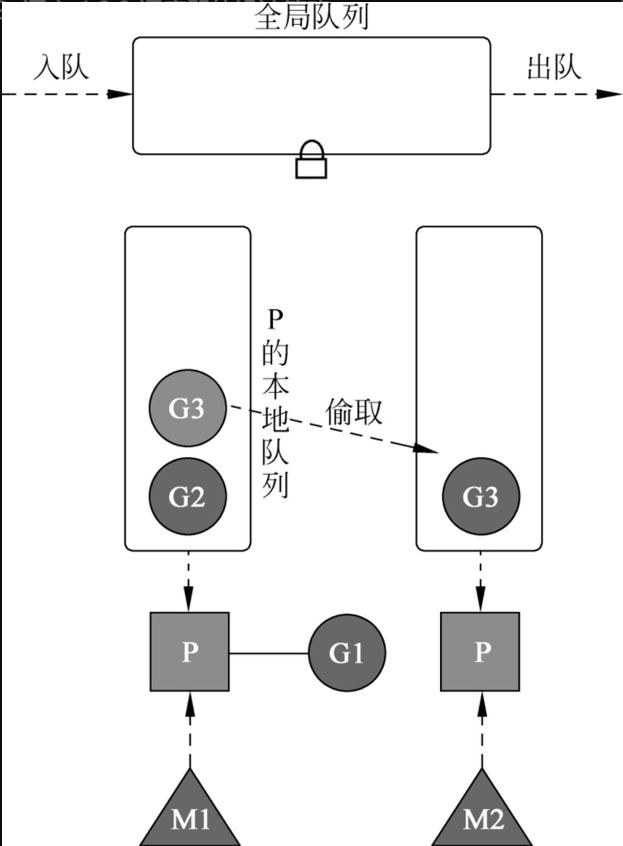
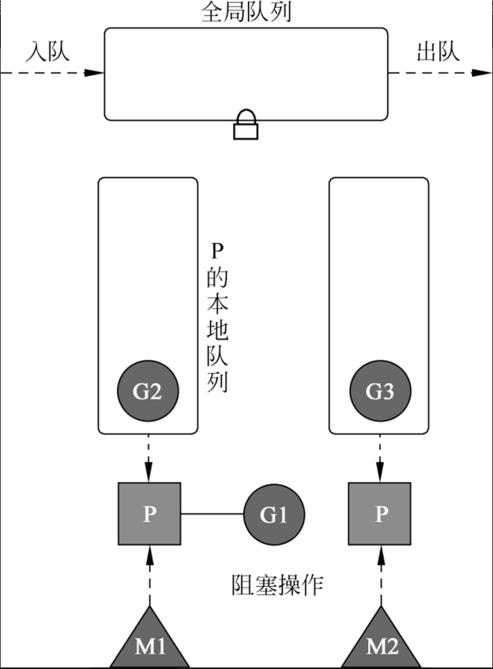
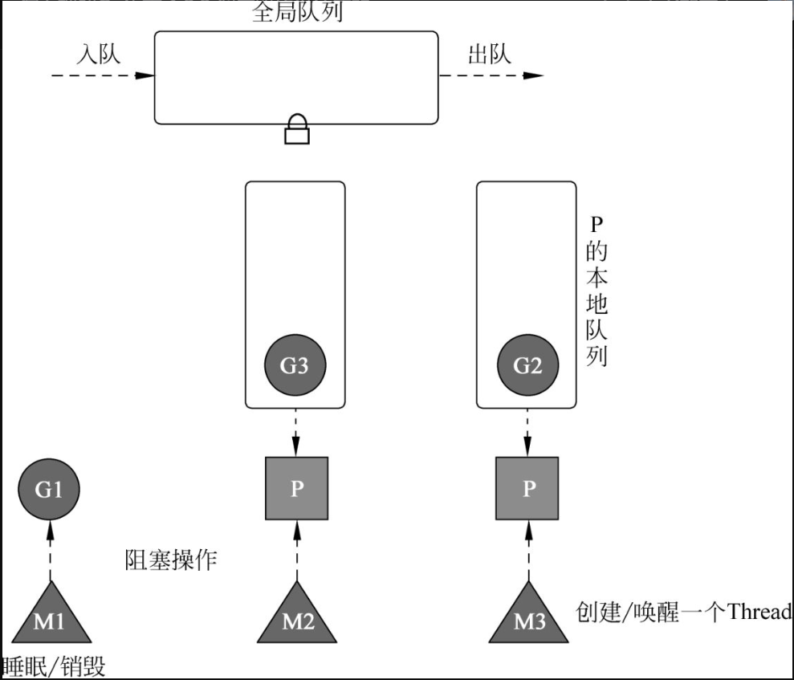
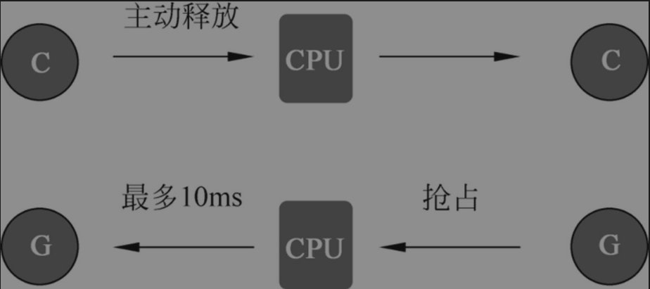
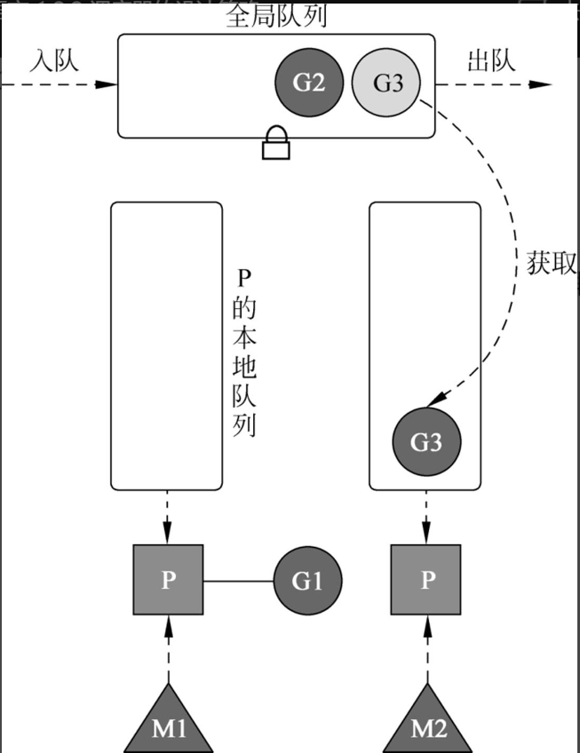
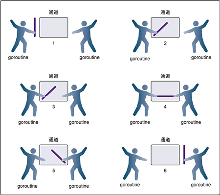
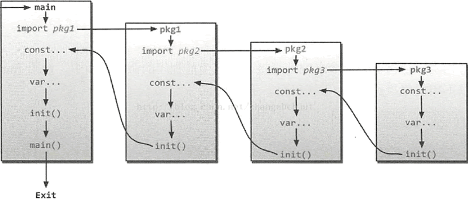

> Golang语言教程整理

# 一、go语言相关

## 1 字符串相关

### （1）字符串基础

#### 1）基本使用

参考：[http://c.biancheng.net/view/17.html](http://c.biancheng.net/view/17.html)

#### 2）计算字符串长度

go语言中，字符串都是基于UTF-8编码的，所以在go语言中不存在乱码的情况，但是，在统计字符串长度时，需要注意，如果字符串中含有中文，且我们的预期也是一个中文算一个字符的话，那么不能好用`len()`计算长度，应该用`utf8.RuneCountInString()`计算。

```go
package main

import "fmt"

func main() {
    //---计算字符串的长度---
	//ASCII 字符串长度使用 len() 函数。
	//Unicode 字符串长度使用 utf8.RuneCountInString() 函数。
	str1 := "I am a man;"
	str2 := "很好aa"
	//len() 函数的返回值的类型为 int，表示字符串的 ASCII 字符个数或字节长度
	//如果字符串中有中文，返回的结果可能会不是我们想要的结果
	//因为在go中，字符串都是用utf8编码，一个中文字占3个字符
	fmt.Println(len(str1), len(str2)) //11 6
	//utf8.RuneCountInString会将字符串中的中文当成一个"字符"来统计
	fmt.Println(utf8.RuneCountInString(str1), utf8.RuneCountInString(str2)) //11 2
}
```

### （2）字符串底层原理

#### 1）为什么字符串不允许修改？

在`go`实现中，`string`不包含内存空间，只有一个内存的地址，这样做的好处是`string`变得非常轻量，可以很方便的进行传递而不用担心内存拷贝。

`string`通常指向字符串字面量，而字符串字面量存储存储位置是只读段，而不是堆或栈上，所以`string`不可修改。

> 如果非要修改`string`类型的变量，可以先将其转换成`[]byte`切片进行修改
>
> ```go
> var str string = "hello"
> strBytes := []byte(str)
> strBytes[0] = 'H'
> str = string(strBytes)
> fmt.Println(str)
> ```

#### 2）如何高效的拼接字符串

Go 语言中，字符串是只读的，也就意味着每次修改操作都会创建一个新的字符串。如果需要拼接多次，应使用 `strings.Builder`，最小化内存拷贝次数。

```go
var str strings.Builder
for i := 0; i < 1000; i++ {
    str.WriteString("a")
}
fmt.Println(str.String())
```

### （3）string转slice

在`for-range`循环中，go做了一些优化，因为string是只读的，所以在将string转成byte或slice类型时，需要为slice或byte重新分配一次内存，这是比较消耗性能，但是在for-range循环中，将string转成slice可以不进行新的内存分配，而是直接使用 string的底层数据。

## 2 数组相关

### （1）数组的特点：

1. **数组在内存中的空间是连续的（无论是在栈上，还是在静态区）。**

   > 在 Go 中，数组在内存中存储在栈上或堆上，具体取决于数组的大小和它是在何处声明的。
   >
   > 1. 如果数组是在函数内部或其他局部作用域中声明，并且其大小是在编译时确定的，那么这个数组会被分配在栈上。栈上的数组有以下特点：
   >    - 数组的生命周期与其所在的函数相同。
   >    - 数组的大小在编译时确定，因此栈上的数组大小是固定的。
   >    - 栈上的数组在函数返回时会自动被销毁，不需要手动释放内存。
   > 2. 如果数组是在函数外部或全局作用域中声明，或者其大小是在运行时确定的（通过 `new` 或 `make` 创建），那么这个数组会被分配在堆上。堆上的数组有以下特点：
   >    - 数组的生命周期与整个程序的运行时间相同。
   >    - 数组的大小在运行时确定，因此堆上的数组大小可以是可变的。
   >    - 堆上的数组需要手动进行内存管理，即在不需要使用数组时，需要使用 `delete` 或其他方式释放内存。
   >
   > 需要注意的是，Go 中的切片（slice）和映射（map）总是在堆上分配内存，而不论它们是在函数内部还是外部声明。这是因为切片和映射的大小是可变的，并且它们的生命周期可能超出所在函数的范围，因此必须在堆上分配内存以确保正确的内存管理。

2. 数组的大小不可改变，存储元素类型相同、但是大小不同的数组类型在 Go 语言看来也是完全不同的，只有两个条件（元素类型和大小）都相同才是同一类型

### （2）在`Go`和`C`中，数组的工作方式有很大的不同，在`Go`中：

- 数组就是值。将一个数组赋值给另一个数组会复制所有的元素。
- 特别是，如果你把一个数组传递给一个函数，它将收到一个数组的副本，而不是一个指向它的指针。（如果希望传入函数中的数组是一个指针，可以使用切片）
- 数组的大小是其类型的一部分。类型 `[10]int` 和 `[20]int` 是不同的。

### （3）`[n]T{1,2,3}`和`[...]T{1,2,3}`的区别

```go
var arr1 = [3]int{1, 2, 3}
var arr2 = [...]int{1, 2, 3}
```

go语言中，`[n]T{1,2,3}`和`[...]T{1,2,3}`在运行期二者等价，`[...]T{1,2,3}`会在编译器通过**遍历**的方式计算出数组中的元素个数，然后替换掉`...`。

### （4）数组初始化（对于由字面量组成的数组）

- 当元素数量**小于或者等于 4 个**时，会直接将数组中的元素放置在**栈上**；
- 当元素数量**大于 4 个**时，会将数组中的元素放置到**静态区**并在运行时取出；

### （5）数组访问

```go
var arr [3]int = [3]int{1, 2, 3}
i := 4
arr[4]//编译期检查出数组越界
arr[i]//运行期才能检查出数组越界
```

1. 直接使用整数或者常量访问数组，可以在编译期间检查出是否越界
2. 如果使用表达式访问数组，go语言无法在编译期间检查出是否越界，只能在运行期间才能检查出

## 3 切片相关

切片、数组在传参都是值传递。

> 虽然切片是值传递，但是切片底层引用的数组是共享的。因此，当将切片传递给函数并在函数内部修改切片的元素时，会影响到原始切片的内容。
>
> 切片的底层数据结构包含指向数组的指针、切片的长度和容量信息。当切片作为参数传递时，函数会复制这个数据结构，但指针指向的数组是共享的。因此，通过传递切片，我们实际上是传递了对底层数组的引用，而不是整个数组本身。
>
> 示例：
>
> ```go
> package main
> 
> import "fmt"
> 
> func modifySlice(s []int) {
> 	s[0] = 100
> }
> 
> func main() {
> 	slice := []int{1, 2, 3}
> 	fmt.Println("Before:", slice) // 输出 [1 2 3]
> 
> 	modifySlice(slice)
> 	fmt.Println("After:", slice) // 输出 [100 2 3]
> }
> ```
>
> 在上述示例中，`modifySlice` 函数接收一个切片作为参数，并将切片的第一个元素修改为 `100`。在 `main` 函数中，我们调用 `modifySlice` 函数并传递了切片 `slice`。在函数内部修改切片的第一个元素后，可以看到在 `main` 函数中，原始切片的内容也被修改为 `[100 2 3]`。这就证明了切片的修改在函数内外都是有效的。

### （1）定义切片

```go
slice1 := make([]int, 5) //表示创建一个len=5的切片
slice2 := make([]int, 0, 5) //表示创建一个容量cap=5的切片，len=0，即没有元素
slice3 := make([]int, 0, 5) // len(b)=0, cap(b)=5

//初始化
arr[0:3] or slice[0:3] //通过下标的方式获得数组或者切片的一部分；原切片数据被修改后，新切片数据也会被修改
slice := []int{1, 2, 3} //使用字面量初始化新的切片；
slice := make([]int, 10) //使用关键字 make 创建切片
```

切片的特点：

1. 大小不固定，相当于一个长度可变的数组
2. 切片会自动扩容，
3. 切片中存储数组数据的数据结构在内存中是连续的
4. 切片和数组不同，**数组的内存固定且连续，多数操作都会直接读写内存的特定位置**，切片是运行时才会确定内容的结构，所有操作还需要依赖 Go 语言的运行时状态

### （2）切片初始化

切片有一下3种方式可以初始化：

1. 通过下标的方式获得数组或者切片的一部分；
2. 使用字面量初始化新的切片；
3. 使用关键字 `make` 创建切片；

#### 1）通过下标初始化

使用下标创建切片是最原始也最接近汇编语言的方式，它是所有方法中最为底层的一种，编译器会将 `arr[0:3]` 或者 `slice[0:3]` 等语句转换成 `OpSliceMake` 操作。

#### 2）通过字面量初始化

使用字面量 `[]int{1, 2, 3}` 创建新的切片时，[`cmd/compile/internal/gc.slicelit`](https://draveness.me/golang/tree/cmd/compile/internal/gc.slicelit) 函数会在编译期间将它展开成如下所示的代码片段：

```
var vstat [3]int
vstat[0] = 1
vstat[1] = 2
vstat[2] = 3
var vauto *[3]int = new([3]int)
*vauto = vstat
slice := vauto[:]
```

1. 根据切片中的元素数量对底层数组的大小进行推断并创建一个数组；
2. 将这些字面量元素存储到初始化的数组中；
3. 创建一个同样指向 `[3]int` 类型的数组指针；
4. 将静态存储区的数组 `vstat` 赋值给 `vauto` 指针所在的地址；
5. 通过 `[:]` 操作获取一个底层使用 `vauto` 的切片；

第 5 步中的 `[:]` 就是使用下标创建切片的方法，从这一点我们也能看出 `[:]` 操作是创建切片最底层的一种方法。

#### 3）通过关键字`make`初始化

```go
slice := make([]int, 0, 5)//创建了一个长度为0，容量为5的切片
```

如果使用字面量的方式创建切片，大部分的工作都会在编译期间完成。但是当我们使用 `make` 关键字创建切片时，很多工作都需要运行时的参与；调用方必须向 `make` 函数传入切片的大小以及可选的容量，类型检查期间的 [`cmd/compile/internal/gc.typecheck1`](https://draveness.me/golang/tree/cmd/compile/internal/gc.typecheck1) 函数会校验入参：

```go
func typecheck1(n *Node, top int) (res *Node) {
	switch n.Op {
	...
	case OMAKE:
		args := n.List.Slice()

		i := 1
		switch t.Etype {
		case TSLICE:
			if i >= len(args) {
				yyerror("missing len argument to make(%v)", t)
				return n
			}

			l = args[i]
			i++
			var r *Node
			if i < len(args) {
				r = args[i]
			}
			...
			if Isconst(l, CTINT) && r != nil && Isconst(r, CTINT) && l.Val().U.(*Mpint).Cmp(r.Val().U.(*Mpint)) > 0 {
				yyerror("len larger than cap in make(%v)", t)
				return n
			}

			n.Left = l
			n.Right = r
			n.Op = OMAKESLICE
		}
	...
	}
}
```

`make`会检查是否传入了切片的长度`len`，如果没有传入容量，则默认容量等于长度，即`len=cap`，如果传入了`cap`，则还会检查`len`是否大于`cap`。

当切片发生逃逸或者非常大时，运行时需要 [`runtime.makeslice`](https://draveness.me/golang/tree/runtime.makeslice) 在堆上初始化切片，如果当前的切片不会发生逃逸并且切片非常小的时候，`make([]int, 3, 4)` 会被直接转换成如下所示的代码：

```go
var arr [4]int
n := arr[:3]
```

上述代码会初始化数组并通过下标 `[:3]` 得到数组对应的切片，这两部分操作都会在编译阶段完成，编译器会在栈上或者静态存储区创建数组并将 `[:3]` 转换成上一节提到的 `OpSliceMake` 操作。

编译期检查完参数之后，Go会在运行期创建切片，创建切片的运行时函数 [`runtime.makeslice`](https://draveness.me/golang/tree/runtime.makeslice)：

```go
func makeslice(et *_type, len, cap int) unsafe.Pointer {
	mem, overflow := math.MulUintptr(et.size, uintptr(cap))
	if overflow || mem > maxAlloc || len < 0 || len > cap {
		mem, overflow := math.MulUintptr(et.size, uintptr(len))
		if overflow || mem > maxAlloc || len < 0 {
			panicmakeslicelen()
		}
		panicmakeslicecap()
	}

	return mallocgc(mem, et, true)
}
```

上述函数的主要工作是计算切片占用的内存空间并在堆上申请一片连续的内存，它使用如下的方式计算占用的内存：

> 内存空间=切片中元素大小×切片容量

虽然编译期间可以检查出很多错误，但是在创建切片的过程中如果发生了以下错误会直接触发运行时错误并崩溃：

1. 内存空间的大小发生了溢出；
2. 申请的内存大于最大可分配的内存；
3. 传入的长度小于 0 或者长度大于容量；

### （3）切片扩容

1. 如果期望容量大于当前容量的两倍就会使用期望容量；
2. 如果当前切片的长度小于 1024 就会将容量翻倍；
3. 如果当前切片的长度大于 1024 就会每次增加 25% 的容量，直到新容量大于期望容量；

### （4）如何判断2个切片是否相等

## 4 map相关

> map简单易用，既能自动处理哈希碰撞，又能自动扩容或重新内存整理，避免读写性能的下降。
>
> Go 语言使用**拉链法**来解决哈希碰撞的问题实现了哈希表，它的访问、写入和删除等操作都在编译期间转换成了运行时的函数或者方法。哈希在每一个桶中存储键对应哈希的前 8 位，当对哈希进行操作时，这些 `tophash` 就成为可以帮助哈希快速遍历桶中元素的缓存。
>
> 实现拉链法一般会使用数组加上链表，不过一些编程语言会在拉链法的哈希中引入红黑树以优化性能，拉链法会使用链表数组作为哈希底层的数据结构，我们可以将它看成可以扩展的二维数组。

### （1）初始化

#### 1）通过字面量初始化

```go
//通过字面量初始化
strMap := map[string]string{
    "name": "zs",
    "age": "18",  // 注意最后一行的结尾也必须有逗号
}
```

1. 当哈希表中的元素数量少于或者等于 25 个时，编译器会将字面量初始化的结构体转换成以下的代码，将所有的键值对一次加入到哈希表中：

   ```go
   strMap := make(map[string]string, 2)
   strMap["name"] = "zs"
   strMap["age"] = 18
   ```

2. 当哈希表中的元素数量超过25个，编译器会创建两个数组分别存储键和值，这些键值对会通过如下所示的 for 循环加入哈希：

   ```go
   hash := make(map[string]int, 26)
   vstatk := []string{"1", "2", "3", ... ， "26"}
   vstatv := []int{1, 2, 3, ... , 26}
   for i := 0; i < len(vstak); i++ {
       hash[vstatk[i]] = vstatv[i]
   }
   ```
   
   为什么不是`key`和`value`放在一起，而是`key`放一起，`value`放一起，这样方便内存对齐，节省空间。

#### 2）通过make初始化

`map`如果不是通过字面量初始化，则必须使用`make`初始化之后才能对其进行赋值，值为`nil`（未初始化的`map`的值为`nil`）的`map`是空的，且不能对其进行赋值。

```go
m := make(map[string]string) // 语法是 "map[key的类型]value的类型"
m["key1"] = "value1"
fmt.Println(m["key1"])
```

### （2）map的扩容

在桶里存储k/v的方式不是一个k/v一组, 而是k放一块，v放一块。

这样的相对k/v相邻的好处是，**方便内存对齐**。比如`map[int64]int8`, v是`int8`,放一块就避免需要额外内存对齐。

#### 1）map不能对其中的值取地址

```go
m0 := map[int]int{}
_ = &m0[0]//这是不合法的
```

> 为什么map不能对其中的值取地址呢？
>
> 这是因为`map`内部有渐进式扩容，所以`map`的值地址不固定，取地址没有意义。也因此，对于值类型为`slice`和`struct`, 只有把他们各自当做整体去赋值操作才是安全的。

## 5 函数相关

go语言中，参数传递都是值传递，包括基本数据类型、数组、结构体、指针等。在给函数传参时需要注意，如果该参数是比较大的数组或结构体，建议传指针，因为值拷贝会影响性能。

### （1）方法

在Go语言中，将函数绑定到具体的类型中，则称该函数是该类型的方法，其定义的方式是在func与函数名称之间加上具体类型变量，这个类型变量称为`方法接收器`，如：

```go
func setName(m Member,name string) {
    //普通函数
    m.Name = name
}

func (m Member)setName(name string) {
    //绑定到Member结构体的方法
    m.Name = name
}

func main() {
    m := Member{}
	m.setName("小明")
	fmt.Println(m.Name)//输出为空 因为结构体是值传递
}
```

```go
func (m *Member)setName(name string){
    //将Member改为*Member
    m.Name = name
}

func main() {
    m := Member{}
	m.setName("小明")
	fmt.Println(m.Name)//小明
}
```

### （2）为什么go的函数可以返回多个值

因为Go使用栈传递入参和接收返回值，对于返回多个参数，Go只需要多分配一点栈空间即可。

- C 语言的方式能够极大地减少函数调用的额外开销，但是也增加了实现的复杂度；
  - CPU 访问栈的开销比访问寄存器高几十倍；
  - 需要单独处理函数参数过多的情况；
- Go 语言的方式能够降低实现的复杂度并支持多返回值，但是牺牲了函数调用的性能；
  - 不需要考虑超过寄存器数量的参数应该如何传递；
  - 不需要考虑不同架构上的寄存器差异；
  - 函数入参和出参的内存空间需要在栈上进行分配；

## 6 defer相关

### （1）defer的执行时机

defer是在**return之前**执行的。这个在 [官方文档](http://golang.org/ref/spec#defer_statements)中是明确说明了的。要使用defer时不踩坑，最重要的一点就是要明白，**return xxx这一条语句并不是一条原子指令!**

函数返回的过程是这样的：先给返回值赋值，然后调用defer表达式，最后才是返回到调用函数中。

defer表达式可能会在设置函数返回值之后，在返回到调用函数之前，修改返回值，使最终的函数返回值与你想象的不一致。

### （2）defer的底层原理

`defer`语句的底层原理涉及Go语言的运行时系统和栈帧（stack frame）的管理。理解`defer`的底层原理需要一些关于Go语言内部机制的了解。

在Go中，每个函数调用都会创建一个新的栈帧，用于存储函数的局部变量、参数和执行上下文。当函数执行完毕时，其栈帧会被销毁。`defer`的底层原理涉及到在函数调用栈上注册需要推迟执行的函数，并在函数返回之前确保这些推迟的函数得以执行。

下面是`defer`的基本底层原理：

1. 当遇到`defer`语句时，Go会将`defer`语句中的函数以及其参数值（如果有的话）包装成一个特殊的结构体，然后将这个结构体添加到当前函数的栈帧的`defer`链表中。

2. `defer`链表是一个先进后出（FILO）的数据结构，它记录了需要推迟执行的函数的调用栈，即最后一个进入`defer`链表的函数会最先被执行，以此类推。

3. 当函数执行到`return`语句之前，Go会检查当前函数的`defer`链表，依照FILO顺序执行每个`defer`函数。

4. `defer`函数执行时，它们可以访问当前函数的局部变量和参数，因为它们被包含在`defer`结构体中。

5. 一旦所有的`defer`函数执行完毕，函数会正常返回。

这种设计允许在函数返回之前执行一些清理、资源释放或其他需要推迟执行的操作，而无需手动管理。`defer`语句的机制使得代码更加可读和可维护，因为它确保了在函数返回之前执行的操作不会被遗漏。

## 7 结构体相关

结构体是**复合类型**，并非**引用类型**，结构体和数组一样，都是**值传递**。在函数间传递结构体参数时，如果希望函数内对形参的改动同步到实参，则需要使用引用传递。

### （1）初始化

#### 1）通过字面量初始化

```go
type Person struct {
    name string
    age int
    address string
}

func main() {
    var p1 Person
    p1 = Person{"lisi", 30, "shanghai"}   //方式A
    p2 := Person{address:"beijing", age:25, name:"wangwu"} //方式B
    p3 := Person{address:"NewYork"} //方式C
}
```

#### 2）通过var初始化

在 Go 语言中当一个变量被声明的时候，系统会自动初始化它的默认值，比如 `int` 被初始化为 `0`，指针为 `nil`。
`var` 声明同样也会为结构体类型的数据分配内存，所以才能像代码中那样，在声明了 `var s T` 之后就能直接给他的字段进行赋值。

```go
type T struct {
	a, b int
}

func main() {
    var s T
	s.a = 5
	s.b = 8
    
    //通过指针创建结构体，必须先对结构体变量进行初始化才能对其赋值
    //指针类型为引用类型，声明结构体指针时，如果未初始化，则初始值为nil,只有初始化后，才能访问字段或为字段赋值。
    //因为指针的零值是nil
    var s *T
    //s.a = 5 //panic: runtime error: invalid memory address or nil pointer dereference
    s = &T{} //初始化
    s.a = 5//正确
	s.b = 8//正确
}
```

#### 3）通过new初始化

使用 `new` 函数给一个新的结构体变量分配内存，它返回指向已分配内存的指针：`var t *T = new(T)`。

```go
type struct1 struct {
    i1 int
    f1 float32
    str string
}

func main() {
    ms := new(struct1)
    ms.i1 = 10
    ms.f1 = 15.5
    ms.str= "Chris"

    fmt.Printf("The int is: %d\n", ms.i1)
    fmt.Printf("The float is: %f\n", ms.f1)
    fmt.Printf("The string is: %s\n", ms.str)
    fmt.Println(ms)
}
```

与面向对象语言相同，使用点操作符可以给字段赋值：`structname.fieldname = value`。
同样的，使用点操作符可以获取结构体字段的值：`structname.fieldname`。

#### 4）几种初始化方式之间的区别

```go
//第一种，在Go语言中，可以直接以 var 的方式声明结构体即可完成实例化
var t T
t.a = 1
t.b = 2

//第二种，使用 new() 实例化
t := new(T)

//第三种，使用字面量初始化
t := T{a, b}
t := &T{} //等效于 new(T)
```

使用 `var t T` 会给 t 分配内存，并零值化内存，但是这个时候的 t 的类型是 T，使用 new 关键字时 `t := new(T)`，变量 t 则是一个指向 T 的指针

从内存布局上来看，我们就能看出这三种初始化方式的区别：

1. 使用 var 声明：

   

2. 使用 new 初始化：

   

3. 使用结构体字面量初始化：

   

### （2）结构体的内存布局

Go 语言中，结构体和它所包含的数据在内存中是以连续块的形式存在的，即使结构体中嵌套有其他的结构体，这在性能上带来了很大的优势。不像 Java 中的引用类型，一个对象和它里面包含的对象可能会在不同的内存空间中，这点和 Go 语言中的指针很像。

可以通过`unsafe.OffSetof`获取结构体中的某个属性在内存中的偏移。

### （3）空 struct{} 的用途

使用空结构体 struct{} 可以节省内存，一般作为占位符使用，表明这里并不需要一个值。

```go
fmt.Println(unsafe.Sizeof(struct{}{})) // 0
```

比如使用 map 表示集合时，只关注 key，value 可以使用 struct{} 作为占位符。如果使用其他类型作为占位符，例如 int，bool，不仅浪费了内存，而且容易引起歧义。

```go
type Set map[string]struct{}

func main() {
	set := make(Set)

	for _, item := range []string{"A", "A", "B", "C"} {
		set[item] = struct{}{}
	}
	fmt.Println(len(set)) // 3
	if _, ok := set["A"]; ok {
		fmt.Println("A exists") // A exists
	}
}
```

再比如，使用信道(channel)控制并发时，我们只是需要一个信号，但并不需要传递值，这个时候，也可以使用 struct{} 代替。

```go
func main() {
	ch := make(chan struct{}, 1)
	go func() {
		<-ch
		// do something
	}()
	ch <- struct{}{}
	// ...
}
```

再比如，声明只包含方法的结构体。

```go
type Lamp struct{}

func (l Lamp) On() {
        println("On")

}
func (l Lamp) Off() {
        println("Off")
}
```

一个结构体，并没有包含自身，比如`Stu`中的字段不能是`Stu`类型，但却可能是`*Stu`。

```go
type Stu struct {
	Name string `json:"stu_name"`
	ID   string `json:"stu_id"`
	Age  int    `json:"-"`
	Next *Stu   `json:"-"`
}
```

### （4）组合

在Go语言中没有继承的概念，Go语言的编程哲学里，推荐使用`组合`的方式来达到代码复用效果。

```

type Person struct {
	Name string
	Age  int8
}

func (p *Person) setName(name string) {
	p.Name = name
}

func (p *Person) setAge(age int8) {
	p.Age = age
}

type Stu1 struct {
	p Person
}

type Stu2 struct {
	Person //匿名字段
}

func main() {
	stu1 := Stu1{
		Person{
			Name: "tony",
			Age:  19,
		},
	}
	fmt.Println(stu1.p.Name)

	stu2 := Stu2{
		Person{
			Name: "tony",
			Age:  19,
		},
	}
	//匿名字段可以省去中间的字段
	fmt.Println(stu2.Name)
}
```

## 8 接口相关

Go 语言只会在传递参数、返回参数以及变量赋值时才会对某个类型是否实现接口进行检查

### （1）2 个 interface 可以比较吗？

Go 语言中，interface 的内部实现包含了 2 个字段，类型 `T` 和 值 `V`，interface 可以使用 `==` 或 `!=` 比较。2 个 interface 相等有以下 2 种情况

1. 两个 interface 均等于 nil（此时 V 和 T 都处于 unset 状态）
2. 类型 T 相同，且对应的值 V 相等。

看下面的例子：

```go
type Stu struct {
	Name string
}

type StuInt interface{}

func main() {
	var stu1, stu2 StuInt = &Stu{"Tom"}, &Stu{"Tom"}
	var stu3, stu4 StuInt = Stu{"Tom"}, Stu{"Tom"}
	fmt.Println(stu1 == stu2) // false
	fmt.Println(stu3 == stu4) // true
}
```

`stu1` 和 `stu2` 对应的类型是 `*Stu`，值是 Stu 结构体的地址，两个地址不同，因此结果为 false。
`stu3` 和 `stu4` 对应的类型是 `Stu`，值是 Stu 结构体，且各字段相等，因此结果为 true。

**分析：**

Go 语言根据接口类型是否包含一组方法将接口类型分成了两类：

- 使用 [`runtime.iface`](https://draveness.me/golang/tree/runtime.iface) 结构体表示包含方法的接口

  ```go
  type iface struct { // 16 字节
  	tab  *itab
  	data unsafe.Pointer
  }
  ```

- 使用 [`runtime.eface`](https://draveness.me/golang/tree/runtime.eface) 结构体表示不包含任何方法的 `interface{}` 类型；

  ```go
  type eface struct { // 16 字节
  	_type *_type
  	data  unsafe.Pointer
  }
  ```

### （2）空接口变量转换

```go
var a interface{}
a = 16
a.(int64) //把a变量转成int64类型的变量
b, ok := a.(int64)
```


## 9 sync包

Go语言中 sync 包里提供了互斥锁 Mutex 和读写锁 RWMutex 用于处理并发过程中可能出现同时两个或多个协程（或线程）读或写同一个变量的情况。

> 不想转移结构体对象所有权，但又要保证结构体内部状态数据的同步访问的场景基于channel的并发设计的一个特点是，在goroutine间通过channel转移数据对象的所有权。只有拥有数据对象所有权（从channel接收到该数据）的goroutine才可以对该数据对象进行状态变更。如果你的设计中没有转移结构体对象所有权，但又要保证结构体内部状态数据能在多个goroutine之间同步访问，那么你可以使用sync包提供的低级同步原语来实现，比如最常用的sync.Mutex

### （1）互斥锁-Mutex

互斥锁在同一时刻，只能有一个go程能够拿到该锁，其他没有拿到锁的go程只能等待。

> 那些sync包中类型的实例在首次使用后被复制得到的副本一旦再被使用将导致不可预期的结果，为此在使用sync包中类型时，推荐通过闭包方式或传递类型实例（或包裹该类型的类型实例）的地址或指针的方式进行，这是使用sync包最值得注意的事项

#### 1）没有锁的情况

```go
func WithNoLock() {
	var a = 0
	for i := 0; i < ThreadNum; i++ {
		go func(id int) {
			a += 1
			fmt.Println("i = ", id, ", a =", a)
		}(i)
	}
	fmt.Println("a=", a)
}
```

如果不对go程加锁，那么我们会发现，程序每次执行的结果都不一样。

原因：因为a+=1这个动作在内存中，其实是由3个动作完成，且这3个动作不是原子的：

- 从寄存器读取 a 的值；
- 然后做加法运算；
- 最后写到寄存器。

#### 2）有互斥锁的情况

```go
func WithMutexLock() {
	var a = 0
	var lock sync.Mutex
	for i := 0; i < 1000; i++ {
		go func(id int) {
			lock.Lock()
			defer lock.Unlock()
			a += 1
			fmt.Println("i = ", id, ", a =", a)
		}(i)
	}
	time.Sleep(time.Second)//等待一秒，主协程等待子协程都执行完了，在执行主协程的代码
	fmt.Println("a=", a)
}
```

加了锁之后，我们发现结果就对了。

> 如果不加`time.Sleep(time.Second)`这句，我们会发现每次执行的结果也不一样，那是因为主协程不会等子协程都执行完才会执行，所以子协程还没执行完，主协程已经结束了。

#### 3）子协程执行完再执行主协程-chan实现

上面是主协程通过等待一秒让子协程都执行完，这是碰巧所有子协程都能在一秒内执行完，如果一秒执行不完这些子协程，那么上面那种方式就不行了，且大部分线上代码也不会用睡眠来等待子协程结束。

通过通道可以拿到其中的目的，但是如果子协程太多，创建太多的通道会占用过多的内存，导致程序内存不足等情况的发生。

```go
func WithChanMutex() {
	var a = 0
	var lock sync.Mutex
	var c = make(chan bool, ThreadNum) //需要开辟内存空间，如果线程较多，不利于程序性能
	defer close(c)
	for i := 0; i < ThreadNum; i++ {
		go func(id int) {
			lock.Lock()
			defer lock.Unlock()
			a += 1
			fmt.Println("i = ", id, ", a =", a)
			c <- true //往通道写数据
		}(i)
	}

	for i := 0; i < ThreadNum; i++ {
		<-c //读取通道的数据
	}
	fmt.Println("a=", a)
}
```

#### 4）通过sync.WaitGroup实现

`sync.WaitGroup`在底层维护了一个计数器，这个计数器是线程安全的，它有三个方法：`Add(), Done(), Wait()` 用来控制计数器的数量。`Add(n)` 把计数器设置为`n` ，`Done()` 每次把计数器`-1` ，`wait()` 会阻塞代码的运行，直到计数器地值减为0。

```go
func WithWaitGroupMutex() {
	var a = 0
	var lock sync.Mutex
	var wg = sync.WaitGroup{}
	wg.Add(ThreadNum)
	for i := 0; i < ThreadNum; i++ {
		go func(id int) {
			lock.Lock()
			defer lock.Unlock()
			a += 1
			fmt.Println("i = ", id, ", a =", a)
			wg.Done()
		}(i)
	}
	wg.Wait()
	fmt.Println("a=", a)
}
```

#### 5）实现互斥锁

```go
package main

import (
	"fmt"
	"sync/atomic"
	"unsafe"
)

// Mutex 互斥锁结构体
type Mutex struct {
	state int32
}

// Lock 加锁操作
func (m *Mutex) Lock() {
	for {
		// 尝试将state从0修改为1，表示加锁
		if atomic.CompareAndSwapInt32(&m.state, 0, 1) {
			return
		}
		// 修改失败，说明锁已被其他goroutine占用，进入等待状态，主动放弃CPU
	}
}

// Unlock 解锁操作
func (m *Mutex) Unlock() {
	// 将state从1修改为0，表示解锁
	atomic.StoreInt32(&m.state, 0)
}

func main() {
	// 创建互斥锁
	var mu Mutex

	// 使用互斥锁保护共享资源
	mu.Lock()
	// 访问共享资源
	fmt.Println("Locked: Accessing shared resource")
	// 解锁互斥锁
	mu.Unlock()

	// 此时其他goroutine可以获取锁并访问共享资源
}
```

### （2）读写锁

- 当有一个 goroutine 获得写锁定，其它无论是读锁定还是写锁定都将阻塞直到写解锁；
- 当有一个 goroutine 获得读锁定，其它读锁定仍然可以继续；
- 当有一个或任意多个读锁定，写锁定将等待所有读锁定解锁之后才能够进行写锁定。（读写互斥）

#### 1）底层实现原理

在Go语言中，读写锁的底层实现在`sync`包中的`RWMutex`结构体中。`RWMutex`结构体的定义如下：

```go
type RWMutex struct {
	w           Mutex  // 用于写操作的互斥锁
	writerSem   uint32 // 用于限制写操作的信号量
	readerSem   uint32 // 用于限制读操作的信号量
	readerCount int32  // 当前持有读锁的数量
	readerWait  int32  // 等待读锁的数量
}
```

`RWMutex`结构体中包含了一个用于写操作的互斥锁`w`，以及用于限制写操作和读操作的信号量`writerSem`和`readerSem`。同时，还有两个用于统计读锁状态的计数器`readerCount`和`readerWait`。

当进行读操作时，首先会尝试获取读锁，如果读锁已经被其他读操作持有或者有等待的写操作，则当前读操作会被阻塞。读锁使用`readerSem`来控制并发的读操作数量，每个读操作会增加`readerSem`的计数器，读操作完成后会释放`readerSem`。

当进行写操作时，首先会尝试获取写锁，如果写锁已经被其他读或写操作持有，则当前写操作会被阻塞。写锁使用`writerSem`来控制并发的写操作数量，写操作完成后会释放`writerSem`。

当进行写操作时，会阻塞其他的写操作和读操作，以保证写操作的互斥性。当进行读操作时，不会阻塞其他的读操作，以保证读操作的并发性。

总的来说，Go的读写锁通过互斥锁、信号量和计数器等底层机制来实现读写操作的并发控制，从而保证了读操作的并发性和写操作的互斥性，避免了数据竞争问题。这样的设计使得读写锁在高并发场景下表现出色，能够提高程序的性能和效率。

#### 2）go的读写锁如何保证不会发生饥饿问题

Go的读写锁（`sync.RWMutex`）使用了一种公平的调度机制来避免发生饥饿问题。在读写锁中，读操作和写操作是互斥的，但多个读操作之间是不互斥的，这样可以实现多个读操作同时进行，提高了并发性能。

为了避免写操作被长时间阻塞，Go的读写锁采用了一种优先级调度策略。在写锁等待队列中，如果有写操作在等待，那么新的读操作就会被阻塞，并且后续的读操作也会被阻塞。这样可以保证写操作尽快得到执行，避免长时间的等待。

另外，当一个读锁被释放后，会优先唤醒等待的写操作，而不是唤醒其他的读操作。这样可以确保写操作不会饥饿，即使有大量的读操作在等待。

总的来说，Go的读写锁使用了公平的调度策略来确保读操作和写操作能够公平竞争锁资源，避免了饥饿问题。这使得读写锁在高并发场景下表现出色，并能够提高程序的性能和效率。

### （3）sync.Pool

它是goroutine并发安全的，可以被多个goroutine同时使用；放入该缓存池中的数据对象的生命是暂时的，随时都可能被垃圾回收掉

### （4）sync.Once

使用sync.Once可以实现单例，也就是一个方法在整个程序的生命周期中，只执行一次。

```go
type foo struct {
	name string
}

var f *foo
var once sync.Once

func SyncOnce(i int) *foo {
	once.Do(func() {
		f = &foo{}
		fmt.Println("addr=", f, ",i=", i)
	})

	return f
}
```

## 10 sync.map原理

### （1）sync.Map的原理

`sync.Map`的底层实现采用了哈希表和分片锁的组合来实现并发安全的映射。下面我将详细解释其底层实现原理：

1. 哈希表（Hash Table）：`sync.Map`内部使用了一个哈希表来存储键值对。哈希表是一种常见的数据结构，它通过哈希函数将键映射到对应的桶（bucket）中。每个桶中可以存储一个或多个键值对。
2. 分片锁（Sharded Locks）：为了实现并发安全的读写操作，`sync.Map`将哈希表分成多个片段，并为每个片段分配一个锁。这些片段称为"分片"（shard）。每个分片都负责管理一部分桶中的键值对。
3. 锁粒度：与传统的读写锁不同，`sync.Map`的分片锁是细粒度的锁，每个分片都有一个独立的锁。这意味着在大多数情况下，不同的goroutine可以同时对不同的分片进行读写操作，而不会产生竞争条件。
4. 分片选择：为了确定要访问的分片，`sync.Map`使用了键的哈希值。根据键的哈希值，可以确定要访问的桶和分片。这样，不同的键可以被分配到不同的分片上，从而减小了并发访问的冲突。
5. 原子操作：`sync.Map`提供了一组原子操作的方法，例如`Load`、`Store`和`Delete`。这些方法能够以原子方式进行读写操作，保证操作的完整性和一致性。

综上所述，`sync.Map`的底层实现通过哈希表和分片锁的组合，实现了高效的并发安全映射。哈希表用于存储键值对，而分片锁用于对不同的分片进行并发控制。这种设计保证了并发读写操作的高效性和安全性，并提供了简洁的接口来处理并发访问和冲突解决。

### （2）可以理解为sync.Map就是map和读写锁的组合吗

对于 `sync.Map` 的底层实现，我们可以说它是通过哈希表和分片锁的组合来实现的，并不是简单地将map和读写锁组合在一起。

虽然在概念上可以将 `sync.Map` 理解为使用了 map 和读写锁的组合，但是在实际实现上，它采用了一种不同的数据结构和并发控制机制，以实现高效的并发读写操作。这种实现方式相比于简单地使用 map 和读写锁的组合，具有更高的并发性能和更简洁的接口。

下面是一些原因解释为什么 `sync.Map` 不仅仅是简单的 map 和读写锁的组合：

1. 哈希表和分片锁：`sync.Map` 使用了哈希表作为底层数据结构，而不仅仅是普通的 map。哈希表提供了高效的键值对查找和存储。此外，为了支持并发访问，`sync.Map` 将哈希表分成多个分片，并为每个分片分配了一个锁。
2. 锁粒度和并发性能：每个分片都有自己的锁，这使得在大多数情况下，不同的 goroutine 可以同时对不同的分片进行读写操作，而无需获取整个数据结构的全局锁。这种细粒度的锁粒度提高了并发性能，因为它减少了竞争条件。
3. 原子操作和接口：`sync.Map` 提供了一组原子操作的方法，例如 `Load`、`Store` 和 `Delete`，这些方法能够以原子方式进行读写操作。它们保证了操作的完整性和一致性，避免了手动处理锁的获取和释放的复杂性。

综上所述，虽然可以在概念上将 `sync.Map` 理解为 map 和读写锁的组合，但其底层实现采用了更高效的数据结构和并发控制机制，以提供高性能和简洁的接口来处理并发读写操作。因此，将其简单地看作是 map 和读写锁的组合并不准确描述其内部实现和功能。

## 11 sync.Pool原理

## 12 sync.Atomic原子操作及CAS操作

## 13 context

## 14 单元测试、性能测试

## 15 golang官方包相关使用

### （1）unsafe

go语言是一门静态的编程语言，也就是不同类型的变量不能进行相互转换，比如把一个`int32`指针变量转换成`float32`类型的指针变量这个操作在go语言中是不合法的。因为指针中存放的是实际变量的地址，如果我们想要进行不同类型的指针变量互转怎么办，使用`unsafe.Pointer`。

简单来讲就是，`unsafe`包就是不怎么推荐你使用。因为它是 unsafe（不安全的），但是在特殊的场景下，使用了它。可以打破 Go 的类型和内存安全机制

#### 1）Pointer

- 任何类型的指针值都可以转换为 Pointer
- Pointer 可以转换为任何类型的指针值
- uintptr 可以转换为 Pointer
- Pointer 可以转换为 uintptr

错误示例：

```go
func main(){
    num := 5
    numPointer := &num

    flnum := (*float32)(numPointer)//这里不能互转
    fmt.Println(flnum)
}
```

正确示例：

```go
func main(){
    num := 5
    numPointer := &num

    flnum := (*float32)(unsafe.Pointer(numPointer))
    fmt.Println(flnum)
}
```

#### 2）Offsetof

```go
type Num struct{
    i string
    j int64
}

func main(){
    n := Num{i: "EDDYCJY", j: 1}
    nPointer := unsafe.Pointer(&n)

    niPointer := (*string)(unsafe.Pointer(nPointer))
    *niPointer = "煎鱼"

    njPointer := (*int64)(unsafe.Pointer(uintptr(nPointer) + unsafe.Offsetof(n.j)))
    *njPointer = 2

    fmt.Printf("n.i: %s, n.j: %d", n.i, n.j)
}
```

输出：

```
n.i: 煎鱼, n.j: 2
```

结构体的一些基本概念：

- 结构体的成员变量在内存存储上是一段连续的内存
- 结构体的初始地址就是第一个成员变量的内存地址
- 基于结构体的成员地址去计算偏移量。就能够得出其他成员变量的内存地址

再回来看看上述代码，得出执行流程：

- 修改 `n.i` 值：`i` 为第一个成员变量。因此不需要进行偏移量计算，直接取出指针后转换为 `Pointer`，再强制转换为字符串类型的指针值即可
- 修改 `n.j` 值：`j` 为第二个成员变量。需要进行偏移量计算，才可以对其内存地址进行修改。在进行了偏移运算后，当前地址已经指向第二个成员变量。接着重复转换赋值即可

需要注意的是，这里使用了如下方法（来完成偏移计算的目标）：

1、uintptr：`uintptr` 是 Go 的内置类型。返回无符号整数，可存储一个完整的地址。常用于指针运算，`uintptr` 类型是不能存储在临时变量中的。因为从 GC 的角度来看，`uintptr` 类型的临时变量只是一个无符号整数，并不知道它是一个指针地址，因此当满足一定条件后，`ptr` 这个临时变量是可能被垃圾回收掉的，如果被GC回收掉了，那么接下来的内存操作会引发一些系统错误。

2、unsafe.Offsetof：返回成员变量 x 在结构体当中的偏移量。更具体的讲，就是返回结构体初始位置到 x 之间的字节数。需要注意的是入参 `ArbitraryType` 表示任意类型，并非定义的 `int`。它实际作用是一个占位符

## 16 pprof使用

## 17 内存管理

### （1）TCMalloc

### （2）内存分配器

### （3）竞态

### （4）逃逸分析

#### 1）什么是逃逸分析

> 在 C 语言中，可以使用 `malloc` 和 `free` 手动在堆上分配和回收内存。Go 语言中，堆内存是通过垃圾回收机制自动管理的，无需开发者指定。那么，Go 编译器怎么知道某个变量需要分配在栈上，还是堆上呢？编译器决定内存分配位置的方式，就称之为逃逸分析(escape analysis)。逃逸分析由编译器完成，作用于编译阶段。

在go语言中，有2个地方可以为变量分配内存，分别是**栈（stack）**和**堆（heap）**。其中，局部变量在栈中分配，全局变量在堆中分配，如果一个指针对象在某个函数（函数内部的创建的对象理论上是分配在栈上，函数结束，对象随之被释放）中产生，但是该被该函数返回了，也就是说该对象还有引用对象，那么就不能和函数一起被释放，所以需要将该对象“逃逸”到堆上分配。

#### 2）哪些情况会发生逃逸

1. 指针逃逸

   ```go
   package main
   
   import "fmt"
   
   type Demo struct {
   	name string
   }
   
   func createDemo(name string) *Demo {
   	d := new(Demo) // 局部变量 d 逃逸到堆
   	d.name = name
   	return d
   }
   
   func main() {
   	demo := createDemo("demo")
   	fmt.Println(demo)
   }
   ```

   这个例子中，函数 `createDemo` 的局部变量 `d` 发生了逃逸。d 作为返回值，在 main 函数中继续使用，因此 d 指向的内存不能够分配在栈上，随着函数结束而回收，只能分配在堆上。

   编译时可以借助选项 `-gcflags=-m`，查看变量逃逸的情况：

   ```
   $ go build -gcflags=-m main_pointer.go 
   ./main_pointer.go:10:6: can inline createDemo
   ./main_pointer.go:17:20: inlining call to createDemo
   ./main_pointer.go:18:13: inlining call to fmt.Println
   ./main_pointer.go:10:17: leaking param: name
   ./main_pointer.go:11:10: new(Demo) escapes to heap
   ./main_pointer.go:17:20: new(Demo) escapes to heap
   ./main_pointer.go:18:13: demo escapes to heap
   ./main_pointer.go:18:13: main []interface {} literal does not escape
   ./main_pointer.go:18:13: io.Writer(os.Stdout) escapes to heap
   <autogenerated>:1: (*File).close .this does not escape
   ```

   `new(Demo) escapes to heap` 即表示 `new(Demo)` 逃逸到堆上了。

2. interface{} 动态类型逃逸

   在 Go 语言中，空接口即 `interface{}` 可以表示任意的类型，如果函数参数为 `interface{}`，编译期间很难确定其参数的具体类型，也会发生逃逸。

3. 栈空间不足

   操作系统对内核线程使用的栈空间是有大小限制的，64 位系统上通常是 8 MB。可以使用 `ulimit -a` 命令查看机器上栈允许占用的内存的大小。

   - 当切片占用内存超过一定大小（栈的最大容积），或无法确定当前切片长度时，对象占用内存将在堆上分配。
   - 当切片占用内存小于一定大小，则不会发生逃逸

4. 闭包

   > 什么是闭包？
   >
   > 一个函数和对其周围状态（lexical environment，词法环境）的引用捆绑在一起（或者说函数被引用包围），这样的组合就是闭包（closure）。也就是说，闭包让你可以在一个内层函数中访问到其外层函数的作用域。

   ```go
   func Increase() func() int {
   	n := 0
   	return func() int {
   		n++
   		return n
   	}
   }
   
   func main() {
   	in := Increase()
   	fmt.Println(in()) // 1
   	fmt.Println(in()) // 2
   }
   ```

   `Increase()` 返回值是一个闭包函数，该闭包函数访问了外部变量 n，那变量 n 将会一直存在，直到 `in` 被销毁。很显然，变量 n 占用的内存不能随着函数 `Increase()` 的退出而回收，因此将会逃逸到堆上。

   ```
   $ go build -gcflags=-m main_closure.go 
   # command-line-arguments
   ./main_closure.go:6:2: moved to heap: n
   ```

#### 3）如何利用逃逸分析提升性能

传值会拷贝整个对象，而传指针只会拷贝指针地址，指向的对象是同一个。传指针可以减少值的拷贝，但是会导致内存分配逃逸到堆中，增加垃圾回收(GC)的负担。在对象频繁创建和删除的场景下，传递指针导致的 GC 开销可能会严重影响性能。

一般情况下，对于需要修改原对象值，或占用内存比较大的结构体，选择传指针。对于只读的占用内存较小的结构体，直接传值能够获得更好的性能。

### （5）垃圾收集器

### （6）主流垃圾回收算法

### （7）栈内存管理

## 18 go-routine

使用 go 关键字创建 goroutine 时，被调用函数的返回值会被忽略。如果需要在 goroutine 中返回数据，需要使用通道（channel），通过通道把数据从 goroutine 中作为返回值传出。

### （1）GPM | [link](https://learnku.com/articles/41728)


1. 全局队列（Global Queue）：存放等待运行的 G。
2. P 的本地队列：同全局队列类似，存放的也是等待运行的 G，存的数量有限，不超过 256 个。新建 G’时，G’优先加入到 P 的本地队列，如果队列满了，则会把本地队列中一半的 G 移动到全局队列。
3. P 列表：所有的 P 都在程序启动时创建，并保存在数组中，最多有 GOMAXPROCS(可配置) 个。
4. M：线程想运行任务就得获取 P，从 P 的本地队列获取 G，P 队列为空时，M 也会尝试从全局队列拿一批 G 放到 P 的本地队列，或从其他 P 的本地队列偷一半放到自己 P 的本地队列。M 运行 G，G 执行之后，M 会从 P 获取下一个 G，不断重复下去。

#### 1）P和M的数量

1、P 的数量：

由启动时环境变量 $GOMAXPROCS 或者是由 runtime 的方法 GOMAXPROCS() 决定。这意味着在程序执行的任意时刻都只有 $GOMAXPROCS 个 goroutine 在同时运行。
2、M 的数量:

go 语言本身的限制：go 程序启动时，会设置 M 的最大数量，默认 10000. 但是内核很难支持这么多的线程数，所以这个限制可以忽略。
runtime/debug 中的 SetMaxThreads 函数，设置 M 的最大数量
一个 M 阻塞了，会创建新的 M。
M 与 P 的数量没有绝对关系，一个 M 阻塞，P 就会去创建或者切换另一个 M，所以，即使 P 的默认数量是 1，也有可能会创建很多个 M 出来。

#### 2）P和M的创建时机

1、P 何时创建：在确定了 P 的最大数量 n 后，运行时系统会根据这个数量创建 n 个 P。

2、M 何时创建：没有足够的 M 来关联 P 并运行其中的可运行的 G。比如所有的 M 此时都阻塞住了，而 P 中还有很多就绪任务，就会去寻找空闲的 M，而没有空闲的，就会去创建新的 M。

#### 3）M0和G0的作用？


在Go语言的GMP模型中，M0和G0具有特殊的作用。

1. M0（主线程）：
   - M0是程序启动时创建的主线程，也被称为主M。它是整个程序的起点。
   - M0负责执行Go程序的初始化，包括初始化运行时环境和调度器等。
   - M0会创建其他的M（处理器），以便能够并发地执行多个Goroutine。
   - M0在整个程序的生命周期中保持活动状态，直到程序结束。
   - 启动程序后的编号为0的主线程。
   - 在全局命令runtime.m0中，不需要在heap堆上分配。
   - 负责执行初始化操作和启动第1个G。
   - 启动第1个G后，M0就和其他的M一样了。
2. G0（系统Goroutine）：
   - G0是一个特殊的Goroutine，也被称为系统Goroutine。
   - 每次启动一个M，创建的第1个Goroutine就是G0。
   - G0仅用于负责调度G。
   - G0不指向任何可执行的函数。
   - 每个M都会有一个自己的G0。
   - 在调度或系统调度时，会使用M切换到G0，再通过G0调度。
   - M0的G0会放在全局空间。
   - G0负责运行一些底层的任务，如GC（垃圾回收）和栈的增长等。
   - G0在程序启动时创建，也是最早的一个Goroutine。
   - G0与其他普通的Goroutine不同，它不会被计数在Goroutine的总数中，也不会参与调度器的调度过程。

总结： M0是程序启动时创建的主线程，负责初始化运行时环境和调度器，并创建其他的M。它在整个程序的生命周期中保持活动状态。G0是一个特殊的系统Goroutine，负责运行底层任务，如GC和栈的增长等。它在程序启动时创建，并不计数在普通Goroutine的总数中。这两者在Go语言的GMP模型中扮演着特殊的角色。

### （2）调度器的设计策略

#### 1）策略一：复用线程

避免频繁地创建、销毁线程，而是对线程的复用。

##### 1|偷取(Work Stealing)机制

当本线程无可运行的G时，尝试从其他线程绑定的P偷取G，而不是销毁线程，如图所示。



这里需要注意的是，偷取的动作一定是由P发起的，而非M，因为P的数量是固定的，如果一个M得不到一个P，那么这个M是没有执行的本地队列的，更谈不上向其他的P队列偷取了。

##### 2|移交(Hand Off)机制

当本线程因为G进行系统调用阻塞时，线程会释放绑定的P，把P转移给其他空闲的线程执行，如图所示，



此时若在M1的GPM组合中，G1正在被调度，并且已经发生了阻塞，则这个时候就会触发移交的设计机制。GPM模型为了更大程度地利用M和P的性能，不会让一个P永远被一个阻塞的G1耽误之后的工作，所以遇见这种情况的时候，移交机制的设计理念是应该立刻将此时的P释放出来。

如下图所示，为了释放P，所以将P和M1、G1分离，M1由于正在执行当前的G1，全部的程序栈空间均在M1中保存，所以M1此时应该与G1一同进入阻塞的状态，但是已经被释放的P需要跟另一个M进行绑定，所以就会选择一个M3（如果此时没有M3，则会创建一个新的或者唤醒一个正在睡眠的M）进行绑定，这样新的P就会继续工作，接收新的G或者从其他的队列中实施偷取机制。



#### 2）策略二：利用并行

GOMAXPROCS设置P的数量，最多有GOMAXPROCS个线程分布在多个CPU上同时运行。GOMAXPROCS也限制了并发的程度，例如GOMAXPROCS=核数/2，表示最多利用一半的CPU核进行并行。

#### 3）策略三：抢占

在Co-routine中要等待一个协程主动让出CPU才执行下一个协程，在Go中，一个Goroutine最多占用CPU 10ms，防止其他Goroutine无资源可用，这就是Goroutine不同于Co-routine的一个地方，如图所示。



#### 4）策略四：全局G队列

在新的调度器中依然有全局G队列，但功能已经被弱化了，当M执行偷取，但从其他P偷不到G时，它可以从全局G队列获取G，如图所示。



### （3）Go协作式和抢占式调度

Go语言采用了协作式（cooperative）调度和抢占式（preemptive）调度相结合的方式。

1. 协作式调度：
   - 在协作式调度中，每个正在运行的Goroutine负责主动让出CPU的执行权给其他Goroutine。
   - 当一个Goroutine在执行期间发生了阻塞、等待或主动调用`runtime.Gosched()`等让出CPU的操作时，调度器会重新分配可运行的Goroutine来占用CPU执行。
   - 协作式调度依赖于程序员编写的代码主动释放CPU的执行权，以保证其他Goroutine也有机会执行。
2. 抢占式调度：
   - 在抢占式调度中，调度器会根据一定的策略和条件，主动中断当前正在运行的Goroutine，并将CPU的执行权交给其他可运行的Goroutine。
   - 抢占式调度不依赖于Goroutine主动让出CPU的操作，而是通过调度器在一定的时机切换执行权。
   - 抢占式调度可以避免某个Goroutine长时间占用CPU而导致其他Goroutine无法获得执行的情况。

Go语言的调度器采用了两种调度方式的混合策略。在常规的运行时，调度器会以协作式调度为主，即每个Goroutine主动让出CPU的执行权。但是，调度器也会在一些特殊情况下进行抢占式调度，例如某个Goroutine运行时间过长、系统调用阻塞、垃圾回收等。

通过采用协作式和抢占式调度相结合的方式，Go语言能够兼顾高效的并发处理和资源利用，同时保证了程序的响应能力和公平性。

### （4）routine相关函数

#### 1）为什么有协程泄露

在Go语言中，协程（goroutine）的生命周期由程序控制。如果协程没有正确地退出或被终止，就可能导致协程泄漏。协程泄漏会导致协程持续运行而无法被垃圾回收，从而占用额外的资源。

协程泄漏的常见原因包括：

1. 协程没有正确地退出或终止：在编写协程代码时，需要确保协程在完成工作后能够正常退出。如果协程在某些条件下不会退出或被终止，就可能导致泄漏。
2. 未使用协程同步机制：当协程涉及到共享数据或并发操作时，需要使用适当的同步机制，如互斥锁、条件变量、通道等。如果没有正确地同步协程的访问，可能会导致资源竞争或死锁，从而导致协程泄漏。
3. 协程阻塞导致资源无法释放：如果协程在某些操作上阻塞，而其他协程无法继续执行或等待该协程完成，就可能导致资源无法释放，从而导致协程泄漏。

为避免协程泄漏，可以采取以下措施：

1. 确保协程正确地退出或被终止：在编写协程代码时，要考虑协程何时应该退出，以及在何处调用退出的机制（如使用 `return` 或 `close` 通道）。避免无限循环或条件下协程无法退出的情况。
2. 使用适当的同步机制：当协程涉及到共享数据或并发操作时，要使用适当的同步机制，以确保协程之间的访问是安全的。例如，使用互斥锁来保护共享资源的访问，使用条件变量进行协程间的通信和同步等。
3. 避免协程阻塞导致资源无法释放：在设计协程之间的交互时，要注意避免阻塞操作导致资源无法释放。可以使用非阻塞的操作或异步操作来减少阻塞情况。

总之，协程泄漏是由于协程没有正确退出、缺乏同步机制或协程阻塞导致资源无法释放而导致的。通过遵循良好的协程管理和同步实践，可以避免协程泄漏问题。

### （5）协程池 | [bytedance/gopool](bytedance/gopool)

协程池（Goroutine Pool）是一种用于管理和复用协程（Goroutine）的并发设计模式。它通过创建一组预先分配的协程，并在需要时将任务分配给这些协程来提高并发性能和资源利用率。

协程池的主要目的是避免频繁地创建和销毁协程，以减少创建和销毁协程的开销，提高程序的性能。它通过重用已创建的协程，避免了频繁的协程创建和销毁过程中的额外开销。

协程池通常由以下几个组件组成：

1. 协程池管理器（Goroutine Pool Manager）：负责创建、初始化和管理协程池的组件。它通常包括协程池的大小、任务队列等属性，并提供相应的方法来提交任务、调整协程池大小等。
2. 协程池（Goroutine Pool）：由一组预先创建的协程组成，这些协程处于待命状态，随时可以执行任务。协程池的大小通常是固定的，可以根据需求进行配置。
3. 任务队列（Task Queue）：用于存储待执行的任务。当有任务提交到协程池时，任务会被放入任务队列中，等待协程池中的协程来执行。
4. 工作分发器（Worker Dispatcher）：负责从任务队列中获取任务，并将任务分配给协程池中的协程进行执行。工作分发器通常采用一定的调度策略，如循环分发、随机分发等。

使用协程池可以有效控制协程的创建数量，提高并发性能，减少资源消耗。它适用于并发任务较多、任务执行时间较短的场景，如网络请求并发处理、并行计算等。

需要注意的是，协程池的大小需要根据具体场景和系统资源进行合理配置，避免过度创建协程导致资源浪费或过少的协程无法满足并发需求。

#### 1）手写go的协程池

```go
package main

import (
	"fmt"
	"sync"
)

type Task struct {
	ID  int
	Job func()
}

type Pool struct {
	MaxWorkers int
	TaskQueue  chan Task
	WaitGroup  sync.WaitGroup
}

func NewPool(maxWorkers, maxTasks int) *Pool {
	return &Pool{
		MaxWorkers: maxWorkers,
		TaskQueue:  make(chan Task, maxTasks),
	}
}

func (p *Pool) Run() {
	for i := 0; i < p.MaxWorkers; i++ {
		p.WaitGroup.Add(1)
		go p.worker()
	}
}

func (p *Pool) worker() {
	for task := range p.TaskQueue {
		task.Job()
	}
	p.WaitGroup.Done()
}

func (p *Pool) AddTask(task Task) {
	p.TaskQueue <- task
}

func (p *Pool) Wait() {
	close(p.TaskQueue)
	p.WaitGroup.Wait()
}

func main() {
	// 创建协程池并指定最大工作协程数和最大任务队列长度
	pool := NewPool(5, 10)

	// 启动协程池
	pool.Run()

	// 添加任务到任务队列
	for i := 0; i < 10; i++ {
		taskID := i
		task := Task{
			ID: taskID,
			Job: func() {
				fmt.Printf("Task %d is being processed\n", taskID)
			},
		}
		pool.AddTask(task)
	}

	// 等待所有任务完成
	pool.Wait()
}
```

### （6）select

 select 的特点是只要其中有一个 case 已经完成，程序就会继续往下执行，而不会考虑其他 case 的情况。

与 switch 语句相比，select 有比较多的限制，其中最大的一条限制就是每个 case 语句里必须是一个 IO 操作。

```go
select {
    case <-chan1:
    // 如果chan1成功读到数据，则进行该case处理语句
    case chan2 <- 1:
    // 如果成功向chan2写入数据，则进行该case处理语句
    default:
    // 如果上面都没有成功，则进入default处理流程
}
```

**这里需要注意，如果其他case一直不能被满足，那么不能有`default`分支，否则会发生`cpu空转`**

#### 1）select执行规则

- 如果其中的任意一语句可以继续执行（即没有被阻塞），那么就从那些可以执行的语句中任意选择一条来使用。

- 如果没有任意一条语句可以执行（即所有的通道都被阻塞），那么有如下两种可能的情况：

  - 如果给出了 default 语句，那么就会执行 default 语句，同时程序的执行会从 select 语句后的语句中恢复；

  - 如果没有 default 语句，那么 select 语句将被阻塞，直到至少有一个通信可以进行下去。

select语句具有以下特点

- 可处理一个或多个channel的发送/接收操作
- 如果多个case同时满足，select会随机选择一个执行
- 对于没有case的select会一直阻塞，可用于阻塞 main 函数，防止退出

#### 2）用select处理超时

```go
ch := make(chan int, 1) //select必须使用有缓冲的通道

select {
    case data := <- ch:
        fmt.Printf("case invoke %+v\n", data)
    case <-time.After(3 * time.Second):
        fmt.Println("channel timeout")
}
```

select 中添加了两个 case，一个从通道中获取数据， 但肯定获取不到，所以在 3 秒钟之后，另一个 case 就会执行，返回通道超时的提示，这样就避免了程序会一直等待下去。

#### 3）default避免阻塞

select语句的default分支的语义是在其他分支均因通信未就绪而无法被选择的时候执行，这就为default分支赋予了一种“避免阻塞”的特性

### （7）channel

```go
type hchan struct {
   qcount   uint           // channel中元素个数
   dataqsiz uint           // channel循环队列的长度 ,make channel中的len属性 ，即缓冲区大小
   buf      unsafe.Pointer // channel缓冲区数据指针；
   elemsize uint16         //  channel元素的大小,是 elem元数据类型的大小
   closed   uint32
   elemtype *_type // 
   sendx    uint   // channel的send操作处理到的位置；
   recvx    uint   // channel的recv操作处理到的位
   recvq    waitq  // recv 等待队列(即 <- channel )
   sendq    waitq  // send 等待队列(即 channel <- ) 

   lock mutex
}
```

Go语言中的通道（channel）是一种特殊的类型。在任何时候，同时只能有一个 goroutine 访问通道进行发送和获取数据。goroutine 间通过通道就可以通信。

通道像一个传送带或者队列，总是遵循先入先出（First In First Out）的规则，保证收发数据的顺序。

通道是引用类型，需要使用 make 进行创建才能使用。

#### 1）往通道发送数据

```go
//通道变量 <- 值
c := make(chan int)
c <- 1 //把1写入c通道中
```

> ###### 发送将持续阻塞直到数据被接收
>
> 把数据往通道中发送时，如果接收方一直都没有接收，那么发送操作将持续阻塞。Go 程序运行时能智能地发现一些永远无法发送成功的语句并做出提示
>
> ```go
> package main
> 
> func main() {
>     // 创建一个整型通道
>     ch := make(chan int)
> 
>     // 尝试将0通过通道发送
>     ch <- 0
> }
> ```
>
> 该程序编译会报错，因为通道中的数据没有goroutine读取，导致死锁。

#### 2）从通道获取数据

通道接收有如下特性：

- 通道的收发操作在不同的两个 goroutine 间进行

  由于通道的数据在没有接收方处理时，数据发送方会持续阻塞，因此通道的接收必定在另外一个 goroutine 中进行。

- 接收将持续阻塞直到发送方发送数据。

​		如果接收方接收时，通道中没有发送方发送数据，接收方也会发生阻塞，直到发送方发送数据为止。

- 每次接收一个元素。

  通道一次只能接收一个数据元素。

通道的数据接收一共有以下 4 种写法：

##### 1| 阻塞接收数据

阻塞模式接收数据时，将接收变量作为`<-`操作符的左值，格式如下：

```go
data := <-ch
```

执行该语句时将会阻塞，直到接收到数据并赋值给 data 变量。

##### 2| 非阻塞接收数据

使用非阻塞方式从通道接收数据时，语句不会发生阻塞，格式如下：

```go
data, ok := <-ch
```

- data：表示接收到的数据。未接收到数据时，data 为通道类型的零值。
- ok：表示是否接收到数据。

非阻塞的通道接收方法可能造成高的 CPU 占用，因此使用非常少。如果需要实现接收超时检测，可以配合 select 和计时器 channel 进行。

##### 3|  接收任意数据，忽略接收的数据

阻塞接收数据后，忽略从通道返回的数据，格式如下：

```go
<-ch
```

执行该语句时将会发生阻塞，直到接收到数据，但接收到的数据会被忽略。这个方式实际上只是通过通道在 goroutine 间阻塞收发实现并发同步。

使用通道做并发同步的写法:

```go
package main

import (
    "fmt"
)

func main() {
    // 构建一个通道
    ch := make(chan int)
    // 开启一个并发匿名函数
    go func() {
        fmt.Println("start goroutine")
        // 通过通道通知main的goroutine
        ch <- 0
        fmt.Println("exit goroutine")

    }()

    fmt.Println("wait goroutine")
    // 等待匿名goroutine
    <-ch
    fmt.Println("all done")
}
```

> 输出：
>
> wait goroutine
> start goroutine
> exit goroutine
> all done

##### 4|  循环接收

通道的数据接收可以借用 for range 语句进行多个元素的接收操作，格式如下：

```go
for data := range ch {}
```

通道 ch 是可以进行遍历的，遍历的结果就是接收到的数据。数据类型就是通道的数据类型。通过 for 遍历获得的变量只有一个，即上面例子中的 data。

#### 3）单向通道

单向 channel 变量的声明非常简单，只能写入数据的通道类型为`chan<-`，只能读取数据的通道类型为`<-chan`，格式如下：

```go
var 通道实例 chan<- 元素类型   // 只能写入数据的通道
var 通道实例 <-chan 元素类型   // 只能读取数据的通道
```

- 元素类型：通道包含的元素类型。
- 通道实例：声明的通道变量。

#### 4）无缓冲通道（阻塞）

Go语言中无缓冲的通道（unbuffered channel）是指在接收前没有能力保存任何值的通道。这种类型的通道要求发送 goroutine 和接收 goroutine 同时准备好，才能完成发送和接收操作。

如果两个 goroutine 没有同时准备好，通道会导致先执行发送或接收操作的 goroutine 阻塞等待。这种对通道进行发送和接收的交互行为本身就是同步的。其中任意一个操作都无法离开另一个操作单独存在。

- **发送动作一定发生在接收动作完成之前；**

- **接收动作一定发生在发送动作完成之前。**

```go
c := make(chan int) //定义了一个无缓冲的通道
c := make(chan int , 0) //指定len为0，也是无缓冲的通道
close(c) //关闭通道的动作，给往通道中传入一个信号，所有从该通道读取数据的goroutine都会拿到数据，相当于广播的动作
```



#### 5）有缓冲通道（非阻塞）

Go语言中有缓冲的通道（buffered channel）是一种在被接收前能存储一个或者多个值的通道。这种类型的通道并不强制要求 goroutine 之间必须同时完成发送和接收。通道会阻塞发送和接收动作的条件也会不同。

有缓冲通道会在以下条件下发生阻塞：

- 只有在通道中没有要接收的值时，接收动作才会阻塞。
- 只有在通道没有可用缓冲区容纳被发送的值时，发送动作才会阻塞。

**有缓冲的通道和无缓冲的通道之间的一个很大的不同：无缓冲的通道保证进行发送和接收的 goroutine 会在同一时间进行数据交换；有缓冲的通道没有这种保证。**

在无缓冲通道的基础上，为通道增加一个有限大小的存储空间形成带缓冲通道。带缓冲通道在发送时无需等待接收方接收即可完成发送过程，并且不会发生阻塞，只有当存储空间满时才会发生阻塞。同理，如果缓冲通道中有数据，接收时将不会发生阻塞，直到通道中没有数据可读时，通道将会再度阻塞。

```go
c := make(chan int, 10) //创建了一个带有10个缓冲位置的通道	
```

#### 6）零值为nil的channel

- channel的零值可以为nil 。对这样的channel发送或接收会永远阻塞。
- 在select语句中操作nil的channel永远都不会被select选中，可以用这个特性来激活或者禁用case

当s为无缓冲channel时，len(s)总是返回0；

当s为带缓冲channel时，len(s)返回当前channel s中尚未被读取的元素个数。

**从一个已关闭的channel接收数据将永远不会被阻塞**

## 19 gin框架相关

### （1）gin中间件算法

### （2）gin的路由算法

### （3）gin的context

## 20 go语言实现UDP协议及TCP通讯

## 21 package相关

包可以定义在很深的目录中，包名的定义是不包括目录路径的，但是包在引用时一般使用全路径引用。比如在`GOPATH/src/a/b/ `下定义一个包 c。在包 c 的源码中只需声明为`package c`，而不是声明为`package a/b/c`，但是在导入 c 包时，需要带上路径，例如`import "a/b/c"`。

包的习惯用法：

- 包名一般是小写的，使用一个简短且有意义的名称。
- 包名一般要和所在的目录同名，也可以不同，包名中不能包含`- `等特殊符号。
- 包一般使用域名作为目录名称，这样能保证包名的唯一性，比如 GitHub 项目的包一般会放到`GOPATH/src/github.com/userName/projectName `目录下。
- 包名为 main 的包为应用程序的入口包，编译不包含 main 包的源码文件时不会得到可执行文件。
- 一个文件夹下的所有源码文件只能属于同一个包，同样属于同一个包的源码文件不能放在多个文件夹下。

### （1）import

包名是从`GOPATH/src/ `后开始计算的，使用`/ `进行路径分隔。

#### 1）匿名引用格式

```go
import _ "fmt"
```

- 一个包可以有多个 init 函数，包加载时会执行全部的 init 函数，但并不能保证执行顺序，所以不建议在一个包中放入多个 init 函数，将需要初始化的逻辑放到一个 init 函数里面。
- 包不能出现环形引用的情况，比如包 a 引用了包 b，包 b 引用了包 c，如果包 c 又引用了包 a，则编译不能通过。
- 包的重复引用是允许的，比如包 a 引用了包 b 和包 c，包 b 和包 c 都引用了包 d。这种场景相当于重复引用了 d，这种情况是允许的，并且 Go 编译器保证包 d 的 init 函数只会执行一次。

### （2）包的初始化



- 包初始化程序从 main 函数引用的包开始，逐级查找包的引用，直到找到没有引用其他包的包，最终生成一个包引用的有向无环图。
- Go 编译器会将有向无环图转换为一棵树，然后从树的叶子节点开始逐层向上对包进行初始化。
- 单个包的初始化过程如上图所示，先初始化常量，然后是全局变量，最后执行包的 init 函数。

### （3）包导入后init的初始化顺序

Go 语言包会从 main 包开始检查其引用的所有包，每个包也可能包含其他的包。Go 编译器由此构建出一个树状的包引用关系，再根据引用顺序决定编译顺序，依次编译这些包的代码。

在运行时，被最后导入的包会最先初始化并调用 init() 函数。

# 二、go build执行详解

go build -a可以让编译器将Go源文件（比如例子中的main.go）的所有直接和间接的依赖包（包括标准库）都重新编译一遍，并将最新的.a作为链接器的输入。

# 三、go软件包管理器 | go mod

## 1 包导入

Go编译速度快的原因具体体现在以下三方面：

- Go要求每个源文件在开头处显式地列出所有依赖的包导入，这样Go编译器不必读取和处理整个文件就可以确定其依赖的包列表。
- Go要求包之间不能存在循环依赖，这样一个包的依赖关系便形成了一张有向无环图。由于无环，包可以被单独编译，也可以并行编译。
- 已编译的Go包对应的目标文件（file_name.o或package_name.a）中不仅记录了该包本身的导出符号信息，还记录了其所依赖包的导出符号信息。这样，Go编译器在编译某包P时，针对P依赖的每个包导入（比如导入包Q），只需读取一个目标文件即可（比如：Q包编译成的目标文件中已经包含Q包的依赖包的导出信息），而无须再读取其他文件中的信息。

包的源码基础搜索路径有三种模式：

- 所有包（无论是标准库包还是第三方包）的源码基础搜索路径都包括$GOROOT/src（Go 1.11版本之前）
-  经典gopath模式下（GO111MODULE=off）：$GOPATH/src。
- module-aware模式下（GO111MODULE=on）：$GOPATH/pkg/mod。
- auto模式下（GO111MODULE=auto）：在$GOPATH/src路径下，与gopath模式相同；在$GOPATH/src路径外且包含go.mod，与module-aware模式相同。

Go 1.13版本，包的源码基础搜索路径有两种模式： 

- 经典gopath模式下（GO111MODULE=off）：$GOPATH/src。
- module-aware模式下（GO111MODULE=on/auto）：$GOPATH/pkg/mod。未来的Go版本将只有module-aware模式，即只在module缓存的目录下搜索包的源码

在使用第三方包的时候，在第三方包源码存在且对应的.a已安装的情况下，编译器链接的仍是根据第三方包最新源码编译出的.a文件，而不是之前已经安装到$GOPATH/pkg/darwin_amd64下的目标文件。但是，默认情况下**对于标准库中的包**，编译器直接链接的是$GOROOT/pkg/darwin_amd64下的.a文件。

> 源文件头部的包导入语句import后面的部分就是一个路径，路径的最后一个分段也不是包名，**包导入路径的最后一段目录名最好与包名一致**
>
> main.go
>
> ```go
> package main
> 
> import "github.com/test-mod"
> 
> func main {
>     mymod.New()
> }
> ```
>
> test-mod.go
>
> ```go
> package mymod//在代码调用时，用的是这个包名，而不是文件名
> 
> import "fmt"
> 
> func New() {
>     fmt.Println("run...")
> }
> ```
>
> 当包名与包导入路径中的最后一个目录名不同时，最好用下面的语法将包名显式放入包导入语句
>
> ```go
> import mymod "github.com/test-mod"
> ```
>
> 

# 四、go编译器相关

## 1 go语言编译器执行流程

## 2 语法解析

## 3 词法解析

## 4 抽象语法树构建

## 5 类型检查

## 6 变量捕捉

## 7 函数内联

## 8 逃逸分析

## 9 闭包重写

## 10 遍历函数

## 11 SSA生产

## 12 机器码生成--汇编器

# 五、二进制可执行文件


## Reference

1. [《**Go语言底层原理剖析(博文视点出品)**》](https://item.jd.com/13398708.html)

2. [go引入三方包](./go引入三方包.md)
3. [go语言特征](./go语言特征.md)
4. [Go语言学习笔记.md](./Go语言学习笔记.md)
5. [GO语言中的闭包.md](./GO语言中的闭包.md)
6. [《Go 语言设计与实现》](https://draveness.me/golang/)
7. [有点不安全却又一亮的 Go unsafe.Pointer](https://segmentfault.com/a/1190000017389782)
8. [Go的50坑：新Golang开发者要注意的陷阱、技巧和常见错误](https://www.cnblogs.com/lizhewei/p/14309615.html)
9. [Go 结构体与初始化](https://www.cnblogs.com/liyutian/p/10050320.html)
10. [7天用Go从零实现Web框架Gee教程](https://geektutu.com/post/gee.html)