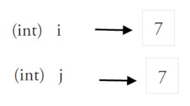
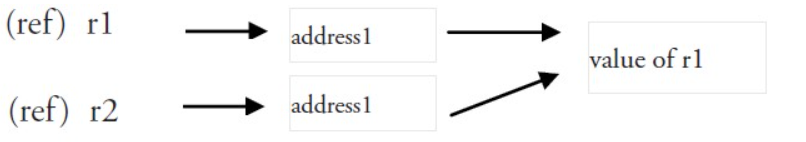

##### 1 变量类型：值类型变量和引用类型变量

###### （1）值类型变量

所有像 int、float、bool 和 string 这些基本类型都属于值类型，使用这些类型的变量直接指向存在内存中的值，当使用等号 `=` 将一个变量的值赋值给另一个变量时，如：`j = i`，实际上是在内存中将 `i` 的值进行了拷贝，也就是变量`j`所有指向内存中的值和变量`i`所指向内存中的值相等，但是是两个互不影响的值。也就是`i`改变了，`j`并不会改变。



###### （2）引用类型变量

一个引用类型的变量 `r1` 存储的是 `r1` 的值所在的内存地址（数字），或内存地址中第一个字所在的位置。这个内存地址称之为指针，这个指针实际上也被存在另外的某一个值中。如下所示。



#####  2 := 赋值操作符

go语言中声明变量有以下几种方式：

```go
var a int //a=0
var a int = 1 //a=1
var a, b int // a = b = 0
var a, b int = 1, 2 // a = 1, b = 2
var a, b = 1, "abc" // a = 1, b = "abc"
var (  // 这种因式分解关键字的写法一般用于声明全局变量
    a int
    b bool
)
a := 1 //只能用在函数中
a, b := 1, "abc" //只能用在函数中
```

```go
a := 1
```

`:=`等价于下面2行

```go
var a int
a = 1
```

##### 3 常量

定义常量

```go
const identifier [type] = value
const a string = "abc" //显示
const a = "abc"  //隐示
const a, b, c = 1, 2, 3
```

常量可用作枚举：

```go
const (
    Unknown = 0
    Female = 1
    Male = 2
)
```

常量可以用len(), cap(), unsafe.Sizeof()函数计算表达式的值。常量表达式中，**函数必须是内置函数，否则编译不过**

```go
const (
    a = "abc"
    b = len(a)
    c = unsafe.Sizeof(a)
)
```

特殊常量`iota`

iota，特殊常量，可以认为是一个可以被编译器修改的常量。

iota 在 const关键字出现时将被重置为 0(const 内部的第一行之前)，const 中每新增一行常量声明将使 iota 计数一次(iota 可理解为 const 语句块中的行索引)。

iota 可以被用作枚举值：

```go
const (
    a = iota //a=0
    b = iota //b=1
    c = iota //c=2
)
```

上述可简写：

```go
const (
    a = iota //a=0
    b //b=1
    c //c=2
)
```

iota用法：

```go
const (
    a = iota   //0
    b          //1
    c          //2
    d = "ha"   //独立值，iota += 1
    e          //"ha"   iota += 1
    f = 100    //iota +=1
    g          //100  iota +=1
    h = iota   //7,恢复计数
    i          //8
)
```

