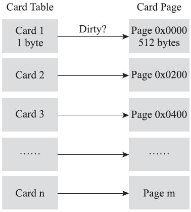
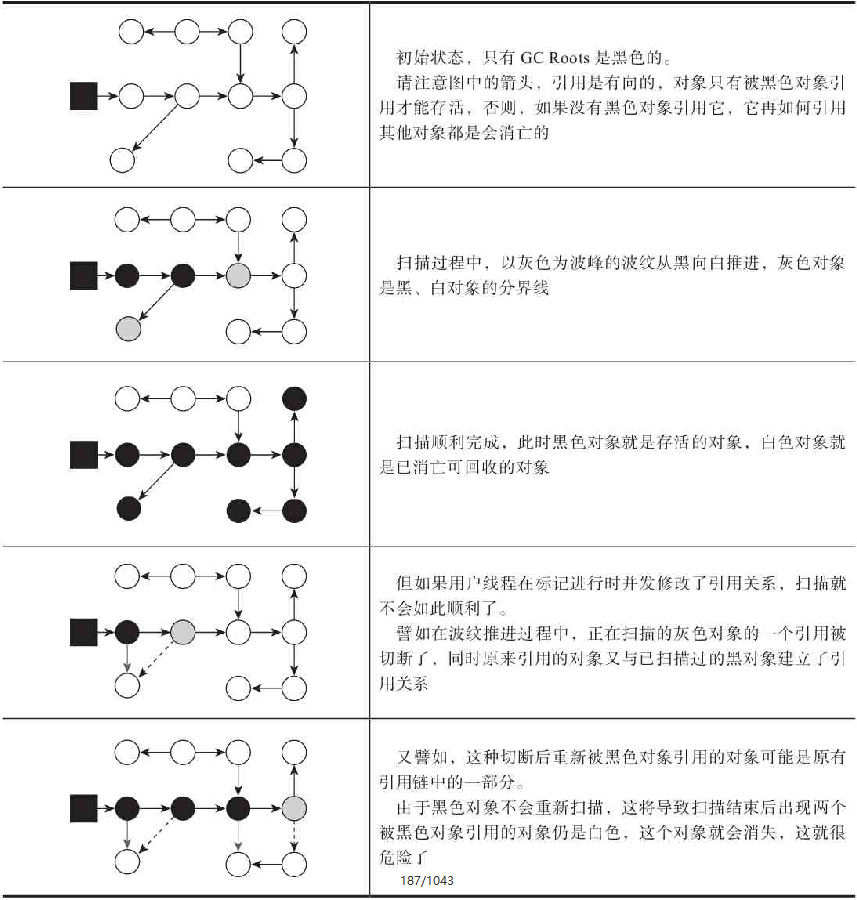

# JVM虚拟机垃圾收集过程中的细节

## 1 根节点枚举

以可达性分析算法中从GC Roots集合找引用链这个操作作为介绍虚拟机高效实现的第一个例子。固定可作为GC Roots的节点主要在全局性的引用（例如常量或类静态属性）与执行上下文（例如栈帧中的本地变量表）中，尽管目标明确，但查找过程要做到高效并非一件容易的事情，现在Java应用越做越庞大，光是方法区的大小就常有数百上千兆，里面的类、常量等更是恒河沙数，若要逐个检查以这里为起源的引用肯定得消耗不少时间。

**迄今为止，所有垃圾收集器在根节点枚举这一步骤时都是必须暂停用户线程的**，根节点枚举与之前提及的**整理内存碎片**一样会因为“**Stop The World**”而导致应用出现短暂的停顿。现在可达性分析算法耗时最长的查找引用链的过程已经可以与用户线程一起并发，**但根节点枚举始终还是必须在一个能保障一致性的快照中才得以进行**——这里“一致性”的意思是整个枚举期间执行子系统看起来就像被冻结在某个时间点上，不会出现分析过程中，根节点集合的对象引用关系还在不断变化的情况，若这点不能满足的话，分析结果准确性也就无法保证。**这是导致垃圾收集过程必须停顿所有用户线程的其中一个重要原因**，即使是号称停顿时间可控，或者（几乎）不会发生停顿的CMS、G1、ZGC等收集器，枚举根节点时也是必须要停顿的。

> 为什么垃圾收集过程中，必须停顿**用户线程**？
>
> 在进行垃圾收集与分析的过程中，根节点集合的对象引用关系如果还在不断变化，分析结果准确性的将无法保证，有可能出现以下两种情况：
>
> 1. 浮动垃圾：将是垃圾的对象标记成“活”的对象，这个能接受，不过就是下次垃圾回收时将该对象回收掉就行；
> 2. 对象消失：将不是垃圾的对象标记成“垃圾”对象，也就是，本次垃圾回收将一些还在使用的对象给清除了，这就很危险了，会导致程序出错甚至崩溃

由于目前主流Java虚拟机使用的都是准确式垃圾收集，所以当用户线程停顿下来之后，其实并不需要一个不漏地检查完所有执行上下文和全局的引用位置，虚拟机应当是有办法直接得到哪些地方存放着对象引用的。在HotSpot的解决方案里，是使用一组称为OopMap的数据结构来达到这个目的。一旦类加载动作完成的时候，HotSpot就会把对象内什么偏移量上是什么类型的数据计算出来，在即时编译（见第11章）过程中，也会在特定的位置记录下栈里和寄存器里哪些位置是引用。这样收集器在扫描时就可以直接得知这些信息了，并不需要真正一个不漏地从方法区等GC Roots开始查找。

> 什么是准确式垃圾收集？
>
> 准确式内存管理是指虚拟机可以知道内存中某个位置的数据具体是什么类型。譬如内存中有一个32bit的整数123456，虚拟机将有能力分辨出它到底是一个指向了123456的内存地址的引用类型还是一个数值为123456的整数，准确分辨出哪些内存是引用类型，这也是在垃圾收集时准确判断堆上的数据是否还可能被使用的前提。由于使用了准确式内存管理，Exact VM可以抛弃掉以前Classic VM基于句柄（Handle）的对象查找方式（原因是垃圾收集后对象将可能会被移动位置，如果地址为123456的对象移动到654321，在没有明确信息表明内存中哪些数据是引用类型的前提下，那虚拟机肯定是不敢把内存中所有为123456的值改成654321的，所以要使用句柄来保持引用值的稳定），这样每次定位对象都少了一次间接查找的开销，显著提升执行性能。

下面的代码是HotSpot虚拟机客户端模式下生成的一段String::hashCode()方法的本地代码，可以看到在0x026eb7a9处的call指令有OopMap记录，它指明了EBX寄存器和栈中偏移量为16的内存区域中各有一个普通对象指针（Ordinary Object Pointer，OOP）的引用，有效范围为从call指令开始直到0x026eb730（指令流的起始位置）+142（OopMap记录的偏移量）=0x026eb7be，即hlt指令为止。

```
[Verified Entry Point]
0x026eb730: mov    %eax,-0x8000(%esp)
…………
;; ImplicitNullCheckStub slow case
0x026eb7a9: call   0x026e83e0       ; OopMap{ebx=Oop [16]=Oop off=142}
                                    ; *caload
                                    ; - java.lang.String::hashCode@48 (line 1489)
                                    ;   {runtime_call}
    0x026eb7ae: push   $0x83c5c18   ;   {external_word}
    0x026eb7b3: call   0x026eb7b8
    0x026eb7b8: pusha
    0x026eb7b9: call   0x0822bec0   ;   {runtime_call}
    0x026eb7be: hlt
```

## 2 安全点（Safe Point）

在OopMap的协助下，HotSpot可以快速准确地完成GC Roots枚举，但又有一个问题：可能导致引用关系变化，或者说导致OopMap内容变化的指令非常多，如果为每一条指令都生成对应的OopMap，那将会需要大量的额外存储空间，这样垃圾收集伴随而来的空间成本就会变得无法忍受的高昂。

实际上HotSpot也的确没有为每条指令都生成OopMap，只是在“特定的位置”记录了这些信息，这些位置被称为安全点（Safepoint）。有了安全点的设定，也就决定了用户程序执行时并非在代码指令流的任意位置都能够停顿下来开始垃圾收集，而是强制要求必须执行到达安全点后才能够暂停。因此，安全点的选定既不能太少以至于让收集器等待时间过长，也不能太过频繁以至于过分增大运行时的内存负荷。安全点位置的选取基本上是以“是否具有让程序长时间执行的特征”为标准进行选定的，因为每条指令执行的时间都非常短暂，程序不太可能因为指令流长度太长这样的原因而长时间执行，“长时间执行”的最明显特征就是指令序列的复用，例如方法调用、循环跳转、异常跳转等都属于指令序列复用，所以只有具有这些功能的指令才会产生安全点:

1. 方法调用，例如在A类中调用B类的m方法
2. 循环跳转，例如for循环
3. 异常跳转，有可能抛出异常的代码的位置

那如何在垃圾收集发生时让所有线程（这里其实不包括执行JNI调用的线程）都跑到最近的安全点，然后停顿下来。

1. 抢先式中断（Preemptive Suspension）不需要线程的执行代码主动去配合，在垃圾收集发生时，系统首先把所有用户线程全部中断，如果发现有用户线程中断的地方不在安全点上，就恢复这条线程执行，让它一会再重新中断，直到跑到安全点上。现在几乎没有虚拟机实现采用抢先式中断来暂停线程响应GC事件。

2. 主动式中断（Voluntary Suspension）的思想是当垃圾收集需要中断线程的时候，不直接对线程操作，仅仅简单地设置一个标志位，各个线程执行过程时会不停地主动去轮询这个标志，一旦发现中断标志为真时就自己在最近的安全点上主动中断挂起。**轮询标志的地方和安全点是重合的**，另外还要加上所有创建对象和其他需要在Java堆上分配内存的地方，这是为了检查是否即将要发生垃圾收集，避免没有足够内存分配新对象。

由于轮询操作在代码中会频繁出现，这要求它必须足够高效。HotSpot使用内存保护陷阱的方式，把轮询操作精简至只有一条汇编指令的程度。下面代码中的test指令就是HotSpot生成的轮询指令，当需要暂停用户线程时，虚拟机把0x160100的内存页设置为不可读，那线程执行到test指令时就会产生一个自陷异常信号，然后在预先注册的异常处理器中挂起线程实现等待，这样仅通过一条汇编指令便完成安全点轮询和触发线程中断了。

```
0x01b6d627: call   0x01b2b210          ; OopMap{[60]=Oop off=460}
                                       ; *invokeinterface size
                                       ; - Client1::main@113 (line 23)
                                       ;   {virtual_call}
    0x01b6d62c: nop                    ; OopMap{[60]=Oop off=461}
                                       ; *if_icmplt
                                       ; - Client1::main@118 (line 23)
    0x01b6d62d: test   %eax,0x160100   ;   {poll}
    0x01b6d633: mov    0x50(%esp),%esi
    0x01b6d637: cmp    %eax,%esi
```

## 3 安全区域（Safe Region）

使用安全点的设计似乎已经完美解决如何停顿用户线程，让虚拟机进入垃圾回收状态的问题了，但实际情况却并不一定。

安全点机制保证了程序执行时，在不太长的时间内就会遇到可进入垃圾收集过程的安全点。但是，程序在“不执行”的时候无法进入安全点。**所谓的程序不执行就是没有分配处理器时间，典型的场景便是用户线程处于Sleep状态或者Blocked状态**，这时候线程无法响应虚拟机的中断请求，不能再走到安全的地方去中断挂起自己，虚拟机也显然不可能持续等待线程重新被激活分配处理器时间。对于这种情况，就必须引入**安全区域（Safe Region）**来解决。

**安全区域是指能够确保在某一段代码片段之中，引用关系不会发生变化，因此，在这个区域中任意地方开始垃圾收集都是安全的。我们也可以把安全区域看作被扩展拉伸了的安全点。**

当用户线程执行到安全区域里面的代码时，首先会标识自己已经进入了安全区域，那样当这段时间里虚拟机要发起垃圾收集时就不必去管这些在安全区域内的线程了。

当线程要离开安全区域时，它要检查**虚拟机是否已经完成了根节点枚举**或者**垃圾收集过程中其他需要暂停用户线程的阶段**

1. 如果完成了，那线程就当作没事发生过，继续执行；
2. 否则它就必须一直等待，直到收到可以离开安全区域的信号为止。

## 4 记忆集（Remembered Set）与卡表（Card Table）

在Java应用中，由于采用分代垃圾回收机制，那么可能存在跨代引用的情况（新生代的对象引用老年代的对象，或者老年代的对象引用新生代的对象），那再垃圾收集时，如果存在跨代引用的情况，则就需要将新生代和老年代都一起扫描。

**为了避免把整个老年代加仅GC Roots的扫描范围，垃圾收集器在新生代中建立了名为记忆集（Remembered Set）的数据结构**。事实上并不只是新生代、老年代之间才有跨代引用的问题，所有涉及部分区域收集（Partial GC）行为的垃圾收集器，都有跨代引用的问题（典型的如G1、ZGC和Shenandoah收集器）。

**记忆集是一种用于记录从非收集区域指向收集区域的指针集合的抽象数据结构**。如果不考虑效率和成本的话，最简单的实现可以用非收集区域中所有含跨代引用的对象数组来实现这个数据结构，如下代码所示：

```Java
Class RememberedSet {
    Object[] set[OBJECT_INTERGENERATIONAL_REFERENCE_SIZE];
}
```

这种记录全部含跨代引用对象的实现方案，无论是空间占用还是维护成本都相当高昂。而在垃圾收集的场景中，收集器只需要通过记忆集判断出某一块非收集区域是否存在有指向了收集区域的指针就可以了，并不需要了解这些跨代指针的全部细节。那设计者在实现记忆集的时候，便可以选择更为粗犷的记录粒度来节省记忆集的存储和维护成本，下面列举了一些可供选择的记录精度：

- 字长精度：每个记录精确到一个机器字长（就是处理器的寻址位数，如常见的32位或64位，这个精度决定了机器访问物理内存地址的指针长度），该字包含跨代指针。

- 对象精度：每个记录精确到一个对象，该对象里有字段含有跨代指针。
- 卡精度：每个记录精确到一块内存区域，该区域内有对象含有跨代指针。

其中，第三种“卡精度”所指的是用一种称为“卡表”（Card Table）的方式去实现记忆集，这也是目前最常用的一种记忆集实现形式。前面定义中提到记忆集其实是一种“抽象”的数据结构，**抽象的意思是只定义了记忆集的行为意图，并没有定义其行为的具体实现**。卡表就是记忆集的一种具体实现，它定义了记忆集的记录精度、与堆内存的映射关系等。
卡表最简单的形式可以只是一个字节数组，而HotSpot虚拟机确实也是这样做的。以下这行代码是HotSpot默认的卡表标记逻辑：

```
CARD_TABLE [this address >> 9] = 0;
```

字节数组CARD_TABLE的每一个元素都对应着其标识的内存区域中一块特定大小的内存块，这个内存块被称作“卡页”（Card Page）。一般来说，卡页大小都是以2的N次幂的字节数，通过上面代码可以看出HotSpot中使用的卡页是2的9次幂，即512字节（地址右移9位，相当于用地址除以512）。那如果卡表标识内存区域的起始地址是0x0000的话，数组CARD_TABLE的第0、1、2号元素，分别对应了地址范围为0x0000～0x01FF、0x0200～0x03FF、0x0400～0x05FF的卡页内存块，如图所示。



一个卡页的内存中通常包含不止一个对象，只要卡页内有一个（或更多）对象的字段存在着跨代指针，那就将对应卡表的数组元素的值标识为1，称为这个元素变脏（Dirty），没有则标识为0。在垃圾收集发生时，只要筛选出卡表中变脏的元素，就能轻易得出哪些卡页内存块中包含跨代指针，把它们加入GC Roots中一并扫描。

## 5 写屏障

**记忆集解决了缩减GC Roots扫描范围的问题，但还没有解决卡表元素如何维护的问题，例如它们何时变脏、谁来把它们变脏等。**

> **卡表元素何时变脏？**
>
> 有其他分代区域中对象引用了本区域对象时，其对应的卡表元素就应该变脏，变脏时间点原则上应该发生在引用类型字段赋值的那一刻。

> **如何变脏？**
>
> 即如何在对象赋值的那一刻去更新维护卡表呢？假如是解释执行的字节码，那相对好处理，虚拟机负责每条字节码指令的执行，有充分的介入空间；但在编译执行的场景中呢？经过即时编译后的代码已经是纯粹的机器指令流了，这就必须找到一个在机器码层面的手段，把维护卡表的动作放到每一个赋值操作之中。

在HotSpot虚拟机里是通过写屏障（Write Barrier）技术维护卡表状态。写屏障可以看作在虚拟机层面对“引用类型字段赋值”这个动作的AOP切面，在引用对象赋值时会产生一个环形（Around）通知，供程序执行额外的动作，也就是说赋值的前后都在写屏障的覆盖范畴内。在赋值前的部分的写屏障叫作写前屏障（Pre-Write Barrier），在赋值后的则叫作写后屏障（Post-Write Barrier）。HotSpot虚拟机的许多收集器中都有使用到写屏障，但直至G1收集器出现之前，其他收集器都只用到了写后屏障。下面这段代码是一段更新卡表状态的简化逻辑：

```c
void oop_field_store(oop* field, oop new_value) {
    // 引用字段赋值操作
    *field = new_value;
    // 写后屏障，在这里完成卡表状态更新
    post_write_barrier(field, new_value);
}
```

应用写屏障后，虚拟机就会为所有赋值操作生成相应的指令，一旦收集器在写屏障中增加了更新卡表操作，无论更新的是不是老年代对新生代对象的引用，每次只要对引用进行更新，就会产生额外的开销，不过这个开销与Minor GC时扫描整个老年代的代价相比还是低得多的。

除了写屏障的开销外，卡表在高并发场景下还面临着“伪共享”（False Sharing）问题。

> **伪共享是处理并发底层细节时一种经常需要考虑的问题，现代中央处理器的缓存系统中是以缓存行（Cache Line）为单位存储的，当多线程修改互相独立的变量时，如果这些变量恰好共享同一个缓存行，就会彼此影响（写回、无效化或者同步）而导致性能降低，这就是伪共享问题。**

假设处理器的缓存行大小为64字节，由于一个卡表元素占1个字节，64个卡表元素将共享同一个缓存行。这64个卡表元素对应的卡页总的内存为32KB（64×512字节），也就是说如果不同线程更新的对象正好处于这32KB的内存区域内，就会导致更新卡表时正好写入同一个缓存行而影响性能。为了避免伪共享问题，一种简单的解决方案是**不采用无条件的写屏障，而是先检查卡表标记，只有当该卡表元素未被标记过时才将其标记为变脏**，即将卡表更新的逻辑变为以下代码所示：

```c
if (CARD_TABLE [this address >> 9] != 0)
    CARD_TABLE [this address >> 9] = 0;
```

在JDK 7之后，HotSpot虚拟机增加了一个新的参数`-XX：+UseCondCardMark`，用来决定是否开启卡表更新的条件判断。开启会增加一次额外判断的开销，但能够避免伪共享问题，两者各有性能损耗，是否打开要根据应用实际运行情况来进行测试权衡。

> **Java中的内存屏障？**
>
> 为什么会有内存屏障？
>
> 1. 每个CPU都会有自己的缓存(有的甚至L1,L2,L3)，缓存的目的就是为了提高性能，避免每次都要向内存取。但是这样的弊端也很明显：不能实时的和内存发生信息交换，分在不同CPU执行的不同线程对同一个变量的缓存值不同。
> 2. Java中用volatile关键字修饰变量可以解决上述问题，那么volatile是如何做到这一点的呢？那就是内存屏障，内存屏障是硬件层的概念，不同的硬件平台实现内存屏障的手段并不是一样，java通过屏蔽这些差异，统一由jvm来生成内存屏障的指令。
>
> 内存屏障：
>
> 1. 硬件层的内存屏障分为两种：Load Barrier（读屏障） 和 Store Barrier（写屏障）。
> 2. 内存屏障有两个作用：
>    1. 阻止屏障两侧的指令重排序；
>    2. 强制把写缓冲区/高速缓存中的脏数据等写回主内存，让缓存中相应的数据失效。
> 3. 对于Load Barrier来说，在指令前插入Load Barrier，可以让高速缓存中的数据失效，强制从主内存加载数据；
> 4. 对于Store Barrier来说，在指令后插入Store Barrier，能让写入缓存中的最新数据更新写入主内存，让其他线程可见。
>
> java内存屏障：
>
> java的内存屏障有四种，实际上也是上述两种的组合，完成一系列的屏障和数据同步功能。
>
> 1. LoadLoad屏障：Load1; LoadLoad; Load2，在Load2及后续读操作要读取的数据被访问前，保证Load1要读取的数据被读取完毕。
> 2. StoreStore屏障：Store1; StoreStore; Store2，在Store2及后续写操作执行前，保证Store1的写操作对其它处理器可见。
> 3. LoadStore屏障：Load1; LoadStore; Store2，在Store2及后续写操作被刷出前，保证Load1要读取的数据被读取完毕。
> 4. StoreLoad屏障：Store1; StoreLoad; Load2，在Load2及后续所有读操作执行前，保证Store1的写入对所有处理器可见。 它的开销是四种屏障中最大的。在大多数处理器的实现中，这个屏障是个万能屏障，兼具其它三种内存屏障的功能
>
> volatile语义中的内存屏障：
>
> - 在每个volatile写操作前插入StoreStore屏障，在写操作后插入StoreLoad屏障； 在每个volatile读操作前插入LoadLoad屏障，在读操作后插入LoadStore屏障；
> - 由于内存屏障的作用，避免了volatile变量和其它指令重排序、线程之间实现了通信，使得volatile表现出了锁的特性。
>
> final语义中的内存屏障：
>
> - 对于final域，编译器和CPU会遵循两个排序规则：
>   1. 新建对象过程中，构造体中对final域的初始化写入和这个对象赋值给其他引用变量，这两个操作不能重排序；
>   2. 初次读包含final域的对象引用和读取这个final域，这两个操作不能重排序；(就是先赋值，再调用final值)
>
> 总之上面规则，必需保证一个对象的所有final域被写入完毕后才能引用和读取。这也是内存屏障的起的作用：
>
> - 写final域：在编译器写final域完毕，构造体结束之前，会插入一个StoreStore屏障，保证前面的对final写入对其他线程/CPU可见，并阻止重排序。
> - 读final域：在上述规则2中，两步操作不能重排序的机理就是在读final域前插入了LoadLoad屏障。
>
> X86处理器中，由于CPU不会对写-写操作进行重排序，所以StoreStore屏障会被省略；而X86也不会对逻辑上有先后依赖关系的操作进行重排序，所以LoadLoad也会变省略。

## 6 并发可达性分析

当前主流编程语言的垃圾收集器基本上都是依靠可达性分析算法来判定对象是否存活的，可达性分析算法理论上要求全过程都基于一个能保障一致性的快照中才能够进行分析，这意味着必须全程冻结用户线程的运行。在根节点枚举这个步骤中，由于GC Roots相比起整个Java堆中全部的对象毕竟还算是极少数，且在各种优化技巧（如OopMap）的加持下，它带来的停顿已经是非常短暂且相对固定（不随堆容量而增长）的了。可从GC Roots再继续往下遍历对象图，这一步骤的停顿时间就必定会与Java堆容量直接成正比例关系了：堆越大，存储的对象越多，对象图结构越复杂，要标记更多对象而产生的停顿时间自然就更长，这听起来是理所当然的事情。

要知道包含“标记”阶段是所有追踪式垃圾收集（tracing gc）算法的共同特征，如果这个阶段会随着堆变大而等比例增加停顿时间，其影响就会波及几乎所有的垃圾收集器，同理可知，如果能够削减这部分停顿时间的话，那收益也将会是系统性的。

想解决或者降低用户线程的停顿，就要先搞清楚为什么必须在一个能保障一致性的快照上才能进行对象图的遍历？为了能解释清楚这个问题，引入三色标记（Tri-color Marking）作为工具来辅助推导，把遍历对象图过程中遇到的对象，按照“是否访问过”这个条件标记成以下三种颜色：

- 白色：表示对象尚未被垃圾收集器访问过。显然在可达性分析刚刚开始的阶段，所有的对象都是白色的，若在分析结束的阶段，仍然是白色的对象，即代表不可达。
- 黑色：表示对象已经被垃圾收集器访问过，且这个对象的所有引用都已经扫描过。黑色的对象代表已经扫描过，它是安全存活的，如果有其他对象引用指向了黑色对象，无须重新扫描一遍。黑色对象不可能直接（不经过灰色对象）指向某个白色对象。
- 灰色：表示对象已经被垃圾收集器访问过，但这个对象上至少存在一个引用还没有被扫描过。

关于可达性分析的扫描过程，分以下两种情况：

1. 如果用户线程此时是冻结的，只有收集器线程在工作，那不会有任何问题。

2. 如果用户线程与收集器是并发工作，收集器在对象图上标记颜色，同时用户线程在修改引用关系——即修改对象图的结构，这样可能出现两种后果。一种是把原本消亡的对象错误标记为存活，这不是好事，但其实是可以容忍的，只不过产生了一点逃过本次收集的浮动垃圾而已，下次收集清理掉就好。另一种是把原本存活的对象错误标记为已消亡，这就是非常致命的后果了，程序肯定会因此发生错误，下图演示了这样的致命错误具体是如何产生的。

   - 浮动垃圾(多标)：将原本应该被清除的对象，误标记为存活对象。后果是垃圾回收不彻底，浮动垃圾并不会影响应用程序的正确性，只是需要等到下一轮垃圾回收中才被清除。

   - 对象消失(漏标)：**将原本应该存活的对象，误标记为需要清理的对象。后果很严重，影响程序运行，是不可容忍的。**



Wilson于1994年在理论上证明了，当且仅当以下两个条件同时满足时，会产生“对象消失”的问题，即原本应该是黑色的对象被误标为白色：

- 赋值器插入了一条或多条从黑色对象到白色对象的新引用；
- 赋值器删除了全部从灰色对象到该白色对象的直接或间接引用。

因此，我们要解决并发扫描时的对象消失问题，只需破坏这两个条件的任意一个即可。由此分别产生了两种解决方案：**增量更新（Incremental Update）**和**原始快照（Snapshot At The Beginning，SATB）**。

- 增量更新要破坏的是第一个条件，当黑色对象插入新的指向白色对象的引用关系时，就将这个新插入的引用记录下来，等并发扫描结束之后，再将这些记录过的引用关系中的黑色对象为根，重新扫描一次。这可以简化理解为，黑色对象一旦新插入了指向白色对象的引用之后，它就变回灰色对象了。
- 原始快照要破坏的是第二个条件，当灰色对象要删除指向白色对象的引用关系时，就将这个要删除的引用记录下来，在并发扫描结束之后，再将这些记录过的引用关系中的灰色对象为根，重新扫描一次。这也可以简化理解为，无论引用关系删除与否，都会按照刚刚开始扫描那一刻的对象图快照来进行搜索。

增量更新可以理解为：在垃圾收集器与用户线程并发工作的过程中，如果用户线程修改了对象间的引用关系，将垃圾收集过程中的这些变化的引用关系记录下来（引用关系存在卡表中），然后等垃圾收集器完成并发垃圾收集的动作之后，再将这些暂存的对象重新进行一次标记，**此次标记是需要冻结用户线程（STW）的**，虽然需要STW，但是相对于将整个垃圾收集的过程进行冻结相比，重新标记的对象数量要远远小于需要并发标记阶段的对象数量，因此，停顿时间也是可以接受的，这也是为什么说CMS垃圾收集器是几乎不停顿用户线程的原因。

以上无论是对引用关系记录的插入还是删除，虚拟机的记录操作都是通过写屏障实现的。在HotSpot虚拟机中，增量更新和原始快照这两种解决方案都有实际应用，譬如，**CMS是基于增量更新来做并发标记的，G1、Shenandoah则是用原始快照来实现。**

> **为什么G1用SATB？CMS用增量更新？**
>
> 增量更新：黑色对象新增一条指向白色对象的引用，那么要进行深入扫描白色对象及它的引用对象。
>
> 原始快照：灰色对象删除了一条指向白色对象的引用，实际上就产生了浮动垃圾，好处是不需要像 CMS 那样 remark，再走一遍 root trace 这种相当耗时的流程。
>
> SATB相对增量更新效率会高(当然SATB可能造成更多的浮动垃圾)，因为不需要在重新标记阶段再次深度扫描被删除引用对象，而CMS对增量引用的根对象会做深度扫描，G1因为很多对象都位于不同的region，CMS就一块老年代区域，重新深度扫描对象的话G1的代价会比CMS高，所以G1选择SATB不深度扫描对象，只是简单标记，等到下一轮GC再深度扫描。

# Reference

1. [jvm oopmap 具体是怎样的一种数据结构？](https://www.zhihu.com/question/356385474)
1. [写屏障是什么_JVM的内存屏障Memory barrier](https://blog.csdn.net/weixin_39572972/article/details/111581942)
1. [JVM 三色标记 增量更新 原始快照](https://www.cnblogs.com/hongdada/p/14578950.html)
1. [深入浅出垃圾回收（三）增量式 GC](https://liujiacai.net/blog/2018/08/04/incremental-gc/)

