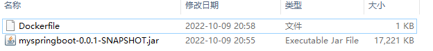

# idea集成Docker实现SpringBoot微服务镜像打包一键部署

## 1 手动打包docker镜像

首先将我们需要运行的springboot项目打成jar包，然后将对应的jar包移动包dockerfile目录，如下所示：



```dockerfile
FROM openjdk:8u181-jdk
LABEL NAME="ZHUHONGGEN"
WORKDIR /ROOT
ADD './myspringboot-0.0.1-SNAPSHOT.jar' 'app.jar'
EXPOSE 8990
ENTRYPOINT [ "java", "-jar", "app.jar" ]
```

然后在命令行执行以下命令，构建docker镜像：

```
cd /docker
docker build -t java-docker-t .
```

然后在启动docker容器：

```
docker run -it --name java-docker-test -p 8080:8080 java-docker-t
```

然后再浏览器输入http://localhost:8080即可访问。