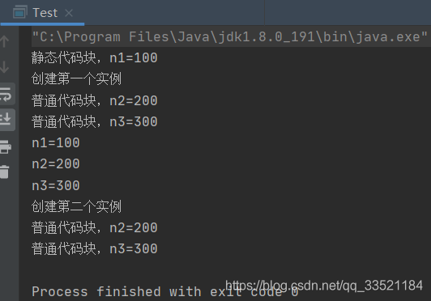
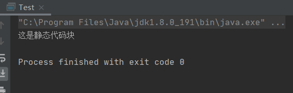
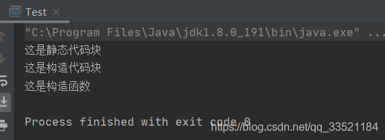
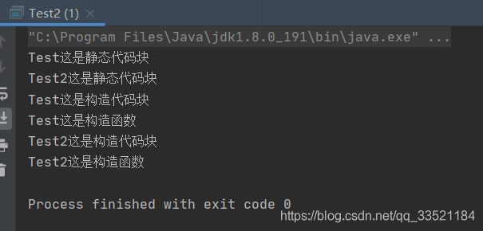

# java中的静态代码块、构造代码块以及构造函数的初始化顺序

## 1 构造代码块

`构造代码块`就是在类中用`{}`括起来的代码块，如下所示，普通代码块按照顺序从上到下依次执行。

```java
public class Test{
	{
		//这是构造代码块
	}
}
```
## 2 静态代码块
`静态代码块`就是使用`static`修饰的用`{}`括起来的代码段，如下所示，静态代码块用于给静态变量进行赋值，
**且：静态代码块`只`在类加载时执行，而且静态代码块只能给静态变量赋值，不能给成员变量赋值。**
```java
static{
	//这里是静态代码块，
	//静态代码块中的代码会优先于
}
```
### 静态代码块`只`在类加载时执行
```java
public class Test{
    static int n1;
    int n2;
    int n3;

    {
        n2=200;
        System.out.println("普通代码块，n2="+n2);
    }
    {
        n3=300;
        System.out.println("普通代码块，n3="+n3);
    }
    static {
        n1=100;
        System.out.println("静态代码块，n1="+n1);
    }
    public static void main(String[] args) {
        System.out.println("创建第一个实例");
        Test test = new Test();
        System.out.println("n1="+n1);
        System.out.println("n2="+test.n2);
        System.out.println("n3="+test.n3);
        System.out.println("创建第二个实例");
        Test test2 = new Test();
    }

}
```

从运行结果可以看出，静态代码块`真的`只在类加载时执行，之后就不在执行了，且静态代码块的执行顺序要优于普通代码块。

## 3 构造函数
构造函数是类进行初始化的一个函数，其名字和类名相同且必须相同，构造函数可以不用显示声明，如果没有显示声明，则`Java`会执行默认的构造函数，构造函数的执行顺序在构造代码块之后，构造代码块是用来给类的非静态属性或变量进行初始化的。

## 4 三者的顺序对比
### 4.1 例子1
```java
public class Test {

    public Test() {
        System.out.println("这是构造函数");
    }
    {
        System.out.println("这是构造代码块");
    }
    static {
        System.out.println("这是静态代码块");
    }

    public static void main(String[] args) {

    }
}
```


### 4.2 例子2
```java
public class Test {

    public Test() {
        System.out.println("这是构造函数");
    }
    {
        System.out.println("这是构造代码块");
    }
    static {
        System.out.println("这是静态代码块");
    }

    public static void main(String[] args) {
        Test test = new Test();
    }
}
```


### 4.3 例子3（继承）
在类与类的继承关系中，父类的静态代码块最先执行，然后再是子类的静态代码块执行，之后便是父类的构造代码块和构造函数，最后才是子类的构造代码块和构造函数执行。
```java
public class Test {

    public Test() {
        System.out.println("Test这是构造函数");
    }
    {
        System.out.println("Test这是构造代码块");
    }
    static {
        System.out.println("Test这是静态代码块");
    }
}
```
```java
public class Test2 extends Test{
    public Test2() {
        System.out.println("Test2这是构造函数");
    }
    {
        System.out.println("Test2这是构造代码块");
    }
    static {
        System.out.println("Test2这是静态代码块");
    }

    public static void main(String[] args) {
        Test2 test2 = new Test2();
    }
}
```
