## Java内存模型(JMM)

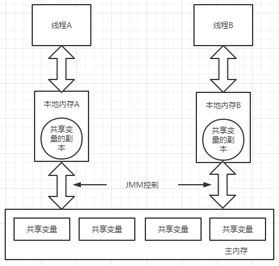

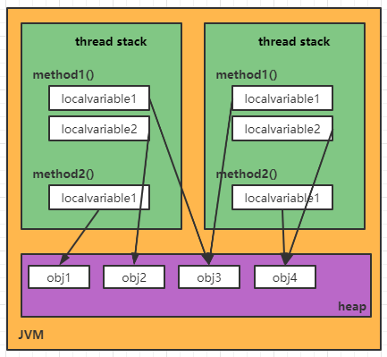

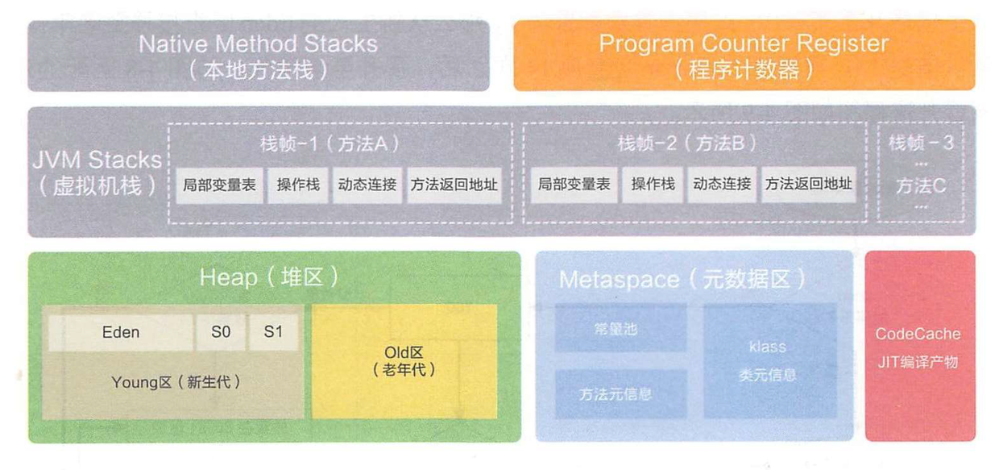

1. Java中的基本数据类型（int、char、long、double等），总是存储在线程栈上
2. 引用对象存在在heap（堆）内存总，而指向对象的reference指针存放在栈中，具体的对象实例存储在heap中
3. jvm虚拟机内存模型规定所有变量都存在主内存中（heap），为了高效性，每个线程都有自己的内存，所以线程对变量的操作都会在自己工作内存中运行

### 1 Java虚拟机（JVM）运行时数据区

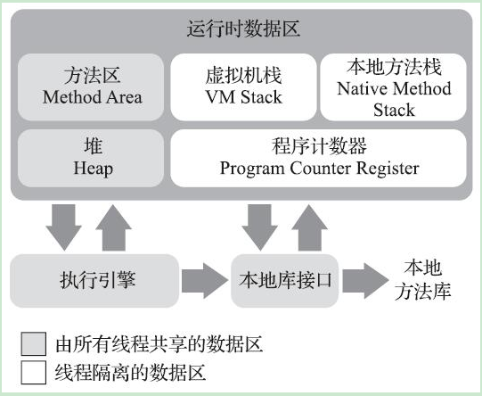

其中包括以下几个区域：

1. 程序计数器（Program Counter Register）| 线程私有
2. 虚拟机栈（VM Stack）| 线程私有
3. 本地方法栈（Native Method Stack）| 线程私有
4. 堆（Heap）| 所有线程可见
5. 方法区（Method Area）| 所有线程可见

以上5个jvm的运行时数据区，除了程序计数器之外，虚拟机栈、本地方法栈、堆、方法区都有可能抛出内存不足（OutOfMemeryError）的异常。

#### 1.1 程序计数器（Program Counter Register）| 线程私有

> 程序计数器（Program Counter Register）是一块较小的内存空间，它可以看作是当前线程所执行的字节码的行号指示器。在Java虚拟机的概念模型里，字节码解释器工作时就是通过改变这个计数器的值来选取下一条需要执行的字节码指令，它是程序控制流的指示器，分支、循环、跳转、异常处理、线程恢复等基础功能都需要依赖这个计数器来完成。
> 由于Java虚拟机的多线程是通过线程轮流切换、分配处理器执行时间的方式来实现的，在任何一个确定的时刻，一个处理器（对于多核处理器来说是一个内核）都只会执行一条线程中的指令。因此，为了线程切换后能恢复到正确的执行位置，每条线程都需要有一个独立的程序计数器，各条线程之间计数器互不影响，独立存储，我们称这类内存区域为“线程私有”的内存。
> 如果线程正在执行的是一个Java方法，这个计数器记录的是正在执行的虚拟机字节码指令的地址；如果正在执行的是本地（Native）方法，这个计数器值则应为空（Undefined）。**此内存区域是唯一一个在《Java虚拟机规范》中没有规定任何OutOfMemoryError情况的区域。**

#### 1.2 虚拟机栈（VM Stack）| 线程私有

> 与程序计数器一样，Java虚拟机栈（Java Virtual Machine Stack）也是线程私有的，它的生命周期与线程相同。虚拟机栈描述的是Java方法执行的线程内存模型：每个方法被执行的时候，Java虚拟机都会同步创建一个栈帧（Stack Frame）用于存储局部变量表、操作数栈、动态连接、方法出口等信息。每一个方法被调用直至执行完毕的过程，就对应着一个栈帧在虚拟机栈中从入栈到出栈的过程。
> 经常有人把Java内存区域笼统地划分为堆内存（Heap）和栈内存（Stack），这种划分方式直接继承自传统的C、C++程序的内存布局结构，在Java语言里就显得有些粗糙了，实际的内存区域划分要比这更复杂。不过这种划分方式的流行也间接说明了程序员最关注的、与对象内存分配关系最密切的区域是“堆”和“栈”两块。其中，“堆”通常指Java用`new`生成的实例对象，而“栈”通常就是指这里讲的虚拟机栈，或者更多的情况下只是指虚拟机栈中局部变量表部分。
> 局部变量表存放了编译期可知的各种Java虚拟机基本数据类型（boolean、byte、char、short、int、float、long、double）、对象引用（reference类型，它并不等同于对象本身，可能是一个指向对象起始地址的引用指针，也可能是指向一个代表对象的句柄或者其他与此对象相关的位置）和returnAddress类型（指向了一条字节码指令的地址）。
> 这些数据类型在局部变量表中的存储空间以局部变量槽（Slot）来表示，其中64位长度的long和double类型的数据会占用两个变量槽，其余的数据类型只占用一个。局部变量表所需的内存空间在编译期间完成分配，当进入一个方法时，这个方法需要在栈帧中分配多大的局部变量空间是完全确定的，在方法运行期间不会改变局部变量表的大小。请读者注意，这里说的“大小”是指变量槽的数量，虚拟机真正使用多大的内存空间（譬如按照1个变量槽占用32个比特、64个比特，或者更多）来实现一个变量槽，这是完全由具体的虚拟机实现自行决定的事情。

> 在《Java虚拟机规范》中，对这个内存区域规定了两类异常状况：
>
> 1. 如果线程请求的栈深度大于虚拟机所允许的深度，将抛出StackOverflowError异常；
> 2. 如果Java虚拟机栈容量可以动态扩展，当栈扩展时无法申请到足够的内存会抛出OutOfMemoryError异常。

#### 1.3 本地方法栈（Native Method Stack）| 线程私有

> 本地方法栈（Native Method Stacks）与虚拟机栈所发挥的作用是非常相似的，其区别只是虚拟机栈为虚拟机执行Java方法（也就是字节码）服务，而本地方法栈则是为虚拟机使用到的操作系统本地（Native）方法服务。
>

> 《Java虚拟机规范》对本地方法栈中方法使用的语言、使用方式与数据结构并没有任何强制规定，因此具体的虚拟机可以根据需要自由实现它，甚至有的Java虚拟机（譬如Hot-Spot虚拟机）直接就把本地方法栈和虚拟机栈合二为一。与虚拟机栈一样，本地方法栈也会在栈深度溢出或者栈扩展失败时分别抛出StackOverflowError和OutOfMemoryError异常:
>
> 1. 如果线程请求的栈深度大于虚拟机所允许的深度，将抛出StackOverflowError异常；
> 2. 如果Java本地方法栈容量可以动态扩展，当栈扩展时无法申请到足够的内存会抛出OutOfMemoryError异常。

#### 1.4 堆（Heap）| 所有线程可见

> Java堆（Java Heap）是虚拟机所管理的内存中最大的一块。
>
> 1. 堆是被所有线程共享的一块内存区域，在虚拟机启动时创建。
> 2. 此内存区域的唯一目的就是**存放对象实例**，Java世界里“几乎”所有的对象实例都在这里分配内存（在《Java虚拟机规范》中对Java堆的描述是：“所有的对象实例以及数组都应当在堆上分配”）
> 3. Java堆是垃圾收集器管理的内存区域，因此一些资料中它也被称作“GC堆”（Garbage Collected Heap）
> 4. 根据《Java虚拟机规范》的规定，Java堆可以处于物理上不连续的内存空间中，但在逻辑上它应该被视为连续的，但对于大对象（典型的如数组对象），多数虚拟机实现出于实现简单、存储高效的考虑，很可能会要求连续的内存空间
> 5. Java堆既可以被实现成固定大小的，也可以是可扩展的，不过当前主流的Java虚拟机都是按照可扩展来实现的（通过参数-Xmx（最大堆大小）和-Xms（最小堆大小）设定）。
> 6. 如果在Java堆中没有内存完成实例分配，并且堆也无法再扩展时，Java虚拟机将会抛出OutOfMemoryError异常。

##### （1）Java对象的在堆内存中的布局

在HotSpot虚拟机里，对象在堆内存中的存储布局可以划分为三个部分：对象头（Header）、实例数据（Instance Data）和对齐填充（Padding）。

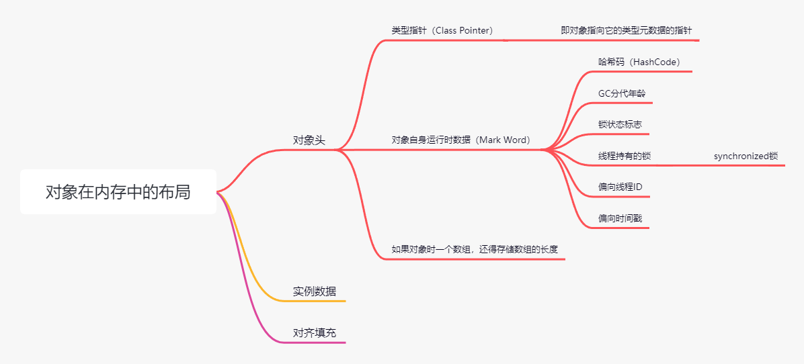

###### 1）对象头

对象头中存储两类数据

- 第一类是用于存储对象自身的运行时数据（Mark Word），如哈希码（HashCode）、GC分代年龄、锁状态标志、线程持有的锁、偏向线程ID、偏向时间戳等，这部分数据的长度在32位和64位的虚拟机（未开启压缩指针）中分别为32个比特和64个比特，官方称它为“Mark Word”。
- 第一类是类型指针（Class Pointer），即对象指向它的类型元数据的指针，Java虚拟机通过这个指针来确定该对象是哪个类的实例（如果对象是一个Java数组，那在对象头中还必须有一块用于记录数组长度的数据，因为虚拟机可以通过普通Java对象的元数据信息确定Java对象的大小，但是如果数组的长度是不确定的，将无法通过元数据中的信息推断出数组的大小）

Mark Word的存储结构：

- 32bit

  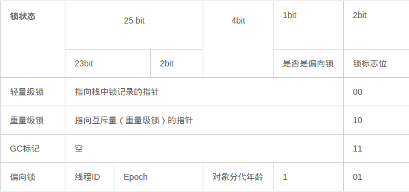

- 64bit

  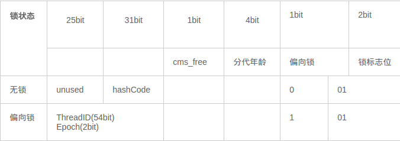

###### 2）实例数据

实例数据部分是对象真正存储的有效信息，即我们在程序代码里面所定义的各种类型的字段内容，无论是从**父类继承**下来的，还是在**子类中定义**的字段都必须记录起来。

这部分的存储顺序会受到虚拟机分配策略参数（-XX：FieldsAllocationStyle参数）和字段在Java源码中定义顺序的影响。HotSpot虚拟机默认的分配顺序为longs/doubles、ints、shorts/chars、bytes/booleans、oops（Ordinary Object Pointers，OOPs），从以上默认的分配策略中可以看到，相同宽度的字段总是被分配到一起存放，在满足这个前提条件的情况下，在父类中定义的变量会出现在子类之前。如果HotSpot虚拟机的+XX：CompactFields参数值为true（默认就为true），那子类之中较窄的变量也允许插入父类变量的空隙之中，以节省出一点点空间。

###### 3）对齐填充

对齐填充不是必然存在的，也没有特别的含义，它仅仅起着占位符的作用。

> 为什么需要占位？
>
> 由于HotSpot虚拟机的自动内存管理系统要求对象起始地址必须是8字节的整数倍，换句话说就是任何对象的大小都必须是8字节的整数倍。对象头部分已经被精心设计成正好是8字节的倍数（1倍或者2倍），因此，如果对象实例数据部分没有对齐的话，就需要通过对齐填充来补全

##### （2）如何访问堆内存中的对象

**Java程序会通过栈上的reference数据来操作堆上的具体对象**。

由于reference类型在《Java虚拟机规范》里面只规定了它是一个指向对象的引用，并没有定义这个引用应该通过什么方式去定位、访问到堆中对象的具体位置，所以对象访问方式也是由虚拟机实现而定的，主流的访问方式主要有使用句柄和直接指针两种：

- 使用**句柄**访问的话，Java堆中将可能会划分出一块内存来作为句柄池，reference中存储的就是对象的句柄地址，而句柄中包含了**对象实例数据**与**类型数据**各自具体的地址信息，结构如下所示：

  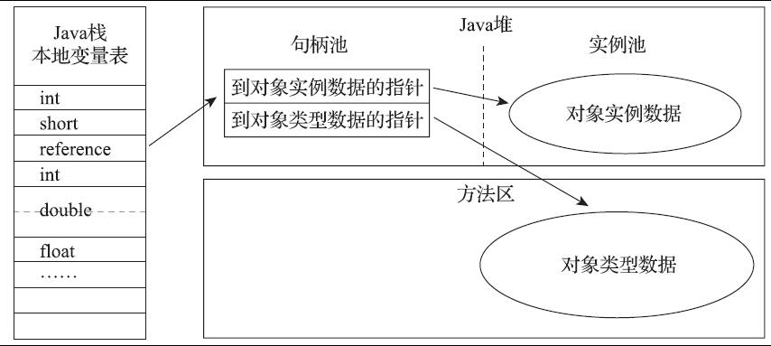

- 使用**直接指针**访问的话，Java堆中对象的内存布局就必须考虑如何放置访问类型数据的相关信息，reference中存储的就是**对象实例数据的地址**，**如果只是访问对象本身的话，就不需要多一次间接访问的开销**，结构如下所示：

  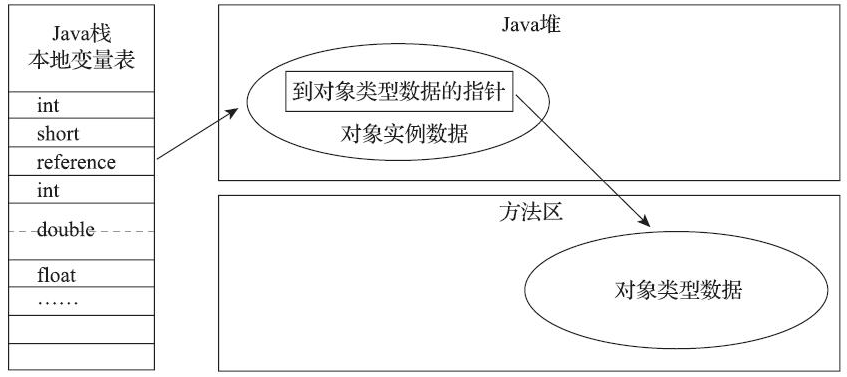

#### 1.5 方法区（Method Area）| 所有线程可见

> 方法区（Method Area）与Java堆一样，是各个线程共享的内存区域。
>
> 1. 它用于存储已被虚拟机加载的**类型信息**、**常量**、**静态变量**、**即时编译器编译后的代码缓存**等数据。
> 2. 虽然《Java虚拟机规范》中把方法区描述为堆的一个逻辑部分，但是它却有一个别名叫作“非堆”（Non-Heap），目的是与Java堆区分开来。

> 说到方法区，不得不提一下“永久代”这个概念，尤其是在JDK 8以前，许多Java程序员都习惯在HotSpot虚拟机上开发、部署程序，很多人都更愿意把方法区称呼为“永久代”（Permanent Generation），或将两者混为一谈。JDK 8中完全废弃了永久代的概念，改用与JRockit、J9一样在本地内存中实现的元空间（Meta-space）方法区。
>
> **不管是永久代（Permanent Generation）还是元空间（Meta-space），都是JVM规范中对方法区的实现。**

1. 运行时常量池

   > 运行时常量池（Runtime Constant Pool）是方法区的一部分。Class文件中除了有类的版本、字段、方法、接口等描述信息外，还有一项信息是常量池表（Constant Pool Table），用于存放编译期生成的各种字面量与符号引用，这部分内容（static final修饰的常量）将在类加载后存放到方法区的运行时常量池中。
   > Java虚拟机对于Class文件每一部分（自然也包括常量池）的格式都有严格规定，如每一个字节用于存储哪种数据都必须符合规范上的要求才会被虚拟机认可、加载和执行，但对于运行时常量池，《Java虚拟机规范》并没有做任何细节的要求，不同提供商实现的虚拟机可以按照自己的需要来实现这个内存区域，不过一般来说，除了保存Class文件中描述的符号引用外，还会把由符号引用翻译出来的直接引用也存储在运行时常量池中。
   > 运行时常量池相对于Class文件常量池的另外一个重要特征是具备动态性，Java语言并不要求常量一定只有编译期才能产生，也就是说，并非预置入Class文件中常量池的内容才能进入方法区运行时常量池，运行期间也可以将新的常量放入池中，这种特性被开发人员利用得比较多的便是String类的intern()方法。
   > 既然运行时常量池是方法区的一部分，自然受到方法区内存的限制，当常量池无法再申请到内存时会抛出OutOfMemoryError异常。

#### 1.6 直接内存 | [JVM中的直接内存](https://blog.csdn.net/qq_33521184/article/details/105622931?ops_request_misc=%257B%2522request%255Fid%2522%253A%2522166460828016782417011686%2522%252C%2522scm%2522%253A%252220140713.130102334.pc%255Fblog.%2522%257D&request_id=166460828016782417011686&biz_id=0&utm_medium=distribute.pc_search_result.none-task-blog-2~blog~first_rank_ecpm_v1~rank_v31_ecpm-4-105622931-null-null.article_score_rank_blog&utm_term=Java%E5%86%85%E5%AD%98&spm=1018.2226.3001.4450)

> 直接内存（Direct Memory）并不是虚拟机运行时数据区的一部分，也不是《Java虚拟机规范》中定义的内存区域。但是这部分内存也被频繁地使用，而且也可能导致OutOfMemoryError异常出现。
> 在JDK 1.4中新加入了NIO（New Input/Output）类，引入了一种基于通道（Channel）与缓冲区（Buffer）的I/O方式，它可以使用Native函数库直接分配堆外内存，然后通过一个存储在Java堆里面的DirectByteBuffer对象作为这块内存的引用进行操作。这样能在一些场景中显著提高性能，因为避免了在Java堆和Native堆中来回复制数据。
> 显然，本机直接内存的分配不会受到Java堆大小的限制，但是，既然是内存，则肯定还是会受到本机总内存（包括物理内存、SWAP分区或者分页文件）大小以及处理器寻址空间的限制，一般服务器管理员配置虚拟机参数时，会根据实际内存去设置-Xmx等参数信息，但经常忽略掉直接内存，使得各个内存区域总和大于物理内存限制（包括物理的和操作系统级的限制），从而导致动态扩展时出现OutOfMemoryError异常。

staticObj、instanceObj、localObj存放在哪里？

```java
public class JHSDB_TestCase {

    static class Test {
        static ObjectHolder staticObj = new ObjectHolder();//staticObj存放在方法区中
        ObjectHolder instanceObj = new ObjectHolder();//instanceObj存放在Java堆中

        void foo() {
            ObjectHolder localObj = new ObjectHolder();//localObj是一个符号引用，存放在foo()方法的虚拟机栈的局部变量表中，而=号右边的new ObjectHolder()则存放在堆中
            System.out.println("done");    // 这里设一个断点
        }
    }

    private static class ObjectHolder {}

    public static void main(String[] args) {
        Test test = new JHSDB_TestCase.Test();
        test.foo();
    }
}
```

## 2 不同区域内存溢出的情况

上面介绍过了，只有程序计数器是不会抛出OutOfMemoryError异常的区域，其他的几个区域都会抛出OutOfMemoryError异常。

### 2.1 堆溢出

```Java
package jmm;

import java.util.ArrayList;
import java.util.List;

public class MyOutOfMemery {

    static class OOM {}

    //VM Options:-verbose:gc -Xms20M -Xmx20M -XX:+PrintGCDetails -XX:SurvivorRatio=8
    public static void main(String[] args) {
        List<OOM> list = new ArrayList<>();

        while (true) {
            list.add(new OOM());
        }
    }
}
```

在执行之前，需要设置jvm的运行时参数，参数如下：

```
-verbose:gc -Xms20M -Xmx20M -XX:+PrintGCDetails -XX:SurvivorRatio=8
```

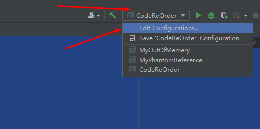

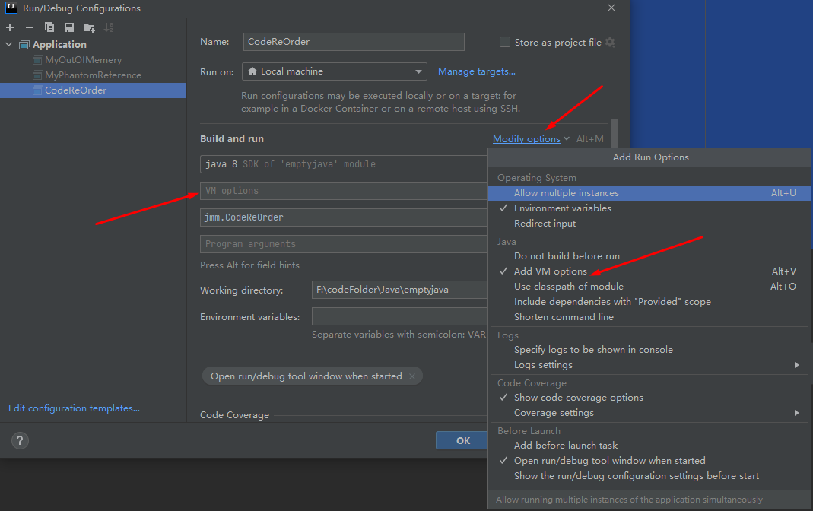

> [GC (Allocation Failure) [PSYoungGen: 5632K->504K(6144K)] 5632K->3269K(19968K), 0.0025045 secs] [Times: user=0.00 sys=0.00, real=0.00 secs] 
> [GC (Allocation Failure) [PSYoungGen: 6136K->504K(6144K)] 8901K->8012K(19968K), 0.0042655 secs] [Times: user=0.00 sys=0.00, real=0.00 secs] 
> [Full GC (Ergonomics) [PSYoungGen: 6136K->0K(6144K)] [ParOldGen: 10673K->12587K(13824K)] 16809K->12587K(19968K), [Metaspace: 3213K->3213K(1056768K)], 0.1644115 secs] [Times: user=0.80 sys=0.00, real=0.16 secs] 
> [Full GC (Ergonomics) [PSYoungGen: 3909K->2860K(6144K)] [ParOldGen: 12587K->13604K(13824K)] 16496K->16464K(19968K), [Metaspace: 3213K->3213K(1056768K)], 0.1723803 secs] [Times: user=1.28 sys=0.00, real=0.17 secs] 
> [Full GC (Allocation Failure) [PSYoungGen: 2860K->2860K(6144K)] [ParOldGen: 13604K->13586K(13824K)] 16464K->16446K(19968K), [Metaspace: 3213K->3213K(1056768K)], 0.1637199 secs] [Times: user=1.19 sys=0.00, real=0.17 secs] 
> Heap
>  PSYoungGen      total 6144K, used 3309K [0x00000000ff980000, 0x0000000100000000, 0x0000000100000000)
>   eden space 5632K, 58% used [0x00000000ff980000,0x00000000ffcbb628,0x00000000fff00000)
>   from space 512K, 0% used [0x00000000fff80000,0x00000000fff80000,0x0000000100000000)
>   to   space 512K, 0% used [0x00000000fff00000,0x00000000fff00000,0x00000000fff80000)
>  ParOldGen       total 13824K, used 13586K [0x00000000fec00000, 0x00000000ff980000, 0x00000000ff980000)
>   object space 13824K, 98% used [0x00000000fec00000,0x00000000ff9449a0,0x00000000ff980000)
>  Metaspace       used 3246K, capacity 4500K, committed 4864K, reserved 1056768K
>   class space    used 352K, capacity 388K, committed 512K, reserved 1048576K
> Exception in thread "main" **java.lang.OutOfMemoryError**: Java heap space
> 	at java.util.Arrays.copyOf(Arrays.java:3210)
> 	at java.util.Arrays.copyOf(Arrays.java:3181)
> 	at java.util.ArrayList.grow(ArrayList.java:265)
> 	at java.util.ArrayList.ensureExplicitCapacity(ArrayList.java:239)
> 	at java.util.ArrayList.ensureCapacityInternal(ArrayList.java:231)
> 	at java.util.ArrayList.add(ArrayList.java:462)
> 	at jmm.MyOutOfMemery.main(MyOutOfMemery.java:15)
>
> Process finished with exit code 1

#### 解决思路

要解决这个内存区域的异常，常规的处理方法是首先通过内存映像分析工具（如Eclipse Memory Analyzer）对Dump出来的堆转储快照进行分析。

1. 第一步首先应确认内存中导致OOM的对象是否是必要的，也就是要先分清楚到底是出现了内存泄漏（Memory Leak）还是内存溢出（Memory Overflow）
2. 如果是内存泄漏，可进一步通过工具查看泄漏对象到GC Roots的引用链，找到泄漏对象是通过怎样的引用路径、与哪些GC Roots相关联，才导致垃圾收集器无法回收它们，根据泄漏对象的类型信息以及它到GC Roots引用链的信息，一般可以比较准确地定位到这些对象创建的位置，进而找出产生内存泄漏的代码的具体位置。
3. 如果不是内存泄漏，换句话说就是内存中的对象确实都是必须存活的，那就应当检查Java虚拟机的堆参数（-Xmx与-Xms）设置，与机器的内存对比，看看是否还有向上调整的空间。再从代码上检查是否存在某些对象生命周期过长、持有状态时间过长、存储结构设计不合理等情况，尽量减少程序运行期的内存消耗。

### 2.2 栈溢出

在hotspot虚拟机中，不区分虚拟机栈和本地方法栈，从上面的介绍可知，栈溢出有以下两种情况：

1. 如果线程请求的栈深度大于虚拟机所允许的深度，将抛出StackOverflowError异常；
2. 如果Java虚拟机栈容量可以动态扩展，当栈扩展时无法申请到足够的内存会抛出OutOfMemoryError异常。

且hotspot虚拟机的栈容易是不能动态扩展的，也就是说，在以hotspot为JVM运行平台的Java程序中，栈溢出指挥抛出StackOverflowError异常，而不会抛出OutOfMemoryError异常。

#### 栈空间小，导致溢出

```Java
package jmm;

//VM Options: -ss128K
public class StackOutOfMemory {

    private int stackLen = 1;

    private void stackLeak() {
        stackLen++;

        stackLeak();
    }

    public static void main(String[] args) {
        StackOutOfMemory oom = new StackOutOfMemory();

        try {
            oom.stackLeak();
        } catch (Throwable e) {
            System.out.println("stack length = " + oom.stackLen);
            throw e;
        }
    }
}
```

> stack length = 19613
> Exception in thread "main" java.lang.StackOverflowError
> 	at jmm.StackOutOfMemory.stackLeak(StackOutOfMemory.java:10)
> 	at jmm.StackOutOfMemory.stackLeak(StackOutOfMemory.java:10)

栈区本地变量过长，导致溢出

```Java
package jmm;

//VM Options: -Xss128K
public class StackOutOfMemory {

    private int stackLen = 1;

    private void stackLeak() {
        stackLen++;

        stackLeak();
    }

    public void test() {
        long unused1, unused2, unused3, unused4, unused5,
             unused6, unused7, unused8, unused9, unused10,
             unused11, unused12, unused13, unused14, unused15,
             unused16, unused17, unused18, unused19, unused20,
             unused21, unused22, unused23, unused24, unused25,
             unused26, unused27, unused28, unused29, unused30,
             unused31, unused32, unused33, unused34, unused35,
             unused36, unused37, unused38, unused39, unused40,
             unused41, unused42, unused43, unused44, unused45,
             unused46, unused47, unused48, unused49, unused50,
             unused51, unused52, unused53, unused54, unused55,
             unused56, unused57, unused58, unused59, unused60,
             unused61, unused62, unused63, unused64, unused65,
             unused66, unused67, unused68, unused69, unused70,
             unused71, unused72, unused73, unused74, unused75,
             unused76, unused77, unused78, unused79, unused80,
             unused81, unused82, unused83, unused84, unused85,
             unused86, unused87, unused88, unused89, unused90,
             unused91, unused92, unused93, unused94, unused95,
             unused96, unused97, unused98, unused99, unused100;

        stackLen++;
        test();

        unused1 = unused2 = unused3 = unused4 = unused5 =
        unused6 = unused7 = unused8 = unused9 = unused10 =
        unused11 = unused12 = unused13 = unused14 = unused15 =
        unused16 = unused17 = unused18 = unused19 = unused20 =
        unused21 = unused22 = unused23 = unused24 = unused25 =
        unused26 = unused27 = unused28 = unused29 = unused30 =
        unused31 = unused32 = unused33 = unused34 = unused35 =
        unused36 = unused37 = unused38 = unused39 = unused40 =
        unused41 = unused42 = unused43 = unused44 = unused45 =
        unused46 = unused47 = unused48 = unused49 = unused50 =
        unused51 = unused52 = unused53 = unused54 = unused55 =
        unused56 = unused57 = unused58 = unused59 = unused60 =
        unused61 = unused62 = unused63 = unused64 = unused65 =
        unused66 = unused67 = unused68 = unused69 = unused70 =
        unused71 = unused72 = unused73 = unused74 = unused75 =
        unused76 = unused77 = unused78 = unused79 = unused80 =
        unused81 = unused82 = unused83 = unused84 = unused85 =
        unused86 = unused87 = unused88 = unused89 = unused90 =
        unused91 = unused92 = unused93 = unused94 = unused95 =
        unused96 = unused97 = unused98 = unused99 = unused100 = 0;
    }

    public static void main(String[] args) {
        StackOutOfMemory oom = new StackOutOfMemory();

        try {
            oom.test();
        } catch (Throwable e) {
            System.out.println("stack length = " + oom.stackLen);
            throw e;
        }
    }
}
```

> stack length = 4898
> Exception in thread "main" java.lang.StackOverflowError
> 	at jmm.StackOutOfMemory.test(StackOutOfMemory.java:36)
> 	at jmm.StackOutOfMemory.test(StackOutOfMemory.java:36)

# Reference

1. [JVM中的直接内存](https://blog.csdn.net/qq_33521184/article/details/105622931?ops_request_misc=%257B%2522request%255Fid%2522%253A%2522166460828016782417011686%2522%252C%2522scm%2522%253A%252220140713.130102334.pc%255Fblog.%2522%257D&request_id=166460828016782417011686&biz_id=0&utm_medium=distribute.pc_search_result.none-task-blog-2~blog~first_rank_ecpm_v1~rank_v31_ecpm-4-105622931-null-null.article_score_rank_blog&utm_term=Java%E5%86%85%E5%AD%98&spm=1018.2226.3001.4450)
1. [深入分析Synchronized原理](https://www.cnblogs.com/aspirant/p/11470858.html)
1. [Java内存管理机制](https://www.cnblogs.com/steffen/p/11368018.html)
1. [查看当前应用使用的什么垃圾回收器](https://juejin.cn/post/6938745571700277284)
1. [Java JVM 参数设置大全](http://www.51gjie.com/java/551.html)