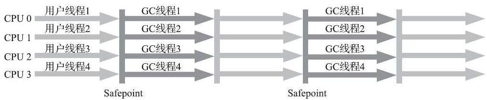

## Java垃圾回收机制

### 1 Java垃圾回收

JVM的内存结构包括五大区域：**程序计数器、虚拟机栈、本地方法栈、堆区、方法区**。其中**程序计数器、虚拟机栈、本地方法栈**3个区域随线程而生、随线程而灭，因此这几个区域的内存分配和回收都具备确定性，就不需要过多考虑回收的问题，因为方法结束或者线程结束时，内存自然就跟随着回收了。而Java堆区和方法区则不一样，这部分内存的**分配**和**回收**都是动态的，正是垃圾收集器所需关注的部分。

垃圾收集器在对堆区和方法区进行回收前，首先要确定这些区域的对象哪些可以被回收，哪些暂时还不能回收，这就要用到判断对象是否存活的算法！

#### 1.1 如何判断对象的“死活”

##### （1）引用计数法（Reference Counting）

概念：在对象中添加一个引用计数器（需要消耗一定的内存），每当有一个地方引用该对象时，则该对象的计数器值就加一；当引用失效时，计数器值就减一；任何时刻计数器为零的对象就是不可能再被使用的对象，也就是“死掉”的对象，可以被回收。

缺点：

1. 需要额外占用一些内存空间
2. 对于循环引用的对象，无法将其引用的计数值减为0，即循环应用的对象，永远无法释放

优点：

1. 原理简单，判定对象”死活“的效率很高

##### （2）可达性分析算法

概念：通过一系列称为“**GC Roots**”的根对象作为起始节点集，从这些节点开始，根据引用关系向下搜索，搜索过程所走过的路径称为“引用链”（Reference Chain），如果某个对象到GC Roots间没有任何引用链相连，或者用图论的话来说就是从GC Roots到这个对象不可达时，则证明此对象是不可能再被使用的。


上图中的object5、object6、object7虽然三者之间互相有关联，但是他们和`GC ROOTS`之间已经没有关联了，所以他们是回收的对象。

在Java中，以下几种对象能被称为GC ROOTS对象：

1. 在虚拟机栈（栈帧中的本地变量表）中引用的对象，譬如各个线程被调用的方法堆栈中使用到的参数、局部变量、临时变量等。
2. 在方法区中类静态属性引用的对象，譬如Java类的引用类型静态变量。
3. 在方法区中常量引用的对象，譬如字符串常量池（String Table）里的引用。
4. 在本地方法栈中JNI（即通常所说的Native方法）引用的对象。
5. Java虚拟机内部的引用，如基本数据类型对应的Class对象，一些常驻的异常对象（比如NullPointExcepiton、OutOfMemoryError）等，还有系统类加载器。
6. 所有被同步锁（synchronized关键字）持有的对象。
7. 反映Java虚拟机内部情况的JMXBean、JVMTI中注册的回调、本地代码缓存等。

##### （3）引用

无论是通过引用计数算法判断对象的引用数量，还是通过可达性分析算法判断对象是否引用链可达，判定对象是否存活都和“引用”离不开关系。

> **在JDK 1.2版之前**，Java里面的引用是很传统的定义：**如果reference类型的数据中存储的数值代表的是另外一块内存的起始地址，就称该reference数据是代表某块内存、某个对象的引用。**
>
> 一个对象在这种定义下只有“被引用”或者“未被引用”两种状态，对于描述一些“食之无味，弃之可惜”的对象就显得无能为力。譬如我们希望能描述一类对象：当内存空间还足够时，能保留在内存之中，如果内存空间在进行垃圾收集后仍然非常紧张，那就可以抛弃这些对象。

> **在JDK 1.2版之后**，Java对引用的概念进行了扩充，将引用分为**强引用（Strongly Re-ference）、软引用（Soft Reference）、弱引用（Weak Reference）和虚引用（Phantom Reference）**4种，这4种引用强度依次逐渐减弱。

在JDK 1.2版之后，Java对引用的概念进行了扩充，将引用分为强引用（Strongly Re-ference）、软引用（Soft Reference）、弱引用（Weak Reference）和虚引用（Phantom Reference）4种，这4种引用强度依次逐渐减弱。

###### 1）强引用

**强引用**是最传统的“引用”的定义，是指在程序代码之中普遍存在的引用赋值，即类似“Object obj=new Object()”这种引用关系。**无论任何情况下，只要强引用关系还存在，垃圾收集器就永远不会回收掉被引用的对象。**

```java
Object obj = new Object();
User user = new User();
```

###### 2）软引用

**软引用**是用来描述一些**还有用，但非必须的对象**。**只被软引用关联着的对象，在系统将要发生内存溢出异常前，会把这些对象列进回收范围之中进行第二次回收，如果这次回收还没有足够的内存，才会抛出内存溢出异常**。在JDK 1.2版之后提供了SoftReference类来实现软引用。

> **软引用主要用于实现类似缓存的功能，在内存足够的情况下直接通过软引用取值，无需从繁忙的真实来源查询数据，提升速度；当内存不足时，自动删除这部分缓存数据，从真正的来源查询这些数据。**

```Java
Object obj = new Object();
SoftReference<Object> sf = new SoftReference<Object>(obj);
obj = null;
sf.get();//有时候会返回null
```

###### 3）弱引用

**弱引用**也是用来描述那些非必须对象，但是它的强度比软引用更弱一些，**被弱引用关联的对象只能生存到下一次垃圾收集发生为止**。当垃圾收集器开始工作，**无论当前内存是否足够，都会回收掉只被弱引用关联的对象**。在JDK 1.2版之后提供了WeakReference类来实现弱引用。

> **弱引用主要用于监控对象是否已经被垃圾回收器标记为即将回收的垃圾，可以通过弱引用的 isEnQueued 方法返回对象是否被垃圾回收器标记。**

```Java
Object obj = new Object();
WeakReference<Object> wf = new WeakReference<Object>(obj);
obj = null;
wf.get();//有时候会返回null
wf.isEnQueued();//返回是否被垃圾回收器标记为即将回收的垃圾
```

###### 4）虚引用

**虚引用**也称为“幽灵引用”或者“幻影引用”，它是最弱的一种引用关系。一个对象是否有虚引用的存在，完全不会对其生存时间构成影响，也无法通过虚引用来取得一个对象实例。**为一个对象设置虚引用关联的唯一目的只是为了能在这个对象被收集器回收时收到一个系统通知**。在JDK 1.2版之后提供了PhantomReference类来实现虚引用。

> **虚引用主要用于检测对象是否已经从内存中删除。**

```Java
Object obj = new Object();
PhantomReference<Object> pf = new PhantomReference<Object>(obj);
obj=null;
pf.get();//永远返回null
pf.isEnQueued();//返回是否从内存中已经删除
```

##### （4）回收方法区

方法区垃圾收集的“性价比”通常也是比较低的：在Java堆中，尤其是在新生代中，对常规应用进行一次垃圾收集通常可以回收70%至99%的内存空间，相比之下，方法区回收由于苛刻的判定条件，其区域垃圾收集的回收成果往往远低于此。

方法区的垃圾收集主要回收两部分内容：**废弃的常量**和**不再使用的类型**。

###### 1）废弃常量的回收

回收废弃常量与回收Java堆中的对象非常类似。举个常量池中字面量回收的例子，假如一个字符串“java”曾经进入常量池中，但是当前系统又没有任何一个字符串对象的值是“java”，换句话说，已经没有任何字符串对象引用常量池中的“java”常量，且虚拟机中也没有其他地方引用这个字面量。如果在这时发生内存回收，而且垃圾收集器判断确有必要的话，这个“java”常量就将会被系统清理出常量池。**常量池中其他类（接口）、方法、字段的符号引用也与此类似**。

###### 2）不在使用的类

判定一个类型是否属于“不再被使用的类”的条件相对于废弃的常量而言比较苛刻。需要同时满足下面三个条件：

1. 该类所有的实例都已经被回收，也就是Java堆中不存在该类及其任何派生子类的实例。
2. 加载该类的类加载器已经被回收，这个条件除非是经过精心设计的可替换类加载器的场景，如OSGi、JSP的重加载等，否则通常是很难达成的。
3. 该类对应的java.lang.Class对象没有在任何地方被引用，无法在任何地方通过反射访问该类的方法。

Java虚拟机被**允许**对满足上述三个条件的无用类进行回收，并并不是符合以上3个条件就可以直接被回收，而是**被允许回收**。HotSpot虚拟机提供了-Xnoclassgc参数进行控制，还可以使用-verbose：class以及-XX：+TraceClass-Loading、-XX：+TraceClassUnLoading查看类加载和卸载信息。

#### 1.2 Java分代垃圾回收机制


在JVM中，并不是单独的使用某一种垃圾清除算法，而是将这些算法进行结合，最常见的垃圾回收机制便是**分代垃圾回收机制**。该机制将内存分成两个区，一个区时**新生代**，一个是**老年代**。其中新生代又按`8:1:1`的比例分成了伊甸园、幸存区`from`、幸存区`to`。

- 新生代：由于新生代中的对象存活率较低，所以使用**复制算法**对效率影响较小
- 老年代：由于老年代中存放的对象存活率较高，所以该区域使用的是**标记清除**或者**标记整理算法**。
  - 大对象直接进入老年代，比如一个很长的**字符串**或者**数组**等
  - 在新生代中的存回寿命达到一定阈值（15）时，当前对象可以晋升到老年代
- 永久代：永久代用于存放静态文件，如`java`类、方法等，该区域对垃圾回收的影响不大，但是有些应用可能会动态生成或者调用一些`class`，例如使用动态代理、反射、`CGlib`等`bytecode`框架时，需要分配一个较大的永久代区域来存放运行过程中的这些`class`

垃圾回收步骤：

1. 每次新对象的创建，都会放在伊甸园区，当伊甸园内存被放满时，此时会触发一次新生代垃 圾回收（ MinorGC ），将伊甸园中的存活对象使用 copy 算法复制到 to 区，并将存活对象的 寿命加1，此时伊甸园中剩下的对象都属于“垃圾”，然后伊甸园被清空并交换 from 和 to 区的位置。 MinorGC 发生时，会引发一次 stop the world （ MinorGC 的时间较短），暂停其他用 户线程，等垃圾回收结束之后其他用户线程才继续运行。 
2. 当有新对象被创建时，还是被放到伊甸园中，当伊甸园又满了时，又会触发第二次 MinorGC ，还是先将伊甸园中的存活对象复制到 to 区，并将寿命加1，此时还会对 from 区 的对象进行整理，当 from 区的对象还存活，那么也会将 from 区间的对象复制到 to 区并将 寿命加1（此时该对象的寿命为2），然后伊甸园和 from中的“垃圾”对象将被清除，然后交换 form 和 to 区。 
3. 当幸存区中的对象的寿命达到某一个阈值（一般是15）时，变回将该对象移动到老年代区， 因为老年代区的垃圾回收频率比较低。 
4. 当创建新对象时，发现伊甸园空间不足， from 区空间不足，会先触发一次 MinorGC ，如果 触发之后发现内存还是不足，此时会触发一次 FullGC ，对整个内存区进行垃圾回收。 FullGC ， STW 会更长。当 FullGC 之后发现内存还是不足，此时会抛出一个 的异常

### 2 垃圾收集算法

#### 2.1 分代收集理论

目前市面上的商业虚拟机的垃圾收集器，大多数都遵循了“分代收集”（Generational Collection）的理论进行设计，分代收集名为理论，实质是一套符合大多数程序运行实际情况的经验法则，它建立在两个分代假说之上：

1. 弱分代假说（Weak Generational Hypothesis）：绝大多数对象都是朝生夕灭的。

2. 强分代假说（Strong Generational Hypothesis）：熬过越多次垃圾收集过程的对象就越难以消亡。

3. 跨代引用假说（Intergenerational Reference Hypothesis）：跨代引用相对于同代引用来说仅占极少数。

   > 该假说可根据前两条假说逻辑推理得出的隐含推论：存在互相引用关系的两个对象，是应该倾向于同时生存或者同时消亡的。举个例子，如果某个新生代对象存在跨代引用，由于老年代对象难以消亡，该引用会使得新生代对象在收集时同样得以存活，进而在年龄增长之后晋升到老年代中，这时跨代引用也随即被消除了。

不同的分代收集行为：

- 新生代收集（Minor GC/Young GC）：指目标只是新生代的垃圾收集。
- 老年代收集（Major GC/Old GC）：指目标只是老年代的垃圾收集。目前只有CMS收集器会有单独收集老年代的行为。另外请注意“Major GC”这个说法现在有点混淆，在不同资料上常有不同所指，读者需按上下文区分到底是指老年代的收集还是整堆收集。
- 混合收集（Mixed GC）：指目标是收集整个新生代以及部分老年代的垃圾收集。目前只有G1收集器会有这种行为。
- 整堆收集（Full GC）：收集整个Java堆和方法区的垃圾收集

#### 2.2 标记-清除算法（Mark-Sweep）

**最早出现**也是**最基础**的垃圾收集算法是“标记-清除（Mark-Sweep）算法，**在1960年由Lisp之父John McCarthy所提出**。

##### **算法定义**

标记-清除算法分为“**标记**”和“**清除**”两个阶段：

1. 首先标记出所有需要回收的对象，在标记完成后（该过程是判定对象是否属于垃圾的过程，判定算法用的可达性分析算法）
2. 统一回收掉所有被标记的对象

也可以反过来，标记存活的对象，统一回收所有未被标记的对象。


##### **算法优点**

1. 原理简单，易于实现
2. 可回收对象较少的情况下，回收效率高

##### **算法缺点**

1. 该算法的执行效率不稳定，如果Java程序中需要被回收的对象很多，那么该算法就需要执行大量的标记和清除动作， 也就是说，该算法的执行效率会随着Java程序中需要被回收的对象的增大而降低。
2. 清除被回收对象之后，会导致内存空间碎片化问题（内存泄漏），从而导致后续如果需要为大对象分配空间时，会因为没有连续的内存空间而提示内存不足（其实是有足够空间的，但是不连续的）

#### 2.3 标记-复制算法

##### **为什么提出**

为了解决**标记-清除算法**面对大量可回收对象时执行效率低的问题，1969年Fenichel提出了一种称为“半区复制”（Semispace Copying）的垃圾收集算法。

##### **算法定义**

1. 将可用内存按容量划分为大小相等的两块，每次只使用其中的一块。
2. 当其中一块的内存用完了，就将还存活着的对象复制到另外一块上面，然后再把已使用过的内存空间一次清理掉。

##### **算法优点**

1. 对于多数对象都是可回收的情况，该算法需要复制的就是占少数的存活对象，只要移动堆顶指针，按顺序分配即可。
2. 没有内存碎片的问题

##### **算法缺点**

1. 如果内存中多数对象都是存活的，该算法将会产生大量的内存间复制的开销
2. 内存只能使用物理内存的一半，空间浪费
3. 移动对象时，由于对象的地址发生了改变，此时系统出现短暂的停顿（”Stop The World“）

#### 2.4 标记-整理算法（Mark-Compact）

##### 为什么提出

1. 标记-复制算法在对象存活率较高时就要进行较多的复制操作，效率将会降低。更关键的是，
2. 复制算法只能利用内存的50%（内存较少了一半，就需要有额外的空间进行分配担保，以应对被使用的内存中所有对象都100%存活的极端情况）

##### **算法定义**

针对老年代对象的存亡特征，1974年Edward Lueders提出了另外一种有针对性的“标记-整理”（Mark-Compact）算法，其中的标记过程仍然与“标记-清除”算法一样，但后续步骤不是直接对可回收对象进行清理，而是将所有存活的对象都向内存空间一端移动，然后直接清理掉存活边界以外的内存，如下图所示。

1. 首先标记出所有需要回收的对象，在标记完成后（该过程是判定对象是否属于垃圾的过程，判定算法用的可达性分析算法）
2. 将所有存活的对象都向内存空间一端移动，然后直接清理掉存活边界以外的内存


##### **算法优点**

1. 不会再有内存碎片
2. 内存大小相对于复制算法不会减半

##### **算法缺点**

1. 移动对象需要消耗一定的系统资源
2. 移动对象时，由于对象的地址发生了改变，此时系统出现短暂的停顿（”Stop The World“）

### 3 经典垃圾收集器

经典的垃圾收集器有以下几种：

1. Serial收集器
2. ParNew收集器
3. Parallel Scavenge收集器
4. Serial Old收集器
5. Parallel Old收集器
6. CMS收集器
7. Garbage First收集器

每个垃圾收集器所工作的区间以及各收集器之间的关系如下图所示：

- 如果两个收集器之间存在连线，就说明它们可以搭配使用
- 收集器所处的区域，则表示它是属于新生代收集器或是老年代收集器
- 中间的jdk9表示在jdk9之后取消了这种搭配关系


#### 3.1 Serial收集器 | 新生代

Serial收集器是最基础、历史最悠久的收集器，曾经（在JDK 1.3.1之前）是HotSpot虚拟机新生代收集器的唯一选择。

##### 定义

1. Serial收集器是一个单线程工作的收集器
2. 但它的“单线程”的意义并**不仅仅**是说明它只会使用一个处理器或一条收集线程去完成垃圾收集工作，更重要的是强调在它进行垃圾收集时，**必须暂停其他所有工作线程，直到Serial收集器收集结束**。也就是“Stop The World”，垃圾收集这项工作是由虚拟机在后台自动发起和自动完成的，在用户不可知、不可控的情况下把用户的正常工作的线程全部停掉，这对很多应用来说都是不能接受的。
3. 基于标记-复制算法实现

下图为Serial收集器的工作流程：


> 关于Stop The World：
>
> 从JDK 1.3开始，一直到现在最新的JDK 13，HotSpot虚拟机开发团队为消除或者降低用户线程因垃圾收集而导致停顿的努力一直持续进行着，从Serial收集器到Parallel收集器，再到Concurrent Mark Sweep（CMS）和Garbage First（G1）收集器，最终至现在垃圾收集器的最前沿成果Shenandoah和ZGC等，我们看到了一个个越来越构思精巧，越来越优秀，也越来越复杂的垃圾收集器不断涌现，用户线程的停顿时间在持续缩短，**但是仍然没有办法彻底消**除。

##### 优点

1. 对于内存资源受限的环境，内存占用少
2. 与其他收集器的单线程相比，Serial收集器更简单、更高效
3. 分配给虚拟机管理的内存一般来说并不会特别大，收集几十兆甚至一两百兆的新生代，Serial垃圾收集的停顿时间完全可以控制在十几、几十毫秒，最多一百多毫秒以内，**只要不是频繁发生收集，这点停顿时间对许多用户来说是完全可以接受的**，基于此，Serial收集器对于运行在**客户端模式下**的虚拟机来说是一个很好的选择

##### 缺点

1. 单线程工作
2. 垃圾收集时，需要停止工作线程

#### 3.2 ParNew收集器 | 新生代

##### 定义

ParNew收集器除了在垃圾收集时是**多线程收集**之外，其余的和Serial收集器一样，下图是ParNew收集器的工作流程，运行在**服务端模式下**的HotSpot虚拟机采用ParNew收集器，也是基于标记-复制算法实现。


ParNew收集器是激活CMS后（使用-XX：+UseConcMarkSweepGC选项）的默认新生代收集器，也可以使用-XX：+/-UseParNewGC选项来强制指定或者禁用它

##### 优点

1. 在多核处理器中，ParNew收集器对系统资源的高效利用效果要比Serial收集器更好，默认开启的收集线程数与处理器核心数量相同，在处理器核心非常多（譬如32个，现在CPU都是多核加超线程设计，服务器达到或超过32个逻辑核心的情况非常普遍）的环境中，可以使用-XX：ParallelGCThreads参数来限制垃圾收集的线程数

##### 缺点

1. ParNew收集器在单核心处理器环境中的收集性能比Serial收集器要差，由于存在线程交互的开销，该收集器在通过超线程（Hyper-Threading）技术实现的伪双核处理器环境中的性能也不能百分之百保证超越Serial收集器。

> 垃圾收集器中的并发和并发的区别？
>
> - 并行（Parallel）：并行描述的是多条垃圾收集器线程之间的关系，说明同一时间有多条这样的线程在协同工作，通常默认此时用户线程是处于等待状态。
> - 并发（Concurrent）：并发描述的是垃圾收集器线程与用户线程之间的关系，说明同一时间垃圾收集器线程与用户线程都在运行。由于用户线程并未被冻结，所以程序仍然能响应服务请求，但由于垃圾收集器线程占用了一部分系统资源，此时应用程序的处理的吞吐量将受到一定影响

#### 3.3 Parallel Scavenge收集器 | 新生代

##### 定义

1. 基于标记-复制算法实现
2. 垃圾收集时，能够并行收集
3. 程序的吞吐量（Throughput）是可控的（高吞吐量可以最高效率地利用处理器资源，尽快完成程序的运算任务，主要**适合在后台运算而不需要太多交互的分析任务**）
   1. 控制最大垃圾收集停顿时间的-XX：MaxGCPauseMillis参数，-XX：MaxGCPauseMillis参数允许的值是一个大于0的毫秒数，收集器将尽力保证内存回收花费的时间不超过用户设定值（**并不是指定时间越小就能达到停顿时间越小，如果停顿时间变小了，肯定得牺牲吞吐量作为代价或者发生GC的频率变高作为代价**）
   2. 直接设置吞吐量大小的-XX：GCTimeRatio参数，-XX：GCTimeRatio参数的值则应当是一个大于0小于100的整数，也就是垃圾收集时间占总时间的比率，相当于吞吐量的倒数
   3. -XX：+UseAdaptiveSizePolicy是一个开关参数，当这个参数被激活之后，就不需要人工指定新生代的大小（-Xmn）、Eden与Survivor区的比例（-XX：SurvivorRatio）、晋升老年代对象大小（-XX：PretenureSizeThreshold）等细节参数了，虚拟机会根据当前系统的运行情况收集性能监控信息，动态调整这些参数以提供最合适的停顿时间或者最大的吞吐量。这种调节方式称为垃圾收集的自适应的调节策略（GC Ergonomics）。只需要把基本的内存数据设置好（如-Xmx设置最大堆），然后使用-XX：MaxGCPauseMillis参数（更关注最大停顿时间）或-XX：GCTimeRatio（更关注吞吐量）参数给虚拟机设立一个优化目标，那具体细节参数的调节工作就由虚拟机完成了。**自适应调节策略也是Parallel Scavenge收集器区别于ParNew收集器的一个重要特性。**

> 什么是吞吐量：
>
> 吞吐量=运行用户代码的时间/处理器总消耗时间，其中，处理器总消耗时间=运行用户代码的时间+运行垃圾收集的时间
>
> 举个例子：用户代码加上垃圾收集总共耗费了100分钟，其中垃圾收集花掉1分钟，那吞吐量就是99%

#### 3.4 Serial Old收集器 | 老年代

##### 定义

1. Serial Old是Serial收集器的老年代版本，
2. 单线程收集器
3. 基于标记-整理算法。
4. 供客户端模式下的HotSpot虚拟机使用
5. 服务端模式下，它也可能有两种用途
   1. 在JDK 5以及之前的版本中与Parallel Scavenge收集器搭配使用
   2. 作为CMS收集器发生失败时的后备预案，在并发收集发生Concurrent Mode Failure时使用


#### 3.5 Parallel Old收集器 | 老年代

##### 定义

1. Parallel Old是Parallel Scavenge收集器的老年代版本，支持**多线程并发收集**，
2. 基于标记-整理算法实现。

> Parallel Old收集器直到JDK 6时才有，在此之前，新生代的Parallel Scavenge收集器一直处于相当尴尬的状态，原因是如果新生代选择了Parallel Scavenge收集器，老年代除了Serial Old（PS MarkSweep）收集器以外别无选择，其他表现良好的老年代收集器，如CMS无法与它配合工作。由于老年代Serial Old收集器在服务端应用性能上的“拖累”，使用Parallel Scavenge收集器也未必能在整体上获得吞吐量最大化的效果。同样，由于单线程的老年代收集中无法充分利用服务器多处理器的并行处理能力，在老年代内存空间很大而且硬件规格比较高级的运行环境中，这种组合的总吞吐量甚至不一定比ParNew加CMS的组合来得优秀。
> 直到Parallel Old收集器出现后，“吞吐量优先”收集器终于有了比较名副其实的搭配组合，在注重吞吐量或者处理器资源较为稀缺的场合，都可以优先考虑Parallel Scavenge加Parallel Old收集器这个组合。

Parallel Old收集器的工作过程如下图所示。



#### 3.6 CMS收集器 | 老年代

##### 定义

1. CMS（Concurrent Mark Sweep）收集器是一种以获取最短回收停顿时间为目标的收集器。目前很大一部分的Java应用集中在互联网网站或者基于浏览器的B/S系统的服务端上，这类应用通常都会较为关注服务的响应速度，希望系统停顿时间尽可能短，以给用户带来良好的交互体验。CMS收集器能够满足这类应用的需求。

2. CMS默认启动的回收线程数是（处理器核心数量+3）/4，也就是说，如果处理器核心数在四个或以上，并发回收时垃圾收集线程只占用不超过25%的处理器运算资源，并且会随着处理器核心数量的增加而下降

3. CMS收集器是基于标记-清除算法实现的，它的运作过程相对于前面几种收集器来说要更复杂一些，整个过程分为四个步骤，包括：

   1. 初始标记（CMS initial mark）| Stop The World

      初始标记仅仅只是标记一下GC Roots能直接关联到的对象，速度很快

   2. 并发标记（CMS concurrent mark）

      并发标记阶段就是从GC Roots的直接关联对象开始遍历整个对象图的过程，这个过程耗时较长但是不需要停顿用户线程，可以与垃圾收集线程一起并发运行

   3. 重新标记（CMS remark）| Stop The World

      重新标记阶段则是为了修正并发标记期间，因用户程序继续运作而导致标记产生变动的那一部分对象的标记记录，这个阶段的停顿时间通常会比初始标记阶段稍长一些，但也远比并发标记阶段的时间短

   4. 并发清除（CMS concurrent sweep）

      清理删除掉标记阶段判断的已经死亡的对象，由于不需要移动存活对象，所以这个阶段也是可以与用户线程同时并发的

由于在整个过程中耗时最长的并发标记和并发清除阶段中，垃圾收集器线程都可以与用户线程一起工作，所以从总体上来说，CMS收集器的内存回收过程是与用户线程一起并发执行的。


##### 优点

1. 并发收集
2. 停顿时间短

##### 缺点

1. 对处理器资源非常敏感

   1. 在并发阶段，CMS收集器虽然不会导致用户线程停顿，但却会因为占用了一部分线程（或者说处理器的计算能力）而导致应用程序变慢，降低总吞吐量

2. CMS收集器无法处理“浮动垃圾”（Floating Garbage），有可能出现“Con-current Mode Failure”失败进而导致另一次完全“Stop The World”的Full GC的产生

   > 什么是“浮动垃圾”？
   >
   > 在CMS的并发标记和并发清理阶段，用户线程是还在继续运行的，程序在运行自然就还会伴随有新的垃圾对象不断产生，但这一部分垃圾对象是出现在标记过程结束以后，CMS无法在当次收集中处理掉它们，只好留待下一次垃圾收集时再清理掉。这一部分垃圾就称为“浮动垃圾”。

3. CMS是一款基于“标记-清除”算法实现的收集器，垃圾收集结束时会产生大量的内存碎片

   1. 由于内存碎片的原因，导致在明明有足够内存时，而触发FULL GC
   2. CMS收集器提供了一个-XX：+UseCMS-CompactAtFullCollection开关参数（默认是开启的，此参数从JDK 9开始废弃），用于在CMS收集器不得不进行Full GC时开启内存碎片的合并整理过程，由于这个内存整理必须移动存活对象，是无法并发的。
   3. 加上-XX：+UseCMS-CompactAtFullCollection参数，虽然解决了空间碎片的问题，但停顿时间又会变长，因此虚拟机设计者们还提供了另外一个参数-XX：CMSFullGCsBefore-Compaction（此参数从JDK 9开始废弃），这个参数的作用是要求CMS收集器在执行过若干次（数量由参数值决定）不整理空间的Full GC之后，下一次进入Full GC前会先进行碎片整理（默认值为0，表示每次进入Full GC时都进行碎片整理）

4. 由于在垃圾收集阶段用户线程还需要持续运行，那就还需要预留足够内存空间提供给用户线程使用，因此CMS收集器不能像其他收集器那样等待到老年代几乎完全被填满了再进行收集，必须预留一部分空间供并发收集时的程序运作使用（）

   > jdk中，CMS收集器当老年代使用了68%的空间后就会被激活（jdk6，这部分默认值是92%），可以适当调高参数-XX：CMSInitiatingOccu-pancyFraction的值来提高CMS的触发百分比。
   >
   > -XX：CMSInitiatingOccu-pancyFraction的值是越高越好吗？
   >
   > 如果CMS运行期间预留的内存无法满足程序分配新对象的需要，就会出现一次“并发失败”（Concurrent Mode Failure），这时候虚拟机将不得不启动后备预案：冻结用户线程的执行，临时启用Serial Old收集器来重新进行老年代的垃圾收集，但这样停顿时间就很长了。所以参数-XX：CMSInitiatingOccupancyFraction设置得太高将会很容易导致大量的并发失败产生，性能反而降低。

#### 3.7 Garbage First收集器（G1） | 老年代、新生代

##### 定义

如果不去计算用户线程运行过程中的动作（如使用写屏障维护记忆集的操作），G1收集器的运作过程大致可划分为以下四个步骤：

1. 初始标记（Initial Marking）| 暂停用户线程

   仅仅只是标记一下GC Roots能直接关联到的对象，并且修改TAMS（Top at Mark Start）指针的值，让下一阶段用户线程并发运行时，能正确地在可用的Region中分配新对象。这个阶段需要停顿线程，但耗时很短，而且是借用进行Minor GC的时候同步完成的，所以G1收集器在这个阶段实际并没有额外的停顿。

2. 并发标记（Concurrent Marking）| 可与用户线程并发

   从GC Root开始对堆中对象进行可达性分析，递归扫描整个堆里的对象图，找出要回收的对象，这阶段耗时较长，但可与用户程序并发执行。当对象图扫描完成以后，还要重新处理SATB（Snapshot At The Beginning）记录下的在并发时有引用变动的对象。

3. 最终标记（Final Marking）| 暂停用户线程

   对用户线程做另一个短暂的暂停，用于处理并发阶段结束后仍遗留下来的最后那少量的SATB记录。

4. 筛选回收（Live Data Counting and Evacuation）| 暂停用户线程

   负责更新Region的统计数据，对各个Region的回收价值和成本进行排序，根据用户所期望的停顿时间来制定回收计划，可以自由选择任意多个Region构成回收集，然后把决定回收的那一部分Region的存活对象复制到空的Region中，再清理掉整个旧Region的全部空间。这里的操作涉及存活对象的移动，是必须暂停用户线程，由多条收集器线程并行完成的。


##### 缺点：

1. 如果内存回收的速度赶不上内存分配的速度，G1收集器也要被迫冻结用户线程执行，导致Full GC而产生长时间“Stop The World”
2. 垃圾收集时的停顿时间可控

##### 优点

1. 可以由用户指定期望的停顿时间，设置不同的期望停顿时间，可使得G1在不同应用场景中取得关注吞吐量和关注延迟之间的最佳平衡、

   1. 默认的停顿目标为两百毫秒，一般来说，回收阶段占到**几十到一百甚至接近两百毫秒都很正常**

   2. 但如果把停顿时间调得非常低，譬如设置为二十毫秒，很可能出现的结果就是由于停顿目标时间太短，导致每次选出来的回收集只占堆内存很小的一部分，收集器收集的速度逐渐跟不上分配器分配的速度，导致垃圾慢慢堆积。很可能一开始收集器还能从空闲的堆内存中获得一些喘息的时间，但应用运行时间一长就不行了，最终占满堆引发Full GC反而降低性能。

2. G1从整体来看是基于“标记-整理”算法实现的收集器，但从局部（两个Region之间）上看又是基于“标记-复制”算法实现，无论如何，这两种算法都意味着G1运作期间不会产生内存空间碎片，有利于程序长时间运行

3. 在用户程序运行过程中，G1在为了垃圾收集产生的内存占用（Footprint）以及程序运行时的额外执行负载（Overload）方面都要比CMS要高

4. G1和CMS都使用卡表来处理跨代指针，G1的卡表实现更为复杂，而且堆中每个Region，无论扮演的是新生代还是老年代角色，都必须有一份卡表，这导致G1的记忆集（和其他内存消耗）可能会占整个堆容量的20%乃至更多的内存空间；相比起来CMS的卡表就相当简单，只有唯一一份，而且只需要处理老年代到新生代的引用，反过来则不需要

5. 在小内存应用上CMS的表现大概率仍然要会优于G1，在大内存应用上G1则大多能发挥其优势，6~8GB以下算小内存，以上算大内存

#### 3.8 低延迟垃圾收集器

##### （1）Shenandoah收集器

##### （2）ZGC收集器

#### 3.9 查看当前应用所使用的垃圾收集器

##### （1）应用启动设置的虚拟机参数

```
ps aux|grep java
ps -ef|grep java
```

找到当前进程，可以看到在启动时配置的虚拟机参数

##### （2）没有在应用启动时指定虚拟机类型, 使用的当前 JDK版本默认的虚拟机

```
java -XX:+PrintCommandLineFlags -version
```

> -XX:InitialHeapSize=535391616 -XX:MaxHeapSize=8566265856 -XX:+PrintCommandLineFlags -XX:+UseCompressedClassPointers -XX:+UseCompressedOops -XX:-UseLargePagesIndividualAllocation -XX:+UseParallelGC
> java version "1.8.0_281"
> Java(TM) SE Runtime Environment (build 1.8.0_281-b09)
> Java HotSpot(TM) 64-Bit Server VM (build 25.281-b09, mixed mode)

通过这个命令可以看到, 该 JDK版本默认在 应用启动时候配置的虚拟机类型

##### （3）通过 jmap命令 查看堆信息详情的时, 在内存区域上 会体现 垃圾回收器类型

```
jmap -heap pid
```

##### （4）通过 jinfo 命令可以查看对应的虚拟机是否开启

```
jinfo -flag [+|]
```

#### 3.10 如何查看垃圾收集器日志

##### （1）-Xlog

jdk9以后，可以使用`-Xlog`参数指定垃圾收集器输出日志

```
-Xlog[:[selector][:[output][:[decorators][:output-options]]]]
```

命令行中最关键的参数是选择器（Selector），它由标签（Tag）和日志级别（Level）共同组成。标签可理解为虚拟机中某个功能模块的名字，它告诉日志框架用户希望得到虚拟机哪些功能的日志输出。垃圾收集器的标签名称为“gc”，由此可见，垃圾收集器日志只是HotSpot众多功能日志的其中一项，全部支持的功能模块标签名如下所示：

```
add，age，alloc，annotation，aot，arguments，attach，barrier，biasedlocking，blocks，bot，breakpoint，bytecode，census，class，classhisto，cleanup，compaction，comparator，constraints，constantpool，coops，cpu，cset，data，defaultmethods，dump，ergo，event，exceptions，exit，fingerprint，freelist，gc，hashtables，heap，humongous，ihop，iklass，init，itables，jfr，jni，jvmti，liveness，load，loader，logging，mark，marking，metadata，metaspace，method，mmu，modules，monitorinflation，monitormismatch，nmethod，normalize，objecttagging，obsolete，oopmap，os，pagesize，parser，patch，path，phases，plab，preorder，promotion，protectiondomain，purge，redefine，ref，refine，region，remset，resolve，safepoint，scavenge，scrub，setting，stackmap，stacktrace，stackwalk，start，startuptime，state，stats，stringdedup，stringtable，subclass，survivor，sweep，system，task，thread，time，timer，tlab，unload，update，verification，verify，vmoperation，vtables，workgang
```

日志级别从低到高，共有Trace，Debug，Info，Warning，Error，Off六种级别，日志级别决定了输出信息的详细程度，默认级别为Info，HotSpot的日志规则与Log4j、SLF4j这类Java日志框架大体上是一致的。另外，还可以使用修饰器（Decorator）来要求每行日志输出都附加上额外的内容，支持附加在日志行上的信息包括：

- time：当前日期和时间。
- uptime：虚拟机启动到现在经过的时间，以秒为单位。
- timemillis：当前时间的毫秒数，相当于System.currentTimeMillis()的输出。
- uptimemillis：虚拟机启动到现在经过的毫秒数。
- timenanos：当前时间的纳秒数，相当于System.nanoTime()的输出。
- uptimenanos：虚拟机启动到现在经过的纳秒数。
- pid：进程ID。
- tid：线程ID。
- level：日志级别。
- tags：日志输出的标签集。

如果不指定，默认值是uptime、level、tags这三个，此时日志输出类似于以下形式：

```
[3.080s][info][gc,cpu] GC(5) User=0.03s Sys=0.00s Real=0.01s
```

##### （2）举例

###### 1）查看GC基本信息

在JDK 9之前使用`-XX：+PrintGC`，JDK 9后使用`-Xlog：gc`命令

```
bash-3.2$ java -Xlog:gc GCTest
[0.222s][info][gc] Using G1
[2.825s][info][gc] GC(0) Pause Young (G1 Evacuation Pause) 26M->5M(256M) 355.623ms
[3.096s][info][gc] GC(1) Pause Young (G1 Evacuation Pause) 14M->7M(256M) 50.030ms
[3.385s][info][gc] GC(2) Pause Young (G1 Evacuation Pause) 17M->10M(256M) 40.576ms
```

###### 2）查看GC详细信息

在JDK 9之前使用`-XX：+PrintGCDetails`，在JDK 9之后使用`-X-log：gc*`，用通配符`*`将GC标签下所有细分过程都打印出来，如果把日志级别调整到Debug或者Trace（基于版面篇幅考虑，例子中并没有），还将获得更多细节信息

```
bash-3.2$ java -Xlog:gc* GCTest
[0.233s][info][gc,heap] Heap region size: 1M
[0.383s][info][gc ] Using G1
[0.383s][info][gc,heap,coops] Heap address: 0xfffffffe50400000, size: 4064 MB, Compressed Oops mode: Non-zero based:
0xfffffffe50000000, Oop shift amount: 3
[3.064s][info][gc,start ] GC(0) Pause Young (G1 Evacuation Pause)
gc,task ] GC(0) Using 23 workers of 23 for evacuation
[3.420s][info][gc,phases ] GC(0) Pre Evacuate Collection Set: 0.2ms
[3.421s][info][gc,phases ] GC(0) Evacuate Collection Set: 348.0ms
gc,phases ] GC(0) Post Evacuate Collection Set: 6.2ms
[3.421s][info][gc,phases ] GC(0) Other: 2.8ms
gc,heap ] GC(0) Eden regions: 24->0(9)
[3.421s][info][gc,heap ] GC(0) Survivor regions: 0->3(3)
[3.421s][info][gc,heap ] GC(0) Old regions: 0->2
[3.421s][info][gc,heap ] GC(0) Humongous regions: 2->1
[3.421s][info][gc,metaspace ] GC(0) Metaspace: 4719K->4719K(1056768K)
[3.421s][info][gc ] GC(0) Pause Young (G1 Evacuation Pause) 26M->5M(256M) 357.743ms
[3.422s][info][gc,cpu ] GC(0) User=0.70s Sys=5.13s Real=0.36s
[3.648s][info][gc,start ] GC(1) Pause Young (G1 Evacuation Pause)
[3.648s][info][gc,task ] GC(1) Using 23 workers of 23 for evacuation
[3.699s][info][gc,phases ] GC(1) Pre Evacuate Collection Set: 0.3ms
gc,phases ] GC(1) Evacuate Collection Set: 45.6ms
gc,phases ] GC(1) Post Evacuate Collection Set: 3.4ms
gc,phases ] GC(1) Other: 1.7ms
gc,heap ] GC(1) Eden regions: 9->0(10)
[3.699s][info][gc,heap ] GC(1) Survivor regions: 3->2(2)
[3.699s][info][gc,heap ] GC(1) Old regions: 2->5
[3.700s][info][gc,heap ] GC(1) Humongous regions: 1->1
[3.700s][info][gc,metaspace ] GC(1) Metaspace: 4726K->4726K(1056768K)
[3.700s][info][gc ] GC(1) Pause Young (G1 Evacuation Pause) 14M->7M(256M) 51.872ms
[3.700s][info][gc,cpu ] GC(1) User=0.56s Sys=0.46s Real=0.05s
```

###### 3）查看GC前后的堆、方法区可用容量变化

在JDK 9之前使用`-XX：+PrintHeapAtGC`，JDK 9之后使用`-Xlog：gc+heap=debug`

```
bash-3.2$ java -Xlog:gc+heap=debug GCTest
[0.113s][info][gc,heap] Heap region size: 1M
[0.113s][debug][gc,heap] Minimum heap 8388608 Initial heap 268435456 Maximum heap 4261412864
[2.529s][debug][gc,heap] GC(0) Heap before GC invocations=0 (full 0):
[2.529s][debug][gc,heap] GC(0) garbage-first heap total 262144K, used 26624K [0xfffffffe50400000, 0xfffffffe50500800,
0xffffffff4e400000)
[2.529s][debug][gc,heap] GC(0) region size 1024K, 24 young (24576K), 0 survivors (0K)
[2.530s][debug][gc,heap] GC(0) Metaspace used 4719K, capacity 4844K, committed 5120K, reserved 1056768K
[2.530s][debug][gc,heap] GC(0) class space used 413K, capacity 464K, committed 512K, reserved 1048576K
[2.892s][info ][gc,heap] GC(0) Eden regions: 24->0(9)
[2.892s][info ][gc,heap] GC(0) Survivor regions: 0->3(3)
[2.892s][info ][gc,heap] GC(0) Old regions: 0->2
[2.892s][info ][gc,heap] GC(0) Humongous regions: 2->1
[2.893s][debug][gc,heap] GC(0) Heap after GC invocations=1 (full 0):
[2.893s][debug][gc,heap] GC(0) garbage-first heap total 262144K, used 5850K [0xfffffffe50400000, 0xfffffffe50500800, 0xffffffff4e400000)
[2.893s][debug][gc,heap] GC(0) region size 1024K, 3 young (3072K), 3 survivors (3072K)
[2.893s][debug][gc,heap] GC(0) Metaspace used 4719K, capacity 4844K, committed 5120K, reserved 1056768K
[2.893s][debug][gc,heap] GC(0) class space used 413K, capacity 464K, committed 512K, reserved 1048576K
```

###### 4）查看GC过程中用户线程并发时间以及停顿的时间

在JDK 9之前使用`-XX：+Print-GCApplicationConcurrentTime`以及`-XX：+PrintGCApplicationStoppedTime`，JDK 9之后使用`-Xlog：safepoint`

###### 5）查看收集器Ergonomics机制

（自动设置堆空间各分代区域大小、收集目标等内容，从Parallel收集器开始支持）自动调节的相关信息。在JDK 9之前使用`-XX：+PrintAdaptive-SizePolicy`，JDK 9之后使用-`Xlog：gc+ergo*=trace`

```
bash-3.2$ java -Xlog:gc+ergo*=trace GCTest [0.122s][debug][gc,ergo,refine] Initial Refinement Zones: green: 23, yellow:
69, red: 115, min yellow size: 46
[0.142s][debug][gc,ergo,heap ] Expand the heap. requested expansion amount:268435456B expansion amount:268435456B
[2.475s][trace][gc,ergo,cset ] GC(0) Start choosing CSet. pending cards: 0 predicted base time: 10.00ms remaining time:
190.00ms target pause time: 200.00ms
[2.476s][trace][gc,ergo,cset ] GC(0) Add young regions to CSet. eden: 24 regions, survivors: 0 regions, predicted young
region time: 367.19ms, target pause time: 200.00ms
[2.476s][debug][gc,ergo,cset ] GC(0) Finish choosing CSet. old: 0 regions, predicted old region time: 0.00ms, time
remaining: 0.00
[2.826s][debug][gc,ergo ] GC(0) Running G1 Clear Card Table Task using 1 workers for 1 units of work for 24 regions.
[2.827s][debug][gc,ergo ] GC(0) Running G1 Free Collection Set using 1 workers for collection set length 24
[2.828s][trace][gc,ergo,refine] GC(0) Updating Refinement Zones: update_rs time: 0.004ms, update_rs buffers: 0, update_rs
goal time: 19.999ms
```

###### 6）查看熬过收集后剩余对象的年龄分布信息

在JDK 9前使用`-XX：+PrintTenuring-Distribution`，JDK 9之后使用`-Xlog：gc+age=trace`

```
bash-3.2$ java -Xlog:gc+age=trace GCTest
[2.406s][debug][gc,age] GC(0) Desired survivor size 1572864 bytes, new threshold 15 (max threshold 15)
[2.745s][trace][gc,age] GC(0) Age table with threshold 15 (max threshold 15)
[2.745s][trace][gc,age] GC(0) - age 1: 3100640 bytes, 3100640 total
[4.700s][debug][gc,age] GC(5) Desired survivor size 2097152 bytes, new threshold 15 (max threshold 15)
[4.810s][trace][gc,age] GC(5) Age table with threshold 15 (max threshold 15)
[4.810s][trace][gc,age] GC(5) - age 1: 2658280 bytes, 2658280 total
[4.810s][trace][gc,age] GC(5) - age 2: 1527360 bytes, 4185640 total
```

其余的相关参数，可参考：[Java JVM 参数设置大全](http://www.51gjie.com/java/551.html)

### 4 如何选择垃圾收集器

选择垃圾收集器应该考虑哪些因素：

- 应用程序的主要关注点是什么？如果是数据分析、科学计算类的任务，目标是能尽快算出结果，那**吞吐量**就是主要关注点；如果是SLA应用，那**停顿时间**直接影响服务质量，严重的甚至会导致事务超时，这样延迟就是主要关注点；而如果是客户端应用或者嵌入式应用，那垃圾收集的内存占用则是不可忽视的。
- 运行应用的基础设施如何？譬如硬件规格，要涉及的系统架构是x86-32/64、SPARC还是ARM/Aarch64；处理器的数量多少，分配内存的大小；选择的操作系统是Linux、Solaris还是Windows等。
- 使用JDK的发行商是什么？版本号是多少？是ZingJDK/Zulu、OracleJDK、Open-JDK、OpenJ9抑或是其他公司的发行版？该JDK对应了《Java虚拟机规范》的哪个版本？

### 5 内存回收与分配策略

#### 5.1 对象优先在Eden分配

**大多数情况下**，对象在新生代Eden区中分配。当Eden区没有足够空间进行分配时，虚拟机将发起一次Minor GC，如果Minor GC之后还是没有足够的空间，则对象被分配在老年代，如果老年代也没有足够的空间，则会触发Full GC，如果Full GC之后还是没有足够的空间，则会抛出OutOfMemoryError异常。

下面用一个简易的程序进行验证：

```Java
private static final int _1MB = 1024 * 1024;

/**
 * VM参数：-verbose:gc -Xms20M -Xmx20M -Xmn10M -XX:+PrintGCDetails -XX:SurvivorRatio=8
 */
public static void testAllocation() {
    byte[] allocation1, allocation2, allocation3, allocation4;
    allocation1 = new byte[2 * _1MB];
    allocation2 = new byte[2 * _1MB];
    allocation3 = new byte[2 * _1MB];
    allocation4 = new byte[4 * _1MB];  // 出现一次Minor GC
}
```

运行时，设置VM参数：-verbose:gc -Xms20M -Xmx20M -Xmn10M -XX:+PrintGCDetails -XX:SurvivorRatio=8，即堆区大小为20M，其中新生代为10M，打印GC详细信息，新生代中的Eden区、SurvivorFrom区、SurvivorTo区的比例是8:1:1。

结果：

```
[GC [DefNew: 6651K->148K(9216K), 0.0070106 secs] 6651K->6292K(19456K), 0.0070426 secs] [Times: user=0.00 sys=0.00, real=0.00 secs]
Heap
    def new generation   total 9216K, used 4326K [0x029d0000, 0x033d0000, 0x033d0000)
        eden space 8192K,  51% used [0x029d0000, 0x02de4828, 0x031d0000)
        from space 1024K,  14% used [0x032d0000, 0x032f5370, 0x033d0000)
        to   space 1024K,   0% used [0x031d0000, 0x031d0000, 0x032d0000)
    tenured generation   total 10240K, used 6144K [0x033d0000, 0x03dd0000, 0x03dd0000)
            the space 10240K,  60% used [0x033d0000, 0x039d0030, 0x039d0200, 0x03dd0000)
    compacting perm gen  total 12288K, used 2114K [0x03dd0000, 0x049d0000, 0x07dd0000)
            the space 12288K,  17% used [0x03dd0000, 0x03fe0998, 0x03fe0a00, 0x049d0000)
No shared spaces configured.
```

执行testAllocation()中分配allocation4对象的语句时会发生一次Minor GC，这次回收的结果是新生代6651KB变为148KB，而总内存占用量则几乎没有减少（因为allocation1、2、3三个对象都是存活的，虚拟机几乎没有找到可回收的对象）。产生这次垃圾收集的原因是为allocation4分配内存时，发现Eden已经被占用了6MB，剩余空间已不足以分配allocation4所需的4MB内存，因此发生Minor GC。垃圾收集期间虚拟机又发现已有的三个2MB大小的对象全部无法放入Survivor空间（Survivor空间只有1MB大小），所以只好通过分配担保机制提前转移到老年代去。

#### 5.2 大对象直接进入老年代

大对象就是指需要大量连续内存空间的Java对象，最典型的大对象便是那种很长的字符串，或者元素数量很庞大的数组。

> 为什么Java中需要避免使用大对象？
>
> 在分配空间时，它容易导致内存明明还有不少空间时就提前触发垃圾收集，以获取足够的连续空间才能安置好它们，而当复制对象时，大对象就意味着高额的内存复制开销。HotSpot虚拟机提供了`-XX：PretenureSizeThreshold`参数，指定大于该设置值的对象直接在老年代分配，这样做的目的就是避免在Eden区及两个Survivor区之间来回复制，产生大量的内存复制操作。
>
> **注意：-XX：PretenureSizeThreshold参数只对Serial和ParNew两款新生代收集器有效，HotSpot的其他新生代收集器，如Parallel Scavenge并不支持这个参数。如果必须使用此参数进行调优，可考虑ParNew加CMS的收集器组合。**

代码验证：

```Java
private static final int _1MB = 1024 * 1024;

/**
 * VM参数：-verbose:gc -Xms20M -Xmx20M -Xmn10M -XX:+PrintGCDetails -XX:SurvivorRatio=8
 * -XX:PretenureSizeThreshold=3145728
 */
public static void testPretenureSizeThreshold() {
    byte[] allocation;
    allocation = new byte[4 * _1MB];  //直接分配在老年代中
}
```

结果：

```
Heap
    def new generation   total 9216K, used 671K [0x029d0000, 0x033d0000, 0x033d0000)
        eden space 8192K,   8% used [0x029d0000, 0x02a77e98, 0x031d0000)
        from space 1024K,   0% used [0x031d0000, 0x031d0000, 0x032d0000)
        to   space 1024K,   0% used [0x032d0000, 0x032d0000, 0x033d0000)
    tenured generation   total 10240K, used 4096K [0x033d0000, 0x03dd0000, 0x03dd0000)
            the space 10240K,  40% used [0x033d0000, 0x037d0010, 0x037d0200, 0x03dd0000)
    compacting perm gen  total 12288K, used 2107K [0x03dd0000, 0x049d0000, 0x07dd0000)
            the space 12288K,  17% used [0x03dd0000, 0x03fdefd0, 0x03fdf000, 0x049d0000)
No shared spaces configured.
```

从运行结果可以看出，这个4M大小的大对象直接被分配在了老年代。

#### 5.3 长期存活的对象将进入老年代

JVM虚拟机给每个对象定义了一个对象年龄（Age）计数器，存储在对象头中。对象通常在Eden区里诞生，如果经过第一次Minor GC后仍然存活，并且能被Survivor容纳的话，该对象会被移动到Survivor空间中，并且将其对象年龄加1，对象的默认年龄是0。对象在Survivor区中每熬过一次Minor GC，年龄就增加1，当它的年龄增加到一定程度（默认为15），就会被晋升到老年代中。**对象晋升老年代的年龄阈值，可以通过参数-XX：MaxTenuringThreshold设置**。

```java 
private static final int _1MB = 1024 * 1024;

/**
 * VM参数：-verbose:gc -Xms20M -Xmx20M -Xmn10M -XX:+PrintGCDetails -XX:SurvivorRatio=8 -XX:MaxTenuringThreshold=1
 * -XX:+PrintTenuringDistribution
 */
@SuppressWarnings("unused")
public static void testTenuringThreshold() {
    byte[] allocation1, allocation2, allocation3;
    allocation1 = new byte[_1MB / 4];   // 什么时候进入老年代决定于XX:MaxTenuring-Threshold设置
    allocation2 = new byte[4 * _1MB];
    allocation3 = new byte[4 * _1MB];
    allocation3 = null;
    allocation3 = new byte[4 * _1MB];
}
```

结果：

- -XX:MaxTenuringThreshold=1

  ```
  [GC [DefNew
  Desired Survivor size 524288 bytes, new threshold 1 (max 1)
  - age   1:     414664 bytes,     414664 total
  : 4859K->404K(9216K), 0.0065012 secs] 4859K->4500K(19456K), 0.0065283 secs] [Times: user=0.02 sys=0.00, real=0.02 secs]
  [GC [DefNew
  Desired Survivor size 524288 bytes, new threshold 1 (max 1)
  : 4500K->0K(9216K), 0.0009253 secs] 8596K->4500K(19456K), 0.0009458 secs] [Times: user=0.00 sys=0.00, real=0.00 secs]
  Heap
      def new generation   total 9216K, used 4178K [0x029d0000, 0x033d0000, 0x033d0000)
          eden space 8192K,  51% used [0x029d0000, 0x02de4828, 0x031d0000)
          from space 1024K,   0% used [0x031d0000, 0x031d0000, 0x032d0000)
          to   space 1024K,   0% used [0x032d0000, 0x032d0000, 0x033d0000)
      tenured generation   total 10240K, used 4500K [0x033d0000, 0x03dd0000, 0x03dd0000)
              the space 10240K,  43% used [0x033d0000, 0x03835348, 0x03835400, 0x03dd0000)
      com\pacting perm gen  total 12288K, used 2114K [0x03dd0000, 0x049d0000, 0x07dd0000)
              the space 12288K,  17% used [0x03dd0000, 0x03fe0998, 0x03fe0a00, 0x049d0000)
  No shared spaces configured.
  ```

- -XX:MaxTenuringThreshold=15

  ```
  [GC [DefNew
  Desired Survivor size 524288 bytes, new threshold 15 (max 15)
  - age   1:     414664 bytes,     414664 total
  : 4859K->404K(9216K), 0.0049637 secs] 4859K->4500K(19456K), 0.0049932 secs] [Times: user=0.00 sys=0.00, real=0.00 secs]
  [GC [DefNew
  Desired Survivor size 524288 bytes, new threshold 15 (max 15)
  - age   2:     414520 bytes,     414520 total
  : 4500K->404K(9216K), 0.0008091 secs] 8596K->4500K(19456K), 0.0008305 secs] [Times: user=0.00 sys=0.00, real=0.00 secs]
  Heap
      def new generation   total 9216K, used 4582K [0x029d0000, 0x033d0000, 0x033d0000)
          eden space 8192K,  51% used [0x029d0000, 0x02de4828, 0x031d0000)
          from space 1024K,  39% used [0x031d0000, 0x03235338, 0x032d0000)
          to   space 1024K,   0% used [0x032d0000, 0x032d0000, 0x033d0000)
      tenured generation   total 10240K, used 4096K [0x033d0000, 0x03dd0000, 0x03dd0000)
              the space 10240K,  40% used [0x033d0000, 0x037d0010, 0x037d0200, 0x03dd0000)
      compacting perm gen  total 12288K, used 2114K [0x03dd0000, 0x049d0000, 0x07dd0000)
              the space 12288K,  17% used [0x03dd0000, 0x03fe0998, 0x03fe0a00, 0x049d0000)
  No shared spaces configured.
  ```

#### 5.4 动态对象年龄判定

为了能更好地适应不同程序的内存状况，HotSpot虚拟机并不是永远要求对象的年龄必须达到`-XX：MaxTenuringThreshold`才能晋升老年代，如果在Survivor空间中**相同年龄所有对象大小的总和大于Survivor空间的一半**，**年龄大于或等于该年龄的对象就可以直接进入老年代**，无须等到-XX：MaxTenuringThreshold中要求的年龄。

```Java
private static final int _1MB = 1024 * 1024;

/**
 * VM参数：-verbose:gc -Xms20M -Xmx20M -Xmn10M -XX:+PrintGCDetails -XX:SurvivorRatio=8
   -XX:MaxTenuringThreshold=15
 * -XX:+PrintTenuringDistribution
 */
@SuppressWarnings("unused")
public static void testTenuringThreshold2() {
    byte[] allocation1, allocation2, allocation3, allocation4;
    allocation1 = new byte[_1MB / 4];  // allocation1+allocation2大于survivo空间一半
    allocation2 = new byte[_1MB / 4];
    allocation3 = new byte[4 * _1MB];
    allocation4 = new byte[4 * _1MB];
    allocation4 = null;
    allocation4 = new byte[4 * _1MB];
}
```

结果：

```
[GC [DefNew
Desired Survivor size 524288 bytes, new threshold 1 (max 15)
- age   1:     676824 bytes,     676824 total
: 5115K->660K(9216K), 0.0050136 secs] 5115K->4756K(19456K), 0.0050443 secs] [Times: user=0.00 sys=0.01, real=0.01 secs]
[GC [DefNew
Desired Survivor size 524288 bytes, new threshold 15 (max 15)
: 4756K->0K(9216K), 0.0010571 secs] 8852K->4756K(19456K), 0.0011009 secs] [Times: user=0.00 sys=0.00, real=0.00 secs]
Heap
    def new generation   total 9216K, used 4178K [0x029d0000, 0x033d0000, 0x033d0000)
        eden space 8192K,  51% used [0x029d0000, 0x02de4828, 0x031d0000)
        from space 1024K,   0% used [0x031d0000, 0x031d0000, 0x032d0000)
        to   space 1024K,   0% used [0x032d0000, 0x032d0000, 0x033d0000)
    tenured generation   total 10240K, used 4756K [0x033d0000, 0x03dd0000, 0x03dd0000)
            the space 10240K,  46% used [0x033d0000, 0x038753e8, 0x03875400, 0x03dd0000)
    compacting perm gen  total 12288K, used 2114K [0x03dd0000, 0x049d0000, 0x07dd0000)
        the space 12288K,  17% used [0x03dd0000, 0x03fe09a0, 0x03fe0a00, 0x049d0000)
No shared spaces configured.
```

#### 5.5 空间分配担保

在发生Minor GC之前，虚拟机必须先检查老年代最大可用的连续空间是否大于新生代所有对象总空间，如果这个条件成立，那这一次Minor GC可以确保是安全的。如果不成立，则虚拟机会先查看-XX：HandlePromotionFailure参数的设置值是否允许担保失败（Handle Promotion Failure）；如果允许，那会继续检查老年代最大可用的连续空间是否大于历次晋升到老年代对象的平均大小，如果大于，将尝试进行一次Minor GC（尽管这次Minor GC是有风险的）；如果小于，或者-XX：HandlePromotionFailure设置不允许冒险，那这时就要改为进行一次Full GC。

> -XX：HandlePromotionFailure中的允许冒险，其中“冒险”是冒了什么风险？
>
> 新生代使用复制收集算法，但为了内存利用率，只使用其中一个Survivor空间来作为轮换备份，因此当出现大量对象在Minor GC后仍然存活的情况——**最极端的情况就是内存回收后新生代中所有对象都存活**，需要老年代进行分配担保，**把Survivor无法容纳的对象直接送入老年代**。老年代要进行这样的担保，前提是老年代本身还有容纳这些对象的剩余空间，但一共有多少对象会在这次回收中活下来在实际完成内存回收之前是无法明确知道的，所以只能取之前每一次回收晋升到老年代对象容量的平均大小作为经验值，与老年代的剩余空间进行比较，决定是否进行Full GC来让老年代腾出更多空间。

取历史平均值来比较其实仍然是一种赌概率的解决办法，也就是说假如某次Minor GC存活后的对象突增，远远高于历史平均值的话，依然会导致担保失败。如果出现了担保失败，那就只好重新发起一次Full GC，这样停顿时间就很长了。虽然担保失败时绕的圈子是最大的，但通常情况下都还是会将-XX：HandlePromotionFailure开关打开，避免Full GC过于频繁。

在JDK 6 Update 24之后，`-XX：HandlePromotionFailure`参数不会再影响到虚拟机的空间分配担保策略，虽然源码中还定义了-XX：HandlePromotionFailure参数，但是在实际虚拟机中已经不会再使用它。**JDK 6 Update 24之后的规则变为只要老年代的连续空间大于新生代对象总大小或者历次晋升的平均大小，就会进行Minor GC，否则将进行Full GC。**

## Reference

1. [查看当前应用使用的什么垃圾回收器](https://juejin.cn/post/6938745571700277284)
1. [Java JVM 参数设置大全](http://www.51gjie.com/java/551.html)