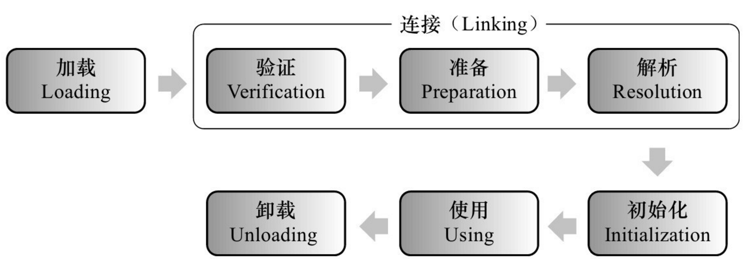

# Java类加载机制

## 1 类加载的时机

Java中的类在被加载到内存的过程，被称为类加载机制，那么什么时候才会触发类的加载过程呢。Java中的类在被加载到内存中，到卸载出内存的这整个过程中，它的整个生命周期有以下7个阶段：

1. 加载（Loading）
2. 验证（Verification）
3. 准备（Preparation）
4. 解析（Resolution）
5. 初始化（Initialization）
6. 使用（Using）
7. 卸载（Unloading）

其中**加载、验证、准备、初始化、卸载**这5个阶段的顺序是能确定的，类加载的过程必须按照这种顺序按部就班的**开始**。而**解析**阶段的顺序则不一定。在某些情况下，解析阶段可以在初始化阶段之后，这也是Java的运行时绑定特性。

> 类加载的这些阶段通常都是互相交叉的混合进行，会在一个阶段执行的过程中调用、激活另一个阶段

那么，一个`.class`文件在什么情况下会加载到内存中，执行**加载**的过程呢，

## Reference

1. [Java 类加载机制(阿里)-何时初始化类](https://www.cnblogs.com/aspirant/p/7200523.html)
2. [jvm内存模型-和内存分配以及jdk、jre、jvm是什么关系(阿里，美团，京东)](https://www.cnblogs.com/aspirant/p/6841955.html)\
3. [JVM的垃圾回收机制 总结(垃圾收集、回收算法、垃圾回收器)](https://www.cnblogs.com/aspirant/p/8662690.html)
4. [你确定你真的理解"双亲委派"了吗？！](https://www.cnblogs.com/hollischuang/p/14260801.html)