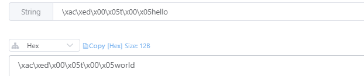

## SpringBoot操作redis

## 1 添加依赖bao

- maven

  ```xml
  <dependency>
      <groupId>org.springframework.boot</groupId>
      <artifactId>spring-boot-starter-data-redis</artifactId>
  </dependency>
  ```

- gradle

  ```
  implementation 'org.springframework.boot:spring-boot-starter-data-redis:2.7.4'
  ```

## 2 配置redis地址

新增`appcalition.yml`文件，配置如下：

```yml
spring:
  redis:
    host: 127.0.0.1 #redis服务器地址
    port: 6380 #端口
    password: #密码
    database: 0  #默认数据库
```

## 3 参加test类

编写一个测试`controller`类，代码如下：

```Java
package com.example.emptyjava.controller;

import org.springframework.data.redis.core.RedisTemplate;
import org.springframework.web.bind.annotation.RequestMapping;
import org.springframework.web.bind.annotation.RestController;

import javax.annotation.Resource;

@RequestMapping("/test")
@RestController
public class TestController {

    @Resource
    RedisTemplate<String, String> redisTemplate;

    @RequestMapping("/test")
    public String test() {
        redisTemplate.opsForValue().set("hello", "world");
        String ans = redisTemplate.opsForValue().get("hello");
        System.out.println(ans);

        return "OK";
    }
}
```

通过postman调用：http://127.0.0.1/test/test

然后查看redis，可以看到有对应的数据：



## Reference

1. [SpringBoot系列教程之RedisTemplate 基本配置说明文档](https://segmentfault.com/a/1190000017556013)