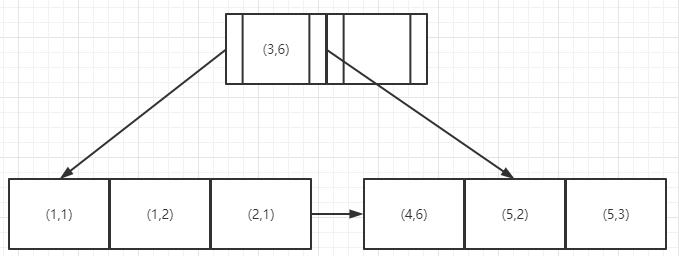

### 1 什么是最左匹配原则

索引的底层是一颗B+树，那么[联合索引](https://so.csdn.net/so/search?q=联合索引&spm=1001.2101.3001.7020)当然还是一颗B+树，只不过联合索引的健值数量不是一个，而是多个。构建一颗B+树只能根据一个值来构建，因此数据库依据联合索引最左的字段来构建B+树。
例子：假如创建一个（a,b)的联合索引，那么它的索引树是这样的：



可以看到a的值是有顺序的，1，1，2，4，5，5，而b的值是没有顺序的1，2，1，6，2，3。所以b = 2这种查询条件没有办法利用索引，因为联合索引首先是按a排序的，b是无序的。

同时我们还可以发现在a值相等的情况下，b值又是按顺序排列的，但是这种顺序是相对的。所以最左匹配原则遇上范围查询就会停止，剩下的字段都无法使用索引。例如a = 1 and b = 2 a,b字段都可以使用索引，因为在a值确定的情况下b是相对有序的，而a>1and b=2，a字段可以匹配上索引，但b值不可以，因为a的值是一个范围，在这个范围中b是无序的。

**最左匹配原则：**最左优先，以最左边的为起点任何连续的索引都能匹配上。同时遇到范围查询(>、<、between、like)就会停止匹配。

### 2 举例说明

假如建立联合索引（a,b,c）

#### （1）**全值匹配查询时**

```sql
select * from table_name where a = '1' and b = '2' and c = '3' 
select * from table_name where b = '2' and a = '1' and c = '3' 
select * from table_name where c = '3' and b = '2' and a = '1' 
```

> 上面3个sql语句用到了索引，
>
> 因为where子句几个搜索条件顺序调换不影响查询结果，因为Mysql中有查询优化器，会自动优化查询顺序 

#### （2）**匹配左边的列时**

```sql
select * from table_name where a = '1' 
select * from table_name where a = '1' and b = '2' 
select * from table_name where a = '1' and c = '2'  
select * from table_name where a = '1' and b = '2' and c = '3'
```

> 上面4个sql语句也用到了联合索引，因为都是从索引的最左边列开始匹配
>
> 1. sql1只用到了联合索引中的a列
> 2. sql2用到了联合索引中的a列和b列
> 3. sql3只用到了联合索引中的a列，因为联合索引是基于a列创建的，且索引创建的顺序是a,b,c，c列只有在a列和b列都确定的情况下才是有序的
> 4. sql4用到了完整的联合索引

```sql
select * from table_name where  b = '2' 
select * from table_name where  c = '3'
select * from table_name where  b = '1' and c = '3' 
```

> 上面3个sql没有从联合索引的最左边一列开始匹配，最后查询用到联合索引，走的全表扫描

```sql
select * from table_name where a = '1' and c = '3' 
```

> 如果查询条件用到的联合索引字段不连续，只用到了a列，b和c列都不会用到

#### （3）**匹配列前缀**

如果列是字符型的话它的比较规则和联合索引的规则类似，先比较字符串的第一个字符，第一个字符的ASCII码小的那个字符串就比较小，如果两个字符串第一个字符相同，那就再比较第二个字符，第二个字符的ASCII码小的那个字符串就比较小，依次类推，比较字符串。

如果a是字符类型，那么前缀匹配用的是索引，后缀和中缀只能全表扫描了

```sql
select * from table_name where a like 'As%'; //前缀都是排好序的，走索引查询
select * from table_name where  a like '%As'//全表查询
select * from table_name where  a like '%As%'//全表查询
```

#### （4）**匹配范围值**

```sql
select * from table_name where  a > 1 and a < 3
```

> a列是联合索引的最左列，所以这个范围查找可以用到这个联合索引

```sql
select * from table_name where  a > 1 and a < 3 and b > 1;
```

> 多个列同时进行范围查找时，只有对联合索引最左边的那个列进行范围查找才会用到B+树索引，也就是只有a用到索引，**在1<a<3的范围内b是无序的**，不能用索引，找到1<a<3的记录后，只能根据条件 b > 1继续逐条过滤

#### （5）**精确匹配某一列并范围匹配另外一列**

```sql
select * from table_name where  a = 1 and b > 3;
```

> 如果联合索引最左边的列是精确查找的，则联合索引右边的列可以进行范围查找
>
>  **因为在a=1的情况下b是有序的，进行范围查找走的是联合索引**

#### （6）order排序走索引

一般情况下，我们只能把MySQL表中的记录加载到内存中，再用一些排序算法，比如快速排序，归并排序等在内存中对这些记录进行排序，有时候查询的结果集太大不能在内存中进行排序的话，还可能暂时借助磁盘空间存放中间结果，排序操作完成后再把排好序的结果返回客户端。Mysql中把这种再内存中或磁盘上进行排序的方式统称为文件排序。文件排序非常慢，但如果order子句用到了索引列，就有可能省去文件排序的步骤

```sql
select * from table_name order by a,b,c limit 10;
```

因为b+树索引本身就是按照上述规则排序的，所以可以直接从索引中提取数据，然后在进行回表操作取出该索引中不包含的列就好了

order by的子句后面的顺序也必须按照索引列的顺序给出，比如

```sql
select * from table_name order by b,c,a limit 10;
```

>  上面的sql语句由于顺序和联合索引的列的顺序不一致，所以这种颠倒顺序sql没有用到联合索引
>

```sql
select * from table_name order by a limit 10;
select * from table_name order by a,b limit 10;
```

> 上面2条sql语句order by部分是联合索引的最左边列在前，所以这种sql可以用到联合索引的部分索引
>

```sql
select * from table_name where a =1 order by b,c limit 10;
```

> 上面的sql语句的where条件中，联合索引的最左边列是一个常量，所以order by后边的列排序可以用到这个联合索引

### 3 MySQL explain

#### （1） EXPLAIN可以向我们提供哪些信息

1. EXPLAIN可以解释说明 SELECT, DELETE, INSERT, REPLACE, and UPDATE 等语句.
2. 当EXPLAIN与可解释的语句一起使用时，mysql会显示一些来自于优化器的关于sql执行计划的信息。即mysql解释它是如何处理这些语句的，和表之间是如何连接的。想获取更多关于EXPLAIN如何获取执行计划信息的。
3. 当EXPLAIN后面是一个会话的connection_id 而不是一个可执行的语句时，它会展示会话的信息。
4. 对于SELECT语句，EXPLAIN会产生额外的执行计划信息，这些信息可以用SHOW WARNINGS显示出来。
5. EXPLAIN对于检查设计分区表的查询时非常有用。
6. FORMAT选项可以用于选择输出格式，如果没有配置FORMAT选项，默认已表格形式输出。JSON 选项让信息已json格式展示。

#### （2）EXPLAIN 输出列信息

第一列:列名, 第二列:FORMAT = JSON时输出中显示的等效属性名称 ,第三列：字段含义

| Column        | JSON Name     | Meaning                                         |
| ------------- | ------------- | ----------------------------------------------- |
| id            | select_id     | select标识号                                    |
| select_type   | None          | select类型                                      |
| table         | table_name    | 这一行数据是关于哪张表的                        |
| partitions    | partitions    | 匹配的分区，对于未分区表，该值为空              |
| type          | access_type   | 使用的连接类别,有无使用索引                     |
| possible_keys | possible_keys | MySQL能使用哪个索引在该表中找到行               |
| key           | key           | MySQL实际决定使用的键（索引）                   |
| key_len       | key_length    | MySQL决定使用的键长度。如果键是NULL，长度为NULL |
| ref           | ref           | 与索引关联的列                                  |
| rows          | rows          | mysql认为执行sql时必须被校验的行数              |
| filtered      | filtered      | 表示此查询条件所过滤的数据的百分比              |
| Extra         | None          | 附加信息                                        |

##### 1）id

SELECT标识符。SELECT在查询中的序列号，可以为空。

##### 2）select_type

SELECT类型，所有类型在下表中展示，JSON格式的EXPLAIN将SELECT类型公开为query_block的属性，除非它是SIMPLE或PRIMARY。 JSON名称(不适用为None)也显示在表中。

| select_type Value    | JSON Name                  | Meaning                                                      |
| -------------------- | -------------------------- | ------------------------------------------------------------ |
| SIMPLE               | None                       | 简单SELECT(不使用UNION或子查询等)                            |
| PRIMARY              | None                       | 嵌套查询时最外层的查询                                       |
| UNION                | None                       | UNION中的第二个或后面的SELECT语句                            |
| DEPENDENT UNION      | dependent (true)           | UNION中的第二个或以后的SELECT语句，取决于外部查询            |
| UNION RESULT         | union_result               | UNION的结果                                                  |
| SUBQUERY             | None                       | 子查询中的第一个选择                                         |
| DEPENDENT SUBQUERY   | dependent (true)           | 子查询中的第一个选择，取决于外部查询                         |
| DERIVED              | None                       | 派生表（子查询中产生的临时表）                               |
| MATERIALIZED         | materialized_from_subquery | 物化子查询                                                   |
| UNCACHEABLE SUBQUERY | cacheable (false)          | 无法缓存结果的子查询，必须对外部查询的每一行进行重新计算     |
| UNCACHEABLE UNION    | cacheable (false)          | UNION中属于不可缓存子查询的第二个或以后的选择(请参 UNCACHEABLE SUBQUERY) |

##### 3）table

显示这一行的数据是关于哪张表的，有时是真实的表名字，有时也可能是以下几种结果

- <unionM,N>: 指id为M,N行结果的并集
- <derivedN>: 该行是指id值为n的行的派生表结果。派生表可能来自例如from子句中的子查询。
- <subqueryN>: 该行是指id值为n的行的物化子查询的结果。

##### 4） partitions

查询的记录所属于的分区，对于未分区表，该值为NULL。

##### 5）type

连接使用了哪种类别,有无使用索引,常用的类型有：system, const, eq_ref, ref, range, index, ALL（从左到右，性能越来越差），详情查看[ EXPLAIN Join Types](https://link.segmentfault.com/?enc=21DUWQpvh8CFNmFynOE%2FmA%3D%3D.Lok4dzoIE3JuqNClcCW6bgQibkOQqmwfnMCSvto2SxAJYJ%2FBevRYVbuhk2AWnd6xGRSz67MV03%2BBYA4zN6jzCEvD1swaPx9wdiDNdriYyMk%3D)

- NULL：MySQL在优化过程中分解语句，执行时甚至不用访问表或索引，例如从一个索引列里选取最小值可以通过单独索引查找完成

- system：这个表（也可能是查询出来的临时表）只有一行数据 (= system table). 是const中的一个特例

- const：表最多有一个匹配行，它将在查询开始时被读取。因为仅有一行，在这行的列值可被优化器剩余部分认为是常数。const表很快，因为它们只读取一次！const用于查询条件为PRIMARY KEY或UNIQUE索引并与常数值进行比较时的所有部分。
  在下面的查询中，tbl_name可以用于const表：

  ```sql
  SELECT * from tbl_name WHERE primary_key=1；
  SELECT * from tbl_name WHERE primary_key_part1=1和 primary_key_part2=2；
  
  --例子
  mysql> explain select * from t_a where id =1;
  +----+-------------+-------+------------+-------+---------------+---------+---------+-------+------+----------+-------+
  | id | select_type | table | partitions | type  | possible_keys | key     | key_len | ref   | rows | filtered | Extra |
  +----+-------------+-------+------------+-------+---------------+---------+---------+-------+------+----------+-------+
  |  1 | SIMPLE      | t_a   | NULL       | const | PRIMARY       | PRIMARY | 8       | const |    1 |   100.00 | NULL  |
  +----+-------------+-------+------------+-------+---------------+---------+---------+-------+------+----------+-------+
  1 row in set, 1 warning (0.07 sec)
  ```

- eq_ref：对于前几个表中的每一行组合，从该表中读取一行。除了system和const，这是最好的连接类型。当连接使用索引的所有部分，并且索引是主键或唯一非空索引时，将使用它。eq_ref可以用于使用= 操作符比较的带索引的列。比较值可以为常量或一个使用在该表前面所读取的表的列的表达式。
  在下面的例子中，MySQL可以使用eq_ref联接去处理ref_tables：

  ```sql
  SELECT * FROM ref_table,other_table
    WHERE ref_table.key_column=other_table.column;
  
  SELECT * FROM ref_table,other_table
    WHERE ref_table.key_column_part1=other_table.column
    AND ref_table.key_column_part2=1;
  
  --例子（t_b为t_a的复制表，表结构相同）
  mysql> explain select * from t_a,t_b where t_a.code=t_b.code;
  +----+-------------+-------+------------+--------+---------------+---------+---------+---------------+------+----------+-------+
  | id | select_type | table | partitions | type   | possible_keys | key     | key_len | ref           | rows | filtered | Extra |
  +----+-------------+-------+------------+--------+---------------+---------+---------+---------------+------+----------+-------+
  |  1 | SIMPLE      | t_a   | NULL       | ALL    | uk_code       | NULL    | NULL    | NULL          |    9 |   100.00 | NULL  |
  |  1 | SIMPLE      | t_b   | NULL       | eq_ref | uk_code       | uk_code | 4       | test.t_a.code |    1 |   100.00 | NULL  |
  +----+-------------+-------+------------+--------+---------------+---------+---------+---------------+------+----------+-------+
  2 rows in set, 1 warning (0.03 sec)
  ```

- ref对于每个来自于前面的表的行组合，所有有匹配索引值的行将从这张表中读取。如果联接只使用键的最左边的前缀，或如果键不是UNIQUE或PRIMARY KEY（换句话说，如果联接不能基于关键字查询结果为单个行的话），则使用ref。如果使用的键仅仅匹配少量行，该联接类型是不错的。ref可以用于使用=或<=>操作符的带索引的列。
  在下面的例子中，MySQL可以使用ref联接来处理ref_tables：

  ```sql
  SELECT * FROM ref_table WHERE key_column=expr;
  
  SELECT * FROM ref_table,other_table
    WHERE ref_table.key_column=other_table.column;
  
  SELECT * FROM ref_table,other_table
    WHERE ref_table.key_column_part1=other_table.column
    AND ref_table.key_column_part2=1;
  
  --例子（t_b为t_a的复制表，表结构相同）
  mysql> explain select * from t_a,t_b where t_a.age=t_b.age;
  +----+-------------+-------+------------+------+---------------+---------+---------+--------------+------+----------+-------------+
  | id | select_type | table | partitions | type | possible_keys | key     | key_len | ref          | rows | filtered | Extra       |
  +----+-------------+-------+------------+------+---------------+---------+---------+--------------+------+----------+-------------+
  |  1 | SIMPLE      | t_a   | NULL       | ALL  | age_key       | NULL    | NULL    | NULL         |    9 |   100.00 | Using where |
  |  1 | SIMPLE      | t_b   | NULL       | ref  | age_key       | age_key | 5       | test.t_a.age |    1 |   100.00 | NULL        |
  +----+-------------+-------+------------+------+---------------+---------+---------+--------------+------+----------+-------------+
  2 rows in set, 1 warning (0.03 sec)
  ```

- fulltext：使用FULLTEXT索引执行连接

- ref_or_null：该联接类型与ref类似，但是添加了MySQL可以专门搜索包含NULL值的行。在解决子查询中经常使用该联接类型的优化。
  在下面的例子中，MySQL可以使用ref_or_null联接来处理ref_tables：

  ```sql
  SELECT * FROM ref_table
    WHERE key_column=expr OR key_column IS NULL;
  
  --例子
  mysql> explain select * from t_a where t_a.age =3 or t_a.age is null;
  +----+-------------+-------+------------+-------------+---------------+---------+---------+-------+------+----------+-----------------------+
  | id | select_type | table | partitions | type        | possible_keys | key     | key_len | ref   | rows | filtered | Extra                 |
  +----+-------------+-------+------------+-------------+---------------+---------+---------+-------+------+----------+-----------------------+
  |  1 | SIMPLE      | t_a   | NULL       | ref_or_null | age_key       | age_key | 5       | const |    2 |   100.00 | Using index condition |
  +----+-------------+-------+------------+-------------+---------------+---------+---------+-------+------+----------+-----------------------+
  1 row in set, 1 warning (0.03 sec)
  ```

- index_merge：该联接类型表示使用了索引合并优化方法。在这种情况下，key列包含了使用的索引的清单，key_len包含了使用的索引的最长的关键元素。

  ```sql
  SELECT * FROM ref_table
    WHERE idx1=expr1 OR idx2 =expr2;
  
  --例子
  mysql> explain select * from t_a where t_a.code =3 or t_a.age = 3;
  +----+-------------+-------+------------+-------------+-----------------+-----------------+---------+------+------+----------+-------------------------------------------+
  | id | select_type | table | partitions | type        | possible_keys   | key             | key_len | ref  | rows | filtered | Extra                                     |
  +----+-------------+-------+------------+-------------+-----------------+-----------------+---------+------+------+----------+-------------------------------------------+
  |  1 | SIMPLE      | t_a   | NULL       | index_merge | uk_code,age_key | uk_code,age_key | 4,5     | NULL |    2 |   100.00 | Using union(uk_code,age_key); Using where |
  +----+-------------+-------+------------+-------------+-----------------+-----------------+---------+------+------+----------+-------------------------------------------+
  1 row in set, 1 warning (0.03 sec)
  ```

- unique_subquery：该类型替换了下面形式的IN子查询的ref：
  `value IN (SELECT primary_key FROM single_table WHERE some_expr)`
  unique_subquery是一个索引查找函数，可以完全替换子查询，效率更高。

- index_subquery：该联接类型类似于unique_subquery。可以替换IN子查询，但只适合下列形式的子查询中的非唯一索引：
  `value IN (SELECT key_column FROM single_table WHERE some_expr)`

- range：只检索给定范围的行，使用一个索引来选择行。key列显示使用了哪个索引。key_len包含所使用索引的最长关键元素。在该类型中ref列为NULL。当使用=、<>、>、>=、<、<=、IS NULL、<=>、BETWEEN或者IN操作符，用常量比较关键字列时，可以使用range

  ```sql
  mysql> explain select * from t_a where id > 8;
  +----+-------------+-------+------------+-------+---------------+---------+---------+------+------+----------+-------------+
  | id | select_type | table | partitions | type  | possible_keys | key     | key_len | ref  | rows | filtered | Extra       |
  +----+-------------+-------+------------+-------+---------------+---------+---------+------+------+----------+-------------+
  |  1 | SIMPLE      | t_a   | NULL       | range | PRIMARY       | PRIMARY | 8       | NULL |    1 |   100.00 | Using where |
  +----+-------------+-------+------------+-------+---------------+---------+---------+------+------+----------+-------------+
  1 row in set, 1 warning (0.03 sec)
  ```

- index：该联接类型与ALL相同，除了只有索引树被扫描。这通常比ALL快，因为索引文件通常比数据文件小。当查询只使用作为单索引一部分的列时，MySQL可以使用该联接类型。

- ALL：对于每个来自于先前的表的行组合，进行完整的表扫描。如果表是第一个没标记const的表，这通常不好，并且通常在它情况下很差。通常可以增加更多的索引而不要使用ALL，使得行能基于前面的表中的常数值或列值被检索出。

##### 6) possible_keys

possible_keys列指出MySQL能使用哪个索引在该表中找到行。注意，该列完全独立于EXPLAIN输出所示的表的次序。这意味着在possible_keys中的某些键实际上不能按生成的表次序使用。

如果该列是NULL，则没有相关的索引。在这种情况下，可以通过检查WHERE子句看是否它引用某些列或适合索引的列来提高你的查询性能。如果是这样，创造一个适当的索引并且再次用EXPLAIN检查查询

##### 7) key

key列显示MySQL实际决定使用的键（索引）。如果没有选择索引，键是NULL。要想强制MySQL使用或忽视possible_keys列中的索引，在查询中使用FORCE INDEX、USE INDEX或者IGNORE INDEX。

##### 8) key_len

key_len列显示MySQL决定使用的键长度。如果键是NULL，则长度为NULL。
使用的索引的长度。在不损失精确性的情况下，长度越短越好

##### 9) ref

ref列显示使用哪个列或常数与key一起从表中选择行。

##### 10) rows

rows列显示MySQL认为它执行查询时必须检查的行数。

##### 11) Extra

| 字段值                       | 含义                                                         |
| ---------------------------- | ------------------------------------------------------------ |
| using filesort               | 使用文件内排序                                               |
| using tmporary               | 使用临时表保存中间结果，常见于排序order by和分组group by     |
| Using index                  | 表示覆盖索引即可满足查询要求，因而无需再回表查询             |
| Using index for group by     | 读取和分组都使用了覆盖索引                                   |
| Using where                  | Server层对存储引擎层返回的数据做where条件过滤                |
| impossiable where            | where的值总fasle，不能获取任何记录                           |
| Using join buffer            | 联表查询时使用的缓存策略，有Block Nested-Loop Join和Batched Key Access两种策略 |
| Select tables optimized away | 在没有group by子句的情况下，基于索引优化的MAX/MIN操作，或者基于MyISAM存储引擎优化的COUNT(*)操作，不必等到执行阶段再进行计算，在查询计划生成阶段既可以完成优化 |
| Distinct                     | 优化Distinct操作，在找到匹配的第一行记录后，立马停止查找同样的值 |


### Reference

1. https://blog.csdn.net/sinat_41917109/article/details/88944290
1. https://www.cnblogs.com/xuwc/p/14007766.html
