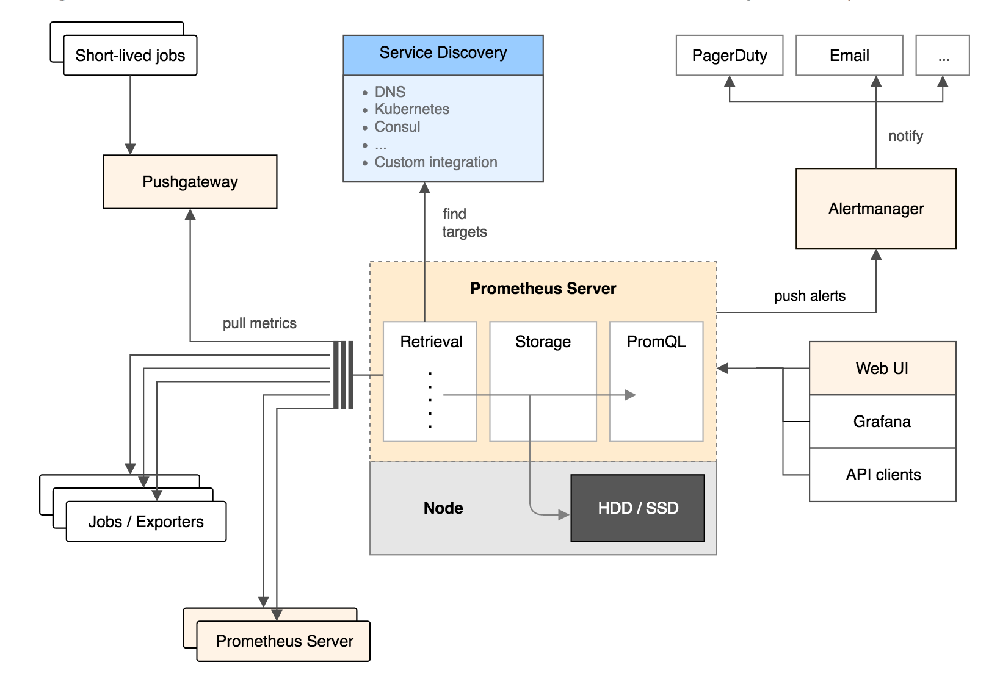

# MySQL查询原理

想要弄清楚MySQL查询原理，首先得搞清楚MySQL的基础架构，然后在分析查询原理。

## 一、MySQL基础架构



### 1 连接器（connector）

在查询 SQL 语句前，肯定要先建立与 MySQL 的连接，这由连接器来完成。连接器负责与客户端建立连接、获取权限、维持和管理连接。连接命令为：

```bash
mysql -h$ip -P$port -u$user -p  
```

输入密码，验证通过后，连接器会到权限表里面查出你拥有的权限，之后这个连接里面的权限判断逻辑，都将依赖于此时读到的权限，一个用户成功建立连接后，即使管理员对这个用户的权限做了修改，也不会影响已经存在连接的权限，修改完后，只有再新建的连接才会使用新的权限设置。

连接完成后，如果你没有后续的动作，这个连接就处于空闲状态，你可以在 `show processlist` 命令中看到它。结果如下：


客户端如果太长时间没动静，连接器就会自动将它断开；这个时间是由参数 `wait_timeout` 控制的，默认值是8小时。如果在连接被断开之后，客户端再次发送请求的话，就会收到一个错误提醒：**Lost connection to MySQL server during query**。

#### 长连接和短连接的区别？

- 数据库里面，长连接是指连接成功后，如果客户端持续有请求，则一直使用同一个连接。
- 短连接则是指每次执行完很少的几次查询就断开连接，下次查询再重新建立一个。

建立连接的过程通常是比较复杂的，建议在使用中要尽量减少建立连接的动作，尽量使用长连接。但是全部使用长连接后，有时候 MySQL占用内存涨得特别快，这是因为 MySQL 在执行过程中临时使用的内存是管理在连接对象里面的。这些资源会在连接断开的时候才释放。所以如果长连接累积下来，可能导致内存占用太大，被系统强行杀掉（OOM），从现象看就是 MySQL 异常重启了。

怎么解决这个问题呢？可以考虑以下两种方案：

1. 定期断开长连接。使用一段时间，或者程序里面判断执行过一个占用内存的大查询后，断开连接，之后要查询再重连。
2. MySQL 5.7 以上版本，可以在每次执行一个比较大的操作后，通过执行 mysql_reset_connection 来重新初始化连接资源。这个过程不需要重连和重新做权限验证，但是会将连接恢复到刚刚创建完时的状态。

### 2 **缓存区（query cache）**

在建立连接后，就开始执行 select 语句了，执行前首先会查询缓存。

MySQL的缓存是一个常驻内存的映射表（类似Java中的hashMap），key为sql语句的哈希值，value为查询的结果。

**mysql查询首先会检查该语句是否执行过：**

- 如果执行过，则会到缓存表中拿结果，，如果缓存中存在该结果则直接返回。
- 如果缓存中没有结果，就会继续后面的执行阶段。执行完成后，执行结果会被存入查询缓存中。如果查询命中缓存，MySQL 不需要执行后面的复杂操作，就可以直接返回结果，会提升效率。

#### MySQL缓存的优缺点：

##### 优点

1. 如果查询命中缓存，可以直接返回结果，后面的步骤不用执行，效率高

##### 缺点

1. 如果某些数据变化频繁，使用缓存，可能导致数据不一致
2. 表结构如果发生变化，则该表的所有查询缓存都会被清空
3. 只要对表有更新，则该表上的缓存都会被清空，如果某表很久才更新一次，那么这张表容易命中缓存，比如系统配置表

可以将参数 query_cache_type 设置成 DEMAND，对于默认的 SQL 语句都将不使用查询缓存。而对于你确定要使用查询缓存的语句，可以用 SQL_CACHE 显式指定，如下：

```sql
select SQL_CACHE * from user_info where id = 1;
```

### 3 分析器（analyzer）-要做什么

如果查询缓存未命中，就要开始执行语句了。首先，MySQL 需要对 SQL 语句进行解析。

分析器先会对SQL 语句做词法分析。SQL 语句是由多个字符串和空格组成的，MySQL 需要识别出里面的字符串分别是什么，代表什么。MySQL 从你输入的 select 这个关键字识别出来，这是查询语句。它也要把字符串 user_info 识别成表名，把字符串 id 识别成列名。之后就要做语法分析。根据词法分析的结果，语法分析器会根据语法规则，判断输入的 SQL 语句是否满足 MySQL 语法。

如果你 SQL 语句不对，就会收到 `You have an error in your SQL syntax` 的错误提醒，比如下面这个语句 from 写成了 form：

```sql
select * form user_info  where id = 1;
1064 - You have an error in your SQL syntax; check the manual that corresponds to your MySQL server version for the right syntax to use near 'form user_info  where id = 1' at line 1
```

### 4 **优化器**（optimizer）-怎么做

经过分析器的词法分析和语法分析后，还要经过优化器的处理。

优化器的功能：

1. 表里面有多个索引的时候，决定使用哪个索引
2. 在一个语句有多表关联（join）的时候，决定各个表的连接顺序

比如以下的union语句：

```sql
SELECT * FROM order_master JOIN order_detail USING (order_id) WHERE order_master.pay_status = 0 AND order_detail.detail_id = 1558963262141624521;
```

- 既可以先从表 order_master 里面取出 pay_status = 0 的记录的 order_id 值，再根据 order_id 值关联到表 order_detail，再判断 order_detail 里面 detail_id 的值是否等于 1558963262141624521。

- 也可以先从表 order_detail 里面取出 detail_id = 1558963262141624521 的记录的 order_id 值，再根据 order_id 值关联到 order_master，再判断 order_master 里面 pay_status 的值是否等于 0。

这两种执行方法的逻辑结果是一样的，但是执行的效率会有不同，而优化器的作用就是决定选择使用哪一个方案。优化器阶段完成后，这个语句的执行方案就确定下来了，然后进入执行器阶段

### 5 **执行器**（actuator）

MySQL 通过**分析器知道了要做什么**，通过优化器知道了该怎么做，于是就进入了执行器阶段，开始执行语句。

开始执行的时候，要先判断一下你对这个表 user_info 有没有执行查询的权限，如果没有，就会返回没有权限的错误，如下所示 (**如果命中查询缓存，会在查询缓存返回结果的时候，做权限验证。查询也会在优化器之前调用 precheck 验证权限**)。

如果有权限，就打开表继续执行。打开表的时候，执行器就会根据表的引擎定义，去使用这个引擎提供的接口。比如我们这个例子中的表 user_info 中，

- id 字段没有索引，那么执行器的执行流程是这样的：
  1. 调用 `InnoDB` 引擎接口取这个表的第一行，判断 id 值是不是 1，如果不是则跳过，如果是则将这行存在结果集中；
  2. 调用引擎接口取下一行，重复相同的判断逻辑，直到取到这个表的最后一行。
  3. 执行器将上述遍历过程中所有满足条件的行组成的记录集作为结果集返回给客户端。

- 对于有索引的表，第一次调用的是取满足条件的第一行这个接口，之后循环取满足条件的下一行这个接口。
  1. 使用`where`条件中的列去对应的辅助索引树（非聚簇索引）查找改行数据的主键，在拿着主键到主键索引树（聚簇索引）上查找具体的数据

数据库的慢查询日志中有 `rows_examined` 字段，表示这个语句执行过程中扫描了多少行。这个值就是在执行器每次调用引擎获取数据行的时候累加的。在有些场景下，执行器调用一次，在引擎内部则扫描了多行，因此引擎扫描行数跟 `rows_examined` 并不是完全相同的。

## 二、SQL语句的执行流程

### 1 MySQL中的redo log和binlog

1. redo log（InnoDB特有的日志模块） 重做日志文件，用于记录事务操作的变化，记录修改后的值，不管事务是否提交。保证数据的完整性。其中redo log是固定大小的，是从头开始写，写到末尾在从头开始。同时会有两个指针，一个记录写入的位置，一个标记，当前擦除的位置，不断的循环。整个过程称为crash-safe。即时数据库异常，也会有记录
2. binlog 归档日志文件，用于记录对mysql数据库执行更改的所有操作。binlog是追加写，不会覆盖之前的。

### 2 mysql更新一条语句的流程

```sql
 update tb_area SET area_name = "beijing" WHERE area_id = 1
```

1. 首先执行器通过id查到这条记录（搜索树或者查找数据页） ，并加载到内存中。
2. 然后对这条记录的area_name调用引擎写入接口，进行修改。
3. 修改内存中的值，同时更新redolog告知执行器完成写入（状态置为prepare），可以提交事务，执行器将这条操作记录记录在binlog，写入磁盘
4. 完成上述一系列的操作，执行器调用事务提交接口（redolog状态置为commit），完成更新操作。

> 注意：Mysql的redolog模块写入操作拆成了2个步骤，`prepare`和`commit`，称为两阶段提交。 整个过程为
>
> 1. redolog的prepare状态 
> 2. binlog的写入 
> 3. redolog的commit状态，保证Mysql的可靠性。
>
>  如果binlog没有写入并没有提交事务回滚
>  如果binlog写入事务没提交，数据库恢复后自动完成commit

### 3 MySQL执行一个查询语句的过程

1. 客户端通过连接器连接到MySQL服务器。

2. 连接器权限验证通过之后，先查询是否有缓存，如果有缓存（之前执行过该条语句）则返回缓存数据，如果不存在缓存数据则进入分析器

3. 分析器会对查询语句进行语法分析和词法分析，以判断sql语法是否正确，如果查询语句语法错误直接返回客户端错误信息，如果正确则进入优化器

4. 优化器会对查询语句进行优化处理，比如一个表中存在多个索引，优化器会比较判别哪个索引性能更好

5. 优化器执行完会生成一个执行计划，然后就进入执行器执行，执行器就根据优化器生成的执行计划执行，调用存储引擎的API，查询到满足条件的所有数据，然后返回数据给客户端。

## 三、MySQL查询过程

MySQL查询请求执行过程：


### 1 客户端/服务端通信协议

​       MySQL客户端/服务端通信协议是“**半双工**”的：在任意时刻，要么是服务器向客户端发送数据，要么是客户端向服务器发送数据，这两个动作不能同时发生。一旦一端开始发送消息，另一端要接受完整个消息才能响应它，所以我们无法也无须将一个消息切成小块独立发送，也没有办法进行流量控制。

  客户端用一个单独的数据包将查询请求发送给服务器，所以当查询语句很长的时候，需要设置max_allowed_packet参数。但是需要的注意的是，如果查询实在是太大，服务端会拒绝接受更多数据并抛出异常。

  与之相反的是，服务器响应给用户的数据通常会很多，由多个数据包组成。但是当服务器响应客户端请求时，客户端必须完整的接受整个返回结果，而不能简单的只取前面几条结果，然后让服务器停止发送。因而在实际开发中，尽量保持查询简单且只返回必需的数据，减小通信间数据包的大小和数量是一个非常好的习惯，这也是查询中尽量避免使用SELECT * 以及加上LIMIT限制的原因之一。

### 2 查询缓存

​       在解析一个查询语句前，如果查询缓存是打开的，那么MySQL会检查这个查询语句是否命中查询缓存中的数据。如果当前查询恰好命中查询缓存，在检查一次用户权限后直接返回缓存中的结果。这种情况下，查询不会被解析，也不会生成执行计划，更不会执行。

   MySQL将缓存存放在一个引用表（类似于HashMap的数据结构），通过一个哈希值索引，这个哈希值通过查询本身、当前要查询的数据库、客户端协议版本号等一些可能影响结果的信息计算得来。所以两个查询在任何字符上的不同（空格、注释），都会导致缓存不会命中。

   如果查询中包含任何用户自定义函数、存储函数、用户变量、临时表、mysql库中的系统表，其查询结果都不会被缓存。比如函数NOW()或者CURRENT_DATE()会因为不同的查询时间，返回不同的查询结果，再比如包含CURRENT_USER或者CONNECION_ID()的查询语句会因为不同的用户而返回不同的结果，将这样的查询结果缓存起来没有任何的意义。

### 3 缓存失效

​       MySQL的查询缓存系统会跟踪查询中涉及的每个表，如果这些表（数据或结构）发生变化，那么和这张表相关的所有缓存数据都将失效。正因为如此，在任何的写操作时，MySQL必须将对应表的所有缓存都设置为失效。如果查询缓存非常大或者碎片很多，这个操作就可能带来很大的系统消耗，甚至导致系统僵死一会儿。而且查询缓存对系统的额外消耗也不仅仅在写操作，读操作也不例外：

1. 任何的查询语句在开始之前都必须经过检查，即使这条SQL语句永远不会命中缓存

2. 如果查询结果可以被缓存，那么执行完成后，会将结果存入缓存，也会带来额外的系统消耗

基于此，要知道并不是什么情况下查询缓存都会提高系统性能，缓存和失效都会带来额外消耗，只有当缓存带来的资源节约大于其本身消耗的资源时，才会给系统带来性能提升。但要如何评估打开缓存是否能够带来性能提升是一件非常困难的事情，。如果系统确实存在一些性能问题，可以尝试打开查询缓存，并在数据库设计上做一些优化：比如：

1. 用多个小表代替一个大表，注意不要过度设计
2. 批量插入代替循环单条插入
3. 合理控制缓存空间大小，一般来说其大小设置为几十兆比较合适
4. 可以通过SQL_CACHE和SQL_NO_CACHE来控制某个查询语句是否需要进行缓存

不要轻易打开查询缓存，特别是写密集型应用。如果实在是忍不住，可以将query_cache_type 设置为DEMAND，这时只有加入SQL_CACH的查询才会走缓存，其他查询则不会，这样可以非常自由地控制哪些查询需要被缓存。

### 4 语法解析和预处理

​       MySQL通过关键字将SQL语句进行解析，并生成一颗对应的解析树。这个过程解析器主要通过语法规则来验证和解析。比如SQL中是否使用了错误的关键字或者关键字的顺序是否正确等等。预处理则会根据MySQL规则进一步检查解析树是否合法。比如检查要查询的数据表和数据列是否存在等等。

### 5 查询优化

​      语法树被认为是合法之后，并且有优化器将其转化成查询计划，多数情况下，一条查询可以有很多种执行方式，最后都返回相应的结果，优化器的作用就是找到这其中最好的执行计划。

  MySQL使用基于成本的优化器，它尝试预测一个查询使用某种执行计划时的成本，并选择其中成本最小的一个。在MySQL可以通过查询当前会话的last_query_cost的值来得到其计算当前查询的成本。

```sql
show status like 'last_query_cost';
```

| Variable_name   | Value       |
| --------------- | ----------- |
| Last_query_cost | 6391.799000 |

示例中的结果表示优化器认为大概需要做6391个数据页的随机查找才能完成上面的查询。这个结果是根据一些列的统计信息计算得来的，这些统计信息包括：每张表或者索引的页面个数、索引的基数、索引和数据行的长度、索引的分布情况等等。

有非常多的原因会导致MySQL选择错误的执行计划，比如统计信息不准确、不会考虑不受其控制的操作成本（用户自定义函数、存储过程）、MySQL认为的最优跟我们想的不一样（我们希望执行时间尽可能短，但MySQL值选择它认为成本小的，但成本小并不意味着执行时间短）等等。

   MySQL的查询优化器是一个非常复杂的部件，它使用了非常多的优化策略来生成一个最优的执行计划：

1. 重新定义表的关联顺序（多张表关联查询时，并不一定按照SQL中指定的顺序进行，但有一些技巧可以指定关联顺序）

2. 优化MIN()和MAX()函数（找某列的最小值，如果该列有索引，只需要查找B+Tree索引最左端，反之则可以找到最大值）

3. 提前终止查询（使用Limit时，查找到满足数量的结果集后会立即终止查询）

4. 优化排序（在老版本MySQL会使用两次传输排序，即先读取行指针和需要排序的字段在内存中对其排序，然后再根据排序结果去读取数据行，而新版本采用的是单次传输排序，也就是一次读取所有的数据行，然后根据给定的列排序）

### 6 查询执行引擎

​       在完成解析和优化阶段以后，MySQL会生成对应的执行计划，查询执行引擎根据执行计划给出的指令逐步执行得出结果。整个执行过程的大部分操作均是通过调用存储引擎实现的接口来完成，这些接口被称为handler API。查询过程中的每一张表由一个handler实例表示，实际上，MySQL在查询优化阶段就为每一张表创建了一个handler实例，优化器可以根据这些实例的接口来获取表的相关信息，包括表的所有列名、索引统计信息等。存储引擎接口提供了非常丰富的功能，但其底层仅有几十个接口，这些接口像塔积木一样完成了一次查询的大部分操作。

### 7.返回结果给客户端

​      查询执行的最后一个阶段就是将结果返回给客户端。即使查询不到数据，MySQL仍然会返回这个查询的相关信息，比如该查询影响到的行数以及执行时间等等。

如果查询缓存被打开且这个查询可以被缓存，MySQL也会将结果存放到缓存中。

结果集返回客户端是一个增量且逐步返回的过程。有可能MySQL在生成第一条结果时，就开始向客户端逐步返回结果集了。这样服务端就无须存储太多结果而消耗过多内存，也可以让客户端第一时间获得返回结果。需要注意的是，结果集中的每一行都会以一个满足①中所描述的通信协议的数据包发送，再通过TCP协议进行传输，在传输过程中，可能对MySQL的数据包进行缓存然后批量发送。

总结下MySQL整个查询流程如下：

1. 客户端向MySQL服务器发送一条查询请求

2. 服务器首先先检查查询缓存，如果命中缓存，则立刻返回存储在缓存中的结果。否则进入下一级段

3. 服务器进行SQL解析、预处理、再由优化器生成对应的执行计划

4. MySQL根据执行计划，调用存储引擎的API来执行查询

5. 将结果返回给客户端，同时缓存查询结果

# Reference

1. [mysql查询底层原理及join的底层分析](https://blog.csdn.net/yb546822612/article/details/106274170)
2. [如何查看mysql binlog日志](https://www.modb.pro/db/244063)
3. [深入理解SQL原理：一条SQL查询语句是如何执行的？](https://cloud.tencent.com/developer/article/1546724)