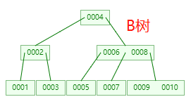
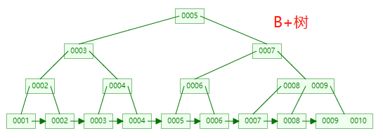
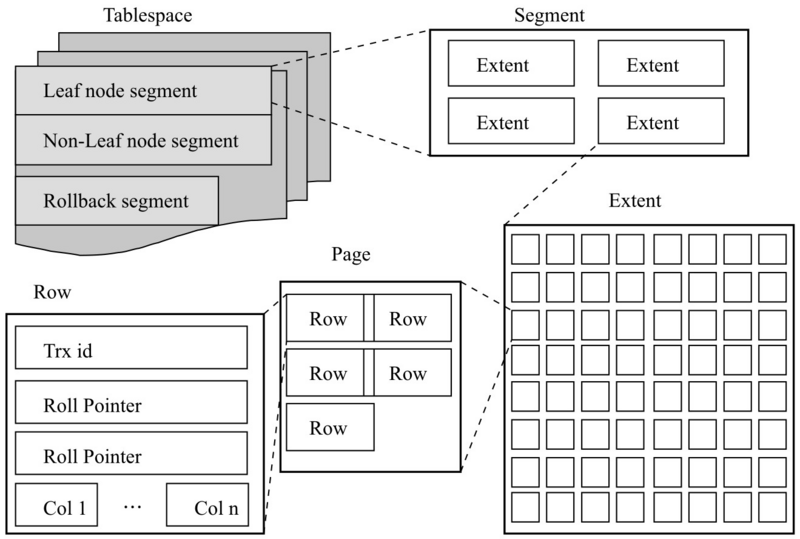
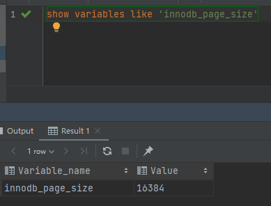

# MySQL索引原理

## 1 索引简介

### 1.1 什么是索引

1. 索引是一种特殊的文件(**InnoDB数据表上的索引是表空间的一个组成部分**)，它包含着对数据表里所有记录的引用指针。

2. 索引是一种数据结构，是数据库管理系统中一个排序的数据结构，以协助快速查询、更新数据库表中的数据。

3. 更通俗的说，索引就相当于目录。为了方便查找书中的内容，通过对内容建立索引形成目录（**查字典**）。
4. 索引是一个文件，它是要占据物理空间的。
5. 索引的实现通常使用B树或者B+树（B树的变种）。
6. 在MySQL中，索引属于存储引擎级别的概念，不同存储引擎对索引的实现方式是不同的。**MyISAM和InnoDB存储引擎只支持BTREE索引（B+Tree）**，MEMORY/HEAP存储引擎支持HASH和BTREE索引。

### 1.2 索引的优缺点

**索引的优点**

1. **可以大大加快数据库的检索速度**，降低数据库的IO成本。

2. 可以在查询的过程中，索引降低了数据库的排序成本，也降低了MySQL查询的CPU成本。

**索引的缺点**

- 时间方面：创建索引和维护索引要耗费时间，具体地，**当对表进行写操作的时候，需要消耗一定的资源去维护索引**，从而会降低增/改/删的执行效率，这个问题不大，一般MySQL大部分都是读操作，读操作不用去维护索引。
- 空间方面：索引是一种数据结构，需要占物理空间。

### 1.3 索引的基本原理

索引的原理很简单，就是把无序的数据变成有序的查询

1. 把创建了索引的列的内容进行排序
2. 对排序结果生成倒排表
3. 在倒排表内容上拼上数据地址链
4. 在查询的时候，先拿到倒排表内容，再取出数据地址链，从而拿到具体数据

### 1.4 索引分类

MySQL的索引类型：

1. 主键索引（primary index）：主键是一种唯一性索引，但它必须指定primary key，每个表只能有一个主键（一个主键可以是多个列，联合主键）
2. 唯一索引（unique index）：索引列的所有值的组合在表中只能出现一次，即必须唯一，值可以为空
3. 普通索引（secondary index）：基本索引类型，值可以为空，没有唯一性的限制
4. 全文索引：全文索引的索引类型为FULLTEXT，全文索引可以在varchar、char、text类型列上创建。（一般不用，现在主流的全文索引用的ES）
5. 组合索引：多个列共同组成一个索引，专门用于组合检索，但是需要考虑最左匹配原则。

#### （1）非聚簇索引（secondary index）

非聚簇索引也叫**辅助索引**（secondary index）

```sql
CREATE [UNIQUE|FULLTEXT|SPATIAL] INDEX index_name
    [USING index_type]
    ON tbl_name (index_col_name,...)
 
index_col_name:
    col_name [(length)] [ASC | DESC]
```

创建的索引，如复合索引、前缀索引、唯一索引，都是属于非聚簇索引，其数据结构为**B+树**（why b+tree?）。

#### （2）聚簇索引（primary index）

在Innodb中，Mysql中的数据是按照主键的顺序来存放的。那么聚簇索引就是按照每张表的主键来构造一颗B+树，叶子节点存放的就是整张表的行数据。由于表里的数据只能按照一颗B+树排序，因此一张表只能**必须有且仅有**一个聚簇索引（理由：数据一旦存储，顺序只能有一种）。

> **如果创建表的时候，没有指定主键，怎么办？**
>
> 1. 如果该表存在一个唯一且不为空的索引列，那么就会用该列做为主键，来创建聚簇索引
>
> 2. 如果该表有有多个非空唯一索引时，InnoDB存储引擎将选择建表时第一个定义的非空唯一索引为主键。这里需要非常注意的是，**主键的选择根据的是定义索引的顺序**，而不是建表时列的顺序。
>
> 3. 如果没有这样的索引，**InnoDB**会**隐式定义一个6个字节大小的指针的主键**来创建聚簇索引。

> **在InnoDB存储引擎中，自增主键和uuid作为主键有何区别？**
>
> - **由于主键使用了聚簇索引**，如果主键是自增id，，那么对应的数据一定也是**相邻地存放在磁盘上**的，**写入性能高**。
>
> - 如果是uuid的形式，由于**uuid没有规则，且不连续**，频繁的插入会使innodb**频繁地移动磁盘块**，**写入性能低**。

#### （3）聚簇索引和非聚簇索引的区别？

- 聚簇索引的叶子节点就是数据节点，也就是聚簇索引不需要在进行一次**回表操作**

- 非聚簇索引的叶子节点保存的仍然是该索引对应数据行的索引文件（地址），如果要拿到该行数据，还需要进行一次**回表操作**，也就是说，使用非聚簇索引查找数据，实际上是执行了两个次索引树的查找：

  1. 在辅助索引树上查找对应的行数据是否存在，如果不存在返回null，如果存在，则拿到叶子节点拿到改行数据的索引值（可以理解为数据的**主键值**）
  2. 然后再拿着该主键的值到该表的聚簇索引树中再进行一次查找，将叶子节点的数据返回给客户端

  > **回表是什么意思？**
  >
  > 使用辅助索引**select**数据时，**MySQL**会先扫描辅助索引树，然后再拿着辅助索引树找到的主键id，到聚簇索引树进行**第二次扫描**，这个动作叫做回表。
  >
  > **什么是索引覆盖？**
  >
  > 如果`select`某写些具体的字段，而这些字段都是索引列，那么直接通过辅助索引树就能拿到该条`sql`所需要的所有数据，而不再需要进行回表拿数据，叫做索引覆盖，索引覆盖效率更高。
  >
  > **什么是索引下推？**
  >
  > 索引条件下推，也叫索引下推，英文全称`Index Condition Pushdown`，简称ICP。
  >
  > 索引下推是**MySQL5.6**新添加的特性，用于优化数据的查询。
  >
  > 在MySQL5.6之前，使用非主键索引进行查询的时候，存储引擎通过索引查询数据，然后将结果返回给server层，**在server层判断是否符合条件**。
  >
  > 在MySQL5.6及以上版本，可以使用索引下推的特性。当存在以索引的列做为判断条件时，server将这一部分判断条件传递给存储引擎，然后存储引擎会筛选出**符合server传递条件的索引项**，即在存储引擎层根据索引条件**过滤**掉不符合条件的索引项，然后再进行回表查询得到结果，将结果返回给server。
  >
  > 结论：**有了索引下推的优化，在满足一定的条件下，存储引擎层会在回表查询之前对数据进行过滤，可以减少存储引擎回表查询的次数**。

- 聚簇索引和非聚簇索引的底层数据结构都是**B+树**

## 2 MySQL索引的数据结构（hash, BTree, B+Tree）

索引的数据结构和具体存储引擎的实现有关，在MySQL中使用较多的索引有**Hash索引**，**B+树索引**等，而我们经常使用的InnoDB存储引擎的默认索引实现为：B+树索引。对于哈希索引来说，底层的数据结构就是哈希表，因此在绝大多数需求为单条记录查询的时候，可以选择哈希索引，查询性能最快；其余大部分场景，建议选择BTree索引。

1. hash：

   1. 底层实现使**hash表**，使用场景：如果每次查询都只查询单条数据，可以选择hash索引，查询性能最快
   2. Hash索引只能用于对等比较，例如`=`,`<=>`（相当于`=`）操作符。由于是一次定位数据，不像BTree索引需要从根节点到枝节点，最后才能访问到页节点这样多次IO访问，所以检索效率远高于BTree索引。

2. BTree：

   1. 底层实现使B树（B+树），使用场景：适合单条记录和多条记录一起查询的场景

   2. BTree是最常用的mysql数据库索引算法，也是mysql默认的算法。因为它不仅可以被用在=,>,>=,<,<=和between这些比较操作符上，而且还可以用于like操作符，只要它的查询条件是一个不以通配符开头的常量， 例如：

      ```SQL
      -- 只要它的查询条件是一个不以通配符开头的常量，就会走到索引，下面会走索引
      select * from user where name like 'jack%'; 
      -- 如果以通配符开头，或者没有使用常量，则不会使用索引，下面不会走索引
      select * from user where name like '%jack'; 
      ```

> **为什么以通配符开头，或者开头没有使用常量，则不会使用索引？**

### 2.1 Hash索引

hash索引的实现基于hash算法和hash表，将索引列的所有数据使用对应的hash算法算出其hash值，然后存放到hash表中，hash表的key为索引数据的hash值，value为该索引数据的存放地址。使用hash索引读取数据时，类似于根据数组下标取值。

数据表：

| name | age  | 物理地址 |
| ---- | ---- | -------- |
| 张三 | 14   | 0001     |
| 李四 | 33   | 0002     |
| 王五 | 22   | 0003     |

hash表：

| hash值（key） | 数据地址（value） |
| ------------- | ----------------- |
| x009a         | 0002              |
| xaa33         | 0001              |
| xae32         | 0003              |

#### （1）hash索引的优点

1. hash索引的查询效率要比B+树的效率高很多，因为只需要一次就能定位数据在磁盘的位置，也就是说只需要一次I/O就能拿到数据

#### （2）hash索引的缺点

1. **哈希索引只支持等值查询，包括=、in()、<=>，不支持where age > 10 这种范围查询**
2. 如果是联合索引，不支持部分列匹配查找，hash索引使用索引列的全部内容来计算哈希值，例如(A,B)两列一起建索引，单纯使用A一列，那么就无法使用索引，B-Tree索引的话，因为支持匹配最左前缀，所以这种情况适用性偏好。
3. hash索引中只有hash值和行数据的指针，因此无法直接从hash索引中读取数据，必须得到表中拿数据，但是因为这种索引读取快，性能影响不明显。
4. hash索引不是按照索引值顺序存储，无法用于排序。
5. 需要解决hash冲突，如果hash冲突较多的话，维护索引操作的代价较高，此时查询效率可能会比B+树低。

### 2.2 B树索引

#### （1）B树 | [B树核心算法](https://www.codedump.info/post/20200609-btree-1/)

B树满足以下条件：

- 每个节点上的所存储的值，以递增顺序排列，即`node.keys[i] <= node.keys[i+1]`。
- 根节点的值大于左子树所有节点的值，即`node.keys[i] > max(node.child[i]的所有键值)`；同时，根节点的值小于等于右子树所有节点的值，即`node.keys[i] <= min(node.child[i + 1]的所有键值)`。
- 在内部节点中，指向子节点的指针数量总是等于存储数据节点的数量+1，即：`num(node.child) = num(node.keys) + 1`。
- 所有叶子节点的高度一致。
- 无论是内部节点还是叶子节点，其存储的键值数量在`[t-1,2t-1]`（`t`根据实际情况定）之间，如果数量不满足此条件，需要做重平衡操作。如果少于`t-1`，需要借用或合并数据；反之，如果数据量大于`2t-1`，则需要分裂成两个节点。

B树的特点：

1. B树的每个节点都唯一不重复，如下图所示



#### （2）B+树 | [B+树核心算法](https://www.codedump.info/post/20200615-btree-2/)

1. B+树相对于B树的区别在于，B树叶子节点和内部节点都存放数据，而B+树只有叶子节点才存放数据，内部节点值存放索引
2. B+树的叶子节点都用指针串联起来，为了方便查询
3. B+树可能出现同一个键值即出现在叶子节点又出现在内部节点，如下图所示




#### （2）**B+树的`t`是多少？一棵B+树到底能存多少行数据呢？**

从InnoDB存储引擎的逻辑存储结构看，所有MySQL的数据都被逻辑地存放在一个空间中，称之为表空间(tablespace)。表空间又由段(segment)、区(extent)、页(page)组成。页在一些文档中有时也称为块(block)，InnoDB存储引擎的逻辑存储结构大致如图所示：



- 表空间

  表空间可以看做是InnoDB存储引擎逻辑结构的最高层，所有的数据都存放在表空间中。在默认情况下InnoDB存储引擎有一个共享表空间ibdata1，即所有数据都存放在这个表空间内。

  如果用户启用了参数innodb_file_per_table，则每张表内的数据可以单独放到一个表空间内。如果启用了innodb_file_per_table的参数，需要注意的是每张表的表空间内存放的只是数据、索引和插入缓冲Bitmap页，其他类的数据，如回滚(undo)信息，插入缓冲索引页、系统事务信息，二次写缓冲(Double write buffer)等还是存放在原来的共享表空间内。这同时也说明了另一个问题：即使在启用了参数innodb_file_per_table之后，共享表空间还是会不断地增加其大小。

- 段

  表空间是由各个段组成的，常见的段有数据段、索引段、回滚段等。因为前面已经介绍过了InnoDB存储引擎表是索引组织的(indexorganized)，因此数据即索引，索引即数据。那么数据段即为B+树的叶子节点(图4-1的Leaf node segment)，索引段即为B+树的非索引节点(图4-1的Non-leaf node segment)。回滚段较为特殊。

- 区

  区是由连续页组成的空间，在任何情况下每个区的大小都为1MB。为了保证区中页的连续性，InnoDB存储引擎一次从磁盘申请4～5个区。在默认情况下，InnoDB存储引擎页的大小为16KB，即一个区中一共有64个连续的页。

  InnoDB 1.0.x版本开始引入压缩页，即每个页的大小可以通过参数KEY_BLOCK_SIZE设置为2K、4K、8K，因此每个区对应页的数量就应该为512、256、128。

  InnoDB 1.2.x版本新增了参数innodb_page_size，通过该参数可以将默认页的大小设置为4K、8K，这时区中页的数量同样也为256、128。


- 页

  同大多数数据库一样，InnoDB有页(Page)的概念(也可以称为块)，页是InnoDB磁盘管理的最小单位。在InnoDB存储引擎中，默认每个页的大小为16KB。而从InnoDB 1.2.x版本开始，可以通过参数innodb_page_size将页的大小设置为4K、8K、16K。若设置完成，则所有表中页的大小都为innodb_page_size，不可以对其再次进行修改。除非通过mysqldump导入和导出操作来产生新的库。

- 行

  InnoDB存储引擎是面向列的(row-oriented)，也就说数据是按行进行存放的。每个页存放的行记录也是有硬性定义的，最多允许存放16KB / 2 - 200行的记录，即7992行记录。

在MySQL的innodb存储引擎中，所有的数据都存储在磁盘的**页**中，**innodb**一个磁盘页大小为16KB(16384B)（InnoDB 1.0.x版本开始引入压缩页，即每个页的大小可以通过参数KEY_BLOCK_SIZE设置为2K、4K、8K），数据表中的数据都存储在磁盘页中。InnoDB存储引擎是面向列的(row-oriented)，也就说数据是按行进行存放的。每个页存放的行记录也是有硬性定义的，最多允许存放16KB / 2 - 200行的记录，即7992行记录。

> **一个磁盘页可以存储多少数据呢？**
>
> 加入数据表中的一行数据的大小为1KB，那么innodb在磁盘上的一页就可以存储16行数据。



我们知道innodb的索引使用的是B+树，而B+树又只有叶子节点才存储数据，中间节点只存储指针，那么只需要计算一下B+树的一个节点能存多少索引，然后根据B+树的高度就可以计算出该B+树有多少个叶子节点了，然后就可以根据公式计算一棵B+树能存多少行数据了。`total=t^(d-1)*16`

假设B+树的高度（`d`）为**3**，

#### （3）**B树和B+树的区别？**

1. **B+树查询速度更稳定**：B+所有关键字数据地址都存在**叶子**节点上，所以每次查找的次数都相同所以查询速度要比B树更稳定。
2. **B+树天然具备排序功能：**B+树所有的**叶子**节点数据构成了一个有序链表，在查询大小区间的数据时候更方便，数据紧密性很高，缓存的命中率也会比B树高。
3. **B+树全节点遍历更快：**B+树遍历整棵树只需要遍历所有的**叶子**节点即可，而不需要像B树一样需要对每一层进行遍历，这有利于数据库做全表扫描。
4. 如果**经常访问的数据离根节点很近**，而**B树**的**非叶子**节点本身存有关键字和数据，所以在查询这种数据的时候，**B树更快**。

## FA&Q

**1、问：为什么InnoDB存储引擎的索引数据结构默认使用B+树，而不是hash、二叉树、红黑树、B树？**

- hash：虽然可以快速定位，但是**没有顺序**，IO复杂度高。

- 二叉树：树的高度不均匀，**不能自平衡**，查找效率跟数据有关（树的高度），并且IO代价高。

- 红黑树：**树的高度不固定**，会随着数据量增加而增加，IO代价高。

- B树：

  - 树的高度相对红黑树是减少了，但是**B树的非叶子节点也存放着数据**，在检索的时候，不仅需要把索引加载到内存，也需要把一些用不到的数据加载到内存，但内存又是有限的，那么也就是一次加载到内存的索引比较少，检索效率较低
  - B树不管是叶子节点还是非叶子节点都保存数据，那么叶子节点保存指针的数据量就变少，为了保存更多的指针数据，那么就只能增加数据的高度

- B+树

  - B+树只有叶子节点才存放数据，且叶子节点已经是排好序的链表，便于范围查找，如果是B树进行范围查找的话，还需要进行一次中序遍历

    > 前序遍历：根结点 ---> 左子树 ---> 右子树
    >
    > 中序遍历：左子树---> 根结点 ---> 右子树
    >
    > 后序遍历：左子树 ---> 右子树 ---> 根结点

**2、为什么MySQL表的主键一般都是自增？有什么好处？**

1. MySQL的innoDB存储引擎的索引使用的数据结构是B+树，B+树的叶子存放数据，非叶子节点只存放索引值，而叶子节点又用指针连起来，B+树的叶子节点是一个从左到右有序自增的链表，便于范围查找
2. 在从磁盘读取数据时，可以将相关的数据一次性读取到内存，较少IO次数

# Reference

1. [mysql索引优点和缺点](https://blog.csdn.net/weixin_35041185/article/details/114897814)
2. [MySQL索引原理及慢查询优化](https://tech.meituan.com/2014/06/30/mysql-index.html)
3. [B树、B+树索引算法原理（上）](https://www.codedump.info/post/20200609-btree-1/)
4. [B树、B+树索引算法原理（下）](https://www.codedump.info/post/20200615-btree-2/)
5. [为什么生产环境中B+树的高度总是3-4层？](https://zhuanlan.zhihu.com/p/86137284)
6. [mysql索引原理](https://www.cnblogs.com/rjzheng/p/9915754.html)
7. [select加锁分析](https://www.cnblogs.com/rjzheng/p/9950951.html)
8. [InnoDB联合索引的数据结构是什么?](https://blog.51cto.com/u_15127702/4049226)
9. [在Mysql中，什么是回表，什么是覆盖索引，索引下推](https://zhuanlan.zhihu.com/p/401198674)
10. [B+树以及非聚簇索引和聚簇索引](https://www.pianshen.com/article/80801153049/)
11. [B树在线模拟](https://www.cs.usfca.edu/~galles/visualization/BTree.html)
12. [B+树在线模拟](https://www.cs.usfca.edu/~galles/visualization/BPlusTree.html)
13. [Hash索引](https://www.jianshu.com/p/1c307a1e17fd)
14. [https://blog.csdn.net/wang_xu_dong/article/details/70184718](https://blog.csdn.net/wang_xu_dong/article/details/70184718)
15. [什么是索引覆盖](https://blog.csdn.net/liaowenxiong/article/details/120846042)
16. [mysql alter table 原理_【MySQL—原理】表](https://blog.csdn.net/weixin_42361478/article/details/113905820)
16. [Mysql性能优化：什么是索引下推？](https://zhuanlan.zhihu.com/p/121084592)
16. [MySQL索引下推，原来这么简单！](https://segmentfault.com/a/1190000041499376)

