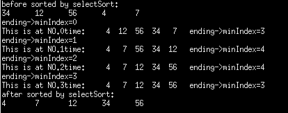

# 程序员成为极客之路

## 一、编程语言

### 2.1 编译语言

#### 1 [Java](./Java)

##### （1）三方网址

##### （2）博客

1. [idea集成Docker实现SpringBoot微服务镜像打包一键部署](.%2FJava%2Fidea%E9%9B%86%E6%88%90Docker%E5%AE%9E%E7%8E%B0SpringBoot%E5%BE%AE%E6%9C%8D%E5%8A%A1%E9%95%9C%E5%83%8F%E6%89%93%E5%8C%85%E4%B8%80%E9%94%AE%E9%83%A8%E7%BD%B2.MD)
2. [java垃圾回收机制](.%2FJava%2Fjava%E5%9E%83%E5%9C%BE%E5%9B%9E%E6%94%B6%E6%9C%BA%E5%88%B6.md)
3. [java类加载机制](.%2FJava%2Fjava%E7%B1%BB%E5%8A%A0%E8%BD%BD%E6%9C%BA%E5%88%B6.md)
4. [java类加载机制](./Java/java类加载机制.md)
5. [Java如何优雅的写代码](./Java/Java如何优雅的写代码.md)
6. [java中的静态代码块、构造代码块以及构造函数的初始化顺序](./Java/java中的静态代码块、构造代码块以及构造函数的初始化顺序.md)
7. [Java中arraylist.remove提示索引越界异常](./Java/Java中arraylist.remove提示索引越界异常.md)
8. [JVM垃圾收集时的并发可达性分析](./Java/JVM垃圾收集时的并发可达性分析.md)
9. [jvm虚拟机性能监控与故障处理工具](./Java/jvm虚拟机性能监控与故障处理工具.md)
10. [springboot+mybatis读写分离](./Java/springboot+mybatis读写分离.md)
11. [springBoot操作redis](./Java/springBoot操作redis.md)

#### 2 [Golang](./Go)

##### （1）三方网址

1. [GoLang技术栈](https://www.golang-tech-stack.com/)
2. [Golang 入门到精通教程](https://geekr.dev/golang-tutorial)
3. [Golang标准库文档](https://studygolang.com/pkgdoc)
4. [《深入解析Go》](https://books.studygolang.com/go-internals/)
5. [《Go 编程基础》|github](https://github.com/unknwon/go-fundamental-programming)
6. [《Go 语言设计与实现》](https://draveness.me/golang/)

##### （2）博客

1. [go引入三方包](./Go/go引入三方包.md)
2. [go语言特征](./Go/go语言特征.md)
3. [Go语言学习笔记.md](./Go/Go语言学习笔记.md)
4. [GO语言中的闭包.md](./Go/GO语言中的闭包.md)

### 2.2 脚本语言

#### 1 [PHP](./php)

1. [cgi、php-cgi、fast-cgi、php-fpm的优缺点以及区别？](./php/cgi、php-cgi、fast-cgi、php-fpm的优缺点以及区别？.md)
2. [opcache工作原理](./php/opcache工作原理.md)
3. [new self和new static的区别](./php/new%20self%E5%92%8Cnew%20static%E7%9A%84%E5%8C%BA%E5%88%AB.md)

#### 2 shell

#### 3 python

#### 4 lua

#### 5 JavaScript

## 三、中间件

### 3.1 [消息队列](./middleware/messageQueue)

#### 1 kafka

### 3.2 全文检索

#### 1 [ElasticSearch](./middleware/elasticsearch)

## 四、云原生

### 4.1 [docker](./docker)

### 4.2 [kubernetes](./kubernestes)

## 五、计算机基础

### 5.1 [计算机网络](./network)

1. [在浏览器地址栏输入一个URL后回车，背后会进行哪些技术步骤](./network/%E5%9C%A8%E6%B5%8F%E8%A7%88%E5%99%A8%E5%9C%B0%E5%9D%80%E6%A0%8F%E8%BE%93%E5%85%A5%E4%B8%80%E4%B8%AAURL%E5%90%8E%E5%9B%9E%E8%BD%A6%EF%BC%8C%E8%83%8C%E5%90%8E%E4%BC%9A%E8%BF%9B%E8%A1%8C%E5%93%AA%E4%BA%9B%E6%8A%80%E6%9C%AF%E6%AD%A5%E9%AA%A4.md)
2. [字节一面：TCP 三次握手，问的好细！](./network%2F%E5%AD%97%E8%8A%82%E4%B8%80%E9%9D%A2%EF%BC%9ATCP%20%E4%B8%89%E6%AC%A1%E6%8F%A1%E6%89%8B%EF%BC%8C%E9%97%AE%E7%9A%84%E5%A5%BD%E7%BB%86%EF%BC%81.md) | [reference](https://mp.weixin.qq.com/s?__biz=MzUxODAzNDg4NQ==&mid=2247521478&idx=1&sn=66528a27aa3556b40f4a0ad64a43045f&chksm=f98dd06ccefa597aed91d1cfc8234f0b65123c141e4b7f7246e387735b0594879a623f4e085e&scene=21&key=97d114acb76dd546d4ff231544e299e852b96658e939e38083d848d06ade5e704751d3da6f42009c3df15e2e92b1ca8c0e71293a0944a2d6a6f957a4f1ded6dcb4f3cba8cf744624f1189c6af2aa1daba528e11577b1a3d5d2e278951335e0283261c823d8580215a2e9605d3bbc3a72eee267e8284428251c7a8cd60234788c&ascene=7&uin=MTc4MzkyNDIyNA%3D%3D&devicetype=Windows+10+x64&version=63080014&lang=zh_CN&session_us=gh_fc46cf2353fc&exportkey=n_ChQIAhIQTrymq28Os5ptwK79m8qeuBLvAQIE97dBBAEAAAAAAO47KqUijqYAAAAOpnltbLcz9gKNyK89dVj02v34X1W0F4sQnjXWmBZZ0a4QBgA002NDVtNyLfYOXRsbYiX%2FBi7G1Uu0Oa8e1gIwvF5EIyHKMMfa9fsdyAfIPJ43cTamfxW0l49XkkUPLcx23BghHYTSnq5i3tOUEka%2Bdr888ENXZi9DfEgE23SmONthJAToElFbRtfrZQEcog2ZAaSWC0B9bkZ%2BczfNxHxmolmAhL9CEnSg03KlxziNrXpCs8gmHAclxa18lZCuwIGKCwSR1Fu18KVzBmGMJcY%2FuOmatB40OKOr&acctmode=0&pass_ticket=yOpJo0zYyJqrfgC4VkReOlPqL01cwvktXKCQYX35jC%2BGDXUbRhJFE5c7yOXcKxIz&wx_header=0&fontgear=2)
3. [TCP 重传、滑动窗口、流量控制、拥塞控好难？看完图解就不愁了](./network%2FTCP%20%E9%87%8D%E4%BC%A0%E3%80%81%E6%BB%91%E5%8A%A8%E7%AA%97%E5%8F%A3%E3%80%81%E6%B5%81%E9%87%8F%E6%8E%A7%E5%88%B6%E3%80%81%E6%8B%A5%E5%A1%9E%E6%8E%A7%E5%A5%BD%E9%9A%BE%EF%BC%9F%E7%9C%8B%E5%AE%8C%E5%9B%BE%E8%A7%A3%E5%B0%B1%E4%B8%8D%E6%84%81%E4%BA%86.md) | [reference](https://mp.weixin.qq.com/s/toQUgqJHeUbFZMtxfzFCxw)
4. [美团二面：TCP 四次挥手，可以变成三次吗？](./network%2F%E7%BE%8E%E5%9B%A2%E4%BA%8C%E9%9D%A2%EF%BC%9ATCP%20%E5%9B%9B%E6%AC%A1%E6%8C%A5%E6%89%8B%EF%BC%8C%E5%8F%AF%E4%BB%A5%E5%8F%98%E6%88%90%E4%B8%89%E6%AC%A1%E5%90%97%EF%BC%9F.md) | [reference](https://mp.weixin.qq.com/s/JUt-N0VxF_lXACFr6WJN8w)
5. [硬不硬你说了算！近 40 张图解被问千百遍的 TCP 三次握手和四次挥手面试题](./network%2F%E7%A1%AC%E4%B8%8D%E7%A1%AC%E4%BD%A0%E8%AF%B4%E4%BA%86%E7%AE%97%EF%BC%81%E8%BF%91%2040%20%E5%BC%A0%E5%9B%BE%E8%A7%A3%E8%A2%AB%E9%97%AE%E5%8D%83%E7%99%BE%E9%81%8D%E7%9A%84%20TCP%20%E4%B8%89%E6%AC%A1%E6%8F%A1%E6%89%8B%E5%92%8C%E5%9B%9B%E6%AC%A1%E6%8C%A5%E6%89%8B%E9%9D%A2%E8%AF%95%E9%A2%98.md) | [reference](https://mp.weixin.qq.com/s/tH8RFmjrveOmgLvk9hmrkw)
6. [告别 TCP！](./network%2F%E5%91%8A%E5%88%AB%20TCP%EF%BC%81.md) | [reference](https://mp.weixin.qq.com/s/3rM_RlwejkMFWm0GdwK6Hg)
7. [TCPIP协议中的三次握手和四次挥手](./network/TCPIP%E5%8D%8F%E8%AE%AE%E4%B8%AD%E7%9A%84%E4%B8%89%E6%AC%A1%E6%8F%A1%E6%89%8B%E5%92%8C%E5%9B%9B%E6%AC%A1%E6%8C%A5%E6%89%8B.md)
8. [字节一面：服务端挂了，客户端的 TCP 连接还在吗？](./network%2F%E5%AD%97%E8%8A%82%E4%B8%80%E9%9D%A2%EF%BC%9A%E6%9C%8D%E5%8A%A1%E7%AB%AF%E6%8C%82%E4%BA%86%EF%BC%8C%E5%AE%A2%E6%88%B7%E7%AB%AF%E7%9A%84%20TCP%20%E8%BF%9E%E6%8E%A5%E8%BF%98%E5%9C%A8%E5%90%97%EF%BC%9F.md) | [reference](https://mp.weixin.qq.com/s?__biz=MzUxODAzNDg4NQ==&mid=2247520003&idx=1&sn=3e70c6b54007ffa3130c5956df232bdb&chksm=f98dcba9cefa42bfbf35fd5f867314d8c96c54f5b285db542be42fc0594706d1429eaa069165&scene=21#wechat_redirect)
9. [拔掉网线后， 原本的 TCP 连接还存在吗？](./network%2F%E6%8B%94%E6%8E%89%E7%BD%91%E7%BA%BF%E5%90%8E%EF%BC%8C%20%E5%8E%9F%E6%9C%AC%E7%9A%84%20TCP%20%E8%BF%9E%E6%8E%A5%E8%BF%98%E5%AD%98%E5%9C%A8%E5%90%97%EF%BC%9F.md)  | [reference](https://mp.weixin.qq.com/s?__biz=MzUxODAzNDg4NQ==&mid=2247504270&idx=1&sn=bce7d1e81a33c214ed210d12ee3a6b68&scene=21#wechat_redirect)

#### 5.1.1 七层协议

#### 5.1.2 五层协议

### 5.2 操作系统

#### 1 内存管理

##### （1）虚拟内存

#### 2 进程与线程

##### （1）进程与线程基础

##### （2）进程间通信

##### （3）多线程同步

##### （4）死锁

##### （5）悲观锁和乐观锁

#### 3 调度算法

##### （1）进程调度算法

##### （2）页面置换算法

##### （3）磁盘调度算法

### 5.3 数据库

#### 1 [MySQL](./MySQL)

1. [MySQL查询原理](./MySQL/MySQL查询原理.md)
2. [MySQL索引原理](./MySQL/MySQL索引原理.md)
3. [MySQL修改大数据表结构时的风险与解决办法](./MySQL/MySQL修改大数据表结构时的风险与解决办法.md)
4. [MySQL中truncate和delete删除数据的区别](./MySQL/MySQL中truncate和delete删除数据的区别.md)
5. [MySQL最左匹配原则](./MySQL/MySQL最左匹配原则.md)
6. [update table set a = a+ 1 where id = 1是否存在线程安全问题](./MySQL/update%20table%20set%20a%20%3D%20a%2B%201%20where%20id%20%3D%201是否存在线程安全问题.md)
7. [MySQL 是怎么加行级锁的？](.%2FMySQL%2FMySQL%20%E6%98%AF%E6%80%8E%E4%B9%88%E5%8A%A0%E8%A1%8C%E7%BA%A7%E9%94%81%E7%9A%84%EF%BC%9F.md)（为什么使用`select * form table ... for update`d的查询条件不走索引会所全表） | [reference](https://mp.weixin.qq.com/s/Ef73pSWb_k6yiTTlNCrEjg)
8. [mysql幻读](./MySQL/mysql幻.md) |[reference](https://mp.weixin.qq.com/s?__biz=MzUxODAzNDg4NQ==&mid=2247520893&idx=1&sn=7152fa58a1d03b48cfe8ef00e90aa2ea&chksm=f98dd6d7cefa5fc13877a1c99dcb06d03f51cbbc9afee75d0cd87f4847566746fcced9948e54&scene=21#wechat_redirect)
9. [美团二面：考我幻读，结果答的不好](./MySQL/美团二面：考我幻读，结果答的不好) | [reference](https://mp.weixin.qq.com/s?__biz=MzUxODAzNDg4NQ==&mid=2247520075&idx=1&sn=3119bcb4f3c2dde7dfa2070f26816eed&chksm=f98dcbe1cefa42f76d1d944898ad1ed12ac645aa41fbc03405e33970eb62e3b2b73ca1de858b&scene=21&key=c7cacdfa2c0e8a2c8da558ec2d4f4c79055bb9a8a62280d247de763ce7b864c9141393abfb9d7cc5ded9736d73010add6e9c83f4c2c74569e4b9ad36167a95262550cbab43fdeb1174caad38681430a9eca4fb6fc4e4efff7d3ccd15f650461c0181486f9c3e2533da80b041c2f1a5ad19e2489f8c0483d8fa64d8f0d28badb4&ascene=1&uin=MTc4MzkyNDIyNA%3D%3D&devicetype=Windows+10+x64&version=63080014&lang=zh_CN&exportkey=n_ChQIAhIQ7eodp%2FOPONIwokDZhnlEkhLqAQIE97dBBAEAAAAAABYlOKHmNQMAAAAOpnltbLcz9gKNyK89dVj0ufWmzo0aqJHfq%2FBVxo5SoDoTNilgEfAiKknnjplGl44VKcqgbUtJNL0SyUcj5ezryDeqys%2B1%2FYkNmAa5XMbmZWU%2FV1cuZXb85xptMLhxoOufwJSXwiSj19SP%2Fn4Gs920AO7YJrfLMyiQ5W22MZcpk6WC0HA4hnW0nTH6a7gOyrifxm3IgkrPneeK0C2RuXHnJ5oIkx5GJ51ShOZq0ClNhtiNKKP9RfDHjj5HdD2rnCqWudC4RzHs5slZlCs2Gjlv9wWbsQ%3D%3D&acctmode=0&pass_ticket=yOpJo0zYyJqrfgC4VkReOlPqL01cwvktXKCQYX35jC88CGFdUDKJ9uP6KzbWur4x&wx_header=0&fontgear=2)

#### 2 [Redis](./redis)

1. [如何用redis实现分布式锁](./redis/%E5%A6%82%E4%BD%95%E7%94%A8redis%E5%AE%9E%E7%8E%B0%E5%88%86%E5%B8%83%E5%BC%8F%E9%94%81.md)

### 5.4 Linux

#### 1 查日志

#### 2 awk | ansible | sed

#### 3 搭建代码托管平台 | [gitlab](./gitlab&cicd)

## 六、监控

### 6.1 [Prometheus](./prometheus)

### 6.2 Grfana

## 七、[分布式](./distributed)

1. [分布式事务如何保证数据的一致性](./distributed/分布式事务如何保证数据的一致性.md)
2. [如何设计幂等](./distributed/如何设计幂等.md)
3. [分布式的设计与实现](./distributed/分布式的设计与实现.md)

## 八、[数据结构&算法](./dataStructures&Algorithms)

### 8.1 算法

#### 1 动态规划

#### 2 回溯算法

#### 3 查找算法

#### 4 搜索算法

#### 5 贪心算法

#### 6 分治算法

#### 7 位运算

#### 8 双指针

#### 9 排序算法

##### （1）快速排序

##### （2）冒泡排序

###### [1] 思想

冒泡排序就是通过对比前一个和后一个数的大小，按照规则进行顺序的调换。每一轮对比之后最大或者最小值都会浮到最上面或者沉到最低下。

如：对这一数组进行冒泡排序：int a[5]{34,12,56,4,7}; 假设为从小到大排序

一共需要比较length-1轮：

第一轮： a.34和12比较，12比34小，那么调换位置，此时为：12,34,56,4,7，然后在对该序列进行排序

　　　　 b.然后就是34和56进行对比，34比56小，不用调换顺序，此时依旧为：12,34,56,4,7，然后在对该序列进行排序

　　　　 c.然后再就是56和4鸡西宁对比，4比56小，所以将56和4调换顺序，此时序列就是：12,34,4,56,7

　　　　 d.再然后就对比56和7，7比56小，所以将二者位置进行调换，此时完成第一轮调换，序列为：12,34,4,7,56

　　　　我们可以看到第一轮排序之后，已经将序列中的最大值沉到最底部了。

第二轮：此时的排序此时交第一轮要减1，

　　　　 a.先是12和34对比，前者比后者小，所以不用调换位置，序列时：12,34,4,7,56

　　　　 b.然后比较34和4的大小，后者比前者小，所以调换位置，此时序列为：12,4,34,7,56

　　　　 c.再然后比较34和7的大小，后者比前者小，所以调换位置，此时序列为：12,4,7,34,56

　　　　 d.此时就不用在往下比较了，因为比较次数已经减1了，也是因为第一轮中已经将最大的数选出来了。

然后就是第三轮和第四轮的比较，方法类似。

最终结果就是4,7,12,34,56

我们可以看到程序截图如下图所示：


###### [2] 代码实现

```go
package sort

// BubbleSort 冒泡排序
func BubbleSort(array []int) []int {
	length := len(array)
	if length == 0 || length == 1 {
		return []int{}
	}

	for i := 0; i < length; i++ {
		for j := i + 1; j < length; j++ {
			if array[i] > array[j] {
				array[i], array[j] = array[j], array[i]
			}
		}
	}

	return array
}
```

##### （3）选择排序

###### [1] 思路

选择排序的实现要比冒泡排序简单一些，但是在代码上相对会有些绕。原理就是先假设待排序的序列中的第一个数为最小值或者最大值，这里还是用从小到大的顺序进行排序。首先假设第一个数为最小值（假设该值的索引下标时i），然后从该值的下一个数也就是索引为i+1的数开始进行比较，如果i+1的值要比假设的最小值小，那么就将二者的值进行交换，每一轮将最小值选择出来，并将其与假设的最小值进行调换就行，不需要想冒泡排序那样整个需略都要跟着一起移动。此时还需要一个缓冲变量来存放最小值的索引值。

详细讲解：

在时间复杂度上，这两种排序方法都是一样，O(N^2)，也是需要循环执行length-1轮。还是假设对数组a进行排序。

首先定义数组：int a[5]{34,12,56,4,7};

第一轮：先假设序列中的第一个数是最小值，记录下它的索引值，定一个新的变量用来存放该索引值，minIndex=0，下表为0也就是第一个数。然后在进行循环。

　　　　 a.内循环中的第一轮是34和12进行比较，后者比前者小，所以将minIndex的索引值进行更改，此时minIndex=1,

　　　　 b.内循环中的第二轮，是利用minIndex 中的数和下一个待比较的数进行比较，应该是12和56比较，后者比前者小，所以不用修改minIndex的值

　　　　 c.内循环中的第三轮，还是利用索引为1的数值和下一个待比较的数进行比较，应该是12和4进行比较，后者较之前者较小，所以记录下当前数的索引值并赋值给minIndex，此时minIndex=3

　　　　 d.内循环中的第四轮，利用minIndex索引值的数值和下一个待比较的数进行比较，应该是4和7进行比较，后者比前者大，所以不用修改minIndex的值

　　　　然后将序列中的第i个数和序列中索引值为minIndex的数进行调换，第一轮已将最小值选择出来了。此时序列为：4,12,56,34,7

　　　　第一轮外循环之后，minIndex=3,下一轮外循环会将这个值直接覆盖

第二轮：此时的minIndex=1，假设的最小值是12

　　　　　此时定义上一轮外循环的下一个数为最小值，也即是索引值为1的值，那么本轮循环将从索引值为2的数开始比较，

　　　　 a.内循环中的第一轮，比较12和56,后者比前者大，所以不用修改minIndex的值，

　　　　 b.内循环中的第二轮，此时比较12和34的大小，还是依旧不用修改索引值

　　　　 c.内循环中的第三轮，此时比较12和7的大小，后者比前者小，索引记录下当前数的索引值并赋值给minIndex记录下来

　　　　内循环结束，判断minIndex的值是否被改变，如果被改变了，那么就将下标为i的数和下标为minIndex的数进行交换。此时序列为：4,7,56,34,12且minIndex=4

第三轮和第四轮外循环的规则类似。。

我们可以看程序运行的效果图如下：



###### [2] 代码实现

```go
// SelectSort 选择排序
func SelectSort(array []int) []int {
	length := len(array)
	if length == 0 || length == 1 {
		return []int{}
	}

	for i := 0; i < length-1; i++ {
		minIndex := i
		for j := i + 1; j < length; j++ {
			if array[j] < array[minIndex] {
				minIndex = j
			}
		}

		if minIndex != i {
			array[i], array[minIndex] = array[minIndex], array[i]
		}
	}

	return array
}
```

##### （4）堆排序

##### （5）插入排序

##### （6）归并排序

###### [1] 思路

归并排序的中心思想是分治法（Divide and Conquer）。它将一个大的问题分解成许多小的子问题，然后递归地解决这些子问题，最后将子问题的解合并成整个问题的解。

具体来说，归并排序的中心思想可以概括为以下几个步骤：

1. 分解：将原始数组划分为若干个子数组，直到每个子数组都只包含一个元素（认为单个元素是已经排序好的）。
2. 解决：对每个子数组进行排序。可以通过递归地调用归并排序函数来解决每个子问题，直到子数组只有一个元素。
3. 合并：将排序好的子数组合并成一个大的有序数组。这个过程中，将两个有序的子数组合并成一个有序数组的操作被称为“归并”。

整个归并排序过程通过递归的方式将原始数组分解为越来越小的子数组，然后再通过归并操作将这些子数组逐步合并成一个排序好的数组。由于归并操作是建立在两个已排序的子数组的基础上，所以这个步骤相对简单而高效。

归并排序的时间复杂度为 O(n log n)，其中 n 是数组的长度。它是一种稳定的排序算法，适用于对大规模数据进行排序。由于它的分治思想，归并排序也可以很方便地应用于并行计算，提高排序的效率。

###### [2] 代码实现

```go
func MergeSort(array []int) []int {
	length := len(array)
	if length <= 1 {
		return array
	}

	left := MergeSort(array[:length/2])
	right := MergeSort(array[length/2:])

	return merge(left, right)
}

func merge(left []int, right []int) []int {
	if len(left) == 0 {
		return right
	}

	if len(right) == 0 {
		return left
	}

	l := 0
	r := 0
	result := make([]int, 0)
	for l < len(left) && r < len(right) {
		if left[l] < right[r] {
			result = append(result, left[l])
			l++
		} else {
			result = append(result, right[r])
			r++
		}
	}

	if l < len(left) {
		result = append(result, left[l:]...)
	}
	if r < len(right) {
		result = append(result, right[r:]...)
	}

	return result
}
```

##### （7）计数排序

##### （8）桶排序

##### （9）基数排序

##### （10）希尔排序

### 8.2 数据结构

#### 1 数组

#### 2 栈

#### 3 队列

#### 4 字符串

#### 5 链表

#### 6 树

#### 7 图

#### 8 堆

#### 9 哈希表
