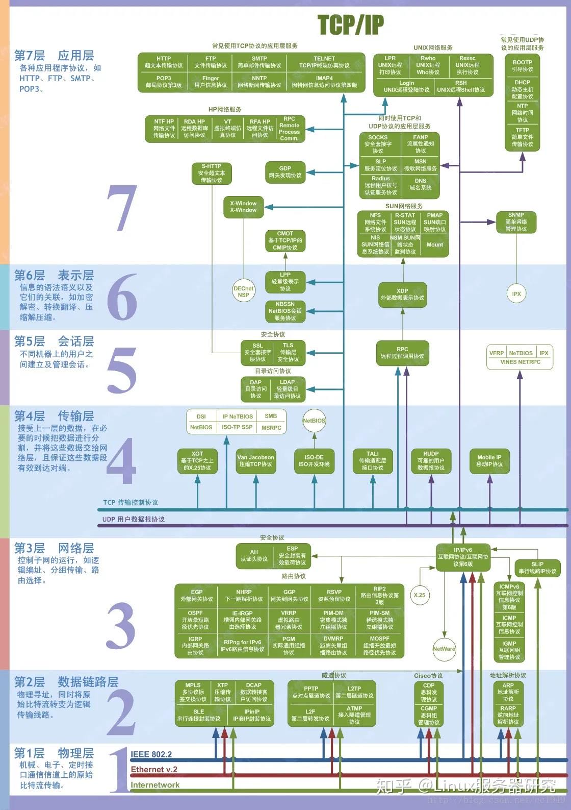

# 程序员称为极客之路

## 一、数据库

### 1.1 MySQL

### 1.2 Redis

### 1.3 ElasticSearch

## 二、编程语言

### 2.1 编译语言

#### （1）Java

#### （2）Golang

### 2.2 脚本语言

#### （1）PHP

#### （2）shell

#### （3）python

#### （4）lua

#### （5）JavaScript

## 三、中间件

### 3.1 消息队列

## 四、云

### 4.1 docker

### 4.2 kubernetes

## 五、计算机网络

#### 5.1 七层协议

#### 5.2 五层协议

## 六、Linux

### 6.1 ansible

### 6.2 awk

### 6.3 sed

### 6.4 gitlab

## 七、数据统计

### 7.1 Prometheus

### 7.2 Grfana

