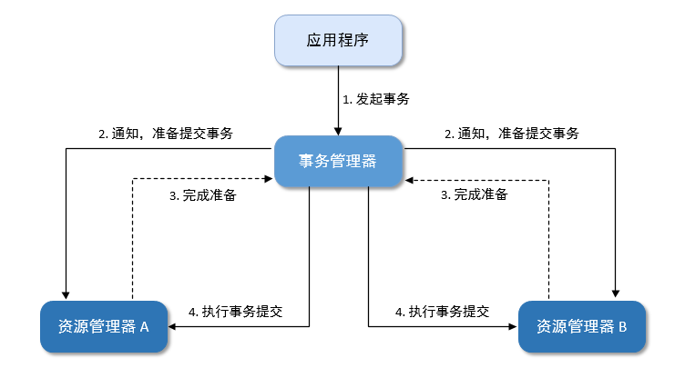
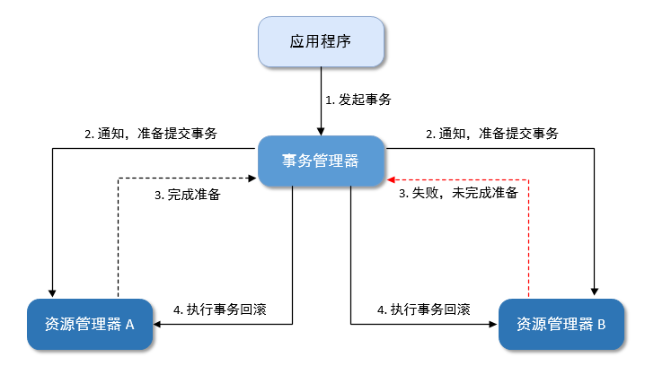

# 分布式事务如何保证数据的一致性

## 1 事务概念

一个事务应该具备**备原子性、一致性、隔离性和持久性**，简称 ACID

- 原子性（Atomicity），可以理解为一个事务内的所有操作要么都执行，要么都不执行。
- 一致性（Consistency），可以理解为数据是满足完整性约束的，也就是不会存在中间状态的数据，比如你账上有400，我账上有100，你给我打200块，此时你账上的钱应该是200，我账上的钱应该是300，不会存在我账上钱加了，你账上钱没扣的**中间状态**。
- 隔离性（Isolation），指的是多个事务并发执行的时候不会互相干扰，即一个事务内部的数据对于其他事务来说是隔离的。
- 持久性（Durability），指的是一个事务完成了之后数据就被永远保存下来，之后的其他操作或故障都不会对事务的结果产生影响。

## 2 解决方案

### 2.1 阻塞式重试；

### 2.2 2PC、3PC 传统事务；

#### （1）2PC

二阶段提交协议（Two-phase Commit Protocol，简称 2PC）是分布式事务的核心协议。在此协议中，一个事务管理器（Transaction Manager，简称 TM）协调 1 个或多个资源管理器（Resource Manager，简称 RM）的活动，所有资源管理器向事务管理器汇报自身活动状态，由事务管理器根据各资源管理器汇报的状态（完成准备或准备失败）来决定各资源管理器是“提交”事务还是进行“回滚”操作。

二阶段提交的具体流程如下：

1. 应用程序向事务管理器提交请求，发起分布式事务；
2. 在第一阶段，事务管理器联络所有资源管理器，通知它们准备提交事务；
3. 各资源管理器返回完成准备（或准备失败）的消息给事务管理器（响应超时算作失败）；
4. 在第二阶段：
   - 如果所有资源管理器均完成准备（如图 1），则事务管理器会通知所有资源管理器执行事务提交；
   - 如果任一资源管理器准备失败（如图 2 中的资源管理器 B），则事务管理器会通知所有资源管理器进行事务回滚。

图1：**所有资源管理器完成准备，事务管理器协调各资源管理器提交事务**

图2：**任一资源管理器准备失败，事务管理器协调各资源管理器回滚事务**

> 如果第二阶段提交失败怎么办？
>
> 第一种是**第二阶段执行的是回滚事务操作**，那么答案是不断重试，直到所有资源管理器都回滚了，不然那些在第一阶段准备成功的参与者会一直阻塞着。
>
> 第二种是**第二阶段执行的是提交事务操作**，那么答案也是不断重试，因为有可能一些参与者的事务已经提交成功了，这个时候只有一条路，就是头铁往前冲，不断的重试，直到提交成功，到最后真的不行只能人工介入处理。

#### （2）3PC

### 2.3 使用队列，后台异步处理；

在当前服务将数据写入 DB 后，推送一条消息给 MQ，由独立的服务去消费 MQ 处理业务逻辑。和阻塞式重试相比，虽然 MQ 在稳定性上远高于普通的业务服务，但在推送消息到 MQ 中的调用，还是会有失败的可能性，比如网络问题、当前服务宕机等。这样还是会遇到阻塞式重试相同的问题，即 DB 写入成功了，但推送失败了。

理论上来讲，分布式系统下，涉及多个服务调用的代码都存在这样的情况，在长期运行中，调用失败的情况一定会出现。这也是分布式系统设计的难点之一。

### 2.4 TCC 补偿事务；

### 2.5 本地消息表（异步确保）；

### 2.6 MQ 事务。

## Reference

1. [分布式事务的 6 种解决方案，写得非常好！](https://cloud.tencent.com/developer/article/1846159)
2. [分布式事务六种解决方案](https://zhuanlan.zhihu.com/p/183753774)
3. [分布式事务中的二阶段提交是什么？](https://help.aliyun.com/document_detail/132896.html)
4. [利用消息队列处理分布式事务](https://cloud.tencent.com/developer/article/1843911)
5. [分布式事务之TCC事务模型](https://cloud.tencent.com/developer/article/1844341)