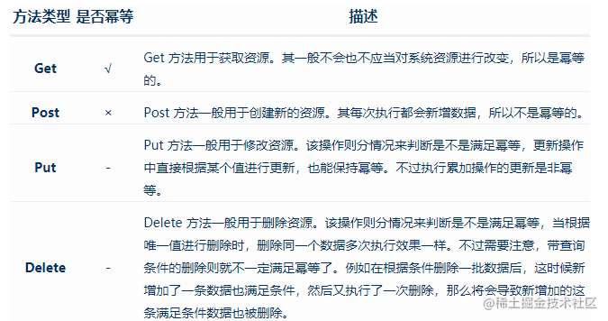
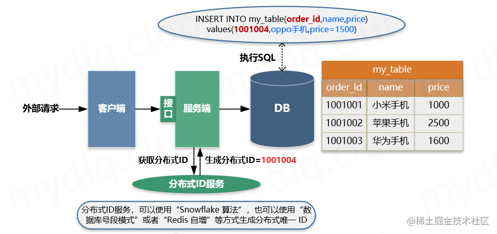
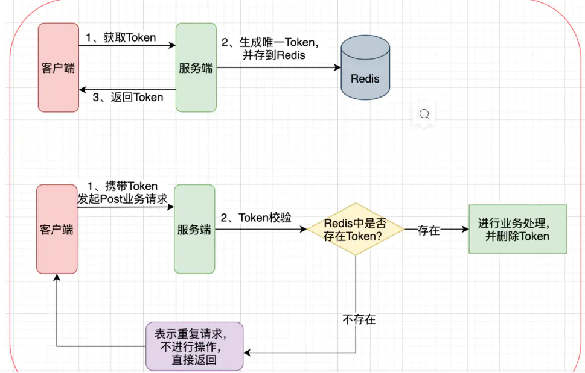
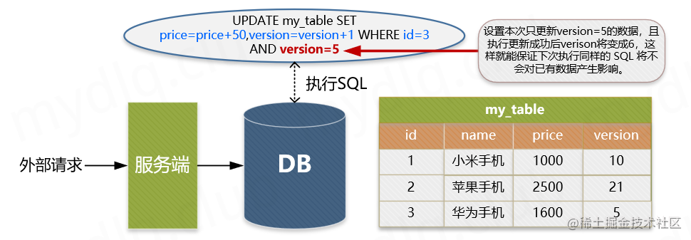
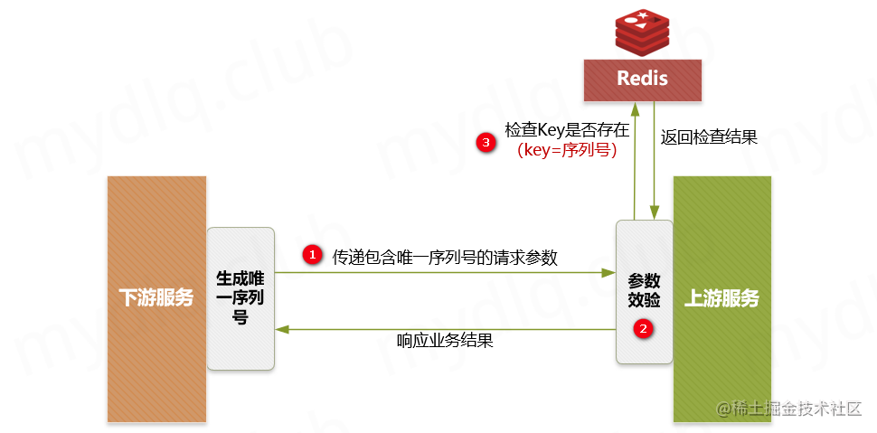

# 幂等

## 一、理论

### 1.1 什么是幂等

在编程中，一个幂等操作的特点是其任意多次执行所产生的影响均与一次执行的影响相同，用数学语言表达就是`f(x)=f(f(x))`。幂等函数或幂等方法是指可以使用相同参数重复执行，并能获得相同结果的函数 / 方法。这些函数 / 方法不会影响系统状态，因此不用担心重复执行会对系统造成改变。例如：

1. 前端重复提交选中的数据，后台也只会产生对应数据的一个反应结果。
2. 用户发起一笔付款请求，就应该只扣用户一次钱，即使遇到网络重发或系统 bug 重发请求，也应该只扣一次钱。
3. 发送验证短息也应该只发一次，同样的验证短信不应该发送多次。
4. 创建业务订单，一个业务请求只能创建一个业务订单，创建多个就会出大问题。
4. 等...

简单来理解就是，幂等就是一个操作，这个操作不管执行多少次，产生的效果和返回的结果都是一样的。比如说有一个 getOne () 函数，无论执行这个函数多少次，它返回的都是 1，这时就可以说它是一个幂等函数，或者说该该函数支持幂等。

> 幂等性接口：是指可以使用相同参数重复执行，并能获得相同结果的接口。

### 1.2 幂等和防重的区别

- 防重设计主要为了避免产生重复数据，对接口返回没有太多要求。
- 而幂等设计除了避免产生重复数据之外，还要求每次请求都返回一样的结果。

### 1.3 产生幂等问题的常见场景

#### （1） 前端重复提交

用户注册，用户创建商品等操作，前端都会提交一些数据给后台服务，后台需要根据用户提交的数据在数据库中创建记录。如果用户不小心多点了几次，后端收到了好几次提交，这时就会在数据库中重复创建了多条记录。这就是接口没有幂等性带来的 bug。

这种情况可以使用如下方式避免：

##### 1）按钮只能点击一次

这是前端保证幂等性的一种方法，用户点击按钮后将按钮置灰，或者显示loading状态。

##### 2）RPG模式

这也是前端保证幂等性的一种方法，即`Post-Redirect-Get`，当客户提交表单后，去执行一个客户端的重定向，转到提交成功页面。避免用户按F5刷新致使的重复提交，也能消除按浏览器后退键导致的重复提交问题。目前绝大多数公司都是这样作的，好比淘宝，京东等。

##### 3）token机制

在提交表单请求之前，先向服务端请求获取本次操作的`token`，在提交表单时，将该`token`一起传给服务端，服务端根据该`token`判断是否是重复请求。详请见下文。

#### （2） 接口超时重试

对于给第三方调用的接口，有可能会因为网络原因而调用失败，这时，一般在设计的时候会对接口调用加上失败重试的机制。如果第一次调用已经执行了一半时，发生了网络异常。这时再次调用时就会因为脏数据的存在而出现调用异常。

#### （3） 消息重复消费

在使用消息中间件来处理消息队列，且手动 ack 确认消息被正常消费时。如果消费者突然断开连接，那么已经执行了一半的消息会重新放回队列。当消息被其他消费者重新消费时，如果没有幂等性，就会导致消息重复消费时结果异常，如数据库重复数据，数据库数据冲突，资源重复等。

#### （4） 高并发场景

高并发也是产生接口幂等性问题的重要原因，平时也是我们开发中容易忽略的方面。一般来说，重要、核心接口我们都需要通过压测来检测接口的幂等性。

#### （5）**用户恶意进行刷单**

例如在实现用户投票这种功能时，如果用户针对一个用户进行重复提交投票，这样会导致接口接收到用户重复提交的投票信息，这样会使投票结果与事实严重不符。

### 1.4 引入幂等性后对系统有什么影响

幂等性是为了简化客户端的逻辑处理，接口支持重复提交等操作，但却增加了服务端的逻辑复杂性和成本，其主要是：

1. 把并行执行的功能改为串行执行，降低了执行效率。
2. 增加了额外控制幂等的业务逻辑，复杂化了业务功能；

所以在使用时候需要考虑是否引入幂等性的必要性，根据实际业务场景具体分析，除了业务上的特殊要求外，一般情况下不需要引入的接口幂等性。

### 1.5 Restful API 接口幂等性如何

现在流行的 Restful 推荐的几种 HTTP 接口方法中，分别存在幂等行与不能保证幂等的方法，如下：

1. `√ `满足幂等
2. `x` 不满足幂等
3. `-` 可能满足也可能不满足幂等，根据实际业务逻辑有关

#### （1）查询操作 | GET

查询一次和查询多次，在数据不变的情况下，查询结果都是一样的，select 是天然的幂等操作。

> **注意：**
>
> 1. **如果上一次查询返回的结果和下一次查询返回的结果不一致，这种也是幂等的，因为在两次查询动作之间数据增加了，这个数据增加的结果并不是查询这个动作导致的，所以两次查询结果不一致并不是违反幂等的特性。**

#### （2）删除操作 | DELETE

删除操作也是幂等的，删除一次和删除多次都是把数据删除。

分情况讨论：

1. 如果是根据数据的主键id删除数据，则删除一次和删除多次的结果都是一样的。第一次根据主键删除数据，数据存在删除成功，`sql`执行结果返回1，第二次之后再来根据**同样的主键id**删除数据，由于数据已经不存在，则`sql`执行结果的返回是0，也可以理解为幂等
2. 如果是带其他查询条件的删除操作，就不一定是幂等了，因为同一个查询条件可能匹配很多数据，如果新增的数据满足查询条件也会被删除

#### （3）新增操作 | POST

新增数据每次都会产生新的数据（导致系统状态发送改变），所以POST方法不是幂等的。

#### （4）修改操作 | PUT

修改数据需要分情况来讨论：

1. 如果更新操作直接根据某个值进行更新数据，则是幂等的
2. 如果是”累加“的更新操作，则不是幂等的。




### 1.5 实现幂等的技术方案

#### （1）数据库唯一索引

##### 1）适用操作

- 插入操作
- 删除操作

##### 2）主要流程

1. 客户端执行创建请求，调用服务端接口。
2. 服务端执行业务逻辑，生成一个分布式 `ID`，将`该ID` 充当待插入数据的主键，然后执数据插入操作，运行对应的 `SQL` 语句。
3. 服务端将该条数据插入数据库中，如果插入成功则表示没有重复调用接口。如果抛出主键重复异常，则表示数据库中已经存在该条记录，返回错误信息到客户端。




当表存在唯一索引，并发时新增重复记录就会报错，那么这时候就查询已存在的记录并返回即可。

```sql
alter table `order` add UNIQUE KEY `un_code` (`code`);
```

加了唯一索引之后，第一次请求数据可以插入成功。但后面的相同请求，插入数据时会报`Duplicate entry '002' for key 'order.un_code`异常，表示唯一索引有冲突。

虽说抛异常对数据来说没有影响，不会造成错误数据。但是为了保证接口幂等性，我们需要对该异常进行捕获，然后返回成功。如果是java程序需要捕获：`DuplicateKeyException`异常，如果使用了spring框架还需要捕获：`MySQLIntegrityConstraintViolationException`异常。

> **注意：**
>
> 1. **使用数据库唯一主键完成幂等性时需要注意的是，该主键一般来说并不是使用数据库中自增主键，而是使用分布式 ID 充当主键，这样才能能保证在分布式环境下 ID 的全局唯一性。**

#### （2）全局id或token机制（前后端同时处理）

##### 1）适用操作

- 插入操作
- 更新操作
- 删除操作

##### 2）主要流程

1. 服务端提供获取 `Token` 的接口，该 `Token` 可以是一个序列号，也可以是一个分布式 `ID` 或者 `UUID` 串。
2. 客户端调用接口获取 `Token`，这时候服务端会生成一个 `Token` 串。
3. 然后将该串存入 `Redis` 数据库中，以该 `Token` 作为 `Redis` 的`key`（注意设置过期时间）。
4. 将 `Token` 返回到客户端，客户端拿到后应存到表单隐藏域中。
5. 客户端在执行提交表单时，把 `Token` 存入到 `Headers` 中，执行业务请求带上该 `Headers`。
6. 服务端接收到请求后从 `Headers` 中拿到 `Token`，然后根据 `Token` 到 Redis `中`查找该 `key` 是否存在。
7. 服务端根据 `Redis` 中是否存该 `key` 进行判断，如果存在就将该 `key` 删除，然后正常执行业务逻辑。如果不存在就抛异常，返回重复提交的错误信息。

针对客户端连续点击或者调用方的超时重试等情况，例如提交订单，此种操作就可以用 `Token` 的机制实现防止重复提交。

简单的说就是调用方在调用接口的时候先向后端请求一个全局 `ID（Token）`，请求的时候携带这个全局 `ID` 一起请求（`Token` 最好将其放到 `Headers` 中），后端需要对这个 `Token` 作为 `Key`，用户信息作为 `Value` 到 `Redis` 中进行键值内容校验，如果 `Key` 存在且 `Value` 匹配就执行删除命令，然后正常执行后面的业务逻辑。如果不存在对应的 `Key` 或 `Value` 不匹配就返回重复执行的错误信息，这样来保证幂等操作。



页面数据只能够提交一次，但是由于出现重复点击或者网络重发或 `Nginx` 重发等情况导致数据被重复提交的情况下，可以采用 `Token`+`Redis`（`Redis` 是单线程的，处理需要排队）的解决方案。处理的流程是，在数据提交前要向服务器申请带有有效时间的 `Token`，然后 `Token` 放到 `Redis` 或 `JVM` 内存中，当数据正式提交到后台要校验 `Token` 并删除 `Token`。

> **注意：**
>
> 1. **在进入提交表单页面之前，应该就把`Token`生成好，而不是用户每次点击提交表单按钮时再去生成`Token`，如果是用户每次点击提交表单再去生成`Token`，则起不到幂等防重的效果。**
> 2. **注意，在并发情况下，执行 Redis 查找数据与删除需要保证原子性，否则很可能在并发下无法保证幂等性。其实现方法可以使用分布式锁或者使用 `Lua` 表达式来注销查询与删除操作。**

#### （3）悲观锁

获取数据的时候加锁，使用`select ... for update`获取数据：

```sql
select * from table where id = 'xxx' for update;
```

> 注意：
>
> 1. 使用`select ... for update`获取数据时，`where`条件中的字段**必须是主键或者唯一索引**，否则会导致锁表（默认是锁行）
> 2. 悲观锁的使用一般伴随事务一起使用，数据锁定事件可能会很长，要根据实际情况慎用。
> 3. 如果使用的是`mysql`数据库，存储引擎必须用`innodb`，因为`innodb`才支持事务。

#### （4）乐观锁



乐观锁只是在更新数据的那一刻锁表，其他时间不锁表，所以相对于悲观锁效率更高。

乐观锁的实现方式多种多样，可以通过 version 或者其他状态条件。

##### 1）基于版本号实现乐观锁

1. 查询数据得到版本号。
2. 经过版本号去更新，版本号匹配则更新，版本号不匹配则不更新。
3. 适用操作：更新操作

```sql
-- 假如查询出的version为1
select version from table_name where userid = 10;

-- 给用户的帐户加10
update table_name set money = money -10, version = version + 1 where userid = 10 and version = 1
```

#### （5）分布式锁

还是拿插入数据的例子，如果是分布式系统，构建全局唯一索引比较困难，例如唯一性的字段无法确定。那么这时候就可以引入分布式锁，通过第三方的系统（`Redis` 或 `Zookeeper`），在业务系统插入数据或更新数据之前，获取分布式锁，然后做操作，之后再释放锁。这样其实是把多线程并发锁的思路引入了多个系统，也就是分布式系统中的解决思路。

要注意的是，某个长流程处理过程要求不能并发执行，可以在流程执行之前根据某个标志（用户 ID + 后缀等）获取分布式锁，其他流程执行时获取锁就会失败，也就是同一时间该流程只能有一个能执行成功，执行完成后，释放分布式锁（分布式锁需要第三方系统提供)）。

#### （6）select+insert | 高并发场景下，效率低

对于一些并发不高的后台系统，或者一些任务 Job，为了支持幂等，支持重复执行，简单的处理方法是先查询一下关键数据，判断是否已经执行过，然后再进行业务处理就可以了。**但是要注意的是核心高并发流程不要用这种方法，因为效率较低**。

#### （7）状态机幂等

若是业务上须要修改订单状态，例如订单状态有：1-下单、2-已支付、3-完成、4-撤销等状态。设计时最好只支持状态的单向改变。这样在更新的时候就能够加上条件，屡次调用也只会执行一次。例如想把订单状态更新为完成状态，则以前的状态必须为已支付。

```sql
update `order` set status=3 where id=123 and status=2;
```

第一次请求时，该订单的状态是已支付，值是2，所以该update语句可以正常更新数据，`sql`执行结果的影响行数是1，订单状态变成了3。

后面有相同的请求过来，再执行相同的`sql`时，由于订单状态变成了3，再用`status=2`作为条件，无法查询出需要更新的数据，所以最终`sql`执行结果的影响行数是0，即不会真正的更新数据。但为了保证接口幂等性，影响行数是0时，接口也可以直接返回成功。

> **注意：**
>
> 1. **订单等单据类业务，存在很长的状态流转，一定要深刻理解状态机，对业务系统设计能力提高有很大帮助。**

#### （8）防重表

增加一个防重表，将业务惟一的id做为该表惟一索引，如订单号，当想针对订单作一系列操做时，能够向防重表中插入一条记录，插入成功，执行后续操做，插入失败，则不执行后续操做。**本质上能够当作是基于MySQL实现的分布式锁**。根据业务场景决定执行成功后，是否删除防重表中对应的数据。

#### （9）下游传递唯一序列号如何实现幂等性

所谓**请求序列号**，其实就是每次向服务端请求时候附带一个短时间内唯一不重复的序列号，该序列号可以是一个**有序 `ID`**，也可以是一个**订单号**，一般由下游生成，在调用上游服务端接口时附加该序列号和用于认证的 `ID`。

当上游服务器收到请求信息后拿取该 **序列号** 和下游 **认证ID** 进行组合，形成用于操作 Redis 的 `Key`，然后到 Redis 中查询是否存在对应的 `Key` 的键值对，根据其结果：

1. **如果存在**，就说明已经对该下游的该序列号的请求进行了业务处理，这时可以直接响应重复请求的错误信息。
2. **如果不存在**，就以该 `Key` 作为 Redis 的键，以下游关键信息作为存储的值（例如下游商传递的一些业务逻辑信息），将该键值对存储到 Redis 中 ，然后再正常执行对应的业务逻辑即可。

##### 1）适用操作

- 插入操作
- 更新操作
- 删除操作

##### 2）主要流程

1. 下游服务生成分布式 `ID` 作为序列号，然后执行请求调用上游接口，并附带**唯一序列号**与请求的**认证凭据ID**。
2. 上游服务进行安全效验，检测下游传递的参数中是否存在**序列号**和**凭据ID**。
3. 上游服务到 Redis 中检测是否存在对应的**序列号**与**认证ID**组成的 `Key`，如果存在就抛出重复执行的异常信息，然后响应下游对应的错误信息。如果不存在就以该**序列号**和**认证ID**组合作为 `Key`，以下游关键信息作为 `Value`，进而存储到 Redis 中，然后正常执行接来来的业务逻辑。



> **注意：**
>
> 1. **插入到Redis中的数据，一定要设置过期时间。这样能保证在这个时间范围内，如果重复调用接口，则能够进行判断识别。如果不设置过期时间，很可能导致数据无限量的存入 Redis，导致 Redis 不能正常工作。**

### 总结：

幂等性是开发当中很常见也很重要的一个需求，尤其是**支付**、**订单**等与金钱挂钩的服务，保证接口幂等性尤其重要。在实际开发中，需要针对不同的业务场景我们需要灵活的选择幂等性的实现方式：

1. 对于下单等存在唯一主键的，可以使用“**唯一主键方案**”的方式实现。
2. 对于更新订单状态等相关的更新场景操作，使用“**乐观锁方案**”实现更为简单。
3. 对于上下游这种，下游请求上游，上游服务可以使用“**下游传递唯一序列号方案**”更为合理。
4. 类似于**前端重复提交**、**重复下单**、**没有唯一ID号**的场景，可以通过 `Token` 与 `Redis` 配合的“**防重 Token 方案**”实现更为快捷。

## 二、代码实现

### 2.1 token机制的Java实现

[github源码](./idempotentToken)

#### （1）maven依赖

```xml
<dependencies>
    <!--springboot web-->
    <dependency>
        <groupId>org.springframework.boot</groupId>
        <artifactId>spring-boot-starter-web</artifactId>
    </dependency>
    <!--springboot data redis-->
    <dependency>
        <groupId>org.springframework.boot</groupId>
        <artifactId>spring-boot-starter-data-redis</artifactId>
    </dependency>
    <dependency>
        <groupId>org.apache.commons</groupId>
        <artifactId>commons-pool2</artifactId>
    </dependency>
    <!--lombok-->
    <dependency>
        <groupId>org.projectlombok</groupId>
        <artifactId>lombok</artifactId>
    </dependency>
</dependencies>
```

#### （2）配置文件application.yml

```yml
spring:
  redis:
    ssl: false
    host: 127.0.0.1
    port: 6380
    database: 0
    timeout: 1000
    password:
    lettuce:
      pool:
        max-active: 100
        max-wait: -1
        max-idle: 20
        min-idle: 0
```

#### （3）验证token与创建token类

创建用于操作 Token 相关的 Service 类，里面存在 Token 创建与验证方法，其中：

1. `Token` 创建方法： 使用 `UUID` 工具创建 `Token` 串，设置以 `“idempotent_token:“+“Token串”` 作为 `Key`，以用户信息当成 `Value`，将信息存入 Redis 中。
2. `Token` 验证方法： 接收 Token 串参数，加上 Key 前缀形成 `Key`，再传入 `value` 值，执行 `Lua` 表达式（`Lua` 表达式能保证命令执行的原子性）进行查找对应 `Key` 与删除操作。执行完成后验证命令的返回结果，如果结果不为空且非0，则验证成功，否则失败。

`TokenUtilService.java`：

```java
package com.idempotent.token.service.util;

public interface TokenUtilService {

    String genToken(String value);

    Boolean validToken(String token, String value);
}
```

`TokenUtilServiceImpl.java`：

```Java
package com.idempotent.token.service.util.impl;

import com.idempotent.token.service.util.TokenUtilService;
import lombok.extern.slf4j.Slf4j;
import org.springframework.data.redis.core.RedisTemplate;
import org.springframework.data.redis.core.script.DefaultRedisScript;
import org.springframework.data.redis.core.script.RedisScript;
import org.springframework.stereotype.Service;

import javax.annotation.Resource;
import java.util.Arrays;
import java.util.UUID;
import java.util.concurrent.TimeUnit;

@Slf4j
@Service
public class TokenUtilServiceImpl implements TokenUtilService {

    @Resource
    RedisTemplate<String, String> redisTemplate;

    /**
     * 存入 Redis 的 Token 键的前缀
     */
    private static final String IDEMPOTENT_TOKEN_PREFIX = "idempotent_token:";

    /**
     * 创建 Token 存入 Redis，并返回该 Token
     *
     * @param value 用于辅助验证的 value 值
     * @return 生成的 Token 串
     */
    @Override
    public String genToken(String value) {
        String token = UUID.randomUUID().toString();

        String key = IDEMPOTENT_TOKEN_PREFIX + token;

        redisTemplate.opsForValue().set(key, value, 5, TimeUnit.MINUTES);

        return token;
    }

    /**
     * 验证 Token 正确性
     *
     * @param token token 字符串
     * @param value value 存储在Redis中的辅助验证信息
     * @return 验证结果
     */
    @Override
    public Boolean validToken(String token, String value) {
        // 设置 Lua 脚本，其中 KEYS[1] 是 key，KEYS[2] 是 value
        String luaScript = "if redis.call('get', KEYS[1]) == KEYS[2] " +
                " then " +
                " return redis.call('del', KEYS[1]) " +
                " else " +
                " return 0" +
                " end";
        RedisScript<Long> redisScript = new DefaultRedisScript<>(luaScript, Long.class);

        //根据前缀拼接redis key
        String key = IDEMPOTENT_TOKEN_PREFIX + token;

        //执行lua脚本
        Long result = redisTemplate.execute(redisScript, Arrays.asList(key, value));

        //根据redis的执行结果判断，如果返回结果不为空，则表示是第一次请求，如果返回的结果为空，则表示已经请求过了
        //因为请求完之后，会将redis中对应的token删除
        if (result != null && result != 0L) {
            log.info("valid token successful, token = {}, key = {}, value = {}", token, key, value);
            return true;
        }

        log.info("valid token fail, token = {}, key = {}, value = {}", token, key, value);
        return false;
    }
}
```

#### （4）测试类

```Java
package com.idempotent.token.controller;

import com.idempotent.token.service.util.TokenUtilService;
import org.springframework.web.bind.annotation.RequestMapping;
import org.springframework.web.bind.annotation.RequestParam;
import org.springframework.web.bind.annotation.RestController;

import javax.annotation.Resource;

@RequestMapping("/test")
@RestController
public class TestController {

    @Resource
    TokenUtilService tokenUtilService;

    @RequestMapping("/getToken")
    public String getToken() {
        // 获取用户信息（这里使用模拟数据）
        // 注：这里存储该内容只是举例，其作用为辅助验证，使其验证逻辑更安全，如这里存储用户信息，其目的为:
        // - 1)、使用"token"验证 Redis 中是否存在对应的 Key
        // - 2)、使用"用户信息"验证 Redis 的 Value 是否匹配。
        String userInfo = "userInfo-ex";

        return tokenUtilService.genToken(userInfo);
    }

    /**
     * 接口幂等性测试接口
     *
     * @param token 幂等 Token 串
     * @return 执行结果
     */
    @RequestMapping("/test")
    public String test(@RequestParam(value = "token") String token) {
        // 获取用户信息（这里使用模拟数据）
        String userInfo = "userInfo-ex";
        // 根据 Token 和与用户相关的信息到 Redis 验证是否存在对应的信息
        boolean result = tokenUtilService.validToken(token, userInfo);
        // 根据验证结果响应不同信息
        return result ? "正常调用" : "重复调用";
    }
}
```

## Reference

1. [答面试官问：怎么实现接口幂等性](https://learnku.com/articles/50902)
2. [深入理解幂等性！！！](https://cloud.tencent.com/developer/article/1605254)
3. [接口幂等 & 防重](https://www.jianshu.com/p/5650032a874b)
4. [一口气说出四种幂等性解决方案，面试官露出了姨母笑~](https://juejin.cn/post/6906290538761158670)