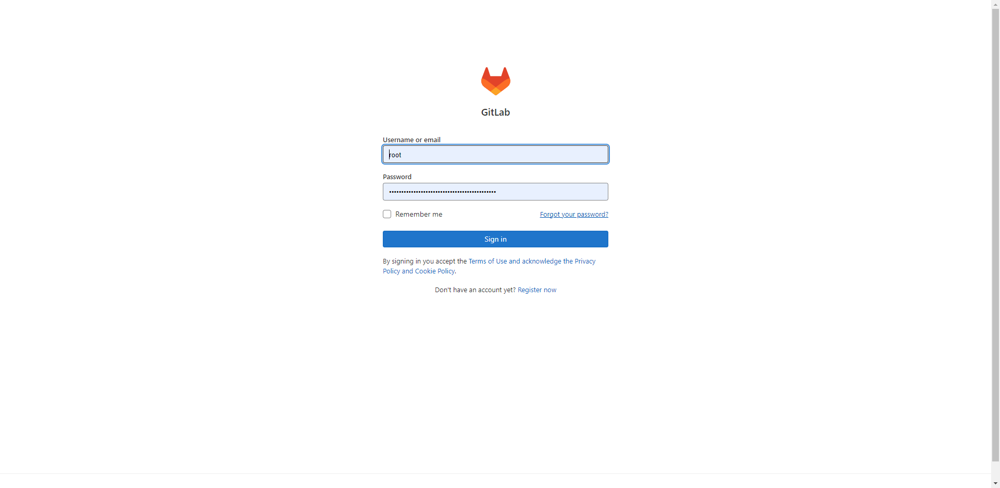

# 一、基于docker搭建

## 1 docker搭建gitlab环境

- 下载镜像

  ```
  docker pull gitlab/gitlab-ce
  ```

  ```
  Using default tag: latest
  latest: Pulling from gitlab/gitlab-ce
  7b1a6ab2e44d: Pull complete
  923d8a5a90cb: Pull complete
  c9c193ad3afb: Pull complete
  ca54c9617521: Pull complete
  5c6b771a3e5e: Pull complete
  b4823ec4057e: Pull complete
  35db6611258b: Pull complete
  cd101cdba14c: Pull complete
  Digest: sha256:a67074548979a08eba93445c37a5dab09e2a8e4f29b301ec5fc7a05607293121
  Status: Downloaded newer image for gitlab/gitlab-ce:latest
  docker.io/gitlab/gitlab-ce:latest
  ```

- 启动服务

  定义docker-compose.yml：

  ```yml
  version: "3"
  services:
    gitlab:
      image: gitlab/gitlab-ce
      container_name: gitlab
      # restart: always
      privileged: true
      ports:
        - 8082:80
        - 8083:443
        - 8084:22
      volumes:
        - ./gitlab/data:/var/opt/gitlab
        - ./gitlab/config:/etc/gitlab
        - ./gitlab/logs:/var/log/gitlab
        # - ./gitlab/opt_gitlab:/opt/gitlab
  ```

  ```
  docker-compose up -d gitlab
  ```

- 修改配置

  启动完容器之后，通过以下命令进入容器

  ```bash
  docker exec -it gitlab bash
  ```

  然后修改配置：

  ```bash
  vi /docker/gitlab/etc/gitlab/gitlab.rb
  ```

  需要修改的配置：

  ```
  # 如果使用公有云且配置了域名了，可以直接设置为域名，如下
  external_url 'http://gitlab.redrose2100.com'
  # 如果没有域名，则直接使用宿主机的ip，如下
  external_url 'http://127.0.0.1'  
  ```

  ```
  # 同样如果有域名，这里也可以直接使用域名
  gitlab_rails['gitlab_ssh_host'] =  'gitlab.redrosee2100.com'
  # 同样如果没有域名，则直接使用宿主机的ip地址，这里不需要http://头部
  gitlab_rails['gitlab_ssh_host'] = '127.0.0.1'
  ```

  ```
  # 端口为启动docker时映射的ssh端口
  gitlab_rails['gitlab_shell_ssh_port'] =10010 
  ```

  ```
  # 设置时区为东八区，即北京时间
  gitlab_rails['time_zone'] = 'Asia/Shanghai'  
  ```

  如果需要发邮件，可以加上如下配置:

  ```
  gitlab_rails['smtp_enable'] = true
  gitlab_rails['smtp_address'] = "smtp.163.com"   # 邮箱服务器
  gitlab_rails['smtp_port'] = 465    # 邮箱服务对应的端口号
  gitlab_rails['smtp_user_name'] = "hitredrose@163.com"   # 发件箱的邮箱地址
  gitlab_rails['smtp_password'] = "xxxxxxxxxxx"      # 发件箱对应的授权码，注意不是登录密码，是授权码
  gitlab_rails['smtp_domain'] = "163.com"
  gitlab_rails['smtp_authentication'] = "login"
  gitlab_rails['smtp_enable_starttls_auto'] = true
  gitlab_rails['smtp_tls'] = true
  gitlab_rails['gitlab_email_enabled'] = true
  gitlab_rails['gitlab_email_from'] = 'hitredrose@163.com'     # 发件箱地址
  gitlab_rails['gitlab_email_display_name'] = 'gitlab.redrose2100.com'    # 显示名称
  gitlab_rails['gitlab_email_reply_to'] = 'noreply@example.com'     # 提示不要回复
  ```

- 重启，让配置生效

  ```
  docker restart gitlab
  ```

- 修改端口号

  先进入容器，然后修改端口号：

  ```
  vi /opt/gitlab/embedded/service/gitlab-rails/config/gitlab.yml
  ```

  ```
  # This file is managed by gitlab-ctl. Manual changes will be
  # erased! To change the contents below, edit /etc/gitlab/gitlab.rb
  # and run `sudo gitlab-ctl reconfigure`.
  
  production: &base
    #
    # 1. GitLab app settings
    # ==========================
  
    ## GitLab settings
    gitlab:
      ## Web server settings (note: host is the FQDN, do not include http://)
      host: 127.0.0.1
      port: 8082 #########修改这里  这里是对应的宿主机的端口号，不是容器内的端口号
      https: false
  
  
      # The maximum time puma can spend on the request. This needs to be smaller than the worker timeout.
      # Default is 95% of the worker timeout
      max_request_duration_seconds: 57
  
      # Uncommment this line below if your ssh host is different from HTTP/HTTPS one
      # (you'd obviously need to replace ssh.host_example.com with your own host).
      # Otherwise, ssh host will be set to the `host:` value above
      ssh_host: 127.0.0.1
  
      # If your ssh user differs from the system user, you need to specify it here
      # Set it to an empty string to omit the username from any ssh url altogether
      ssh_user:
  
      # WARNING: See config/application.rb under "Relative url support" for the list of
      # other files that need to be changed for relative url support
      relative_url_root:
  
      # Trusted Proxies
      # Customize if you have GitLab behind a reverse proxy which is running on a different machine.
      # Add the IP address for your reverse proxy to the list, otherwise users will appear signed in from that address.
      trusted_proxies:
  ```

- 重新配置

  ```
  gitlab-ctl reconfigure
  ```

- 重启gitlab

  ```
  gitlab-ctl restart
  ```

- 访问

  在浏览器输入：http://127.0.0.1:8082即可得到如下界面：

  如何查看root用户的默认密码：

  ```
  cat /etc/gitlab/initial_root_password
  ```

  ```
  # WARNING: This value is valid only in the following conditions
  #          1. If provided manually (either via `GITLAB_ROOT_PASSWORD` environment variable or via `gitlab_rails['initial_root_password']` setting in `gitlab.rb`, it was provided before database was seeded for the first time (usually, the first reconfigure run).
  #          2. Password hasn't been changed manually, either via UI or via command line.
  #
  #          If the password shown here doesn't work, you must reset the admin password following https://docs.gitlab.com/ee/security/reset_user_password.html#reset-your-root-password.
  
  Password: EWRNwCqeC24+O+UzIBhxhLlswZ5rtALigNcuol5eLjI=
  
  # NOTE: This file will be automatically deleted in the first reconfigure run after 24 hours.
  ```

  


## 2 linux搭建gitlab环境

## 3 CI&CD配置


## 4 常见问题

（1）[badgateway: failed to receive response: dial unix /var/opt/gitlab/gitlab-rails/sockets/gitlab.socket: connect: connection refused](https://gitlab.com/gitlab-org/omnibus-gitlab/-/issues/6264)

（2）[gitlab访问错误Whoops, GitLab is taking too much time to respond](https://cloud.tencent.com/developer/article/1511600)

（3）[Invalid port specification: 601342](https://gitlab.com/gitlab-org/gitlab-foss/-/issues/2056)

```
ports:
  - "10443:443"
```


# Reference

1. https://developer.aliyun.com/article/922952