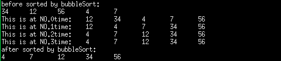

# 一、算法

## 1 动态规划

## 2 回溯算法

## 3 查找算法

## 4 搜索算法

## 5 贪心算法

## 6 分治算法

## 7 位运算

## 8 双指针

## 9 排序算法


### （1）快速排序

#### [1] 思路


#### [2] 代码实现

```go
package main

import "fmt"

func quickSort(arr []int) {
    if len(arr) <= 1 {
        return
    }

    pivot := arr[0]
    left, right := 1, len(arr)-1

    for left <= right {
        for left <= right && arr[left] < pivot {
            left++
        }

        for left <= right && arr[right] > pivot {
            right--
        }

        if left <= right {
            arr[left], arr[right] = arr[right], arr[left]
            left++
            right--
        }
    }

    arr[0], arr[right] = arr[right], arr[0]

    quickSort(arr[:right])
    quickSort(arr[right+1:])
}

func main() {
    arr := []int{64, 34, 25, 12, 22, 11, 90}
    fmt.Println("原始数组:", arr)

    quickSort(arr)
    fmt.Println("排序后数组:", arr)
}
```

### （2）冒泡排序

#### [1] 思想

冒泡排序就是通过对比前一个和后一个数的大小，按照规则进行顺序的调换。每一轮对比之后最大或者最小值都会浮到最上面或者沉到最低下。

如：对这一数组进行冒泡排序：int a[5]{34,12,56,4,7}; 假设为从小到大排序

一共需要比较length-1轮：

第一轮： a.34和12比较，12比34小，那么调换位置，此时为：12,34,56,4,7，然后在对该序列进行排序

　　　　 b.然后就是34和56进行对比，34比56小，不用调换顺序，此时依旧为：12,34,56,4,7，然后在对该序列进行排序

　　　　 c.然后再就是56和4鸡西宁对比，4比56小，所以将56和4调换顺序，此时序列就是：12,34,4,56,7

　　　　 d.再然后就对比56和7，7比56小，所以将二者位置进行调换，此时完成第一轮调换，序列为：12,34,4,7,56

　　　　我们可以看到第一轮排序之后，已经将序列中的最大值沉到最底部了。

第二轮：此时的排序此时交第一轮要减1，

　　　　 a.先是12和34对比，前者比后者小，所以不用调换位置，序列时：12,34,4,7,56

　　　　 b.然后比较34和4的大小，后者比前者小，所以调换位置，此时序列为：12,4,34,7,56

　　　　 c.再然后比较34和7的大小，后者比前者小，所以调换位置，此时序列为：12,4,7,34,56

　　　　 d.此时就不用在往下比较了，因为比较次数已经减1了，也是因为第一轮中已经将最大的数选出来了。

然后就是第三轮和第四轮的比较，方法类似。

最终结果就是4,7,12,34,56

我们可以看到程序截图如下图所示：




#### [2] 代码实现

```go
package sort

// BubbleSort 冒泡排序
func BubbleSort(array []int) []int {
	length := len(array)
	if length == 0 || length == 1 {
		return []int{}
	}

	for i := 0; i < length; i++ {
		for j := i + 1; j < length; j++ {
			if array[i] > array[j] {
				array[i], array[j] = array[j], array[i]
			}
		}
	}

	return array
}
```

### （3）选择排序

#### [1] 思路

选择排序的实现要比冒泡排序简单一些，但是在代码上相对会有些绕。原理就是先假设待排序的序列中的第一个数为最小值或者最大值，这里还是用从小到大的顺序进行排序。首先假设第一个数为最小值（假设该值的索引下标时i），然后从该值的下一个数也就是索引为i+1的数开始进行比较，如果i+1的值要比假设的最小值小，那么就将二者的值进行交换，每一轮将最小值选择出来，并将其与假设的最小值进行调换就行，不需要想冒泡排序那样整个需略都要跟着一起移动。此时还需要一个缓冲变量来存放最小值的索引值。

详细讲解：

在时间复杂度上，这两种排序方法都是一样，O(N^2)，也是需要循环执行length-1轮。还是假设对数组a进行排序。

首先定义数组：int a[5]{34,12,56,4,7};

第一轮：先假设序列中的第一个数是最小值，记录下它的索引值，定一个新的变量用来存放该索引值，minIndex=0，下表为0也就是第一个数。然后在进行循环。

　　　　 a.内循环中的第一轮是34和12进行比较，后者比前者小，所以将minIndex的索引值进行更改，此时minIndex=1,

　　　　 b.内循环中的第二轮，是利用minIndex 中的数和下一个待比较的数进行比较，应该是12和56比较，后者比前者小，所以不用修改minIndex的值

　　　　 c.内循环中的第三轮，还是利用索引为1的数值和下一个待比较的数进行比较，应该是12和4进行比较，后者较之前者较小，所以记录下当前数的索引值并赋值给minIndex，此时minIndex=3

　　　　 d.内循环中的第四轮，利用minIndex索引值的数值和下一个待比较的数进行比较，应该是4和7进行比较，后者比前者大，所以不用修改minIndex的值

　　　　然后将序列中的第i个数和序列中索引值为minIndex的数进行调换，第一轮已将最小值选择出来了。此时序列为：4,12,56,34,7

　　　　第一轮外循环之后，minIndex=3,下一轮外循环会将这个值直接覆盖

第二轮：此时的minIndex=1，假设的最小值是12

　　　　　此时定义上一轮外循环的下一个数为最小值，也即是索引值为1的值，那么本轮循环将从索引值为2的数开始比较，

　　　　 a.内循环中的第一轮，比较12和56,后者比前者大，所以不用修改minIndex的值，

　　　　 b.内循环中的第二轮，此时比较12和34的大小，还是依旧不用修改索引值

　　　　 c.内循环中的第三轮，此时比较12和7的大小，后者比前者小，索引记录下当前数的索引值并赋值给minIndex记录下来

　　　　内循环结束，判断minIndex的值是否被改变，如果被改变了，那么就将下标为i的数和下标为minIndex的数进行交换。此时序列为：4,7,56,34,12且minIndex=4

第三轮和第四轮外循环的规则类似。。

我们可以看程序运行的效果图如下：


#### [2] 代码实现

```go
// SelectSort 选择排序
func SelectSort(array []int) []int {
	length := len(array)
	if length == 0 || length == 1 {
		return []int{}
	}

	for i := 0; i < length-1; i++ {
		minIndex := i
		for j := i + 1; j < length; j++ {
			if array[j] < array[minIndex] {
				minIndex = j
			}
		}

		if minIndex != i {
			array[i], array[minIndex] = array[minIndex], array[i]
		}
	}

	return array
}
```

### （4）堆排序

#### [1] 思路

堆排序是一种基于二叉堆的排序算法，它将待排序的数据构建成一个堆（二叉堆），然后将堆顶元素（最大值或最小值）与堆的最后一个元素交换，并将堆的大小减1。然后对堆进行调整，使得堆再次满足堆的性质。重复这个过程直到堆的大小变为1，即完成了排序。

堆排序的思路如下：

1. 构建堆：将待排序的数据构建成一个堆。如果要进行升序排序，可以构建一个大顶堆，即堆顶元素是堆中的最大值；如果要进行降序排序，可以构建一个小顶堆，即堆顶元素是堆中的最小值。
2. 排序：将堆顶元素与堆的最后一个元素交换，并将堆的大小减1。然后对堆进行调整，使得堆再次满足堆的性质。
3. 重复：重复步骤2，直到堆的大小变为1，即完成了排序。

#### [2] 代码实现

```go
package main

import "fmt"

func heapSort(arr []int) {
    n := len(arr)

    // 构建大顶堆
    for i := n/2 - 1; i >= 0; i-- {
        heapify(arr, n, i)
    }

    // 排序
    for i := n - 1; i > 0; i-- {
        // 将堆顶元素与堆的最后一个元素交换
        arr[0], arr[i] = arr[i], arr[0]
        // 对堆进行调整
        heapify(arr, i, 0)
    }
}

func heapify(arr []int, n, i int) {
    largest := i
    left := 2*i + 1
    right := 2*i + 2

    // 找到左子节点和右子节点中的较大值
    if left < n && arr[left] > arr[largest] {
        largest = left
    }
    if right < n && arr[right] > arr[largest] {
        largest = right
    }

    // 如果较大值不是根节点，则进行交换并继续调整
    if largest != i {
        arr[i], arr[largest] = arr[largest], arr[i]
        heapify(arr, n, largest)
    }
}
```

### （5）插入排序

#### [1] 思路

插入排序（Insertion Sort）是一种简单直观的排序算法，其思路可以概括为：将数组分为已排序部分和未排序部分，逐个将未排序部分的元素插入到已排序部分的合适位置，直到所有元素都在已排序部分中形成有序序列。

具体步骤如下：

1. 从第一个元素开始，将其视为已排序部分。
2. 取出下一个元素，在已排序部分中从后往前扫描，将比当前元素大的元素向右移动，直到找到合适的位置插入当前元素。
3. 重复步骤2，直到所有元素都被插入到正确的位置。

在每次插入操作中，当前元素会与已排序部分中的元素进行比较，如果当前元素小于已排序部分的某个元素，则将这个元素后移，为当前元素腾出插入位置。这样，经过多次插入操作，未排序部分的元素会逐渐插入到已排序部分，直到整个数组形成有序序列。

#### [2] 代码实现

```go
package main

import "fmt"

func insertionSort(arr []int) {
    n := len(arr)

    for i := 1; i < n; i++ {
        key := arr[i]
        j := i - 1

        // 将比key大的元素向右移动
        for j >= 0 && arr[j] > key {
            arr[j+1] = arr[j]
            j = j - 1
        }

        arr[j+1] = key
    }
}

func main() {
    arr := []int{64, 34, 25, 12, 22, 11, 90}
    fmt.Println("原始数组:", arr)

    insertionSort(arr)
    fmt.Println("排序后数组:", arr)
}
```

### （6）归并排序

#### [1] 思路

归并排序的中心思想是分治法（Divide and Conquer）。它将一个大的问题分解成许多小的子问题，然后递归地解决这些子问题，最后将子问题的解合并成整个问题的解。

具体来说，归并排序的中心思想可以概括为以下几个步骤：

1. 分解：将原始数组划分为若干个子数组，直到每个子数组都只包含一个元素（认为单个元素是已经排序好的）。
2. 解决：对每个子数组进行排序。可以通过递归地调用归并排序函数来解决每个子问题，直到子数组只有一个元素。
3. 合并：将排序好的子数组合并成一个大的有序数组。这个过程中，将两个有序的子数组合并成一个有序数组的操作被称为“归并”。

整个归并排序过程通过递归的方式将原始数组分解为越来越小的子数组，然后再通过归并操作将这些子数组逐步合并成一个排序好的数组。由于归并操作是建立在两个已排序的子数组的基础上，所以这个步骤相对简单而高效。

归并排序的时间复杂度为 O(n log n)，其中 n 是数组的长度。它是一种稳定的排序算法，适用于对大规模数据进行排序。由于它的分治思想，归并排序也可以很方便地应用于并行计算，提高排序的效率。

#### [2] 代码实现

```go
func MergeSort(array []int) []int {
	length := len(array)
	if length <= 1 {
		return array
	}

	left := MergeSort(array[:length/2])
	right := MergeSort(array[length/2:])

	return merge(left, right)
}

func merge(left []int, right []int) []int {
	if len(left) == 0 {
		return right
	}

	if len(right) == 0 {
		return left
	}

	l := 0
	r := 0
	result := make([]int, 0)
	for l < len(left) && r < len(right) {
		if left[l] < right[r] {
			result = append(result, left[l])
			l++
		} else {
			result = append(result, right[r])
			r++
		}
	}

	if l < len(left) {
		result = append(result, left[l:]...)
	}
	if r < len(right) {
		result = append(result, right[r:]...)
	}

	return result
}
```

### （7）计数排序

#### [1] 思路

计数排序是一种非比较排序算法，适用于待排序的元素范围较小的情况。它的基本思路是统计待排序元素中每个元素出现的次数，然后根据统计信息将元素放回到正确的位置上，从而实现排序。

计数排序的步骤如下：

1. 找出待排序元素中的最大值max和最小值min，计算出元素范围range。
2. 创建一个辅助数组count，长度为range+1，用于统计元素出现的次数。
3. 遍历待排序元素，统计每个元素出现的次数，放入count数组中。
4. 计算累计次数，count[i]表示小于或等于元素i的元素个数。
5. 创建一个与待排序元素相同长度的结果数组sorted，用于存放排序结果。
6. 从后向前遍历待排序元素，根据count数组的值将元素放入sorted数组中，并更新count数组的值。
7. 最后得到的sorted数组即为排序后的结果。

#### [2] 代码实现

```go
package main

import "fmt"

func countingSort(arr []int) {
    n := len(arr)

    if n <= 1 {
        return
    }

    // 找出最大值和最小值
    max, min := arr[0], arr[0]
    for i := 1; i < n; i++ {
        if arr[i] > max {
            max = arr[i]
        }
        if arr[i] < min {
            min = arr[i]
        }
    }

    // 计算元素范围
    rangeSize := max - min + 1

    // 统计元素出现的次数
    count := make([]int, rangeSize)
    for i := 0; i < n; i++ {
        count[arr[i]-min]++
    }

    // 计算累计次数
    for i := 1; i < rangeSize; i++ {
        count[i] += count[i-1]
    }

    // 排序
    sorted := make([]int, n)
    for i := n - 1; i >= 0; i-- {
        sorted[count[arr[i]-min]-1] = arr[i]
        count[arr[i]-min]--
    }

    // 将排序结果复制回原数组
    for i := 0; i < n; i++ {
        arr[i] = sorted[i]
    }
}

func main() {
    arr := []int{4, 2, 2, 8, 3, 3, 1}
    fmt.Println("原始数组：", arr)

    countingSort(arr)
    fmt.Println("排序后的数组：", arr)
}
```

> **第33-35行的作用：**
>
> 在计数排序的步骤中，我们需要统计每个元素在待排序数组中出现的次数，并使用辅助数组`count`来存储这些统计信息。累计次数的计算是为了找到每个元素在排序结果中应该放置的位置。
>
> 首先，我们统计每个元素在待排序数组中出现的次数，将其存储在`count`数组中。然后，我们将`count`数组中的元素进行累加操作，从下标1开始，每次将当前元素与前一个元素的值相加，将结果保存在当前元素位置上。这样，`count[i]`表示小于等于元素`i`的元素个数。
>
> 例如，假设有一个待排序数组`arr = [4, 2, 2, 8, 3, 3, 1]`，经过统计操作后，`count`数组中的值为`[1, 2, 4, 6, 6, 6, 6, 7]`。然后我们对`count`数组进行累加操作，得到`[1, 3, 7, 13, 19, 25, 31, 38]`。这个数组表示对应的元素在排序结果中的位置，即`1`有一个元素在排序结果的第一个位置，`2`有三个元素在排序结果的前三个位置，以此类推。
>
> 最后，在排序过程中，我们从后向前遍历待排序数组，根据`count`数组的值将元素放入排序结果数组中，并更新`count`数组的值。这样就可以实现计数排序，并保持排序结果的稳定性。

### （8）桶排序

### （9）基数排序

### （10）希尔排序

# 二、数据结构

## 1 数组

## 2 栈

## 3 队列

## 4 字符串

## 5 链表

### （1）链表反转

#### [1] 思路

链表反转的思路是通过遍历链表，将每个节点的Next指针指向其前一个节点，从而实现链表的反转。

具体步骤如下：

1. 定义两个指针prev和curr，初始时prev为nil，curr为链表的头节点。
2. 开始遍历链表，每次迭代将curr的Next指针指向prev，这样就将当前节点反转。
3. 接着将prev和curr都向后移动一个位置，继续遍历链表，直到curr为nil，表示遍历到了链表的末尾。
4. 最后返回prev，即为反转后的链表的头节点。

例如，有一个链表1 -> 2 -> 3 -> 4 -> 5，通过反转操作，得到的链表为：5 -> 4 -> 3 -> 2 -> 1。

链表反转的过程中，每个节点都需要修改Next指针的指向，时间复杂度为O(n)，其中n是链表的长度。反转过程中只需要常数级的额外空间，因此空间复杂度为O(1)。链表反转是一个经典的链表操作，也是面试中常见的问题。

#### [2] 代码实现

```go
package main

import "fmt"

type ListNode struct {
    Val  int
    Next *ListNode
}

func reverseList(head *ListNode) *ListNode {
    var prev *ListNode
    curr := head

    for curr != nil {
        temp := curr.Next
        curr.Next = prev
        prev = curr
        curr = temp
    }

    return prev
}

func printList(head *ListNode) {
    curr := head
    for curr != nil {
        fmt.Printf("%d ", curr.Val)
        curr = curr.Next
    }
    fmt.Println()
}

func main() {
    // 构造链表 1 -> 2 -> 3 -> 4 -> 5
    head := &ListNode{Val: 1}
    head.Next = &ListNode{Val: 2}
    head.Next.Next = &ListNode{Val: 3}
    head.Next.Next.Next = &ListNode{Val: 4}
    head.Next.Next.Next.Next = &ListNode{Val: 5}

    fmt.Println("原始链表：")
    printList(head)

    // 反转链表
    head = reverseList(head)

    fmt.Println("反转后的链表：")
    printList(head)
}
```

## 6 树

## 7 图

## 8 堆

## 9 哈希表

