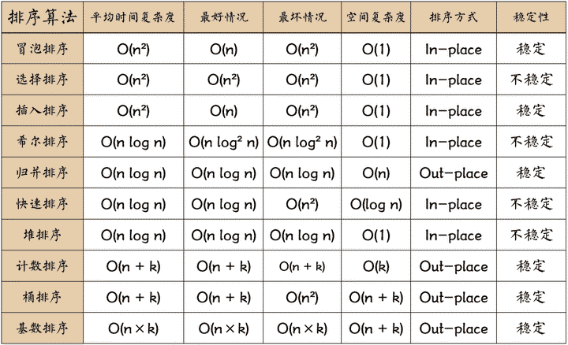
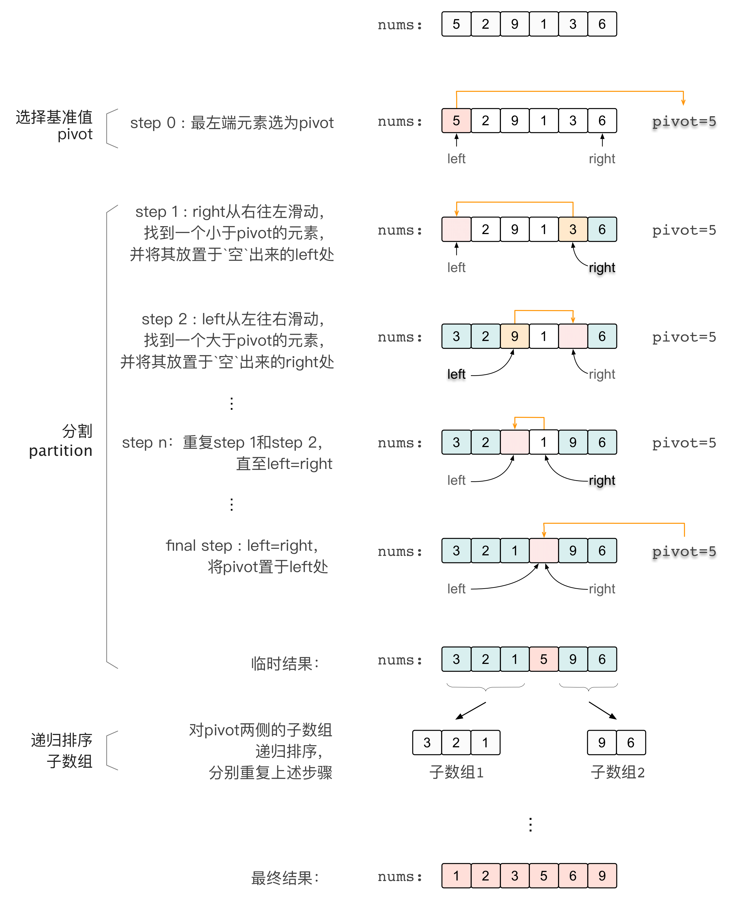
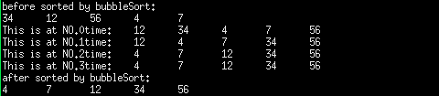
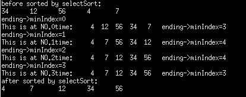

# 一、算法

## 1 动态规划

**解题思路：**

当我们面对一个问题时，有时候我们可以通过分解问题成一系列小问题来解决它。如果这些小问题有重复的部分，我们可以把它们的解缓存起来，避免重复计算，从而更高效地求解整个问题。这种思想就是动态规划。

动态规划的步骤如下：

1. 确定问题的状态：就是要用哪些变量来表示问题的子问题的解。通常是一些数组或矩阵。
2. 定义状态转移方程：描述子问题之间的关系，即如何从小的子问题得到大问题的解。
3. 初始化边界条件：确定问题的初始状态，通常是最简单的子问题的解。
4. 递推求解：通过状态转移方程逐步计算子问题的解，并把结果保存在状态数组中。
5. 获取最终解：根据子问题的解计算原问题的解，通常原问题的解就是状态数组中的某个位置的值。

动态规划的核心是将复杂问题分解成小问题，并缓存子问题的解，以避免重复计算。通过递推求解，动态规划能够高效地解决许多复杂问题。

举个例子：假设你要爬楼梯，每次可以爬1级或2级台阶。问你爬到第n级台阶有多少种不同的方法。这个问题可以用动态规划来解决，我们可以定义一个数组`dp`，其中`dp[i]`表示爬到第i级台阶的方法数。根据题目要求，我们可以得到状态转移方程`dp[i] = dp[i-1] + dp[i-2]`，初始条件为`dp[1] = 1`和`dp[2] = 2`。然后，我们逐步计算`dp[3]、dp[4]、...、dp[n]`，最终得到`dp[n]`就是爬到第n级台阶的不同方法数。

**常见算法题：**

1. 背包问题：如 0-1 背包问题、完全背包问题、多重背包问题等。
2. 最长公共子序列（Longest Common Subsequence）问题：如最长公共子序列、最长递增子序列等。
3. 最长回文子串（Longest Palindromic Substring）问题：如最长回文子串。
4. 最大子数组和（Maximum Subarray Sum）问题：如最大子数组和。
5. 最小编辑距离（Minimum Edit Distance）问题：如字符串编辑距离。
6. 矩阵路径问题：如矩阵中的最长递增路径、矩阵中的最大正方形等。
7. 解码方法（Decode Ways）问题：如解码方法的种数。
8. 乘积最大子数组（Maximum Product Subarray）问题：如乘积最大子数组。
9. 打家劫舍（House Robber）问题：如不相邻的房屋偷窃的最大金额。
10. 任务调度器（Task Scheduler）问题：如按规定顺序执行任务的最少时间。

### （1）正则表达式匹配（Regular Expression Matching）

正则表达式匹配（Regular Expression Matching）是一个典型的动态规划问题。给定一个字符串和一个正则表达式，判断字符串是否与正则表达式匹配。

解题思路如下：

1. 我们可以使用动态规划来解决正则表达式匹配问题。
2. 定义一个二维布尔数组dp，其中`dp[i][j]`表示字符串的前i个字符与正则表达式的前j个字符是否匹配。
3. 初始化`dp[0][0]`为true，表示空字符串和空正则表达式是匹配的。
4. 遍历字符串和正则表达式的每个字符，逐步填充dp数组。
5. 如果s[i]和p[j]相等，或者p[j]为'.'，则`dp[i][j]`的值取决于`dp[i-1][j-1]`，表示当前字符匹配成功。
6. 如果p[j]为'*'，则需要考虑两种情况：
   - '*'表示前面的字符重复0次，则`dp[i][j]`的值取决于`dp[i][j-2]`。
   - '*'表示前面的字符重复1次或多次，则`dp[i][j]`的值取决于`dp[i-1][j]`且s[i]和p[j-1]相等，或者p[j-1]为'.'。
7. 其他情况下，`dp[i][j]`的值为false，表示当前字符匹配失败。
8. 最终返回`dp[len(s)][len(p)]`的值，表示整个字符串与正则表达式是否匹配。

下面用Go语言实现正则表达式匹配问题的代码：

```go
package main

import "fmt"

func isMatch(s string, p string) bool {
	m, n := len(s), len(p)
	dp := make([][]bool, m+1)
	for i := range dp {
		dp[i] = make([]bool, n+1)
	}

	dp[0][0] = true

	for j := 1; j <= n; j++ {
		if p[j-1] == '*' {
			dp[0][j] = dp[0][j-2]
		}
	}

	for i := 1; i <= m; i++ {
		for j := 1; j <= n; j++ {
			if p[j-1] == s[i-1] || p[j-1] == '.' {
				dp[i][j] = dp[i-1][j-1]
			} else if p[j-1] == '*' {
				dp[i][j] = dp[i][j-2] || (dp[i-1][j] && (s[i-1] == p[j-2] || p[j-2] == '.'))
			}
		}
	}

	return dp[m][n]
}

func main() {
	s := "aa"
	p := "a*"
	fmt.Println("正则表达式匹配结果：", isMatch(s, p)) // 输出 true
}
```

在上述代码中，我们首先定义了二维布尔数组dp，用于动态规划求解正则表达式匹配问题。通过双层循环遍历字符串和正则表达式的每个字符，根据当前字符是否匹配以及'*'的情况，逐步填充dp数组。最终返回`dp[len(s)][len(p)]`的值，表示整个字符串与正则表达式是否匹配

### （2）最长回文子串（Longest Palindromic Substring）问题

#### 1）最长回文子串

最长回文子串（Longest Palindromic Substring）问题是一个经典的字符串问题，要求找到给定字符串中的最长回文子串。

回文串是指正着读和倒着读都一样的字符串。例如，"aba"、"abba"和"level"都是回文串。

解题思路：

1. 我们可以使用动态规划来解决最长回文子串问题。定义一个二维数组`dp`，其中`dp[i][j]`表示从索引i到j的子串是否为回文串。
2. 初始化`dp`数组，将所有长度为1的子串都设为回文串，即`dp[i][i] = true`。
3. 遍历字符串中所有可能的子串，从长度为2的子串开始，到长度为n的子串结束（n为字符串长度）。
4. 对于每个子串，判断头尾两个字符是否相等，并根据之前计算的`dp`数组来判断子串是否为回文串，即`dp[i][j] = (s[i] == s[j]) && dp[i+1][j-1]`。
5. 如果当前子串是回文串并且长度比之前的最长回文串更长，更新最长回文串的起始位置和长度。
6. 最终得到的最长回文子串就是最长的回文串。

现在用Go语言实现最长回文子串问题：

```go
package main

import "fmt"

func longestPalindrome(s string) string {
	n := len(s)
	if n <= 1 {
		return s
	}

	dp := make([][]bool, n)
	for i := range dp {
		dp[i] = make([]bool, n)
		dp[i][i] = true
	}

	start, maxLen := 0, 1

	for length := 2; length <= n; length++ {
		for i := 0; i <= n-length; i++ {
			j := i + length - 1
			if s[i] == s[j] && (length == 2 || dp[i+1][j-1]) {
				dp[i][j] = true
				if length > maxLen {
					maxLen = length
					start = i
				}
			}
		}
	}

	return s[start : start+maxLen]
}

func main() {
	s := "babad"
	fmt.Println("最长回文子串：", longestPalindrome(s)) // 输出 "bab" 或 "aba"
}
```

在上述代码中，我们使用动态规划来解决最长回文子串问题。通过计算dp数组，找到了给定字符串中的最长回文子串。这样我们就通过动态规划高效地解决了最长回文子串问题。

#### 2）回文子串个数

解题思路：

1. 定义一个二维数组`dp`，其中`dp[i][j]`表示从索引i到j的子串是否为回文串。
2. 初始化`dp`数组，将所有长度为1的子串都设为回文串，即`dp[i][i] = true`。
3. 遍历字符串中所有可能的子串，从长度为2的子串开始，到长度为n的子串结束（n为字符串长度）。
4. 对于每个子串，判断头尾两个字符是否相等，并根据之前计算的`dp`数组来判断子串是否为回文串，即`dp[i][j] = (s[i] == s[j]) && dp[i+1][j-1]`。
5. 统计所有为回文串的子串个数。

现在用Go语言实现回文串的个数问题：

```go
package main

import "fmt"

func countPalindromes(s string) int {
	n := len(s)
	if n == 0 {
		return 0
	}

	dp := make([][]bool, n)
	for i := range dp {
		dp[i] = make([]bool, n)
		dp[i][i] = true
	}

	count := n // 单个字符本身就是回文串，所以初始count为n

	for length := 2; length <= n; length++ {
		for i := 0; i <= n-length; i++ {
			j := i + length - 1
			if s[i] == s[j] && (length == 2 || dp[i+1][j-1]) {
				dp[i][j] = true
				count++
			}
		}
	}

	return count
}

func main() {
	s := "abcba"
	fmt.Println("回文串的个数：", countPalindromes(s)) // 输出 7，因为有"a", "b", "c", "b", "a", "bc", "cba"这些回文串
}
```

在上述代码中，我们使用动态规划来解决回文串的个数问题。通过计算dp数组，统计了给定字符串中的回文串个数。这样我们就通过动态规划高效地解决了回文串的个数问题。

### （3）背包问题

#### 1）0-1 背包问题

0-1背包问题是动态规划中的经典问题之一。给定一组物品，每个物品有对应的重量和价值，背包有限的承载重量，要求在不超过背包承载重量的前提下，选择物品放入背包，使得背包中物品的总价值最大。

解题思路：

1. 我们可以使用动态规划来解决0-1背包问题。首先，定义一个二维数组`dp`，其中`dp[i][j]`表示在前i个物品中选择总重量不超过j的情况下的最大价值。
2. 初始化`dp`数组，将第0行和第0列的值都设为0，表示没有物品或背包承载重量为0时的最大价值为0。
3. 遍历物品和背包承载重量，对于每个物品和背包承载重量：
   - 如果物品i的重量大于当前背包承载重量j，说明物品i不能放入背包，所以`dp[i][j]`的最大价值和`dp[i-1][j]`一样。
   - 如果物品i的重量小于等于当前背包承载重量j，我们可以考虑是否将物品i放入背包。如果放入物品i，则背包中剩余的重量为`j - weights[i]`，所以最大价值为`values[i] + dp[i-1][j-weights[i]]`；如果不放入物品i，则最大价值为`dp[i-1][j]`。我们选择两者中较大的值作为`dp[i][j]`的最大价值。
4. 最后`dp[n][W]`即为问题的解，其中n表示物品的个数，W表示背包的承载重量。

现在用Go语言实现0-1背包问题：

```go
package main

import "fmt"

func knapsack(weights []int, values []int, W int) int {
	n := len(weights)
	if n == 0 || W == 0 {
		return 0
	}

	dp := make([][]int, n+1)
	for i := range dp {
		dp[i] = make([]int, W+1)
	}

	for i := 1; i <= n; i++ {
		for j := 1; j <= W; j++ {
			if weights[i-1] > j {
				dp[i][j] = dp[i-1][j]
			} else {
				dp[i][j] = max(dp[i-1][j], values[i-1]+dp[i-1][j-weights[i-1]])
			}
		}
	}

	return dp[n][W]
}

func max(a, b int) int {
	if a > b {
		return a
	}
	return b
}

func main() {
	weights := []int{2, 3, 4, 5}
	values := []int{3, 4, 5, 6}
	W := 8
	fmt.Println("背包能获得的最大价值：", knapsack(weights, values, W)) // 输出 11
}
```

在上述代码中，我们使用动态规划来求解0-1背包问题。首先定义二维数组`dp`，并根据上述思路进行动态规划处理。最终`dp[n][W]`即为问题的解，表示背包能获得的最大价值。这样我们就可以通过动态规划高效地解决0-1背包问题。

### （4）青蛙过河

青蛙过河问题是一个经典的动态规划问题。问题描述如下：

给定一个非负整数数组stones，表示在一条河上有一系列的石头。初始时，青蛙位于第一个石头的位置，并希望跳跃到最后一个石头的位置。

青蛙跳跃的规则如下：

1. 青蛙只能跳跃到相邻的石头上（即当前位置i只能跳跃到i+1或i+2的位置）。
2. 青蛙第一次跳跃必须跳跃一步（即从位置0跳跃到位置1）。
3. 如果青蛙上一次跳跃距离为k，那么下一次跳跃的距离必须在k-1、k、k+1范围内选择（即当前位置i跳跃到i+1的位置时，下一次跳跃的距离必须在1、2、3范围内选择；当前位置i跳跃到i+2的位置时，下一次跳跃的距离必须在2、3、4范围内选择）。

要求判断青蛙是否能够跳跃到最后一个石头的位置。

解题思路： 我们可以使用动态规划来解决青蛙过河问题。定义一个二维数组dp，其中`dp[i][k]`表示青蛙从位置0跳跃到位置i，并且上一次跳跃距离为k时的状态。

1. 初始化`dp[0][0]`为true，表示初始时青蛙位于第一个石头的位置。
2. 对于每个石头位置i，遍历之前的每个石头位置j，计算青蛙从位置j跳跃到位置i时的距离k，然后判断是否能够满足上述跳跃规则，即k在k-1、k、k+1范围内，且`dp[j][k]`为true。如果满足，则`dp[i][k]`也设为true。
3. 最终，检查dp数组中最后一行是否有任意一个元素为true，如果有，则说明青蛙能够跳跃到最后一个石头的位置，返回true，否则返回false。

现在用Go语言实现青蛙过河问题：

```go
package main

import "fmt"

func canCross(stones []int) bool {
	n := len(stones)
	dp := make([][]bool, n)
	for i := range dp {
		dp[i] = make([]bool, n)
	}

	dp[0][0] = true

	for i := 1; i < n; i++ {
		for j := 0; j < i; j++ {
			k := stones[i] - stones[j]
			if k <= j+1 {
				dp[i][k] = dp[j][k-1] || dp[j][k] || dp[j][k+1]
			}
		}
	}

	for i := 0; i < n; i++ {
		if dp[n-1][i] {
			return true
		}
	}

	return false
}

func main() {
	stones := []int{0, 1, 3, 5, 6, 8, 12, 17}
	fmt.Println("青蛙是否能跳跃到最后一个石头的位置：", canCross(stones)) // 输出 true
}
```

在上述代码中，我们使用动态规划来判断青蛙是否能够跳跃到最后一个石头的位置。通过计算dp数组并检查最后一行的元素，可以得出是否能跳跃到目标位置的结论。这样我们就可以通过动态规划高效地解决青蛙过河问题。

### （5）最长公共子序列（Longest Common Subsequence）问题

最长公共子序列（Longest Common Subsequence，简称LCS）问题是一种经典的动态规划问题，用于找到两个序列中最长的公共子序列的长度。

给定两个序列A和B，我们要找到它们的最长公共子序列。子序列是指从序列中删除零个或多个元素而不改变其相对顺序后得到的新序列。

解题思路：

1. 我们可以使用动态规划来解决LCS问题。首先，定义一个二维数组`dp`，其中`dp[i][j]`表示序列A的前i个元素和序列B的前j个元素的最长公共子序列的长度。
2. 初始化`dp`数组，将第0行和第0列的值都设为0，表示当一个序列为空时，与任何序列的最长公共子序列长度都为0。
3. 遍历两个序列的元素，对于每个元素`A[i]`和`B[j]`：
   - 如果`A[i]`和`B[j]`相等，说明它们可以作为最长公共子序列的一部分，因此`dp[i][j]`的值应该是`dp[i-1][j-1] + 1`，即在之前的最长公共子序列长度上加1。
   - 如果`A[i]`和`B[j]`不相等，说明它们不能同时出现在最长公共子序列中，此时我们需要考虑舍弃其中一个元素，即取`dp[i-1][j]`和`dp[i][j-1]`中的较大值作为`dp[i][j]`的值。
4. 最后，`dp[n][m]`即为序列A和B的最长公共子序列的长度，其中n和m分别是序列A和B的长度。

解决LCS问题的动态规划思路就是通过填充`dp`数组，逐步构建序列A和B的最长公共子序列。最终得到的`dp[n][m]`即为最长公共子序列的长度。

请注意，LCS问题的解决方法通常只给出最长公共子序列的长度，如果需要找到最长公共子序列本身，可以根据`dp`数组进行回溯。

#### 1）最长公共子序列

最长公共子序列（Longest Common Subsequence，简称LCS）问题可以使用动态规划来解决。

解题思路：

1. 创建一个二维数组`dp`，其中`dp[i][j]`表示字符串`s1`的前i个字符和字符串`s2`的前j个字符的最长公共子序列的长度。

2. 初始化`dp`数组，将第0行和第0列的值都设为0，表示当一个字符串为空时，与任何字符串的最长公共子序列长度都为0。

3. 遍历两个字符串

   ```
   s1
   ```

   和

   ```
   s2
   ```

   的字符，对于每个字符

   ```
   s1[i]
   ```

   和

   ```
   s2[j]
   ```

   ：

   - 如果`s1[i]`和`s2[j]`相等，说明它们可以作为最长公共子序列的一部分，因此`dp[i][j]`的值应该是`dp[i-1][j-1] + 1`，即在之前的最长公共子序列长度上加1。
   - 如果`s1[i]`和`s2[j]`不相等，说明它们不能同时出现在最长公共子序列中，此时我们需要考虑舍弃其中一个字符，即取`dp[i-1][j]`和`dp[i][j-1]`中的较大值作为`dp[i][j]`的值。

4. 最后，`dp[len1][len2]`即为字符串`s1`和`s2`的最长公共子序列的长度，其中`len1`和`len2`分别是字符串`s1`和`s2`的长度。

现在用Go语言实现最长公共子序列问题：

```go
package main

import "fmt"

func longestCommonSubsequence(s1, s2 string) int {
	len1, len2 := len(s1), len(s2)
	dp := make([][]int, len1+1)
	for i := range dp {
		dp[i] = make([]int, len2+1)
	}

	for i := 1; i <= len1; i++ {
		for j := 1; j <= len2; j++ {
			if s1[i-1] == s2[j-1] {
				dp[i][j] = dp[i-1][j-1] + 1
			} else {
				dp[i][j] = max(dp[i-1][j], dp[i][j-1])
			}
		}
	}

	return dp[len1][len2]
}

func max(a, b int) int {
	if a > b {
		return a
	}
	return b
}

func main() {
	s1 := "abcde"
	s2 := "ace"
	fmt.Println("最长公共子序列的长度：", longestCommonSubsequence(s1, s2)) // 输出 3
}
```

在上述代码中，我们使用动态规划来求解最长公共子序列问题。通过计算dp数组，得到了字符串s1和s2的最长公共子序列的长度。这样我们就通过动态规划高效地解决了最长公共子序列问题。

#### 2）最长递增子序列

最长递增子序列（Longest Increasing Subsequence）问题是动态规划中的经典问题之一。给定一个未排序的整数数组，要求找到其中最长的递增子序列的长度。递增子序列是指序列中的元素是严格递增的（可以不连续）。

解题思路：

1. 我们可以使用动态规划来解决这个问题。首先，定义一个数组`dp`，其中`dp[i]`表示以第`i`个元素结尾的最长递增子序列的长度。
2. 初始化`dp`数组，将每个元素的初始值设为1，表示以该元素为结尾的最长递增子序列至少包含自己。
3. 遍历数组，对于每个元素`nums[i]`，我们需要找到它之前的所有元素中，小于`nums[i]`的元素`nums[j]`，并且`dp[j] + 1`比`dp[i]`更大，即可以将`nums[i]`加入到以`nums[j]`结尾的递增子序列中，从而更新`dp[i]`的值。
4. 最后，`dp`数组中的最大值即为最长递增子序列的长度。

现在用Go语言实现最长递增子序列问题：

```go
package main

import (
	"fmt"
)

func lengthOfLIS(nums []int) int {
	n := len(nums)
	if n == 0 {
		return 0
	}

	dp := make([]int, n)
	for i := range dp {
		dp[i] = 1
	}

	for i := 1; i < n; i++ {
		for j := 0; j < i; j++ {
			if nums[i] > nums[j] && dp[j]+1 > dp[i] {
				dp[i] = dp[j] + 1
			}
		}
	}

	maxLen := 0
	for i := range dp {
		if dp[i] > maxLen {
			maxLen = dp[i]
		}
	}

	return maxLen
}

func main() {
	nums := []int{10, 9, 2, 5, 3, 7, 101, 18}
	fmt.Println("最长递增子序列的长度：", lengthOfLIS(nums)) // 输出 4
}
```

在上述代码中，我们使用动态规划来求解最长递增子序列的长度。首先定义`dp`数组，并初始化为1。然后遍历数组，对于每个元素，寻找之前的递增子序列，并更新`dp[i]`的值。最后，找出`dp`数组中的最大值，即为最长递增子序列的长度。这样我们就可以通过动态规划高效地解决最长递增子序列问题。

### （6）打家劫舍（House Robber）问题：如不相邻的房屋偷窃的最大金额。

解题思路：

1. 我们可以使用动态规划来解决这个问题。定义一个一维数组`dp`，其中`dp[i]`表示偷窃前i个房屋能够得到的最大金额。
2. 初始化`dp`数组，`dp[0]`为第一个房屋的金额，`dp[1]`为第二个房屋和第一个房屋金额的较大值。
3. 遍历数组，对于每个房屋i，考虑两种情况：
   - 偷窃第i个房屋：则最大金额为`dp[i-2] + nums[i]`，即偷窃第i-2个房屋的最大金额加上第i个房屋的金额。
   - 不偷窃第i个房屋：则最大金额为`dp[i-1]`，即偷窃前i-1个房屋的最大金额。
   - 取两种情况中的较大值作为`dp[i]`的值。
4. 最终，`dp[n-1]`即为偷窃到的最大金额，其中n为房屋的个数。

现在用Go语言实现打家劫舍问题：

```go
package main

import "fmt"

func rob(nums []int) int {
	n := len(nums)
	if n == 0 {
		return 0
	}
	if n == 1 {
		return nums[0]
	}

	dp := make([]int, n)
	dp[0] = nums[0]
	dp[1] = max(nums[0], nums[1])

	for i := 2; i < n; i++ {
		dp[i] = max(dp[i-2]+nums[i], dp[i-1])
	}

	return dp[n-1]
}

func max(a, b int) int {
	if a > b {
		return a
	}
	return b
}

func main() {
	nums := []int{1, 2, 3, 1}
	fmt.Println("偷窃到的最大金额：", rob(nums)) // 输出 4，偷窃第1个和第3个房屋，金额为1 + 3 = 4
}
```

在上述代码中，我们使用动态规划来解决打家劫舍问题。通过计算dp数组，得到了在不触发警报的情况下，能够偷窃到的最大金额。这样我们就通过动态规划高效地解决了打家劫舍问题。

### （7）乘积最大子数组（Maximum Product Subarray）问题：如乘积最大子数组。

解题思路：

1. 我们可以使用动态规划来解决这个问题。定义两个一维数组`dpMax`和`dpMin`，其中`dpMax[i]`表示以第i个元素结尾的乘积最大子数组的乘积，`dpMin[i]`表示以第i个元素结尾的乘积最小子数组的乘积。
2. 初始化`dpMax[0]`和`dpMin[0]`都为第一个元素，即`dpMax[0] = nums[0]`和`dpMin[0] = nums[0]`。
3. 遍历数组，对于每个元素`nums[i]`，计算`dpMax[i]`和`dpMin[i]`的值：
   - 如果`nums[i]`为负数，则交换`dpMax[i-1]`和`dpMin[i-1]`的值，因为乘以负数会导致最大值变最小值，最小值变最大值。
   - 更新`dpMax[i]`为`max(nums[i], dpMax[i-1]*nums[i])`，即要么取当前元素，要么与前一个元素相乘。
   - 更新`dpMin[i]`为`min(nums[i], dpMin[i-1]*nums[i])`，即要么取当前元素，要么与前一个元素相乘。
4. 最终，乘积最大子数组的乘积即为`dpMax`数组中的最大值。

现在用Go语言实现乘积最大子数组问题：

```go
package main

import "fmt"

func maxProduct(nums []int) int {
	n := len(nums)
	if n == 0 {
		return 0
	}

	dpMax := make([]int, n)
	dpMin := make([]int, n)
	dpMax[0], dpMin[0] = nums[0], nums[0]
	maxProduct := nums[0]

	for i := 1; i < n; i++ {
		if nums[i] < 0 {
			dpMax[i], dpMin[i] = dpMin[i-1]*nums[i], dpMax[i-1]*nums[i]
		} else {
			dpMax[i], dpMin[i] = dpMax[i-1]*nums[i], dpMin[i-1]*nums[i]
		}

		dpMax[i] = max(nums[i], max(dpMax[i], dpMin[i]))
		dpMin[i] = min(nums[i], min(dpMax[i], dpMin[i]))

		maxProduct = max(maxProduct, dpMax[i])
	}

	return maxProduct
}

func max(a, b int) int {
	if a > b {
		return a
	}
	return b
}

func min(a, b int) int {
	if a < b {
		return a
	}
	return b
}

func main() {
	nums := []int{2, 3, -2, 4}
	fmt.Println("乘积最大子数组的乘积：", maxProduct(nums)) // 输出 6，乘积最大的子数组为[2, 3]
}
```

在上述代码中，我们使用动态规划来解决乘积最大子数组问题。通过计算`dpMax`和`dpMin`数组，找到了乘积最大的连续子数组的乘积。这样我们就通过动态规划高效地解决了乘积最大子数组问题。

## 2 回溯算法

**核心思想：**

回溯算法是一种穷举搜索的算法，其核心思想是通过递归的方式尝试所有可能的情况，直到找到问题的解或确定问题无解。在搜索过程中，当发现当前选择无法达到目标或导致问题无解时，会回退到上一步选择另一种可能，继续尝试。

回溯算法的基本步骤如下：

1. 确定问题的解空间：即问题所有可能的解组成的空间。这个空间可能是一个树状结构，每个节点表示一个可能的选择。
2. 递归地搜索解空间：从根节点开始，对每个节点进行深度优先搜索，考虑当前节点的选择并继续向下搜索。如果搜索到达叶子节点且得到一个有效解，或者搜索无法继续进行，则回退到上一层节点，选择另一种可能继续搜索。
3. 剪枝优化：在搜索过程中，通过某些条件判断可以提前结束不可能得到解的搜索，从而减少不必要的计算。

回溯算法可以用来解决组合问题、排列问题、子集问题、棋盘问题等。当问题的解空间较大且搜索的过程中需要考虑选择与限制条件时，回溯算法通常是一种有效的解题思路。

一些常见的回溯算法问题包括：

- 全排列（Permutations）
- 组合求和（Combination Sum）
- 子集（Subsets）
- N皇后问题（N-Queens）
- 单词搜索（Word Search）
- 正则表达式匹配（Regular Expression Matching）等。

回溯算法的灵活性和穷举性使得它适用于解决许多复杂的组合问题和排列问题。然而，由于其穷举搜索的性质，对于一些大规模问题，回溯算法的计算复杂度可能会非常高。因此，在实际应用中，对于问题规模较大的情况，可能需要结合其他优化方法来提高算法效率。

### （1）全排列（Permutations）

全排列（Permutations）问题是一个经典的回溯算法问题。给定一个不含重复元素的整数数组，要求返回所有可能的排列方式。

解题思路如下：

1. 首先，我们可以使用递归来实现回溯算法。
2. 使用一个辅助函数来递归地生成排列。函数参数包括当前排列的状态、已使用的数字集合、原始整数数组，以及存储所有排列结果的变量。
3. 递归的终止条件是当前排列的长度等于原始整数数组的长度，表示当前排列已经完成，将其添加到结果中。
4. 在递归过程中，遍历未使用的数字，每次选择一个数字加入当前排列中，并将其标记为已使用，然后继续递归生成下一个位置的排列。
5. 在回溯的过程中，将已使用的数字状态恢复，以便尝试其他的选择。

下面用Go语言实现全排列的代码：

```go
package main

import "fmt"

// 辅助函数，用于生成全排列
func backtrack(nums []int, used []bool, path []int, res *[][]int) {
	// 终止条件：当当前排列长度等于原始数组长度时，表示已完成一个排列，将其加入结果
	if len(path) == len(nums) {
		temp := make([]int, len(path))
		copy(temp, path)
		*res = append(*res, temp)
		return
	}

	for i := 0; i < len(nums); i++ {
		// 如果数字已使用，跳过
		if used[i] {
			continue
		}

		// 将当前数字加入排列中
		used[i] = true
		path = append(path, nums[i])

		// 递归生成下一个位置的排列
		backtrack(nums, used, path, res)

		// 回溯，恢复当前数字状态
		used[i] = false
		path = path[:len(path)-1]
	}
}

// 全排列函数
func permute(nums []int) [][]int {
	res := [][]int{}
	used := make([]bool, len(nums))
	path := []int{}

	backtrack(nums, used, path, &res)

	return res
}

func main() {
	nums := []int{1, 2, 3}
	fmt.Println("全排列结果：", permute(nums))
}
```

在上述代码中，我们首先定义了一个辅助函数`backtrack`，用于生成全排列。在函数中，我们通过递归的方式生成所有可能的排列，并将排列添加到结果中。在主函数`permute`中，我们初始化了存储结果的变量，并调用辅助函数开始生成全排列。最终输出所有的全排列结果。

### （2）组合求和（Combination Sum）

组合求和问题是一个经典的回溯算法问题。给定一个无重复元素的正整数数组和一个目标数，要求找出所有使得数组元素之和等于目标数的组合。

解题思路如下：

1. 首先，我们可以使用递归来实现回溯算法。
2. 使用一个辅助函数来递归地生成组合。函数参数包括当前组合的状态、目标数、已使用的数字集合、原始整数数组，以及存储所有组合结果的变量。
3. 递归的终止条件是目标数为0，表示当前组合的和已经等于目标数，将当前组合添加到结果中。
4. 在递归过程中，遍历数组中的每个数字，每次选择一个数字加入当前组合中，并将目标数减去选择的数字。
5. 在回溯的过程中，将目标数和组合状态恢复，以便尝试其他的选择。

下面用Go语言实现组合求和问题的代码：

```go
package main

import "fmt"

// 辅助函数，用于生成组合
func backtrack(candidates []int, target int, start int, path []int, res *[][]int) {
	// 终止条件：目标数为0，将当前组合添加到结果中
	if target == 0 {
		temp := make([]int, len(path))
		copy(temp, path)
		*res = append(*res, temp)
		return
	}

	for i := start; i < len(candidates); i++ {
		// 如果当前数字大于目标数，跳过
		if candidates[i] > target {
			continue
		}

		// 将当前数字加入组合中
		path = append(path, candidates[i])

		// 递归生成下一个位置的组合，由于数字可以重复使用，因此递归从当前位置开始
		backtrack(candidates, target-candidates[i], i, path, res)

		// 回溯，恢复当前数字状态
		path = path[:len(path)-1]
	}
}

// 组合求和函数
func combinationSum(candidates []int, target int) [][]int {
	res := [][]int{}
	path := []int{}

	backtrack(candidates, target, 0, path, &res)

	return res
}

func main() {
	candidates := []int{2, 3, 6, 7}
	target := 7
	fmt.Println("组合求和结果：", combinationSum(candidates, target))
}
```

在上述代码中，我们首先定义了一个辅助函数`backtrack`，用于生成组合。在函数中，我们通过递归的方式生成所有可能的组合，并将组合添加到结果中。在主函数`combinationSum`中，我们初始化了存储结果的变量，并调用辅助函数开始生成组合。最终输出所有的组合求和结果。

### （3）子集（Subsets）

子集问题是一个典型的组合问题，给定一个不含重复元素的整数数组，要求返回所有可能的子集。

解题思路如下：

1. 我们可以使用递归来实现回溯算法。
2. 使用一个辅助函数来递归地生成子集。函数参数包括当前子集的状态、已使用的数字集合、原始整数数组，以及存储所有子集结果的变量。
3. 递归的终止条件是遍历到原始数组的末尾，表示当前子集已完成，将其添加到结果中。
4. 在递归过程中，对于当前位置的数字，可以选择将其加入子集或不加入子集，然后继续递归生成下一个位置的子集。

下面用Go语言实现子集问题的代码：

```go
package main

import "fmt"

// 辅助函数，用于生成子集
func backtrack(nums []int, start int, path []int, res *[][]int) {
	temp := make([]int, len(path))
	copy(temp, path)
	*res = append(*res, temp)

	for i := start; i < len(nums); i++ {
		// 将当前数字加入子集中
		path = append(path, nums[i])

		// 递归生成下一个位置的子集
		backtrack(nums, i+1, path, res)

		// 回溯，恢复当前数字状态
		path = path[:len(path)-1]
	}
}

// 子集函数
func subsets(nums []int) [][]int {
	res := [][]int{}
	path := []int{}

	backtrack(nums, 0, path, &res)

	return res
}

func main() {
	nums := []int{1, 2, 3}
	fmt.Println("子集结果：", subsets(nums))
}
```

在上述代码中，我们首先定义了一个辅助函数`backtrack`，用于生成子集。在函数中，我们通过递归的方式生成所有可能的子集，并将子集添加到结果中。在主函数`subsets`中，我们初始化了存储结果的变量，并调用辅助函数开始生成子集。最终输出所有的子集结果。

### （4）N皇后问题（N-Queens）

N皇后问题是一个经典的组合问题，要求在N×N的棋盘上放置N个皇后，使得每个皇后都不在同一行、同一列和同一对角线上。

解题思路如下：

1. 我们可以使用递归来实现回溯算法。
2. 使用一个辅助函数来递归地生成每一行的皇后位置。函数参数包括当前行数、已使用的列集合、已占用的左对角线集合、已占用的右对角线集合，以及存储所有解决方案的变量。
3. 递归的终止条件是当前行数等于N，表示已找到一种解决方案，将当前方案添加到结果中。
4. 在递归过程中，对于每一行的每一列，判断当前位置是否可以放置皇后。如果可以，将皇后放置在当前位置，继续递归生成下一行的皇后位置。
5. 在回溯的过程中，将当前位置的皇后状态恢复，以便尝试其他的选择。

```go
package main

import (
	"fmt"
	"math"
)

func solveNQueens(n int) [][]string {
	res := [][]string{}
	nums := make([]int, n)//nums表示棋盘，下标i表示行数，nuns[i]表示列数，从0开始计算
	for i := range nums {
		nums[i] = -1
	}
	backtrack(nums, 0, &res)
	return res
}

// Helper function to generate N-Queens problem solutions
// nums：期盼的行和列  nums的下标代表行，下标中存放的数据代表列，如：第i行第nums[i]列
// row：当前的行数
func backtrack(nums []int, row int, res *[][]string) {
	if row == len(nums) { //退出条件
		*res = append(*res, change(nums))
		return
	}

	for col := 0; col < len(nums); col++ {
		nums[row] = col //表示第row行第col列已经放置了皇后，即第row行皇后所在的列
        //将皇后放在第row行第col上看看，然后用isValid判断当前位置（row,col）上的皇后是否合法
        //- 如果合法，则继续向下一行放置皇后
        //- 如果不合法，则不放置，继续向下一列试探，以此类推
		if isValid(row, nums) { //再检查第row是否可以放置，如果可以放置，则继续放置第row+1行
			backtrack(nums, row+1, res)
		}
	}
}

// Helper function to check if placing a queen in the current position is valid
// 判断第row行是否可以放置皇后
// row 行
// nums 棋盘
func isValid(row int, nums []int) bool {
	for i := 0; i < row; i++ { //i表示row之前的行
        /**
             * 二维数组的对角线有如下规律：
             *        对角线上的元素的行下标之差的绝对值和列坐标之差的绝对值相等
             * 如果第row行已经放置了皇后，则不能再放了
             * nums[i]==nums[row]： 表示皇后在第i行所在的列和皇后在第row行所在的列相等，即他们会互相攻击，不合法
             * Math.abs(nums[row]-nums[i])==Math.abs(row-i)：表示第i行的皇后和第row行的皇后处在对角线上，也会互相攻击，不合法
             */
		if nums[i] == nums[row] || math.Abs(float64(nums[row]-nums[i])) == math.Abs(float64(row-i)) {
			return false
		}
	}
	return true //表示皇后所处的位置合法
}

// Helper function to convert numeric solution to actual board representation
func change(nums []int) []string {
	r := []string{}
	for i := 0; i < len(nums); i++ {
		chars := make([]byte, len(nums))
		for j := range chars {
			chars[j] = '.'
		}
		chars[nums[i]] = 'Q'
		r = append(r, string(chars))
	}
	return r
}

func main() {
	n := 4
	fmt.Println("N-Queens problem solutions: ", solveNQueens(n))
}
```

### （5）单词搜索（Word Search）

单词搜索（Word Search）问题是一个典型的回溯算法问题。给定一个二维字符数组和一个字符串，判断该字符串是否可以在数组中找到，字符串可以从数组中的任意位置开始，然后按照上下左右四个方向移动。

解题思路如下：

1. 我们可以使用递归来实现回溯算法。
2. 遍历二维字符数组的每个位置，以该位置为起点，尝试找到是否存在匹配字符串的路径。
3. 在递归的过程中，对于每个位置，判断当前字符是否与字符串的第一个字符匹配。如果匹配，则尝试在上下左右四个方向继续寻找下一个字符。
4. 在搜索的过程中，使用一个辅助数组来标记已经访问过的位置，避免重复访问。
5. 如果成功找到整个字符串的路径，即找到了匹配的字符串，则返回true。否则，回溯到上一个位置，继续尝试其他的方向。

下面用Go语言实现单词搜索问题的代码：

```go
package main

import "fmt"

func exist(board [][]byte, word string) bool {
	rows := len(board)
	cols := len(board[0])

	// 辅助数组，用于标记已访问过的位置
	visited := make([][]bool, rows)
	for i := range visited {
		visited[i] = make([]bool, cols)
	}

	for i := 0; i < rows; i++ {
		for j := 0; j < cols; j++ {
			if backtrack(board, word, i, j, 0, visited) {
				return true
			}
		}
	}

	return false
}

func backtrack(board [][]byte, word string, row, col, index int, visited [][]bool) bool {
	if index == len(word) {
		return true
	}

	if row < 0 || row >= len(board) || col < 0 || col >= len(board[0]) || visited[row][col] || board[row][col] != word[index] {
		return false
	}

	visited[row][col] = true
	if backtrack(board, word, row-1, col, index+1, visited) ||
		backtrack(board, word, row+1, col, index+1, visited) ||
		backtrack(board, word, row, col-1, index+1, visited) ||
		backtrack(board, word, row, col+1, index+1, visited) {
		return true
	}

	visited[row][col] = false
	return false
}

func main() {
	board := [][]byte{
		{'A', 'B', 'C', 'E'},
		{'S', 'F', 'C', 'S'},
		{'A', 'D', 'E', 'E'},
	}
	word := "ABCCED"
	fmt.Println("单词搜索结果：", exist(board, word)) // 输出 true
}
```

在上述代码中，我们首先定义了辅助函数`exist`，用于判断是否存在匹配的字符串路径。在函数中，我们遍历二维字符数组的每个位置，以该位置为起点，使用回溯算法来寻找匹配的路径。在回溯的过程中，我们递归地向上下左右四个方向搜索下一个字符，并使用辅助数组`visited`来标记已访问过的位置，避免重复访问。最终判断是否成功找到整个字符串的路径，即是否存在匹配的字符串。

## 3 查找算法

1. 二分查找：实现一个有序数组的二分查找算法。
2. 在旋转排序数组中搜索：给定一个经过旋转的有序数组，查找特定目标值。
3. 第K个排列：给定一个整数n和k，返回第k个按顺序排列的序列。
4. 两个有序数组的交集：给定两个有序数组，找到它们的交集。
5. 缺失的数字：给定一个包含0到n之间的n个不重复整数的数组，找到缺失的数字。
6. 有效的完全平方数：给定一个正整数，判断它是否是一个完全平方数。
7. 搜索插入位置：给定一个排序数组和一个目标值，在数组中找到目标值并返回其索引，如果目标值不存在，返回它将会被插入的位置的索引。
8. 字符串中的第一个唯一字符：给定一个字符串，找到第一个不重复的字符，并返回它的索引。
9. 两数之和：给定一个整数数组和一个目标值，在数组中找出和为目标值的两个数的索引。
10. 单词搜索：给定一个二维字符数组和一个单词，在二维数组中查找该单词是否存在。

### （1）二分查找算法

#### [1] 思想

二分查找（Binary Search）是一种在有序数组中查找目标元素的快速算法。它的基本思想是通过将数组划分成两部分，并逐步缩小查找范围，最终找到目标元素或确定目标元素不存在。

算法思路：

1. 确定数组的起始位置`start`和结束位置`end`，初始化为数组的第一个和最后一个索引。
2. 计算数组中间元素的索引`mid`，`mid = (start + end) / 2`。
3. 比较中间元素和目标元素的大小关系：
   - 如果中间元素等于目标元素，找到目标元素，返回中间元素的索引。
   - 如果中间元素大于目标元素，目标元素可能在左侧，将结束位置`end`更新为`mid - 1`，缩小查找范围。
   - 如果中间元素小于目标元素，目标元素可能在右侧，将起始位置`start`更新为`mid + 1`，缩小查找范围。
4. 重复步骤2和步骤3，直到找到目标元素或起始位置`start`大于结束位置`end`，表示目标元素不存在。

#### [2] 代码实现

```go
package main

import "fmt"

func binarySearch(arr []int, target int) int {
    start, end := 0, len(arr)-1

    for start <= end {
        mid := (end - start) / 2 
        if arr[mid] == target {
            return mid
        } else if arr[mid] < target {
            start = mid + 1
        } else {
            end = mid - 1
        }
    }

    return -1 // 目标元素不存在
}

func main() {
    arr := []int{1, 3, 5, 7, 9, 11, 13, 15, 17}
    target := 9
    index := binarySearch(arr, target)

    if index != -1 {
        fmt.Printf("目标元素 %d 在数组中的索引为 %d\n", target, index)
    } else {
        fmt.Printf("目标元素 %d 不存在于数组中\n", target)
    }
}
```

### （2）在旋转排序数组中搜索：给定一个经过旋转的有序数组，查找特定目标值。

#### [1] 思想

这个题目是在一个经过旋转的有序数组中查找特定目标值，我们可以利用二分查找算法来解决。

1. 初始化左指针`left`为0，右指针`right`为数组长度减1。
2. 在每一次迭代中，计算中间指针`mid`，并比较`nums[mid]`与目标值`target`的关系。
3. 如果`nums[mid]`等于`target`，则找到了目标值，直接返回`mid`。
4. 如果`nums[mid]`小于等于`nums[right]`，说明右半部分是有序的。在有序的右半部分中判断`target`是否在其中，如果在其中则更新`left = mid + 1`，否则更新`right = mid - 1`。
5. 如果`nums[mid]`大于等于`nums[left]`，说明左半部分是有序的。在有序的左半部分中判断`target`是否在其中，如果在其中则更新`right = mid - 1`，否则更新`left = mid + 1`。
6. 重复步骤2至步骤5，直到找到目标值或者`left`大于`right`为止。

#### [2] 代码实现

```go
package main

import "fmt"

func search(nums []int, target int) int {
	left, right := 0, len(nums)-1

	for left <= right {
		mid := left + (right-left)/2

		if nums[mid] == target {
			return mid
		} else if nums[mid] <= nums[right] {
			if target > nums[mid] && target <= nums[right] {
				left = mid + 1
			} else {
				right = mid - 1
			}
		} else if nums[mid] >= nums[left] {
			if target < nums[mid] && target >= nums[left] {
				right = mid - 1
			} else {
				left = mid + 1
			}
		}
	}

	return -1
}

func main() {
	nums := []int{4, 5, 6, 7, 0, 1, 2}
	target := 0
	index := search(nums, target)
	fmt.Printf("目标值 %d 在数组中的索引为 %d\n", target, index) // 输出：目标值 0 在数组中的索引为 4
}
```

### （3）第K个排列：给定一个整数n和k，返回第k个按顺序排列的序列。

#### [1] 思路 

1. 使用阶乘（factorial）可以计算出第k个按顺序排列的序列的原因是排列的特性。在有n个不重复的数字进行排列时，共有n!种不同的排列方式。

   考虑一个简单的例子，当n为3时，数字集合为{1, 2, 3}。我们可以按顺序依次列出所有的排列：

   1. 123
   2. 132
   3. 213
   4. 231
   5. 312
   6. 321

   以上就是数字1、2、3的所有排列。可以发现，每个数字在每一位上都有(n-1)!种排列方式，因为每个数字都有(n-1)个位置可以放置。

   现在，假设我们要找第k个按顺序排列的序列，我们可以通过以下步骤进行计算：

   1. 首先，计算n的阶乘`factorial`，即n!的值。在例子中，n为3，所以`factorial`为3! = 6。
   2. 然后，我们要找的是第k个排列，而数组索引是从0开始的，所以需要将k减1。
   3. 接下来，我们可以根据k的值来计算每个数字的索引。对于每个数字在每一位上的排列方式有(n-1)!种，所以我们可以通过`k / (n-1)!`来得到当前位上数字的索引。
   4. 然后，将得到的数字从数字集合中取出，并将k取模`(n-1)!`，得到剩余的排列方式。
   5. 重复步骤3和步骤4，直到找到n个数字，构成第k个排列。

   通过上述计算，我们可以高效地找到第k个按顺序排列的序列。这种方法的时间复杂度为O(n)，其中n为给定的整数。

#### [2] 代码实现

```go
package main

import "fmt"

func getPermutation(n int, k int) string {
	factorial := make([]int, n)
	factorial[0] = 1
	for i := 1; i < n; i++ {
		factorial[i] = factorial[i-1] * i
	}

	nums := make([]int, n)
	for i := 1; i <= n; i++ {
		nums[i-1] = i
	}

	k-- // 调整k的值，因为索引是从0开始的

	var res strin
	for i := n - 1; i >= 0; i-- {
		index := k / factorial[i]
		k %= factorial[i]
		res += fmt.Sprintf("%d", nums[index])
		nums = append(nums[:index], nums[index+1:]...)
	}

	return res
}

func main() {
	n := 3
	k := 3
	fmt.Printf("第%d个按顺序排列的序列是：%s\n", k, getPermutation(n, k)) // 输出：第3个按顺序排列的序列是：213
}
```

### （4）缺失的数字：给定一个包含0到n之间的n个不重复整数的数组，找到缺失的数字。

#### [1] 思路

 解题思路（使用异或运算）：

1. 初始化一个变量`missing`，初始值为n，表示缺失的数字。
2. 遍历数组，将`missing`与数组中的每个元素以及它们的索引依次进行异或运算。
3. 最终`missing`的值就是缺失的数字。

这个方法的核心在于异或运算的特性：两个相同的数字进行异或运算结果为0，一个数字和0进行异或运算结果为它本身。

#### [2] 代码实现

```go
package main

import "fmt"

func missingNumber(nums []int) int {
	n := len(nums)
	missing := n

	for i, num := range nums {
		missing ^= i ^ num
	}

	return missing
}

func main() {
	nums := []int{3, 0, 1}
	fmt.Printf("缺失的数字是：%d\n", missingNumber(nums)) // 输出：缺失的数字是：2
}
```

### （5）缺失的数字：给定一个包含0到n之间的n个不重复整数的数组，找到缺失的数字。

#### [1] 思路

解题思路： 判断一个正整数是否是完全平方数可以使用二分查找或者牛顿迭代法。

1. 二分查找方法：
   - 定义左边界`left`为1，右边界`right`为该正整数本身。
   - 在[left, right]范围内进行二分查找，计算中间值`mid`。
   - 如果`mid*mid`等于目标数，则该数是完全平方数，返回true。
   - 如果`mid*mid`小于目标数，则在[mid+1, right]范围内继续查找。
   - 如果`mid*mid`大于目标数，则在[left, mid-1]范围内继续查找。
   - 重复上述步骤，直到找到完全平方数或者左边界大于右边界，说明该数不是完全平方数，返回false。
2. 牛顿迭代法：
   - 使用牛顿迭代法可以更快地逼近完全平方数的近似值。
   - 定义初始值`x`为目标数，然后不断使用公式`x = (x + num/x) / 2`来更新`x`，直到`x`的平方与目标数的差的绝对值小于某个阈值（例如1e-6）为止。
   - 最后判断`x`的平方是否等于目标数，如果是，则该数是完全平方数，返回true，否则返回false。

#### [2] 代码实现

```go
package main

import "fmt"

// 使用二分查找方法判断完全平方数
func isPerfectSquareBinary(num int) bool {
	if num < 2 {
		return true
	}

	left, right := 1, num
	for left <= right {
		mid := left + (right-left)/2
		square := mid * mid
		if square == num {
			return true
		} else if square < num {
			left = mid + 1
		} else {
			right = mid - 1
		}
	}

	return false
}

// 使用牛顿迭代法判断完全平方数
func isPerfectSquareNewton(num int) bool {
	if num < 2 {
		return true
	}

	x := num
	for x*x > num {
		x = (x + num/x) / 2
	}

	return x*x == num
}

func main() {
	num := 16
	fmt.Printf("%d是完全平方数吗？ %v\n", num, isPerfectSquareBinary(num)) // 输出：16是完全平方数吗？ true
	fmt.Printf("%d是完全平方数吗？ %v\n", num, isPerfectSquareNewton(num)) // 输出：16是完全平方数吗？ true
}
```

## 4 贪心算法

**核心思想：**

贪心算法（Greedy Algorithm）的核心思想是在每一步选择中都采取当前最优的选择，以期望达到全局最优解。换句话说，贪心算法每次都做出局部最优的选择，希望通过局部最优解的组合，达到整体最优解。

贪心算法的特点是不回溯，不考虑选择对未来的影响，而只关注当前的局部最优解。贪心算法在解决一些最优化问题时，可以快速找到一个近似最优解，但并不保证一定能找到全局最优解。因此，贪心算法通常用于那些具有贪心选择性质和最优子结构性质的问题。

贪心算法的一般步骤如下：

1. 定义问题的解空间，即所有可能的解组成的集合。
2. 制定选择策略，即在每一步都选择一个局部最优解。
3. 确定是否满足问题的约束条件，即该解是否可行。
4. 判断是否达到问题的目标，即该解是否是最优解。如果达到目标，则算法结束；否则，返回步骤2，继续进行选择。

需要注意的是，由于贪心算法每次只考虑当前的局部最优解，因此并不适用于所有问题。在某些情况下，贪心算法可能会得到次优解或错误的结果。因此，在应用贪心算法时，需要仔细分析问题的特点，确保问题具有贪心选择性质和最优子结构性质，以保证算法能够得到正确的结果。

**常见算法题：**

1. 零钱兑换（Coin Change）：给定不同面额的硬币和一个总金额，求出使用最少的硬币数量凑成总金额。
2. 区间调度（Interval Scheduling）：给定一组区间，选择尽可能多的不重叠区间。
3. 分糖果（Candy）：给定一组孩子和一些糖果，分配糖果使得每个孩子至少分得一颗，相邻孩子间的糖果数应尽可能不同。
4. 买卖股票的最佳时机（Best Time to Buy and Sell Stock）：给定一组股票的价格，只能买卖一次，求最大的利润。
5. 跳跃游戏（Jump Game）：给定一个非负整数数组，每个元素代表在该位置可以跳跃的最大步数，判断能否到达数组的最后一个位置。
6. 柠檬水找零（Lemonade Change）：给定一组客户支付的钞票面额，判断是否能找零（客户支付5、10、20元，柠檬水5元一杯）。
7. 汽车加油站（Gas Station）：给定一个环形路线上的加油站和对应的汽油量，选择一个起始加油站，判断是否能绕一圈回到起点，并找出可能的起始加油站。
8. 分发饼干（Assign Cookies）：给定一组孩子和一组饼干，每个孩子有一个满足度，每个饼干有一个大小，求能满足孩子的最大数量。
9. 非重叠区间（Non-overlapping Intervals）：给定一组区间，移除最少的区间，使得剩余的区间互不重叠。
10. 跳跃游戏 II（Jump Game II）：给定一个非负整数数组，每个元素代表在该位置可以跳跃的最大步数，求最少需要几步能够到达数组的最后一个位置。

### （1）零钱兑换（Coin Change）：给定不同面额的硬币和一个总金额，求出使用最少的硬币数量凑成总金额。

在零钱兑换问题中，贪心算法并不是最优的解决方案，因为不是所有情况下都可以通过贪心选择得到最少硬币数量。但是，为了展示贪心算法的思想，我们可以尝试使用贪心算法解决一部分情况。

贪心算法的思想是每次都选择当前最优的硬币面额，然后尽可能多地使用该面额的硬币，直到凑满总金额。在这道题中，我们可以使用贪心算法来得到一个近似最优解，但并不能保证一定能得到全局最优解。

下面用Go语言实现使用贪心算法解零钱兑换问题：

```go
package main

import (
	"fmt"
	"sort"
)

func coinChange(coins []int, amount int) int {
	// 首先将硬币面额从大到小排序
	sort.Sort(sort.Reverse(sort.IntSlice(coins)))

	count := 0
	for _, coin := range coins {
		for amount >= coin {
			amount -= coin
			count++
		}
	}

	if amount == 0 {
		return count
	}

	return -1
}

func main() {
	coins := []int{1, 2, 5}
	amount := 11
	fmt.Println("凑成总金额所需的最少硬币数量：", coinChange(coins, amount)) // 输出 3
}
```

在上述代码中，我们首先将硬币面额从大到小排序，然后使用贪心算法进行硬币选择。每次选择当前最大面额的硬币，然后尽可能多地使用该面额的硬币，直到凑满总金额。最后返回使用的硬币数量。请注意，这里的贪心算法并不能保证得到全局最优解，在一些情况下可能会得到错误的结果。因此，建议在实际应用中使用动态规划来解决零钱兑换问题，以得到确切的最优解。

### （2）区间调度（Interval Scheduling）：给定一组区间，选择尽可能多的不重叠区间。

解题思路： 区间调度问题可以使用贪心算法来解决。贪心算法的思想是每次都选择当前最优的区间，以期望达到全局最优解。在区间调度问题中，我们可以首先将所有区间按照结束时间进行排序，然后从第一个区间开始，依次选择不重叠的区间，直到找到尽可能多的不重叠区间为止。

具体步骤如下：

1. 将所有区间按照结束时间进行排序，如果结束时间相同，则按照开始时间排序。
2. 初始化一个变量count，用于记录选择的不重叠区间数量，初始值为0。
3. 初始化一个变量end，用于记录当前选择的区间的结束时间，初始值为负无穷。
4. 遍历排序后的区间列表，对于每个区间interval：
   - 如果区间的开始时间大于等于end（即不重叠），则将该区间添加到结果中，更新count和end。
   - 如果区间的开始时间小于end（即重叠），则跳过该区间。
5. 最终返回count，即为选择的不重叠区间数量。

现在用Go语言实现区间调度问题：

```go
package main

import (
	"fmt"
	"sort"
)

type Interval struct {
	Start int
	End   int
}

func intervalScheduling(intervals []Interval) int {
	// 按结束时间升序排序
	sort.Slice(intervals, func(i, j int) bool {
		if intervals[i].End == intervals[j].End {
			return intervals[i].Start < intervals[j].Start
		}
		return intervals[i].End < intervals[j].End
	})

	count := 0
	end := -1 // 记录当前选择的区间的结束时间

	for _, interval := range intervals {
		if interval.Start >= end {
			count++
			end = interval.End
		}
	}

	return count
}

func main() {
	intervals := []Interval{
		{1, 3},
		{2, 4},
		{3, 6},
		{5, 7},
		{6, 8},
		{8, 10},
	}
	fmt.Println("选择的不重叠区间数量：", intervalScheduling(intervals)) // 输出 4
}
```

在上述代码中，我们首先按照结束时间升序对区间进行排序，然后使用贪心算法进行区间选择。从第一个区间开始，依次选择不重叠的区间，并更新计数器count和当前选择的区间结束时间end。最终返回count，即为选择的不重叠区间数量。

### （3）[分糖果](https://leetcode.cn/problems/candy/)（Candy）：给定一组孩子和一些糖果，分配糖果使得每个孩子至少分得一颗，相邻孩子间的糖果数应尽可能不同。

解题思路： 分糖果问题可以使用贪心算法来解决。贪心算法的思想是每次都选择当前最优的分配方式，以期望达到全局最优解。在分糖果问题中，我们可以首先给每个孩子分配一颗糖果，然后从左到右遍历孩子的分数，对于每个孩子，如果其分数比左边的孩子高，那么分配的糖果数要比左边的孩子多一颗；否则，分配的糖果数为1。这样可以保证每个孩子至少分得一颗糖果，并且相邻孩子间的糖果数尽可能不同。

具体步骤如下：

1. 创建一个长度为孩子数量的一维数组candies，用于保存每个孩子分得的糖果数量，并将其所有元素初始化为1。
2. 从左到右遍历孩子的分数，对于每个孩子i（从1开始遍历）：
   - 如果孩子i的分数比孩子i-1的分数高，则将孩子i分得的糖果数设置为孩子i-1分得的糖果数加1。
3. 从右到左再遍历一遍孩子的分数，对于每个孩子i（从倒数第二个孩子开始遍历）：
   - 如果孩子i的分数比孩子i+1的分数高，且孩子i分得的糖果数不大于孩子i+1分得的糖果数，则将孩子i分得的糖果数设置为孩子i+1分得的糖果数加1。
4. 最终candies数组中的每个元素就表示每个孩子分得的糖果数量。

现在用Go语言实现分糖果问题：

```go
package main

import "fmt"

func candy(ratings []int) int {
    n := len(ratings)
    candies := make([]int, n)
    for i:=0; i<n; i++ {
        candies[i] = 1
    }

    //从左往右遍历，如果第i个孩子左边的孩子（也就是索引下标为i-1的孩子）
    //如果第i个孩子比他左边的分数要高，则给第i个孩子分配的糖果数要比左边的孩子多一个
    //如果第i个孩子的分数比他左边的分数低或者持平，则他可以拿到至少一个糖果
    for i := 1; i < n; i++ {
        if ratings[i] > ratings[i-1] {
            candies[i] = candies[i - 1] + 1
        }
    }

    //从右往左遍历，如果第i个孩子的分数比他右边的孩子要高且他拥有的糖果数不大于他右边的孩子的糖果数
    //则给第i个孩子分配的糖果数要比他右边的孩子拥有的糖果数多一个
    for i := n-2; i>=0; i-- {
        if ratings[i] > ratings[i+1] && candies[i] <= candies[i+1] {
            candies[i] = candies[i+1] + 1
        }
    }

    count := 0
    for _, v := range candies {
        count += v
    }

    return count
}

func main() {
	ratings := []int{1, 0, 2}
	fmt.Println("最少的糖果数量：", candy(ratings)) // 输出 5
}
```

在上述代码中，我们首先创建一个长度为孩子数量的一维数组candies，并将其所有元素初始化为1。然后分别从左到右和从右到左遍历孩子的分数，根据孩子分数的比较，更新candies数组中每个孩子分得的糖果数。最终计算candies数组的总和，即为分配的最少糖果数量。这样可以保证每个孩子至少分得一颗糖果，并且相邻孩子间的糖果数尽可能不同。

### （4）买卖股票的最佳时机（Best Time to Buy and Sell Stock）：给定一组股票的价格，只能买卖一次，求最大的利润。

解题思路： 买卖股票的最佳时机问题可以使用贪心算法来解决。贪心算法的思想是每次都选择当前最优的操作，以期望达到全局最优解。在这道题中，我们可以维护两个变量：minPrice表示到目前为止的最低股票价格，maxProfit表示到目前为止的最大利润。遍历股票价格数组，对于每个股票价格，更新minPrice为当前价格和minPrice中的较小值，然后更新maxProfit为当前价格和minPrice之差和maxProfit中的较大值。这样可以找到买入和卖出时机使得利润最大化。

具体步骤如下：

1. 初始化变量minPrice为第一个股票价格，变量maxProfit为0。
2. 遍历股票价格数组，对于每个股票价格price：
   - 更新minPrice为price和minPrice的较小值。
   - 更新maxProfit为price和minPrice之差和maxProfit的较大值。
3. 最终maxProfit就是买卖股票的最大利润。

现在用Go语言实现买卖股票的最佳时机问题：

```go
package main

import "fmt"

func maxProfit(prices []int) int {
	if len(prices) == 0 {
		return 0
	}

	minPrice := prices[0]
	maxProfit := 0

	for _, price := range prices {
		minPrice = min(minPrice, price)
		maxProfit = max(maxProfit, price-minPrice)
	}

	return maxProfit
}

func min(a, b int) int {
	if a < b {
		return a
	}
	return b
}

func max(a, b int) int {
	if a > b {
		return a
	}
	return b
}

func main() {
	prices := []int{7, 1, 5, 3, 6, 4}
	fmt.Println("最大利润：", maxProfit(prices)) // 输出 5
}
```

在上述代码中，我们使用贪心算法找到买入和卖出时机使得利润最大化。通过维护minPrice和maxProfit两个变量，遍历股票价格数组，即可得到买卖股票的最大利润。

### （5）跳跃游戏问题可以使用贪心算法来解决，具体思路如下：

1. 初始化变量maxJump为0，表示当前位置能跳跃的最远距离。

2. 遍历数组，对于每个位置i：

   - 如果当前位置i大于maxJump，说明无法到达当前位置i，直接返回false。

     > 这一行代码是为了优化跳跃游戏问题的解决过程。在贪心算法中，我们维护一个变量`maxJump`来表示当前位置之前所有位置所能达到的最远距离。遍历数组时，对于每个位置i，我们都计算当前位置能跳跃的最远距离`i + nums[i]`，然后将该值与`maxJump`比较，更新`maxJump`为较大的值。
     >
     > 如果在遍历数组的过程中，发现当前位置i大于`maxJump`，意味着从之前的某个位置无法跳跃到当前位置i。这是因为在贪心算法中，我们总是选择当前最优的跳跃方式，因此在遍历过程中，`maxJump`表示当前所有位置所能达到的最远距离。如果当前位置i大于`maxJump`，说明无法通过前面的某个位置跳跃到当前位置i，即无法继续向后跳跃，即无法到达当前位置i。
     >
     > 因此，如果遍历过程中发现当前位置i大于`maxJump`，我们可以直接返回false，表示无法到达数组的最后一个位置。
     >
     > 这个优化是很重要的，因为如果出现了`i > maxJump`的情况，说明从当前位置之前的任何一个位置都无法跳跃到当前位置，因此也就无法到达数组的最后一个位置。在这种情况下，我们可以直接返回false，无需再继续遍历后面的元素，从而提高了解决问题的效率。

   - 否则，更新maxJump为max(maxJump, i+nums[i])，表示计算当前位置能跳跃的最远距离。

3. 如果最终maxJump大于等于数组的最后一个位置，则返回true，否则返回false。

通过上述贪心算法，我们可以高效地判断能否到达数组的最后一个位置。

现在用Go语言实现跳跃游戏问题：

```go
package main

import "fmt"

func canJump(nums []int) bool {
	maxJump := 0
    length := len(nums)

	for i := 0; i < length; i++ {
		if i > maxJump { //意味着从之前的某个位置无法跳跃到当前位置i
			return false
		}
		maxJump = max(maxJump, i+nums[i])
        if maxJump >= length-1 {
            return true
        }
	}

	return maxJump >= length-1
}

func max(a, b int) int {
	if a > b {
		return a
	}
	return b
}

func main() {
	nums := []int{2, 3, 1, 1, 4}
	fmt.Println("能否到达数组的最后一个位置：", canJump(nums)) // 输出 true
}
```

在上述代码中，我们使用贪心算法判断能否到达数组的最后一个位置。遍历数组，对于每个位置，计算当前位置能跳跃的最远距离，并更新maxJump。如果最终maxJump大于等于数组的最后一个位置，则说明可以到达数组的最后一个位置，返回true；否则返回false。这样我们就可以通过贪心算法高效地解决跳跃游戏问题。

### （6）柠檬水找零（Lemonade Change）：给定一组客户支付的钞票面额，判断是否能找零（客户支付5、10、20元，柠檬水5元一杯）。

解题思路： 柠檬水找零问题可以使用贪心算法来解决。贪心算法的思想是每次都选择当前最优的找零方式，以期望达到全局最优解。在这道题中，我们可以维护两个变量：fiveCount表示手中拥有的5元钞票数量，tenCount表示手中拥有的10元钞票数量。然后遍历顾客支付的钞票面额，根据面额进行相应的处理：

1. 如果顾客支付5元，不需要找零，fiveCount增加1。
2. 如果顾客支付10元，需要找零5元，此时需要判断是否有足够的5元钞票可找零，如果fiveCount大于0，则找零5元，同时fiveCount减1，tenCount增加1；否则无法找零，直接返回false。
3. 如果顾客支付20元，需要找零15元，优先使用10元和5元进行找零。首先判断是否有足够的10元和5元钞票可找零，如果tenCount大于0且fiveCount大于0，则找零15元，同时tenCount减1，fiveCount减1；否则判断是否有足够的5元钞票可找零，如果fiveCount大于等于3，则找零15元，同时fiveCount减3；否则无法找零，直接返回false。

如果遍历完所有的顾客支付面额后，没有出现无法找零的情况，则说明可以找零，返回true。

现在用Go语言实现柠檬水找零问题：

```go
package main

import "fmt"

func lemonadeChange(bills []int) bool {
	fiveCount := 0
	tenCount := 0

	for _, bill := range bills {
		switch bill {
		case 5:
			fiveCount++
		case 10:
			if fiveCount > 0 {
				fiveCount--
				tenCount++
			} else {
				return false
			}
		case 20:
			if tenCount > 0 && fiveCount > 0 {
				tenCount--
				fiveCount--
			} else if fiveCount >= 3 {
				fiveCount -= 3
			} else {
				return false
			}
		default:
			return false
		}
	}

	return true
}

func main() {
	bills := []int{5, 5, 5, 10, 20}
	fmt.Println("能否找零：", lemonadeChange(bills)) // 输出 true
}
```

在上述代码中，我们使用贪心算法处理顾客支付的钞票面额，根据面额进行相应的找零操作。如果最终遍历完所有的顾客支付面额后，没有出现无法找零的情况，则返回true，表示可以找零；否则返回false，表示无法找零。这样我们就可以通过贪心算法高效地解决柠檬水找零问题。

### （7）汽车加油站（Gas Station）：给定一个环形路线上的加油站和对应的汽油量，选择一个起始加油站，判断是否能绕一圈回到起点，并找出可能的起始加油站。

解题思路： 汽车加油站问题可以使用贪心算法来解决。贪心算法的思想是每次都选择当前最优的起始加油站，以期望达到全局最优解。在这道题中，我们可以遍历加油站，以每个加油站为起点尝试绕一圈，同时维护两个变量：currentGas表示当前汽油量，totalGas表示从起点到当前加油站的累计汽油量。

具体步骤如下：

1. 初始化两个变量：currentGas为0，totalGas为0。
2. 遍历加油站，以每个加油站为起点进行尝试：
   - 将当前加油站的汽油量gas加到currentGas中，表示当前汽油量。
   - 将当前加油站的汽油量gas减去消耗的汽油量cost，表示从当前加油站到下一站消耗的汽油量。
   - 如果当前汽油量currentGas小于0，说明无法从当前加油站绕一圈回到起点，选择下一个加油站作为起点，同时将currentGas和totalGas都重置为0。
   - 否则，更新totalGas为当前加油站到下一站的累计汽油量，继续尝试下一个加油站。
3. 最终如果totalGas大于等于0，则说明存在一个起始加油站，可以绕一圈回到起点，返回该起始加油站的索引；否则，返回-1表示无法绕一圈回到起点。

通过上述贪心算法，我们可以找到可能的起始加油站。

现在用Go语言实现汽车加油站问题：

```go
package main

import "fmt"

func canCompleteCircuit(gas []int, cost []int) int {
	n := len(gas)
	currentGas := 0
	totalGas := 0
	startIndex := 0

	for i := 0; i < n; i++ {
		currentGas += gas[i] - cost[i]
		totalGas += gas[i] - cost[i]

		if currentGas < 0 {
			startIndex = i + 1
			currentGas = 0
		}
	}

	if totalGas >= 0 {
		return startIndex
	}

	return -1
}

func main() {
	gas := []int{1, 2, 3, 4, 5}
	cost := []int{3, 4, 5, 1, 2}
	fmt.Println("可能的起始加油站索引：", canCompleteCircuit(gas, cost)) // 输出 3
}
```

在上述代码中，我们使用贪心算法尝试以每个加油站为起点绕一圈，同时维护currentGas和totalGas两个变量。如果最终totalGas大于等于0，则说明存在一个起始加油站，可以绕一圈回到起点，返回该起始加油站的索引；否则，返回-1表示无法绕一圈回到起点。这样我们就可以通过贪心算法高效地解决汽车加油站问题。

### （8）分发饼干（Assign Cookies）：给定一组孩子和一组饼干，每个孩子有一个满足度，每个饼干有一个大小，求能满足孩子的最大数量。

解题思路： 分发饼干问题可以使用贪心算法来解决。贪心算法的思想是每次都选择当前最优的方式，以期望达到全局最优解。在这道题中，我们可以将孩子和饼干的满足度和大小排序，然后从满足度最小的孩子和大小最小的饼干开始匹配，如果当前饼干大小能够满足当前孩子的满足度，就将该饼干分配给孩子，并继续向后匹配下一个孩子和饼干；否则，继续向后选择更大的饼干来尝试满足当前孩子的满足度。

具体步骤如下：

1. 将孩子的满足度和饼干的大小分别排序，从小到大。
2. 使用两个指针i和j分别表示孩子和饼干的索引，初始值都为0。
3. 从满足度最小的孩子和大小最小的饼干开始匹配：
   - 如果当前饼干大小能够满足当前孩子的满足度，就将该饼干分配给孩子，并将两个指针都向后移动，继续匹配下一个孩子和饼干。
   - 如果当前饼干大小无法满足当前孩子的满足度，说明当前饼干太小，无法满足当前孩子，将饼干指针j向后移动，尝试下一个更大的饼干。
4. 继续重复步骤3，直到其中一个指针越界为止。
5. 返回分配的饼干数量，即孩子的最大满足数量。

通过上述贪心算法，我们可以高效地求得能满足孩子的最大数量。

现在用Go语言实现分发饼干问题：

```go
package main

import (
	"fmt"
	"sort"
)

func findContentChildren(g []int, s []int) int {
	sort.Ints(g)
	sort.Ints(s)

	count := 0
	i, j := 0, 0

	for i < len(g) && j < len(s) {
		if s[j] >= g[i] {
			count++
			i++
		}
		j++
	}

	return count
}

func main() {
	g := []int{1, 2, 3}
	s := []int{1, 1}
	fmt.Println("能满足孩子的最大数量：", findContentChildren(g, s)) // 输出 1
}
```

在上述代码中，我们使用贪心算法从满足度最小的孩子和大小最小的饼干开始匹配。如果当前饼干大小能够满足当前孩子的满足度，就将该饼干分配给孩子，并将两个指针都向后移动，继续匹配下一个孩子和饼干。如果当前饼干大小无法满足当前孩子的满足度，说明当前饼干太小，将饼干指针向后移动，尝试下一个更大的饼干。最终返回分配的饼干数量，即孩子的最大满足数量。这样我们就可以通过贪心算法高效地解决分发饼干问题。

### （9）非重叠区间（Non-overlapping Intervals）：给定一组区间，移除最少的区间，使得剩余的区间互不重叠。

解题思路： 非重叠区间问题可以使用贪心算法来解决。贪心算法的思想是每次都选择当前最优的方式，以期望达到全局最优解。在这道题中，我们可以将区间按照结束位置进行排序，然后从左到右依次处理每个区间。

具体步骤如下：

1. 将区间按照结束位置进行排序，从小到大。
2. 初始化变量`end`为第一个区间的结束位置，`count`为0，表示当前没有移除任何区间。
3. 遍历排序后的区间，对于每个区间：
   - 如果当前区间的起始位置大于等于`end`，说明当前区间与前一个区间不重叠，可以保留该区间，更新`end`为当前区间的结束位置。
   - 否则，当前区间与前一个区间重叠，需要移除其中一个区间。为了尽量保留更多的区间，我们选择移除结束位置较大的区间，即将`end`更新为前一个区间的结束位置，同时`count`增加1。
4. 最终`count`的值即为需要移除的最少区间数量。

通过上述贪心算法，我们可以高效地找到需要移除的最少区间数量，从而使剩余的区间互不重叠。

现在用Go语言实现非重叠区间问题：

```go
package main

import (
	"fmt"
	"sort"
)

type Interval struct {
	Start int
	End   int
}

func eraseOverlapIntervals(intervals []Interval) int {
	n := len(intervals)
	if n <= 1 {
		return 0
	}

	// 按照结束位置进行排序
	sort.Slice(intervals, func(i, j int) bool {
		return intervals[i].End < intervals[j].End
	})

	end := intervals[0].End
	count := 0

	for i := 1; i < n; i++ {
		if intervals[i].Start >= end {
			end = intervals[i].End
		} else {
			count++
		}
	}

	return count
}

func main() {
	intervals := []Interval{
		{1, 2},
		{2, 3},
		{3, 4},
		{1, 3},
	}
	fmt.Println("需要移除的最少区间数量：", eraseOverlapIntervals(intervals)) // 输出 1
}
```

在上述代码中，我们使用贪心算法按照结束位置进行排序，并依次处理每个区间。如果当前区间的起始位置大于等于`end`，说明当前区间与前一个区间不重叠，可以保留该区间，更新`end`为当前区间的结束位置。否则，当前区间与前一个区间重叠，需要移除其中一个区间，我们选择移除结束位置较大的区间，同时增加`count`。最终`count`的值即为需要移除的最少区间数量，返回该值即可。这样我们就可以通过贪心算法高效地解决非重叠区间问题。

### （10）跳跃游戏 II（Jump Game II）：给定一个非负整数数组，每个元素代表在该位置可以跳跃的最大步数，求最少需要几步能够到达数组的最后一个位置

解题思路： 跳跃游戏 II问题可以使用贪心算法来解决。贪心算法的思想是每次都选择当前最优的方式，以期望达到全局最优解。在这道题中，我们需要找到一种策略，使得跳跃的步数最少。

具体步骤如下：

1. 初始化变量`end`为0，表示当前能够跳跃到的最远位置。

2. 初始化变量`maxJump`为0，表示在当前能够跳跃到的范围内，下一步能够跳跃的最远位置。

   > 在跳跃游戏 II问题的解法中，`end`和`maxJump`都是用来表示当前能够跳跃到的最远位置，但它们的含义和用途稍有不同。
   >
   > 1. `end`：表示当前能够跳跃到的最远位置。在遍历数组时，当遍历到位置i时，`end`表示当前能够跳跃到的最远位置。如果当前位置i大于`end`，说明需要再跳跃一步才能继续向前，将`end`更新为`maxJump`，表示跳跃一步后能够跳跃到的最远位置。
   > 2. `maxJump`：表示在当前能够跳跃到的范围内，下一步能够跳跃的最远位置。在遍历数组时，我们会不断更新`maxJump`为`max(maxJump, i+nums[i])`，表示计算当前位置能跳跃的最远距离。这样在遍历过程中，`maxJump`始终表示当前能够跳跃到的最远位置。
   >
   > 综上所述，`end`是当前能够跳跃到的最远位置，而`maxJump`是在当前能够跳跃到的范围内，下一步能够跳跃的最远位置。在每一步的更新中，我们会根据实际情况来选择是保持`end`不变，还是将`end`更新为`maxJump`，从而在遍历过程中找到最少需要的跳跃步数。

3. 初始化变量`steps`为0，表示已经跳跃的步数。

4. 遍历数组，对于每个位置i：

   - 如果当前位置i大于`end`，说明需要再跳跃一步才能继续向前，将`end`更新为`maxJump`，表示跳跃一步后能够跳跃到的最远位置。
   - 更新`maxJump`为`max(maxJump, i+nums[i])`，表示计算当前位置能跳跃的最远距离。
   - 如果当前位置i等于`end`，表示已经到达上一步跳跃的最远位置，需要再跳跃一步，将`end`更新为`maxJump`，表示再跳跃一步后能够跳跃到的最远位置，并将步数`steps`增加1。

5. 最终返回`steps`，表示最少需要的跳跃步数。

通过上述贪心算法，我们可以高效地求得最少需要的跳跃步数。

现在用Go语言实现跳跃游戏 II问题：

```go
package main

import "fmt"

func jump(nums []int) int {
	n := len(nums)
	end := 0 //表示当前能够跳跃到的最远位置
	maxJump := 0 //表示在当前能够跳跃到的范围内，下一步能够跳跃的最远位置。
	steps := 0 //表示已经跳跃的步数

	for i := 0; i < n-1; i++ {
		maxJump = max(maxJump, i+nums[i])
		if i == end {
			end = maxJump
			steps++
		}
	}

	return steps
}

func max(a, b int) int {
	if a > b {
		return a
	}
	return b
}

func main() {
	nums := []int{2, 3, 1, 1, 4}
	fmt.Println("最少需要的跳跃步数：", jump(nums)) // 输出 2
}
```

在上述代码中，我们使用贪心算法来计算最少需要的跳跃步数。遍历数组，对于每个位置i，我们根据当前能够跳跃到的最远位置`end`和下一步能够跳跃的最远位置`maxJump`，来决定是否需要再跳跃一步。最终返回步数`steps`，即为最少需要的跳跃步数。这样我们就可以通过贪心算法高效地解决跳跃游戏 II问题。

## 5 分治算法

## 6 位运算

## 7 双指针

## 8 排序算法 | [link](https://github.com/MisterBooo/Article)



### （1）快速排序

#### [1] 思路




#### [2] 代码实现

```go
package main

import "fmt"

func quickSort(arr []int) {
    if len(arr) <= 1 {
        return
    }

    pivot := arr[0]
    left, right := 1, len(arr)-1

    for left <= right {
        for left <= right && arr[left] < pivot {
            left++
        }

        for left <= right && arr[right] > pivot {
            right--
        }

        if left <= right {
            arr[left], arr[right] = arr[right], arr[left]
            left++
            right--
        }
    }

    arr[0], arr[right] = arr[right], arr[0]

    quickSort(arr[:right])
    quickSort(arr[right+1:])
}

func main() {
    arr := []int{64, 34, 25, 12, 22, 11, 90}
    fmt.Println("原始数组:", arr)

    quickSort(arr)
    fmt.Println("排序后数组:", arr)
}
```

```go
package main

import "fmt"

func QuickSortV2(nums []int) []int {
	if len(nums) <= 1 {
		return nums
	}

	realQuickSortV2(nums, 0, len(nums)-1)
	return nums
}

func realQuickSortV2(nums []int, start, end int) {
	if start >= end {
		return
	}

	pIndex := partition(nums, start, end)
	realQuickSortV2(nums, start, pIndex-1)
	realQuickSortV2(nums, pIndex+1, end)
}

func partition(nums []int, start, end int) int {
	pivot := nums[start]
	left, right := start+1, end
	for left <= right {
		for left <= right && nums[left] <= pivot {
			left++
		}
		for left <= right && nums[right] > pivot {
			right--
		}
		if left <= right {
			nums[left], nums[right] = nums[right], nums[left]
		}
	}

	nums[start], nums[right] = nums[right], nums[start]
	return right
}

func main() {
    fmt.Println(QuickSortV2([]int{11, 9, 1, 5, 3, 0, 22, 4, 6, 7, 8, 8}))
}
```

### （2）冒泡排序

#### [1] 思想

冒泡排序就是通过对比前一个和后一个数的大小，按照规则进行顺序的调换。每一轮对比之后最大或者最小值都会浮到最上面或者沉到最低下。

如：对这一数组进行冒泡排序：int a[5]{34,12,56,4,7}; 假设为从小到大排序

一共需要比较length-1轮：

第一轮： a.34和12比较，12比34小，那么调换位置，此时为：12,34,56,4,7，然后在对该序列进行排序

　　　　 b.然后就是34和56进行对比，34比56小，不用调换顺序，此时依旧为：12,34,56,4,7，然后在对该序列进行排序

　　　　 c.然后再就是56和4鸡西宁对比，4比56小，所以将56和4调换顺序，此时序列就是：12,34,4,56,7

　　　　 d.再然后就对比56和7，7比56小，所以将二者位置进行调换，此时完成第一轮调换，序列为：12,34,4,7,56

　　　　我们可以看到第一轮排序之后，已经将序列中的最大值沉到最底部了。

第二轮：此时的排序此时交第一轮要减1，

　　　　 a.先是12和34对比，前者比后者小，所以不用调换位置，序列时：12,34,4,7,56

　　　　 b.然后比较34和4的大小，后者比前者小，所以调换位置，此时序列为：12,4,34,7,56

　　　　 c.再然后比较34和7的大小，后者比前者小，所以调换位置，此时序列为：12,4,7,34,56

　　　　 d.此时就不用在往下比较了，因为比较次数已经减1了，也是因为第一轮中已经将最大的数选出来了。

然后就是第三轮和第四轮的比较，方法类似。

最终结果就是4,7,12,34,56

我们可以看到程序截图如下图所示：




#### [2] 代码实现

```go
package sort

// BubbleSort 冒泡排序
func BubbleSort(array []int) []int {
	length := len(array)
	if length == 0 || length == 1 {
		return []int{}
	}

	for i := 0; i < length; i++ {
		for j := i + 1; j < length; j++ {
			if array[i] > array[j] {
				array[i], array[j] = array[j], array[i]
			}
		}
	}

	return array
}
```

### （3）选择排序

#### [1] 思路

选择排序的实现要比冒泡排序简单一些，但是在代码上相对会有些绕。原理就是先假设待排序的序列中的第一个数为最小值或者最大值，这里还是用从小到大的顺序进行排序。首先假设第一个数为最小值（假设该值的索引下标时i），然后从该值的下一个数也就是索引为i+1的数开始进行比较，如果i+1的值要比假设的最小值小，那么就将二者的值进行交换，每一轮将最小值选择出来，并将其与假设的最小值进行调换就行，不需要想冒泡排序那样整个需略都要跟着一起移动。此时还需要一个缓冲变量来存放最小值的索引值。

**算法步骤：**

- 首先在未排序序列中找到最小（大）元素，存放到排序序列的起始位置
- 再从剩余未排序元素中继续寻找最小（大）元素，然后放到已排序序列的末尾。
- 重复第二步，直到所有元素均排序完毕。

**详细讲解：**

在时间复杂度上，这两种排序方法都是一样，O(N^2)，也是需要循环执行length-1轮。还是假设对数组a进行排序。

首先定义数组：int a[5]{34,12,56,4,7};

第一轮：先假设序列中的第一个数是最小值，记录下它的索引值，定一个新的变量用来存放该索引值，minIndex=0，下表为0也就是第一个数。然后在进行循环。

　　　　 a.内循环中的第一轮是34和12进行比较，后者比前者小，所以将minIndex的索引值进行更改，此时minIndex=1,

　　　　 b.内循环中的第二轮，是利用minIndex 中的数和下一个待比较的数进行比较，应该是12和56比较，后者比前者小，所以不用修改minIndex的值

　　　　 c.内循环中的第三轮，还是利用索引为1的数值和下一个待比较的数进行比较，应该是12和4进行比较，后者较之前者较小，所以记录下当前数的索引值并赋值给minIndex，此时minIndex=3

　　　　 d.内循环中的第四轮，利用minIndex索引值的数值和下一个待比较的数进行比较，应该是4和7进行比较，后者比前者大，所以不用修改minIndex的值

　　　　然后将序列中的第i个数和序列中索引值为minIndex的数进行调换，第一轮已将最小值选择出来了。此时序列为：4,12,56,34,7

　　　　第一轮外循环之后，minIndex=3,下一轮外循环会将这个值直接覆盖

第二轮：此时的minIndex=1，假设的最小值是12

　　　　　此时定义上一轮外循环的下一个数为最小值，也即是索引值为1的值，那么本轮循环将从索引值为2的数开始比较，

　　　　 a.内循环中的第一轮，比较12和56,后者比前者大，所以不用修改minIndex的值，

　　　　 b.内循环中的第二轮，此时比较12和34的大小，还是依旧不用修改索引值

　　　　 c.内循环中的第三轮，此时比较12和7的大小，后者比前者小，索引记录下当前数的索引值并赋值给minIndex记录下来

　　　　内循环结束，判断minIndex的值是否被改变，如果被改变了，那么就将下标为i的数和下标为minIndex的数进行交换。此时序列为：4,7,56,34,12且minIndex=4

第三轮和第四轮外循环的规则类似。。

我们可以看程序运行的效果图如下：



#### [2] 代码实现

```go
// SelectSort 选择排序
func SelectSort(array []int) []int {
	length := len(array)
	if length == 0 || length == 1 {
		return []int{}
	}

	for i := 0; i < length-1; i++ {
		minIndex := i
		for j := i + 1; j < length; j++ {
			if array[j] < array[minIndex] {
				minIndex = j
			}
		}

		if minIndex != i {
			array[i], array[minIndex] = array[minIndex], array[i]
		}
	}

	return array
}
```

### （4）堆排序

#### [1] 思路

堆排序是一种基于二叉堆的排序算法，它将待排序的数据构建成一个堆（二叉堆），然后将堆顶元素（最大值或最小值）与堆的最后一个元素交换，并将堆的大小减1。然后对堆进行调整，使得堆再次满足堆的性质。重复这个过程直到堆的大小变为1，即完成了排序。

堆排序的思路如下：

1. 构建堆：将待排序的数据构建成一个堆。如果要进行升序排序，可以构建一个大顶堆，即堆顶元素是堆中的最大值；如果要进行降序排序，可以构建一个小顶堆，即堆顶元素是堆中的最小值。
2. 排序：将堆顶元素与堆的最后一个元素交换，并将堆的大小减1。然后对堆进行调整，使得堆再次满足堆的性质。
3. 重复：重复步骤2，直到堆的大小变为1，即完成了排序。

#### [2] 代码实现

```go
package main

import "fmt"

func heapSort(arr []int) {
    n := len(arr)

    // 构建大顶堆
    for i := n/2 - 1; i >= 0; i-- {
        heapify(arr, n, i)
    }

    // 排序
    for i := n - 1; i > 0; i-- {
        // 将堆顶元素与堆的最后一个元素交换
        arr[0], arr[i] = arr[i], arr[0]
        // 对堆进行调整
        heapify(arr, i, 0)
    }
}

func heapify(arr []int, n, i int) {
    largest := i
    left := 2*i + 1
    right := 2*i + 2

    // 找到左子节点和右子节点中的较大值
    if left < n && arr[left] > arr[largest] {
        largest = left
    }
    if right < n && arr[right] > arr[largest] {
        largest = right
    }

    // 如果较大值不是根节点，则进行交换并继续调整
    if largest != i {
        arr[i], arr[largest] = arr[largest], arr[i]
        heapify(arr, n, largest)
    }
}
```

### （5）插入排序

#### [1] 思路

插入排序（Insertion Sort）是一种简单直观的排序算法，其思路可以概括为：将数组分为已排序部分和未排序部分，逐个将未排序部分的元素插入到已排序部分的合适位置，直到所有元素都在已排序部分中形成有序序列。

具体步骤如下：

1. 将第一待排序序列第一个元素看做一个有序序列，把第二个元素到最后一个元素当成是未排序序列。
2. 从头到尾依次扫描未排序序列，将扫描到的每个元素插入有序序列的适当位置。（如果待插入的元素与有序序列中的某个元素相等，则将待插入元素插入到相等元素的后面。）

在每次插入操作中，当前元素会与已排序部分中的元素进行比较，如果当前元素小于已排序部分的某个元素，则将这个元素后移，为当前元素腾出插入位置。这样，经过多次插入操作，未排序部分的元素会逐渐插入到已排序部分，直到整个数组形成有序序列。


#### [2] 代码实现

```go
package main

import "fmt"

func insertionSort(arr []int) {
    n := len(arr)

    for i := 1; i < n; i++ {
        key := arr[i]
        j := i - 1

        // 将比key大的元素向右移动
        for j >= 0 && arr[j] > key {
            arr[j+1] = arr[j]
            j = j - 1
        }

        arr[j+1] = key
    }
}

func main() {
    arr := []int{64, 34, 25, 12, 22, 11, 90}
    fmt.Println("原始数组:", arr)

    insertionSort(arr)
    fmt.Println("排序后数组:", arr)
}
```

### （6）归并排序

#### [1] 思路

归并排序的中心思想是分治法（Divide and Conquer）。它将一个大的问题分解成许多小的子问题，然后递归地解决这些子问题，最后将子问题的解合并成整个问题的解。

具体来说，归并排序的中心思想可以概括为以下几个步骤：

1. 分解：将原始数组划分为若干个子数组，直到每个子数组都只包含一个元素（认为单个元素是已经排序好的）。
2. 解决：对每个子数组进行排序。可以通过递归地调用归并排序函数来解决每个子问题，直到子数组只有一个元素。
3. 合并：将排序好的子数组合并成一个大的有序数组。这个过程中，将两个有序的子数组合并成一个有序数组的操作被称为“归并”。

整个归并排序过程通过递归的方式将原始数组分解为越来越小的子数组，然后再通过归并操作将这些子数组逐步合并成一个排序好的数组。由于归并操作是建立在两个已排序的子数组的基础上，所以这个步骤相对简单而高效。

归并排序的时间复杂度为 O(n log n)，其中 n 是数组的长度。它是一种稳定的排序算法，适用于对大规模数据进行排序。由于它的分治思想，归并排序也可以很方便地应用于并行计算，提高排序的效率。

#### [2] 代码实现

```go
func MergeSort(array []int) []int {
	length := len(array)
	if length <= 1 {
		return array
	}

	left := MergeSort(array[:length/2])
	right := MergeSort(array[length/2:])

	return merge(left, right)
}

func merge(left []int, right []int) []int {
	if len(left) == 0 {
		return right
	}

	if len(right) == 0 {
		return left
	}

	l := 0
	r := 0
	result := make([]int, 0)
	for l < len(left) && r < len(right) {
		if left[l] < right[r] {
			result = append(result, left[l])
			l++
		} else {
			result = append(result, right[r])
			r++
		}
	}

	if l < len(left) {
		result = append(result, left[l:]...)
	}
	if r < len(right) {
		result = append(result, right[r:]...)
	}

	return result
}
```

### （7）计数排序

#### [1] 思路

计数排序是一种非比较排序算法，适用于待排序的元素范围较小的情况。它的基本思路是统计待排序元素中每个元素出现的次数，然后根据统计信息将元素放回到正确的位置上，从而实现排序。

计数排序的步骤如下：

1. 找出待排序元素中的最大值max和最小值min，计算出元素范围range。
2. 创建一个辅助数组count，长度为range+1，用于统计元素出现的次数。
3. 遍历待排序元素，统计每个元素出现的次数，放入count数组中。
4. 计算累计次数，count[i]表示小于或等于元素i的元素个数。
5. 创建一个与待排序元素相同长度的结果数组sorted，用于存放排序结果。
6. 从后向前遍历待排序元素，根据count数组的值将元素放入sorted数组中，并更新count数组的值。
7. 最后得到的sorted数组即为排序后的结果。

#### [2] 代码实现

```go
package main

import "fmt"

func countingSort(arr []int) {
    n := len(arr)

    if n <= 1 {
        return
    }

    // 找出最大值和最小值
    max, min := arr[0], arr[0]
    for i := 1; i < n; i++ {
        if arr[i] > max {
            max = arr[i]
        }
        if arr[i] < min {
            min = arr[i]
        }
    }

    // 计算元素范围
    rangeSize := max - min + 1

    // 统计元素出现的次数
    count := make([]int, rangeSize)
    for i := 0; i < n; i++ {
        count[arr[i]-min]++
    }

    // 计算累计次数
    for i := 1; i < rangeSize; i++ {
        count[i] += count[i-1]
    }

    // 排序
    sorted := make([]int, n)
    for i := n - 1; i >= 0; i-- {
        sorted[count[arr[i]-min]-1] = arr[i]
        count[arr[i]-min]--
    }

    // 将排序结果复制回原数组
    for i := 0; i < n; i++ {
        arr[i] = sorted[i]
    }
}

func main() {
    arr := []int{4, 2, 2, 8, 3, 3, 1}
    fmt.Println("原始数组：", arr)

    countingSort(arr)
    fmt.Println("排序后的数组：", arr)
}
```

> **第33-35行的作用：**
>
> 在计数排序的步骤中，我们需要统计每个元素在待排序数组中出现的次数，并使用辅助数组`count`来存储这些统计信息。累计次数的计算是为了找到每个元素在排序结果中应该放置的位置。
>
> 首先，我们统计每个元素在待排序数组中出现的次数，将其存储在`count`数组中。然后，我们将`count`数组中的元素进行累加操作，从下标1开始，每次将当前元素与前一个元素的值相加，将结果保存在当前元素位置上。这样，`count[i]`表示小于等于元素`i`的元素个数。
>
> 例如，假设有一个待排序数组`arr = [4, 2, 2, 8, 3, 3, 1]`，经过统计操作后，`count`数组中的值为`[1, 2, 4, 6, 6, 6, 6, 7]`。然后我们对`count`数组进行累加操作，得到`[1, 3, 7, 13, 19, 25, 31, 38]`。这个数组表示对应的元素在排序结果中的位置，即`1`有一个元素在排序结果的第一个位置，`2`有三个元素在排序结果的前三个位置，以此类推。
>
> 最后，在排序过程中，我们从后向前遍历待排序数组，根据`count`数组的值将元素放入排序结果数组中，并更新`count`数组的值。这样就可以实现计数排序，并保持排序结果的稳定性。

### （8）桶排序


### （9）基数排序

### （10）希尔排序

# 二、数据结构

## 1 数组

## 2 栈

## 3 队列

## 4 字符串

## 5 链表

### （1）链表反转

#### [1] 思路

链表反转的思路是通过遍历链表，将每个节点的Next指针指向其前一个节点，从而实现链表的反转。

具体步骤如下：

1. 定义两个指针prev和curr，初始时prev为nil，curr为链表的头节点。
2. 开始遍历链表，每次迭代将curr的Next指针指向prev，这样就将当前节点反转。
3. 接着将prev和curr都向后移动一个位置，继续遍历链表，直到curr为nil，表示遍历到了链表的末尾。
4. 最后返回prev，即为反转后的链表的头节点。

例如，有一个链表1 -> 2 -> 3 -> 4 -> 5，通过反转操作，得到的链表为：5 -> 4 -> 3 -> 2 -> 1。

链表反转的过程中，每个节点都需要修改Next指针的指向，时间复杂度为O(n)，其中n是链表的长度。反转过程中只需要常数级的额外空间，因此空间复杂度为O(1)。链表反转是一个经典的链表操作，也是面试中常见的问题。

#### [2] 代码实现

```go
package main

import "fmt"

type ListNode struct {
    Val  int
    Next *ListNode
}

func reverseList(head *ListNode) *ListNode {
    // prev is used to keep track of the previous node, initialized as nil since it's the end of the reversed list.
    var prev *ListNode

    // curr is the current node we are processing, initialized as the head of the original list.
    curr := head

    // Loop through the list until we reach the end (curr becomes nil).
    for curr != nil {
        // temp is a temporary variable to store the next node in the original list before we modify the pointers.
        temp := curr.Next

        // Reversing the direction of the current node's pointer to the previous node.
        curr.Next = prev

        // Move prev to the current node, as it will become the previous node in the next iteration.
        prev = curr

        // Move curr to the next node in the original list to continue the iteration.
        curr = temp
    }

    // At the end of the loop, prev will be pointing to the new head of the reversed list.
    return prev
}

func printList(head *ListNode) {
    curr := head
    for curr != nil {
        fmt.Printf("%d ", curr.Val)
        curr = curr.Next
    }
    fmt.Println()
}

func main() {
    // 构造链表 1 -> 2 -> 3 -> 4 -> 5
    head := &ListNode{Val: 1}
    head.Next = &ListNode{Val: 2}
    head.Next.Next = &ListNode{Val: 3}
    head.Next.Next.Next = &ListNode{Val: 4}
    head.Next.Next.Next.Next = &ListNode{Val: 5}

    fmt.Println("原始链表：")
    printList(head)

    // 反转链表
    head = reverseList(head)

    fmt.Println("反转后的链表：")
    printList(head)
}
```

## 6 树

### （1）数据结构：

1. 二叉树（Binary Tree）：每个节点最多有两个子节点。
2. 二叉搜索树（Binary Search Tree，BST）：左子树的值小于父节点的值，右子树的值大于父节点的值。
   - 二叉搜索树是一种最简单的搜索树形式，它的每个节点最多有两个子节点。对于每个节点，它的左子树中的所有节点的值都小于该节点的值，而右子树中的所有节点的值都大于该节点的值。
   - 时间复杂度：在平均情况下，查找、插入和删除操作的时间复杂度为O(log n)，其中n是BST中节点的总数。但是，如果BST是非平衡的，例如退化成链表，操作的时间复杂度可能达到O(n)。
3. 平衡二叉搜索树（Balanced Binary Search Tree）：一种自平衡的二叉搜索树，例如AVL树、红黑树等。
   - 平衡二叉搜索树是一种特殊的二叉搜索树，它通过特定的平衡算法（如AVL树、红黑树等）来保持树的平衡，从而避免出现退化成链表的情况，保持查找、插入和删除操作的高效性。
   - 时间复杂度：平衡二叉搜索树的查找、插入和删除操作的平均时间复杂度为O(log n)，其中n是树中节点的总数。由于它保持平衡，不会出现退化情况，因此保持高效性。
4. 堆（Heap）：一种特殊的二叉树结构，分为最大堆和最小堆，常用于实现优先队列等数据结构。
5. Trie树（前缀树，Trie）：用于高效地存储和搜索字符串集合的树结构。

#### [1] AVL树

AVL树是一种自平衡的二叉搜索树，它得名于其发明者Adelson-Velsky和Landis。AVL树的主要特点是：对于任意节点，其左子树和右子树的高度差（平衡因子）不超过1，即任意节点的左子树高度和右子树高度最多相差1。

AVL树的平衡性是通过在插入或删除操作后执行旋转来实现的。旋转是一种通过改变树的结构，将其重新平衡的操作。在AVL树中，插入或删除一个节点可能导致某些节点的平衡因子超过1，这时需要进行相应的旋转操作来恢复树的平衡性。

具体来说，AVL树有四种基本的旋转操作：

1. 左旋（Left Rotation）：用于修正节点的平衡因子，将其右子树变成左子树。
2. 右旋（Right Rotation）：用于修正节点的平衡因子，将其左子树变成右子树。
3. 左右旋（Left-Right Rotation）：先对节点的左子节点进行左旋，然后再对节点自身进行右旋。
4. 右左旋（Right-Left Rotation）：先对节点的右子节点进行右旋，然后再对节点自身进行左旋。

通过这些旋转操作，AVL树可以保持树的平衡性，从而保证在最坏情况下，查找、插入和删除等操作的时间复杂度为O(log n)，其中n是AVL树中节点的总数。

AVL树的优势在于它可以在所有操作上保持严格的平衡性，但由于频繁的旋转操作，其插入和删除操作相对于其他平衡二叉搜索树可能会稍显复杂。因此，在读操作（查找）较多的场景中，AVL树的性能相对较好。

#### [2] 红黑树

红黑树是一种自平衡的二叉搜索树，它是在计算机科学领域中广泛应用的一种数据结构。红黑树得名于其节点具有红色和黑色属性，并满足一组特定的规则来保持树的平衡性。

红黑树的特点：

1. 节点颜色：每个节点要么是红色，要么是黑色。
2. 根节点：根节点是黑色。
3. 叶子节点：叶子节点（NIL节点或空节点）都是黑色。叶子节点是指树末端的空节点，不包含任何实际数据。
4. 红色节点规则：如果一个节点是红色，其子节点都是黑色。这意味着红色节点不能相连，它们之间必须有黑色节点作为分隔。
5. 黑色节点规则：从根节点到叶子节点的每条路径上，黑色节点的数量相同。这保证了红黑树是相对平衡的，任何路径不会比其他路径长两倍。

这些规则的实际含义是，红黑树保持了相对较高的平衡性，避免了二叉搜索树退化成链表的问题，从而保证了查找、插入和删除等操作的时间复杂度为O(log n)，其中n是红黑树中节点的总数。

红黑树的平衡性是通过在插入或删除操作后执行一系列的旋转和重新着色来实现的。这些操作可以调整树的结构，使其保持红黑树的特性。

红黑树由于其高效的平衡性和相对简单的实现，被广泛用于各种数据结构和算法中，特别是在实现STL（标准模板库）中的map和set等数据结构中，也被用于数据库、操作系统、编译器等领域。

#### [3] AVL树和红黑树的区别以及各自的优缺点

AVL树和红黑树都是自平衡的二叉搜索树，它们的目标都是保持树的平衡性，从而确保查找、插入和删除等操作的时间复杂度为O(log n)。然而，它们在维护平衡性的方式和性能上有一些区别，下面将介绍它们的区别以及各自的优缺点：

区别：

1. 平衡性维护方式：
   - AVL树：AVL树通过在插入或删除操作后执行旋转操作来保持平衡，确保每个节点的左子树和右子树的高度差不超过1。
   - 红黑树：红黑树通过满足一组特定规则（颜色规则和黑高度规则）来保持平衡，这些规则包括节点的颜色属性和黑色节点的高度相等。它通过旋转和重新着色来调整树的结构。
2. 平衡性要求：
   - AVL树：AVL树要求更加严格的平衡性，即任何节点的左子树和右子树高度最多相差1。因此，在插入和删除操作中，可能需要执行更多的旋转操作来维护平衡。
   - 红黑树：红黑树对平衡性的要求相对较弱，它允许一定程度的不平衡。只要满足红黑树的五个规则，就能保证树的相对平衡。因此，红黑树在插入和删除操作中需要的旋转操作较少。

优缺点：

1. AVL树的优缺点：
   - 优点：由于AVL树的平衡性更强，其查找操作比红黑树稍快，尤其是在静态查找（读取）频繁的场景中效果更好。
   - 缺点：维护更严格的平衡性导致插入和删除操作的代价较高，可能需要执行较多的旋转操作。因此，AVL树适用于读取操作较多、插入和删除操作较少的场景。
2. 红黑树的优缺点：
   - 优点：红黑树对平衡性要求较松，插入和删除操作相对较快，因为执行旋转和重新着色的次数较少。
   - 缺点：相对于AVL树，红黑树的查找操作略慢，尤其是在静态查找（读取）频繁的情况下。但在频繁执行插入和删除操作的场景中，红黑树可能优于AVL树。

综合来看，AVL树适用于读取（查找）操作较多的场景，而红黑树适用于读写操作都较为频繁的场景。在实际应用中，根据具体需求和数据特点，选择合适的平衡二叉搜索树实现来优化数据结构的性能。

### （2）算法

#### [1] 二叉树遍历：包括前序遍历、中序遍历、后序遍历和层序遍历。

```go
package main

import "fmt"

// 二叉树节点结构体
type TreeNode struct {
    Val   int
    Left  *TreeNode
    Right *TreeNode
}

// 前序遍历
func preOrderTraversal(root *TreeNode) {
    if root == nil {
        return
    }
    fmt.Printf("%d ", root.Val) // 先访问当前节点
    preOrderTraversal(root.Left) // 再遍历左子树
    preOrderTraversal(root.Right) // 最后遍历右子树
}

// 中序遍历
func inOrderTraversal(root *TreeNode) {
    if root == nil {
        return
    }
    inOrderTraversal(root.Left) // 先遍历左子树
    fmt.Printf("%d ", root.Val) // 再访问当前节点
    inOrderTraversal(root.Right) // 最后遍历右子树
}

// 后序遍历
func postOrderTraversal(root *TreeNode) {
    if root == nil {
        return
    }
    postOrderTraversal(root.Left) // 先遍历左子树
    postOrderTraversal(root.Right) // 再遍历右子树
    fmt.Printf("%d ", root.Val) // 最后访问当前节点
}

//层序遍历（Level Order Traversal）是一种广度优先搜索（BFS）的方法，用于遍历二叉树的节点。它从树的根节点开始，逐层遍历二叉树的节点，即先遍历根节点，然后依次遍历第二层、第三层，以此类推。在每一层中，按照从左到右的顺序遍历节点。

//层序遍历使用队列（Queue）来实现。我们首先将根节点入队列，然后进入一个循环，直到队列为空为止。在循环中，首先取出队列的头部节点，输出节点的值，并将其左子节点和右子节点依次入队列。这样，每次从队列中取出的节点都是当前层的节点，而新加入队列的节点就是下一层的节点，因此实现了层序遍历的效果。
// 层序遍历
func levelOrderTraversal(root *TreeNode) {
	if root == nil {
		return
	}

	queue := []*TreeNode{root} // 创建一个队列，初始时加入根节点

	for len(queue) > 0 {
		node := queue[0]         // 取出队列的第一个节点
		queue = queue[1:]        // 弹出队列的第一个节点
		fmt.Printf("%d ", node.Val) // 输出节点的值

		// 将左子节点和右子节点加入队列
		if node.Left != nil {
			queue = append(queue, node.Left)
		}
		if node.Right != nil {
			queue = append(queue, node.Right)
		}
	}
}

func main() {
    // 创建一个简单的二叉树
    root := &TreeNode{Val: 1}
    root.Left = &TreeNode{Val: 2}
    root.Right = &TreeNode{Val: 3}
    root.Left.Left = &TreeNode{Val: 4}
    root.Left.Right = &TreeNode{Val: 5}
    root.Right.Left = &TreeNode{Val: 6}
    root.Right.Right = &TreeNode{Val: 7}

    // 前序遍历
    fmt.Println("前序遍历结果：")
    preOrderTraversal(root)
    fmt.Println()

    // 中序遍历
    fmt.Println("中序遍历结果：")
    inOrderTraversal(root)
    fmt.Println()

    // 后序遍历
    fmt.Println("后序遍历结果：")
    postOrderTraversal(root)
    fmt.Println()
}
```

#### [2] 将二叉树变为镜像二叉树

将二叉树变为镜像二叉树，其实就是将二叉树中的每个节点的左右子树进行交换，形成一个镜像对称的二叉树。换句话说，就是将左子树变为右子树，右子树变为左子树。

思路如下：

1. 从根节点开始，递归地对每个节点进行处理。
2. 对于每个节点，首先交换其左右子树。
3. 然后递归地处理其左子树和右子树，分别将其左子树和右子树转化为镜像二叉树。

通过以上步骤，最终整棵树就变为镜像二叉树了。

下面用Go语言实现二叉树变为镜像二叉树的代码：

```go
package main

import "fmt"

// 二叉树节点结构体
type TreeNode struct {
	Val   int
	Left  *TreeNode
	Right *TreeNode
}

// 递归函数，将二叉树变为镜像二叉树
func mirrorTree(root *TreeNode) *TreeNode {
	if root == nil {
		return nil
	}

	// 交换左右子树
	root.Left, root.Right = root.Right, root.Left

	// 递归处理左右子树
	mirrorTree(root.Left)
	mirrorTree(root.Right)

	return root
}

// 层序遍历函数（用于验证结果）
func levelOrderTraversal(root *TreeNode) {
	if root == nil {
		return
	}

	queue := []*TreeNode{root} // 创建一个队列，初始时加入根节点

	for len(queue) > 0 {
		node := queue[0]         // 取出队列的第一个节点
		queue = queue[1:]        // 弹出队列的第一个节点
		fmt.Printf("%d ", node.Val) // 输出节点的值

		// 将左子节点和右子节点加入队列
		if node.Left != nil {
			queue = append(queue, node.Left)
		}
		if node.Right != nil {
			queue = append(queue, node.Right)
		}
	}
}

func main() {
	// 创建一个简单的二叉树
	root := &TreeNode{Val: 1}
	root.Left = &TreeNode{Val: 2}
	root.Right = &TreeNode{Val: 3}
	root.Left.Left = &TreeNode{Val: 4}
	root.Left.Right = &TreeNode{Val: 5}
	root.Right.Left = &TreeNode{Val: 6}
	root.Right.Right = &TreeNode{Val: 7}

	// 将二叉树变为镜像二叉树
	mirrorRoot := mirrorTree(root)

	// 验证镜像二叉树
	fmt.Println("镜像二叉树的层序遍历结果：")
	levelOrderTraversal(mirrorRoot)
	fmt.Println()
}
```

在上述代码中，我们首先定义了一个简单的二叉树结构体`TreeNode`，然后实现了将二叉树变为镜像二叉树的函数`mirrorTree`。在`mirrorTree`函数中，我们首先交换当前节点的左右子树，然后递归地处理左右子树，使其分别变为镜像二叉树。最后，通过`levelOrderTraversal`函数验证了结果，输出了镜像二叉树的层序遍历结果。

#### [3] 判断二叉树是否是平衡二叉树

判断二叉树是否是平衡二叉树，就是要检查二叉树的每个节点的左右子树高度差是否不超过1。如果每个节点的左右子树高度差都不超过1，则该二叉树是平衡二叉树；否则，它不是平衡二叉树。

思路如下：

1. 定义一个辅助函数`getHeight`，用于计算二叉树的高度。
2. 对于每个节点，首先递归地计算其左子树和右子树的高度。
3. 然后比较左右子树的高度差，如果超过1，则返回false，表示不是平衡二叉树。
4. 如果左右子树高度差不超过1，继续递归地判断左右子树是否是平衡二叉树。

下面用Go语言实现判断二叉树是否是平衡二叉树的代码：

```go
package main

import (
	"fmt"
	"math"
)

// 二叉树节点结构体
type TreeNode struct {
	Val   int
	Left  *TreeNode
	Right *TreeNode
}

// 辅助函数，计算二叉树的高度
func getHeight(root *TreeNode) int {
	if root == nil {
		return 0
	}
	leftHeight := getHeight(root.Left)
	rightHeight := getHeight(root.Right)
	return int(math.Max(float64(leftHeight), float64(rightHeight))) + 1
}

// 判断二叉树是否是平衡二叉树
func isBalanced(root *TreeNode) bool {
	if root == nil {
		return true
	}
	leftHeight := getHeight(root.Left)
	rightHeight := getHeight(root.Right)
	return math.Abs(float64(leftHeight-rightHeight)) <= 1 && isBalanced(root.Left) && isBalanced(root.Right)
}

func main() {
	// 创建一个平衡二叉树
	root := &TreeNode{Val: 1}
	root.Left = &TreeNode{Val: 2}
	root.Right = &TreeNode{Val: 3}
	root.Left.Left = &TreeNode{Val: 4}
	root.Left.Right = &TreeNode{Val: 5}
	root.Right.Left = &TreeNode{Val: 6}
	root.Right.Right = &TreeNode{Val: 7}

	// 判断是否是平衡二叉树
	fmt.Println("是否是平衡二叉树：", isBalanced(root)) // 输出 true
}
```

在上述代码中，我们首先定义了一个简单的二叉树结构体`TreeNode`，然后实现了辅助函数`getHeight`用于计算二叉树的高度。接着，我们实现了判断二叉树是否是平衡二叉树的函数`isBalanced`，在该函数中，我们递归地计算每个节点的左右子树高度，并判断左右子树高度差是否不超过1。最后，我们用一个平衡二叉树作为例子，调用`isBalanced`函数进行测试，并输出结果。

#### [4] 二叉树的最大深度和最小深度

##### 1] 二叉树的最小深度

二叉树的最小深度是指从根节点到最近的叶子节点的最短路径长度。最小深度不是简单地计算根节点到叶子节点的节点个数，而是要考虑到存在只有单侧子树的情况。

思路如下：

1. 对于空树（空节点），最小深度为0。
2. 对于只有一个子树的节点，应该取它的非空子树的最小深度。
3. 对于有两个子树的节点，应该取它的左右子树深度的最小值。

因此，我们可以采用递归的方式来计算最小深度。递归地计算左右子树的最小深度，并取其中较小的值，然后再加上当前节点的深度1，即可得到最小深度。

下面用Go语言实现二叉树的最小深度的代码：

```go
package main

import (
	"fmt"
	"math"
)

// 二叉树节点结构体
type TreeNode struct {
	Val   int
	Left  *TreeNode
	Right *TreeNode
}

// 递归函数，计算二叉树的最小深度
func minDepth(root *TreeNode) int {
	if root == nil {
		return 0
	}

	// 左子树和右子树的最小深度
	leftDepth := minDepth(root.Left)
	rightDepth := minDepth(root.Right)

	// 对于只有一个子树的节点，取其非空子树的最小深度
	if root.Left == nil || root.Right == nil {
		return leftDepth + rightDepth + 1
	}

	// 对于有两个子树的节点，取左右子树深度的最小值
	return int(math.Min(float64(leftDepth), float64(rightDepth))) + 1
}

func main() {
	// 创建一个二叉树
	root := &TreeNode{Val: 1}
	root.Left = &TreeNode{Val: 2}
	root.Right = &TreeNode{Val: 3}
	root.Left.Left = &TreeNode{Val: 4}
	root.Left.Right = &TreeNode{Val: 5}
	root.Right.Left = &TreeNode{Val: 6}
	root.Right.Right = &TreeNode{Val: 7}

	// 计算二叉树的最小深度
	fmt.Println("二叉树的最小深度：", minDepth(root)) // 输出 2
}
```

在上述代码中，我们首先定义了一个简单的二叉树结构体`TreeNode`，然后实现了递归函数`minDepth`用于计算二叉树的最小深度。在递归函数中，我们分别计算左子树和右子树的最小深度，然后根据当前节点是否只有一个子树，或者有两个子树，来返回对应的最小深度。最后，我们用一个二叉树作为例子，调用`minDepth`函数进行测试，并输出结果。

##### 2] 二叉树的最大深度

二叉树的最大深度是指从根节点到最远的叶子节点的路径长度。计算二叉树的最大深度可以通过递归地计算每个节点的左子树和右子树的最大深度，然后取其中较大值，再加上当前节点的深度1，即可得到整棵树的最大深度。

思路如下：

1. 如果二叉树为空（即根节点为nil），则最大深度为0。
2. 否则，递归地计算左子树的最大深度和右子树的最大深度。
3. 最大深度为左子树深度和右子树深度的较大值，再加上1（当前节点的深度）。

下面用Go语言实现二叉树的最大深度的代码：

```go
package main

import (
	"fmt"
)

// 二叉树节点结构体
type TreeNode struct {
	Val   int
	Left  *TreeNode
	Right *TreeNode
}

// 递归函数，计算二叉树的最大深度
func maxDepth(root *TreeNode) int {
	if root == nil {
		return 0
	}

	// 递归计算左子树的最大深度和右子树的最大深度
	leftDepth := maxDepth(root.Left)
	rightDepth := maxDepth(root.Right)

	// 最大深度为左子树深度和右子树深度的较大值，再加上1（当前节点的深度）
	return max(leftDepth, rightDepth) + 1
}

// 辅助函数，返回两个数中的较大值
func max(a, b int) int {
	if a > b {
		return a
	}
	return b
}

func main() {
	// 创建一个二叉树
	root := &TreeNode{Val: 1}
	root.Left = &TreeNode{Val: 2}
	root.Right = &TreeNode{Val: 3}
	root.Left.Left = &TreeNode{Val: 4}
	root.Left.Right = &TreeNode{Val: 5}
	root.Right.Left = &TreeNode{Val: 6}
	root.Right.Right = &TreeNode{Val: 7}

	// 计算二叉树的最大深度
	fmt.Println("二叉树的最大深度：", maxDepth(root)) // 输出 3
}
```

在上述代码中，我们首先定义了一个简单的二叉树结构体`TreeNode`，然后实现了递归函数`maxDepth`用于计算二叉树的最大深度。在`maxDepth`函数中，我们递归地计算每个节点的左子树和右子树的最大深度，然后取左右子树深度的较大值，并加上当前节点的深度1，作为当前子树的最大深度。最后，我们用一个二叉树作为例子，调用`maxDepth`函数进行测试，并输出结果。

> **为什么最大深度和最小深度的解法不太一样？**
>
> 最大深度和最小深度的解法之所以不太一样，是因为它们对于某些特定情况需要进行不同的处理。
>
> 1. 最大深度（Maximum Depth）：
>    - 对于计算最大深度，我们只需要考虑当前节点的左右子树的深度，并返回较大值加1即可。因为最大深度是从根节点到最远的叶子节点的路径长度，所以我们要取当前节点的左右子树深度的最大值，并加上当前节点的深度1，作为当前子树的最大深度。
> 2. 最小深度（Minimum Depth）：
>    - 对于计算最小深度，由于我们要考虑到存在只有单侧子树的情况，所以我们不能简单地取左右子树深度的最小值。因为如果一个节点只有单侧子树，那么它的深度应该是其非空子树的深度加1，而不是取最小值。这是因为最小深度是从根节点到最近的叶子节点的路径长度，所以我们只需要取当前节点的左右子树深度的非空子树的最小值，并加上当前节点的深度1，作为当前子树的最小深度。
>
> 因此，虽然最大深度和最小深度都涉及到递归地计算左右子树的深度，但在返回结果时需要根据不同的情况进行处理。对于最大深度，我们取左右子树深度的最大值；而对于最小深度，我们取左右子树深度的非空子树的最小值。这样，两者在递归处理过程中的实现是有所不同的。

#### [5] 寻找二叉树的最近公共祖先

寻找二叉树的最近公共祖先可以通过递归的方式实现。我们可以从根节点开始递归地查找，考虑以下几种情况：

1. 如果根节点为空，或者根节点等于给定的两个节点之一，那么根节点就是最近公共祖先。
2. 递归查找左子树，返回值记为 `left`。
3. 递归查找右子树，返回值记为 `right`。
4. 如果 `left` 和 `right` 都不为空，说明两个节点分别在左子树和右子树中，那么当前根节点就是最近公共祖先。
5. 如果 `left` 为空，说明两个节点都在右子树中，那么最近公共祖先在右子树中。
6. 如果 `right` 为空，说明两个节点都在左子树中，那么最近公共祖先在左子树中。

根据以上思路，可以实现如下的 Go 语言代码：

```go
package main

type TreeNode struct {
	Val   int
	Left  *TreeNode
	Right *TreeNode
}

func lowestCommonAncestor(root, p, q *TreeNode) *TreeNode {
	if root == nil || root == p || root == q {
		return root
	}

	left := lowestCommonAncestor(root.Left, p, q)
	right := lowestCommonAncestor(root.Right, p, q)

	if left != nil && right != nil {
		return root
	}
	if left == nil {
		return right
	}
	return left
}

func main() {
	// 构造二叉树，省略代码...
	// 调用 lowestCommonAncestor 函数查找最近公共祖先，省略代码...
}
```

在这段代码中，我们定义了一个二叉树节点结构 `TreeNode`，并实现了 `lowestCommonAncestor` 函数来查找最近公共祖先。在 `main` 函数中，可以构造二叉树并调用 `lowestCommonAncestor` 函数来寻找最近公共祖先。

#### [6] 在二叉搜索树中查找指定节点

在二叉搜索树（BST）中查找指定节点的解题思路很简单，由于BST的特性，可以通过递归地进行查找。BST是一种二叉树，其中每个节点的值都大于其左子树中的所有节点的值，并且小于其右子树中的所有节点的值。

具体的解题思路如下：

1. 从根节点开始，如果当前节点为空（树为空）或者当前节点的值等于目标节点的值，那么就找到了目标节点，返回当前节点。
2. 如果目标节点的值小于当前节点的值，说明目标节点在当前节点的左子树中，递归地在左子树中查找目标节点。
3. 如果目标节点的值大于当前节点的值，说明目标节点在当前节点的右子树中，递归地在右子树中查找目标节点。
4. 如果找不到目标节点，最终会递归到叶子节点的左子树或右子树，返回 nil 表示未找到目标节点。

以下是使用 Go 语言实现在二叉搜索树中查找指定节点的示例代码：

```go
package main

type TreeNode struct {
	Val   int
	Left  *TreeNode
	Right *TreeNode
}

func searchBST(root *TreeNode, val int) *TreeNode {
	if root == nil || root.Val == val {
		return root
	}

	if val < root.Val {
		return searchBST(root.Left, val)
	} else {
		return searchBST(root.Right, val)
	}
}

func main() {
	// 构造二叉搜索树，省略代码...
	// 调用 searchBST 函数查找指定节点，省略代码...
}
```

在这段代码中，我们定义了一个二叉树节点结构 `TreeNode`，并实现了 `searchBST` 函数来在二叉搜索树中查找指定节点。在 `main` 函数中，可以构造二叉搜索树并调用 `searchBST` 函数来查找指定节点。如果找到了目标节点，函数会返回该节点的指针，否则返回 nil 表示未找到。

## 7 图

## 8 堆

## 9 哈希表

