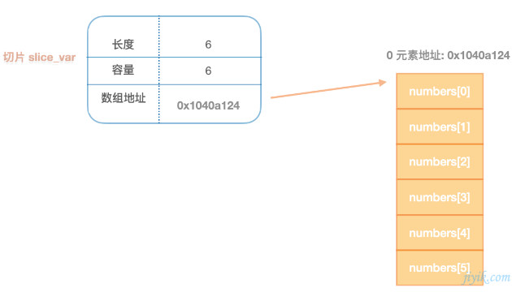
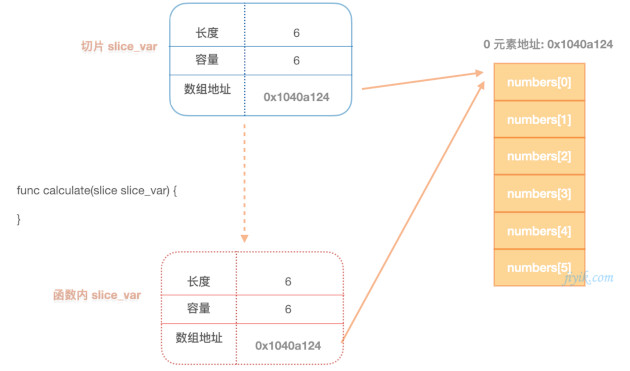
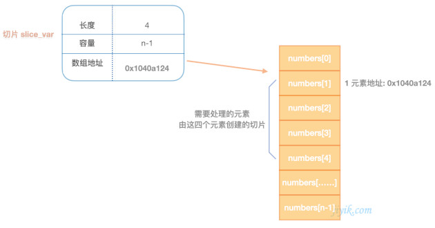
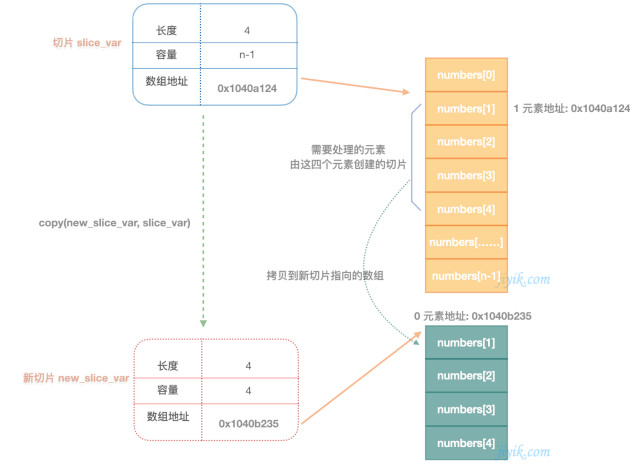

# 一、基础面试题

## （1）go和Java有哪些区别？

Go和Java是两种不同的编程语言，它们在许多方面有着显著的区别。以下是Go和Java之间的一些主要区别：

1. 语言设计和语法：Go的语法相对较简洁和紧凑，强调代码的可读性和易于编写。它具有C风格的语法，使用显式类型声明和关键字来定义变量和函数。Java语法更为冗长，使用较多的关键字和语法结构，支持面向对象编程范式。
2. 并发和并行：Go在语言层面提供了轻量级的协程（goroutine）和通道（channel）机制，用于实现并发编程。它内置了高效的并发原语，并提供了简洁的方式来编写并发代码。相比之下，Java使用线程和锁来实现并发，需要开发人员手动管理线程和同步机制。
3. 内存管理：Go使用垃圾回收器（Garbage Collector）自动管理内存，开发人员不需要手动分配和释放内存。Java也有垃圾回收器，但它的内存管理机制更为复杂，包括堆内存、栈内存和手动的内存释放（如`finalize()`方法）。
4. 依赖管理：Go使用Go Modules进行依赖管理，允许开发人员声明和管理项目的依赖关系，实现版本控制和构建复现性。Java使用Maven或Gradle等构建工具来管理依赖项，通过配置文件（如pom.xml）指定项目的依赖关系。
5. 性能：由于Go的语言设计和运行时环境的特性，它在许多情况下表现出较高的性能和低延迟。相比之下，Java具有更广泛的生态系统和优化工具，可以在不同的场景中实现高性能。
6. 领域应用：Go主要用于构建网络服务和分布式系统，如Web服务器、微服务和容器编排。它在处理并发、高性能和可伸缩性方面表现出色。Java则广泛应用于企业级应用程序开发，包括桌面应用程序、后端服务器和大规模企业应用。

## （2）go里面变量赋值的本质

在Go语言中，变量赋值的本质是将右边表达式的值复制给左边的变量。Go语言中的赋值操作是按值传递的，也就是说变量赋值时，会复制右边表达式的值并将复制的值赋给左边的变量。

对于基本数据类型（如整型、浮点型、布尔型等）和数组类型，变量赋值会直接复制原始值。

例如：

```go
x := 10
y := x // 将x的值复制给y
```

对于引用类型（如切片、映射、通道等）和结构体类型，变量赋值复制的是引用（内存地址），而不是数据本身。

例如：

```go
s1 := []int{1, 2, 3}
s2 := s1 // 复制s1的引用，s1和s2指向同一个底层数组
```

对于结构体类型，赋值操作会复制结构体中的字段的值。

例如：

```go
type Person struct {
    Name string
    Age  int
}

p1 := Person{Name: "Alice", Age: 30}
p2 := p1 // 复制p1的字段值，p2是p1的副本
```

需要注意的是，对于切片、映射、通道和接口类型，它们在底层都是引用类型，赋值操作会复制引用（内存地址），而不是复制数据本身。这意味着对于这些引用类型，复制的变量仍然指向相同的底层数据。

在变量赋值时，还需要注意引用类型的副本会共享相同的底层数据，因此在一个副本上的修改会影响到其他所有副本。要避免这种情况，可以通过切片和映射的拷贝操作来创建一个独立的副本。例如：

```go
s1 := []int{1, 2, 3}
s2 := make([]int, len(s1))
copy(s2, s1) // 创建一个s1的副本s2
```

综上所述，变量赋值的本质是将右边表达式的值复制给左边的变量。对于基本数据类型和数组类型，复制的是原始值本身；对于引用类型和结构体类型，复制的是引用或字段值。在使用引用类型时，需要注意对共享底层数据的修改可能会影响到其他引用副本，可以使用拷贝操作创建独立的副本来避免这种情况。

# 二、channel相关的面试题

1. 什么是channel？它的作用是什么？
2. 如何创建一个channel？如何向channel发送数据和接收数据？
3. channel有缓冲和无缓冲两种类型，它们有什么区别？
4. channel的读取和写入操作是阻塞的吗？如何进行非阻塞读写？
5. 如何关闭一个channel？关闭后是否还能继续向channel发送数据？
6. channel能否作为函数参数传递？如果是，有什么需要注意的地方？
7. 如何避免channel死锁问题？
8. channel和mutex（互斥锁）有什么区别？它们各自适用于什么场景？
9. 在多个goroutine之间如何同步数据的读取和写入？

## （1）make(chan int, 1)  和 make(chan int)有区别吗

`make(chan int, 1)` 和 `make(chan int)` 之间有区别。

1. `make(chan int, 1)` 创建了一个有缓冲的通道，容量为1。这意味着通道可以缓存一个整数元素，即使没有接收方，发送操作也不会被阻塞，直到通道已满。如果没有接收方，发送操作会立即完成。如果通道已满，发送操作会被阻塞，直到有接收方接收数据。这种通道适用于发送方和接收方的速度不一致的情况。
2. `make(chan int)` 创建了一个无缓冲的通道，容量为0。这意味着通道没有缓冲区，发送操作会阻塞直到有接收方接收数据，而接收操作也会阻塞直到有发送方发送数据。这种通道适用于同步操作，即发送方和接收方需要同步地进行数据交换。

因此，根据具体的需求和使用场景，选择适当的通道类型是很重要的。如果需要在发送和接收之间有一定的缓冲空间，可以使用有缓冲通道；如果需要同步操作，确保发送和接收的同步性，可以使用无缓冲通道。

## （2） channel 底层怎么实现的

Go中的channel是一种用于在不同goroutine之间进行通信和同步的基本构造。它可以用于将数据从一个goroutine发送到另一个goroutine，也可以用于实现多个goroutine之间的同步。channel是一种线程安全的数据结构，可以保证多个goroutine之间的数据传输是安全的。

关于channel的内部实现原理，可以简要说明以下几点：

1. channel的底层数据结构：channel底层是由一个带缓冲的队列实现的，当channel是无缓冲的时候，它的队列为空，发送和接收操作会直接阻塞，直到有另一个goroutine准备好接收或发送数据。当channel是有缓冲的时候，它的队列会在缓冲区未满时存储数据，发送和接收操作在缓冲区未满时不会阻塞。
2. channel的同步操作：在没有缓冲的channel上进行发送和接收操作会导致发送方和接收方同步等待，直到两者都准备好，这种同步机制保证了通信的安全性。而在有缓冲的channel上进行发送操作只有在缓冲区满时才会阻塞，接收操作只有在缓冲区为空时才会阻塞。
3. channel的内部锁：channel的实现中使用了内部锁来保证多个goroutine对channel的操作是线程安全的。
4. channel的关闭：可以使用`close()`函数关闭channel，关闭后的channel无法再发送数据，但可以继续接收数据。关闭后的channel如果没有接收完所有数据，接收操作仍然可以继续，但会接收到零值。

## （3）什么是channel？它的作用是什么？

在Go语言中，channel（通道）是一种用于在多个goroutine之间进行通信和同步的特殊数据类型。它可以在一个goroutine中发送数据，而在另一个goroutine中接收数据，实现不同goroutine之间的数据传递和共享。

channel的作用是实现goroutine之间的安全数据交换和通信。在多个goroutine并发执行的情况下，通过channel可以避免数据竞争和资源冲突的问题，有效地进行数据的传递和共享。

channel有两种类型：有缓冲通道和无缓冲通道。

1. 无缓冲通道：没有缓冲区，发送和接收操作是同步的。即发送方发送数据后必须等待接收方接收数据，才能继续执行后面的代码。
2. 有缓冲通道：有一个缓冲区，发送和接收操作是异步的。即发送方发送数据后，不需要等待接收方接收数据即可继续执行后面的代码。

channel的声明和使用如下：

```go
// 无缓冲通道
ch := make(chan int)

// 有缓冲通道，缓冲区大小为3
ch := make(chan int, 3)

// 发送数据到通道
ch <- 42

// 从通道接收数据
x := <-ch
```

在多个goroutine之间使用channel可以有效地实现数据同步和通信，使得并发编程更加简单和安全。通过channel，可以避免共享数据时出现的竞态条件，从而提高代码的可读性和维护性。因此，channel是Go语言并发模型中非常重要的一个特性。

## （4）channel能否作为函数参数传递？如果是，有什么需要注意的地方？

是的，channel可以作为函数的参数进行传递。在Go语言中，channel是一种数据类型，因此可以像其他数据类型一样作为函数的参数传递。

需要注意以下几点：

1. 通道是引用类型：通道是引用类型，传递通道时实际上是传递通道的引用（地址），而不是通道的副本。因此，在函数中对通道的修改会影响到原始通道，和对切片、映射等引用类型的行为类似。
2. 通道是并发安全的：Go语言的通道本身是并发安全的，可以安全地在多个goroutine中进行读写操作。因此，通道作为函数参数传递时，多个goroutine可以同时通过通道进行通信，但要注意避免数据竞争和死锁等问题。
3. 通道是否关闭：在函数中接收通道数据时，应该检查通道是否已经关闭，以避免在已关闭的通道上进行读取而导致panic。

下面是一个示例代码，展示了如何将通道作为函数参数传递：

```go
package main

import (
    "fmt"
)

func sendData(ch chan<- int, data int) {
    ch <- data
}

func receiveData(ch <-chan int) {
    for data := range ch {
        fmt.Println("Received:", data)
    }
}

func main() {
    ch := make(chan int)

    go sendData(ch, 1)
    go sendData(ch, 2)
    go sendData(ch, 3)

    receiveData(ch)

    close(ch)
}
```

在上面的示例代码中，我们定义了两个函数`sendData`和`receiveData`，它们都接收一个通道作为参数。`sendData`函数将数据发送到通道，`receiveData`函数从通道接收数据并进行处理。在`main`函数中，我们创建了一个通道`ch`，并启动多个goroutine通过通道发送数据。然后在`main`函数中，另一个goroutine通过通道接收数据并进行处理。注意在关闭通道之前，我们使用`range`循环遍历通道，以确保在通道被关闭之后，接收端仍然可以处理完剩余的数据。

通过以上示例，我们展示了如何将通道作为函数参数传递，并在多个goroutine之间进行数据传递和通信。当合理使用通道传递数据时，可以很好地实现并发编程中的数据同步和通信。

## （5）go中的channel是可以比较的吗

在 Go 中，`channel` 是可以进行比较操作的。比较 channel 可以用于判断两个 channel 是否指向同一个 channel 实例。

请注意，当比较两个 channel 时，只有在它们都是有效（非 nil）的情况下才会得到有意义的结果。如果一个或两个 channel 是 nil，比较的结果将是无效的。

以下是一个示例代码：

```go
package main

import "fmt"

func main() {
    ch1 := make(chan int)
    ch2 := make(chan int)
    ch3 := ch1

    fmt.Println(ch1 == ch2) // false, ch1和ch2是不同的channel实例
    fmt.Println(ch1 == ch3) // true, ch1和ch3指向同一个channel实例
}
```

在这个例子中，我们创建了两个不同的 channel 实例 `ch1` 和 `ch2`，然后将 `ch1` 的引用赋值给 `ch3`。比较 `ch1` 和 `ch2` 的结果是 `false`，因为它们是两个不同的 channel 实例。而比较 `ch1` 和 `ch3` 的结果是 `true`，因为它们指向同一个 channel 实例。

需要注意的是，在大多数情况下，比较 channel 的操作并不常用，因为通常我们更关心 channel 上的数据传递和同步操作。在实际应用中，对 channel 的比较很少会直接使用。

## （6）如果往一个已经关闭的channel中发送数据，会发生什么

如果往一个已经关闭的 channel 中发送数据，会触发运行时 panic。

当一个 channel 被关闭后，它便不能再用于发送数据，只能用于接收数据。如果你尝试在一个已关闭的 channel 上执行发送操作，Go 运行时系统会检测到这个错误并抛出一个 panic。这样的设计是为了防止在并发环境下出现潜在的数据竞争和不确定性行为。

以下是一个示例代码：

```go
package main

import "fmt"

func main() {
    ch := make(chan int)

    // 关闭 channel
    close(ch)

    // 向已关闭的 channel 发送数据，会导致 panic
    ch <- 42
}
```

在这个例子中，我们先创建了一个 channel `ch`，然后使用 `close()` 函数关闭了这个 channel。接着，我们尝试向已关闭的 channel `ch` 发送数据 `42`，这会导致运行时 panic，输出类似于 "panic: send on closed channel" 的错误信息。

要避免此类错误，在发送数据之前应该先检查 channel 是否已经关闭，可以使用 Go 语言提供的多返回值的方式来实现：

```go
if !closed(ch) {
    ch <- data
}
```

或者在接收数据的一端，使用带有第二个返回值的形式进行检查：

```go
data, ok := <-ch
if ok {
    // 处理接收到的数据
} else {
    // channel 已关闭
}
```

通过这样的方式，你可以避免向已关闭的 channel 发送数据，从而提高代码的健壮性。

# 三、map相关面试题

在Go语言的面试中，关于map的问题也是很常见的。以下是一些可能出现的面试题：

1. map的底层数据结构是什么？map如何实现快速查找元素？
2. map的key可以是哪些类型？有没有限制？
3. map的value可以是哪些类型？有没有限制？
4. map是否支持并发读写？如何安全地在多个goroutine中使用map？
5. map的零值是什么？如何判断一个map是否为nil？
6. 如何初始化一个空的map？有哪些创建map的方法？
7. 如何向map中插入键值对？如何从map中删除键值对？
8. 如何通过key从map中查找元素？如何判断一个key是否存在于map中？
9. map的长度是指什么？如何获取map的长度？
10. map是否支持负索引？为什么？
11. map在并发编程中是否安全？如何避免并发访问map时的竞态条件？
12. map的遍历方式有哪些？有没有固定的遍历顺序？
13. map的迭代顺序是否是随机的？
14. 如何使用map来实现set和计数器？
15. map是否可以作为函数的参数和返回值？

## （1）go中map的底层实现

在Go中，map的底层实现是一个哈希表（hash table），也称为散列表。哈希表是一种用于存储键值对的数据结构，它通过将键映射到哈希值，然后将哈希值映射到数组的索引来快速访问和查找数据。

具体来说，Go中的map是由一个`hmap`结构体表示的，它定义在`runtime/map.go`中，部分结构如下：

```go
type hmap struct {
	count     int        // 当前存储的键值对数量
	flags     uint8      // 状态标志，例如是否是扩容中
	B         uint8      // 桶的大小的移位数，用于计算桶的数量，比如2^B
	noverflow uint16     // 溢出桶的数量，用于解决哈希冲突
	hash0     uint32     // 哈希种子，用于计算哈希值
	buckets   unsafe.Pointer // 指向桶数组的指针
	oldbuckets unsafe.Pointer // 指向扩容前的桶数组的指针，用于迁移数据
}

type bmap struct {
	topbits  [8]uint8 // 桶的最高8位的哈希值，用于快速定位
	keys     [8]keytype // 键数组
	values   [8]valuetype // 值数组
	overflow uintptr // 指向溢出桶的指针，用于解决哈希冲突
}
```

Go的map使用了哈希表的经典实现，具有以下特点：

1. 哈希冲突解决：当两个不同的键映射到相同的哈希值时，Go的map使用链地址法（separate chaining）来解决哈希冲突。即在哈希表中的每个桶里面存储一个链表，哈希值相同的键值对会被放到同一个桶的链表中。
2. 动态扩容：随着键值对的增加，当哈希表的负载因子（键值对数量与桶数量之比）超过一定阈值时，Go的map会进行动态扩容，重新分配更大的桶数组，以减少哈希冲突，保持高效的查找性能。
3. 哈希种子：为了防止哈希攻击，Go的map使用随机种子（哈希种子）来计算哈希值。每次创建map时，都会生成一个随机的哈希种子，并保存在map的hash0字段中。
4. 并发安全：在读取和写入map时，必须保证并发安全。在多个goroutine同时读写map时，需要使用适当的同步机制，例如互斥锁（sync.Mutex）来保护map的并发访问。

总之，Go中的map是一个高效、动态扩容的哈希表实现，可以在常数时间内进行插入、查找和删除操作。但是需要注意在并发场景下的正确使用，避免因为并发访问而引发竞态条件。

## （2）map的key可以是哪些类型？有没有限制？

在Go中，map的key可以是以下几种类型：

1. 所有支持相等运算符（==）的数据类型，例如：整数类型（int、int8、int16、int32、int64）、浮点数类型（float32、float64）、字符串类型（string）、布尔类型（bool）等。

   > **go语言中哪些数据类型是不支持比较的**
   >
   > 在Go语言中，以下数据类型是不支持比较的：
   >
   > 1. 切片（Slice）：切片是引用类型，它们只能和`nil`进行比较，不能直接与其他切片或值进行比较。
   > 2. 映射（Map）：映射也是引用类型，它们只能和`nil`进行比较，不能直接与其他映射或值进行比较。
   > 3. 函数（Function）：函数是引用类型，不能进行比较，只能与`nil`进行比较。
   > 4. 通道（Channel）：通道是引用类型，不能进行比较，只能与`nil`进行比较。
   > 5. 复数（Complex）：复数类型`complex64`和`complex128`是不能直接比较的。
   >
   > 由于上述类型是引用类型，它们的比较可能会导致意外的结果。为了避免混淆和错误，Go语言不支持对这些类型进行比较操作。如果需要对切片、映射、通道或函数进行比较，可以自定义比较函数来进行比较操作。对于复数类型，可以分别比较实部和虚部来进行比较。
   >
   > 其他的基本数据类型如整型、浮点型、字符串、布尔型等都是支持比较的。可以使用`==`、`!=`、`<`、`<=`、`>`、`>=`等运算符进行比较操作。

2. 数组类型、结构体类型和指针类型，只要它们的元素或字段的类型是可比较的，也就是它们本身支持相等运算符。

3. 接口类型，只要它们的动态类型是可比较的。

但是，有一些类型是不允许作为map的key的：

1. 切片类型（slice）：因为切片是动态长度的，不能通过相等运算符进行比较。
2. 函数类型：因为函数是不可比较的。
3. 包含切片或函数的结构体类型：由于切片和函数不可比较，如果结构体包含切片或函数字段，则也不能作为map的key。

值得注意的是，使用结构体类型作为map的key时，只有当结构体的所有字段都是可比较的才可以。如果结构体中包含不可比较的字段（如切片或函数），那么该结构体也不能作为map的key。

## （3）go的map底层实现中有一个bmap数据结构：bmap 就是我们常说的“桶”，桶里面会最多装 8 个 key。为什么每个桶最多装8个key？

Go语言的map底层实现中确实使用了bmap（bucket map）作为一个关键的数据结构，用于处理哈希冲突。每个bmap实际上是一个桶（bucket），可以容纳多个key-value对。而为什么每个桶最多装8个key，则是由Go语言的性能和内存考虑所决定的。

当一个map的大小较小时，Go语言会使用一个小的哈希表作为其底层实现，而不是一个完整的哈希表。这个小的哈希表中有若干个bmap组成，每个bmap是一个桶。每个bmap最多装8个key是因为对于小的map来说，通常有以下几个原因：

1. 空间效率：为了节省内存，采用小的哈希表，并设置较小的桶大小。这样，在大部分情况下，不会浪费大量内存空间。
2. 内存对齐：Go语言中的内存对齐优化可能也是一个原因。较小的桶大小可以保证多个桶存储在同一缓存行（cache line）中，从而减少内存访问的开销，提高访问速度。
3. 冲突处理：对于小的map，哈希冲突的概率较小，因此较小的桶大小（每个桶最多装8个key）足以处理冲突。

需要注意的是，当map中的元素数量增加时，Go语言会动态调整底层的哈希表结构，并逐渐采用更大的桶（bucket），以适应更多的key-value对。

总的来说，每个桶最多装8个key是在性能和空间效率方面的一个平衡考虑，适用于小规模的map，并在map的元素增加时进行动态调整，以保持良好的性能表现。

## （4）map是怎么扩容的

在Go语言中，map在达到一定负载因子（load factor）时会进行扩容。负载因子是指map中已存储的键值对数量与哈希表大小的比值。当负载因子超过一定阈值（通常是0.75），Go语言会触发map的扩容操作。

map的扩容过程如下：

1. 创建一个新的更大的哈希表，新的哈希表大小是当前哈希表大小的两倍。
2. 遍历当前哈希表中的所有桶（bucket）。
3. 将每个桶中的键值对重新计算哈希，并将它们插入到新的哈希表的相应桶中。由于新的哈希表大小是当前的两倍，因此键值对会被重新散列到不同的桶中。
4. 将新的哈希表替换为当前的哈希表，完成扩容操作。

在扩容过程中，由于键值对被重新散列到不同的桶中，可能会导致部分桶变得空闲或者超过8个元素。因此，在新的哈希表中，每个桶中的元素可能有以下几种情况：

- 空桶：某些桶可能变为空，即不含有任何键值对。
- 未溢出桶：有些桶中的元素个数不超过8个，继续保持未溢出状态。
- 溢出桶：有些桶中的元素个数可能超过8个，这些桶会被转换为`overflow`结构，其中包含了一个链表，用于存储溢出的键值对。

扩容操作的目的是为了减少哈希冲突，提高哈希表的性能。通过将哈希表大小扩大两倍，可以使得哈希冲突的概率降低，从而提高查找和插入操作的效率。但需要注意的是，map的扩容会涉及到内存的重新分配和数据复制，因此在扩容时可能会有一定的性能开销。为了避免频繁扩容，使用map时可以适当预估元素数量，并设置合适的容量初始值，以减少扩容次数。

## （5）map的bmap数据结构存放key和value不是把key和value紧挨在一起存放的，而是分别key和value存放在一起，为什么？

`bmap`数据结构在存放key和value时，不是将它们紧挨在一起存放的，而是分别存放在不同的数组中。这个设计是为了优化内存对齐和访问效率。

在Go语言中，`bmap`（bucket map）是`map`底层数据结构中的一个桶（bucket）。每个`bmap`实际上由两个数组组成：

1. key数组：存放了桶中的key。key数组的长度为8，因为每个桶最多装8个key。
2. value数组：存放了桶中的value。value数组的长度也为8，与key数组一一对应。

在设计中，将key和value分别存放在不同的数组中有以下优点：

1. 内存对齐：由于key和value分开存放，每个数组的元素类型是连续存储的，可以有效利用内存对齐优化，减少内存碎片和访问的开销。
2. 内存局部性：由于key和value存放在不同的数组中，可以减少在遍历和查找操作时的缓存冲突，提高访问效率。
3. 拷贝优化：在哈希表的扩容操作时，可以更方便地对key和value进行拷贝，因为它们是分开存放的。

总的来说，将key和value分别存放在不同的数组中是为了优化内存对齐和访问效率，提高map的性能。这也是Go语言的map在性能和内存方面取得较好表现的一个设计选择。

## （6）go语言中map作为函数参数传递

在Go语言中，map可以作为函数的参数进行传递。当将map作为函数参数传递时，实际上是将map的引用（地址）传递给函数，而不是传递map的副本。这意味着在函数内部对map的修改会直接影响到外层函数中传入的原始map。

在函数中使用map作为参数传递，可以实现多个goroutine之间共享数据，同时也要注意在并发访问时保证数据的安全性。

以下是一个示例代码，演示如何将map作为函数参数传递：

```go
package main

import "fmt"

func modifyMap(m map[string]int) {
    m["one"] = 1
    m["two"] = 2
}

func main() {
    m := make(map[string]int)

    modifyMap(m)

    fmt.Println("Map after modification:", m)
}
```

输出结果为：

```
Map after modification: map[one:1 two:2]
```

在上面的示例代码中，我们定义了一个`modifyMap`函数，它接收一个map作为参数。在`modifyMap`函数中，我们对传入的map进行了修改，增加了两个键值对。在`main`函数中，我们创建了一个map`m`，然后将它作为参数传递给`modifyMap`函数。在函数中对map进行的修改会直接影响到外层函数中传入的原始map，因此在输出结果中，我们可以看到map`m`已经发生了变化。

需要注意的是，由于map是引用类型，当多个goroutine同时访问和修改同一个map时可能会产生竞态条件和数据竞争问题。在并发编程中使用map时，应该考虑使用互斥锁等机制来保证map的安全访问，以避免出现并发访问问题。

## （7）如果一个协程在读map，另一个协程在写map，会导致什么问题

当一个协程在读取Map，而另一个协程在同时写入Map时，可能会导致数据竞争（data race）问题。数据竞争是指多个协程同时访问同一个共享变量，并且至少有一个协程对该变量进行了写操作，而且没有任何同步机制来保护这些访问，从而导致未定义的行为。

具体地说，当一个协程在读Map时，如果另一个协程在同时写入Map，可能会导致以下问题：

1. 读脏数据：读协程可能读取到正在被写入的数据，导致读取的数据是不一致或不正确的。
2. 写覆盖数据：写协程可能覆盖正在被读取的数据，导致读取的数据丢失或被修改。
3. 其他未定义的行为：数据竞争可能导致其他未定义的行为，如panic、程序崩溃等。

为了避免数据竞争，应该采取适当的同步机制来保护Map的并发访问。可以使用互斥锁（`sync.Mutex`）、读写锁（`sync.RWMutex`）或并发安全的Map（如`sync.Map`）等方法来确保在同时读写Map时不会出现竞争条件，从而保证程序的正确性和稳定性。

## （8）golang 中的map为什么说是非线程安全的 | [link](https://juejin.cn/post/6859918915586228238)

golang的map 跟hash map 是一样的，但是go的分配过程又有自己独特的方式。可找下golang map 原理的文章看下。但是为什么说map 是非线程安全的呢？

因为hash map 的内存是按照2的倍数开辟的，当前面开辟的内存不够的时候，会新开辟一段内存，将原来内存的数据转移到新的内存块中，这个过程是没有加锁的，如果这个时候同时有个读的线程过来获取这块内存数据，就会出现安全问题。

所以多个goroutine同时操作map的时候可能会出现concurrent map writes 的问题，自己实现一个加好读写锁的map结构，建议直接用golang 的sync.Map。性能好，同时简单易用。

# 四、slice相关的面试题

在Go语言的面试中，关于切片的问题是很常见的。以下是一些可能出现的面试题：

1. 切片和数组的区别是什么？什么情况下使用切片，什么情况下使用数组？
2. 切片的底层数据结构是什么？如何扩容切片的容量？
3. 切片的长度和容量有什么区别？如何获取切片的长度和容量？
4. 切片是否可比较？为什么？
5. 如何判断两个切片是否相等？
6. 如何在切片中插入和删除元素？
7. 切片是否支持负索引？为什么？
8. 切片的追加操作会发生什么？如何避免在追加时重新分配底层数组内存？
9. 如何遍历切片？有哪些方法可以遍历切片的元素？
10. 切片在函数间传递时是传值还是传引用？
11. 如何使用切片进行栈和队列的操作？
12. 切片是否可以作为函数的参数和返回值？
13. 切片的零值是什么？如何判断一个切片是否为nil？
14. 切片在并发编程中是否安全？
15. 切片是否支持多维？如何创建多维切片？

## （1）切片基础

### 1）切片的容量

```go
data := []int{11, 9, 1, 5, 3, 0, 22, 4, 6, 7, 8}
s1 := data[2:5]
s2 := s1[2:6:7]
fmt.Println(len(data), cap(data)) // 11 11
fmt.Println(len(s1), cap(s1)) // 3 9
fmt.Println(len(s2), cap(s2)) // 4 5
```

- `s1 := data[2:5]`：

  如果以这种方式创建切片，则新切片的容量默认是原切片的容量减去起始索引，即`len(data) - startIndex`

  `s1 := data[2:5]` 是对切片 `data` 进行切片操作的表达式。它的意思是从 `data` 切片的索引位置2开始（包含索引2对应的元素），一直到索引位置5结束（不包含索引5对应的元素），构成一个新的切片 `s1`。

  切片表达式的一般形式为 `slice[low:high]`，其中 `low` 表示起始索引（包含该索引对应的元素），`high` 表示结束索引（不包含该索引对应的元素）。通过这个表达式可以创建一个新的切片，其中包含了原始切片 `data` 中指定范围的元素。

  需要注意的是，切片表达式中的索引位置不能超过原始切片的边界。即 `low` 和 `high` 都必须在 `0` 到 `len(data)` 的范围之内。否则会导致运行时错误。

- `s2 := s1[2:6:7]`：

  这个操作是Go语言中对slice进行切片（slicing）的一种特殊形式。`s1[2:6:7]`的意思是从slice `s1` 的索引位置2开始（包含索引2），一直到索引位置6结束（不包含索引6），构成一个新的slice `s2`，同时限制了新slice `s2` 的容量为7-2=5。

  一般的slice切片操作是使用`s1[start:end]`来指定切片范围，其中`start`表示起始索引（包含该索引对应的元素），`end`表示结束索引（不包含该索引对应的元素）。但是，在`start`和`end`后面再加上一个`capacity`参数，就可以限制新slice的容量。这种操作会创建一个新的slice，并且新slice的容量会限制在`capacity - start`。.

### 2）一个切片传递到函数中，会出现什么情况

**一个切片被传递到一个函数中，函数对切片执行append操作，出现什么情况？**

在Go语言中，如果将一个slice传递到一个函数里面，并在函数内部进行append操作，可能会出现以下几种情况：

1. 原始slice不变： 如果在函数内部对传递的slice进行append操作时，未超出原始slice的容量（即在底层数组的长度范围内进行append），那么原始slice不会发生改变。这是因为slice是引用类型，传递给函数的是slice的地址，函数内部对slice的修改会影响到原始slice。
2. 原始slice被改变： 如果在函数内部对传递的slice进行append操作时，超出了原始slice的容量，会导致重新分配底层数组，进而改变原始slice。这是因为append操作可能会使得底层数组的容量不足，Go语言会重新分配更大的底层数组，并将原始数据复制到新的底层数组中。此时，原始slice会指向新的底层数组。
3. 修改传递的slice对应的数组，影响所有引用该数组的slice： 在Go语言中，多个slice可能共享相同的底层数组。如果在函数内部对传递的slice进行append操作，导致重新分配底层数组，那么所有引用该底层数组的slice都会受到影响。这是因为所有slice都指向同一个底层数组。

为了避免在函数内部影响原始slice，可以采用以下方式之一：

1. 在函数内部使用copy函数： 使用`copy`函数可以将原始slice复制一份，然后在新的slice上进行append操作，不会影响原始slice。
2. 在函数内部返回新的slice： 将append后的slice作为函数的返回值，而不是直接修改传递的slice，可以保持原始slice的不变性。

总之，在函数内部对传递的slice进行append操作时，需要谨慎处理，特别是当底层数组可能被重新分配时，可能会对其他引用该数组的slice造成影响。采用copy函数或返回新的slice是一种常见的避免影响原始slice的方式。

```go
func Test() {
	data := []int{11, 9, 1, 5, 3, 0, 22, 4, 6, 7, 8}
	s1 := data[2:5]
	s2 := s1[2:6:7]
	fmt.Println(s1, len(s1), cap(s1)) // [1 5 3] 3 9
	fmt.Println(s2, len(s2), cap(s2)) // [3 0 22 4] 4 5
	app(s1)
	app(s2)
	fmt.Println(s1, len(s1), cap(s1))       // [1 5 3] 3 9
	fmt.Println(s2, len(s2), cap(s2))       // [3 111 222 4] 4 5
	fmt.Println(data, len(data), cap(data)) // [11 9 1 5 3 111 222 4 111 7 8] 11 11
}

func app(s []int) { 
	s = append(s, 111)
	s = append(s, 222)
}
```

### 3）ans := []rune{} 和 ans := make([]rune, 0)等价吗

是的，`ans := []rune{}` 和 `ans := make([]rune, 0)` 是等价的。两者都会创建一个空的 `[]rune` 类型切片，其长度为0，即不包含任何元素。

在Go语言中，切片是引用类型，可以使用两种方式来创建一个空切片：

1. 使用字面量语法：`ans := []rune{}`
2. 使用 `make` 函数：`ans := make([]rune, 0)`

两者的结果是相同的，都会得到一个长度为0的空切片。在实际使用中，可以根据个人喜好和习惯来选择使用哪种方式。

需要注意的是，这两种方式创建的空切片都是非 `nil` 的，即它们都是合法的切片，可以进行切片操作，而不会引发空指针异常。

## （2）切片和数组的区别是什么？什么情况下使用切片，什么情况下使用数组？ | [link](https://golang.design/go-questions/slice/vs-array/)

切片（slice）和数组（array）是Go语言中两种不同的数据类型，它们在使用方式和特性上有一些区别。

1. 大小固定 vs 大小可变：
   - 数组是一个大小固定的数据结构，一旦创建后，其长度就不能改变。数组的长度是数组类型的一部分，例如 `[5]int` 和 `[10]int` 是不同的数组类型。
   - 切片是一个大小可变的数据结构，它可以动态增长或缩减。切片是对底层数组的一个引用，并且长度可以在运行时进行修改。
2. 值传递 vs 引用传递：
   - 数组在作为函数参数传递时，是按值传递的，即函数内部对数组的修改不会影响到原始数组。
   - 切片在作为函数参数传递时，是按引用传递的，函数内部对切片的修改会影响到原始切片。
3. 初始化方式：
   - 数组的初始化可以通过指定具体的元素值进行初始化，例如 `[3]int{1, 2, 3}`。
   - 切片可以通过切片表达式创建，例如 `s := arr[1:4]`。
4. 动态性：
   - 数组的大小固定，无法在运行时改变大小。
   - 切片是动态可增长的，可以根据需要动态改变大小。

通常情况下，使用切片比数组更为灵活和方便。切片适用于需要动态改变大小的情况，以及在函数间传递数据时希望避免复制大量数据。而数组适用于固定大小且不需要动态改变大小的情况，或者在需要确保数据大小不变的情况下使用。

使用切片的常见场景包括：

1. 动态数组：需要根据运行时的需求改变数组大小。
2. 大数据集合：在处理大量数据时，避免复制大量数据，使用切片作为函数参数传递。
3. 遍历、过滤和转换：对数组或切片进行遍历、过滤和转换操作。

使用数组的常见场景包括：

1. 固定大小的集合：在明确大小且不需要动态改变的情况下使用。
2. 确定大小：数组在编译时需要确定大小的情况下更加合适。
3. 程序初始化：在程序启动时进行初始化，以确保固定大小的数据。

## （3）切片是可以比较的吗？为什么

在Go语言中，切片是不可比较的。切片是引用类型，包含指向底层数组的指针、切片的长度和容量。由于切片是动态长度的，即可以动态增长或缩减，因此在切片的比较过程中可能涉及到多个底层数组的元素，这使得切片的比较变得复杂。

在Go语言中，切片的比较是不允许的，因为切片的底层数据可能在内存中的不同位置，即使它们的元素相同，它们的指针地址也不相同。这就导致了在比较两个切片时，无法简单地通过比较指针地址或元素值来确定它们是否相等。

如果需要判断两个切片是否包含相同的元素，可以通过遍历切片的元素逐个比较来实现，但不能直接通过 `==` 操作符来比较整个切片。例如，可以使用循环或者使用reflect包来编写一个函数来判断两个切片是否相等，但是不能直接使用 `s1 == s2` 来判断两个切片是否相等。

总结：在Go语言中，切片是不可比较的，不能直接使用 `==` 操作符来比较两个切片是否相等，需要使用其他方法来进行切片的比较。

## （4）切片的底层数据结构是什么？如何扩容切片的容量？

切片（slice）的底层数据结构由三个部分组成：

1. 指向底层数组的指针（Pointer）：指向切片对应的底层数组的起始位置。
2. 切片的长度（Length）：表示切片中包含的元素个数。
3. 切片的容量（Capacity）：表示底层数组从切片的起始位置到末尾位置的元素个数。

切片的底层数据结构可以表示为：`[Pointer, Length, Capacity]`。

切片的容量是指底层数组从切片的起始位置到末尾位置的元素个数。在Go语言中，切片是动态可变的，当切片需要扩容时，Go语言会自动进行扩容。切片的扩容过程如下：

1. 计算新的容量（New Capacity）： 当使用`append`函数向切片中追加元素时，Go语言会先计算新的容量。如果当前容量小于1024，新容量为原容量的2倍。如果当前容量大于等于1024，新容量为原容量的1.25倍。新容量必须大于当前的长度和所需的容量，如果小于这两者的较大值，Go语言会按需分配更大的容量。
2. 分配新的底层数组： 根据新的容量，Go语言会分配一个新的更大的底层数组。
3. 复制数据： 将原始切片中的数据复制到新的底层数组中。
4. 返回新的切片： 返回一个新的切片，指向新的底层数组，并且长度等于原始切片的长度加上追加的元素个数。

在切片扩容的过程中，由于涉及到内存的重新分配和数据复制，可能会产生一定的性能开销。为了避免频繁的扩容操作，建议在创建切片时就预估所需的容量大小，提前分配足够的容量，从而减少扩容次数，提高性能。

### 1）切片的容量是怎么增长的

一般都是在向 slice 追加了元素之后，才会引起扩容。追加元素调用的是 `append` 函数。

先来看看 `append` 函数的原型：

```go
func append(slice []Type, elems ...Type) []Type `
```

append 函数的参数长度可变，因此可以追加多个值到 slice 中，还可以用 `...` 传入 slice，直接追加一个切片。

```go
slice = append(slice, elem1, elem2) slice = append(slice, anotherSlice...) 
```

`append`函数返回值是一个新的slice，Go编译器不允许调用了 append 函数后不使用返回值。

```go
append(slice, elem1, elem2) append(slice, anotherSlice...)
```

所以上面的用法是错的，不能编译通过。

使用 append 可以向 slice 追加元素，实际上是往底层数组添加元素。但是底层数组的长度是固定的，如果索引 `len-1` 所指向的元素已经是底层数组的最后一个元素，就没法再添加了。

这时，slice 会迁移到新的内存位置，新底层数组的长度也会增加，这样就可以放置新增的元素。同时，为了应对未来可能再次发生的 append 操作，新的底层数组的长度，也就是新 `slice` 的容量是留了一定的 `buffer` 的。否则，每次添加元素的时候，都会发生迁移，成本太高。

新 slice 预留的 `buffer` 大小是有一定规律的。在golang1.18版本更新之前网上大多数的文章都是这样描述slice的扩容策略的：

> 当原 slice 容量小于 `1024` 的时候，新 slice 容量变成原来的 `2` 倍；原 slice 容量超过 `1024`，新 slice 容量变成原来的`1.25`倍。

在1.18版本更新之后，slice的扩容策略变为了：

> 当原slice容量(oldcap)小于256的时候，新slice(newcap)容量为原来的2倍；原slice容量超过256，新slice容量newcap = oldcap+(oldcap+3*256)/4

为了说明上面的规律，我写了一小段玩具代码：

```go
package main

import "fmt"

func main() {
	s := make([]int, 0)

	oldCap := cap(s)

	for i := 0; i < 2048; i++ {
		s = append(s, i)

		newCap := cap(s)

		if newCap != oldCap {
			fmt.Printf("[%d -> %4d] cap = %-4d  |  after append %-4d  cap = %-4d\n", 0, i-1, oldCap, i, newCap)
			oldCap = newCap
		}
	}
}
```

我先创建了一个空的 `slice`，然后，在一个循环里不断往里面 `append` 新的元素。然后记录容量的变化，并且每当容量发生变化的时候，记录下老的容量，以及添加完元素之后的容量，同时记下此时 `slice` 里的元素。这样，我就可以观察，新老 `slice` 的容量变化情况，从而找出规律。

运行结果(1.18版本之前)：

```
[0 ->   -1] cap = 0     |  after append 0     cap = 1   
[0 ->    0] cap = 1     |  after append 1     cap = 2   
[0 ->    1] cap = 2     |  after append 2     cap = 4   
[0 ->    3] cap = 4     |  after append 4     cap = 8   
[0 ->    7] cap = 8     |  after append 8     cap = 16  
[0 ->   15] cap = 16    |  after append 16    cap = 32  
[0 ->   31] cap = 32    |  after append 32    cap = 64  
[0 ->   63] cap = 64    |  after append 64    cap = 128 
[0 ->  127] cap = 128   |  after append 128   cap = 256 
[0 ->  255] cap = 256   |  after append 256   cap = 512 
[0 ->  511] cap = 512   |  after append 512   cap = 1024
[0 -> 1023] cap = 1024  |  after append 1024  cap = 1280
[0 -> 1279] cap = 1280  |  after append 1280  cap = 1696
[0 -> 1695] cap = 1696  |  after append 1696  cap = 2304
```

运行结果(1.18版本)：

```
[0 ->   -1] cap = 0     |  after append 0     cap = 1
[0 ->    0] cap = 1     |  after append 1     cap = 2   
[0 ->    1] cap = 2     |  after append 2     cap = 4   
[0 ->    3] cap = 4     |  after append 4     cap = 8   
[0 ->    7] cap = 8     |  after append 8     cap = 16  
[0 ->   15] cap = 16    |  after append 16    cap = 32  
[0 ->   31] cap = 32    |  after append 32    cap = 64  
[0 ->   63] cap = 64    |  after append 64    cap = 128 
[0 ->  127] cap = 128   |  after append 128   cap = 256 
[0 ->  255] cap = 256   |  after append 256   cap = 512 
[0 ->  511] cap = 512   |  after append 512   cap = 848 
[0 ->  847] cap = 848   |  after append 848   cap = 1280
[0 -> 1279] cap = 1280  |  after append 1280  cap = 1792
[0 -> 1791] cap = 1792  |  after append 1792  cap = 2560
```

根据上面的结果我们可以看出在`1.18`版本之前：

在原来的slice容量`oldcap`小于1024的时候，新 slice 的容量`newcap`的确是`oldcap`的2倍。

但是，当`oldcap`大于等于 `1024` 的时候，情况就有变化了。当向 slice 中添加元素 `1280` 的时候，原来的slice 的容量为 `1280`，之后`newcap`变成了 `1696`，两者并不是 `1.25` 倍的关系（1696/1280=1.325）。添加完 `1696` 后，新的容量 `2304` 当然也不是 `1696` 的 `1.25` 倍。

在`1.18`版本之后：

在原来的slice 容量`oldcap`小于256的时候，新 slice 的容量`newcap`的确是`oldcap` 的2倍。

但是，当`oldcap`容量大于等于 `256` 的时候，情况就有变化了。当向 slice 中添加元素 `512` 的时候，老 slice 的容量为 `512`，之后变成了 `8`48，两者并没有符合`newcap = oldcap+(oldcap+3*256)/4` 的策略（512+（512+3*256）/4）=832。添加完 `848` 后，新的容量 `1280` 当然也不是 按照之前策略所计算出的的1252。

难道现在网上各种文章中的扩容策略并不是正确的吗。我们直接搬出源码：源码面前，了无秘密。

从前面汇编代码我们也看到了，向 slice 追加元素的时候，若容量不够，会调用 `growslice` 函数，所以我们直接看它的代码。

**golang版本1.9.5**

```go
// go 1.9.5 src/runtime/slice.go:82
func growslice(et *_type, old slice, cap int) slice {
    // ……
    newcap := old.cap
	doublecap := newcap + newcap
	if cap > doublecap {
		newcap = cap
	} else {
		if old.len < 1024 {
			newcap = doublecap
		} else {
			for newcap < cap {
				newcap += newcap / 4
			}
		}
	}
	// ……
	
	capmem = roundupsize(uintptr(newcap) * ptrSize)
	newcap = int(capmem / ptrSize)
}
```

**golang版本1.18**

```go
// go 1.18 src/runtime/slice.go:178
func growslice(et *_type, old slice, cap int) slice {
    // ……
    newcap := old.cap
	doublecap := newcap + newcap
	if cap > doublecap {
		newcap = cap
	} else {
		const threshold = 256
		if old.cap < threshold {
			newcap = doublecap
		} else {
			for 0 < newcap && newcap < cap {
                // Transition from growing 2x for small slices
				// to growing 1.25x for large slices. This formula
				// gives a smooth-ish transition between the two.
				newcap += (newcap + 3*threshold) / 4
			}
			if newcap <= 0 {
				newcap = cap
			}
		}
	}
	// ……
    
	capmem = roundupsize(uintptr(newcap) * ptrSize)
	newcap = int(capmem / ptrSize)
}
```

看到了吗？如果只看前半部分，现在网上各种文章里说的 `newcap` 的规律是对的。现实是，后半部分还对 `newcap` 作了一个`内存对齐`，这个和内存分配策略相关。进行内存对齐之后，新 slice 的容量是要 `大于等于` 按照前半部分生成的`newcap`。

之后，向 Go 内存管理器申请内存，将老 slice 中的数据复制过去，并且将 append 的元素添加到新的底层数组中。

最后，向 `growslice` 函数调用者返回一个新的 slice，这个 slice 的长度并没有变化，而容量却增大了。

【引申1】

来看一个例子，来源于[这里](https://jiajunhuang.com/articles/2017_07_18-golang_slice.md.html)

```go
package main

import "fmt"

func main() {
    s := []int{5}
    s = append(s, 7)
    s = append(s, 9)
    x := append(s, 11)
    y := append(s, 12)
    fmt.Println(s, x, y)
}
```

| 代码               | 切片对应状态                                                 |
| ------------------ | ------------------------------------------------------------ |
| s := []int{5}      | s 只有一个元素，`[5]`                                        |
| s = append(s, 7)   | s 扩容，容量变为2，`[5, 7]`                                  |
| s = append(s, 9)   | s 扩容，容量变为4，`[5, 7, 9]`。注意，这时 s 长度是3，只有3个元素 |
| x := append(s, 11) | 由于 s 的底层数组仍然有空间，因此并不会扩容。这样，底层数组就变成了 `[5, 7, 9, 11]`。注意，此时 s = `[5, 7, 9]`，容量为4；x = `[5, 7, 9, 11]`，容量为4。这里 s 不变 |
| y := append(s, 12) | 这里还是在 s 元素的尾部追加元素，由于 s 的长度为3，容量为4，所以直接在底层数组索引为3的地方填上12。结果：s = `[5, 7, 9]`，y = `[5, 7, 9, 12]`，x = `[5, 7, 9, 12]`，x，y 的长度均为4，容量也均为4 |

所以最后程序的执行结果是：

```go
[5 7 9] [5 7 9 12] [5 7 9 12]
```

这里要注意的是，append函数执行完后，返回的是一个全新的 slice，并且对传入的 slice 并不影响。

【引申2】

关于 `append`，我们最后来看一个例子，来源于 [Golang Slice的扩容规则](https://jodezer.github.io/2017/05/golangSlice的扩容规则)。

```go
package main

import "fmt"

func main() {
	s := []int{1,2}
	s = append(s,4,5,6)
	fmt.Printf("len=%d, cap=%d",len(s),cap(s))
}
```

运行结果是：

```go
len=5, cap=6
```

如果按网上各种文章中总结的那样：小于原 slice 长度小于 1024 的时候，容量每次增加 1 倍。添加元素 4 的时候，容量变为4；添加元素 5 的时候不变；添加元素 6 的时候容量增加 1 倍，变成 8。

那上面代码的运行结果就是：

```go
len=5, cap=8
```

这是错误的！我们来仔细看看，为什么会这样，再次搬出代码：

```go
// go 1.9.5 src/runtime/slice.go:82
func growslice(et *_type, old slice, cap int) slice {
    // ……
    newcap := old.cap
	doublecap := newcap + newcap
	if cap > doublecap {
		newcap = cap
	} else {
		// ……
	}
	// ……
	
	capmem = roundupsize(uintptr(newcap) * ptrSize)
	newcap = int(capmem / ptrSize)
}
```

这个函数的参数依次是 `元素的类型，老的 slice，新 slice 最小求的容量`。

例子中 `s` 原来只有 2 个元素，`len` 和 `cap` 都为 2，`append` 了三个元素后，长度变为 5，容量最小要变成 5，即调用 `growslice` 函数时，传入的第三个参数应该为 5。即 `cap=5`。而一方面，`doublecap` 是原 `slice`容量的 2 倍，等于 4。满足第一个 `if` 条件，所以 `newcap` 变成了 5。

接着调用了 `roundupsize` 函数，传入 40。（代码中ptrSize是指一个指针的大小，在64位机上是8）

我们再看内存对齐，搬出 `roundupsize` 函数的代码：

```go
// src/runtime/msize.go:13
func roundupsize(size uintptr) uintptr {
	if size < _MaxSmallSize {
		if size <= smallSizeMax-8 {
			return uintptr(class_to_size[size_to_class8[(size+smallSizeDiv-1)/smallSizeDiv]])
		} else {
			//……
		}
	}
    //……
}

const _MaxSmallSize = 32768
const smallSizeMax = 1024
const smallSizeDiv = 8
```

很明显，我们最终将返回这个式子的结果：

```go
class_to_size[size_to_class8[(size+smallSizeDiv-1)/smallSizeDiv]]
```

这是 `Go` 源码中有关内存分配的两个 `slice`。`class_to_size`通过 `spanClass`获取 `span`划分的 `object`大小。而 `size_to_class8` 表示通过 `size` 获取它的 `spanClass`。

```go
var size_to_class8 = [smallSizeMax/smallSizeDiv + 1]uint8{0, 1, 2, 3, 4, 5, 5, 6, 6, 7, 7, 8, 8, 9, 9, 10, 10, 11, 11, 12, 12, 13, 13, 14, 14, 15, 15, 16, 16, 17, 17, 18, 18, 19, 19, 19, 19, 20, 20, 20, 20, 21, 21, 21, 21, 22, 22, 22, 22, 23, 23, 23, 23, 24, 24, 24, 24, 25, 25, 25, 25, 26, 26, 26, 26, 27, 27, 27, 27, 27, 27, 27, 27, 28, 28, 28, 28, 28, 28, 28, 28, 29, 29, 29, 29, 29, 29, 29, 29, 30, 30, 30, 30, 30, 30, 30, 30, 31, 31, 31, 31, 31, 31, 31, 31, 31, 31, 31, 31, 31, 31, 31, 31, 32, 32, 32, 32, 32, 32, 32, 32, 32, 32, 32, 32, 32, 32, 32, 32} 
var class_to_size = [_NumSizeClasses]uint16{0, 8, 16, 24, 32, 48, 64, 80, 96, 112, 128, 144, 160, 176, 192, 208, 224, 240, 256, 288, 320, 352, 384, 416, 448, 480, 512, 576, 640, 704, 768, 896, 1024, 1152, 1280, 1408, 1536, 1792, 2048, 2304, 2688, 3072, 3200, 3456, 4096, 4864, 5376, 6144, 6528, 6784, 6912, 8192, 9472, 9728, 10240, 10880, 12288, 13568, 14336, 16384, 18432, 19072, 20480, 21760, 24576, 27264, 28672, 32768}
```

我们传进去的 `size` 等于 40。所以 `(size+smallSizeDiv-1)/smallSizeDiv = 5`；获取 `size_to_class8` 数组中索引为 `5` 的元素为 `5`；获取 `class_to_size` 中索引为 `5` 的元素为 `48`。

最终，新的 slice 的容量为 `6`：

```go
newcap = int(capmem / ptrSize) // 6
```

至于，上面的两个`魔法数组`的由来，就不展开了。

【引申2】 向一个nil的slice添加元素会发生什么？为什么？

其实 `nil slice` 或者 `empty slice` 都是可以通过调用 append 函数来获得底层数组的扩容。最终都是调用 `mallocgc` 来向 Go 的内存管理器申请到一块内存，然后再赋给原来的`nil slice` 或 `empty slice`，然后摇身一变，成为“真正”的 `slice` 了。

## （5）切片的长度和容量有什么区别？如何获取切片的长度和容量？

切片的长度（Length）是指切片中当前包含的元素个数，而切片的容量（Capacity）是指底层数组从切片的起始位置到末尾位置的元素个数。切片的长度和容量可能不相等，因为切片可以是动态可变的，当追加元素到切片时，其长度会增加，但容量不一定会增加。

如何获取切片的长度和容量：

在Go语言中，可以使用内置函数`len()`获取切片的长度，使用内置函数`cap()`获取切片的容量。例如：

```go
package main

import "fmt"

func main() {
    slice := []int{1, 2, 3, 4, 5}
    fmt.Println("切片的长度:", len(slice))
    fmt.Println("切片的容量:", cap(slice))
}
```

输出结果为：

```
切片的长度: 5
切片的容量: 5
```

在这个例子中，切片`slice`的长度和容量都为5，因为它包含了5个元素，并且底层数组的容量也为5。

## （6）如何判断两个切片是否相等？

在Go语言中，判断两个切片是否相等，需要逐个比较切片中的元素。因为切片是引用类型，直接使用 `==` 操作符比较两个切片时，比较的是切片的地址，而不是切片中的元素。所以，我们需要自己编写函数来判断两个切片的元素是否相等。

以下是一个示例代码，用于判断两个切片是否相等：

```go
package main

import "fmt"

// 判断两个切片是否相等
func areSlicesEqual(s1, s2 []int) bool {
    if len(s1) != len(s2) {
        return false
    }

    for i := range s1 {
        if s1[i] != s2[i] {
            return false
        }
    }

    return true
}

func main() {
    slice1 := []int{1, 2, 3, 4, 5}
    slice2 := []int{1, 2, 3, 4, 5}
    slice3 := []int{1, 2, 3, 4, 6}

    fmt.Println("slice1 和 slice2 是否相等:", areSlicesEqual(slice1, slice2))
    fmt.Println("slice1 和 slice3 是否相等:", areSlicesEqual(slice1, slice3))
}
```

输出结果为：

```
slice1 和 slice2 是否相等: true
slice1 和 slice3 是否相等: false
```

在上面的示例代码中，我们定义了一个名为`areSlicesEqual`的函数，用于判断两个切片`s1`和`s2`是否相等。首先比较两个切片的长度，如果长度不相等，则直接返回`false`。然后逐个比较两个切片中的元素，如果任意一个元素不相等，就返回`false`。如果所有元素都相等，则返回`true`，表示两个切片相等。

注意，上面的示例代码仅适用于切片中存储的是可比较类型的元素。如果切片中存储的是复杂的结构体或其他不可比较类型的元素，比较操作可能需要自定义相应的比较函数。

## （7）切片是否支持负索引？为什么？

在Go语言中，切片不支持负索引。切片的索引必须是非负整数，即大于等于0的整数。

切片的设计目标是提供一种便捷的方式来访问底层数组的子集，并且具有动态可变的特性。负索引在切片的设计中并不符合这些特点。

理由如下：

1. 语法一致性：Go语言遵循C风格的数组索引语法，即使用非负整数作为数组和切片的索引。如果支持负索引，将违背了这一一致性。
2. 切片的底层实现：切片是对底层数组的一个引用，它的索引和长度都是从底层数组的起始位置算起的偏移量。负索引会导致从数组的末尾开始计算，与切片的底层实现不符。
3. 切片的可变性：切片是动态可变的，可以根据需要动态增长或缩减，负索引在切片的动态调整中会带来复杂性和不确定性。

因此，为了保持一致性、简化设计和使用，并避免潜在的复杂性，Go语言选择不支持负索引。在使用切片时，应该始终使用非负整数作为索引，并根据需要进行合法性检查，以确保索引在切片的有效范围内。

## （8）切片的追加操作会发生什么？如何避免在追加时重新分配底层数组内存？

切片的追加操作是通过内置函数`append`来实现的。在进行切片追加操作时，可能会发生底层数组的重新分配和数据复制。

当切片进行追加操作时，如果追加的元素个数超过了当前切片的容量，Go语言会重新分配一个更大的底层数组，并将原始数据复制到新的底层数组中。这是因为切片的底层数组是固定大小的，当追加元素超过容量时，需要重新分配更大的内存空间来容纳新的元素。

为了避免在追加时重新分配底层数组内存，可以采用以下方法：

1. 预分配足够的容量：在创建切片时，可以通过指定初始容量来预分配足够的内存空间。这样在追加元素时，可以避免频繁的扩容操作。例如，通过 `make([]T, length, capacity)` 创建切片时，可以指定初始容量为 `capacity`。
2. 使用 copy 函数：可以通过 copy 函数将原始切片的数据复制到新的切片中，然后在新切片上进行追加操作。这样可以避免对原始切片进行修改，确保原始数据的完整性。

以下是使用上述方法避免重新分配底层数组内存的示例代码：

```go
package main

import "fmt"

func main() {
    originalSlice := []int{1, 2, 3, 4, 5}
    
    // 方法1：预分配足够的容量
    newSlice1 := make([]int, len(originalSlice), len(originalSlice)*2)
    copy(newSlice1, originalSlice)
    newSlice1 = append(newSlice1, 6, 7, 8)

    // 方法2：使用 copy 函数
    newSlice2 := make([]int, len(originalSlice))
    copy(newSlice2, originalSlice)
    newSlice2 = append(newSlice2, 6, 7, 8)

    fmt.Println("原始切片:", originalSlice)
    fmt.Println("方法1：追加后的切片:", newSlice1)
    fmt.Println("方法2：追加后的切片:", newSlice2)
}
```

输出结果为：

```
原始切片: [1 2 3 4 5]
方法1：追加后的切片: [1 2 3 4 5 6 7 8]
方法2：追加后的切片: [1 2 3 4 5 6 7 8]
```

在上面的示例代码中，我们通过预分配足够的容量或使用 copy 函数，在追加元素时避免了重新分配底层数组内存。这样可以提高性能并减少不必要的内存分配和复制操作。

## （9）切片在函数间传递时是传值还是传引用？| [link](https://www.jiyik.com/w/go/go-slice-parameter)

本章节我们介绍将切片作为参数传递给函数，切片作为函数的参数和数组或其他数据类型作为参数有很大的不同。

首先我们来看，其实切片是一个对数组的结构体的表示。在Go语言中，其底层表示如下所示

```go
type slice struct {  
    Length        int
    Capacity      int
    ZerothElement *byte
}
```

其实就是一个结构体。切片包含长度、容量和指向数组第零个元素的指针。


Go 切片的结构体


**当切片传递给函数时，即使它是按值传递的**，指针变量也将引用相同的底层数组。因此，当切片作为参数传递给函数时，函数内部所做的更改在函数外部也是可见的。




下面让我们通过一段代码来验证一下

```go
package main

import (  
    "fmt"
)

func subtactOne(numbers []int) {  
    for i := range numbers {
        numbers[i] -= 2
    }

}
func main() {  
    nos := []int{8, 7, 6}
    fmt.Println("函数调用之前的slice: ", nos)
    subtactOne(nos)                               // 函数修改slice
    fmt.Println("函数调用之后的slice: ", nos) // 切片的修改在函数外部是可见的
}
```

上述代码执行结果如下

```bash
函数调用之前的slice:  [8 7 6]
函数调用之后的slice:  [6 5 4]
```

上述程序的函数调用将切片的每个元素值减 2。在函数内执行了减2之后，在函数外部是可见的，打印的结果是减2之后的结果。这与数组不同，在函数内部对数组所做的更改在函数外部不可见。

## （10）如何使用切片进行栈和队列的操作？

使用切片可以方便地实现栈（Stack）和队列（Queue）的操作。在Go语言中，切片是动态可变的，可以通过append函数实现栈的push和pop操作，以及队列的enqueue和dequeue操作。

以下是使用切片实现栈和队列的示例代码：

1. 使用切片实现栈：

```go
package main

import "fmt"

type Stack []int

func (s *Stack) Push(value int) {
    *s = append(*s, value)
}

func (s *Stack) Pop() int {
    if len(*s) == 0 {
        return -1 // 表示栈为空
    }

    index := len(*s) - 1
    value := (*s)[index]
    *s = (*s)[:index]
    return value
}

func main() {
    var stack Stack

    stack.Push(1)
    stack.Push(2)
    stack.Push(3)

    fmt.Println("Pop:", stack.Pop()) // 3
    fmt.Println("Pop:", stack.Pop()) // 2
    fmt.Println("Pop:", stack.Pop()) // 1
    fmt.Println("Pop:", stack.Pop()) // -1
}
```

1. 使用切片实现队列：

```go
package main

import "fmt"

type Queue []int

func (q *Queue) Enqueue(value int) {
    *q = append(*q, value)
}

func (q *Queue) Dequeue() int {
    if len(*q) == 0 {
        return -1 // 表示队列为空
    }

    value := (*q)[0]
    *q = (*q)[1:]
    return value
}

func main() {
    var queue Queue

    queue.Enqueue(1)
    queue.Enqueue(2)
    queue.Enqueue(3)

    fmt.Println("Dequeue:", queue.Dequeue()) // 1
    fmt.Println("Dequeue:", queue.Dequeue()) // 2
    fmt.Println("Dequeue:", queue.Dequeue()) // 3
    fmt.Println("Dequeue:", queue.Dequeue()) // -1
}
```

在上述示例代码中，我们使用切片实现了栈和队列的基本操作。栈的push和pop操作使用切片的append和切片操作来实现。队列的enqueue和dequeue操作分别在切片尾部添加元素和在切片头部删除元素来实现。

使用切片实现栈和队列非常简洁和高效，但需要注意在pop和dequeue操作时，要判断切片是否为空，避免出现错误。

## （11）切片的零值是什么？如何判断一个切片是否为nil？

切片的零值是`nil`，在未初始化的情况下，切片的值为`nil`。一个值为`nil`的切片没有底层数组，它的长度和容量都为0。

要判断一个切片是否为`nil`，可以使用以下方法：

1. 使用`==`运算符： 使用`==`运算符判断切片是否为`nil`，如果切片为`nil`，则表达式返回`true`，否则返回`false`。
2. 使用`len()`函数： 使用`len()`函数判断切片是否为`nil`，如果切片为`nil`，则`len()`函数返回0，否则返回切片的长度。

以下是示例代码演示如何判断一个切片是否为`nil`：

```go
package main

import "fmt"

func main() {
    var slice1 []int
    var slice2 []int = nil
    slice3 := make([]int, 0)

    fmt.Println("slice1 是 nil 吗？", slice1 == nil)
    fmt.Println("slice2 是 nil 吗？", slice2 == nil)
    fmt.Println("slice3 是 nil 吗？", slice3 == nil)

    fmt.Println("slice1 的长度:", len(slice1))
    fmt.Println("slice2 的长度:", len(slice2))
    fmt.Println("slice3 的长度:", len(slice3))
}
```

输出结果为：

```
slice1 是 nil 吗？ true
slice2 是 nil 吗？ true
slice3 是 nil 吗？ false
slice1 的长度: 0
slice2 的长度: 0
slice3 的长度: 0
```

在上面的示例代码中，我们创建了三个切片`slice1`、`slice2`和`slice3`，分别初始化为`nil`、`nil`和空切片。通过使用`==`运算符判断切片是否为`nil`，以及使用`len()`函数获取切片的长度，我们可以判断切片是否为`nil`并获取切片的长度。注意，空切片和`nil`是不同的概念，空切片表示底层数组有0个元素，但不是`nil`，而`nil`表示切片未被初始化。

## （12）切片在并发编程中是否安全？

切片在并发编程中并不是安全的。

在并发编程中，如果多个goroutine同时对同一个切片进行读写操作，可能会导致竞态条件（Race Condition）的发生，从而导致不确定的结果或者程序崩溃。

竞态条件会出现在以下情况下：

1. 写操作：当多个goroutine同时向切片中追加元素或修改切片中的值时，可能会导致数据不一致或丢失数据。
2. 扩容操作：当切片发生扩容时，多个goroutine同时进行扩容操作可能会导致多个goroutine使用不同的底层数组，从而产生数据不一致问题。

为了在并发编程中安全地使用切片，可以采取以下几种方式：

1. 使用互斥锁（Mutex）：在对切片进行读写操作之前，使用互斥锁对切片进行保护，确保同一时间只有一个goroutine可以访问切片。
2. 使用通道（Channel）：使用通道来进行数据传递，而不是直接对切片进行读写操作。通过将数据发送到通道，可以确保同一时间只有一个goroutine在读取或修改数据。
3. 使用并发安全的数据结构：Go语言中提供了一些并发安全的数据结构，例如 sync.Map 和 sync/atomic 包，可以安全地在多个goroutine中访问数据。

总之，切片在并发编程中需要额外的注意，必须使用正确的同步机制来避免竞态条件和数据不一致问题。正确使用互斥锁或通道，并考虑使用并发安全的数据结构，可以确保在并发环境下安全地使用切片。

## （13）切片内存优化 | [link](https://www.jiyik.com/w/go/go-slice-memory)

在Go语言中，其底层表示如下所示

```go
type slice struct {  
    Length        int
    Capacity      int
    ZerothElement *byte
}
```

切片保存对底层数组的引用。但是这里就会有一个问题，只要切片在内存中，数组就不能被垃圾回收。

当涉及到内存管理时，这可能会引起关注。假设我们有一个非常大的数组，但是我们只是需要处理其中的一小部分。然后，我们从该数组创建一个切片并开始处理这个切片。这里要注意的重要一点是数组仍然在内存中，因为切片引用了它。


Go 切片引用部分数组


我们可以看到，底层的数组有 n 个元素。但是我们只需要其中的四个元素来处理。如果创建的切片一直在内存中，那这个具有n个元素的数组也一直在内存中不会被释放。

解决此问题的一种方法是使用复制功能，语法如下

```go
func copy(dst, src []T) int 
```

使用 copy() 函数来生成切片的副本。这样我们就可以使用新的切片，并且可以对原始数组进行垃圾回收。


Go 切片拷贝功能copy


下面我们看一个示例

```go
package main

import (  
    "fmt"
)

func countries() []string {  
    countries := []string{"USA", "Singapore", "Germany", "India", "Australia"}
    neededCountries := countries[:len(countries)-2]
    countriesCpy := make([]string, len(neededCountries))
    copy(countriesCpy, neededCountries) //将neededCountries 拷贝到 countriesCpy
    return countriesCpy
}
func main() {  
    countriesNeeded := countries()
    fmt.Println(countriesNeeded)
}
```

上述代码执行结果如下

```bash
[USA Singapore Germany]
```

上面程序的 `neededCountries := countries[:len(countries)-2]` 创建了一个切片，该切片除了countries的最后 2 个元素。然后创建了一个新的切片 countriesCpy。接下来将neededCountries拷贝到countriesCpy并从函数返回countriesCpy。现在countries 数组可以被当作垃圾回收，因为neededCountries不再被引用。

## （14）slice 和 map 分别作为函数参数时有什么区别？

注意，这个函数返回的结果：`*hmap`，它是一个指针，而我们之前讲过的 `makeslice` 函数返回的是 `Slice` 结构体：

```go
func makeslice(et *_type, len, cap int) slice
```

回顾一下 slice 的结构体定义：

```go
// runtime/slice.go
type slice struct {
    array unsafe.Pointer // 元素指针
    len   int // 长度 
    cap   int // 容量
}
```

结构体内部包含底层的数据指针。

makemap 和 makeslice 的区别，带来一个不同点：当 map 和 slice 作为函数参数时，在函数参数内部对 map 的操作会影响 map 自身；而对 slice 却不会（之前讲 slice 的文章里有讲过）。

主要原因：一个是指针（`*hmap`），一个是结构体（`slice`）。Go 语言中的函数传参都是值传递，在函数内部，参数会被 copy 到本地。`*hmap`指针 copy 完之后，仍然指向同一个 map，因此函数内部对 map 的操作会影响实参。而 slice 被 copy 后，会成为一个新的 slice，对它进行的操作不会影响到实参。

## （15）为什么go的切片是线程不安全的

Go的切片（Slice）在并发环境下被认为是线程不安全的，主要有两个原因：

1. 非原子性操作：切片的内部结构包含指向底层数组的指针、长度（length）和容量（capacity）。在并发环境中，多个 goroutine 可能同时进行切片的操作，如添加、删除或修改元素。由于这些操作涉及多个字段的变更，而这些字段之间没有原子性保证，可能会导致数据不一致或内存冲突。
2. 底层数组共享：切片在底层使用数组来存储数据，切片的本质是对数组的一个引用。当多个切片引用同一个底层数组时，它们共享底层数组的内存空间。如果在一个 goroutine 中修改了底层数组的值，会影响到其他引用该底层数组的切片，从而导致数据错误。

为了保证并发安全性，Go语言提供了一些并发原语和数据结构，例如互斥锁（sync.Mutex）或读写锁（sync.RWMutex），来保护对切片的并发访问。开发者在使用切片时，应该遵循正确的并发控制措施，以避免潜在的竞态条件和数据访问冲突。

除了切片，Go的映射（Map）也存在类似的线程不安全问题，同样需要注意并发访问的控制。在并发编程中，正确地处理共享数据是至关重要的，否则可能会导致不可预料的问题。

## （16）go的切片在进行range遍历的时候，前面接收的k,v 的内存地址会发生变化吗

在 Go 中，使用 `for range` 遍历切片时，前面接收的索引 `k` 和值 `v` 的内存地址是不会发生变化的。这意味着在整个循环过程中，`k` 和 `v` 会一直引用相同的内存地址，不会随着循环的进行而改变。

具体来说，`for range` 遍历切片时，每次迭代都会将当前元素的值拷贝给循环变量 `v`，而不是将切片元素的地址赋值给 `v`。因此，`v` 指向的是切片元素的一个副本，而不是原始切片元素的地址。

以下是一个示例代码，展示了在 `for range` 循环中 `k` 和 `v` 的内存地址不会变化的情况：

```go
package main

import "fmt"

func main() {
	slice := []int{1, 2, 3, 4, 5}

	fmt.Println("Original Slice:")
	fmt.Printf("Slice Address: %p\n", &slice)
	for k, v := range slice {
		fmt.Printf("Index: %d, Value: %d, Address: %p\n", k, v, &v)
	}
}
```

输出结果可能类似于：

```
Original Slice:
Slice Address: 0xc00000c080
Index: 0, Value: 1, Address: 0xc000008088
Index: 1, Value: 2, Address: 0xc000008088
Index: 2, Value: 3, Address: 0xc000008088
Index: 3, Value: 4, Address: 0xc000008088
Index: 4, Value: 5, Address: 0xc000008088
```

可以看到，`v` 的内存地址在整个循环过程中保持不变，都指向同一个地址，而不是变化的。这表明 `for range` 遍历时，`v` 是被复制的，而不是直接引用原始切片元素的地址。

# 五、string相关的面试题

1. 字符串反转：如何实现将一个字符串反转，例如将 "hello" 反转为 "olleh"。
2. 字符串拼接：如何将多个字符串拼接成一个新的字符串，有哪些方法可以实现。
3. 字符串中的字符出现次数：给定一个字符串，如何统计每个字符在字符串中出现的次数。
4. 字符串是否为回文：判断一个字符串是否是回文字符串，例如 "level" 是回文字符串，"hello" 不是回文字符串。
5. 子串查找：给定一个字符串，如何查找指定的子串在字符串中的位置。
6. 字符串转整数：将一个字符串转换为整数，例如 "123" 转换为 123。
7. 字符串中的单词反转：给定一个字符串，如何将其中的单词顺序反转，例如 "hello world" 反转为 "world hello"。
8. 字符串去重：如何从一个字符串中去除重复的字符。
9. 字符串匹配：给定一个字符串和一个模式，如何判断字符串是否匹配该模式。
10. 字符串分割：给定一个字符串和一个分隔符，如何将字符串分割成多个子串。

## （1）go中的字符串拼接有哪几种，每种方式的效率如何

拼接字符串的方式有：`+` , `fmt.Sprintf` , `strings.Builder`, `bytes.Buffer`, `strings.Join`

1. "+"

使用`+`操作符进行拼接时，会对字符串进行遍历，计算并开辟一个新的空间来存储原来的两个字符串。

2. fmt.Sprintf

由于采用了接口参数，必须要用反射获取值，因此有性能损耗。

3. strings.Builder：

用WriteString()进行拼接，内部实现是指针+切片，同时String()返回拼接后的字符串，它是直接把[]byte转换为string，从而避免变量拷贝。

4. bytes.Buffer

`bytes.Buffer`是一个一个缓冲`byte`类型的缓冲器，这个缓冲器里存放着都是`byte`，

`bytes.buffer`底层也是一个`[]byte`切片。

5. strings.join

`strings.join`也是基于`strings.builder`来实现的,并且可以自定义分隔符，在join方法内调用了b.Grow(n)方法，这个是进行初步的容量分配，而前面计算的n的长度就是我们要拼接的slice的长度，因为我们传入切片长度固定，所以提前进行容量分配可以减少内存分配，很高效。

**性能比较**：

> strings.Join ≈ strings.Builder > bytes.Buffer > "+" > fmt.Sprintf

## （2）字符串反转：如何实现将一个字符串反转，例如将 "hello" 反转为 "olleh"。

实现将一个字符串反转，可以通过将字符串转换成rune切片，然后通过交换首尾元素的位置来实现。rune是Go语言中表示Unicode字符的类型，支持多字节字符的处理。

以下是一个示例代码，展示如何将字符串反转：

```go
package main

import "fmt"

func reverseString(s string) string {
    runes := []rune(s)
    n := len(runes)

    for i, j := 0, n-1; i < j; i, j = i+1, j-1 {
        runes[i], runes[j] = runes[j], runes[i]
    }

    return string(runes)
}

func main() {
    str := "hello"
    reversedStr := reverseString(str)
    fmt.Println("原始字符串:", str)
    fmt.Println("反转后的字符串:", reversedStr)
}
```

输出结果为：

```
原始字符串: hello
反转后的字符串: olleh
```

在上面的示例代码中，我们定义了一个函数`reverseString`，它接收一个字符串作为参数，返回一个反转后的字符串。首先，我们将字符串转换成rune切片，然后通过使用两个指针，分别从字符串的首尾开始向中间遍历，并交换字符的位置，从而实现字符串的反转。最后，将反转后的rune切片转换成字符串并返回。

请注意，在进行字符串反转时，需要将字符串转换成rune切片，这样才能处理Unicode字符或者多字节字符。如果直接对字符串进行索引操作，则只会访问到单个字节，导致反转结果不正确。

## （3）子串查找：给定一个字符串，如何查找指定的子串在字符串中的位置。

```go
func findSubstrIndex(str, substr string) int {
    strLen := len(str)
    substrLen := len(substr)

    for i := 0; i <= strLen-substrLen; i++ {
        match := true
        for j := 0; j < substrLen; j++ {
            if str[i+j] != substr[j] {
                match = false
                break
            }
        }
        if match {
            return i
        }
    }

    return -1
}
```

# 六、指针相关的面试题

1. 什么是指针？指针和普通变量的区别是什么？
2. 如何声明一个指针变量？如何获取变量的地址？
3. 如何创建一个指向新分配内存的指针？
4. 解引用指针是什么意思？如何通过指针获取变量的值？
5. 指针可以用于函数参数传递吗？如何在函数中修改指针指向的变量的值？
6. 什么是空指针？如何检查一个指针是否为空？
7. 指针和数组之间有什么关系？如何使用指针访问数组元素？
8. 指针和切片之间有什么区别？在什么情况下应该使用指针，什么情况下应该使用切片？
9. 什么是指针的指针？如何使用指针的指针？
10. 在什么情况下应该避免使用指针？
11. 如何在 Go 中避免空指针异常？
12. 什么是野指针？为什么要避免使用野指针？
13. Go 中的垃圾回收是如何处理指针的？
14. 指针的传递和值的传递在性能上有什么区别？什么情况下应该使用指针传递？
15. 请解释指针的生命周期和作用域。

## （1）go中的new和make的区别是什么

在 Go 中，`new` 和 `make` 是两个用于创建数据结构的内建函数，它们有不同的使用场景和作用。

1. `new` 函数：`new` 用于创建某种类型的指针，并返回该指针的零值。它接受一个参数，即要创建的类型，返回一个指向该类型的零值的指针。使用 `new` 函数适用于创建值类型（如结构体、整型、浮点型等）的指针。

   示例：`ptr := new(int)`，在这个示例中，`new(int)` 创建了一个 `int` 类型的指针，并将其初始化为 `int` 类型的零值。

2. `make` 函数：`make` 用于创建切片、映射和通道等引用类型的数据结构，并进行初始化。它接受两个或三个参数，第一个参数是要创建的类型，后面的参数根据类型的不同而有所不同。

   - 对于切片（`slice`）：`make([]T, length, capacity)`，其中 `T` 是切片的元素类型，`length` 是切片的长度，`capacity` 是切片的容量。
   - 对于映射（`map`）：`make(map[K]V, capacity)`，其中 `K` 是键的类型，`V` 是值的类型，`capacity` 是映射的初始容量。
   - 对于通道（`channel`）：`make(chan T, capacity)`，其中 `T` 是通道中元素的类型，`capacity` 是通道的缓冲区容量。

   `make` 函数适用于创建引用类型的数据结构，并且会进行初始化，返回一个已经初始化的引用类型的值。

总结：`new` 用于创建值类型的指针，并返回指针的零值；`make` 用于创建引用类型的数据结构，并进行初始化。根据不同的需求和数据类型，选择适当的函数来创建相应的数据结构。

### 1）make可以用来创建并初始化一个自定义的复杂的结构体吗

`make` 函数主要用于创建和初始化切片、映射和通道，并不能直接用于创建和初始化自定义的复杂结构体。对于自定义的复杂结构体，我们通常需要手动进行创建和初始化。

如果要创建一个自定义的复杂结构体，并初始化其字段，可以通过以下两种方式实现：

1. 字面量方式初始化：
   在定义结构体的类型时，可以使用字面量方式直接初始化结构体的字段。

```go
package main

import "fmt"

type Person struct {
	Name    string
	Age     int
	Address string
}

func main() {
	// 使用字面量方式初始化结构体
	p := Person{
		Name:    "John",
		Age:     30,
		Address: "New York",
	}

	fmt.Println(p) // 输出 {John 30 New York}
}
```

2. 使用构造函数：
   定义一个返回结构体指针的构造函数，用于创建和初始化结构体，并返回指向结构体的指针。

```go
package main

import "fmt"

type Person struct {
	Name    string
	Age     int
	Address string
}

func NewPerson(name string, age int, address string) *Person {
	return &Person{
		Name:    name,
		Age:     age,
		Address: address,
	}
}

func main() {
	// 使用构造函数创建和初始化结构体
	p := NewPerson("John", 30, "New York")

	fmt.Println(*p) // 输出 {John 30 New York}
}
```

通过上述方式，我们可以实现对自定义的复杂结构体进行创建和初始化。注意，`make` 函数仅适用于内置类型（切片、映射和通道）的初始化，对于自定义结构体，我们需要使用其他方式进行初始化。

## （2）如果使用new初始化map、slice、channel会怎么样

在 Go 中，使用 `new` 初始化 `map`、`slice` 和 `channel` 会得到它们的零值，并返回一个指向该类型的指针。

1. 初始化 `map`： 使用 `new` 初始化 `map` 会得到一个指向 `map` 类型的指针，其值为 `nil`，表示一个空的 `map`。需要注意的是，尽管 `map` 被初始化为 `nil`，但是仍然可以进行操作，例如对其进行赋值、添加键值对等操作。然而，在使用 `map` 前，需要确保对其进行初始化，通常使用 `make` 来创建非空的 `map`。

   示例：

   ```
   m := new(map[string]int)
   fmt.Println(m) // 输出: &map[]
   ```

2. 初始化 `slice`： 使用 `new` 初始化 `slice` 会得到一个指向 `slice` 类型的指针，其值为 `nil`，表示一个空的 `slice`。与 `map` 类似，尽管 `slice` 被初始化为 `nil`，但是仍然可以进行操作，例如对其进行赋值、追加元素等操作。在使用 `slice` 前，同样需要对其进行初始化，通常使用 `make` 来创建非空的 `slice`。

   示例：

   ```
   s := new([]int)
   fmt.Println(s) // 输出: &[]
   ```

3. 初始化 `channel`： 使用 `new` 初始化 `channel` 会得到一个指向 `channel` 类型的指针，其值为 `nil`，表示一个未初始化的 `channel`。这样的 `channel` 无法直接使用，需要使用 `make` 创建一个具体的通道并分配相应的缓冲区大小后才能使用。

   示例：

   ```
   ch := new(chan int)
   fmt.Println(ch) // 输出: <nil>
   ```

综上所述，虽然可以使用 `new` 初始化 `map`、`slice` 和 `channel`，但得到的是一个指向对应类型的指针，其值为 `nil`。如果需要创建一个非空的 `map`、`slice` 或 `channel`，通常建议使用 `make` 函数进行初始化，并分配相应的内存和缓冲区。

## （3）2 个 nil 可能不相等吗？

可能不等。interface在运行时绑定值，只有值为nil接口值才为nil，但是与指针的nil不相等。举个例子：

```go
var p *int = nil
var i interface{} = nil
if(p == i){
	fmt.Println("Equal")
}
```

两者并不相同。总结：**两个nil只有在类型相同时才相等**。

## （4）uintptr、unsafe.Pointer的作用和区别

unsafe 包提供了 2 点重要的能力：

> 1. 任何类型的指针和 unsafe.Pointer 可以相互转换。
> 2. uintptr 类型和 unsafe.Pointer 可以相互转换。


pointer 不能直接进行数学运算，但可以把它转换成 uintptr，对 uintptr 类型进行数学运算，再转换成 pointer 类型。

```go
// uintptr 是一个整数类型，它足够大，可以存储
type uintptr uintptr
```

还有一点要注意的是，uintptr 并没有指针的语义，意思就是 uintptr 所指向的对象会被 gc 无情地回收。而 unsafe.Pointer 有指针语义，可以保护它所指向的对象在“有用”的时候不会被垃圾回收。

unsafe 包中的几个函数都是在编译期间执行完毕，毕竟，编译器对内存分配这些操作“了然于胸”。在 `/usr/local/go/src/cmd/compile/internal/gc/unsafe.go` 路径下，可以看到编译期间 Go 对 unsafe 包中函数的处理。

### 1）uintptr

**uintptr的作用：**

`uintptr` 是 Go 语言中的一种整数类型，它的作用主要用于存储指针地址的整数值，而不带类型信息。在 Go 中，`uintptr` 是一个足够大的整数类型，用于存储指针的整数表示，但在不同平台上可能会有不同的大小。

`uintptr` 的主要用途如下：

1. 用于在底层操作系统接口或 unsafe 包中，将指针地址转换为整数值进行处理。这在需要和 C 语言进行交互或进行底层编程时可能会用到。
2. 在涉及指针运算的情况下，可以使用 `uintptr` 进行指针运算，而不会触发 Go 语言的类型检查。这样可以绕过类型检查，但需要非常小心，因为指针运算可能会导致内存错误或不可预测的行为。

需要注意的是，`uintptr` 并不是一种普遍应用的数据类型，在大多数情况下，应该优先使用 Go 语言提供的更安全和高级的类型和特性。`uintptr` 的使用需要特别小心，不当使用可能导致程序出现未定义的行为或安全漏洞。

示例：

```go
package main

import (
	"fmt"
	"unsafe"
)

func main() {
	var x int
	p := &x

	// 将指针地址转换为 uintptr
	addr := uintptr(unsafe.Pointer(p))
	fmt.Printf("指针地址的整数表示: %d\n", addr)

	// 从整数表示转换回指针
	p2 := (*int)(unsafe.Pointer(addr))
	fmt.Printf("重新转换回指针: %v\n", p2)
}
```

在上述示例中，我们使用 `uintptr` 将指针地址转换为整数，并在需要时重新将整数表示转换回指针。这里只是为了演示 `uintptr` 的使用方法，在实际应用中应避免过多地使用 `uintptr`。

**uintptr的使用场景：**

`uintptr` 的使用场景相对较少，因为它涉及到底层的指针操作，可能会导致不安全或不可移植的代码。在大多数情况下，应该优先使用 Go 语言提供的更安全和高级的类型和特性。然而，在某些特定的情况下，`uintptr` 可能是有用的，以下是一些可能的使用场景：

1. 与 unsafe 包一起使用：`uintptr` 在 `unsafe.Pointer` 和 `unsafe.Sizeof` 等函数的使用中可能会涉及。这些函数允许直接操作指针和内存布局，但需要特别小心，并且应该避免在普通应用程序中使用。
2. 与 C 语言交互：在与 C 语言进行交互时，可能需要将 Go 的指针传递给 C 函数，并将返回的指针转换回 Go 的指针类型。这时，可以使用 `uintptr` 将指针转换为整数，并通过 C 函数传递整数值，然后在 Go 中再次使用 `uintptr` 将整数转换回指针。
3. 在某些低级别算法或数据结构中：在某些低级别算法或数据结构中，可能需要直接进行指针运算或计算指针偏移量。这时可以使用 `uintptr` 进行指针运算，但需要特别小心，以避免潜在的内存错误和不安全操作。

需要强调的是，使用 `uintptr` 时需要格外小心，并确保理解代码的行为和潜在的风险。不当使用 `uintptr` 可能导致程序出现未定义的行为、安全漏洞或不可移植的代码。在大多数情况下，应该优先使用更安全和高级的 Go 语言特性，并避免使用 `uintptr`，除非在特定场景下确实需要进行底层的指针操作。

**uintptr可以进行计算吗  就类似C语言种的指针运算：**

是的，`uintptr` 可以进行简单的数学运算，类似于 C 语言中的指针运算。在 Go 语言中，`uintptr` 是一个无类型的整数类型，可以存储指针的整数表示。由于 `uintptr` 不包含指针的类型信息，因此它主要用于将指针转换为整数值进行处理，而不能直接用于内存访问。

在进行 `uintptr` 的数学运算时，可以使用加减法来计算指针的偏移量，但是需要格外小心，确保不会越界访问或产生悬垂指针。由于 `uintptr` 不会触发 Go 语言的类型安全检查，因此需要开发者自己保证运算的合法性。

需要注意的是，`uintptr` 是一个不安全的类型，它可以绕过 Go 语言的类型系统和内存安全机制。因此，在使用 `uintptr` 进行运算时，应该格外小心，确保理解代码的行为和潜在的风险，避免产生未定义的行为、安全漏洞或不可移植的代码。在大多数情况下，应该优先使用更安全和高级的 Go 语言特性，并避免使用 `uintptr`，除非在特定场景下确实需要进行底层的指针操作或与 C 语言交互。而且在使用时，应该谨慎考虑并考虑其他更安全的替代方案。

### 2）unsafe.Pointer

**unsafe.Pointer的作用：**

`unsafe.Pointer` 是 Go 语言的 `unsafe` 包中的一种特殊类型，它是一种指针类型，用于绕过类型系统，在不安全的情况下进行指针操作。`unsafe.Pointer` 的作用主要有以下几点：

1. 类型转换：`unsafe.Pointer` 可以将任意类型的指针转换为通用的 `unsafe.Pointer` 类型指针，从而绕过 Go 语言的类型检查。这样可以在一定程度上进行指针类型之间的转换，但需要非常小心，因为不安全的类型转换可能导致未定义的行为。
2. 访问内存：`unsafe.Pointer` 允许直接访问内存，从而可以绕过 Go 语言的内存安全机制。这在涉及底层内存操作或与 C 语言交互时可能会用到，但需要特别小心，以避免内存错误和不安全操作。
3. 与 C 语言交互：在与 C 语言进行交互时，可能需要将 Go 的指针传递给 C 函数，并将返回的指针转换回 Go 的指针类型。这时可以使用 `unsafe.Pointer` 进行指针转换，但需要特别小心，确保在使用转换后的指针时不会引起内存问题。

需要注意的是，`unsafe.Pointer` 的使用是不安全的，可能导致程序出现未定义的行为、安全漏洞或不可移植的代码。在大多数情况下，应该优先使用 Go 语言提供的更安全和高级的类型和特性，只有在特定场景下，确实需要进行底层的指针操作或与 C 语言交互时，才应该使用 `unsafe.Pointer`。而且在使用时，应该格外小心，确保理解代码的行为和潜在的风险。

### 3）uintptr和unsafe.Pointer的区别？

`unsafe.Pointer` 和 `uintptr` 都是 Go 语言的 `unsafe` 包中的类型，用于进行指针操作。它们之间有一些重要的区别：

1. 类型安全性：`unsafe.Pointer` 是一个指针类型，可以用于任意类型的指针之间的转换，但是转换时会失去类型信息，从而绕过了 Go 语言的类型安全检查。而 `uintptr` 是一个整数类型，用于存储指针的整数表示，它不包含指针的类型信息，也不会进行类型转换。
2. 转换目的：`unsafe.Pointer` 主要用于在不安全的情况下进行指针类型之间的转换，例如在与 C 语言交互或进行底层内存操作时。而 `uintptr` 主要用于将指针转换为整数值进行处理，但在转换过程中并不改变指针的类型。
3. 内存访问：`unsafe.Pointer` 允许直接访问内存，可以绕过 Go 语言的内存安全机制。而 `uintptr` 只是一个整数类型，不能直接用于内存访问，只能用于存储指针的整数表示。
4. 转换方式：`unsafe.Pointer` 可以将任意类型的指针转换为通用的 `unsafe.Pointer` 类型指针，从而可以在一定程度上进行指针类型之间的转换。而 `uintptr` 只能将指针转换为整数，不能进行指针类型之间的转换。

需要注意的是，使用 `unsafe.Pointer` 和 `uintptr` 是不安全的操作，可能导致程序出现未定义的行为、安全漏洞或不可移植的代码。在使用这些类型时，需要格外小心，确保理解代码的行为和潜在的风险。在大多数情况下，应该优先使用更安全和高级的 Go 语言特性，并避免使用 `unsafe.Pointer` 和 `uintptr`，除非在特定场景下确实需要进行底层的指针操作或与 C 语言交互。而且在使用时，应该谨慎考虑并考虑其他更安全的替代方案。

## （5）go语言中指针有哪些限制 | [link](https://golang.design/go-questions/stdlib/unsafe/pointers/)

限制一：`Go 的指针不能进行数学运算`。

来看一个简单的例子：

```go
a := 5
p := &a

p++
p = &a + 3
```

上面的代码将不能通过编译，会报编译错误：`invalid operation`，也就是说不能对指针做数学运算。

限制二：`不同类型的指针不能相互转换`。

例如下面这个简短的例子：

```go
func main() {
	a := int(100)
	var f *float64
	
	f = &a
}
```

也会报编译错误：

```
cannot use &a (type *int) as type *float64 in assignment
```

限制三：`不同类型的指针不能使用 == 或 != 比较`。

只有在两个指针类型相同或者可以相互转换的情况下，才可以对两者进行比较。另外，指针可以通过 `==` 和 `!=` 直接和 `nil` 作比较。

限制四：`不同类型的指针变量不能相互赋值`。

## （6）什么是野指针？为什么要避免使用野指针？

野指针（Dangling Pointer）是指指向已经被释放的内存或者无效地址的指针。在编程中，如果一个指针指向了一个已经被释放的内存块，那么这个指针就成为了野指针。野指针通常是程序中的一个 bug，会导致程序出现未定义的行为，如访问无效的内存、引发崩溃或者数据损坏等问题。

要避免使用野指针的主要原因有以下几点：

1. 未定义的行为：使用野指针会导致程序访问无效的内存，从而产生未定义的行为。这可能导致程序崩溃，或者产生不可预测的结果，使程序变得不稳定和不可靠。
2. 数据损坏：野指针可能会导致内存中的数据被覆盖或损坏，从而影响程序的正确执行和数据的完整性。
3. 安全漏洞：恶意攻击者可以利用野指针漏洞来执行代码注入、数据篡改等攻击，导致安全漏洞。

为了避免野指针，需要注意以下几点：

1. 在使用指针之前，要确保指针已经初始化，并且指向有效的内存区域。
2. 当指针指向的内存块不再使用时，要及时将指针置为 nil 或者将其指向有效的内存地址，避免成为野指针。
3. 在涉及指针操作时，要小心并检查边界条件，确保指针的合法性，避免越界访问或者悬垂指针。
4. 在使用动态内存分配时，要注意及时释放已经不再使用的内存，防止产生野指针。

总之，避免使用野指针是保证程序安全和稳定性的重要措施。在编程过程中，要时刻注意指针的合法性，及时释放内存，并避免出现悬垂指针和无效指针，以保证程序的正确执行和数据的完整性。

## （7）下面的代码对吗，为什么

```go
var p *int
p = 10
```

回答：

这段代码是错误的，因为 `p` 是一个指向整数的指针，而 `10` 是一个整数字面值，并不是一个指针。在 Go 语言中，对于指针类型的变量，赋值时需要使用 `&` 取地址操作符来获取变量的地址。正确的写法应该是：

```gp
var p *int
x := 10
p = &x
```

在上面的代码中，首先声明了一个指向整数的指针 `p`，然后创建了一个整数变量 `x`，接着使用 `&x` 获取 `x` 的地址，并将其赋值给指针 `p`。这样 `p` 就指向了 `x` 的内存地址，可以通过解引用指针来访问 `x` 的值。

## （8）什么是指针的指针？如何使用指针的指针？

指针的指针是指一个指针变量的值是另一个指针变量的地址。在 Go 语言中，可以使用指针的指针来实现多级间接引用，即通过多次解引用指针来访问或修改变量的值。

定义指针的指针时，需要使用两个星号（`**`）来表示。例如：

```go
var p *int       // 指向整数的指针
var pp **int     // 指向整数指针的指针
```

使用指针的指针时，首先需要分配内存给指针，然后通过指针的指针进行赋值或取值。下面是一个使用指针的指针的示例：

```go
func main() {
    var x int = 42
    var p *int = &x        // p 是指向整数 x 的指针
    var pp **int = &p      // pp 是指向整数指针 p 的指针

    // 使用指针的指针取值和赋值
    fmt.Println("x =", x)         // 输出: x = 42
    fmt.Println("*p =", *p)       // 输出: *p = 42
    fmt.Println("**pp =", **pp)   // 输出: **pp = 42

    // 修改 x 的值
    **pp = 100
    fmt.Println("x =", x)         // 输出: x = 100
    fmt.Println("*p =", *p)       // 输出: *p = 100
    fmt.Println("**pp =", **pp)   // 输出: **pp = 100
}
```

在上面的示例中，首先声明了整数变量 `x`，然后创建了指向整数的指针 `p`，再创建了指向指针 `p` 的指针 `pp`。通过 `*p` 可以获取指针 `p` 所指向的整数变量 `x` 的值，通过 `**pp` 可以获取指针 `p` 所指向的整数变量 `x` 的值。通过修改 `**pp` 的值，也可以间接地修改 `x` 的值。

指针的指针在某些场景下非常有用，特别是在涉及到多级间接引用的情况，例如在树形结构或复杂数据结构中。但是要注意，过度使用指针的指针可能会导致代码的可读性下降，增加代码的复杂性。因此，在使用指针的指针时需要慎重考虑，并确保代码的清晰和易于理解。

## （9）指针可以用于函数参数传递吗？如何在函数中修改指针指向的变量的值？

是的，指针可以用于函数参数传递，通过将指针作为函数参数，可以在函数中修改指针指向的变量的值。

在 Go 语言中，函数的参数传递是值传递的，即函数参数是原始值的副本。如果需要在函数中修改变量的值，并使得修改对调用者也可见，可以使用指针作为函数参数。

下面是一个示例，演示了如何使用指针作为函数参数，并在函数中修改指针所指向的变量的值：

```go
func modifyValueByPointer(ptr *int) {
    *ptr = 100
}

func main() {
    var x int = 42
    fmt.Println("Before:", x) // 输出: Before: 42

    // 将指向 x 的指针作为参数传递给函数
    modifyValueByPointer(&x)

    fmt.Println("After:", x)  // 输出: After: 100
}
```

在上面的示例中，首先声明了整数变量 `x`，然后调用 `modifyValueByPointer` 函数，并将指向 `x` 的指针 `&x` 作为参数传递给函数。在函数内部，使用解引用操作符 `*ptr` 修改指针 `ptr` 所指向的变量的值为 `100`。由于指针 `ptr` 是指向 `x` 的地址，所以对指针 `ptr` 所指向的变量的修改会影响到 `x` 的值，使得在 `main` 函数中，`x` 的值被修改为 `100`。

需要注意的是，传递指针作为函数参数可以避免在函数调用时产生副本，对于大对象或大数据结构，这样可以节省内存和提高性能。同时，也要小心在函数内部正确处理指针为空指针的情况，避免出现空指针解引用导致的程序崩溃。

## （10）什么是空指针？如何检查一个指针是否为空？

空指针是指指向空内存地址的指针，也就是没有指向任何有效内存地址的指针。在 Go 语言中，空指针的值为 `nil`，表示指针没有指向任何有效的变量或数据。

检查一个指针是否为空可以通过与 `nil` 进行比较来实现。在 Go 语言中，可以使用以下方法检查一个指针是否为空：

1. 使用 `==` 比较运算符：将指针与 `nil` 进行比较，如果相等则表示指针为空。
2. 使用 `== nil` 条件判断：直接在条件语句中判断指针是否为 `nil`。

下面是示例代码演示了如何检查一个指针是否为空：

```go
func main() {
    var ptr *int

    // 使用 == 比较运算符检查指针是否为空
    if ptr == nil {
        fmt.Println("Pointer is nil.")
    } else {
        fmt.Println("Pointer is not nil.")
    }

    // 使用 == nil 条件判断检查指针是否为空
    if ptr2 := getNilPointer(); ptr2 == nil {
        fmt.Println("Pointer2 is nil.")
    } else {
        fmt.Println("Pointer2 is not nil.")
    }
}

// 返回一个空指针
func getNilPointer() *int {
    var ptr *int
    return ptr
}
```

在上面的示例中，首先声明了一个空指针 `ptr`，然后使用 `==` 比较运算符和 `== nil` 条件判断来检查指针是否为空。在函数 `getNilPointer()` 中，返回一个空指针，然后在 `main` 函数中接收返回值，并使用 `== nil` 条件判断来检查指针是否为空。

需要注意的是，空指针在访问其指向的值时会触发运行时错误，因为空指针没有指向任何有效的内存地址。因此，在使用指针之前，最好先检查指针是否为空，以避免出现空指针解引用导致的程序崩溃。

## （11）指针和数组之间有什么关系？如何使用指针访问数组元素？

指针和数组在 Go 语言中有密切的关系。指针可以用来存储数组的内存地址，从而可以通过指针来访问数组元素。

在 Go 语言中，数组名本身就是一个指向数组的指针，指向数组的第一个元素的地址。可以通过取数组名的地址来获取指向数组的指针。例如：

```go
func main() {
    // 声明一个数组
    arr := [5]int{1, 2, 3, 4, 5}

    // 获取数组的指针
    ptr := &arr

    // 使用指针访问数组元素
    fmt.Println((*ptr)[0]) // 输出: 1
    fmt.Println((*ptr)[1]) // 输出: 2
    fmt.Println((*ptr)[2]) // 输出: 3
}
```

在上面的示例中，首先声明了一个包含 5 个整数的数组 `arr`，然后使用 `&arr` 获取数组的指针，并将其赋值给指针 `ptr`。通过指针 `ptr` 和解引用操作符 `*`，可以访问数组的元素。

## （12）指针和切片之间有什么区别？在什么情况下应该使用指针，什么情况下应该使用切片？

指针和切片是两种不同的数据类型，在 Go 语言中有着不同的用途和特点。

1. 区别：
   - 指针是一个变量，它存储了一个值的内存地址。通过指针可以直接访问内存中的数据，用于直接操作数据的地址。指针可以指向任意类型的数据。
   - 切片是对数组的一个动态引用，是一种动态长度的数据结构。切片不存储数据本身，而是存储了底层数组的指针、长度和容量信息，通过切片可以间接操作数组的元素。切片只能引用数组的一部分连续元素，对切片的修改会影响到底层数组。
2. 使用情况：
   - 使用指针：
     - 当需要直接访问内存中的数据时，可以使用指针。例如，传递大型数据结构时可以使用指针，避免复制整个数据结构。
     - 在函数内部修改函数外部变量时，可以使用指针作为函数参数，实现引用传递。
     - 当需要在多个地方共享同一个变量时，可以使用指针来实现共享。
     - 在创建和操作底层数组时，需要使用指针。
   - 使用切片：
     - 当需要动态长度的数据结构时，可以使用切片。切片可以自动调整大小，非常方便。
     - 切片支持切片操作，可以方便地获取子切片。
     - 当需要传递一个数据集合给函数，并在函数内部对其进行修改时，可以使用切片。切片作为函数参数是引用传递，可以避免复制整个数据集合。

需要注意的是，在使用指针和切片时，要注意处理空指针和空切片的情况，避免出现空指针解引用或切片越界的错误。同时，尽量避免过度使用指针，因为指针操作需要更多的注意和谨慎，容易引发一些难以调试的问题。而切片由于其方便和安全性，通常是更常用的数据结构。

## （13）请解释指针的生命周期和作用域。

指针的生命周期和作用域是两个重要的概念，它们分别描述了指针在程序中的有效范围和存在时间。

1. 指针的生命周期：
   - 指针的生命周期是指指针在程序运行过程中的有效时间段，即指针指向的内存地址的有效性。
   - 当一个指针被创建时，它开始存在，并在程序执行过程中保持有效，直到它被显式地释放或超出了其作用域。
   - 当一个指针被释放（解引用为 nil 或通过调用 `free` 或 `delete` 等函数进行释放）后，它的内存地址将不再有效，不应再访问该指针所指向的内存。
2. 指针的作用域：
   - 指针的作用域是指指针在代码中可见和可访问的范围。
   - 在函数内部声明的指针通常具有局部作用域，只能在声明它的函数内部访问。
   - 在函数外部声明的指针通常具有全局作用域，可以在整个程序中访问。
   - 在代码块（比如 if、for 等）内部声明的指针通常只在该代码块内可见，称为块级作用域。

指针的生命周期和作用域可以通过以下几点总结：

- 指针的生命周期从创建到释放。
- 指针的作用域指的是在哪些地方可以访问该指针。
- 指针的作用域可能比其生命周期更短。当指针超出其作用域时，它可能仍然有效（如果被其他指针引用或被全局变量所持有），直到它被显式地释放。

## （14）指针的传递和值的传递在性能上有什么区别？什么情况下应该使用指针传递？

在性能上，指针的传递通常比值的传递更高效，因为指针传递只涉及传递内存地址，而值的传递涉及复制整个值。当数据较大时，值的传递会导致较大的内存开销和复制时间，而指针传递只需要传递一个地址，开销较小。

应该使用指针传递的情况包括但不限于以下几个方面：

1. 大型数据结构：当函数需要修改或访问大型的数据结构时，使用指针传递可以避免复制整个数据结构，提高性能和节省内存。
2. 避免数据复制：当需要在多个地方共享同一份数据时，可以使用指针传递，避免多次复制数据。
3. 函数需要修改参数：如果函数需要修改传入的参数，应该使用指针传递，以确保函数可以对原始数据进行修改。
4. 嵌套函数或闭包：在嵌套函数或闭包中使用指针传递可以确保内部函数可以修改外部函数的局部变量。

需要注意的是，在使用指针传递时，要小心指针的有效性和生命周期，避免出现空指针解引用或悬挂指针的问题。同时，指针传递会增加代码的复杂性，因为需要更多的注意内存管理和指针操作。在选择使用指针传递还是值传递时，需要根据具体情况来考虑，并综合考虑性能、内存消耗以及代码的易读性和维护性。

# 七、defer相关面试题

1. defer的执行时机是什么？defer语句何时执行？
2. 多个defer语句的执行顺序是怎样的？
3. defer中的函数参数何时进行求值？
4. defer用于什么场景？它有什么作用？
5. 使用defer处理文件资源是否安全？为什么？
6. defer语句是否可以出现在函数的任意位置？
7. defer能否修改函数的返回值？

## （1）了解Go的defer语句吗？它在runtime中是如何实现的？

`defer`语句是Go语言中的一种特性。它用于在函数执行完毕后或发生`panic`时，按照后进先出（LIFO）的顺序执行一系列预定的函数调用。`defer`语句非常实用，可以确保某些清理或收尾工作无论函数是如何退出（正常返回、`panic`或运行时错误）都会被执行。

在Go的运行时中，`defer`语句通过类似堆栈的数据结构实现。当遇到`defer`语句时，函数调用和其参数会被推入一个`defer`栈的顶部。栈会保持`defer`语句执行的顺序，因此最后被推入栈的`defer`语句会最先执行，而最先被推入栈的会最后执行，等到包围的函数返回时进行逆序执行。

**当包围的函数执行完毕，无论是正常返回还是`panic`，Go运行时会开始依次执行`defer`栈中的函数调用。即使发生了`panic`，`defer`语句也会被执行，这样在`panic`向上传播之前可以确保关键的清理或资源释放操作。**

下面是一个示例，演示了`defer`语句的行为：

```go
package main

import "fmt"

func cleanup() {
    fmt.Println("执行清理操作...")
}

func main() {
    fmt.Println("开始主函数")

    defer fmt.Println("延迟执行语句 1")
    defer fmt.Println("延迟执行语句 2")
    defer cleanup()

    panic("发生了 panic")

    fmt.Println("结束主函数") // 这行代码永远不会被执行
}
```

> 开始主函数
>
> 执行清理操作...
>
> 延迟执行语句 2
> 延迟执行语句 1
>
> panic: 发生了 panic
>
> goroutine 1 [running]:
> main.main()
>      /路径/文件.go:13 +0x9a
> exit status 2

## （2）defer的执行时机是什么？defer语句何时执行？

在Go语言中，defer语句用于延迟函数的执行，即在函数执行完毕前执行某个函数。defer的执行时机是在包含defer语句的函数即将返回之前执行，但在返回之前的其他语句执行完毕之后，包括return语句的结果计算。

具体来说，defer语句会在以下情况下执行：

1. 在包含defer语句的函数即将返回时，执行所有的defer语句。
2. 执行defer语句时，会记住当前的函数返回值（如果有返回值的话，如果没有则为nil）。
3. 接着执行return语句，将返回值赋值给返回变量。
4. 最后函数返回，同时defer语句中的函数会按照后进先出（LIFO）的顺序执行。

以下是一个示例代码，展示defer的执行时机：

```go
package main

import "fmt"

func foo() int {
    defer fmt.Println("defer 1")
    defer fmt.Println("defer 2")
    fmt.Println("Executing foo()")
    return 42
}

func main() {
    result := foo()
    fmt.Println("Returned:", result)
}
```

输出结果为：

```
Executing foo()
defer 2
defer 1
Returned: 42
```

在上面的示例代码中，函数`foo()`中有两个defer语句。在调用`foo()`函数时，首先执行defer语句，defer语句中的函数被压入一个栈中。然后执行return语句，将返回值42赋值给返回变量。最后函数返回，同时defer语句中的函数按照后进先出（LIFO）的顺序执行，输出结果中先执行`defer fmt.Println("defer 2")`，再执行`defer fmt.Println("defer 1")`。最终输出返回值42。

因此，defer的执行时机是在包含defer语句的函数即将返回之前执行，但在返回之前的其他语句执行完毕之后，包括return语句的结果计算。

## （3）defer中的函数参数何时进行求值？

在Go语言中，**defer中的函数参数在defer语句执行时就会进行求值**。具体来说，当遇到defer语句时，它会立即对defer语句中的函数参数进行求值，并将这些值保存起来。然后，等到包含defer语句的函数即将返回时，才会执行defer语句中保存的函数，并传入之前求值得到的参数值。

以下是一个示例代码，演示defer中函数参数的求值时机：

```go
package main

import "fmt"

func foo() int {
    x := 10
    defer fmt.Println("Value of x in defer:", x)
    x = 20
    fmt.Println("Value of x before defer:", x)
    return x
}

func main() {
    result := foo()
    fmt.Println("Returned:", result)
}
```

输出结果为：

```
Value of x before defer: 20
Value of x in defer: 10
Returned: 20
```

在上面的示例代码中，我们在`foo()`函数中使用了一个defer语句。在defer语句中，我们输出了变量x的值。在`foo()`函数执行过程中，首先将x赋值为10，然后遇到defer语句时立即对defer语句中的函数参数进行求值，并保存值为10。接着，x的值被修改为20，并输出`Value of x before defer: 20`。最后，在函数返回前，执行defer语句中保存的函数，输出`Value of x in defer: 10`。

因此，defer中的函数参数在defer语句执行时就会进行求值，并保存在defer语句所在的上下文中。等到包含defer语句的函数即将返回时，才会执行defer语句中保存的函数，并传入之前求值得到的参数值。这就是defer中函数参数的求值时机。

## （4）defer用于什么场景？它有什么作用？

defer用于在函数执行完毕后延迟执行一段代码块，通常用于在函数返回前执行一些收尾操作。它的主要作用是在函数退出之前进行资源释放、异常处理、日志记录等操作，以确保函数的执行顺序和资源管理的正确性。

defer在以下场景下非常有用：

1. 资源释放：在函数结束前，可以使用defer释放文件句柄、数据库连接、网络连接等资源，避免资源泄漏。
2. 异常处理：在函数中可能会有多个地方返回错误，可以使用defer来统一处理错误，并进行错误日志记录或其他处理。
3. 日志记录：在函数中使用defer记录函数的执行时间、输入参数、输出结果等信息，用于日志记录和调试。
4. 数据库事务：在函数执行过程中，可能涉及到多个数据库操作，可以使用defer来确保在函数返回前进行事务的提交或回滚，以保证数据的一致性。
5. 并发互斥：在并发编程中，可以使用defer来加锁和解锁，确保关键代码段的互斥访问。

使用defer可以使代码更加简洁和易读，同时也避免了手动处理资源释放和异常处理的繁琐操作。defer的执行时机在函数退出前，可以让我们在返回之前执行一些收尾操作，从而增强代码的可维护性和可靠性。

需要注意的是，虽然defer可以在函数退出前执行一段代码块，但并不影响函数的返回值。defer只是延迟执行，不会影响函数的执行结果。在实际开发中，根据具体情况合理使用defer，能够提高代码的可读性和健壮性。

## （5）使用defer处理文件资源是否安全？为什么？

使用defer处理文件资源是相对安全的，因为defer保证在函数返回前会执行相关的资源释放操作，从而避免了资源泄漏。在处理文件资源时，使用defer可以确保在函数退出之前及时关闭文件，而不会因为错误或异常导致文件句柄未关闭而产生资源泄漏。

在处理文件资源时，常见的做法是在打开文件后立即使用defer延迟关闭文件。这样即使在后续的代码中发生错误或异常，defer语句仍然会在函数返回前执行，确保文件句柄的关闭操作。

以下是一个示例代码，展示使用defer处理文件资源的安全性：

```go
package main

import (
    "fmt"
    "os"
)

func writeFile() error {
    file, err := os.Create("example.txt")
    if err != nil {
        return err
    }
    defer file.Close() // 使用defer确保文件句柄的关闭

    // 写入数据到文件
    _, err = file.WriteString("Hello, world!")
    if err != nil {
        return err
    }

    return nil
}

func main() {
    err := writeFile()
    if err != nil {
        fmt.Println("Error:", err)
        return
    }
    fmt.Println("File written successfully.")
}
```

在上面的示例代码中，我们使用defer语句确保在函数返回前关闭文件句柄，即使在写入文件时发生了错误。如果在打开文件或写入数据的过程中出现错误，defer语句仍会在函数返回前执行，从而确保文件句柄的关闭操作。

因此，使用defer处理文件资源是相对安全的，能够避免文件资源泄漏，并增加了代码的可读性和健壮性。但是需要注意，defer只能确保资源在函数退出前被释放，不能保证资源的正确释放，因此在实际使用中仍需谨慎处理可能的异常情况。

## （6）defer语句是否可以出现在函数的任意位置？

不，defer语句不能出现在函数的任意位置。defer语句必须在包含它的函数内部定义，并且只能出现在函数体内的代码块中。

在Go语言中，defer语句必须遵循以下规则：

1. defer语句必须出现在函数内部，不能在函数外部或其他代码块中使用。
2. defer语句只能出现在函数体内的代码块中，不能出现在函数签名、函数参数列表、条件语句、循环语句等位置。
3. defer语句必须在函数返回之前执行，因此不能出现在`return`语句之后。

以下是一个示例，展示了defer语句在函数内部的合法使用：

```go
package main

import "fmt"

func foo() {
    defer fmt.Println("defer 1") // 合法
    defer fmt.Println("defer 2") // 合法

    fmt.Println("Executing foo()")
}

func main() {
    defer fmt.Println("defer in main()") // 合法

    fmt.Println("Before foo() is called")
    foo()
    fmt.Println("After foo() is called")
}
```

输出结果为：

```
Before foo() is called
Executing foo()
defer 2
defer 1
After foo() is called
defer in main()
```

在上面的示例代码中，我们在函数`foo()`和`main()`中使用了defer语句，这些defer语句都出现在函数体内部的代码块中，符合defer的规则。请注意，在函数`foo()`中，多个defer语句会按照后进先出（LIFO）的顺序执行。

## （7）defer能否修改函数的返回值？

是的，defer可以修改函数的返回值，但需要注意返回值的具体类型。

在Go语言中，函数的返回值是在函数调用时已经确定的，而不是在defer语句执行时确定的。因此，在defer语句中修改返回值只会影响到具有命名返回值的函数，并且修改后的值将成为函数的最终返回值。

以下是一个示例代码，演示了在defer中修改函数返回值的情况：

```go
package main

import "fmt"

func foo() (x int) {
    defer func() {
        x = 100
    }()

    x = 10
    return x
}

func main() {
    result := foo()
    fmt.Println("函数的返回值:", result)
}
```

输出结果为：

```
函数的返回值: 100
```

在上面的示例代码中，我们定义了一个函数`foo()`，并给它命名返回值`x`。在函数内部，我们在defer语句中将`x`的值修改为100，然后将`x`设置为10。当函数返回时，defer语句会在return语句之前执行，因此在返回前，`x`的值被修改为100，并成为函数的最终返回值。

需要注意的是，defer只能影响具有命名返回值的函数，并且对于匿名返回值或多个返回值的情况，defer无法修改它们的值。在使用defer时，要谨慎处理对返回值的修改，以避免可能产生的混淆和错误。在实际开发中，建议在defer中不要修改返回值，以保持代码的清晰和可读性。

## （8）defer使用时的坑 | [link](https://tiancaiamao.gitbooks.io/go-internals/content/zh/03.4.html)

先来看看几个例子。例1：

```
func f() (result int) {
    defer func() {
        result++
    }()
    return 0
}
```

例2：

```
func f() (r int) {
     t := 5
     defer func() {
       t = t + 5
     }()
     return t
}
```

例3：

```
func f() (r int) {
    defer func(r int) {
          r = r + 5
    }(r)
    return 1
}
```

defer是在return之前执行的。这个在 [官方文档](http://golang.org/ref/spec#defer_statements)中是明确说明了的。要使用defer时不踩坑，最重要的一点就是要明白，**return xxx这一条语句并不是一条原子指令!**

函数返回的过程是这样的：先给返回值赋值，然后调用defer表达式，最后才是返回到调用函数中。

defer表达式可能会在设置函数返回值之后，在返回到调用函数之前，修改返回值，使最终的函数返回值与你想象的不一致。

其实使用defer时，用一个简单的转换规则改写一下，就不会迷糊了。改写规则是将return语句拆成两句写，return xxx会被改写成:

```
返回值 = xxx
调用defer函数
空的return
```

先看例1，它可以改写成这样：

```go
func f() (result int) {
     result = 0  //return语句不是一条原子调用，return xxx其实是赋值＋ret指令
     func() { //defer被插入到return之前执行，也就是赋返回值和ret指令之间
         result++
     }()
     return
}
```

所以这个返回值是1。

再看例2，它可以改写成这样：

```go
func f() (r int) {
     t := 5
     r = t //赋值指令
     func() {        //defer被插入到赋值与返回之间执行，这个例子中返回值r没被修改过
         t = t + 5
     }
     return        //空的return指令
}
```

所以这个的结果是5。

最后看例3，它改写后变成：

```go
func f() (r int) {
     r = 1  //给返回值赋值
     func(r int) {        //这里改的r是传值传进去的r，不会改变要返回的那个r值
          r = r + 5
     }(r)
     return        //空的return
}
```

所以这个例子的结果是1。

defer确实是在return之前调用的。但表现形式上却可能不像。本质原因是return xxx语句并不是一条原子指令，defer被插入到了赋值 与 ret之间，因此可能有机会改变最终的返回值。

# 八、goroutine相关的面试题

## （1）进程被kill，如何保证所有goroutine顺利退出

当进程被kill时，操作系统会终止进程并清理相关资源，包括所有的goroutine。在这种情况下，无法直接保证所有的goroutine能够顺利退出。不过，可以采取一些措施来优雅地退出goroutine并确保资源的正确释放。

1. 通过信号通知：在进程被kill之前，可以通过操作系统的信号机制向进程发送特定的信号（如SIGINT、SIGTERM），在信号处理函数中做一些清理工作并通知goroutine退出。可以使用Go的`os/signal`包来捕获信号并执行相应的处理逻辑。
2. 使用`context`来控制goroutine：在启动goroutine时，传递一个`context.Context`对象给它，可以通过该对象来控制goroutine的生命周期。在进程即将退出时，可以调用`cancel`函数取消所有相关的`context`，从而通知goroutine退出。
3. 使用`sync.WaitGroup`等待goroutine退出：在主goroutine中，使用`sync.WaitGroup`来等待所有的goroutine完成。在goroutine退出时，通过`Done`方法减少`WaitGroup`的计数器，主goroutine可以通过`Wait`方法等待所有的goroutine退出。
4. 使用通道（Channel）来通知退出：在goroutine中使用一个退出通道来接收退出信号，当需要退出时，向通道发送退出信号。其他的goroutine可以监听该通道，收到退出信号后进行清理工作并退出。

需要注意的是，对于一些无法中断或阻塞的操作，比如网络请求或文件IO等，可能需要通过设置超时或取消的机制来确保它们能够及时退出。

综上所述，保证所有goroutine顺利退出的方法可以结合使用信号通知、使用`context`控制、使用`sync.WaitGroup`等待、使用退出通道等多种手段。具体的实现方式取决于应用的需求和场景。

### （1.1）通过信号通知

```go
package main

import (
	"context"
	"fmt"
	"os"
	"os/signal"
	"sync"
	"syscall"
	"time"
)

func main() {
	ctx, cancel := context.WithCancel(context.Background())
	wg := sync.WaitGroup{}

	// 启动多个goroutine
	for i := 0; i < 5; i++ {
		wg.Add(1)
		go func(id int) {
			defer wg.Done()
			for {
				select {
				case <-ctx.Done():
					fmt.Printf("Goroutine %d: Exiting\n", id)
					return
				default:
					fmt.Printf("Goroutine %d: Running\n", id)
					time.Sleep(time.Second)
				}
			}
		}(i)
	}

	// 捕获终止信号
	signalCh := make(chan os.Signal, 1)
	signal.Notify(signalCh, syscall.SIGINT, syscall.SIGTERM)

	// 等待终止信号
	<-signalCh
	fmt.Println("Received termination signal. Cleaning up...")

	// 发送取消信号，通知所有goroutine退出
	cancel()

	// 等待所有goroutine退出
	wg.Wait()

	fmt.Println("All goroutines have exited. Exiting main...")
}
```

### （1.2）使用`context`控制：

```go
package main

import (
	"context"
	"fmt"
	"sync"
	"time"
)

func main() {
	ctx, cancel := context.WithCancel(context.Background())
	wg := sync.WaitGroup{}

	// 启动多个goroutine
	for i := 0; i < 5; i++ {
		wg.Add(1)
		go func(id int) {
			defer wg.Done()
			for {
				select {
				case <-ctx.Done():
					fmt.Printf("Goroutine %d: Exiting\n", id)
					return
				default:
					fmt.Printf("Goroutine %d: Running\n", id)
					time.Sleep(time.Second)
				}
			}
		}(i)
	}

	// 等待一段时间后，取消所有goroutine
	time.Sleep(5 * time.Second)
	cancel()

	// 等待所有goroutine退出
	wg.Wait()

	fmt.Println("All goroutines have exited. Exiting main...")
}
```

## （2）goroutine什么情况会发生内存泄漏？如何避免。

在Go中内存泄露分为暂时性内存泄露和永久性内存泄露。

**暂时性内存泄露**

- 获取长字符串中的一段导致长字符串未释放
- 获取长slice中的一段导致长slice未释放
- 在长slice新建slice导致泄漏

string相比切片少了一个容量的cap字段，可以把string当成一个只读的切片类型。获取长string或者切片中的一段内容，由于新生成的对象和老的string或者切片共用一个内存空间，会导致老的string和切片资源暂时得不到释放，造成短暂的内存泄漏

**永久性内存泄露**

- goroutine永久阻塞而导致泄漏
- time.Ticker未关闭导致泄漏
- 不正确使用Finalizer（Go版本的析构函数）导致泄漏

> 在Go中，goroutine会在其执行完成后自动被垃圾回收，因此不会出现传统意义上的内存泄漏。然而，有一些情况可能导致goroutine无法正常退出，从而导致资源泄漏或无法释放的问题。以下是一些可能导致goroutine泄漏的情况以及如何避免它们：
>
> 1. 未关闭的通道（channel）：如果一个goroutine向一个通道发送数据，而没有其他goroutine接收该数据，该goroutine将会被阻塞并无法退出。为了避免这种情况，确保在不需要继续发送数据时，正确地关闭通道。
> 2. 循环引用：如果一个goroutine持有对其他对象的引用，而这些对象又持有对该goroutine的引用，就会形成循环引用。这可能导致垃圾回收器无法回收这些对象，从而导致内存泄漏。为了避免循环引用，确保在不再需要时，及时解除对对象的引用。
> 3. 资源未释放：如果goroutine在完成任务后没有正确释放所使用的资源（如打开的文件、数据库连接等），就可能导致资源泄漏。确保在不再需要资源时，及时进行关闭、释放或销毁。
> 4. 无限循环或阻塞：如果goroutine进入无限循环或阻塞状态，它将无法正常退出并释放相关资源。确保goroutine的执行逻辑能够合理终止或定时退出，避免陷入无限循环或永久阻塞的情况。
> 5. 忘记等待goroutine完成：如果主goroutine在退出前没有等待其他goroutine完成，可能会导致这些goroutine无法完成任务或资源清理。使用`sync.WaitGroup`等机制来等待所有需要等待的goroutine完成。
>
> 总之，避免goroutine的内存泄漏主要需要确保通道的正确关闭、避免循环引用、及时释放资源、避免无限循环或阻塞，以及适当等待其他goroutine完成。通过合理的设计和资源管理，可以避免大多数goroutine泄漏和资源泄漏问题。

# 九、GC相关的面试题

## （1）Go GC有几个阶段

目前的go GC采用**三色标记法**和**混合写屏障**技术。

Go GC有**四**个阶段:

- STW，开启混合写屏障，扫描栈对象；
- 将所有对象加入白色集合，从根对象开始，将其放入灰色集合。每次从灰色集合取出一个对象标记为黑色，然后遍历其子对象，标记为灰色，放入灰色集合；
- 如此循环直到灰色集合为空。剩余的白色对象就是需要清理的对象。
- STW，关闭混合写屏障；
- 在后台进行GC（并发）。

## （2）GC的具体过程

Go语言的垃圾回收（Garbage Collection，简称GC）是自动内存管理的一种机制，用于自动检测和回收不再使用的内存，减轻了程序员手动管理内存的负担，提高了程序的健壮性和开发效率。

Go的GC过程可以简要概括为以下几个步骤：

1. 标记阶段（Marking Phase）：GC从根对象开始，递归遍历所有可达对象，并对可达对象进行标记。根对象包括栈上的变量、全局变量和程序中已分配的堆对象。
2. 标记终止阶段（Mark Termination）：当所有可达对象都被标记后，GC暂停程序的执行，执行标记终止阶段，该阶段用于处理在标记过程中有新对象产生的情况。
3. 清除阶段（Sweeping Phase）：在标记阶段标记过的对象会被保留，而未标记的对象会被判定为垃圾，需要被回收。清除阶段会遍历堆上的所有对象，将未标记的对象回收，释放其内存。
4. 回收空闲内存（Heap Reclamation）：在清除阶段完成后，Go的堆中会有一些内存空闲，回收空闲内存使其能够再次被分配给新的对象。

Go的GC采用了三色标记法（Tri-color Marking），即将对象分为三种颜色：白色、灰色和黑色。

- 白色：表示该对象未被访问过，处于未知状态。
- 灰色：表示该对象被访问过，但其子对象可能还未被访问，处于待访问状态。
- 黑色：表示该对象被访问过，并且其子对象也已经被访问过，处于已访问状态。

GC会从根对象开始，将所有根对象标记为灰色，并将其放入待处理队列。然后从待处理队列中取出一个灰色对象，将其标记为黑色，并将其子对象标记为灰色，再放入待处理队列。重复该过程，直到待处理队列为空，所有可达对象都被标记为黑色。

值得注意的是，Go的GC使用了并发标记和并发清除的策略，即GC过程与程序的执行并发进行，减少了GC对程序执行的影响。同时，Go的GC还实现了增量标记和并发回收，将GC的时间分摊到多个小步骤，降低了GC造成的延迟。

## （3）go的垃圾收集过程中，有没有可能一个对象，前一时刻是垃圾，下一时刻就不是垃圾？

在 Go 的垃圾收集过程中，是有可能发生一个对象在前一时刻被标记为垃圾（即不再被引用）而在下一时刻又不是垃圾（重新被引用）的情况。

这种情况被称为 "retracing"，也就是在垃圾收集器扫描对象图的过程中，有新的引用或修改了旧引用，导致之前被标记为垃圾的对象变为可达，从而避免了被回收。

Go 的垃圾收集器使用的是 "标记-清除"（Mark and Sweep）算法，其中 "标记" 阶段会遍历对象图，并标记所有可达的对象，而 "清除" 阶段则回收没有被标记的对象。

在并发的情况下，当垃圾收集器进行标记阶段时，程序可能在其他 goroutines 中产生新的对象引用或修改旧引用。这些引用的变化可能会导致之前被标记为垃圾的对象重新变为可达状态，从而不会被回收。

Go 的垃圾收集器使用了写屏障（Write Barrier）等技术来处理并发情况下的对象引用变化，以确保垃圾收集过程的正确性。但是，由于并发情况下的引用变化是动态的，垃圾收集器可能需要重新追踪对象，这就是 "retracing" 的原因。

虽然 "retracing" 存在，但 Go 的垃圾收集器已经经过精心设计和优化，以在大多数情况下提供高效的垃圾回收。对于大多数应用来说，不必过于担心 "retracing" 的问题，垃圾收集器会自动根据程序的运行情况动态地调整自己的行为，以达到尽可能高效的回收效果。

> 写屏障（Write Barrier）是一种在并发垃圾收集过程中用于处理对象引用变化的技术。在并发情况下，当一个 goroutine 修改了一个对象的引用关系时，其他的 goroutines 可能同时访问这个对象，而这时垃圾收集器正在对对象图进行标记。
>
> 写屏障技术的目的是确保垃圾收集器能够正确地跟踪引用关系，避免漏掉已经变为不可达的对象或错误地回收仍然可达的对象。
>
> 具体来说，写屏障技术在发生写操作时，会插入一些特殊的代码来通知垃圾收集器有一个引用关系的变化。这样，垃圾收集器就能够正确地追踪到新的引用关系，将新的引用标记为可达，或者取消旧的引用的标记。这样，在并发垃圾收集过程中，即使有其他 goroutines 在修改引用关系，垃圾收集器仍然能够正确地进行标记和回收。
>
> Go 语言的垃圾收集器就使用了写屏障技术来处理并发情况下的对象引用变化。通过使用写屏障，Go 的垃圾收集器能够保证垃圾回收过程的正确性，并在大多数情况下提供高效的垃圾回收性能。
>
> 需要注意的是，写屏障技术可能会在一定程度上带来一些额外的开销，因为它需要在写操作时插入额外的代码。但是，这个开销通常是值得的，因为它保证了垃圾收集器的正确性和性能，并帮助 Go 语言实现高效的并发垃圾回收。

# 十、异常相关面试题

## （1）golang可以自定义异常吗

在go里定义错误异常的方式有这么两种，但都需要你的返回值是error类型的:

1. 第一种方式是使用golang标准库包errors 来定义错误。使用方法很简单，只需要 return errors.New(“错误信息”) 。 这样就是一个最简单的错误返回。
2. 第二种方式是借用struct结构体，创建一个struct的Error()方法，注意这个方法名是Error，不然会出现找不到Error方法。

```go
package main

import (
    "errors"
    "fmt"
)

type equalError struct {
    Num int
}

//方法名字是Error()
func (e equalError) Error() string {
    return fmt.Sprintf("当前数字是 %d ,大于10", e.Num)
}

//使用errors.New简单生成
func Equal(n int) (int, error) {
    if n > 10 {
        return -1, errors.New("大于10") //生成一个简单的 error 类型
    }
    return n, nil
}

func DiyEqual(n int) (int, error) {
    if n > 10 {
        return -1, equalError{Num: n} // 会调用equalError的Error方法
    }
    return n, nil
}

func main() {
    //使用errors.New生成error对象
    if result, err := Equal(20); err != nil {
        fmt.Println("错误：", err)
    } else {
        fmt.Println("结果：", result)
    }

    //不适用erros，自定义错误方式.
    if result, err := DiyEqual(20); err != nil {
        fmt.Println("错误：", err)
    } else {
        fmt.Println("结果：", result)
    }
}
```

# 十一、锁、并发相关的面试题

## （1）读写锁相关的面试题

1. 什么是Go的读写锁（`sync.RWMutex`）？请简要解释其作用和用法。
2. 读写锁的底层是如何实现的？请描述其主要机制和数据结构。
3. 读写锁和普通互斥锁的区别是什么？在什么情况下适合使用读写锁？
4. 读写锁在什么场景下可以提高程序的性能？请举例说明。
5. 读写锁是否可以替代互斥锁？为什么？
6. 读写锁的加锁和解锁过程是怎样的？请简要描述。
7. 读写锁的公平调度机制是如何保证不会发生饥饿问题的？请解释其原理。
8. 读写锁在并发编程中的应用有哪些注意事项？请谈谈你对读写锁的使用经验。
9. 读写锁在大规模并发环境下可能会遇到什么问题？如何解决这些问题？
10. 如何检测读写锁是否发生死锁或其他竞争问题？

### 1）什么是Go的读写锁（`sync.RWMutex`）？请简要解释其作用和用法。

Go的读写锁（`sync.RWMutex`）是Go语言标准库`sync`中提供的一种用于读写操作的并发控制机制。读写锁允许多个读操作同时进行，但是对于写操作则需要互斥地进行，以保证数据的一致性和正确性。

`sync.RWMutex`结构体定义如下：

```go
type RWMutex struct {
	// 包含私有字段，隐藏实现细节
}
```

读写锁主要有两个方法：

1. `func (*RWMutex) Lock()`：用于获取写锁。当调用该方法时，如果当前已经有其他读锁或写锁被持有，则当前的goroutine会被阻塞，直到写锁可用。
2. `func (*RWMutex) Unlock()`：用于释放写锁。当写锁被释放后，等待的其他写锁和读锁可以竞争获取写锁。

除了写锁之外，读写锁还支持读锁。读锁是多个goroutine可以同时获取的锁，用于并发读取共享资源，不会对读操作进行互斥。

读写锁的用法示例如下：

```go
package main

import (
	"fmt"
	"sync"
)

var (
	data   int
	rwLock sync.RWMutex
)

func readData() int {
	rwLock.RLock()
	defer rwLock.RUnlock()
	return data
}

func writeData(val int) {
	rwLock.Lock()
	defer rwLock.Unlock()
	data = val
}

func main() {
	// 读取数据
	fmt.Println("Data:", readData())

	// 写入数据
	writeData(42)

	// 再次读取数据
	fmt.Println("Data:", readData())
}
```

在这个示例中，我们使用`sync.RWMutex`来控制对共享变量`data`的并发读写。`readData`函数使用读锁来获取共享变量的值，`writeData`函数使用写锁来设置共享变量的值。这样可以保证在写操作进行时，不会有其他的读或写操作同时进行，确保数据的一致性和正确性。

总的来说，读写锁是Go语言中用于并发控制的重要机制，能够提高程序的并发性能，特别适合于读多写少的场景。通过合理地使用读写锁，可以避免数据竞争和锁竞争问题，确保程序的正确性和稳定性。

### 2）读写锁的底层是如何实现的？请描述其主要机制和数据结构。

Go语言中的读写锁（`sync.RWMutex`）底层是通过互斥锁（`sync.Mutex`）和条件变量（`sync.Cond`）来实现的。`sync.RWMutex`结构体包含了读锁和写锁的状态信息，并使用互斥锁来保护这些状态信息的并发访问。主要的数据结构如下：

```go
type RWMutex struct {
	w           Mutex   // 写锁
	writerSem   uint32  // 写锁信号量
	readerSem   uint32  // 读锁信号量
	readerCount int32   // 当前持有读锁的数量
	readerWait  int32   // 等待读锁的数量
}
```

其中，`w`是用于写锁的互斥锁。`writerSem`和`readerSem`是用于控制写锁和读锁的信号量，保证写锁和读锁的互斥性。`readerCount`是当前持有读锁的数量，`readerWait`是等待读锁的数量。

读写锁的主要机制如下：

1. 读锁（`RLock()`）的获取：当有多个goroutine同时请求读锁时，`RWMutex`会允许这些goroutine获取读锁，即多个goroutine可以同时读取共享资源。在读锁获取的过程中，会递增`readerCount`，表示有一个读锁被获取。
2. 读锁的释放：当一个goroutine释放了读锁时，会递减`readerCount`，表示有一个读锁被释放。如果此时有等待的写锁，则会唤醒一个等待的写锁，让写锁有机会获取互斥锁。
3. 写锁（`Lock()`）的获取：当一个goroutine请求写锁时，如果当前没有其他读锁或写锁被持有，则该goroutine可以获取写锁。在写锁获取的过程中，会阻塞其他的读锁和写锁，确保只有一个goroutine能够获取写锁。
4. 写锁的释放：当一个goroutine释放了写锁时，会唤醒等待的读锁和写锁，让它们有机会继续获取锁。

读写锁通过互斥锁来保护读锁和写锁的并发访问，通过信号量来控制读锁和写锁的互斥性，从而实现了读操作的并发性和写操作的互斥性。

需要注意的是，读写锁不支持递归锁定。也就是说，同一个goroutine不能在持有读锁的时候再去获取写锁，否则会导致死锁。如果需要支持递归锁定，可以使用`sync.Mutex`来实现。

### 3）读写锁和普通互斥锁的区别是什么？在什么情况下适合使用读写锁？

读写锁和普通互斥锁的主要区别在于并发访问的控制机制：

1. 并发访问控制：
   - 互斥锁：互斥锁（`sync.Mutex`）是一种最基本的锁，用于保护共享资源的并发访问。当一个goroutine获取了互斥锁后，其他goroutine必须等待该锁被释放才能继续执行，这样保证了共享资源在任意时刻只有一个goroutine在访问，实现了互斥的访问控制。
   - 读写锁：读写锁（`sync.RWMutex`）允许多个goroutine同时获取读锁，实现并发读取共享资源；但是在有写锁被持有时，其他goroutine无法获取读锁，实现了写锁的互斥访问控制。
2. 适用场景：
   - 互斥锁：适用于读写操作都较为频繁且读写操作时间相对较短的情况。由于互斥锁只能同时被一个goroutine获取，所以在读操作较多的情况下，可能会导致其他goroutine等待锁的时间较长，从而降低了并发性能。
   - 读写锁：适用于读操作较多且读操作时间较长，而写操作较少且写操作时间较短的情况。读写锁允许多个goroutine同时获取读锁，提高了读操作的并发性能；而在有写操作时，会阻塞其他的读写操作，保证了写操作的互斥性，避免数据竞争。

综上所述，当程序中存在大量的读操作，并且读操作时间较长时，适合使用读写锁来提高并发性能。而如果读写操作都较为频繁且读写操作时间相对较短，可以考虑使用互斥锁。在选择使用读写锁还是互斥锁时，需要根据具体的应用场景和性能需求来决定。

### 4）读写锁在什么场景下可以提高程序的性能？请举例说明。

读写锁在以下场景下可以显著提高程序的性能：

1. 高并发读取：当有多个goroutine需要并发读取共享资源时，使用读写锁可以允许多个读操作同时进行，提高了并发读取性能。例如，一个文件缓存系统中，多个客户端需要同时读取缓存中的数据，这时可以使用读写锁来允许多个客户端同时读取缓存，提高读取性能。
2. 数据库查询：在数据库访问中，查询操作通常是读操作，而写操作较少。使用读写锁可以允许多个查询操作同时进行，提高了数据库查询性能。例如，在一个在线购物网站中，有多个用户同时查询商品信息，这时可以使用读写锁来允许多个用户同时查询商品信息，提高查询性能。
3. 缓存更新：当缓存需要周期性地更新，而大部分时间是读取缓存的数据时，使用读写锁可以提高缓存的读取性能。例如，在一个新闻网站中，新闻数据需要定时更新，但是大部分时间是用户读取新闻数据，这时可以使用读写锁来允许多个用户同时读取新闻数据，提高读取性能。
4. 读多写少：在读操作远远多于写操作的场景下，使用读写锁可以提高读操作的并发性能，避免了读操作之间的串行等待。例如，在一个多人在线游戏中，玩家大量读取游戏状态信息，而游戏状态的更新操作相对较少，这时可以使用读写锁来提高读操作的并发性能。

总的来说，读写锁适用于读多写少的场景，能够充分利用并发读取的特性，提高程序的性能。然而，对于写操作较为频繁的场景，读写锁可能会导致写操作被长时间阻塞，影响程序的性能。因此，在选择使用读写锁时，需要根据具体的应用场景和性能需求来进行权衡和选择。

### 5）读写锁是否可以替代互斥锁？为什么？

读写锁（`sync.RWMutex`）不能完全替代互斥锁（`sync.Mutex`），因为它们解决不同的并发访问问题。

互斥锁（`sync.Mutex`）用于保护共享资源的并发访问，当一个goroutine获取了互斥锁后，其他goroutine必须等待该锁被释放才能继续执行，从而实现了对共享资源的互斥访问控制。互斥锁适用于所有需要互斥访问的场景，即每次只允许一个goroutine访问共享资源的情况。

读写锁（`sync.RWMutex`）则是为了解决读多写少的并发访问问题而设计的。读写锁允许多个goroutine同时获取读锁，以实现并发读取共享资源；但是在有写锁被持有时，其他goroutine无法获取读锁，从而实现了写锁的互斥访问控制。读写锁适用于在读操作远远多于写操作的场景，能够提高读操作的并发性能。

虽然读写锁在某些情况下可以提高并发性能，但并不能完全替代互斥锁。这是因为读写锁增加了额外的开销来维护读写状态，当读操作远远多于写操作时才能发挥优势。在写操作较为频繁的场景下，读写锁可能会导致写操作被长时间阻塞，从而影响程序的性能。

因此，选择使用读写锁还是互斥锁，需要根据具体的应用场景和性能需求来进行权衡和选择。对于读多写少的场景，使用读写锁可以提高读操作的并发性能；而对于读写操作都较为频繁的场景，更适合使用互斥锁来保证共享资源的互斥访问。

### 6）读写锁的加锁和解锁过程是怎样的？请简要描述。

读写锁（`sync.RWMutex`）的加锁和解锁过程如下：

1. 读锁（`RLock()`）的加锁和解锁过程：
   - 加锁：调用`RLock()`方法时，如果当前没有其他goroutine持有写锁，当前的goroutine会获取读锁，`readerCount`递增，表示有一个读锁被获取。如果有其他goroutine持有写锁，当前的goroutine会被阻塞，直到写锁被释放。
   - 解锁：调用`RUnlock()`方法时，当前的goroutine会释放读锁，`readerCount`递减，表示有一个读锁被释放。如果此时有等待的写锁，则会唤醒一个等待的写锁，让写锁有机会获取互斥锁。
2. 写锁（`Lock()`）的加锁和解锁过程：
   - 加锁：调用`Lock()`方法时，当前的goroutine会尝试获取写锁。如果当前没有其他goroutine持有读锁或写锁，则当前的goroutine可以获取写锁，`writerSem`会被设置为1，表示写锁被持有。如果有其他goroutine持有读锁或写锁，当前的goroutine会被阻塞，直到写锁可用。
   - 解锁：调用`Unlock()`方法时，当前的goroutine会释放写锁，`writerSem`会被设置为0，表示写锁被释放。如果此时有等待的读锁或写锁，则会唤醒它们，让它们有机会继续获取锁。

读写锁使用互斥锁来保护读锁和写锁的并发访问，通过信号量来控制读锁和写锁的互斥性。读锁的加锁和解锁过程允许多个goroutine同时获取读锁，提高了读操作的并发性能；而写锁的加锁和解锁过程保证了写操作的互斥性，避免数据竞争。

### 7）读写锁的公平调度机制是如何保证不会发生饥饿问题的？请解释其原理。

Go的读写锁（`sync.RWMutex`）使用了一种公平的调度机制来避免发生饥饿问题。在读写锁中，读操作和写操作是互斥的，但多个读操作之间是不互斥的，这样可以实现多个读操作同时进行，提高了并发性能。

为了避免写操作被长时间阻塞，Go的读写锁采用了一种优先级调度策略。在写锁等待队列中，如果有写操作在等待，那么新的读操作就会被阻塞，并且后续的读操作也会被阻塞。这样可以保证写操作尽快得到执行，避免长时间的等待。

另外，当一个读锁被释放后，会优先唤醒等待的写操作，而不是唤醒其他的读操作。这样可以确保写操作不会饥饿，即使有大量的读操作在等待。

总的来说，Go的读写锁使用了公平的调度策略来确保读操作和写操作能够公平竞争锁资源，避免了饥饿问题。这使得读写锁在高并发场景下表现出色，并能够提高程序的性能和效率。

### 8）读写锁在并发编程中的应用有哪些注意事项？请谈谈你对读写锁的使用经验。

在并发编程中，使用读写锁需要注意以下几个事项：

1. 正确区分读操作和写操作：读写锁的优势在于允许多个goroutine同时进行读操作，但在有写操作时，其他goroutine无法获取读锁。因此，在使用读写锁时，需要正确区分读操作和写操作，并选择适当的锁进行加锁和解锁。
2. 尽量减小临界区：读写锁虽然允许多个goroutine同时读取共享资源，但在写操作时需要互斥地访问共享资源。因此，在使用读写锁时，应该尽量减小临界区的范围，以便在写操作时能够尽快释放读锁，避免阻塞其他读操作。
3. 避免死锁：读写锁和互斥锁一样，也可能发生死锁问题。为了避免死锁，要确保在持有读锁或写锁时，不再请求其他锁，避免锁的嵌套使用。
4. 小心锁的粒度：读写锁的性能优势在于读操作的并发性能，但如果读写锁的粒度太大，即临界区范围太广，可能会导致写操作频繁阻塞其他读操作，降低了并发性能。因此，要根据具体的应用场景和性能需求，合理选择锁的粒度。

我的读写锁使用经验是：

- 读写锁适用于读多写少的场景，可以提高读操作的并发性能。
- 在使用读写锁时，要正确区分读操作和写操作，并根据需要选择合适的锁进行加锁和解锁。
- 尽量减小临界区的范围，以便在写操作时能够尽快释放读锁，避免阻塞其他读操作。
- 避免死锁问题，确保在持有读锁或写锁时，不再请求其他锁，避免锁的嵌套使用。
- 在精细调优性能时，要注意锁的粒度，避免锁的范围过大或过小。
- 如果并发性能要求较高，可以考虑使用其他更高级的锁或无锁数据结构来替代读写锁。

### 9）读写锁在大规模并发环境下可能会遇到什么问题？如何解决这些问题？

在大规模并发环境下，读写锁可能会遇到以下问题：

1. 写锁饥饿：如果读操作非常频繁，写操作很少，写锁可能会被读锁持续占用，导致写操作长时间等待，出现写锁饥饿问题。
2. 大量读写锁竞争：当有大量的读和写操作同时进行时，读写锁的竞争可能非常激烈，导致性能下降。
3. 锁粒度不合适：如果读写锁的粒度过大，即临界区范围太广，会导致写操作频繁阻塞其他读操作，降低了并发性能。

为了解决这些问题，可以考虑以下策略：

1. 减少写操作：如果写操作确实很少，可以考虑使用其他无锁的数据结构或算法来代替读写锁，避免写锁饥饿问题。
2. 减小锁粒度：尽量减小读写锁的临界区范围，确保在写操作时能够尽快释放读锁，避免阻塞其他读操作。
3. 使用其他锁或数据结构：根据具体的应用场景，可以使用其他更高级的锁或数据结构来代替读写锁。例如，可以使用读写锁的变种，如`sync.RWMutex.RLocker()`方法获取一个只读锁，避免写锁饥饿问题。另外，也可以使用更高级的锁，如分段锁、无锁数据结构等，来提高并发性能。
4. 并发度优化：根据具体情况，可以优化并发度，减少同时竞争读写锁的goroutine数量，避免大量读写锁竞争。可以通过调整goroutine的数量、采用工作池模式等方式来优化并发度。
5. 考虑系统资源：在大规模并发环境下，还需要考虑系统的资源瓶颈，如CPU、内存、网络等，适当调整并发度，避免过多的竞争和资源争用。

综上所述，读写锁在大规模并发环境下可能会遇到一些问题，但通过合理优化和调整，可以解决这些问题，提高程序的并发性能。在使用读写锁时，需要根据具体的应用场景和性能需求来进行权衡和选择。

### 10）如何检测读写锁是否发生死锁或其他竞争问题？

检测读写锁是否发生死锁或其他竞争问题并不像检测一般的死锁问题那样简单，因为读写锁的特性决定了在读锁和写锁之间并不存在严格的死锁问题。但是，可以通过一些方法和工具来检测是否存在潜在的竞争问题，如下所示：

1. 静态代码分析工具：使用静态代码分析工具可以检测代码中的潜在竞争问题。这些工具可以分析代码的结构和逻辑，找出可能导致竞争的地方，并给出相应的警告或建议。
2. 动态调试工具：使用动态调试工具可以在运行时监控程序的锁使用情况，包括读写锁的加锁和解锁操作。这些工具可以帮助发现是否存在锁的不当使用，如持有锁时间过长、锁粒度不合适等问题。
3. 压力测试：可以编写针对读写锁的压力测试用例，模拟大规模并发读写操作，并观察系统的响应情况。如果发现系统在并发压力下出现性能下降或阻塞情况，可能存在竞争问题。
4. 代码审查：通过代码审查，多个开发人员共同审查代码，发现并修复潜在的竞争问题。代码审查是一种常用的方法，可以及早发现并解决潜在的问题，提高代码质量。
5. 使用工具分析：一些性能分析工具可以用来监控程序在运行时的锁竞争情况，如`go tool trace`和`go tool pprof`等。这些工具可以帮助发现潜在的锁竞争问题，并提供详细的性能分析报告。

需要注意的是，并发问题是比较复杂和隐蔽的，不是所有的竞争问题都能通过简单的方法或工具来发现。有时候需要结合实际业务场景和复杂的并发测试来进行分析和解决。因此，在设计和实现并发程序时，要注意遵循良好的并发编程原则，合理使用锁和同步机制，减少潜在的竞争问题。

# 十二、grpc相关的面试题

## （1）grpc是什么

gRPC（gRPC Remote Procedure Call）是一种高性能、通用的开源远程过程调用（RPC）框架，由Google开发并开源。它基于HTTP/2协议，并使用Protocol Buffers作为默认的序列化机制。

gRPC旨在简化分布式应用程序之间的通信，使得客户端和服务器可以像调用本地方法一样调用远程服务。它支持多种编程语言（如Go、Java、C++、Python等），允许开发者使用定义服务接口的方式来描述请求和响应的数据结构，然后自动生成相应的客户端和服务器端代码。

gRPC具有以下特点和优势：

1. 高性能：gRPC基于HTTP/2协议，采用了二进制传输和多路复用等技术，具有较低的延迟和高吞吐量，适用于高性能的分布式系统。
2. 跨平台和多语言支持：gRPC支持多种编程语言，使得不同语言的应用程序可以相互通信，方便实现跨平台和跨语言的分布式应用。
3. 自动生成代码：通过使用Protocol Buffers定义服务接口和消息类型，gRPC可以自动生成客户端和服务器端的代码，减少了手动编写繁琐的网络通信代码的工作量。
4. 支持多种通信模式：gRPC支持四种常见的通信模式，包括单一请求-单一响应、单一请求-流式响应、流式请求-单一响应以及流式请求-流式响应，使得开发者可以根据实际需求选择适合的通信方式。
5. 强大的拦截器和中间件支持：gRPC提供了丰富的拦截器和中间件支持，可以在请求和响应的处理过程中进行拦截和处理，方便实现认证、授权、日志记录等功能。
6. 可扩展性：通过使用Protocol Buffers，可以定义复杂的数据结构和服务接口，并支持版本化、演进和后向兼容等扩展性方面的需求。

总之，gRPC是一种功能强大的远程过程调用框架，提供了高性能、跨平台和多语言支持，适用于构建分布式系统中的服务间通信。它简化了开发者的工作，提供了简洁、高效和可扩展的解决方案。

# Reference

1. https://zhuanlan.zhihu.com/p/471490292
1. [《Go 程序员面试笔试宝典》](https://golang.design/go-questions/)
1. [《深入解析Go》](https://tiancaiamao.gitbooks.io/go-internals/content/zh/)
1. [Go 语言切片内存优化](https://www.jiyik.com/w/go/go-slice-memory)