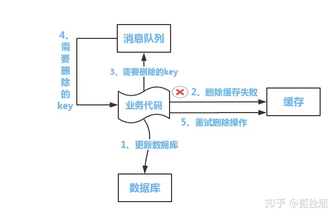
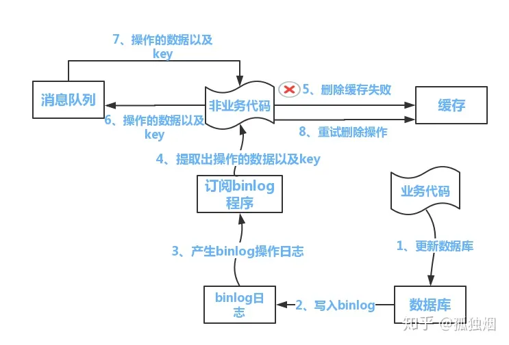

# 一、索引相关的面试题

## （1）索引失效的情况有哪些

在MySQL查询时，以下情况可能会导致索引失效，无法使用索引进行高效的查询：

1. 数据类型不匹配：如果查询条件中的数据类型与索引列的数据类型不匹配，例如将字符串类型与数字类型进行比较，可能会导致索引失效。

2. 字符串比较：在使用字符型字段进行比较时，MySQL会进行字符集和排序规则的比较，这可能会导致索引失效。

   > 当在使用字符型字段进行比较时，MySQL会考虑字符集和排序规则，这可能导致索引失效的情况有以下两种：
   >
   > 1. 字符集不匹配：MySQL在创建索引时会根据表的字符集来选择相应的排序规则，并将字段的值按照排序规则进行排序。如果在查询条件中使用了不同字符集的字符串进行比较，MySQL可能无法使用索引，因为它需要考虑字符集转换的开销。例如，如果在一个UTF-8字符集的表中的varchar字段上建立了索引，而在查询条件中使用了GB2312字符集的字符串进行比较，可能会导致索引失效。
   > 2. 排序规则不匹配：MySQL的排序规则决定了字符串的比较方式，如大小写敏感或不敏感、重音符号敏感或不敏感等。如果在查询条件中使用的排序规则与索引列的排序规则不匹配，MySQL可能无法使用索引。例如，在一个大小写不敏感的表上建立了索引，但在查询条件中使用了大小写敏感的字符串进行比较，可能会导致索引失效。
   >
   > 当字符集和排序规则不匹配时，MySQL可能会选择进行字符集转换，以便比较字符串，但这会增加额外的开销，导致索引失效。为了避免这种情况，建议在设计表结构时，尽量保持字符集和排序规则的一致性，并在查询条件中使用与索引列相同字符集和排序规则的字符串进行比较，以确保索引的有效使用。

3. 函数调用：在查询条件中使用了函数调用，特别是涉及到对索引字段进行函数操作的情况，可能会导致索引无法使用。

4. 隐式类型转换：虽然在某些情况下MySQL可以进行隐式类型转换并使用索引，但并不是所有情况下都适用，有时候隐式类型转换可能会导致索引失效。

5. 列运算：如果在查询条件中进行列运算，如`age + 1 = 30`，可能会导致索引失效。

6. 使用OR操作符：在查询条件中使用OR操作符连接多个条件，其中某个条件无法使用索引，整个查询可能会导致索引失效。

7. 高选择性问题：如果索引列的选择性太低，即索引列的不同值太少，MySQL可能会选择全表扫描而不是使用索引。

8. 表太小：对于非常小的表，MySQL可能会选择全表扫描而不是使用索引，因为全表扫描可能更快。

# 二、锁相关的面试题

1. [mysql的锁你知道多少](#mysql的锁你知道多少)
2. [什么是MySQL的行锁和表锁？它们有什么区别？](#什么是MySQL的行锁和表锁它们有什么区别)
3. [mysql中的行锁什么情况下会出现死锁](#mysql中的行锁什么情况下会出现死锁)
4. [请解释一下MySQL的共享锁和排他锁的概念，它们分别在什么情况下使用？](#请解释一下MySQL的共享锁和排他锁的概念它们分别在什么情况下使用)

5. [如何在MySQL中避免死锁？请描述一些常见的死锁避免策略。](#如何在MySQL中避免死锁请描述一些常见的死锁避免策略)

6. [什么是乐观锁和悲观锁？MySQL中如何实现这两种锁机制？](#什么是乐观锁和悲观锁MySQL中如何实现这两种锁机制)

7. [在MySQL中，如何手动获取和释放锁？请提供相应的SQL语句示例。](#在MySQL中如何手动获取和释放锁请提供相应的SQL语句示例)

8. [你是否了解MySQL的事务隔离级别？它们分别是什么？如何设置和使用它们？](#你是否了解MySQL的事务隔离级别它们分别是什么如何设置和使用它们)

9. [在MySQL中，如何监控和诊断锁相关的问题？有哪些常用的工具和方法？](#在MySQL中如何监控和诊断锁相关的问题有哪些常用的工具和方法)

10. [当并发访问导致性能下降时，你会采取哪些措施来解决MySQL中的锁冲突问题？](#当并发访问导致性能下降时你会采取哪些措施来解决MySQL中的锁冲突问题)

11. [MySQL的InnoDB存储引擎支持哪些类型的锁？请列举并简要说明它们的用途。](#MySQL的InnoDB存储引擎支持哪些类型的锁请列举并简要说明它们的用途)

12. [在复制环境中，MySQL的主从复制可能会出现锁冲突和延迟，你会如何优化和解决这些问题？](#在复制环境中MySQL的主从复制可能会出现锁冲突和延迟你会如何优化和解决这些问题)

## （1）mysql的锁你知道多少<a name="mysql的锁你知道多少"></a>

MySQL中的锁是用于控制并发访问数据库的机制，它们帮助确保多个用户或进程在对数据库进行操作时能够正确地共享资源并维护数据的完整性。MySQL提供了多种类型的锁，主要包括以下几种：

1. 共享锁（Shared Lock）：也称为读锁（Read Lock），允许多个连接同时获取同一资源的锁定。共享锁适用于读取操作，它们不会阻止其他会话获取相同资源的共享锁，但会阻止其他会话获取排他锁（独占锁）。
2. 排他锁（Exclusive Lock）：也称为写锁（Write Lock），只允许一个连接获得资源的锁定。排他锁适用于写入操作，当一个连接持有排他锁时，其他连接无法获取任何类型的锁，包括共享锁和排他锁。
3. 记录锁（Record Lock）：也称为行锁（Row Lock），用于在存储引擎级别锁定表中的单个记录，以防止其他连接同时修改该记录。记录锁在事务中自动释放，或者在没有显式事务的情况下，在语句完成时释放。
4. 表级锁（Table-level Locks）：锁定整个表，可以是共享锁或排他锁。表级锁适用于特定情况下的数据保护，但会限制并发性能，因为它们会阻止其他会话同时访问整个表。
5. 行级锁（Row-level Locks）：锁定表中的单个行，可以是共享锁或排他锁。行级锁允许更细粒度的锁定，减少了锁冲突的可能性，从而提高并发性能。

MySQL的默认存储引擎InnoDB支持行级锁定，这使得它成为处理高并发负载的首选引擎。使用正确的锁定策略和事务管理，可以避免数据不一致和性能问题。在开发和优化MySQL应用程序时，合理地使用锁是非常重要的一环。

## （2）什么是MySQL的行锁和表锁？它们有什么区别？<a name="什么是MySQL的行锁和表锁它们有什么区别"></a>

MySQL的行锁（Row Locks）和表锁（Table Locks）是用于并发控制的两种不同的锁机制。

1. 行锁（Row Locks）：
   - 行锁是MySQL中较细粒度的锁，它允许同时锁定表中的多个行，不同事务可以同时访问表的不同行而不会相互阻塞。
   - 行锁适用于对表中部分数据进行更新操作时，可以允许其他事务继续访问表的其他行，从而提高并发性能。
   - 当使用InnoDB存储引擎时，默认情况下，MySQL会自动使用行级锁来实现事务的隔离级别。
2. 表锁（Table Locks）：
   - 表锁是MySQL中较粗粒度的锁，它在锁定整个表的基础上进行操作。当一个事务获取了表锁时，其他事务无法同时获取该表的任何锁，导致其他事务需要等待。
   - 表锁适用于特定情况下的数据保护，但会限制并发性能，因为其他事务在等待表锁时无法访问整个表。
   - MyISAM存储引擎在默认情况下使用表级锁，而InnoDB存储引擎在一些情况下（例如没有使用索引或使用LOCK TABLES语句）也会使用表级锁。

区别：

- 粒度：行锁是较细粒度的锁，锁定表中的单个行；表锁是较粗粒度的锁，锁定整个表。
- 并发性：行锁允许多个事务同时访问表的不同行，提高了并发性能；表锁会限制其他事务对整个表的访问，降低了并发性能。
- 锁定范围：行锁只影响被锁定行的数据，不影响其他行；表锁影响整个表的所有数据。
- 锁定粒度：行锁可以更细致地控制数据的并发访问，减少了锁冲突的可能性；表锁可能导致更多的锁冲突，因为多个事务都在等待同一个表的锁。

总体来说，行锁在绝大多数情况下更优于表锁，因为它允许更好的并发控制和更高的并发性能。因此，使用InnoDB存储引擎和适当的索引来使用行锁是一种常见的最佳实践。

## （3）mysql中的行锁什么情况下会出现死锁<a name="mysql中的行锁什么情况下会出现死锁"></a>

在MySQL中，行锁（Row Locks）可能会导致死锁的情况是在以下场景下：

1. 竞争相同的资源：当多个事务同时尝试锁定相同的数据行，并按不同的顺序获取锁时，可能会发生死锁。例如，事务A锁定了数据行X，同时事务B锁定了数据行Y，然后事务A尝试锁定数据行Y，而事务B尝试锁定数据行X，由于彼此互相持有对方需要的锁而导致死锁。
2. 循环依赖：当多个事务之间形成循环依赖关系时，也可能会导致死锁。例如，事务A锁定了数据行X并等待锁定数据行Y，而事务B锁定了数据行Y并等待锁定数据行X，形成循环依赖，导致死锁发生。
3. 加锁顺序不一致：如果多个事务在访问相同的数据行时使用不一致的加锁顺序，也可能导致死锁。例如，如果事务A首先锁定数据行X，然后尝试锁定数据行Y，而事务B首先锁定数据行Y，然后尝试锁定数据行X，这样可能导致死锁。
4. 不释放锁资源：如果一个事务持有锁，并且在执行期间未及时释放锁资源，其他事务可能会等待很长时间而无法获取锁，最终导致死锁。

为了避免行锁导致的死锁问题，可以采取以下策略：

- 保持锁的顺序一致：尽量在事务中以固定的顺序访问数据行，避免交叉访问顺序导致的循环依赖。
- 加锁粒度尽量小：尽量将锁定的粒度限制在最小范围内，减少锁冲突的可能性。
- 合理设置事务超时时间：对于长时间持有锁的事务，设置合理的超时时间，避免锁资源长时间被占用而导致其他事务无法执行。
- 使用合理的索引：使用恰当的索引可以减少锁的竞争，提高并发性能。
- 尽量减少长事务：长事务持有锁的时间长，增加了死锁的风险，尽量将事务设计为短小的操作。

## （4）请解释一下MySQL的共享锁和排他锁的概念，它们分别在什么情况下使用？<a name="请解释一下MySQL的共享锁和排他锁的概念它们分别在什么情况下使用"></a>

当多个事务同时访问数据库时，MySQL的共享锁和排他锁用于控制对资源的并发访问。它们的概念如下：

1. 共享锁（Shared Lock）：
   - 共享锁也称为读锁（Read Lock）。
   - 共享锁允许多个事务同时获取同一资源的锁定，用于读取数据，不会阻止其他会话获取相同资源的共享锁。
   - 多个事务可以同时持有共享锁，这使得多个事务可以同时读取相同的数据，实现了数据的并发读取。

共享锁适用于以下情况：

- 当多个事务需要同时读取数据，并且不会对数据进行修改时，可以使用共享锁。
- 共享锁允许并发的读取操作，因此在读多写少的场景中，使用共享锁可以提高并发性能。

1. 排他锁（Exclusive Lock）：
   - 排他锁也称为写锁（Write Lock）。
   - 排他锁只允许一个事务获得资源的锁定，用于修改数据，当一个事务持有排他锁时，其他事务无法获取任何类型的锁，包括共享锁和排他锁。
   - 排他锁的目的是确保数据的独占写访问，避免了写写冲突，保证数据的一致性。

排他锁适用于以下情况：

- 当一个事务需要修改数据时，可以获取排他锁，确保数据的独占写访问，避免多个事务同时修改同一数据引起的问题。
- 排他锁保证了数据的一致性，因为在同一时间只有一个事务能够对数据进行修改。

在MySQL中，根据业务需求和操作类型，合理地使用共享锁和排他锁是确保数据的正确性和并发性能的关键。同时，也需要考虑死锁避免的问题，避免在复杂的事务场景中出现死锁情况。

## （5）如何在MySQL中避免死锁？请描述一些常见的死锁避免策略。<a name="如何在MySQL中避免死锁请描述一些常见的死锁避免策略"><a/>

1. 尽量让数据表中的数据检索都通过索引来完成，避免无效索引导致行锁升级为表锁。
2. 合理设计索引，尽量缩小锁的范围。
3. 尽量减少查询条件的范围，尽量避免间隙锁或缩小间隙锁的范围。
4. 尽量控制事务的大小，减少一次事务锁定的资源数量，缩短锁定资源的时间。
5. 如果一条SQL语句涉及事务加锁操作，则尽量将其放在整个事务的最后执行。
6. 尽可能使用低级别的事务隔离机制。
7. 保持锁的顺序：为了避免循环依赖造成的死锁，可以在事务中按照固定的顺序获取锁。例如，按照某个唯一索引的顺序访问表中的数据，这样可以确保多个事务获取锁的顺序一致，避免死锁的发生。

## （6）什么是乐观锁和悲观锁？MySQL中如何实现这两种锁机制？<a name="什么是乐观锁和悲观锁MySQL中如何实现这两种锁机制"></a>

乐观锁和悲观锁是两种不同的并发控制机制，用于解决并发访问数据库时的数据一致性问题。

1. 悲观锁（Pessimistic Locking）：
   - 悲观锁假设在整个事务过程中，其他事务会试图修改数据，因此在访问数据之前，会先锁定数据，确保在该事务执行期间其他事务不能对数据进行修改。
   - 在MySQL中，悲观锁通常是通过行级锁（Row Locks）来实现，通过在事务开始时使用SELECT...FOR UPDATE语句或在事务中使用UPDATE、DELETE等语句来锁定数据。
2. 乐观锁（Optimistic Locking）：
   - 乐观锁假设在整个事务过程中，其他事务不会对数据进行修改，因此在访问数据时并不立即进行加锁，而是在提交更新时检查数据是否被其他事务修改过。
   - 在MySQL中，乐观锁通常是通过版本控制来实现。每次更新数据时，都会记录一个版本号或时间戳，并在更新提交时检查该数据的版本号或时间戳是否发生了变化，如果没有变化则更新成功，否则表示数据已经被其他事务修改，更新失败。

在MySQL中，悲观锁是通过显式地使用SELECT...FOR UPDATE或UPDATE语句来实现的，可以在事务中锁定需要修改的数据行，防止其他事务同时修改同一行数据。

乐观锁一般需要应用程序在代码层面实现。在数据库中，并不会直接使用乐观锁关键字，而是通过在应用程序中比较数据版本号或时间戳来判断数据是否发生了变化，然后决定是否提交更新。

在使用乐观锁时，需要注意并发冲突的可能性，因为如果多个事务同时修改同一数据，可能会导致某些更新被拒绝。在乐观锁的实现中，通常会使用重试机制，如果更新失败，则重新获取最新的数据，并再次尝试更新，直到成功或达到最大重试次数。这样可以避免大部分并发冲突，并保证数据的一致性。

## （7）你是否了解MySQL的事务隔离级别？它们分别是什么？如何设置和使用它们？<a name="在MySQL中如何手动获取和释放锁请提供相应的SQL语句示例"></a>

MySQL提供了四个标准的事务隔离级别，它们分别是：

1. Read Uncommitted（读未提交）：
   - 在此隔离级别下，事务可以读取其他事务尚未提交的修改，这可能导致脏读、不可重复读和幻读。
   - 这是最低级别的隔离，但并发性最高。
2. Read Committed（读已提交）：
   - 在此隔离级别下，事务只能读取其他事务已经提交的修改。避免了脏读，但仍允许不可重复读和幻读。
   - 提供了比读未提交更好的数据隔离。
3. Repeatable Read（可重复读）：
   - 在此隔离级别下，事务可以在整个事务期间读取一致的数据，即使其他事务修改了数据也不影响。避免了不可重复读，但仍允许幻读。
   - 提供了比读已提交更强的数据隔离。
4. Serializable（可串行化）：
   - 在此隔离级别下，事务被完全隔离，确保各个事务互不干扰，防止发生任何数据异常。避免了脏读、不可重复读和幻读。
   - 提供了最高级别的数据隔离，但可能会降低并发性能，因为会使用严格的锁机制。

如何设置和使用事务隔离级别：

1. 设置隔离级别：

   - 可以使用`SET TRANSACTION ISOLATION LEVEL`语句为当前会话设置事务隔离级别。例如：

   ```
   sqlCopy code
   SET TRANSACTION ISOLATION LEVEL READ COMMITTED;
   ```

   - 可以通过配置MySQL配置文件（my.cnf或my.ini）或使用`SET GLOBAL`语句来设置所有新连接的默认隔离级别。例如：

   ```
   sqlCopy code
   SET GLOBAL tx_isolation = 'READ COMMITTED';
   ```

2. 在事务中使用隔离级别：

   - 一旦设置了隔离级别，它将应用于当前会话中的所有后续事务。
   - 可以使用`START TRANSACTION`或`BEGIN`语句开始一个事务，并且所选择的隔离级别将应用于该事务。

   ```
   sqlCopy codeBEGIN;
   -- SQL语句 --
   COMMIT;
   ```

在选择隔离级别时，需要考虑应用程序的具体要求，以在数据一致性和性能之间取得平衡。

## （8）在MySQL中，如何监控和诊断锁相关的问题？有哪些常用的工具和方法？<a name="你是否了解MySQL的事务隔离级别它们分别是什么如何设置和使用它们"></a>

在MySQL中，监控和诊断锁相关的问题是非常重要的，特别是在高并发的数据库环境中。以下是一些常用的工具和方法来监控和诊断锁相关的问题：

1. `SHOW ENGINE INNODB STATUS`命令：
   - 这个命令可以提供详细的InnoDB存储引擎状态信息，包括当前的锁信息和等待锁的事务。在输出结果中，你可以查找`TRANSACTIONS`节和`SEMAPHORES`节来获取锁相关的信息。
2. `SHOW FULL PROCESSLIST`命令：
   - 这个命令可以显示当前MySQL服务器上所有连接的详细信息，包括正在运行的查询和等待的查询。通过查看这个列表，你可以了解哪些查询在等待锁，从而诊断可能的锁问题。
3. `information_schema`表：
   - MySQL的`information_schema`数据库包含了很多用于监控和诊断的系统视图和表。例如，`INNODB_LOCKS`表和`INNODB_LOCK_WAITS`表可以用于查看当前正在持有的锁和等待的锁。
4. Percona Toolkit和pt-query-digest：
   - Percona Toolkit是一个用于MySQL性能监控和分析的工具包。其中，`pt-query-digest`工具可以用于分析查询日志，找出慢查询和锁相关的问题。
5. MySQL Performance Schema：
   - Performance Schema是MySQL的一个高级监控和诊断工具，提供了丰富的系统事件和资源消耗信息。它可以用于分析锁等待事件和锁资源的使用情况。
6. 锁日志：
   - MySQL的错误日志中可能包含有关死锁和锁等待的信息。启用适当的日志级别和参数可以记录有关锁的问题。

以上工具和方法都可以帮助你监控和诊断MySQL中的锁问题。通过使用它们，你可以及时发现潜在的锁冲突和死锁情况，从而优化数据库的性能和稳定性。

## （9）MySQL中的MVCC知道吗，能否讲讲？<a name="MySQL中的MVCC知道吗能否讲讲"></a>

当谈到MySQL中的MVCC（多版本并发控制）原理时，主要是指MySQL中InnoDB存储引擎实现的并发控制机制。MVCC是一种用于处理并发读写的策略，允许多个事务同时读取相同的数据，而不会相互阻塞，同时保证数据的一致性和隔离性。

MVCC的实现原理如下：

1. 版本号：每行数据在数据库中都有一个隐藏的版本号。在每次对数据进行修改时（如INSERT、UPDATE或DELETE操作），都会生成一个新的数据版本，并将新版本的数据保存在一条新的记录中。
2. Read View（读视图）：每个事务在开始时都会创建一个自己的Read View，用于记录事务启动时数据库中数据的版本号。Read View可以看作是事务开始时数据库中数据的一个快照。
3. 数据访问规则：
   - 在Read View中，事务只能看到在该事务开始前已经提交的数据版本（包括未修改的数据和已经提交的事务修改的数据）。
   - 如果某个数据行的版本号大于等于事务的Read View，说明该行数据是不可见的，事务不能读取该数据。
4. 写操作：
   - 当事务进行写操作时，实际上会生成一个新的数据版本，并将修改后的数据保存在新的记录中，同时在新记录中保存着前一个版本的引用（undo log）。
   - 写操作不会直接在原有数据记录上进行修改，而是以新增数据的方式进行。
5. 事务提交：
   - 当事务提交时，修改后的数据版本会被标记为“已提交”状态，而未提交的数据版本仍然对于其他事务是不可见的。

通过MVCC机制，InnoDB存储引擎可以实现高并发的读操作，而不会因为读操作而对数据进行加锁。同时，事务之间的隔离性也得到保证，不会出现脏读、不可重复读和幻读等问题。

需要注意的是，MVCC只在InnoDB存储引擎中实现，其他存储引擎（如MyISAM）不支持MVCC。因此，当使用InnoDB存储引擎时，可以充分利用MVCC机制来优化并发控制和提高数据库性能。

### 9.1） MySQL的多个隔离级别中都会用到MVCC吗

不是所有的MySQL隔离级别都会使用MVCC。MVCC（多版本并发控制）是一种用于实现数据库并发控制的机制，主要在支持事务的存储引擎中实现，特别是在InnoDB存储引擎中广泛使用。

在MySQL中，MVCC主要用于支持以下两个隔离级别：

1. Repeatable Read（可重复读）：
   - 在Repeatable Read隔离级别下，事务可以读取一致的数据快照，即使其他事务修改了数据。这是通过MVCC的方式实现的，每个事务在开始时会创建一个自己的Read View，用于记录事务启动时数据库中数据的版本号。这样，其他并发事务的修改对于该事务是不可见的，保证了数据的一致性。
2. Serializable（可串行化）：
   - 在Serializable隔离级别下，事务被完全隔离，相当于串行执行。为了实现这种隔离级别，MySQL使用MVCC来确保每个事务对数据的读写操作都不会与其他事务发生冲突。

但是，Read Uncommitted（读未提交）和Read Committed（读已提交）隔离级别不会使用MVCC。在这两个隔离级别下，MySQL使用其他的并发控制机制，例如行级锁和读写锁，来处理并发访问和数据一致性的问题。这些隔离级别的实现可能导致一些数据不一致的情况，如脏读、不可重复读和幻读。

因此，在MySQL中，并不是所有的隔离级别都会使用MVCC，只有在Repeatable Read和Serializable隔离级别下，MySQL会使用MVCC来实现数据的一致性和隔离性。而Read Uncommitted和Read Committed隔离级别则使用其他并发控制机制来处理数据的并发访问。

## （10）当并发访问导致性能下降时，你会采取哪些措施来解决MySQL中的锁冲突问题？<a name="当并发访问导致性能下降时你会采取哪些措施来解决MySQL中的锁冲突问题"></a>

当并发访问导致性能下降时，可能是由于MySQL中的锁冲突问题造成的。为了解决这些问题，可以采取以下措施：

1. 优化查询和索引：通过优化查询语句和使用合适的索引，可以减少查询的响应时间，减少锁定资源的时间，从而降低锁冲突的概率。
2. 选择合适的隔离级别：根据应用的具体需求，选择合适的隔离级别。对于一些读多写少的场景，可以考虑使用Read Committed隔离级别，减少锁的竞争。但需要注意，Read Committed隔离级别可能会导致一些不可重复读和幻读的问题。
3. 批量提交：如果可能的话，将多个操作合并成一个事务批量提交，减少事务的提交次数，降低锁的持有时间，从而减少锁冲突的概率。
4. 减少长事务：长时间持有锁可能导致其他事务等待。尽量将事务设计为短小的操作，减少锁冲突的风险。
5. 分离热点数据：如果出现数据访问热点，可以考虑对热点数据进行分离，拆分到不同的表或数据库中，以减少锁冲突。
6. 使用乐观锁：在一些场景下，可以使用乐观锁代替悲观锁，例如通过版本控制机制，避免了大部分锁冲突。
7. 使用缓存：对于一些热门数据，可以使用缓存技术，减少对数据库的直接访问，降低锁冲突的概率。
8. 分库分表：如果应用规模较大，可以考虑采用分库分表策略，将数据分散存储在不同的数据库或表中，减少锁冲突。

以上措施并不是针对特定情况的全部解决方案，而是一些常见的优化策略。在实际应用中，需要根据具体情况综合考虑，结合实际业务场景和数据库性能特点，来选择合适的优化方法来解决锁冲突问题，以提高数据库的并发性能和稳定性。

## （11）当MySQL超过最大并大连接数时，会出现什么问题<a name="当MySQL超过最大并大连接数时会出现什么问题"></a>

当MySQL超过最大并发连接数时，会出现以下问题：

1. 连接失败：新的连接请求将无法被MySQL服务器接受，导致连接失败。这意味着应用程序无法与数据库建立新的连接，从而无法执行数据库操作。
2. 响应延迟：当并发连接数达到或接近最大限制时，MySQL服务器可能会出现响应延迟。已建立的连接可能需要等待较长时间才能得到响应，导致应用程序的响应时间变慢。
3. 阻塞和死锁：如果有大量连接请求被阻塞，可能会导致数据库中出现阻塞和死锁的情况。当多个连接竞争同一资源时，可能会出现互相等待的情况，从而导致死锁。
4. 性能下降：当并发连接数过高，数据库服务器可能会因为处理大量连接而耗尽系统资源，导致性能下降。这可能会导致CPU利用率升高，内存和磁盘I/O压力增加，从而影响数据库的整体性能。
5. 宕机：如果MySQL服务器没有足够的资源处理连接请求，可能会导致服务器崩溃或宕机，使整个应用系统不可用。

为了避免出现上述问题，需要合理地配置MySQL服务器的最大并发连接数，以满足实际的应用需求和服务器资源。同时，可以采取以下措施来处理超过最大连接数的情况：

1. 提高最大连接数：如果服务器资源允许，可以适度提高MySQL服务器的最大并发连接数，以容纳更多的连接请求。
2. 使用连接池：在应用程序中使用连接池技术，对数据库连接进行管理和复用，避免频繁地创建和关闭连接，从而减少对MySQL服务器的连接压力。
3. 优化查询和索引：优化数据库查询和索引设计，减少查询执行时间，从而缩短连接占用时间，释放更多的连接资源。
4. 分散请求：如果可能的话，可以将请求分散到多个数据库服务器上，以减轻单一数据库服务器的连接压力。
5. 使用合适的硬件：确保MySQL服务器有足够的硬件资源，如CPU、内存和磁盘空间，以支持所需的并发连接数。

综上所述，合理配置MySQL的最大并发连接数，并采取优化措施，可以避免因超过最大连接数而导致的问题，保障数据库的正常运行和性能稳定。

## （12）MySQL的InnoDB存储引擎支持哪些类型的锁？请列举并简要说明它们的用途。<a name="当MySQL超过最大并大连接数时会出现什么问题"></a>

MySQL的InnoDB存储引擎支持以下几种类型的锁：

1. 共享锁（Shared Lock，也称读锁）：

   - 用途：共享锁用于在读取数据时提供并发性。多个事务可以同时持有共享锁，并且不会相互阻塞。共享锁允许多个事务同时读取相同的数据，但不允许有任何事务对数据进行修改。

2. 排他锁（Exclusive Lock，也称写锁）：

   - 用途：排他锁用于在修改数据时提供独占性。一个事务持有排他锁时，其他事务不能同时持有共享锁或排他锁。排他锁保证在任何时候只有一个事务可以修改数据，其他事务必须等待排他锁释放。

3. 记录锁（Record Lock）：

   - 用途：记录锁是InnoDB存储引擎的行级锁，用于保护单个数据行。当一个事务持有一个数据行的锁时，其他事务不能对该行进行修改。记录锁可以是共享锁，也可以是排他锁，取决于事务的要求。

4. 间隙锁（Gap Lock）：

   - 用途：间隙锁用于锁定一个范围的数据行之间的间隔。当一个事务持有一个间隙锁时，其他事务不能在该间隔内插入新的数据，防止了幻读（Phantom Read）问题。

   > **什么是间隙锁？**
   >
   > 间隙锁（Gap Lock）是MySQL InnoDB存储引擎中的一种特殊锁机制，用于锁定一个范围的数据行之间的间隔。间隙锁的目的是为了防止在同一个范围内插入新的数据，从而避免幻读（Phantom Read）的问题。
   >
   > 具体来说，间隙锁的作用如下：
   >
   > 1. 防止幻读：幻读是指一个事务在读取数据时，另一个事务在同一范围内插入了新的数据，导致第一个事务读取到了之前不存在的数据。间隙锁可以阻止其他事务在锁定的范围内插入新数据，从而保证了事务的读操作是一致的。
   > 2. 锁定范围：间隙锁不仅会锁定实际存在的数据行，还会锁定不存在的数据行之间的间隔（间隙）。例如，如果某个事务使用间隙锁锁定了某个范围的数据行，其他事务在这个范围内无法插入新的数据，即使该范围中实际上并没有数据行。
   >
   > 需要注意的是，间隙锁是一种特殊的锁机制，它在某些场景下会导致并发性降低，因为它可能阻塞其他事务的插入操作。因此，在使用间隙锁时，需要仔细考虑业务需求和并发情况，确保在提供数据一致性的同时不影响系统的性能。
   >
   > 可以通过设置事务隔离级别为Serializable来启用间隙锁。在Serializable隔离级别下，InnoDB存储引擎会自动使用间隙锁来防止幻读。在其他隔离级别下，InnoDB存储引擎通常不会使用间隙锁。

5. Next-Key Lock（行锁和间隙锁的组合锁）：

   - 用途：Next-Key Lock是InnoDB存储引擎中的一种组合锁，它同时锁定了一个数据行和该行之前的间隙。这种锁机制可以有效防止幻读和不可重复读问题。

这些锁机制在InnoDB存储引擎中共同协作，实现了高度的并发性和数据一致性。通过使用不同类型的锁，InnoDB可以确保事务之间的数据操作有序执行，避免了数据冲突和并发问题，从而提供了高性能和可靠性的数据库服务。

## （13）在复制环境中，MySQL的主从复制过程中，为什么会出现锁冲突和延迟？你会如何优化和解决这些问题？<a name="在复制环境中MySQL的主从复制过程中为什么会出现锁冲突和延迟你会如何优化和解决这些问题"></a>

**在MySQL的主从复制环境中，锁冲突和延迟可能会出现的原因有以下几点：**

1. 并发写入冲突：在主从复制中，主库负责处理写入操作，而从库会复制主库上的写入操作。如果多个客户端同时进行写入操作，可能会导致写入冲突，产生锁冲突。
2. 事务隔离级别：MySQL的事务隔离级别会影响主从复制中的锁冲突。在某些事务隔离级别下，如Repeatable Read和Serializable，事务会在整个事务期间持有锁，可能导致锁冲突和延迟。
3. 长事务：如果有长时间运行的事务在主库上进行写入操作，并且这些写入操作涉及到大量的数据，可能会导致长时间的锁定，从而影响到从库上的复制进程，导致延迟。
4. 主从复制延迟：在主从复制中，主库上的写入操作需要经过网络传输到从库进行复制。如果网络连接不稳定或者从库的复制进程负载过重，可能会导致主从复制延迟，从而影响数据同步的速度。
5. 并行复制冲突：在MySQL 5.7及以上版本中，支持并行复制，可以提高复制效率。但如果并行复制的线程数设置不合理，可能会导致并行复制冲突，增加锁冲突和延迟。

为了解决锁冲突和延迟的问题，可以采取上文提到的一些优化和解决措施，例如优化查询和索引、分散读写操作、设置合适的事务隔离级别、避免长事务、监控和诊断等。通过综合运用这些方法，可以提高主从复制的性能和稳定性，减少锁冲突和延迟问题的出现。

**下面是一些优化和解决这些问题的方法：**

1. 优化查询和索引：确保数据库的查询语句和索引设计是合理的，以减少查询的响应时间和锁冲突的可能性。使用合适的索引可以提高查询性能，减少锁的竞争。
2. 分散读写操作：将读操作和写操作分散到不同的数据库实例上。可以在主库进行写操作，而从库负责处理读请求，减轻主库的压力，提高读写分离性能。
3. 配置合适的主从复制延迟：可以根据业务需求和数据库性能，适当设置主从复制的延迟时间。延迟可以有效降低从库上的锁冲突，但同时可能会导致数据不一致的问题，需要根据实际情况权衡利弊。
4. 优化主库性能：主库是整个主从复制系统的核心，确保主库的性能足够强大，可以快速处理写入请求，避免写入操作长时间占用锁。
5. 增加从库数量：增加从库数量可以增加读取的并发性，减轻锁冲突的影响。但需要注意，从库数量过多可能会增加主库的负担。
6. 使用并行复制：MySQL 5.7及以上版本支持并行复制，可以通过配置并行复制的线程数来提高复制的效率，减少延迟。
7. 设置合适的事务隔离级别：在主库和从库上设置合适的事务隔离级别，以平衡数据的一致性和并发性能。
8. 避免长事务：长时间持有锁的事务会增加锁冲突和复制延迟的风险，尽量将事务设计为短小的操作，释放锁资源。
9. 监控和诊断：定期监控主从复制状态和性能指标，及时发现问题并进行诊断和处理。

综合使用以上优化和解决问题的方法，可以提高MySQL主从复制的性能和稳定性，减少锁冲突和延迟问题的出现。但需要根据具体的应用场景和数据库规模，灵活调整优化策略。

# 三、事务相关的面试题

1. [什么是数据库事务？请解释ACID特性是什么，它们在事务中的作用是什么？](#什么是数据库事务请解释ACID特性是什么它们在事务中的作用是什么)

2. [MySQL中如何开始一个事务？如何提交和回滚事务？请提供相应的SQL语句示例。](#MySQL中如何开始一个事务如何提交和回滚事务请提供相应的SQL语句示例)

3. [你是否了解MySQL的事务隔离级别？它们有哪些，并分别解释它们的特点和适用场景。](#你是否了解MySQL的事务隔离级别它们有哪些并分别解释它们的特点和适用场景)

4. [在MySQL中，如何设置事务的隔离级别？全局设置和会话级别设置有什么区别？](#在MySQL中如何设置事务的隔离级别全局设置和会话级别设置有什么区别)

5. [请解释一下脏读（Dirty Read）、不可重复读（Non-Repeatable Read）和幻读（Phantom Read）在事务中的含义和差异。](#请解释一下脏读不可重复读和幻读在事务中的含义和差异)

6. [在应用程序中，为什么要使用事务？举例说明一个适合使用事务的场景。](#在应用程序中为什么要使用事务举例说明一个适合使用事务的场景)

7. [在MySQL中，如何处理事务中的异常情况？你会如何处理事务的回滚和异常恢复？](#在MySQL中如何处理事务中的异常情况你会如何处理事务的回滚和异常恢复)

8. [什么是悲观锁和乐观锁？在事务中如何实现这两种锁机制？它们有什么优缺点？](#什么是悲观锁和乐观锁在事务中如何实现这两种锁机制它们有什么优缺点)

9. [如何优化MySQL事务性能？请提供一些建议和最佳实践。](#如何优化MySQL事务性能请提供一些建议和最佳实践)

10. [在主从复制环境中，如何保证事务的一致性和数据的准确性？](#在主从复制环境中如何保证事务的一致性和数据的准确性)

## （1）什么是数据库事务？请解释ACID特性是什么，它们在事务中的作用是什么？<a name="什么是数据库事务请解释ACID特性是什么它们在事务中的作用是什么"></a>

数据库事务是一组数据库操作的逻辑单元，这些操作要么全部成功执行，要么全部回滚，保证数据库的一致性和完整性。事务的目的是将一系列相关的数据库操作当作一个原子操作来执行，以确保数据的正确性和可靠性。

ACID是事务的四个关键特性，它们分别是：

1. 原子性（Atomicity）：原子性指事务是一个不可分割的操作单元，要么全部执行成功，要么全部失败回滚，不存在部分执行的情况。如果事务中的任何一个操作失败，整个事务都会回滚到初始状态，不会对数据库产生任何影响。
2. 一致性（Consistency）：一致性指事务在执行前和执行后，数据库的状态都必须保持一致。在一个合法的事务中，数据库必须从一个一致的状态转换到另一个一致的状态，保证数据的完整性和正确性。
3. 隔离性（Isolation）：隔离性指每个事务的执行都不会被其他事务干扰，事务之间是相互隔离的。多个事务并发执行时，它们之间不能相互影响，避免了并发问题如脏读、不可重复读和幻读。
4. 持久性（Durability）：持久性指一旦事务提交成功，它对数据库的修改将永久保存在数据库中，即使发生系统崩溃或重启，数据的修改也不会丢失。

这些ACID特性保证了数据库事务的可靠性和可恢复性。数据库事务的正确执行能够确保数据的完整性和一致性，在高并发的数据库环境中尤其重要。通过使用事务和ACID特性，可以保证数据库的数据操作是安全的、可靠的，并且满足业务逻辑的要求。

## （2）MySQL中如何开始一个事务？如何提交和回滚事务？请提供相应的SQL语句示例。<a name="MySQL中如何开始一个事务如何提交和回滚事务请提供相应的SQL语句示例"></a>

在MySQL中，可以使用以下SQL语句来开始一个事务、提交事务和回滚事务：

1. 开始一个事务：
   - 使用`START TRANSACTION`或`BEGIN`语句可以开始一个事务。

示例：

```
sqlCopy codeSTART TRANSACTION;
-- 或者使用 BEGIN;
```

1. 提交事务：
   - 使用`COMMIT`语句可以提交一个事务，将事务中的所有操作永久保存到数据库中。

示例：

```
sqlCopy code
COMMIT;
```

1. 回滚事务：
   - 使用`ROLLBACK`语句可以回滚一个事务，撤销事务中的所有操作，将数据库恢复到事务开始前的状态。

示例：

```
sqlCopy code
ROLLBACK;
```

事务的执行过程如下：

```
sqlCopy codeSTART TRANSACTION; -- 开始事务

-- 在这里执行一系列数据库操作，例如插入、更新、删除数据等

COMMIT; -- 提交事务，将操作永久保存到数据库中
-- 或者 ROLLBACK; -- 回滚事务，撤销操作，数据库恢复到事务开始前的状态
```

在MySQL中，默认的隔离级别是`REPEATABLE READ`，也就是在每个事务开始时，MySQL会创建一个读视图，用于保留事务开始时数据库的状态。这意味着在同一个事务中，读取的数据是一致的，即使其他事务对数据库进行了修改。

需要注意的是，在使用事务时，务必要小心使用`COMMIT`和`ROLLBACK`语句，确保事务的边界明确和逻辑正确。错误地提交或回滚事务可能导致数据不一致的情况。同时，也要考虑事务的性能和并发性，尽量将事务设计为短小的操作，减少锁冲突的风险。

## （3）请解释一下脏读（Dirty Read）、不可重复读（Non-Repeatable Read）和幻读（Phantom Read）在事务中的含义和差异。<a name="请解释一下脏读不可重复读和幻读在事务中的含义和差异"></a>

脏读（Dirty Read）、不可重复读（Non-Repeatable Read）和幻读（Phantom Read）是在数据库事务中可能出现的并发问题，它们分别指不同类型的数据读取问题：

1. 脏读（Dirty Read）：
   - 含义：脏读是指一个事务读取了另一个事务未提交的数据。当一个事务对数据进行修改但尚未提交时，另一个事务读取了这些未提交的数据。如果未提交的事务最终回滚，读取到的数据实际上是不存在的，因此读取的数据是“脏”的。
   - 示例：
     - 事务A修改了一行数据，但尚未提交。
     - 事务B读取了事务A修改的这行数据，此时读取的数据是未提交的数据（脏数据）。
     - 事务A回滚了修改，这行数据恢复到原始状态，但事务B已经读取到了脏数据。
2. 不可重复读（Non-Repeatable Read）：
   - 含义：不可重复读是指一个事务在同一个时间段内多次读取同一行数据，但得到的结果却不一致。这是因为在多次读取之间，有另一个事务对数据进行了修改提交，导致读取的结果不一致。
   - 示例：
     - 事务A读取了一行数据。
     - 事务B修改了这行数据并提交。
     - 事务A再次读取相同的行，得到的数据与之前不一致。
3. 幻读（Phantom Read）：
   - 含义：幻读是指一个事务在同一个时间段内多次执行相同的查询，但得到的结果却不一致。这是因为在多次查询之间，有另一个事务插入或删除了符合查询条件的数据，导致查询的结果不一致。
   - 示例：
     - 事务A执行了一个查询，返回了一些行。
     - 事务B在事务A的查询条件下插入了一行新数据并提交。
     - 事务A再次执行相同的查询，得到的结果与之前不一致，多出了一行数据。

这些并发问题的差异在于它们涉及的数据操作类型和影响范围：

- 脏读主要涉及未提交的数据，读取到的是未提交的“脏”数据。
- 不可重复读涉及到了已提交的数据，但在多次读取之间有其他事务对数据进行了修改，导致结果不一致。
- 幻读主要涉及到了查询结果的变化，即在同一个时间段内多次查询得到的结果不一致。

为了解决这些并发问题，可以采用事务隔离级别（如Repeatable Read和Serializable）、乐观锁或其他并发控制机制来保证数据的一致性和隔离性。不同的隔离级别对应着不同的并发问题解决方案，需要根据实际需求来选择合适的隔离级别。

## （4）在MySQL中，如何处理事务中的异常情况？你会如何处理事务的回滚和异常恢复？<a name="在MySQL中如何处理事务中的异常情况你会如何处理事务的回滚和异常恢复"></a>

在MySQL中，处理事务中的异常情况非常重要，确保数据的一致性和完整性。事务中的异常情况可以通过回滚（Rollback）操作来恢复，使事务回到开始之前的状态。

处理事务中的异常情况的步骤如下：

1. 使用`BEGIN`或`START TRANSACTION`语句开始一个事务。
2. 在事务中执行一系列数据库操作，如插入、更新、删除等。
3. 在发生异常时，通过捕获异常或检查返回值等方式来识别错误情况。
4. 如果出现异常或错误，使用`ROLLBACK`语句回滚事务，撤销事务中的所有操作，将数据库恢复到事务开始前的状态。
5. 如果没有异常，使用`COMMIT`语句提交事务，将事务中的所有操作永久保存到数据库中。

示例代码如下：

```
sqlCopy codeBEGIN; -- 开始事务

-- 执行一系列数据库操作
INSERT INTO table1 (column1, column2) VALUES ('value1', 'value2');
UPDATE table2 SET column3 = 'value3' WHERE column4 = 'value4';

-- 检查是否出现异常或错误，例如使用存储过程或在代码中检查返回值

-- 如果有异常或错误，回滚事务
IF <condition> THEN
    ROLLBACK;
ELSE
    COMMIT; -- 提交事务
END IF;
```

在处理事务异常时，需要注意以下几点：

1. 事务边界要明确：确保`BEGIN`和`COMMIT`或`ROLLBACK`成对出现，事务边界要明确和正确。
2. 错误处理和回滚：当发生异常或错误时，要及时捕获并处理，进行回滚操作，保证数据的一致性。
3. 事务的长度：尽量将事务设计为短小的操作，减少锁冲突的风险，尽早释放锁资源。
4. 日志和审计：记录事务的执行过程和异常信息，方便后续问题排查和恢复。

处理事务中的异常情况需要仔细考虑业务逻辑和数据库设计，确保事务的正确执行和数据的完整性。同时，在并发环境中，也要注意处理事务间的隔离和并发控制，避免并发问题导致数据不一致。

## （5）如何优化MySQL事务性能？请提供一些建议和最佳实践。<a name="如何优化MySQL事务性能请提供一些建议和最佳实践"></a>

优化MySQL事务性能是确保数据库系统在高并发和复杂业务场景下能够提供快速、稳定的服务的关键。以下是一些建议和最佳实践，帮助优化MySQL事务性能：

1. 事务边界要明确：尽量将事务设计为短小的操作，将事务的边界限制在最小范围内。事务持有锁的时间越短，越能减少锁冲突，提高并发性能。
2. 选择合适的隔离级别：根据业务需求选择合适的事务隔离级别。较低的隔离级别如Read Committed可以提高并发性能，但可能导致不可重复读和幻读问题。较高的隔离级别如Serializable可以保证数据的一致性，但可能影响并发性能。权衡利弊选择适合业务的隔离级别。
3. 使用乐观锁：对于读多写少的场景，可以考虑使用乐观锁，避免显式的锁操作，提高并发性能。
4. 使用批量操作：对于批量插入或更新数据的场景，尽量使用批量操作，而不是逐条操作。批量操作可以减少事务的开销，提高性能。
5. 合理设计索引：确保表的设计和索引的选择符合实际的查询需求。优化查询和索引可以大幅提升事务性能。
6. 使用连接池：在应用程序中使用连接池技术，对数据库连接进行管理和复用，避免频繁地创建和关闭连接，提高事务性能。
7. 避免长事务：长时间持有锁的事务会增加锁冲突和复制延迟的风险，尽量将事务设计为短小的操作，释放锁资源。
8. 配置合理的硬件：确保MySQL服务器有足够的硬件资源，如CPU、内存和磁盘空间，以支持所需的并发连接数和事务处理性能。
9. 监控和调优：定期监控MySQL的性能指标，如查询执行时间、锁等待时间，发现性能瓶颈并及时进行调优。
10. 使用缓存：对于频繁读取的数据，可以使用缓存技术，如Redis或Memcached，减轻数据库的读取压力。

综合运用上述优化建议和最佳实践，可以显著提升MySQL事务的性能，确保数据库系统在高并发环境下的稳定运行。但需要根据实际业务场景和数据库规模，灵活调整优化策略。

## （6）在主从复制环境中，如何保证事务的一致性和数据的准确性？<a name="在主从复制环境中如何保证事务的一致性和数据的准确性"></a>

在MySQL主从复制环境中，锁冲突和延迟是常见的问题，尤其是在高并发写入的情况下。下面是一些优化和解决这些问题的方法：

1. 优化查询和索引：确保数据库的查询语句和索引设计是合理的，以减少查询的响应时间和锁冲突的可能性。使用合适的索引可以提高查询性能，减少锁的竞争。
2. 分散读写操作：将读操作和写操作分散到不同的数据库实例上。可以在主库进行写操作，而从库负责处理读请求，减轻主库的压力，提高读写分离性能。
3. 配置合适的主从复制延迟：可以根据业务需求和数据库性能，适当设置主从复制的延迟时间。延迟可以有效降低从库上的锁冲突，但同时可能会导致数据不一致的问题，需要根据实际情况权衡利弊。
4. 优化主库性能：主库是整个主从复制系统的核心，确保主库的性能足够强大，可以快速处理写入请求，避免写入操作长时间占用锁。
5. 增加从库数量：增加从库数量可以增加读取的并发性，减轻锁冲突的影响。但需要注意，从库数量过多可能会增加主库的负担。
6. 使用并行复制：MySQL 5.7及以上版本支持并行复制，可以通过配置并行复制的线程数来提高复制的效率，减少延迟。
7. 设置合适的事务隔离级别：在主库和从库上设置合适的事务隔离级别，以平衡数据的一致性和并发性能。
8. 避免长事务：长时间持有锁的事务会增加锁冲突和复制延迟的风险，尽量将事务设计为短小的操作，释放锁资源。
9. 监控和诊断：定期监控主从复制状态和性能指标，及时发现问题并进行诊断和处理。

综合使用以上优化和解决问题的方法，可以提高MySQL主从复制的性能和稳定性，减少锁冲突和延迟问题的出现。但需要根据具体的应用场景和数据库规模，灵活调整优化策略。

### 6.1）在复制环境中，MySQL的主从复制过程中，为什么会出现锁冲突和延迟

在MySQL的主从复制环境中，锁冲突和延迟可能会出现的原因有以下几点：

1. 并发写入冲突：在主从复制中，主库负责处理写入操作，而从库会复制主库上的写入操作。如果多个客户端同时进行写入操作，可能会导致写入冲突，产生锁冲突。
2. 事务隔离级别：MySQL的事务隔离级别会影响主从复制中的锁冲突。在某些事务隔离级别下，如Repeatable Read和Serializable，事务会在整个事务期间持有锁，可能导致锁冲突和延迟。
3. 长事务：如果有长时间运行的事务在主库上进行写入操作，并且这些写入操作涉及到大量的数据，可能会导致长时间的锁定，从而影响到从库上的复制进程，导致延迟。
4. 主从复制延迟：在主从复制中，主库上的写入操作需要经过网络传输到从库进行复制。如果网络连接不稳定或者从库的复制进程负载过重，可能会导致主从复制延迟，从而影响数据同步的速度。
5. 并行复制冲突：在MySQL 5.7及以上版本中，支持并行复制，可以提高复制效率。但如果并行复制的线程数设置不合理，可能会导致并行复制冲突，增加锁冲突和延迟。

为了解决锁冲突和延迟的问题，可以采取上文提到的一些优化和解决措施，例如优化查询和索引、分散读写操作、设置合适的事务隔离级别、避免长事务、监控和诊断等。通过综合运用这些方法，可以提高主从复制的性能和稳定性，减少锁冲突和延迟问题的出现。

# 四、主从复制相关的面试题

## （1）为什么需要主从复制？

1、在业务复杂的系统中，有这么一个情景，有一句sql语句需要锁表，导致暂时不能使用读的服务，那么就很影响运行中的业务，使用主从复制，让主库负责写，从库负责读，这样，即使主库出现了锁表的情景，通过读从库也可以保证业务的正常运作。

2、做数据的热备

3、架构的扩展。业务量越来越大，I/O访问频率过高，单机无法满足，此时做多库的存储，降低磁盘I/O访问的频率，提高单个机器的I/O性能。

## （2）主从复制

### 1）原理

1. master服务器将数据的改变记录二进制binlog日志，当master上的数据发生改变时，则将其改变写入二进制日志中；

2. slave服务器会在一定时间间隔内对master二进制日志进行探测其是否发生改变，如果发生改变，则开始一个I/OThread请求master二进制事件

3. 同时主节点为每个I/O线程启动一个dump线程，用于向其发送二进制事件，并保存至从节点本地的中继日志中，从节点将启动SQL线程从中继日志中读取二进制日志，在本地重放，使得其数据和主节点的保持一致，最后I/OThread和SQLThread将进入睡眠状态，等待下一次被唤醒。

也就是说：

- 从库会生成两个线程,一个I/O线程,一个SQL线程;
- I/O线程会去请求主库的binlog,并将得到的binlog写到本地的relay-log(中继日志)文件中;
- 主库会生成一个log dump线程,用来给从库I/O线程传binlog;
- SQL线程,会读取relay log文件中的日志,并解析成sql语句逐一执行;

注意：

1. master将操作语句记录到binlog日志中，然后授予slave远程连接的权限（master一定要开启binlog二进制日志功能；通常为了数据安全考虑，slave也开启binlog功能）。
2. slave开启两个线程：IO线程和SQL线程。其中：IO线程负责读取master的binlog内容到中继日志relay log里；SQL线程负责从relay log日志里读出binlog内容，并更新到slave的数据库里，这样就能保证slave数据和master数据保持一致了。
3. Mysql复制至少需要两个Mysql的服务，当然Mysql服务可以分布在不同的服务器上，也可以在一台服务器上启动多个服务。
4. Mysql复制最好确保master和slave服务器上的Mysql版本相同（如果不能满足版本一致，那么要保证master主节点的版本低于slave从节点的版本）5--master和slave两节点间时间需同步

### 2）具体步骤

1. 从库通过手工执行change master to 语句连接主库，提供了连接的用户一切条件（user 、password、port、ip），并且让从库知道，二进制日志的起点位置（file名 position 号）； start slave
2. 从库的IO线程和主库的dump线程建立连接。
3. 从库根据change master to 语句提供的file名和position号，IO线程向主库发起binlog的请求。
4. 主库dump线程根据从库的请求，将本地binlog以events的方式发给从库IO线程。
5. 从库IO线程接收binlog events，并存放到本地relay-log中，传送过来的信息，会记录到master.info中
6. 从库SQL线程应用relay-log，并且把应用过的记录到relay-log.info中，默认情况下，已经应用过的relay 会自动被清理purge

## （3）读写分离能提高系统性能的原因

1. 物理服务器增加，机器处理能力提升。拿硬件换性能。
2. 主从只负责各自的读和写，极大程度缓解X锁和S锁争用。
3. slave可以配置myiasm引擎，提升查询性能以及节约系统开销。
4. master直接写是并发的，slave通过主库发送来的binlog恢复数据是异步。
5. slave可以单独设置一些参数来提升其读的性能。
6. 增加冗余，提高可用性。

# 五、Redis与Mysql双写一致性

先做一个说明，从理论上来说，给缓存设置过期时间，是保证最终一致性的解决方案。这种方案下，我们可以对存入缓存的数据设置过期时间，所有的写操作以数据库为准，对缓存操作只是尽最大努力即可。也就是说如果数据库写成功，缓存更新失败，那么只要到达过期时间，则后面的读请求自然会从数据库中读取新值然后回填缓存。因此，接下来讨论的思路不依赖于给缓存设置过期时间这个方案。 在这里，我们讨论**三种**更新策略：

1. 先更新数据库，再更新缓存

2. 先删除缓存，再更新数据库

3. 先更新数据库，再删除缓存

应该没人问我，为什么没有先更新缓存，再更新数据库这种策略。

## （1）先更新数据库，再更新缓存

这套方案，大家是普遍反对的。为什么呢？有如下两点原因。

**原因一（线程安全角度）** 同时有请求A和请求B进行更新操作，那么会出现

1. 线程A更新了数据库
2. 线程B更新了数据库
3. 线程B更新了缓存
4. 线程A更新了缓存

这就出现请求A更新缓存应该比请求B更新缓存早才对，但是因为网络等原因，B却比A更早更新了缓存。这就导致了脏数据，因此不考虑。

**原因二（业务场景角度）** 有如下两点：

1. 如果你是一个写数据库场景比较多，而读数据场景比较少的业务需求，采用这种方案就会导致，数据压根还没读到，缓存就被频繁的更新，浪费性能。
2. 如果你写入数据库的值，并不是直接写入缓存的，而是要经过一系列复杂的计算再写入缓存。那么，每次写入数据库后，都再次计算写入缓存的值，无疑是浪费性能的。显然，删除缓存更为适合。

接下来讨论的就是争议最大的，先删缓存，再更新数据库。还是先更新数据库，再删缓存的问题。

## （2）先删缓存，再更新数据库

该方案会导致不一致的原因是。同时有一个请求A进行更新操作，另一个请求B进行查询操作。那么会出现如下情形:

1. 请求A进行写操作，删除缓存
2. 请求B查询发现缓存不存在
3. 请求B去数据库查询得到旧值
4. 请求B将旧值写入缓存
5. 请求A将新值写入数据库 上述情况就会导致不一致的情形出现。而且，如果不采用给缓存设置过期时间策略，该数据永远都是脏数据。

那么，**如何解决呢？采用延时双删策略** 伪代码如下

```java
public void write(String key, Object data){
    redis.delKey(key);
    db.updateData(data);
    Thread.sleep(1000);
    redis.delKey(key);
}
```

转化为中文描述就是：

1. 先淘汰缓存
2. 再写数据库（这两步和原来一样）
3. 休眠1秒，再次淘汰缓存 这么做，可以将1秒内所造成的缓存脏数据，再次删除。

**那么，这个1秒怎么确定的，具体该休眠多久呢？**

针对上面的情形，读者应该自行评估自己的项目的读数据业务逻辑的耗时。然后写数据的休眠时间则在读数据业务逻辑的耗时基础上，加几百ms即可。这么做的目的，就是确保读请求结束，写请求可以删除读请求造成的缓存脏数据。

**如果你用了mysql的读写分离架构怎么办？**

ok，在这种情况下，造成数据不一致的原因如下，还是两个请求，一个请求A进行更新操作，另一个请求B进行查询操作。

1. 请求A进行写操作，删除缓存
2. 请求A将数据写入数据库了，
3. 请求B查询缓存发现，缓存没有值
4. 请求B去从库查询，这时，还没有完成主从同步，因此查询到的是旧值
5. 请求B将旧值写入缓存
6. 数据库完成主从同步，从库变为新值 上述情形，就是数据不一致的原因。还是使用双删延时策略。只是，睡眠时间修改为在主从同步的延时时间基础上，加几百ms。

**采用这种同步淘汰策略，吞吐量降低怎么办？**

ok，那就将第二次删除作为异步的。自己起一个线程，异步删除。这样，写的请求就不用沉睡一段时间后了，再返回。这么做，加大吞吐量。

**第二次删除,如果删除失败怎么办？**

这是个非常好的问题，因为第二次删除失败，就会出现如下情形。还是有两个请求，一个请求A进行更新操作，另一个请求B进行查询操作，为了方便，假设是单库：

1. 请求A进行写操作，删除缓存
2. 请求B查询发现缓存不存在
3. 请求B去数据库查询得到旧值
4. 请求B将旧值写入缓存
5. 请求A将新值写入数据库
6. 请求A试图去删除请求B写入对缓存值，结果失败了。 ok,这也就是说。如果第二次删除缓存失败，会再次出现缓存和数据库不一致的问题。 **如何解决呢？** 具体解决方案，且看博主对第(3)种更新策略的解析。

## （3）先更新数据库，再删缓存

首先，先说一下。老外提出了一个缓存更新套路，名为[《Cache-Aside pattern》](https://link.zhihu.com/?target=https%3A//docs.microsoft.com/en-us/azure/architecture/patterns/cache-aside)。其中就指出

1. **失效**：应用程序先从cache取数据，没有得到，则从数据库中取数据，成功后，放到缓存中。
2. **命中**：应用程序从cache中取数据，取到后返回。
3. **更新**：先把数据存到数据库中，成功后，再让缓存失效。

另外，知名社交网站facebook也在论文[《Scaling Memcache at Facebook》](https://link.zhihu.com/?target=https%3A//www.usenix.org/system/files/conference/nsdi13/nsdi13-final170_update.pdf)中提出，他们用的也是先更新数据库，再删缓存的策略。

**这种情况不存在并发问题么？**

不是的。假设这会有两个请求，一个请求A做查询操作，一个请求B做更新操作，那么会有如下情形产生

1. 缓存刚好失效
2. 请求A查询数据库，得一个旧值
3. 请求B将新值写入数据库
4. 请求B删除缓存
5. 请求A将查到的旧值写入缓存 ok，如果发生上述情况，确实是会发生脏数据。

**然而，发生这种情况的概率又有多少呢？**

发生上述情况有一个先天性条件，就是步骤（3）的写数据库操作比步骤（2）的读数据库操作耗时更短，才有可能使得步骤（4）先于步骤（5）。

可是，大家想想，数据库的读操作的速度远快于写操作的（不然做读写分离干嘛，做读写分离的意义就是因为读操作比较快，耗资源少），因此步骤（3）耗时比步骤（2）更短，这一情形很难出现。 假设，有人非要抬杠，有强迫症，一定要解决怎么办？

**如何解决上述并发问题？**

首先，给缓存设有效时间是一种方案。其次，采用策略（2）里给出的异步延时删除策略，保证读请求完成以后，再进行删除操作。

**还有其他造成不一致的原因么？**

有的，这也是缓存更新策略（2）和缓存更新策略（3）都存在的一个问题，如果删缓存失败了怎么办，那不是会有不一致的情况出现么。比如一个写数据请求，然后写入数据库了，删缓存失败了，这会就出现不一致的情况了。这也是缓存更新策略（2）里留下的最后一个疑问。

**如何解决？** 提供一个保障的重试机制即可，这里给出两套方案。

**方案一**： 如下图所示



流程如下所示

1. 更新数据库数据；
2. 缓存因为种种问题删除失败
3. 将需要删除的key发送至消息队列
4. 自己消费消息，获得需要删除的key
5. 继续重试删除操作，直到成功 然而，该方案有一个缺点，对业务线代码造成大量的侵入。于是有了方案二，在方案二中，启动一个订阅程序去订阅数据库的binlog，获得需要操作的数据。在应用程序中，另起一段程序，获得这个订阅程序传来的信息，进行删除缓存操作。 **方案二**：



流程如下图所示：

1. 更新数据库数据
2. 数据库会将操作信息写入binlog日志当中
3. 订阅程序提取出所需要的数据以及key
4. 另起一段非业务代码，获得该信息
5. 尝试删除缓存操作，发现删除失败
6. 将这些信息发送至消息队列
7. 重新从消息队列中获得该数据，重试操作。

**备注说明：**上述的订阅binlog程序在mysql中有现成的中间件叫canal，可以完成订阅binlog日志的功能。至于oracle中，博主目前不知道有没有现成中间件可以使用。另外，重试机制，博主是采用的是消息队列的方式。如果对一致性要求不是很高，直接在程序中另起一个线程，每隔一段时间去重试即可，这些大家可以灵活自由发挥，只是提供一个思路。

## Reference

1. [Redis与Mysql双写一致性方案解析](https://zhuanlan.zhihu.com/p/59167071)
2. [主从DB与cache一致性](https://mp.weixin.qq.com/s?__biz=MjM5ODYxMDA5OQ==&mid=404308725&idx=1&sn=1a25ce76dd1956014ceb8a011855268e&scene=21#wechat_redirect)
3. [缓存更新的套路](https://coolshell.cn/articles/17416.html)