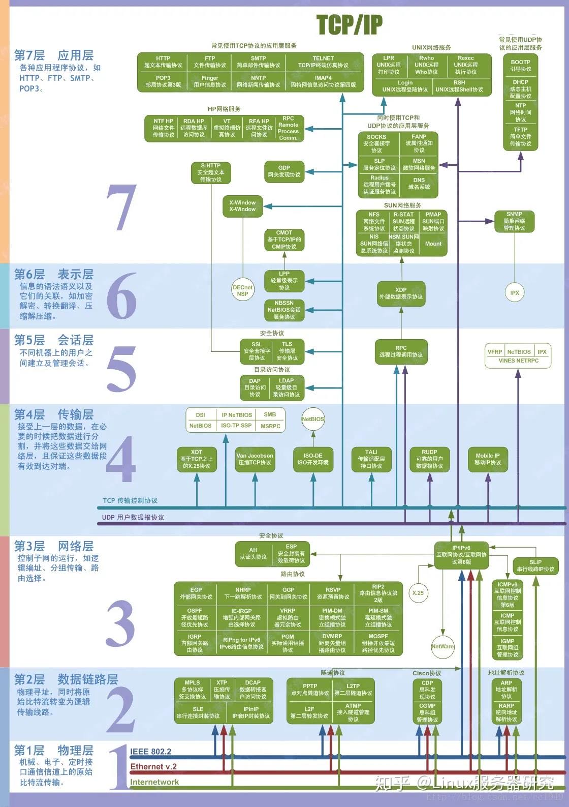

# 计算机网络

1. [在浏览器地址栏输入一个URL后回车，背后会进行哪些技术步骤](./%E5%9C%A8%E6%B5%8F%E8%A7%88%E5%99%A8%E5%9C%B0%E5%9D%80%E6%A0%8F%E8%BE%93%E5%85%A5%E4%B8%80%E4%B8%AAURL%E5%90%8E%E5%9B%9E%E8%BD%A6%EF%BC%8C%E8%83%8C%E5%90%8E%E4%BC%9A%E8%BF%9B%E8%A1%8C%E5%93%AA%E4%BA%9B%E6%8A%80%E6%9C%AF%E6%AD%A5%E9%AA%A4.md)
2. [字节一面：TCP 三次握手，问的好细！](./字节一面：TCP 三次握手，问的好细！.md) | [reference](https://mp.weixin.qq.com/s?__biz=MzUxODAzNDg4NQ==&mid=2247521478&idx=1&sn=66528a27aa3556b40f4a0ad64a43045f&chksm=f98dd06ccefa597aed91d1cfc8234f0b65123c141e4b7f7246e387735b0594879a623f4e085e&scene=21&key=97d114acb76dd546d4ff231544e299e852b96658e939e38083d848d06ade5e704751d3da6f42009c3df15e2e92b1ca8c0e71293a0944a2d6a6f957a4f1ded6dcb4f3cba8cf744624f1189c6af2aa1daba528e11577b1a3d5d2e278951335e0283261c823d8580215a2e9605d3bbc3a72eee267e8284428251c7a8cd60234788c&ascene=7&uin=MTc4MzkyNDIyNA%3D%3D&devicetype=Windows+10+x64&version=63080014&lang=zh_CN&session_us=gh_fc46cf2353fc&exportkey=n_ChQIAhIQTrymq28Os5ptwK79m8qeuBLvAQIE97dBBAEAAAAAAO47KqUijqYAAAAOpnltbLcz9gKNyK89dVj02v34X1W0F4sQnjXWmBZZ0a4QBgA002NDVtNyLfYOXRsbYiX%2FBi7G1Uu0Oa8e1gIwvF5EIyHKMMfa9fsdyAfIPJ43cTamfxW0l49XkkUPLcx23BghHYTSnq5i3tOUEka%2Bdr888ENXZi9DfEgE23SmONthJAToElFbRtfrZQEcog2ZAaSWC0B9bkZ%2BczfNxHxmolmAhL9CEnSg03KlxziNrXpCs8gmHAclxa18lZCuwIGKCwSR1Fu18KVzBmGMJcY%2FuOmatB40OKOr&acctmode=0&pass_ticket=yOpJo0zYyJqrfgC4VkReOlPqL01cwvktXKCQYX35jC%2BGDXUbRhJFE5c7yOXcKxIz&wx_header=0&fontgear=2)
3. [TCP 重传、滑动窗口、流量控制、拥塞控好难？看完图解就不愁了](./TCP 重传、滑动窗口、流量控制、拥塞控好难？看完图解就不愁了.md) | [reference](https://mp.weixin.qq.com/s/toQUgqJHeUbFZMtxfzFCxw)
4. [美团二面：TCP 四次挥手，可以变成三次吗？](./美团二面：TCP 四次挥手，可以变成三次吗？.md) | [reference](https://mp.weixin.qq.com/s/JUt-N0VxF_lXACFr6WJN8w)
5. [硬不硬你说了算！近 40 张图解被问千百遍的 TCP 三次握手和四次挥手面试题](./硬不硬你说了算！近 40 张图解被问千百遍的 TCP 三次握手和四次挥手面试题.md) | [reference](https://mp.weixin.qq.com/s/tH8RFmjrveOmgLvk9hmrkw)
6. [告别 TCP！](./告别 TCP！.md) | [reference](https://mp.weixin.qq.com/s/3rM_RlwejkMFWm0GdwK6Hg)
7. [TCPIP协议中的三次握手和四次挥手](./TCPIP%E5%8D%8F%E8%AE%AE%E4%B8%AD%E7%9A%84%E4%B8%89%E6%AC%A1%E6%8F%A1%E6%89%8B%E5%92%8C%E5%9B%9B%E6%AC%A1%E6%8C%A5%E6%89%8B.md)

## OSI七层协议

