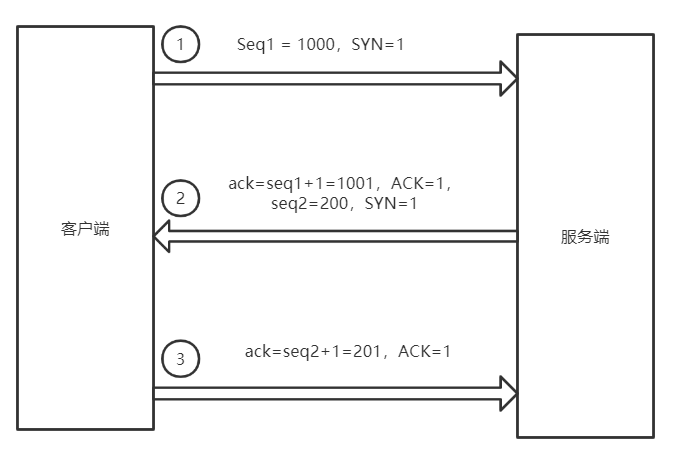
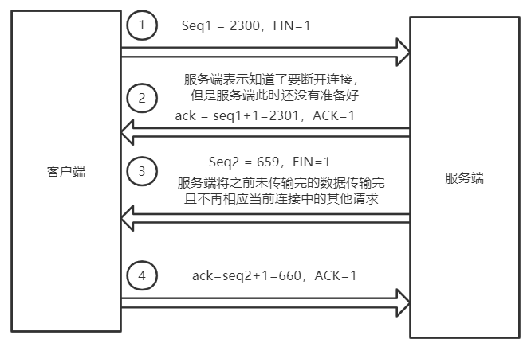

# TCP/IP协议中的三次握手和四次挥手

## 1 三次握手

在`TCP/IP`协议中，由于需要建立安全且稳定的连接，所有需要进行多次确认。

- **第一次握手：**客户端需要与服务端建立连接，此时客户端会向服务端发送一个连接请求，即将请求头中的`SYN`字段设置为`1`，表示需要建立请求，并发送一个客户端的32位的序列号`seq1`（该序列号由主机随机生成），该序列号用于后续客户端向服务端发送数据时给数据包的一个序列号，服务器端可以通过判断当前序列是否在某一个区间内，如果不在该区间内，表示当前的数据包不是当前客户端发送是数据，可以直接丢弃。
- **第二次握手：**服务端接收到客户端的请求，向客户端发送一个确认建立连接的请求，将请求头中的`ACK`字段设置为`1`，并在客户端的序列号`seq1`的基础上进行加`1`的操作，客户端通过该序列号来确认是否是一个可信的服务器发送回来的请求，在确认信息中，服务器端也会发送服务端的一个序列号，该序列号用于发送数据时的数据包的编号，每发送一个序列号编号加`1`。
- **第三次握手：**由于客户端向服务端发送了一个需要建立连接的请求，此时服务器端表示同意建立建立，向客户端返回了一个确认信息，此时客户端已经准备好和服务端建立连接了，但是服务端还没有收到来自客户端的确认信息，因为服务端不知道客户端是否收到了该确认信息，所以此时客户端还需要向服务端发送一个确认信息，表示客户端已经收到了服务端的确认信息。客户端发送的确认信息中，由于是一个确认信息，所以标志位`ACK`被设置为`1`，并将服务端的序列号`seq2`加`1`并放在确认信息中。

> 这里为了画图表示，假设客户端和服务端的序列号为一个较小的数，实际上是一个由32位的随机数。

## 2 四次挥手

当客户端不想在与服务端保持连接时，此时需要进行一个断开的操作，由于`TCP/IP`是一个安全可靠的连接协议，所以在建立连接和断开连接之前都需要进行“协商确认”。

- **第一次挥手：**客户端向服务端发送断开连接的请求，并将断开连接的标志位`FIN`设置为`1`，同时将客户端当前的序列号`seq1`发送给客户端，从图中可知，假设当前客户端已经向服务端发动了`2300`个数据包。
- **第二次挥手：**服务端收到客户端发送过来的断开连接的请求，但是由于服务端在接收到该断开请求之前并不知道客户端想要断开，所以之前的服务器一直以为客户端是处于想要连接的状态，那么服务器端就会一直处理客户端发送过来的请求，此时此刻，服务端可能还没有准备好与客户端断开连接，因为服务器端还有一些数据没有传输完，此时服务器端向客户端发送一个确认信息，告诉客户端表示服务端已经知道客户端想要断开连接。将确认标志位`ACK`设置为`1`，并将客户端的序列号`seq1`加`1`添加到确认信息中。
- **第三次挥手：**在上一步中，服务端知道了客户端想要断开连接，所以之后服务端不会再处理与该客户端有关的所有请求，并将之前还在处理的请求处理完之后，向客户端发送一个断开的请求，表示当前服务器端已经准备好与客户端断开连接，由于是断开连接的请求，所以信息中包含服务器端的序列号`seq2`的信息，并将断开连接的标志位`FIN`设置为`1`。
- **第四次挥手：**客户端在收到服务器端的断开连接请求后，向服务端发送一个确认信息，向服务端确认客户端已经准备好断开，当发送完之后，客户端与服务端便断开了连接。
