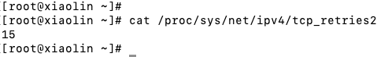
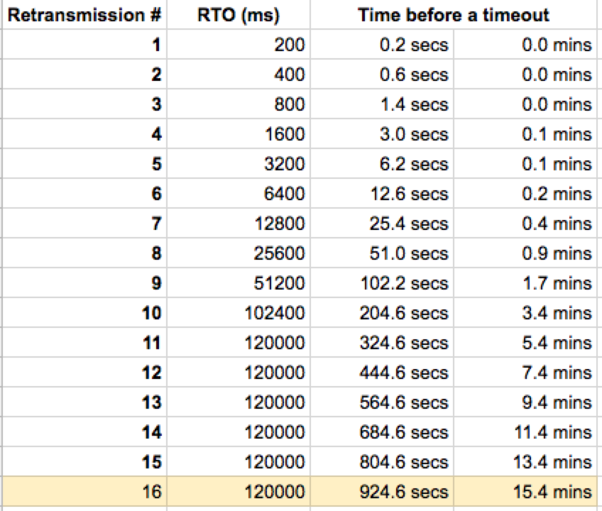
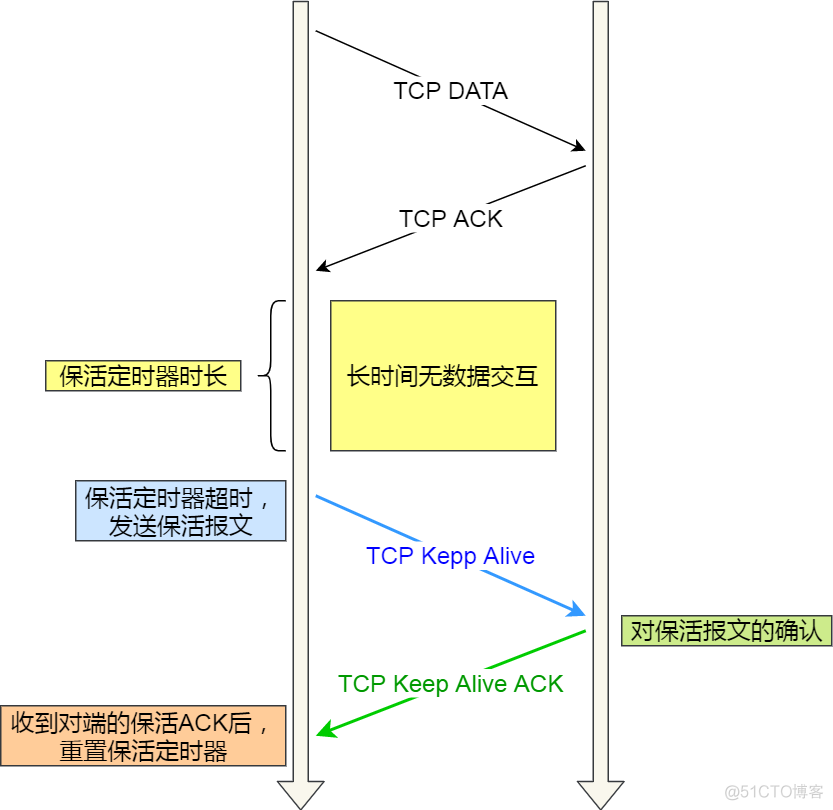
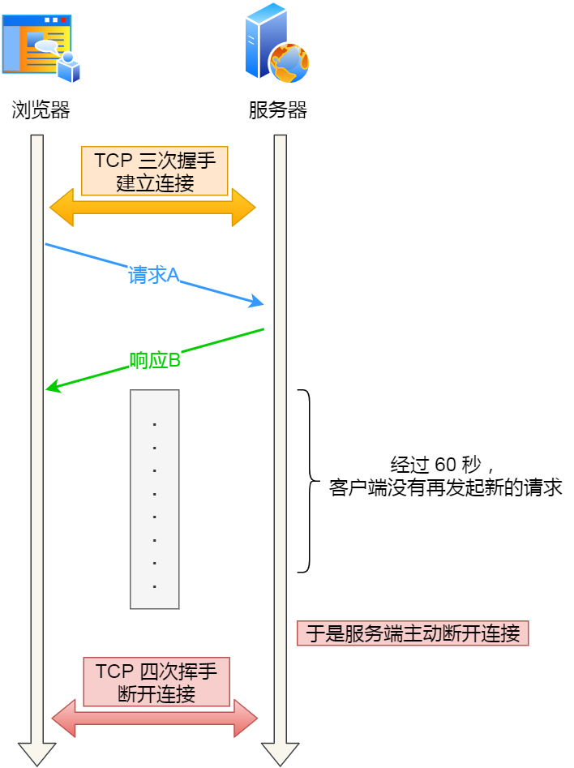

# 字节一面：服务端挂了，客户端的 `TCP` 连接还在吗？

> 针对**服务端挂了**这个假设，需要分情况讨论。
>
> 1. 服务端进程崩溃
> 2. 服务端主机宕机

如果「服务端挂掉」指的是「**服务端进程崩溃**」，服务端的进程在发生崩溃的时候，Linux内核会发送 `FIN` 报文，与客户端进行四次挥手。

但是，如果「服务端挂掉」指的是「**服务端主机宕机**」，那么是不会发生四次挥手的，具体后续会发生什么？还要看客户端会不会发送数据？

- 如果客户端会发送数据，由于服务端已经不存在，客户端的数据报文会超时重传，当重传次数达到一定阈值后，就不会再继续重传了，此时客户端与服务端会断开 对应的`TCP`连接；

- 如果客户端一直不会往服务器发送数据，此时还需要再看客户端有没有开启 ``TCP` keepalive` 机制？

- - 如果有开启，客户端在一段时间后，检测到服务端的 `TCP` 连接已经不存在，则会断开自身的 `TCP` 连接；
  - 如果没有开启，客户端的 `TCP` 连接会一直存在，并不会断开。

## 1 服务端进程崩溃，客户端会发生什么？

`TCP` 的连接信息是由内核维护的，所以当服务端的进程崩溃后，内核需要回收该进程的所有 `TCP` 连接资源，于是内核会发送第一次挥手 `FIN` 报文，后续的挥手过程也都是在内核完成，并不需要进程的参与，所以即使服务端的进程退出了，还是能与客户端完成 `TCP`四次挥手的过程。

我自己也做了实验，使用 `kill -9` 命令来模拟进程崩溃的情况，发现**在 `kill` 掉进程后，服务端会发送 `FIN` 报文，与客户端进行四次挥手**。

## 2 服务端主机宕机后，客户

当服务端的主机突然断电了，这种情况就是属于服务端主机宕机了。

当服务端的主机发生了宕机，是没办法和客户端进行四次挥手的，所以在服务端主机发生宕机的那一时刻，客户端是没办法立刻感知到服务端主机宕机了，只能在后续的数据交互中来感知服务端的连接已经不存在了。

因此，我们要分两种情况来讨论：

- 服务端主机宕机后，客户端会发送数据；
- 服务端主机宕机后，客户端一直不会发送数据；

### 2.1 服务端主机宕机后，如果客户端会发送数据

在服务端主机宕机后，客户端发送了数据报文，由于得不到响应，在等待一定时长后，客户端就会触发**超时重传**机制，重传未得到响应的数据报文。

当重传次数达到达到一定阈值后，内核就会判定出该 `TCP` 连接有问题，然后通过 Socket 接口告诉应用程序该 `TCP` 连接出问题了，于是客户端的 `TCP` 连接就会断开。

> 那 `TCP` 的数据报文具体重传几次呢？
>
> 在 Linux 系统中，提供了一个叫 `TCP`_retries2 配置项，默认值是 15，如下图：
>
> 

这个内核参数是控制，在 `TCP` 连接建立的情况下，超时重传的最大次数。

不过 `TCP`_retries2 设置了 15 次，并不代表 `TCP` 超时重传了 15 次才会通知应用程序终止该 `TCP` 连接，**内核会根据 `TCP`_retries2 设置的值，计算出一个 timeout**（*如果 `TCP`_retries2 =15，那么计算得到的 timeout = 924600 ms*），**如果重传间隔超过这个 timeout，则认为超过了阈值，就会停止重传，然后就会断开 `TCP` 连接**。

在发生超时重传的过程中，每一轮的超时时间（RTO）都是**倍数增长**的，比如如果第一轮 RTO 是 200 毫秒，那么第二轮 RTO 是 400 毫秒，第三轮 RTO 是 800 毫秒，以此类推。

而 RTO 是基于 RTT（一个包的往返时间） 来计算的，如果 RTT 较大，那么计算出来的 RTO 就越大，那么经过几轮重传后，很快就达到了上面的 timeout 值了。

举个例子，如果 `TCP`_retries2 =15，那么计算得到的 timeout = 924600 ms，如果重传总间隔时长达到了 timeout 就会停止重传，然后就会断开 `TCP` 连接：

- 如果 RTT 比较小，那么 RTO 初始值就约等于下限 200ms，也就是第一轮的超时时间是 200 毫秒，由于 timeout 总时长是 924600 ms，表现出来的现象刚好就是重传了 15 次，超过了 timeout 值，从而断开 `TCP` 连接
- 如果 RTT 比较大，假设 RTO 初始值计算得到的是 1000 ms，也就是第一轮的超时时间是 1 秒，那么根本不需要重传 15 次，重传总间隔就会超过 924600 ms。

最小 RTO 和最大 RTO 是在 Linux 内核中定义好了：

```C
#define TCP_RTO_MAX ((unsigned)(120*HZ))
#define `TCP`_RTO_MIN ((unsigned)(HZ/5))
```

Linux 2.6+ 使用 1000 毫秒的 HZ，因此``TCP`_RTO_MIN`约为 200 毫秒，``TCP`_RTO_MAX`约为 120 秒。

如果``TCP`_retries`设置为`15`，且  RTT 比较小，那么 RTO 初始值就约等于下限 200ms，这意味着**它需要 924.6 秒**才能将断开的 `TCP` 连接通知给上层（即应用程序），每一轮的 RTO 增长关系如下表格：



### 2.2 服务端主机宕机后，如果客户端一直不发数据

在服务端主机发送宕机后，如果客户端一直不发送数据，那么还得看是否开启了 `TCP` keepalive 机制 （`TCP` 保活机制）。

如果**没有开启** `TCP` keepalive 机制，在服务端主机发送宕机后，如果客户端一直不发送数据，那么客户端的 `TCP` 连接将一直保持存在，所以我们可以得知一个点，在没有使用 `TCP` 保活机制，且双方不传输数据的情况下，一方的 `TCP` 连接处在 ESTABLISHED 状态时，并不代表另一方的 `TCP` 连接还一定是正常的。

而如果**开启**了 `TCP` keepalive 机制，在服务端主机发送宕机后，即使客户端一直不发送数据，在持续一段时间后，`TCP` 就会发送探测报文，探测服务端是否存活：

- 如果**对端是正常工作**的。当 `TCP` 保活的探测报文发送给对端, 对端会正常响应，这样 **`TCP` 保活时间会被重置**，等待下一个 `TCP` 保活时间的到来。
- 如果**对端主机崩溃，或对端由于其他原因导致报文不可达**。当 `TCP` 保活的探测报文发送给对端后，石沉大海，没有响应，连续几次，达到保活探测次数后，**`TCP` 会报告该 `TCP` 连接已经死亡**。

所以，`TCP` keepalive 机制可以在双方没有数据交互的情况，通过探测报文，来确定对方的 `TCP` 连接是否存活。



> `TCP` keepalive 机制机制的原理是这样的：
>
> *定义一个时间段，在这个时间段内，如果没有任何连接相关的活动，`TCP` 保活机制会开始作用，每隔一个时间间隔，发送一个探测报文，该探测报文包含的数据非常少，如果连续几个探测报文都没有得到响应，则认为当前的 `TCP` 连接已经死亡，系统内核将错误信息通知给上层应用程序*。

在 Linux 内核可以有对应的参数可以设置保活时间、保活探测的次数、保活探测的时间间隔，以下都为默认值：

```
net.ipv4.tcp_keepalive_time=7200
net.ipv4.tcp_keepalive_intvl=75  
net.ipv4.tcp_keepalive_probes=9
```

每个参数的意思，具体如下：

- tcp_keepalive_time=7200：表示保活时间是 7200 秒（2小时），也就 2 小时内如果没有任何连接相关的活动，则会启动保活机制
- tcp_keepalive_intvl=75：表示每次检测间隔 75 秒；
- tcp_keepalive_probes=9：表示检测 9 次无响应，认为对方是不可达的，从而中断本次的连接。

也就是说在 Linux 系统中，最少需要经过 2 小时 11 分 15 秒才可以发现一个「死亡」连接。


注意，应用程序如果想使用 `TCP` 保活机制，需要通过 socket 接口设置 `SO_KEEPALIVE` 选项才能够生效，如果没有设置，那么就无法使用 `TCP` 保活机制。

> `TCP` keepalive 机制探测的时间也太长了吧？
>
> `TCP` keepalive 是 **`TCP` 层（内核态）** 实现的，它是给所有基于 `TCP` 传输协议的程序一个兜底的方案。
>
> 实际上，我们应用层可以自己实现一套探测机制，可以在较短的时间内，探测到对方是否存活。
>
> 比如，web 服务软件一般都会提供 `keepalive_timeout` 参数，用来指定 HTTP 长连接的超时时间。如果设置了 HTTP 长连接的超时时间是 60 秒，web 服务软件就会**启动一个定时器**，如果客户端在完后一个 HTTP 请求后，在 60 秒内都没有再发起新的请求，**定时器的时间一到，就会触发回调函数来释放该连接。**
>
> 

## Reference

1. https://mp.weixin.qq.com/s?__biz=MzUxODAzNDg4NQ==&mid=2247520003&idx=1&sn=3e70c6b54007ffa3130c5956df232bdb&chksm=f98dcba9cefa42bfbf35fd5f867314d8c96c54f5b285db542be42fc0594706d1429eaa069165&scene=21#wechat_redirect

