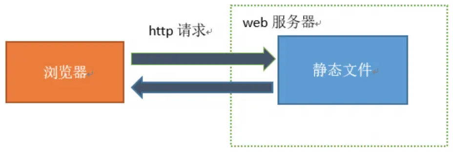
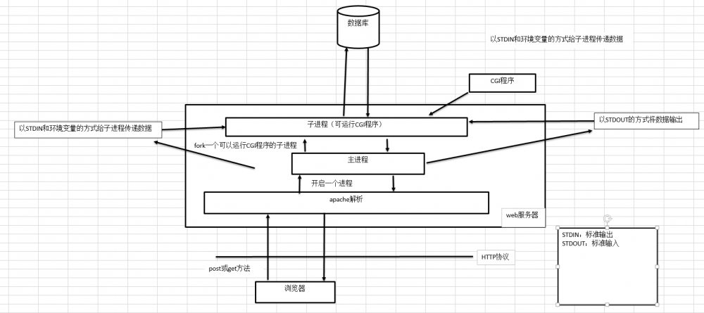
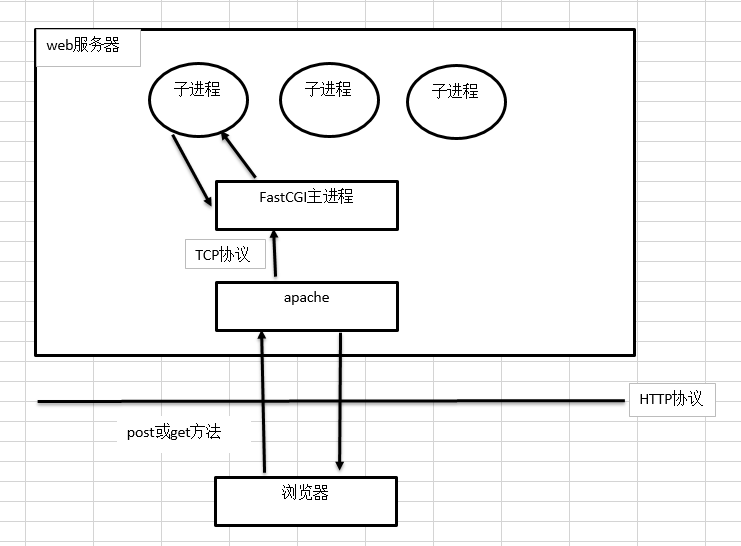

# cgi、php-cgi、fast-cgi、php-fpm的优缺点以及区别？

## 1 最早的web服务器

最早的web服务器只能简单的响应浏览器发送过来的**HTTP协议**的**静态文件**请求，然后将服务器上的静态文件返回给浏览器，浏览器在渲染出画面展示给用户。如图1所示。



## 2 动态网页技术-CGI（Commom Gateway Interface）

随着web的发展，引入 CGI 以便客户端请求能够触发 Web 服务器去运行另一个外部程序，客户端所输入的数据也会传给这个外部程序，该程序运行结束后会将生成的 HTML 和其他数据通过 Web 服务器再返回给客户端（即动态请求，比如基于 PHP、Java 实现的应用）

1. **CGI是一种协议**，不是一种具体的技术，理论上可以任务语言实现这个协议，早期的CGI大多由Perl语言开发
2. CGI网关输入输出两端通信可以使用不同的协议
3. web服务器并不能直接运行php、asp等这种web编程语言

> 实现动态渲染的原理：web服务器把需要渲染的文件转发给**实现了CGI协议的程序**（比如`fast-cgi`），然后由这个**实现了CGI协议的程序**去做具体的动态渲染的工作，渲染完之后在将结果返回给web服务器，web服务器在把这个结果返给浏览器。

**CGI的缺点：**

1. CGI没有URL路由的功能，也就是说一个请求的URL都是一个独立的可运行的CGI程序

2. CGI程序的响应时间较长，因为CGI程序在自己的OS Shell中执行，创建一个 OS shell 对OS来说是个大的开销。
3. CGI不具有升级性，例如，如果访问WEB应该的人数从50增加到了5000，CGI不能自我调整处理负载。因为一个计算机能运行的操作系统进程数是个有限的值。

### 2.1 CGI的工作方式

Web服务器一般只处理静态文件请求（如 jpg、htm、html），如果碰到一个动态脚本请求（如php），web服务器主进程，就fork出一个新的进程来启动CGI程序，也就是说将动态脚本请求交给CGI程序来处理。

cgi程序解析动态脚本的步骤：

1. fork子进程，启动cgi程序
   1. 读取配置文件
   2. 加载扩展
   3. 等...
2. 解析动态脚本
3. 将解析结果返回给客户端
4. 关闭子进程

这样，每次用户请求动态脚本，Web服务器都要重新fork一个新进程，去启动CGI程序，CGI要读取配置、加载扩展等，最后由CGI程序来处理动态脚本，处理完后该进程随之关闭。毫无疑问，这种工作方式的效率是非常低下的。运行示意图如下：



### 2.2 CGI程序如何与WEB服务器传递数据

1、通过标准输入（STDIN）和标准输出（STDOUT）来进行输入输出

2、通过操作系统的环境（除了操作系统的环境变量之外，CGI还额外设置了一些环境变量，这些环境变量也是协议的一部分）来获取外部的输入数据，在通过标准输出把数据输出客户端

### 2.3 Web服务器内置模块

由于CGI的工作模式效率低下，后来逐渐出现了一些比较高效的方式，比如：服务器内置模块。例如：apache将PHP解释器做成一个apache模块（apache module），然后加载到apache服务器中，简称：mod_php。

- 优点：CGI的工作效率大大提高

  > apache在启动服务器的时候，也会启动mod_php这个模块，当客户端发送php请求时，apache服务器就不再需要重新fork一个新的进程出来启动php解释器，而是直接将PHP文件交给**正在运行的mod_php**处理即可。

- 缺点：如果修改了php的配置文件，则必须重启服务器才能生效。

  > 由于apache在在启动的时候才会去读取php的配置文件、加载PHP模块等，在apache的运行过程中，就不会在读取这些配置文件


### 2.4 fast-CGI

1. FAST-CGI也是一种协议，它时CGI标准协议的一个变种
1. fast-cgi的运行效率很高
2. fast-cgi出现的目的就是为了减轻服务器与CGI程序之间的数据交互的负载，从而提高服务器的QPS。
2. 当客户端请求Web服务器上的动态脚本时，Web服务器会将动态脚本通过Unix域套接字(Unix domain socket)，或命名管道(named pipe)，或TCP连接(TCP connection)交给FastCGI主进程去处理
2. FastCGI收到处理请求的任务时，会安排一个空闲的子进程来解析该动态脚本，处理完成后将结果返回给Web服务器，Web服务器再将结果返回给客户端。该客户端请求处理完毕后，FastCGI子进程**并不会随之关闭，而是继续等待主进程安排工作任务**。运行示意图如下：



### 2.5 php-fpm

1. `fpm`（Fast-cgi Process Manager）中文叫“`fast-cgi`进程挂管理器”，而`php-fpm`就是php版本的fst-cgi协议的一个实现。
2. “`FastCGI`进程管理器”是一类程序，而`php-fpm`就属于这一类程序中的其中一个
3. 对于php5.3.3之前的版本来说，`php-fpm`是一个第三方的补丁包，旨在将`FastCGI`进程管理整合进PHP包中。
4. 在php5.3.3之后的版本中，`php-fpm`不再是第三方的包，它已经被集成到php的源码中了，因为`php-fpm`提供了更好的PHP进程管理方式，可以有效控制内存和进程、可以平滑重载PHP配置，比`spawn-fcgi`具有更多优点，所以`php-fpm`被PHP官方集成了。

## 3 php-cgi

### 3.1 php与php-cgi的区别？

安装完`php`之后，linux/mac会在安装目录有一个`php`和`php-cgi`，而Windows系统则会在安装目录有一个`php.exe`和`php-cgi.exe`。

1. `php`(`php.exe`)是命令模式的PHP解释器，而`php-cgi`则是支持CGI协议（同时也支持`fast-cgi`协议）的PHP解释器

   ```
   location ~ \.php$ {
       include fastcgi.conf;
       fastcgi_pass   127.0.0.1:9000;
       fastcgi_index  index.php;
       fastcgi_buffer_size 128k;
       fastcgi_buffers 4 256k;
       fastcgi_busy_buffers_size 256k;
   }
   ```

> 由于Windows系统不支持`php-fpm`（`php-fpm`是基于`Linux`的`fork()`创建子进程的）创建子进程，所有Windows下的PHP环境都是用的`php-cgi`代替`php-fpm`的。

### 3.1 php-cgi与php-fpm的区别

1. `php-cgi`不支持多线程与并发请求
2. `php-cgi`不支持`php-fpm`的配置选项
3. `php-fpm`是`php-cgi`的改进版
4. `php-fpm`不依赖`php-cgi`运行（证明：将php目录下的php-cgi改个名字，然后重启php-fpm，查看服务是否正常）

`php-fpm`相对于`php-cgi`的优点：

1. 支持平滑停止/启动的高级进程管理功能；
2. 进程池可以工作于不同的 uid/gid/chroot 环境下，并监听不同的端口和使用不同的 php.ini 配置文件（可取代 safe_mode 的设置）；
3. 文件上传优化支持;
4. "慢日志" - 记录脚本（不仅记录文件名，还记录 PHP backtrace 信息，可以使用 ptrace 或者类似工具读取和分析远程进程的运行数据）运行所导致的异常缓慢;
5. [fastcgi_finish_request()](https://www.php.net/manual/zh/function.fastcgi-finish-request.php) - 特殊功能：用于在请求完成和刷新数据后，继续在后台执行耗时的工作（录入视频转换、统计处理等）；
6. 基础和扩展运行状态信息（类似 Apache 的 mod_status），支持各种格式，如： json， xml 和 openmetrics；
7. 可配置的 stdout 和 stderr 日志记录;
8. 可以基于动态/静态的方式管理子进程
9. 在发生意外情况的时候能够重新启动并缓存被破坏的 opcode;    
10. 基于 php.ini 的配置文件。  

所有的网络请求都会经过`php-fpm`的主进程，然后再由主进程分配给各个子进程处理，只有子进程才是真正意义上的“`fast-cgi`进程管理器”。

php-fpm管理进程的3种方式：

1. static: 静态分配。即子进程是一个固定的数值，不会随着并发数的多少的改变而改变，

   > 缺点：
   >
   > 1. 并发数小的时候，比较浪费内存
   > 2. 并发数大的数据，没法自动增加子进程

2. dynamic: 动态分配。并发数小的时候，会自动kill一部分空闲的子进程，并发数大的时候，会自动创建一些子进程

3. ondemand: 按需分配。启动`php-fpm`时，没有子进程，只有主进程，当有请求过来时，才会创建子进程，也会随着并发数的多少自动增减子进程，直至减至0，但是，**该方法响应太慢**，一般不用。

### 3.3 php-fpm的平滑重启原理

命令：

```
ps -ef | grep php-fpm
kill -USR2 {pid}  //平滑重启
kill -INT {pid}   //强制关闭
kill -TERM {pid}  //强制关闭
kill -QUIT {pid}  //平滑终止
```

平滑重启步骤：

1. master进程先会给所有子进程发送`SIGQUIT`信号，平滑关闭所有子进程
2. 如果一段时间之后，子进程还没有退出，master进程在给子进程发送`SIGTERM`信号强制关闭子进程
3. 如果还没有关闭子进程，则给子进程发送`SIGKILL`信号，强制关闭
4. 等待所有的子进程都退出之后，master在重新启动

## 4 PHP-FPM性能调优

1. 可以根据需要将`php-fpm`管理子进程的方式改成静态、动态、按需分配。
2. 如果CPU性能没有打满，然而PHP程序报错，这个时候你可以检查一下`php-fpm`管理子进程的方式，以及子进程数量是不是设置的合理

```
pm = dynamic; # 表示使用的进程管理方式
pm.max_children = 200; # 最大子进程数量
pm.start_servers = 100; # 启动时创建的子进程数量
pm.min_spare_servers = 5; # 最小空闲子进程数量，低于该值创建新进程
pm.max_spare_servers = 180; # 最大空闲子进程数量，高于该值进行清理
```

3. static 表示静态，只由 `pm.max_children` 参数影响子进程数量，**一般一个 php-cgi 所耗费的内存为20-30M，需要根据服务器的配置合适的数量**

```
pm = static ; # 表示使用的进程管理方式
pm.max_children = 500; # 最大子进程数量  16G: 546, 32G:
```

# Reference

1. http://www.hkxiaopan.com/build/242.html
2. [fast-cgi specification](http://www.mit.edu/~yandros/doc/specs/fcgi-spec.html#S1)
3. [fast-cgi interface](http://www.mit.edu/afs.new/sipb/project/merakidev/src/openwrt-meraki/openwrt/build_mips/lighttpd-1.4.11/doc/fastcgi.txt)
4. [php-fpm信号，你造么？](https://www.jianshu.com/p/2ea78b789263)
5. [php-fpm解读-进程管理的三种模式](https://www.jianshu.com/p/c9a028c834ff)
6. [php-fpm 平滑重启 开启 关闭](https://blog.csdn.net/xiaoxiong_web/article/details/80053076)
7. [深入理解 FastCGI 协议以及在 PHP 中的实现](https://mengkang.net/668.html)
