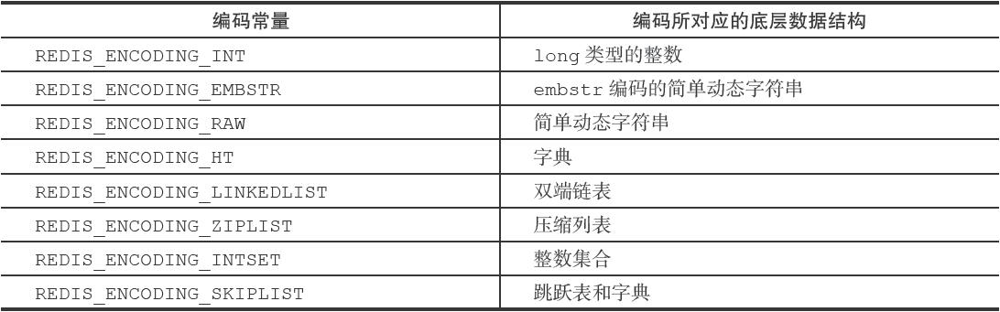

# Redis

## 一、5种对象的底层编码

每次往redis数据库插入一个键值对时，redis服务器至少会创建2个对象，一个是存放key的健对象，一个是存放value的值对象。

其中键对象只能是字符串对象，而值对象则可以是字符串对象、列表对象、哈希对象、集合对象、有序集合对象中的一种。每种类型的对象都至少使用了两种不同的编码，每种类型的编码如下：



可以使用命令`OBJECT ENCODING key_name`查看某个键的编码

```bash
$ set msg "hello"
$ OBJECT ENCODING msg
"embstr"
```

### (1) 字符串对象 | string

- int
- raw
- embstr

### (2) 列表对象 | list

- 双端列表，linkedlist
- 压缩列表，ziplist

### (3) 哈希对象 | hash

- 字典，hashtable
- 压缩列表，ziplist

### (4) 集合对象 | set

- 整数集合，intset
- 字典，hashtable

### (5) 有序集合对象 | zset

- 压缩列表，ziplist
- 跳表，skiplist

## 二、底层数据结构


1. [如何用redis实现分布式锁](./%E5%A6%82%E4%BD%95%E7%94%A8redis%E5%AE%9E%E7%8E%B0%E5%88%86%E5%B8%83%E5%BC%8F%E9%94%81.md)

