# Redis

## 一、5种对象的底层编码

每次往redis数据库插入一个键值对时，redis服务器至少会创建2个对象，一个是存放key的健对象，一个是存放value的值对象。

其中键对象只能是字符串对象，而值对象则可以是字符串对象、列表对象、哈希对象、集合对象、有序集合对象中的一种。每种类型的对象都至少使用了两种不同的编码，每种类型的编码如下：


可以使用命令`OBJECT ENCODING key_name`查看某个键的编码

```bash
$ set msg "hello"
$ OBJECT ENCODING msg
"embstr"
```

### (1) 字符串对象 | string

- int

  redis在服务器初始化时，会创建0-9999的共享变量，这些共享变量是为了提高redis对这些数据的访问速度
- raw

  **字符串值的长度大于32字节**，简单动态字符串（SDS）
- embstr（只读的）

  **字符串值的长度大于32字节**，那么字符串对象将使用一个简单动态字符串（SDS）来保存这个字符串值，并将对象的编码设置为raw

#### 1）embstr相比raw编码格式的优点：

- embstr编码将创建字符串对象所需的内存分配次数从raw编码的两次降低为一次。
- 释放embstr编码的字符串对象只需要调用一次内存释放函数，而释放raw编码的字符串对象需要调用两次内存释放函数。
- 提高CPU缓存命中率：由于embstr编码格式的字符串对象是连续存储的，因此在处理字符串时具有更好的局部性，可以提高CPU缓存的命中率。这在一些对性能要求较高的场景下尤为重要。
- 因为embstr编码的字符串对象的所有数据都保存在一块连续的内存里面，所以这种编码的字符串对象比起raw编码的字符串对象能够更好地利用缓存带来的优势（**因为缓存是读取一块连续内存中的数据**）。

embstr编码是专门用于保存短字符串（39字节）的一种优化编码方式，这种编码和raw编码一样，都使用`redisObject`结构和`sdshdr`结构来表示字符串对象，但raw编码会调用两次内存分配函数来分别创建`redisObject`结构和`sdshdr`结构，而embstr编码则通过调用一次内存分配函数来分配一块连续的空间，**空间中依次包含`redisObject`和`sdshdr`两个结构**

以下是embstr编码创建的内存结构：

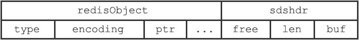

以下是raw编码创建的内存结构：

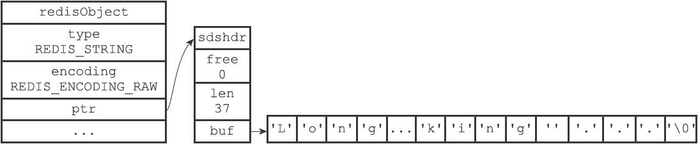

#### 2）浮点类型的数字在redis也是以字符串的形式存储

- long double类型表示的浮点数在Redis中也是作为字符串值来保存的。如果我们要保存一个浮点数到字符串对象里面，那么程序会先将这个浮点数转换成字符串值，然后再保存转换所得的字符串值。

- 需要取出这个数据的时候，会将其转换成浮点类型的数字返回

#### 3）embstr编码的字符串是只读的

Redis没有为embstr编码的字符串对象编写任何相应的修改程序（只有int编码的字符串对象和raw编码的字符串对象有这些程序），所以embstr编码的字符串对象实际上是只读的。当我们对embstr编码的字符串对象执行任何修改命令时，程序会先将对象的编码**从embstr转换成raw，然后再执行修改命令**。因为这个原因，embstr编码的字符串对象在执行修改命令之后，总会变成一个raw编码的字符串对象

#### 4）int编码的字符串对象和embstr编码的字符串对象在条件满足的情况下，会被转换为raw编码的字符串对象

```bash
$ set num 1
OK
$ OBJECT ENCODING num
"int"
$ append num " is a num"
OK
$ OBJECT ENCODING num
"raw"
```

因为embstr编码是只读的，所以只要对其进行修改了，就会将embstr编码格式的字符串转成raw编码的字符串。

### (2) 列表对象 | list

**在 Redis 3.2 版本之后，List 数据类型底层数据结构就只由 quicklist 实现了，替代了双向链表和压缩列表**。

- 双端列表，linkedlist
  - 列表对象保存的元素中有**元素长度大于64字节**；
  - 列表对象保存的元素数量**大于等于512个；**

- 压缩列表，ziplist
  - 列表对象保存的**所有**字符串元素的**长度都小于64字节**；
  - 列表对象保存的**元素数量小于512个**；
  - 以上两个条件的上限值是可以修改的，具体看配置文件中关于list-max-ziplist-value选项和list-max-ziplist-entries选项的说明。


**如果列表对象中的保存到元素不能满足存储压缩列表的条件时，redis会将该列表对象的底层实现从ziplist自动转成linkedlist编码格式。**

#### 1）压缩列表的内存结构

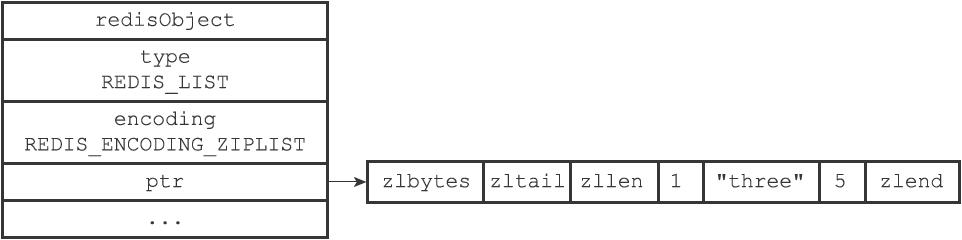

#### 2）双端队列的内存结构

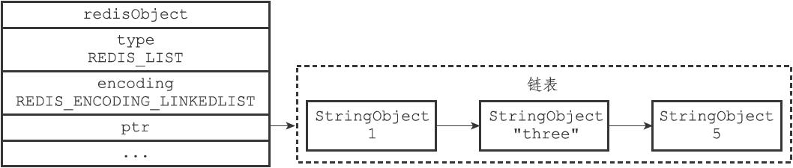

### (3) 哈希对象 | hash

- 字典，hashtable
- 压缩列表，ziplist
  - 哈希对象保存的所有键值对的键和值的字符串长度都小于64字节；（可以修改配置文件中的hash-max-ziplist-value选项修改具体的值）
  - 哈希对象保存的键值对数量小于512个；（可以通过修改配置文件中的hash-max-ziplist-entries选项修改具体的值）

#### 1）hashtable存储哈希的内存结构

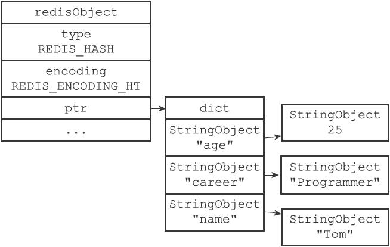

#### 2）压缩列表存储哈希的内存结构

压缩列表中新增的节点总是会在列表的尾部：

- 保存了同一键值对的两个节点总是紧挨在一起，保存键的节点在前，保存值的节点在后；
- 先添加到哈希对象中的键值对会被放在压缩列表的表头方向，而后来添加到哈希对象中的键值对会被放在压缩列表的表尾方向

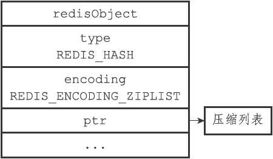

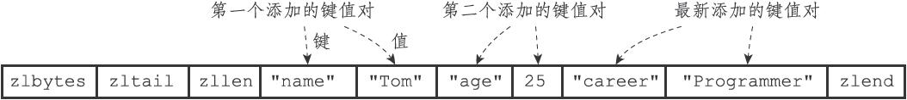

### (4) 集合对象 | set

- 整数集合，intset
  - 集合对象保存的所有元素都是整数值；
  - 集合对象保存的元素数量不超过512个。（可以通过配置文件中的set-max-intset-entries选项修改具体的值）

- 字典，hashtable
  - hashtable编码的集合对象使用字典作为底层实现，字典的每个键都是一个字符串对象，每个字符串对象包含了一个集合元素，而字典的值则全部被设置为NULL。


#### 1）intset编码格式存储集合对象的内存结构

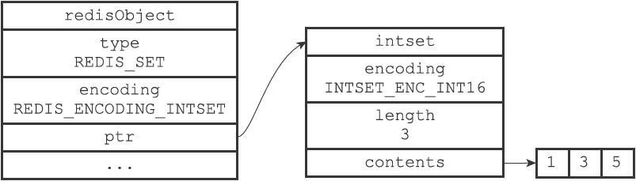

#### 2）hashtable编码格式存储集合对象的内存结构

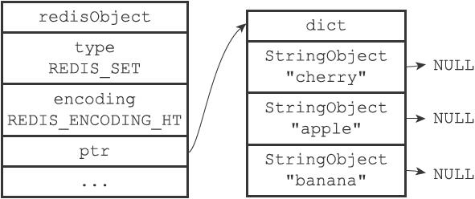

### (5) 有序集合对象 | zset

- 压缩列表，ziplist
  - 每个集合元素使用两个紧挨在一起的压缩列表节点来保存，第一个节点保存元素的成员（member），而第二个元素则保存元素的分值（score）
  - 压缩列表内的集合元素按分值**从小到大进行排序**，分值较小的元素被放置在靠近表头的方向，而分值较大的元素则被放置在靠近表尾的方向
  - 有序集合保存的元素数量小于128个；（zset-max-ziplist-entries）
  - 有序集合保存的所有元素成员的长度都小于64字节；（zset-max-ziplist-value）

- 跳表，skiplist

#### 1）压缩列表的内存结构

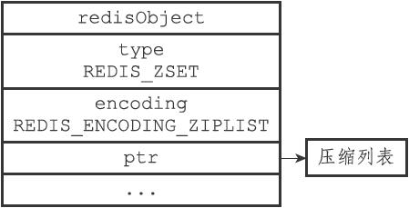

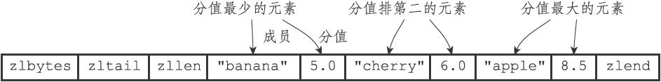

#### 2）跳表的内存结构

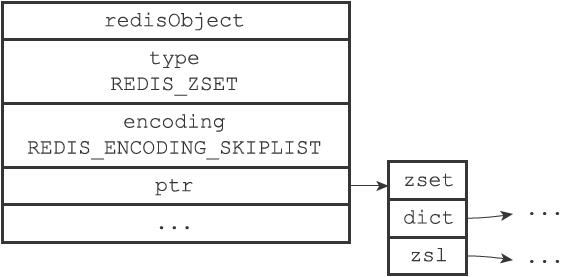

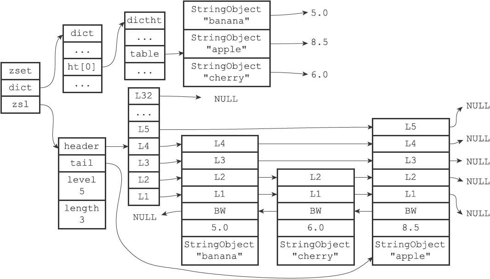

> **为什么有序集合需要同时使用跳跃表和字典来实现？**
>
> 在理论上，有序集合可以单独使用字典或者跳跃表的其中一种数据结构来实现，但无论单独使用字典还是跳跃表，在性能上对比起同时使用字典和跳跃表都会有所降低。举个例子，如果我们只使用字典来实现有序集合，那么虽然以O（1）复杂度查找成员的分值这一特性会被保留，但是，因为字典以无序的方式来保存集合元素，所以每次在执行范围型操作——比如ZRANK、ZRANGE等命令时，程序都需要对字典保存的所有元素进行排序，完成这种排序需要至少O（NlogN）时间复杂度，以及额外的O（N）内存空间（因为要创建一个数组来保存排序后的元素）。
>
> 另一方面，如果我们只使用跳跃表来实现有序集合，那么跳跃表执行范围型操作的所有优点都会被保留，但因为没有了字典，所以根据成员查找分值这一操作的复杂度将从O（1）上升为O（logN）。因为以上原因，为了让有序集合的查找和范围型操作都尽可能快地执行，Redis选择了同时使用字典和跳跃表两种数据结构来实现有序集合。

## 二、内存回收

### （1）内存回收

对象的引用计数信息会随着对象的使用状态而不断变化：

- 在创建一个新对象时，引用计数的值会被初始化为1；
- 当对象被一个新程序使用时，它的引用计数值会被增一；
- 当对象不再被一个程序使用时，它的引用计数值会被减一；
- 当对象的引用计数值变为0时，对象所占用的内存会被释放。

对象的整个生命周期可以划分为创建对象、操作对象、释放对象三个阶段

### （2）共享对象

redis中会在内存中共享正整数这类简单数据类型，以达到节约内存的目的。

```bash
redis＞ SET A 100
OK
redis＞ OBJECT REFCOUNT A
(integer) 2
```

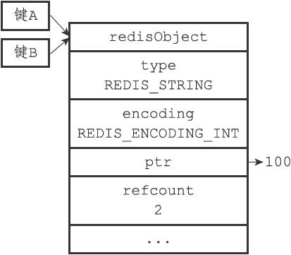

**为什么Redis不共享包含字符串的对象？**

当服务器考虑将一个共享对象设置为键的值对象时，程序需要先检查给定的共享对象和键想创建的目标对象是否完全相同，只有在共享对象和目标对象完全相同的情况下，程序才会将共享对象用作键的值对象，而一个共享对象保存的值越复杂，验证共享对象和目标对象是否相同所需的复杂度就会越高，消耗的CPU时间也会越多：

- 如果共享对象是保存整数值的字符串对象，那么验证操作的复杂度为`O(1)`；
-  如果共享对象是保存字符串值的字符串对象，那么验证操作的复杂度为`O(N)`；
- 如果共享对象是包含了多个值（或者对象的）对象，比如列表对象或者哈希对象，那么验证操作的复杂度将会是`O(N^2)`。

因此，尽管共享更复杂的对象可以节约更多的内存，但受到CPU时间的限制，Redis只对包含整数值的字符串对象进行共享。


## 三、持久化

### （1）RDB持久化（优先级低于AOF）

RDB文件的载入工作是在服务器启动时自动执行的，所以Redis并没有专门用于载入RDB文件的命令，只要Redis服务器在启动时检测到RDB文件存在，它就会自动载入RDB文件（载入RDB文件也会进行阻塞）。

因为AOF文件的更新频率通常比RDB文件的更新频率高，所以：

- 如果服务器开启了AOF持久化功能，那么服务器会优先使用AOF文件来还原数据库状态。
- 只有在AOF持久化功能处于关闭状态时，服务器才会使用RDB文件来还原数据库状态。

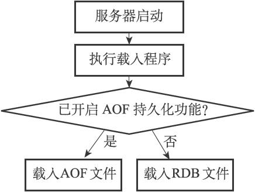

#### 1）SAVE命令

`SAVE`命令会阻塞redis进程，直到持久化结束才会继续执行客户端发送过来的命令请求，在此期间如果有客户端发送命令过来，redis服务器不会执行。

#### 2）BGSAVE命令

`BGSAVE`命令会fork出一个子进程来专门做数据备份的相关事情，主进程不会被阻塞。在此期间，redis服务器可以正常处理客户端命令请求，但是不会处理客户端发送过来的`SAVE`、`BGSAVE`以及`BGREWRITEAOF`命令。

- 禁止`save`命令的原因：
  - 服务器禁止SAVE命令和BGSAVE命令同时执行是为了避免父进程（服务器进程）和子进程同时执行两个rdbSave调用，防止产生竞争条件。
- 禁止`bgsave`命令的原因：
  - 因为同时执行两个BGSAVE命令也会产生竞争条件。
- 禁止`BGREWRITEAOF`命令的原因：
  - 如果BGSAVE命令正在执行，那么客户端发送的BGREWRITEAOF命令会被延迟到BGSAVE命令执行完毕之后执行。
  - 如果BGREWRITEAOF命令正在执行，那么客户端发送的BGSAVE命令会被服务器拒绝。
  - 因为BGREWRITEAOF和BGSAVE两个命令的实际工作都由子进程执行，所以这两个命令在操作方面并没有什么冲突的地方，不能同时执行它们只是一个性能方面的考虑——并发出两个子进程，并且这两个子进程都同时执行大量的磁盘写入操作，会产生大量的性能消耗

```conf
save 900 1
save 300 10
save 60 10000  # 自动保存
```

- 服务器在900秒之内，对数据库进行了至少1次修改。
- 服务器在300秒之内，对数据库进行了至少10次修改。
- 服务器在60秒之内，对数据库进行了至少10000次修改。

#### 3）RDB文件结构


### （2）AOF持久化

1. [如何用redis实现分布式锁](./%E5%A6%82%E4%BD%95%E7%94%A8redis%E5%AE%9E%E7%8E%B0%E5%88%86%E5%B8%83%E5%BC%8F%E9%94%81.md)

## 四、单线程

### （1）Redis 6.0 之前为什么使用单线程？

- Redis 的大部分操作**都在内存中完成**，并且采用了高效的数据结构，因此 Redis 瓶颈可能是机器的内存或者网络带宽，而并非 CPU，既然 CPU 不是瓶颈，那么自然就采用单线程的解决方案了；
- Redis 采用单线程模型可以**避免了多线程之间的竞争**，省去了多线程切换带来的时间和性能上的开销，而且也不会导致死锁问题。
- Redis 采用了 **I/O 多路复用机制**处理大量的客户端 Socket 请求，IO 多路复用机制是指一个线程处理多个 IO 流，就是我们经常听到的 select/epoll 机制。简单来说，在 Redis 只运行单线程的情况下，该机制允许内核中，同时存在多个监听 Socket 和已连接 Socket。内核会一直监听这些 Socket 上的连接请求或数据请求。一旦有请求到达，就会交给 Redis 线程处理，这就实现了一个 Redis 线程处理多个 IO 流的效果。

> 什么是I/O多路复用？
>
> I/O多路复用（I/O Multiplexing）是一种高效处理多个I/O任务的机制，它通过一个系统调用同时监视多个I/O资源的可读或可写状态，从而实现对这些I/O操作的异步处理。
>
> 常见的I/O多路复用机制包括以下几种：
>
> 1. Select：是最古老的一种I/O多路复用机制，支持同时监视多个文件描述符的可读或可写状态变化。它使用位图来表示文件描述符的状态，并提供了一组接口用于设置和检查状态变化。
> 2. Poll：与Select类似，也可以同时监视多个文件描述符的可读或可写状态。相比于Select，Poll没有最大文件描述符数的限制，并使用链表结构存储文件描述符信息，提供了更好的扩展性。
> 3. Epoll：是Linux特有的一种I/O多路复用机制，通过使用内核事件表（Event Poll）来管理文件描述符，以实现高性能的I/O事件通知。Epoll提供了三个系统调用：`epoll_create`、`epoll_ctl`和`epoll_wait`，用于创建、管理和等待事件。
> 4. Kqueue：是BSD系统上的一种I/O多路复用机制，类似于Epoll，用于监视多个文件描述符的可读或可写状态。Kqueue使用内核事件队列（Kernel Event Queue）来管理文件描述符，可以实现高效的事件通知和处理。
>
> 这些I/O多路复用机制在不同的操作系统上具有各自的实现方式和接口。它们的共同特点是通过系统调用一次性监视多个I/O资源，并在有可读或可写事件发生时进行通知，从而减少了对每个I/O操作的阻塞等待，提高了系统的并发性和响应性。
>
> 使用I/O多路复用机制可以有效地处理大量的并发I/O任务，例如网络通信中的同时监听多个客户端连接、处理多个文件的读写操作等。它是构建高性能、高并发服务器和应用程序的重要技术之一。

### （2）Redis 6.0 之后为什么引入了多线程？

虽然 Redis 的主要工作（网络 I/O 和执行命令）一直是单线程模型，但是**在 Redis 6.0 版本之后，也采用了多个 I/O 线程来处理网络请求**，**这是因为随着网络硬件的性能提升，Redis 的性能瓶颈有时会出现在网络 I/O 的处理上**。

所以为了提高网络 I/O 的并行度，Redis 6.0 对于网络 I/O 采用多线程来处理。**但是对于命令的执行，Redis 仍然使用单线程来处理，\**所以大家\**不要误解** Redis 有多线程同时执行命令。
