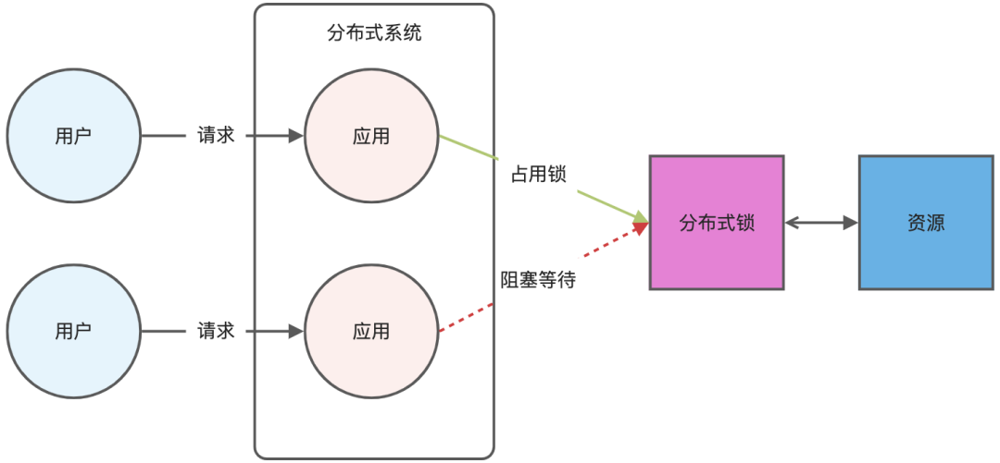

## 如何用redis实现分布式锁

### 一、**如何用 Redis 实现分布式锁的？**

分布式锁是用于分布式环境下并发控制的一种机制，用于控制某个资源在同一时刻只能被一个应用所使用。如下图所示：



Redis 本身可以被多个客户端共享访问，正好就是一个共享存储系统，可以用来保存分布式锁，而且 Redis 的读写性能高，可以应对高并发的锁操作场景。

Redis 的 SET 命令有个 NX 参数可以实现「key不存在才插入」，所以可以用它来实现分布式锁：

- 如果 key 不存在，则显示插入成功，可以用来表示加锁成功；
- 如果 key 存在，则会显示插入失败，可以用来表示加锁失败。

基于 Redis 节点实现分布式锁时，对于加锁操作，我们需要满足三个条件。

- 加锁包括了读取锁变量、检查锁变量值和设置锁变量值三个操作，但需要以原子操作的方式完成，所以，我们使用 SET 命令带上 NX 选项来实现加锁；
- 锁变量需要设置过期时间，以免客户端拿到锁后发生异常，导致锁一直无法释放，所以，我们在 SET 命令执行时加上 EX/PX 选项，设置其过期时间；
- 锁变量的值需要能区分来自不同客户端的加锁操作，以免在释放锁时，出现误释放操作，所以，我们使用 SET 命令设置锁变量值时，每个客户端设置的值是一个唯一值，用于标识客户端；

满足这三个条件的分布式命令如下：

```bash
SET lock_key unique_value NX PX 10000 
```

- lock_key 就是 key 键；
- unique_value 是客户端生成的唯一的标识，区分来自不同客户端的锁操作；
- NX 代表只在 lock_key 不存在时，才对 lock_key 进行设置操作；
- PX 10000 表示设置 lock_key 的过期时间为 10s，这是为了避免客户端发生异常而无法释放锁。

而解锁的过程就是将 lock_key 键删除（del lock_key），但不能乱删，要保证执行操作的客户端就是加锁的客户端。所以，解锁的时候，我们要先判断锁的 unique_value 是否为加锁客户端，是的话，才将 lock_key 键删除。

可以看到，解锁是有两个操作，这时就需要 Lua 脚本来保证解锁的原子性，因为 Redis 在执行 Lua 脚本时，可以以原子性的方式执行，保证了锁释放操作的原子性。

```lua
// 释放锁时，先比较 unique_value 是否相等，避免锁的误释放
if redis.call("get",KEYS[1]) == ARGV[1] then
    return redis.call("del",KEYS[1])
else
    return 0
end
```

这样一来，就通过使用 SET 命令和 Lua 脚本在 Redis 单节点上完成了分布式锁的加锁和解锁。

#### 基于 Redis 实现分布式锁有什么优缺点？

##### （1）基于 Redis 实现分布式锁的**优点**：

1. 性能高效（这是选择缓存实现分布式锁最核心的出发点）。
2. 实现方便。很多研发工程师选择使用 Redis 来实现分布式锁，很大成分上是因为 Redis 提供了 setnx 方法，实现分布式锁很方便。
3. 避免单点故障（因为 Redis 是跨集群部署的，自然就避免了单点故障）。

##### （2）基于 Redis 实现分布式锁的**缺点**：

- **超时时间不好设置**。如果锁的超时时间设置过长，会影响性能，如果设置的超时时间过短会保护不到共享资源。比如在有些场景中，一个线程 A 获取到了锁之后，由于业务代码执行时间可能比较长，导致超过了锁的超时时间，自动失效，注意 A 线程没执行完，后续线程 B 又意外的持有了锁，意味着可以操作共享资源，那么两个线程之间的共享资源就没办法进行保护了。

- - **那么如何合理设置超时时间呢？** 我们可以基于续约的方式设置超时时间：先给锁设置一个超时时间，然后启动一个守护线程，让守护线程在一段时间后，重新设置这个锁的超时时间。实现方式就是：写一个守护线程，然后去判断锁的情况，当锁快失效的时候，再次进行续约加锁，当主线程执行完成后，销毁续约锁即可，不过这种方式实现起来相对复杂。

- **Redis 主从复制模式中的数据是异步复制的，这样导致分布式锁的不可靠性**。如果在 Redis 主节点获取到锁后，在没有同步到其他节点时，Redis 主节点宕机了，此时新的 Redis 主节点依然可以获取锁，所以多个应用服务就可以同时获取到锁。

### 二、**Redis 如何解决集群情况下分布式锁的可靠性？**

为了保证集群环境下分布式锁的可靠性，Redis 官方已经设计了一个分布式锁算法 Redlock（红锁）。

它是基于多个 Redis 节点的分布式锁，即使有节点发生了故障，锁变量仍然是存在的，客户端还是可以完成锁操作。

Redlock 算法的基本思路，**是让客户端和多个独立的 Redis 节点依次请求申请加锁，如果客户端能够和半数以上的节点成功地完成加锁操作，那么我们就认为，客户端成功地获得分布式锁，否则加锁失败**。

这样一来，即使有某个 Redis 节点发生故障，因为锁的数据在其他节点上也有保存，所以客户端仍然可以正常地进行锁操作，锁的数据也不会丢失。

Redlock 算法加锁三个过程：

- 第一步是，客户端获取当前时间。

- 第二步是，客户端按顺序依次向 N 个 Redis 节点执行加锁操作：

- - 加锁操作使用 SET 命令，带上 NX，EX/PX 选项，以及带上客户端的唯一标识。
  - 如果某个 Redis 节点发生故障了，为了保证在这种情况下，Redlock 算法能够继续运行，我们需要给「加锁操作」设置一个超时时间（不是对「锁」设置超时时间，而是对「加锁操作」设置超时时间）。

- 第三步是，一旦客户端完成了和所有 Redis 节点的加锁操作，客户端就要计算整个加锁过程的总耗时（t1）。

加锁成功要同时满足两个条件（*简述：如果有超过半数的 Redis 节点成功的获取到了锁，并且总耗时没有超过锁的有效时间，那么就是加锁成功*）：

- 条件一：客户端从超过半数（大于等于 N/2+1）的 Redis 节点上成功获取到了锁；
- 条件二：客户端获取锁的总耗时（t1）没有超过锁的有效时间。

加锁成功后，客户端需要重新计算这把锁的有效时间，计算的结果是「锁的最初有效时间」减去「客户端为获取锁的总耗时（t1）」。

加锁失败后，客户端向所有 Redis 节点发起释放锁的操作，释放锁的操作和在单节点上释放锁的操作一样，只要执行释放锁的 Lua 脚本就可以了。

## Reference

1. https://zhuanlan.zhihu.com/p/42056183
1. [面试官：如何用 Redis 实现分布式锁？](https://mp.weixin.qq.com/s/ESdfA5sJa6bmL-HvuWpoJA)