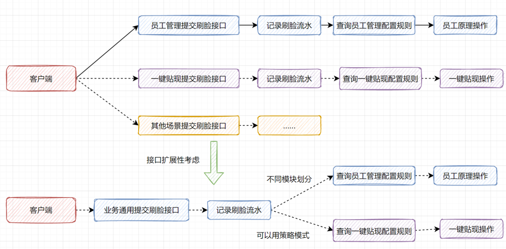
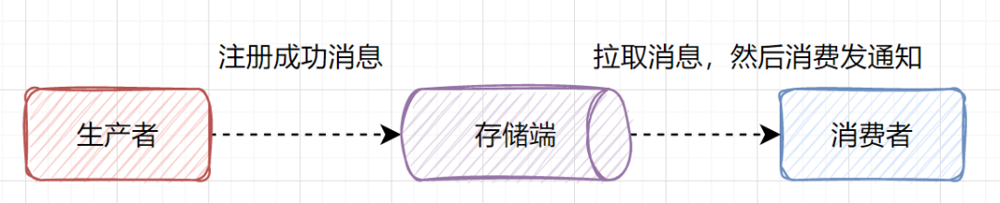
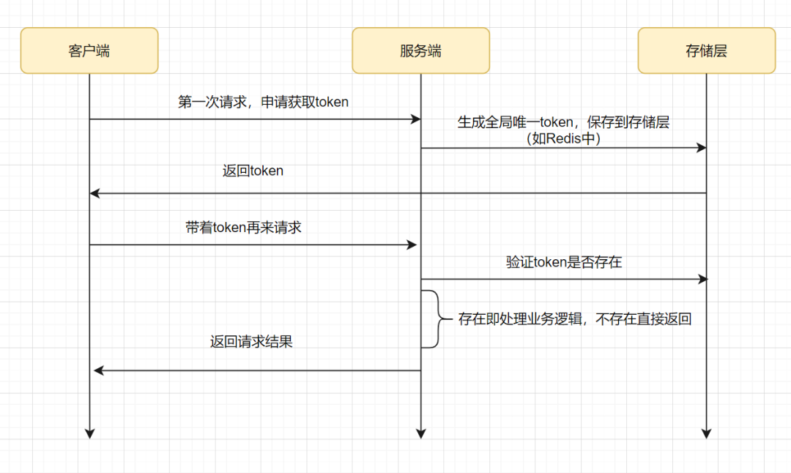

# 服务端开发-接口设计思想（持续更新...）

## 一、接口设计六大原则

### 1 单一职责原则

Single Responsibility Principle, 简称SRP。

#### 定义

- **There should never be more than one reason for a class to change**（**应该有且仅有一个原因引起类的变**）

#### 准则

1.  职责的划分？单一的定义和级别？ 
2.  应该根据实际业务情况而定。关注变化点。 
3.  实际使用时，类很难做到职责单一，但是接口的职责应该尽量单一。

### 2 里氏替换原则

Liskov Substitution Principle, 简称LSP。

#### 定义

- **Functions that use pointers or references to base classes must be able to use objects of derived classes without knowing it**（**所有引用基类的地方必须能透明地使用其子类的对象**）

#### 准则

里氏替换原则为良好的继承定义了一个规范：

1.  子类必须完全实现父类的方法 
2.  子类可以有自己的个性（属性和方法）。 
3.  覆盖或实现父类的方法时输入参数可以被放大。 
4.  覆写或实现父类的方法时输出结果可以被缩小。 

**注：在类中调用其他类时务必要使用父类或接口，如果不能使用父类或接口，则说明类的设计已经违背了LSP原则。**

### 3 依赖倒置原则

Dependence Inversion Principle, 简称DIP

#### 定义

-  **High level modules should not depend upon low level modules.**（高层模块不应该依赖低层模块）
- **Both should depend upon abstractions.**（高层、低层模块都应该依赖抽象定义）
- **Abstractions should not depend upon details.**（抽象不应该依赖细节）
- **Details should depend upon abstractions.** （细节应该依赖抽象）

#### 准则：

1.  高层模块不应该依赖低层模块
2. 两者都应该依赖其抽象 
3.  抽象不应该依赖细节。 
4.  细节应该依赖抽象。 

**精简的定义： 面向接口编程。**

#### 案例

Test-Driven Development 测试驱动开发是依赖倒置原则的最好体现。

测试驱动开发要求先写测试类，测试通过才写实现类，这就要求你要先想接口定义。

依赖的三种写法：

1.  构造函数传递依赖对象。 
2.  Setter方法传递依赖对象。 
3.  接口声明依赖对象。 

#### 最佳实践：

1. 每个类尽量都有接口或抽象类，或者抽象类和接口两者都具备。
2. 变量的表面类型尽量是接口或抽象类。
3. 任何类都不应该从具体类派生。
4. 尽量不要覆写基类的方法。
5. 结合里氏替换原则使用。

### 4 接口隔离原则：

接口这里指用interface关键字定义的接口。

#### 定义：

- **Clients should not be forced to depend upon interfaces that they don’t use.(客户端不应该依赖它不需要的接口)**
- **The dependency of one class to anther one should depend on the smallest possible interface.(类间的依赖关系应该建立在最小的接口上)**

#### 准则

1. 建立单一接口，不要建立臃肿庞大的接口。
2. 接口尽量细化，同时接口中的方法尽量少。

> 如何细化？细化到什么程序？
>
> 没有统一的标准，应根据业务合理细分，适合业务才是重点。

保证接口的纯结性：

1. 接口要尽量小。
2. 接口要高内聚。
3. 定制服务。
4. 接口的设计是有限度的。

#### 最佳实践：

1. 一个接口只服务于一个子模块或业务逻辑。
2. 通过业务逻辑压缩接口中的public方法，接口时常去回顾，尽量让接口达到“满身筋骨肉”，而不是“肥嘟嘟”的一大堆方法。
3. 已经被污染了的接口，尽量去修改，若变更的风险较大，则采用适配器模式进行转化处理。
4. 了解环境，拒绝盲从。每个项目或产品都有特定的环境因素，不要盲从大师的设计，要根据业务逻辑进行最好的接口设计。

### 5 迪米特法则

Law of Demeter, LOD。又称最少知识原则（Least Knowledge Principle, LKP）。

#### 定义：

- 一个对象应该对其他对象保持最少的了解。

#### 准则：

**通俗来讲：一个类应该对自己需要耦合或调用的类知道得最少，你（被耦合或调用的类）的内部是如何复杂都和我没有关系，那是你的事情，我就调用你提供的public方法，其他一概不关心。**

-  低耦合要求： 
  1.  只和朋友交流 朋友类：出现在成员变量、方法的输入输出参数中的类。方法体内部的类不属于朋友类。 
  2.  朋友间也是有距离的 迪米特法则要求类“羞涩”一点，尽量不要对外公布太多的public方法和非静态的public变量，尽量内敛，多使用private、package-private、protected等访问权限。 
  3.  是自己的就是自己的 如果一个方法放在本类中，既不增加类间关系，也对本类不产生负面影响，就放置在本类中。 
  4.  **谨慎使用Serializable** | [原因](https://cl0610.github.io/effective-java-learning/%E7%AC%AC%E5%8D%81%E7%AB%A0%20%E5%BA%8F%E5%88%97%E5%8C%96/74.%E8%B0%A8%E6%85%8E%E7%9A%84%E5%AE%9E%E7%8E%B0Serializable%E6%8E%A5%E5%8F%A3.html)

### 6 开闭原则

#### 定义：

- **Software entities like classes, modules and functions should be open for extension but closed for modifications.**
- 一个软件实体如类、模块和函数应该对扩展开放，对修改关闭

#### 准则：

软件实体包括以下几个部分：

1. 项目和软件产品中按照一定的逻辑规则划分的模块。
2. 抽象和类。
3. 方法。

变化的三种类型：

1. 逻辑变化
2. 子模块变化
3. 可见视图变化

## 二、接口设计需要注意的地方

### 1 接口参数校验

对于入参和出参都需要做参数的校验，比如：

- 参数是否为空，如果用户穿了一个null过来，需要做对应的处理

- 参数的类型，是int还是double，如果是数字类型的日期，比如20220101，需要校验这个数字是否符合日期的规范

- 参数的大小，比如数据库存在的`varchar(16)`，但是接收的参数是一个大于16个字符的字符串，更新数据库时，会报错

- 接口返回也需要做好参数校验，比如查询数据接口，如果没有数据，需要返回一个空的数组，而不要直接返回null

  - 反例

    ```Java
    List<Long> list = service.getData();
    if (list.isEmpty()) {
        return null;
    }
    ```

  - 正例：

    ```Java
    List<Long> list = service.getData();
    if (list.isEmpty()) {
        PageDataList<Long> res = new PageDataList<>();
        res.setTotal(0);
        res.setList(new ArrayList<>());
        ...
        return res;
    }
    ```

### 2 在修改老接口时，注意兼容新老接口

在修改线上**现有业务的老接口**时，需要注意这个问题。比如，老接口原来接收2个参数，现在修改完之后，可能需要接收3个参数了，那么最稳妥的做法应该是：

```Java
void OldService(Long a, Long b) {
     newService(a, b, null);
}

void newService(Long a, Long b, Long c);
```

重新写一个新的接口，在新的接口里面兼容老的业务并加上新的业务。

### 3 接口的功能要单一

1. 一个接口的功能要单一，不要一个接口同时实现2个以上的功能

为什么？

1. 区分职责
2. 简单容易理解
3. 符合接口隔离原则
4. 接口如果太臃肿，不利于后续维护和复用

### 4 设计接口时，需要考虑接口的可扩展性

1. 要根据实际业务场景设计接口，充分考虑接口的可扩展性。
2. 考虑是否可以把某个业务流程抽象成一个通用的可复用的流程，后续新业务可直接复用，不在需要开发

比如你接到一个需求：是用户添加或者修改员工时，需要刷脸。那你是反手提供一个员工管理的提交刷脸信息接口？还是先思考：提交刷脸是不是通用流程呢？比如转账或者一键提现需要接入刷脸的话，你是否需要重新实现一个接口呢？还是当前按业务类型划分模块，复用这个接口就好，保留接口的可扩展性。

如果按模块划分的话，未来如果其他场景比如一键提现接入刷脸的话，不用再搞一套新的接口，只需要新增枚举，然后复用刷脸通过流程接口，实现一键贴现刷脸的差异化即可。



### 5 接口考虑防重放

1. 如果前端重复请求，应该考虑去重处理。
2. **查询**操作，如果是相同参数的话，可以考虑添加**redis缓存**，防止用户一直点击，给服务端造成不必要的压力
3. **修改**操作，如果是敏感业务，需要考虑幂等，防重放
   1. 如果并发不高，可以使用数据库放重表，以唯一流水号作为主键或者唯一索引。
   2. 如果是并发很高的业务，可以使用redis放重放
   3. 可以考虑在一定时间（1分钟，30秒之类的）过滤该请求，即直接返回缓存的结果

### 6 调用第三方接口要考虑异常和超时处理

1. 如果调用其他服务或第三方接口时异常

   1. 是重试，还是当成异常向客户端抛出，需要根据业务进行确定做何种处理，但是一定要处理

2. 如果调用第三方接口超时

   1. 我们没法预估第三方接口多久能返回结果，但是我们需要做一些策略，以保护自己的接口不会崩，比如超时时间，超时多久就自动断开连接，保证自己的接口能正常返回

      > 之前见过一个生产问题，就是http调用不设置超时时间，最后响应方进程假死，请求一直占着线程不释放，拖垮线程池。、

   2. 超时过后，可能需要重试，那么是否需要重试，以及重试几次，多久重试一次，重试我们需要考虑以下问题：

      1. 是否需要重试？

      2. 重试几次？

      3. 多久重试一次，是一秒一次，还是10秒一次，如果因为你的不断重试，将第三方服务打挂了，怎么办

         > 之前经济系统调用家族接口，10秒重试一次，由于家族系统数据库负载增加，导致部分服务超时，然而此时经济系统不断重试，导致了雪崩。

### 7 接口实现考虑熔断和降级

当前互联网系统一般都是分布式部署的。而分布式系统中经常会出现某个基础服务不可用，最终导致整个系统不可用的情况, 这种现象被称为服务雪崩效应。

比如分布式调用链路A->B->C....，下图所示：


如果服务C出现问题，比如是因为慢SQL导致调用缓慢，那将导致B也会延迟，从而A也会延迟。堵住的A请求会消耗占用系统的线程、IO等资源。当请求A的服务越来越多，占用计算机的资源也越来越多，最终会导致系统瓶颈出现，造成其他的请求同样不可用，最后导致业务系统崩溃。

为了应对服务雪崩, 常见的做法是熔断和降级。最简单是加开关控制，当下游系统出问题时，开关降级，不再调用下游系统。还可以选用开源组件。

### 8 接口中的关键的代码，记录日志

1. 记录不是记得越多越好，记得越多，服务器的磁盘消耗的较快，需要不定时的删除

2. 如果完全不记录日志，出现线上问题，如果很难复现，那么查起来就相当苦难

3. 应该在**关键代码处**，**记录关键信息**

   1. 何为关键代码？

      1. 调用前，**入参**如果必要一定要打印，调用后，接口结果、如果有异常捕获异常并打印异常相关日志
      2. 如果接口中有调用第三方接口，那么还需要调用调用第三方接口的**入参**和**返回结果**打印一下，以及**捕获异常并打印异常关键信息**

      ```java
      public Dto interface(Dto dto) {
      	log.info("params: " + dto.toString());
          try {
              ...
          } catch (Exception e) {
              log.error(e.getMessage());
          } finally {
              log.info("result: " + result.toString());
          }
          return dto;
      }
      ```

### 9 某些场景，考虑异步实现

举个简单的例子，一个用户注册的接口。用户注册成功时，会给用户发送邮件或者短信通知。这个邮件或者短信，就更适合异步处理。**不要因为一个通知的失败而导致注册接口的整体失败。**

**异步的方式：**

1. 简单的就是用线程池。
2. 消息队列，就是业务接口处理成功后，生产一个处理成功的消息，然后消费者拉到可消费的的消息时，就做对应处理。以用户注册为例：就是用户注册成功后，生产者产生一个注册成功的消息，消费者拉到注册成功的消息，就发送通知。



1. 大数据导出的功能，可以设计成异步的方式：

   1. 用户在导出大量数据时，用户将参数后传递给导出接口，接口拿到用户请求参数之后，然后向异步消费程序发送一个通知，然后就直接返回成功，用户隔几分钟之后再刷新页面即能看到导出结果

2. 批量操作的功能，可以设计成异步的方式

   1. 如果某个接口需要实现批量操作的功能，批量操作的量还很大，那么可以设计成异步，接口接收到参数之后，

      1. 可以返回一个受理成功的提示，然后生产一个消息，让消费者去消费
      2. 或者前端做一个假的进度条，一直监听某个接口拉取处理结果，直接消费者处理完成，前端拿到处理结果才显示成功，（如果用户刷新页面了，那么进度条可能就没了，所以这种方式有风险）

      > 以转账为例：批量转账，一个批次一千笔，甚至一万笔。用户发起批量转账时，持久化成功就先返回受理成功。然后让用户隔十分钟或者十五分钟再来查转账结果。又或者，批量转账成功后，再回调上游系统。

### 10 能批量操作尽量批量操作

数据库操作或者是远程调用时，能批量操作就不要在for循环里单次调用。

比如，向数据库插入数据，一次插入几百条，能用批量插入，就别再for循环里面一条一条插入。

- 反例：

```Java
for (int i = 0; i < size; i++) {
    insertOne(data[i]);
}
```

- 正例：

```java
insertBatch(data);
```

### 11 接口中，恰当使用缓存

哪些场景适合缓存：

1. 读多写少的场景
2. 如果接口中查询的数据都是一些历史数据（也就是这些数据不会再发生变化了），过期时间可以适当长一点，但是**一定要有过期时间**
3. 如果数据变化频率不是很频繁也可以加缓存，过期时间可以设置的短一点

但是，用了缓存带来的问题：

1. 如何保证缓存和数据库的数据的一致性，**对数据的修改和删除，需要同时更新缓存**

2. 缓存击穿，**数据库中存在的数据，但是缓存中没有存，导致请求打到了数据库**

   1. 如果某个时刻，某个数据的缓存突然失效，这时又有很多请求需要来获取该数据，那么所有的请求都会打到数据库，这时数据库的压力就会很大

   如何解决：

   1. 如果是热点数据，可以提前刷到缓存中，并设置永不过期
   2. 如果该数据一定会过期，那么可以在接口中添加一个**互斥锁**，某个时刻只允许一个请求通过去查数据库，然后其他请求都去缓存拿数据，但是**需要及时释放锁，否则会产生死锁**，导致服务不可用

3. 缓存雪崩，**某个时刻，缓存中的数据都过期了，这时，所有的请求都会打到数据库**

   1. 如果是热点数据，可以设置永不过期
   2. 如果数据一定要过期，可以使用逻辑过期，对于redis而言，其实这个数据是永不过期的，在redis的value中存一个逻辑过期时间，有业务去判断该数据是否过期
   3. 如果业务不敏感，可以把过期时间的设置的均匀一些，而不是某个固定的值
   4. 可以将数据缓存2份，A设置过期时间，B不设置过期时间，如果A过期了，可以去B拿，**但是需要维护两个缓存**

4. 缓存穿透：**缓存和数据库都没有数据**

   1. 如果用户请求了缓存中和数据库中都不存在的数据，如果用户恶意攻击，故意大量请求不存在的数据，可能会把数据库打挂

   如何解决：

   1. 业务层加上参数校验，如果参数不合法，直接报错，这可以防止大部分的非法请求
   2. 在接口中添加布隆过滤器，针对一个或者多个维度，把数据表存在的数据值通过hash算法到bitmap中，
      1. **bitmap只能证明某个数据一定不存在，**
      2. **但是bitmap无法证明某个一定存在，只能证明某个数据可能存在，因为不同的数值hash的结果可能是一样的，hash冲突会导致误判，多个hash方法也只能是降低冲突的概率，无法做到避免**。
   3. 将空结果缓存到redis中，设置较短的过期时间，但是如果数据库写入了某个缓存的数据，那么需要同步更新缓存，且redis中可能会缓存很多的空数据，这又是一个浪费。

### 12 接口考虑热点数据的隔离性

瞬时间的高并发，可能会打垮数据库或者服务器。对某些业务的热点数据做一些隔离。

- 预算：某些历史数据可以提前预算，当请求过来时，直接返回算好的数据
- 用户隔离：重点用户请求到配置更好的机器。
- 数据隔离：使用单独的缓存集群或者数据库服务热点数据。

### 13 可变参数配置化

某些需求可能会在可见的未来再次出现，比如节假日活动，这里以红包皮肤为例。端午节一个皮肤，中秋节又一个皮肤，且只是皮肤换了一下，其他不变，那么皮肤可以做成配置化

1. 将配置放到代码里，用枚举控制
   1. 不需要维护一张表，但是如果需要修改配置的化，需要改代码，需要重新发布代码
2. 将配置放到数据库里面，如果配置修改，修改表中数据即可
   1. 需要维护一张表，如果需要修改配置的化，不需要修改代码，也不需要发布代码，只需要修改表中数据即可

### 14 接口考虑幂等性

接口需要考虑幂等性，尤其是抢红包、转账等这些重要接口。最直观的业务场景，就是用户连着点击两次，接口能不能hold得住。或者消息队列出现重复消费的情况，业务逻辑怎么控制？

> **什么是幂等？**
>
> 计算机科学中，幂等表示一次和多次请求某一个资源应该具有同样的副作用，或者说，多次请求所产生的影响与一次请求执行的影响效果相同。

> **防重放和幂等的区别？**
>
> 1. 防重主要为了避免产生重复数据，把重复请求拦截下来即可。
> 2. 而幂等设计除了拦截已经处理的请求，还要求每次相同的请求都返回一样的效果。
> 3. 不过，它们的处理流程、方案都类似。

接口幂等实现方案主要有8种：

- select+insert+主键/唯一索引冲突
- 直接insert + 主键/唯一索引冲突
- 状态机幂等
- 抽取防重表
- token令牌
- 悲观锁
- 乐观锁
- 分布式锁

### 15 读写分离，优先考虑读从库

1. 如果是读请求，则将请求打到从库，如果是写请求，则将请求打到主库
2. 但是需要考虑主从库的延迟

### 16 接口注意返回的数据量

1. 接口一次返回数据太对，不利于传输
2. 如果是页面list请求，可以进行分页，一页最多20或者50，接口整体返回的数据不是很多
3. 如果不是页面list数据，比如是显示趋势的数据，可以限制查询时间范围，一次最多查询不要太多，否则该接口会导致整个系统性能下降

### 17 代码实现时，注意运行时异常（比如空指针、下标越界等）

日常开发中，我们需要采取措施规避数组边界溢出，被零整除，空指针等运行时错误。类似代码比较常见：

```Java
String name = list.get(1).getName(); //list可能越界，因为不一定有2个元素
```

应该采取措施，预防一下数组边界溢出。正例如下：

```Java
if(CollectionsUtil.isNotEmpty(list) && list.size() > 1){
	String name = list.get(1).getName();
}
```

### 18 接口需要考虑限流

如果你的系统每秒扛住的请求是1000，如果一秒钟来了十万请求怎么处理？换个角度就是说，高并发的时候，流量洪峰来了，超过系统的承载能力，怎么办？

如果不采取措施，所有的请求打过来，系统CPU、内存、Load负载飚的很高，最后请求处理不过来，**所有的请求都无法正常响应**。

针对这种场景，可以采用限流方案。就是为了保护系统，**多余的请求，直接丢弃**。

> 限流定义：
>
> 在计算机网络中，限流就是控制网络接口发送或接收请求的速率，它可防止DoS攻击和限制Web爬虫。限流，也称流量控制。是指系统在面临高并发，或者大流量请求的情况下，限制新的请求对系统的访问，从而保证系统的稳定性。

### 19 接口实现过程中，注意大文件、大事务、大对象

1. 读取大文件时，不要使用`Files.readAllBytes`直接将整个文件读取到内存，这样会OOM（Out of Memery）的，建议使用BufferedReader一行一行读取文件中的内容。
2. 大事务由于回滚时间长、主从延迟等问题可能导致死锁，开发中尽量避免大事务。
3. 注意一些大对象的使用，因为大对象是直接进入老年代的，可能会触发`fullGC`

### 20 优化程序逻辑

1. `java`代码一个接口方法尽量不要查过80行，如果该接口逻辑很多，可以拆分成多个小的方法

   ```java
   public void service() {
       boolean checkRes = checkParamsBeforeService(a, b);
       if (checkRes) {
           doRealBusiuess(a, b);
       } else {
           doThingsWhenCheckParamsFailed(a, b);
       }
   }
   ```

2. 代码逻辑尽量清晰，代码尽量高效，有的变量如果在一个方法中被多次用到，就用一个变量存起来，防止重复调用数据库

### 21 接口状态和错误需要统一明确

1. 如果因为空指针或者一些其他的运行时异常导致的接口请求崩溃，不要将服务端的错误**直接**返回给前端，将其转成一个用户能读懂的错误提示，比如：**系统忙，请稍后重试**
2. 一个接口处理的成功、失败、其他异常应该有对应的错误码和错误信息提示
3. 接口返回的格式要统一，哪个字段是错误码，哪个字段是错误信息，哪个字段是真实的请求数据，要保持统一

### 22 接口的异常处理

实现一个好的接口，离不开优雅的异常处理。对于异常处理：

1. 尽量不要使用`e.printStackTrace()`，而是使用`log`打印。因为`e.printStackTrace()`语句可能会导致内存占满。
2. `catch`住异常时，建议打印出具体的`exception`，利于更好定位问题
3. 不要用一个Exception捕捉所有可能的异常，不同的异常用其子类捕获
4. 记得使用`finally`关闭流资源或者直接使用`try-with-resource`
5. 捕获异常与抛出异常必须是完全匹配，或者捕获异常是抛异常的父类
6. 捕获到的异常，不能忽略它，至少打点日志
7. 注意异常对你的代码层次结构的侵染
8. 自定义封装异常，不要丢弃原始异常的信息`Throwable cause`
9. 运行时异常`RuntimeException` ，不应该通过catch的方式来处理，而是先预检查，通过参数检查尽可能降低运行时异常，比如：`NullPointerException`处理
10. 注意异常匹配的顺序，优先捕获具体的异常，最后捕获`exception`

### 23 并发加锁时，注意锁的粒度

1. 尽量只在关键代码处加上锁，不要将整个方法都锁上
2. 比如一个方法，只有其中2~3行代码是有线程安全问题，其他的代码都没有线程安全问题，那么就没有必要将整个方法都锁住
3. 锁的粒度越细，并发数性能越好

### 24 优化接口中用到的sql

服务端开发，写好一个接口，离不开SQL优化。

SQL优化可以从以下几个维度思考：

1. explain 分析SQL查询计划（重点关注type、extra、filtered字段）
2. show profile分析，了解SQL执行的线程的状态以及消耗的时间
3. 索引优化 （覆盖索引、最左前缀原则、隐式转换、order by以及group by的优化、join优化）、
4. 大分页问题优化（延迟关联、记录上一页最大ID）
5. 数据量太大（分库分表、同步到es，用es查询）

### 25 接口的安全性验证

1. token

   

2. sign验签

   1. 接口签名的方式，就是把接口请求相关信息（请求报文，包括请求时间戳、版本号、appid等），客户端私钥加签，然后服务端用公钥验签，验证通过才认为是合法的、没有被篡改过的请求。

3. 数据使用对称加密算法加密，返回的都是密文数据，请求端自行解密

4. 用户敏感信息（手机号、姓名等）需要做脱敏处理

### 26 分布式如何保证接口稳定可用

分布式事务：就是指事务的参与者、支持事务的服务器、资源服务器以及事务管理器分别位于不同的分布式系统的不同节点之上。简单来说，分布式事务指的就是分布式系统中的事务，它的存在就是为了保证不同数据库节点的数据一致性。

分布式事务的几种解决方案：

1. 阻塞式重试；
2. 2PC（二阶段提交）、3PC 传统事务；
3. 使用队列，后台异步处理；
4. TCC （Try、Confirm、Cancel）补偿事务；
5. 本地消息表（异步确保）；
6. MQ 事务。
7. 最大努力通知 seata

# Reference

1. [后端思想篇：设计好接口的36个锦囊！](https://ost.51cto.com/posts/12642)
2. [如何设计出高可用、高性能的接口](https://cloud.tencent.com/developer/article/1600309)
3. [接口设计需要考虑的问题](https://developer.aliyun.com/article/927275)
3. [接口设计六大原则](https://cloud.tencent.com/developer/article/1140680)
3. [【实战问题】-- 缓存穿透，缓存击穿和缓存雪崩的区别以及解决方案](https://segmentfault.com/a/1190000039688578)